Chapter 1      

# [Chapter 1 Math fundamentals](./Chapter 1_ Math fundamentals.md)

In this chapter we’ll review the fundamental ideas of mathematics—the prerequisites for learning linear algebra. We’ll define the different types of numbers and the concept of a function, which is a transformation that takes numbers as inputs and produces numbers as outputs. Linear algebra is the extension of these ideas to many dimensions: instead of doing math with numbers and functions, in linear algebra we’ll be doing math with vectors and linear transformations.

Figure 1.1

## [1.1 Solving equations](./Chapter 1_ Math fundamentals.md)

Most math skills boil down to being able to manipulate and solve equations. Solving an equation means finding the value of the unknown in the equation.

Check this out:

To solve the above equation is to answer the question “What is ?” More precisely, we want to find the number that can take the place of  in the equation so that the equality holds. In other words, we’re asking,

That is quite a mouthful, don’t you think? To remedy this verbosity, mathematicians often use specialized symbols to describe math operations. The problem is that these specialized symbols can be very confusing. Sometimes even the simplest math concepts are inaccessible if you don’t know what the symbols mean.

What are your feelings about math, dear reader? Are you afraid of it? Do you have anxiety attacks because you think it will be too difficult for you? Chill! Relax, my brothers and sisters. There’s nothing to it. Nobody can magically guess the solution to an equation immediately. To find the solution, you must break the problem into simpler steps. Let’s walk through this one together.

To find , we can manipulate the original equation, transforming it into a different equation (as true as the first) that looks like this:

That’s what it means to _solve_ an equation: the equation is solved because the unknown is isolated on one side, while the constants are grouped on the other side. You can type the numbers on the right-hand side into a calculator and obtain the numerical value of .

By the way, before we continue our discussion, let it be noted: the equality symbol (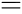) means that all that is to the left of  is equal to all that is to the right of . To keep this equality statement true, **for every change you apply to the left side of the equation, you must apply the same change to the right side of the equation**.

To find , we need to manipulate the original equation into its final form, simplifying it step by step until it can’t be simplified any further. The only requirement is that the manipulations we make transform one true equation into another true equation. In this example, the first simplifying step is to add the number four to both sides of the equation:

which simplifies to

Now the expression looks simpler, yes? How did I know to perform this operation? I wanted to “undo” the effects of the operation . We undo an operation by applying its _inverse_. In the case where the operation is the subtraction of some amount, the inverse operation is the addition of the same amount. We’ll learn more about function inverses in[Section 1.4](./Chapter 1_ Math fundamentals.md).

We’re getting closer to our goal of _isolating_  on one side of the equation, leaving only numbers on the other side. The next step is to undo the square  operation. The inverse operation of squaring a number  is to take its square root , so that’s what we’ll do next. We obtain

Notice how we applied the square root to both sides of the equation? If we don’t apply the same operation to both sides, we’ll break the equality!

The equation  simplifies to

What’s up with the vertical bars around ? The notation  stands for the _absolute value_ of , which is the same as  except we ignore the sign that indicates whether  is positive or negative. For example  and , too. The equation  indicates that both  and  satisfy the equation . Seven squared is 49, , and negative seven squared is also 49, , because the two negative signs cancel each other out.

The final solutions to the equation  are

Yes, there are _two_ possible answers. You can check that both of the above values of  satisfy the initial equation .

If you are comfortable with all the notions of high school math and you feel you could have solved the equation  on your own, then you can skim through this chapter quickly. If on the other hand you are wondering how the squiggle killed the power two, then this chapter is for you! In the following sections we will review all the essential concepts from high school math that you will need to power through the rest of this book. First, let me tell you about the different kinds of numbers.

##[1.2 Numbers](./Chapter 1_ Math fundamentals.md)

In the beginning, we must define the main players in the world of math: numbers.

###[Definitions](./Front matter.md)

Numbers are the basic objects we use to count, measure, quantify, and calculate things. Mathematicians like to classify the different kinds of number-like objects into categories called _sets_:

-   The natural numbers: 
-   The integers: 
-   The rational numbers: 
-   The real numbers: 
-   The complex numbers: 

These categories of numbers should be somewhat familiar to you. Think of them as neat classification labels for everything that you would normally call a number. Each group in the above list is a _set_. A set is a collection of items of the same kind. Each collection has a name and a precise definition for which items belong in that collection. Note also that each of the sets in the list contains all the sets above it, as illustrated in[Figure 1.2](./Chapter 1_ Math fundamentals.md). For now, we don’t need to go into the details of[sets and set notation](./Chapter 1_ Math fundamentals.md), but we do need to be aware of the different sets of numbers.

Figure 1.2: An illustration of the nested containment structure of the different number sets. The set of natural numbers is contained in the set of integers, which in turn is contained in the set of rational numbers. The set of rational numbers is contained in the set of real numbers, which is contained in the set of complex numbers.

Why do we need so many different sets of numbers? Each set of numbers is associated with more and more advanced mathematical problems.

The simplest numbers are the natural numbers , which are sufficient for all your math needs if all you’re going to do is _count_ things. How many goats? Five goats here and six goats there so the total is 11 goats. The sum of any two natural numbers is also a natural number.

As soon as you start using _subtraction_ (the inverse operation of addition), you start running into negative numbers, which are numbers outside the set of natural numbers. If the only mathematical operations you will ever use are _addition_ and _subtraction_, then the set of integers  will be sufficient. Think about it. Any integer plus or minus any other integer is still an integer.

You can do a lot of interesting math with integers. There is an entire field in math called _number theory_ that deals with integers. However, to restrict yourself solely to integers is somewhat limiting—a rotisserie menu that offers  of a chicken would be totally confusing.

If you want to use division in your mathematical calculations, you’ll need the rationals . The set of rational numbers corresponds to all numbers that can be expressed as _fractions_ of the form  where  and  are integers, and . You can add, subtract, multiply, and divide rational numbers, and the result will always be a rational number. However, even the rationals are not enough for all of math!

In geometry, we can obtain _irrational_ quantities like  (the diagonal of a square with side 1) and  (the ratio between a circle’s circumference and its diameter). There are no integers  and  such that , therefore we say that  is _irrational_ (not in the set ). An irrational number has an infinitely long decimal expansion that doesn’t repeat. For example, 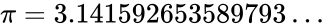 where the dots indicate that the decimal expansion of  continues all the way to infinity.

Combining the irrational numbers with the rationals gives us all the useful numbers, which we call the set of real numbers 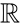. The set  contains the integers, the rational numbers , as well as irrational numbers like 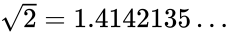. By using the reals you can compute pretty much anything you want. From here on in the text, when I say _number_, I mean an element of the set of real numbers .

The only thing you can’t do with the reals is to take the square root of a negative number—you need the complex numbers 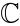 for that. We defer the discussion on complex numbers until[Section 1.14](./Chapter 1_ Math fundamentals.md).

### [Operations on numbers](./Front matter.md)

#### [Addition](./Front matter.md)

You can add numbers. I’ll assume you’re familiar with this stuff:

You can visualize numbers as sticks of different length. Adding numbers is like adding sticks together: the resulting stick has a length equal to the sum of the lengths of the constituent sticks, as illustrated in[Figure 1.3](./Chapter 1_ Math fundamentals.md).

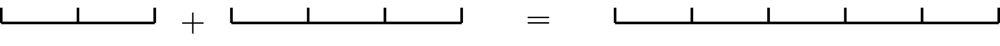

Figure 1.3: The addition of numbers corresponds to adding lengths.

Addition is _commutative_, which means that . In other words, the order of the numbers in a summation doesn’t matter. It is also _associative_, which means that if you have a long summation like  you can compute it in any order  or , and you’ll get the same answer.

#### [Subtraction](./Front matter.md)

Subtraction is the inverse operation of addition:

Unlike addition, subtraction is not a commutative operation. The expression  is not equal to the expression , or written mathematically:

Instead we have , which shows that changing the order of  and  in the expression changes its sign.

Subtraction is not associative either:

For example  while .

####[Multiplication](./Front matter.md)

You can also multiply numbers together:

Note that multiplication can be defined in terms of repeated addition.

The visual way to think about multiplication is as an area calculation. The area of a rectangle of width  and height  is equal to . A rectangle with a height equal to its width is a square, and this is why we call 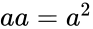 “ squared.”

Figure 1.4: The area of a rectangle with width  m and height  m is equal to m, which is equivalent to six squares with area m each.

Multiplication of numbers is also commutative, 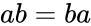, and associative, . In modern math notation, no special symbol is required to denote multiplication; we simply put the two factors next to each other and say the multiplication is _implicit_. Some other ways to denote multiplication are , , and, on computer systems, .

####[Division](./Front matter.md)

Division is the inverse operation of multiplication.

Whatever  is, you need to divide it into  equal parts and take one such part.

Division is not a commutative operation since  is not equal to . Division is not associative either: . For example, when , , and , we get  while .

Note that you cannot divide by . Try it on your calculator or computer. It will say “`error divide by zero`” because this action simply doesn’t make sense. After all, what would it mean to divide something into zero equal parts?

####[Exponentiation](./Front matter.md)

The act of multiplying a number by itself many times is called _exponentiation_. We denote “ exponent ” using a superscript, where  is the number of times the base  is multiplied by itself:

In words, we say “ raised to the power of .”

To visualize how exponents work, we can draw a connection between the value of exponents and the dimensions of geometric objects.[Figure 1.5](./Chapter 1_ Math fundamentals.md) illustrates how the same length  corresponds to different geometric objects when raised to different exponents. The number  corresponds to a line segment of length two, which is a geometric object in a one-dimensional space. If we add a line segment of length two in a second dimension, we obtain a square with area  in a two-dimensional space. Adding a third dimension, we obtain a cube with volume  in a three-dimensional space. Indeed, raising a base  to the exponent  is commonly called “ squared,” and raising  to the power of  is called “ cubed.”

The geometrical analogy about one-dimensional quantities as lengths, two-dimensional quantities as areas, and three-dimensional quantities as volumes is good to keep in mind.

Figure 1.5: Geometric interpretation for exponents , , and . A length raised to exponent  corresponds to the area of a square. The same length raised to exponent  corresponds to the volume of a cube.

Our visual intuition works very well up to three dimensions, but we can use other means of visualizing higher exponents, as demonstrated in[Figure 1.6](./Chapter 1_ Math fundamentals.md).

Figure 1.6: Visualization of numbers raised to different exponents. Each box in this grid contains  dots, where the base  varies from one through five, and the exponent  varies from one through five. In the first row we see that the number  raised to any exponent is equal to itself. The second row corresponds to the base  so the number of dots doubles each time we increase the exponent by one. Starting from  in the first column, we end up with  in the last column. The rest of the rows show how exponentiation works for different bases.

###[Operator precedence](./Front matter.md)

There is a standard convention for the order in which mathematical operations must be performed. The basic algebra operations have the following precedence:

1.  Parentheses
2.  Exponents
3.  Multiplication and Division
4.  Addition and Subtraction

If you’re seeing this list for the first time, the acronym PEMDAS and the associated mnemonic “Please Excuse My Dear Aunt Sally,” might help you remember the order of operations.

For instance, the expression  is interpreted as “First find the square of , then multiply it by , and then add .” Parentheses are needed to carry out the operations in a different order: to multiply  times  first and _then_ take the square, the equation should read , where parentheses indicate that the square acts on  as a whole and not on  alone.

###[Exercises](./Front matter.md)

E1.1 Solve for the unknown  in the following equations:

**a)**  **b)** 

**c)**  **d)** 

E1.2 Indicate all the number sets the following numbers belong to.

**a)**  **b)**  **c)**  **d)**  **e)** 

E1.3 Calculate the values of the following expressions:

**a)**  **b)**  **c)** 

##[1.3 Variables](./Chapter 1_ Math fundamentals.md)

In math we use a lot of _variables_ and _constants_, which are placeholder names for _any_ number or unknown. Variables allow us to perform calculations without knowing all the details.

#####[Example](./Front matter.md)

You’re having tacos for lunch today and wondering how many you can eat without going over your caloric budget. Your goal is to eat 800 calories for lunch and you want to do the calculation before getting to the restaurant because you fear your math abilities might be affected in the presence of tacos. You’re not sure how many calories each taco contains, so you invent the variable  to denote this unknown. You also define the variable  to represent the number of tacos you will eat, and come up with the equation  to represent the total number of calories of your lunch. Solving for , you find the total number of tacos you should order is . If the restaurant serves tacos that contain  calories each, then you should order  of them. If the restaurant serves only giant tacos worth  calories each, then you can only eat  of them. Observe we were able to solve for  even before knowing the value of .

###[Variable names](./Front matter.md)

There are common naming patterns for variables:

-   : name used for the unknown in equations. We also use  to denote function inputs and the position of objects in physics.
-   : common names for integer variables
-   : letters near the beginning of the alphabet are often used to denote constants (fixed quantities that do not change).
-   : the Greek letters _theta_ and _phi_ are used to denote angles
-   : costs in business, along with 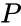 for profit, and  for revenue
-   : capital letters are used to denote random variables in probability theory

###[Variable substitution](./Front matter.md)

We can often _change variables_ and replace one unknown variable with another to simplify an equation. For example, say you don’t feel comfortable around square roots. Every time you see a square root, you freak out until one day you find yourself taking an exam trying to solve for  in the following equation:

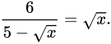

Don’t freak out! In crucial moments like this, substitution can help with your root phobia. Just write, “Let ” on your exam, and voila, you can rewrite the equation in terms of the variable :

which contains no square roots.

The next step to solve for  is to undo the division operation. Multiply both sides of the equation by  to obtain

which simplifies to

This can be rewritten as the equation , which in turn can be rewritten as  using the techniques we’ll learn in[Section 1.6](./Chapter 1_ Math fundamentals.md).

We now see that the solutions are  and . The last step is to convert our \-answers into \-answers by using , which is equivalent to . The final answers are  and . Try plugging these  values into the original square root equation to verify that they satisfy it.

###[Compact notation](./Front matter.md)

Symbolic manipulation is a powerful tool because it allows us to manage complexity. Say you’re solving a physics problem in which you’re told the mass of an object is  kg. If there are many steps in the calculation, would you rather use the number  kg in each step, or the shorter symbol ? It’s much easier to use  throughout your calculation, and wait until the last step to substitute the value  kg when computing the final numerical answer.

##[1.4 Functions and their inverses](./Chapter 1_ Math fundamentals.md)

As we saw in the section on solving equations, the ability to “undo” functions is a key skill for solving equations.

#####[Example](./Front matter.md)

Suppose we’re solving for  in the equation

where  is some function and  is some constant. We’re looking for the unknown  such that 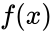 equals . Our goal is to isolate  on one side of the equation, but the function  stands in our way.

By using the _inverse function_ (denoted ) we “undo” the effects of . We apply the inverse function  to both sides of the equation to obtain

By definition, the inverse function  performs the opposite action of the function , so together the two functions cancel each other out. We have  for any number .

Provided everything is kosher (the function  must be defined for the input ), the manipulation we made above is valid and we have obtained the answer .

The above example introduces the notation  for denoting the inverse function. This notation is inspired by the notation for reciprocals. Recall that multiplication by the reciprocal number  is the inverse operation of multiplication by the number : . In the case of functions, however, the negative-one exponent does not refer to “one over-” as in ; rather, it refers to the inverse function. In other words, the number  is equal to the number  such that . Be careful: sometimes an equation can have multiple solutions. For example, the function  maps two input values ( and ) to the same output value . The inverse function of  is , but both  and  are solutions to the equation . In this case, this equation’s solutions can be indicated in shorthand notation as .

###[Formulas](./Front matter.md)

Here is a list of common functions and their inverses:

![\begin{align*}
\textrm{function } f(x)      	
& \; \; \Leftrightarrow \; \;      \textrm{inverse } f^{-1}(x)           \\
x+2		& \; \; \Leftrightarrow \; \;      x-2			\\
2x		& \; \; \Leftrightarrow \; \;      \tfrac{1}{2}x		\\
-1x		& \; \; \Leftrightarrow \; \;      -1x			\\
x^2		& \; \; \Leftrightarrow \; \;      \pm\sqrt{x}		\\
2^x		& \; \; \Leftrightarrow \; \;      \log_{2}(x)		\\
3x+5		& \; \; \Leftrightarrow \; \;      \tfrac{1}{3}(x-5)	\\ 
a^x		& \; \; \Leftrightarrow \; \;      \log_a(x)		\\
\exp(x)= e^x	& \; \; \Leftrightarrow \; \;      \ln(x)=\log_e(x)	\\
\sin(x)		& \; \; \Leftrightarrow \; \;      \sin^{-1}(x)=\arcsin(x) \\
\cos(x)		& \; \; \Leftrightarrow \; \;      \cos^{-1}(x)=\arccos(x)
\end{align*}](./images/4a3a851947f771e70dd73375dd381272ed087ab5.png)

The function-inverse relationship is _symmetric_—if you see a function on one side of the above table (pick a side, any side), you’ll find its inverse on the opposite side.

Don’t be surprised to see  in the list of function inverses. Indeed, the opposite operation of multiplying by  is to multiply by  once more: ().

####[Example 1](./Front matter.md)

If you want to solve the equation , you can apply the inverse function of , which is . After adding four to both sides of the equation, , we obtain the answer .

####[Example 2](./Front matter.md)

Let’s say your teacher doesn’t like you and right away, on the first day of class, he gives you a serious equation and tells you to find :

See what I mean when I say the teacher doesn’t like you?

First, note that it doesn’t matter what  (the Greek letter _psi_) is, since  is on the other side of the equation. You can keep copying  from line to line, until the end, when you throw the ball back to the teacher. “My answer is in terms of _your_ variables, dude. _You_ go figure out what the hell  is since you brought it up in the first place!” By the way, it’s not actually recommended to quote me verbatim should a situation like this arise. The same goes with . If you don’t have a calculator handy, don’t worry about it. Keep the expression  instead of trying to find its numerical value. In general, try to work with variables as much as possible and leave the numerical computations for the last step.

Okay, enough beating about the bush. Let’s just find  and get it over with! On the right-hand side of the equation, we have the sum of a bunch of terms with no  in them, so we’ll leave them as they are. On the left-hand side, the outermost function is a logarithm base . Cool. Looking at the table of inverse functions, we find the exponential function is the inverse of the logarithm: . To get rid of , we must apply the exponential function base 5 to both sides:

which simplifies to

since  cancels .

From here on, it is going to be as if Bruce Lee walked into a place with lots of bad guys. Addition of  is undone by subtracting  on both sides:

To undo a square root we take the square:

Add  to both sides,

divide by 

and square again to find the final answer:

![\begin{align*}
x 
&= \left[\frac{1}{6}\left(\left(5^{ 34+\sin(8)-\Psi(1) } - 3\right)^2+7\right) \right]^2.
\end{align*}](../Images/260699908a4fde58813cd308ace45dd5426bc5a9.png)

Did you see what I was doing in each step? Next time a function stands in your way, hit it with its inverse so it knows not to challenge you ever again.

###[Discussion](./Front matter.md)

The recipe I have outlined above is not universally applicable. Sometimes  isn’t alone on one side. Sometimes  appears in several places in the same equation. In these cases, you can’t effortlessly work your way, Bruce Lee-style, clearing bad guys and digging toward —you need other techniques.

The bad news is there’s no general formula for solving complicated equations. The good news is the above technique of “digging toward the ” is sufficient for 80% of what you are going to be doing. You can get another 15% if you learn how to solve the quadratic equation:

We’ll show a formula for solving quadratic equations in[Section 1.6](./Chapter 1_ Math fundamentals.md). Solving cubic equations like  using a formula is also possible, but at this point you might as well start using a computer to solve for the unknowns.

There are all kinds of other equations you can learn how to solve: equations with multiple variables, equations with logarithms, equations with exponentials, and equations with trigonometric functions. The principle of “digging” toward the unknown by applying inverse functions is the key for solving all these types of equations, so be sure to practice using it.

###[Exercises](./Front matter.md)

E1.4 Solve for  in the following equations:

**a)**  **b)**  **c)** 

E1.5 Find the function inverse and use it to solve the problems.

**a)**-    Solve the equation , where .
**b)**-    Solve for  in the equation , given .

##[1.5 Basic rules of algebra](./Chapter 1_ Math fundamentals.md)

It’s important that you know the general rules for manipulating numbers and variables, a process otherwise known as—you guessed it—_algebra_. This little refresher will cover these concepts to make sure you’re comfortable on the algebra front. We’ll also review some important algebraic tricks, like _factoring_ and _completing the square_, which are useful when solving equations.

Let’s define some terminology for referring to different parts of math expressions. When an expression contains multiple things added together, we call those things _terms_. Furthermore, terms are usually composed of many things multiplied together. When a number  is obtained as the product of other numbers like , we say “ factors into , , and .” We call , , and  the _factors_ of .

Figure 1.7: Diagram showing the names used to describe the different parts of the equation .

Given any three numbers , , and , we can apply the following algebraic properties:

1.  Associative property:  and 
2.  Commutative property:  and 
3.  Distributive property: 

We use the distributive property every time we _expand_ brackets. For example . The brackets, also known as parentheses, indicate the expression  must be treated as a whole; as a factor consisting of three terms. Multiplying this expression by  is the same as multiplying each term by .

The opposite operation of expanding is called _factoring_, which consists of rewriting the expression with the common parts taken out in front of a bracket: . In this section, we’ll discuss all algebra operations and illustrate what they’re capable of.

#####[Example](./Front matter.md)

Suppose we are asked to solve for  in the equation

Since the unknown  appears on both sides of the equation, it is not immediately obvious how to proceed.

To solve for , we can bring all  terms to one side and all constant terms to the other side. First, expand the two brackets to obtain

Then move things around to relocate all s to the equation’s right-hand side and all constants to the left-hand side:

We see  is contained in both terms on the right-hand side, so we can “factor it out” by rewriting the equation as

The answer is within close reach: .

###[Expanding brackets](./Front matter.md)

To _expand_ a bracket is to multiply each term inside the bracket by the factor outside the bracket. The key thing to remember when expanding brackets is to apply the _distributive_ property: . For longer expressions, we may need to apply the distributive property several times, until there are no more brackets left:

After expanding the brackets in this expression, we end up with six terms—one term for each of the six possible combinations of products between the terms in  and the terms in .

The distributive property is often used to manipulate expressions containing different powers of the variable . For instance,

We can use the commutative property on the second term , then combine the two  terms into a single term to obtain

The bracket-expanding and simplification techniques demonstrated above are very common in math, and I recommend you solve some algebra practice problems to get the hang of them. Most math textbooks skip simplification steps and jump straight to the answer, since they assume readers are capable of doing simplifications on their own. It would be too long (and annoying) to show the simplifications for each expression. For example, the sentence “We can rewrite  as ,” is the short version of the longer sentence, “We can apply the distributive property twice on  then combine the terms with the same power of  to get .”

It’s not unusual for people to make math mistakes when expanding brackets and manipulating long algebra expressions. To avoid mistakes, use a step-by-step approach and apply only one operation in each step. Write legibly and keep the equations “organized” so it’s easy to check the calculations performed in each step. Consider this slightly-more-complicated algebraic expression and its expansion:

Note how we sorted the terms in the final expression according to the different powers of , with the terms containing  grouped together, and the terms containing  grouped together. This approach helps keep things organized when dealing with expressions containing many terms.

###[Factoring](./Front matter.md)

Factoring involves “taking out” the common parts of a complicated expression in order to make the expression more compact. Suppose we’re given the expression . We can simplify this expression by taking out the common factors and moving them in front of a bracket. Let’s see how to do this, step by step.

The expression  has two terms. Let’s split each term into its constituent factors:

Since factors  and  appear in both terms, we can _factor them out_ like this:

The expression on the right shows  is common to both terms.

Here’s another example of factoring—notice the common factors are taken out and moved in front of the bracket:

###[Factoring quadratic expressions](./Front matter.md)

A _quadratic expression_ is an expression of the form . The expression contains a _quadratic term_ , a _linear term_ , and a constant term . The numbers , , and  are called _coefficients_: the quadratic coefficient is , the linear coefficient is , and the constant coefficient is .

To _factor_ the quadratic expression  is to rewrite it as the product of a constant and two factors like  and :

Rewriting quadratic expressions in factored form helps us better understand and describe their properties.

#####[Example](./Front matter.md)

Suppose we’re asked to describe the properties of the function . Specifically, we’re asked to find the function’s _roots_, which are the values of  for which the function equals zero.

Factoring the expression  helps us see its properties more clearly, and makes our job of finding the roots of  easier. The factored form of this quadratic expression is

Now we can see at a glance that the values of  for which  are  and . When , the factor  is zero and hence . Similarly, when , the factor  is zero so .

How did we know that the factors of  are  and  in the above example? For simple quadratics like the one above, we can simply _guess_ the values of  and  in the equation . Before we start guessing, let’s look at the expanded version of the product between  and :

Note the linear term on the right-hand side contains the sum of the unknowns , while the constant term contains their product . If we want the equation  to hold, we must find two numbers  and  whose sum equals  and whose product equals . After a couple of attempts we find  and . This guessing approach is an effective strategy for many of the factoring problems we will likely be asked to solve, since math teachers often choose simple numbers like , , , or  for the constants  and . For more complicated quadratic expressions, we’ll need to use the quadratic formula, which we’ll talk about in[Section 1.6](./Chapter 1_ Math fundamentals.md).

####[Common quadratic forms](./Front matter.md)

Let’s look at some common variations of quadratic expressions you might encounter when doing algebra calculations.

The quadratic expression  is called a _difference of squares_, and it can be obtained by multiplying the factors  and :

There’s no linear term because the  term cancels the  term. Any time you see an expression like , you can know it comes from a product of the form .

A _perfect square_ is a quadratic expression that can be written as the product of repeated factors :

Note  is also a perfect square.

###[Completing the square](./Front matter.md)

In this section we’ll learn about an ancient algebra technique called _completing the square_, which allows us to rewrite _any_ quadratic expression of the form  as a perfect square plus some constant correction factor . This algebra technique was described in one of the first books on _al-jabr_ (algebra), written by Al-Khwarizmi around the year 800 CE. The name “completing the square” comes from the ingenious geometric construction used by this procedure. Yes, we can use geometry to solve algebra problems!

We assume the starting point for the procedure is a quadratic expression whose quadratic coefficient is one, , and use capital letters  and  to denote the linear and constant coefficients. The capital letters are to avoid any confusion with the quadratic expression , for which . Note we can always write  as  and apply the procedure to the expression inside the brackets, identifying  with  and  with .

First let’s rewrite the quadratic expression  by splitting the linear term into two equal parts:

We can interpret the first three terms geometrically as follows: the  term corresponds to a square with side length , while the two  terms correspond to rectangles with sides  and . See the left side of[Figure 1.8](./Chapter 1_ Math fundamentals.md) for an illustration.

Figure 1.8: To complete the square in the expression , we need to add the quantity , which corresponds to a square (shown in darker colour) with sides equal to half the coefficient of the linear term. We also subtract  so the overall value of the expression remains unchanged.

The square with area  and the two rectangles can be positioned to form a larger square with side length . Note there’s a small piece of sides  by  missing from the corner. To _complete the square_, we can add a term  to this expression. To preserve the equality, we also subtract  from the expression to obtain:

The right-hand side of this equation describes the area of the square with side length , minus the area of the small square , plus the constant , as illustrated on the right side of[Figure 1.8](./Chapter 1_ Math fundamentals.md).

We can summarize the entire procedure in one equation:

There are two things to remember when you want to apply the complete-the-square trick: (1) choose the constant inside the bracket to be  (half of the linear coefficient), and (2) subtract  outside the bracket in order to keep the equation balanced.

####[Solving quadratic equations](./Front matter.md)

Suppose we want to solve the quadratic equation . It’s not possible to solve this equation with the digging-toward-the- approach from[Section 1.1](./Chapter 1_ Math fundamentals.md) (since  appears in both the quadratic term  and the linear term ). Enter the completing-the-square trick!

#####[Example](./Front matter.md)

Let’s find the solutions of the equation . The coefficient of the linear term is , so we choose  for the constant inside the bracket, and subtract  outside the bracket to keep the equation balanced. Completing the square gives

Next we use fraction arithmetic to simplify the constant terms in the expression: .

We’re left with the equation

which we can now solve by digging toward . First move  to the right-hand side to get . Then take the square root on both sides to obtain , which simplifies to . The two solutions are  and . You can verify these solutions by substituting the values in the original equation  and similarly . Congratulations, you just solved a quadratic equation using a 1200-year-old algebra technique!

In the next section, we’ll learn how to leverage the complete-the-square trick to obtain a general-purpose formula for quickly solving quadratic equations.

###[Exercises](./Front matter.md)

E1.6 Factor the following quadratic expressions:

**a)**  **b)**  **c)** 

Guess the values  and  in the expression .

E1.7 Solve the equations by completing the square.

**a)**  **b)** 

##[1.6 Solving quadratic equations](./Chapter 1_ Math fundamentals.md)

What would you do if asked to solve for  in the quadratic equation ? This is called a _quadratic equation_ since it contains the unknown variable  squared. The name comes from the Latin _quadratus_, which means square. Quadratic equations appear often, so mathematicians created a general formula for solving them. In this section, we’ll learn about this formula and use it to put some quadratic equations in their place.

Before we can apply the formula, we need to rewrite the equation we are trying to solve in the following form:

This is called the _standard form_ of the quadratic equation. We obtain this form by moving all the numbers and s to one side and leaving only  on the other side. For example, to transform the quadratic equation  into standard form, we subtract  from both sides of the equation to obtain . What are the values of  that satisfy this equation?

####[Quadratic formula](./Front matter.md)

The solutions to the equation  for  are

The quadratic formula is usually abbreviated , where the sign “” stands for both “” and “.” The notation “” allows us to express both solutions  and  in one equation, but you should keep in mind there are really two solutions.

Let’s see how the quadratic formula is used to solve the equation . Finding the two solutions requires the simple mechanical task of identifying , , and , then plugging these values into the two parts of the formula:

We can easily verify that value  and  both satisfy the original equation .

####[Proof of the quadratic formula](./Front matter.md)

Every claim made by a mathematician comes with a _proof_, which is a step-by-step argument that shows why the claim is true. It’s easy to see where a proof starts and where a proof ends in mathematical texts. Each proof begins with the heading _Proof_ (usually in italics) and has the symbol “” at its end. The purpose of these demarcations is to give readers the option to skip the proof. It’s not necessary to read and understand the proofs of all math statements, but reading proofs can often lead you to a more solid understanding of the material.

I want you to see the proof of the quadratic formula because it’s an important result that you’ll use very often to solve math problems. Reading the proof will help you understand where the quadratic formula comes from. The proof relies on the completing-the-square technique from the previous section, and some basic algebra operations. You can totally handle this!

We’re starting from the quadratic equation , and we’re making the additional assumption that . We want to find the value or values of  that satisfy this equation.

The first thing we want to do is divide by  to obtain the equivalent equation

We are allowed to divide by  since we assumed that .

Next we apply the _complete the square_ trick to the quadratic expression, to obtain an equivalent expression of the form . Recall that the trick for completing the square is to choose the number inside the bracket to be half the coefficient of the linear term of the quadratic expression, which is  in this case. We must also subtract the square of this term outside the bracket in order to maintain the equality. After completing the square, we’re left with the following equation:

From here, we use the standard digging-toward-the- procedure. Move all constants to the right-hand side,

and take the square root of both sides to undo the square function:

Since any number and its opposite have the same square, taking the square root gives us two possible solutions, which we denote using the “” symbol.

Next we subtract  from both sides of the equation to isolate  and obtain . We tidy up the mess under the square root, , and add the fractions on the right-hand side to obtain . The solutions to the quadratic equation  are

This completes the proof of the quadratic formula.

The expression  is called the _discriminant_ of the equation. The discriminant tells us important information about the solutions of the equation . The solutions  and  correspond to real numbers if the discriminant is positive or zero: . When the discriminant is zero (), the equation has only one solution since . If the discriminant is negative, , the quadratic formula requires computing the square root of a negative number, which is not allowed for real numbers.

####[Alternative proof](./Front matter.md)

To prove the quadratic formula, we don’t necessarily need to show the algebra steps we followed to obtain the formula as outlined above. The quadratic formula states that  and  are solutions. To prove the formula is correct we can simply plug  and  into the equation  to verify that  and  are solutions. Verify this on your own.

###[Applications](./Front matter.md)

####[The golden ratio](./Front matter.md)

The _golden ratio_ is an essential proportion in geometry, art, aesthetics, biology, and mysticism, and is usually denoted as . This ratio is determined as the positive solution to the quadratic equation

Applying the quadratic formula to this equation yields two solutions,

You can learn more about the various contexts in which the golden ratio appears from the[Wikipedia article](./Golden_ratio.md) on the subject.

###[Explanations](./Front matter.md)

####[Multiple solutions](./Front matter.md)

Often, we are interested in only one of the two solutions to the quadratic equation. It will usually be obvious from the context of the problem which of the two solutions should be kept and which should be discarded. For example, the _time of flight_ of a ball thrown in the air from a height of  metres with an initial velocity of  metres per second is obtained by solving the equation . The two solutions of the quadratic equation are  and . The first answer  corresponds to a time in the past so we reject it as invalid. The correct answer is . The ball will hit the ground after  seconds.

####[Relation to factoring](./Front matter.md)

In the previous section we discussed the _quadratic factoring_ operation by which we could rewrite a quadratic function as the product of a constant and two factors:

The two numbers  and  are called the _roots_ of the function: these points are where the function  touches the \-axis.

You now have the ability to factor any quadratic equation: use the quadratic formula to find the two solutions,  and , then rewrite the expression as .

Some quadratic expressions cannot be factored, however. These “unfactorable” expressions correspond to quadratic functions whose graphs do not touch the \-axis. They have no real solutions (no roots). There is a quick test you can use to check if a quadratic function  has roots (touches or crosses the \-axis) or doesn’t have roots (never touches the \-axis). If  then the function  has two roots. If , the function has only one root, indicating the special case when the function touches the \-axis at only one point. If , the function has no roots. In this case, the quadratic formula fails because it requires taking the square root of a negative number, which is not allowed (for now). We’ll come back to the idea of taking square roots of negative numbers in[Section 1.14](./Chapter 1_ Math fundamentals.md) (see page 1.14).

###[Links](./Front matter.md)

\[ Algebra explanation of the quadratic formula \][`https://www.youtube.com/watch?v=r3SEkdtpobo`](./watch_v=r3SEkdtpobo.md)

\[ Visual explanation of the quadratic formula derivation \][`https://www.youtube.com/watch?v=EBbtoFMJvFc`](./watch_v=EBbtoFMJvFc.md)

###[Exercises](./Front matter.md)

E1.8 Solve for  in the quadratic equation .

E1.9 Solve for  in the equation .

Use the substitution .

##[1.7 The Cartesian plane](./Chapter 1_ Math fundamentals.md)

The Cartesian plane, named after famous philosopher and mathematician René Descartes, is used to visualize pairs of numbers .

Consider first the _number line_ representation for numbers.

Figure 1.9: Every real number  corresponds to a point on the number line. The number line extends indefinitely to the left (toward negative infinity) and to the right (toward positive infinity).

The Cartesian plane is the two-dimensional generalization of the number line. Generally, we call the plane’s horizontal axis “the \-axis” and its vertical axis “the \-axis.” We put notches at regular intervals on each axis so we can measure distances.

Figure 1.10: Every point in the Cartesian plane corresponds to a pair of real numbers . Points , vectors , and graphs of functions  live here.

[Figure 1.10](./Chapter 1_ Math fundamentals.md) is an example of an empty Cartesian coordinate system. Think of the coordinate system as an empty canvas. What can you draw on this canvas?

###[Vectors and points](./Front matter.md)

A _point_  in the Cartesian plane has an \-coordinate and a \-coordinate. To find this point, start from the origin—the point (0,0)—and move a distance  on the \-axis, then move a distance  on the \-axis.

Figure 1.11: A Cartesian plane which shows the point  and the vectors  and .

Similar to a point, a vector  is a pair of coordinates. Unlike points, we don’t necessarily start from the plane’s origin when mapping vectors. We draw vectors as arrows that explicitly mark where the vector starts and where it ends.

Note that vectors  and  illustrated in[Figure 1.11](./Chapter 1_ Math fundamentals.md) are actually the _same_ vector—the “displace left by 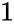 and down by ” vector. It doesn’t matter where you draw this vector, it will always be the same whether it begins at the plane’s origin or elsewhere.

###[Graphs of functions](./Front matter.md)

The Cartesian plane is great for visualizing functions. You can think of a function as a set of input-output pairs . You can draw the _graph_ of a function by letting the \-coordinate represent the function’s output value:

For example, with the function , we can pass a line through the set of points

and obtain the graph shown in[Figure 1.12](./Chapter 1_ Math fundamentals.md).

Figure 1.12: The graph of the function  consists of all pairs of points  in the Cartesian plane that satisfy .

When plotting functions by setting , we use a special terminology for the two axes. The \-axis represents the _independent_ variable (the one that varies freely), and the \-axis represents the _dependent_ variable , since  depends on .

To draw the graph of any function , use the following procedure. Imagine making a sweep over all of the possible input values for the function. For each input , put a point at the coordinates  in the Cartesian plane. Using the graph of a function, you can literally _see_ what the function does: the “height”  of the graph at a given \-coordinate tells you the value of the function .

###[Dimensions](./Front matter.md)

The number line is one-dimensional. Every number  can be visualized as a point on the number line. The Cartesian plane has two dimensions: the  dimension and the  dimension. If we need to visualize math concepts in 3D, we can use a three-dimensional coordinate system with , , and  axes (see[Figure 1.55](./Chapter 1_ Math fundamentals.md) on page 1.55).

##[1.8 Functions](./Chapter 1_ Math fundamentals.md)

We need to have a relationship talk. We need to talk about functions. We use functions to describe the relationships between variables. In particular, functions describe how one variable _depends_ on another.

For example, the revenue  from a music concert depends on the number of tickets sold . If each ticket costs , the revenue from the concert can be written _as a function of_  as follows: . Solving for  in the equation  tells us the number of ticket sales needed to generate  in revenue. This is a simple model of a function; as your knowledge of functions builds, you’ll learn how to build more detailed models of reality. For instance, if you need to include a  processing charge for issuing the tickets, you can update the revenue model to . If the estimated cost of hosting the concert is , then the profit from the concert  can be modelled as

The function  models the profit from the concert as a function of the number of tickets sold. This is a pretty good model already, and you can always update it later as you learn more information.

The more functions you know, the more tools you have for modelling reality. To “know” a function, you must be able to understand and connect several of its aspects. First you need to know the function’s mathematical **definition**, which describes exactly what the function does. Starting from the function’s definition, you can use your existing math skills to find the function’s **properties**. You must also know the **graph** of the function; what the function looks like if you plot  versus  in the[Cartesian plane](./Chapter 1_ Math fundamentals.md). It’s also a good idea to remember the **values** of the function for some important inputs. Finally—and this is the part that takes time—you must learn about the function’s **relations** to other functions.

###[Definitions](./Front matter.md)

A _function_ is a mathematical object that takes numbers as inputs and produces numbers as outputs. We use the notation

to denote a function from the input set  to the output set . In this book, we mostly study functions that take real numbers as inputs and give real numbers as outputs: .

Figure 1.13: An abstract representation of a function  from the set  to the set . The function  is the arrow which _maps_ each input  in  to an output  in . The output of the function  is also denoted .

A function is not a number; rather, it is a _mapping_ from numbers to numbers. We say “ maps  to .” For any input , the output value of  for that input is denoted , which is read as “ of .”

We’ll now define some fancy technical terms used to describe the input and output sets of functions.

-   : the _source set_ of the function describes the types of numbers that the function takes as inputs.
-   : the _domain_ of a function is the set of allowed input values for the function.
    
-   : the _target set_ of a function describes the type of outputs the function has. The target set is sometimes called the _codomain_.
-   : the _image_ of the function is the set of all possible output values of the function. The image is sometimes called the _range_.

See[Figure 1.14](./Chapter 1_ Math fundamentals.md) for an illustration of these concepts. The purpose of introducing all this math terminology is so we’ll have words to distinguish the general types of inputs and outputs of the function (real numbers, complex numbers, vectors) from the specific properties of the function like its domain and image.

Figure 1.14: Illustration of the input and output sets of a function . The _source set_ is denoted  and the _domain_ is denoted . Note that the function’s domain is a subset of its source set. The _target set_ is denoted  and the _image_ is denoted . The image is a subset of the target set.

Let’s look at an example to illustrate the difference between the source set and the domain of a function. Consider the square root function  defined as , which is shown in[Figure 1.15](./Chapter 1_ Math fundamentals.md). The source set of  is the set of real numbers—yet only nonnegative real numbers are allowed as inputs, since  is not defined for negative numbers. Therefore, the domain of the square root function is only the nonnegative real numbers: . Knowing the domain of a function is essential to using the function correctly. In this case, whenever you use the square root function, you need to make sure that the inputs to the function are nonnegative numbers.

The complicated-looking expression between the curly brackets uses _set notation_ to define the set of nonnegative numbers . In words, the expression  states that “ is defined as the set of all real numbers  such that  is greater than or equal to zero.” We’ll discuss set notation in more detail in[Section 1.16](./Chapter 1_ Math fundamentals.md). For now, you can just remember that  represents the set of nonnegative real numbers.

Figure 1.15: The input and output sets of the function . The domain of  is the set of nonnegative real numbers  and its image is .

To illustrate the difference between the image of a function and its target set, let’s look at the function  shown in[Figure 1.16](./Chapter 1_ Math fundamentals.md). The quadratic function is of the form . The function’s source set is  (it takes real numbers as inputs) and its target set is  (the outputs are real numbers too); however, not all real numbers are possible outputs. The _image_ of the function  consists only of the nonnegative real numbers , since  for all .

Figure 1.16: The function  is defined for all reals: . The image of the function is the set of nonnegative real numbers: .

###[Function properties](./Front matter.md)

We’ll now introduce some additional terminology for describing three important function properties. Every function is a mapping from a source set to a target set, but what kind of mapping is it?

-   A function is _injective_ if it maps two different inputs to two different outputs. If  and  are two input values that are not equal , then the output values of an injective function will also not be equal .
-   A function is _surjective_ if its image is equal to its target set. For every output  in the target set of a surjective function, there is at least one input  in its domain such that .
-   A function is _bijective_ if it is both injective and surjective.

I know this seems like a lot of terminology to get acquainted with, but it’s important to have names for these function properties. We’ll need this terminology to give a precise definition of the _inverse function_ in the next section.

#####[Injective property](./Front matter.md)

We can think of _injective_ functions as pipes that transport fluids between containers. Since fluids cannot be compressed, the “output container” must be at least as large as the “input container.” If there are two distinct points  and  in the input container of an injective function, then there will be two distinct points  and  in the output container of the function as well. In other words, injective functions don’t smoosh things together.

In contrast, a function that doesn’t have the injective property can map several different inputs to the same output value. The function  is not injective since it sends inputs  and  to the same output value , as illustrated in[Figure 1.16](./Chapter 1_ Math fundamentals.md).

The maps-distinct-inputs-to-distinct-outputs property of injective functions has an important consequence: given the output of an injective function , there is only one input  such that . If a second input  existed that also leads to the same output 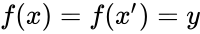, then the function  wouldn’t be injective. For each of the outputs  of an injective function , there is a _unique_ input  such that . In other words, injective functions have a unique-input-for-each-output property.

#####[Surjective property](./Front matter.md)

A function is _surjective_ if its outputs cover the entire target set: every number in the target set is a possible output of the function for some input. For example, the function  defined by  is surjective: for every number  in the target set , there is an input , namely ![x=\sqrt[3]{y}](../Images/0d6be0cd2c2fbb8d4b945b6757be26813435b107.png), such that . The function  is surjective since its image is equal to its target set, , as shown in[Figure 1.17](./Chapter 1_ Math fundamentals.md).

On the other hand, the function  defined by the equation  is not surjective since its image is only the nonnegative numbers  and not the whole set of real numbers (see[Figure 1.16](./Chapter 1_ Math fundamentals.md)). The outputs of this function do not include the negative numbers of the target set, because there is no real number  that can be used as an input to obtain a negative output value.

Figure 1.17: For the function  the image is equal to the target set of the function, , therefore the function  is surjective. The function  maps two different inputs  to two different outputs , so  is injective. Since  is both injective and surjective, it is a _bijective_ function.

#####[Bijective property](./Front matter.md)

A function is bijective if it is both injective and surjective. When a function  has both the injective and surjective properties, it defines a _one-to-one correspondence_ between the numbers of the source set  and the numbers of the target set . This means for every input value , there is exactly one corresponding output value , and for every output value , there is exactly one input value  such that . An example of a bijective function is the function  defined by  (see[Figure 1.17](./Chapter 1_ Math fundamentals.md)). For every input  in the source set , the corresponding output  is given by . For every output value  in the target set , the corresponding input value  is given by ![x=\sqrt[3]{y}](../Images/0d6be0cd2c2fbb8d4b945b6757be26813435b107.png).

A function is not bijective if it lacks one of the required properties. Examples of non-bijective functions are , which is not surjective and , which is neither injective nor surjective.

#####[Counting solutions](./Front matter.md)

Another way to understand the injective, surjective, and bijective properties of functions is to think about the solutions to the equation , where  is a number in the target set . The function  is injective if the equation  has _at most one_ solution for every number . The function  is surjective if the equation  has _at least one_ solution for every number . If the function  is bijective then it is both injective and surjective, which means the equation  has _exactly one_ solution.

###[Inverse function](./Front matter.md)

We used inverse functions repeatedly in previous chapters, each time describing the inverse function informally as an “undo” operation. Now that we have learned about bijective functions, we can give a the precise definition of the inverse function and explain some of the details we glossed over previously.

Recall that a _bijective_ function  is a _one-to-one correspondence_ between the numbers in the source set  and numbers in the target set : for every output , there is exactly one corresponding input value  such that . The _inverse function_, denoted , is the function that takes any output value  in the set  and finds the corresponding input value  that produced it .

Figure 1.18: The inverse  undoes the operation of the function .

For every bijective function , there exists an inverse function  that performs the _inverse mapping_ of . If we start from some , apply , and then apply , we’ll arrive—full circle—back to the original input :

In[Figure 1.18](./Chapter 1_ Math fundamentals.md) the function  is represented as a forward arrow, and the inverse function  is represented as a backward arrow that puts the value  back to the  it came from.

Similarly, we can start from any  in the set  and apply  followed by  to get back to the original  we started from:

In words, this equation tells us that  is the “undo” operation for the function , the same way  is the “undo” operation for .

If a function is missing the injective property or the surjective property then it isn’t bijective and it doesn’t have an inverse. Without the injective property, there could be two inputs  and  that both produce the same output . In this case, computing  would be impossible since we don’t know which of the two possible inputs  or  was used to produce the output . Without the surjective property, there could be some output  in  for which the inverse function  is not defined, so the equation  would not hold for all  in . The inverse function  exists only when the function  is bijective.

Wait a minute! We know the function  is not bijective and therefore doesn’t have an inverse, but we’ve repeatedly used the square root function as an inverse function for . What’s going on here? Are we using a double standard like a politician that espouses one set of rules publicly, but follows a different set of rules in their private dealings? Is mathematics corrupt?

Don’t worry, mathematics is not corrupt—it’s all legit. We can use inverses for non-bijective functions by imposing _restrictions_ on the source and target sets. The function  is not bijective when defined as a function , but it _is_ bijective if we define it as a function from the set of nonnegative numbers to the set of nonnegative numbers, . Restricting the source set to  makes the function injective, and restricting the target set to  also makes the function surjective. The function  defined by the equation  is bijective and its inverse is .

It’s important to keep track the of restrictions on the source set we applied when solving equations. For example, solving the equation  by restricting the solution space to nonnegative numbers will give us only the positive solution . We have to manually add the negative solution  in order to obtain the complete solutions:  or , which is usually written . The possibility of multiple solutions is present whenever we solve equations involving non-injective functions.

###[Function composition](./Front matter.md)

We can combine two simple functions by chaining them together to build a more complicated function. This act of applying one function after another is called _function composition_. Consider for example the composition:

Figure 1.19: The function composition  describes the combination of first applying the function , followed by the function : .

[Figure 1.19](./Chapter 1_ Math fundamentals.md) illustrates the concept of function composition. First, the function  acts on some input  to produce an intermediary value  in the set . The intermediary value  is then passed through the function  to produce the final output value  in the set . We can think of the _composite function_  as a function in its own right. The function  is defined through the formula .

Don’t worry too much about the “” symbol—it’s just a convenient math notation I wanted you to know about. Writing  is the same as writing . The important takeaway from[Figure 1.19](./Chapter 1_ Math fundamentals.md) is that functions can be combined by using the outputs of one function as the inputs to the next. This is a very useful idea for building math models. You can understand many complicated input-output transformations by describing them as compositions of simple functions.

#####[Example 1](./Front matter.md)

Consider the function  given by , and the function  defined by . The composite function  is defined for all nonnegative reals. The composite function  is defined for all real numbers, and we have .

#####[Example 2](./Front matter.md)

The composite functions  and  describe different operations. If  and , the functions  and  have different domains and produce different outputs, as you can verify using a calculator.

Using the notation “” for function composition, we can give a concise description of the properties of a bijective function  and its inverse function :

for all  in  and all  in .

###[Function names](./Front matter.md)

We use short symbols like , , 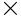, and  to denote most of the important functions used in everyday life. We also use the squiggle notation  for square roots and superscripts to denote exponents. All other functions are identified and denoted by their _name_. If I want to compute the _cosine_ of the angle  (a function describing the ratio between the length of one side of a right-angle triangle and the hypotenuse), I write , which means I want the value of the 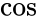 function for the input .

Incidentally, the function  has a nice output value for that specific angle: . Therefore, seeing  somewhere in an equation is the same as seeing . To find other values of the function, say , you’ll need a calculator. All scientific calculators have a convenient little  button for this very purpose.

###[Handles on functions](./Front matter.md)

When you learn about functions you learn about the different “handles” by which you can “grab” these mathematical objects. The main handle for a function is its **definition**: it tells you the precise way to calculate the output when you know the input. The function definition is an important handle, but it is also important to “feel” what the function does intuitively. How does one get a feel for a function?

####[Table of values](./Front matter.md)

One simple way to represent a function is to look at a list of input-output pairs: ,  , . A more compact notation for the input-output pairs is   , where the first number of each pair represents an input value and the second represents the output value given by the function.

We can also build a **table of values** by writing the input values in one column and recording the corresponding output values in a second column. You can choose inputs at random or focus on the important-looking  values in the function’s domain.

Table 1.1: Table of input-output values of the function . The input values ,  and  are chosen to “test” what the function does.

You can create a table of values for any function you want to study. Follow the example shown in[Table 1.1](./Chapter 1_ Math fundamentals.md). Use the input values that interest you and fill out the right side of the table by calculating the value of  for each input .

####[Function graph](./Front matter.md)

One of the best ways to feel a function is to look at its graph. A graph is a line on a piece of paper that passes through all input-output pairs of a function. Imagine you have a piece of paper, and on it you draw a blank _coordinate system_ as in[Figure 1.20](./Chapter 1_ Math fundamentals.md).

Figure 1.20: An empty \-coordinate system that you can use to draw function graphs. The graph of  consists of all the points for which . See[Figure 1.12](./Chapter 1_ Math fundamentals.md) on page 1.12 for the graph of .

The horizontal axis is used to measure . The vertical axis is used to measure . Because writing out  every time is long and tedious, we use a short, single-letter alias to denote the output value of  as follows:

Think of each input-output pair of the function  as a point  in the coordinate system. The graph of a function is a representational drawing of everything the function does. If you understand how to interpret this drawing, you can infer everything there is to know about the function.

####[Facts and properties](./Front matter.md)

Another way to feel a function is by knowing the function’s properties. This approach boils down to learning facts about the function and its connections to other functions. An example of a mathematical connection is the equation , which describes a link between the logarithmic function base  and the logarithmic function base .

The more you know about a function, the more “paths” your brain builds to connect to that function. Real math knowledge is not about memorization; it is about establishing a network of associations between different areas of information in your brain. See the concept maps on page 1 for an illustration of the paths that link math concepts. Mathematical thought is the usage of these associations to carry out calculations and produce mathematical arguments. For example, knowing about the connection between logarithmic functions will allow you compute the value of , even though calculators don’t have a button for logarithms base . We find , which can be computed using the  button.

To develop mathematical skills, it is vital to practice path-building between concepts by solving exercises. With this book, I will introduce you to some of the many paths linking math concepts, but it’s on you to reinforce these paths through practice.

#####[Example 3](./Front matter.md)

Consider the function  from the real numbers to the real numbers () defined as . The value of  when  is . When , the output is . What is the value of  when ? You can use algebra to rewrite this function as , which tells you the graph of this function crosses the \-axis at  and at . The values above will help you plot the graph of .

#####[Example 4](./Front matter.md)

Consider the exponential function with base 2 defined by . This function is crucial to computer systems. For instance, RAM memory chips come in powers of two because the memory space is exponential in the number of “address lines” used on the chip. When , . When  is 2 we have . The function is therefore described by the following input-output pairs: , , , , , , , , , 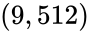, , , , etc. Recall that any number raised to exponent  gives . Thus, the exponential function passes through the point . Recall also that negative exponents lead to fractions, so we have the points , , , etc. You can plot these  coordinates in the Cartesian plane to obtain the graph of the function.

###[Discussion](./Front matter.md)

To describe a function we specify its source and target sets , then give an equation of the form  that defines the function. Since functions are defined using equations, does this mean that functions and equations are the same thing? Let’s take a closer look.

In general, any equation containing two variables describes a _relation_ between these variables. For example, the equation  describes a relation between the variables  and . We can isolate the variable  in this equation to obtain  and thus find the value of  when the value of  is given. We can also isolate  to obtain  and use this equation to find  when the value of  is given. In the context of an equation, the relationship between the variables  and  is symmetrical and no special significance is attached to either of the two variables.

We also can describe the same relationship between  and  as a function . We choose to identify  as the input variable and  as the output variable of the function . Having identified  with the output variable, we can interpret the equation  as the definition of the function .

Note that the equation  and the function  describe the same relationship between the variables  and . For example, if we set the value  we can find the value of  by solving the equation  to obtain , or by computing the output of the function  for the input , which gives us the same answer . In both cases we arrive at the same answer, but modelling the relationship between  and  as a function allows us to use the whole functions toolbox, like function composition and function inverses.

In this section we talked a lot about functions in general but we haven’t said much about any function specifically. There are many useful functions out there, and we can’t discuss them all here. In the next section, we’ll introduce  functions of strategic importance for all of science. If you get a grip on these functions, you’ll be able to understand all of physics and calculus and handle _any_ problem your teacher may throw at you.

##[1.9 Functions reference](./Chapter 1_ Math fundamentals.md)

Your _function vocabulary_ determines how well you can express yourself mathematically in the same way your English vocabulary determines how well you can express yourself in English. The following pages aim to embiggen your function vocabulary, so you’ll know how to handle the situation when a teacher tries to pull some trick on you at the final.

If you’re seeing these functions for the first time, don’t worry about remembering all the facts and properties on the first reading. We’ll use these functions throughout the rest of the book, so you’ll have plenty of time to become familiar with them. Remember to return to this section if you ever get stuck on a function.

To build mathematical intuition, it’s essential you understand functions’ graphs. Memorizing the definitions and properties of functions gets a lot easier with visual accompaniment. Indeed, remembering what the function “looks like” is a great way to train yourself to recognize various types of functions.[Figure 1.21](./Chapter 1_ Math fundamentals.md) shows the graphs of some of the most important functions we’ll use in this book.

Figure 1.21: We’ll see many types of function graphs in the next pages.

###[Line](./Front matter.md)

The equation of a line describes an input-output relationship where the change in the output is _proportional_ to the change in the input. The equation of a line is

The constant  describes the slope of the line. The constant  is called the \-intercept and it is the value of the function when .

Consider what relationship the equation of  describes for different values of  and . What happens when  is positive? What happens when  is negative?

####[Graph](./Front matter.md)

Figure 1.22: The graph of the function . The slope is . The \-intercept of this line is . The \-intercept is at .

####[Properties](./Front matter.md)

-   Domain: . The function  is defined for all reals.
-   Image:  if . If  the function is constant , so the image set contains only a single number .
-   : the \-intercept of . The \-intercept is obtained by solving .
-   The inverse to the line  is , which is also a line.

####[General equation](./Front matter.md)

A line can also be described in a more symmetric form as a relation:

This is known as the _general_ equation of a line. The general equation for the line shown in[Figure 1.22](./Chapter 1_ Math fundamentals.md) is .

Given the general equation of a line  with , you can convert to the function form  by computing the slope  and the \-intercept .

###[Square](./Front matter.md)

The function  _squared_, is also called the _quadratic_ function, or _parabola_. The formula for the quadratic function is

The name “quadratic” comes from the Latin _quadratus_ for square, since the expression for the area of a square with side length  is .

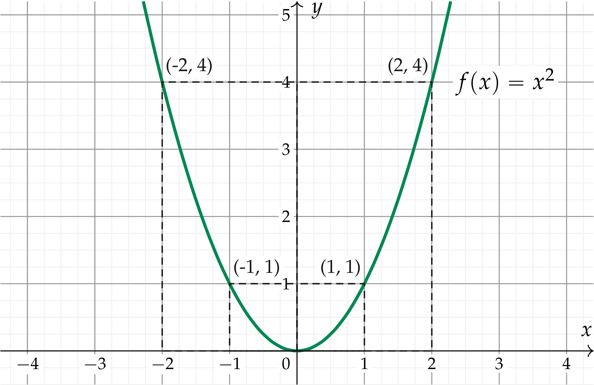

Figure 1.23: Plot of the quadratic function . The graph of the function passes through the following  coordinates: , , , , , , etc.

####[Properties](./Front matter.md)

-   Domain: . The function  is defined for all numbers.
-   Image: . The outputs are nonnegative numbers since , for all real numbers .
-   The function  is the inverse of the square root function .
-    is _two-to-one_: it sends both  and  to the same output value .
-   The quadratic function is _convex_, meaning it curves upward.

The set expression  that we use to define the nonnegative real numbers () is read “the set of real numbers that are greater than or equal to zero.”

###[Square root](./Front matter.md)

The square root function is denoted

The square root  is the inverse function of the square function  when the two functions are defined as . The symbol  refers to the _positive_ solution of . Note that  is also a solution of .

####[Graph](./Front matter.md)

Figure 1.24: The graph of the function . The domain of the function is  because we can’t take the square root of a negative number.

####[Properties](./Front matter.md)

-   Domain: . The function  is only defined for nonnegative inputs. There is no real number  such that  is negative, hence the function  is not defined for negative inputs .
-   Image: . The outputs of the function  are nonnegative numbers since .

In addition to _square_ root, there is also _cube_ root ![f(x) = \sqrt[3]{x}  = x^{\frac{1}{3}}](../Images/845442ae1e1277c5e37205fa88ccffb7c0798d98.png), which is the inverse function for the cubic function . We have ![\sqrt[3]{8}=2](../Images/d1dfc4711eed70da4902e6b7546430f9cae87e93.png) since . More generally, we can define the th\-root function ![\sqrt[n]{x}](../Images/f11caa47e7745cc7aa10ecd3cea7286d0e68a11e.png) as the inverse function of .

###[Absolute value](./Front matter.md)

The _absolute value_ function tells us the size of numbers without paying attention to whether the number is positive or negative. We can compute a number’s absolute value by _ignoring the sign_ of the number. A number’s absolute value corresponds to its distance from the origin of the number line.

Another way of thinking about the absolute value function is to say it multiplies negative numbers by  to “cancel” their negative sign:

####[Graph](./Front matter.md)

Figure 1.25: The graph of the absolute value function .

####[Properties](./Front matter.md)

-   Domain: . The function  is defined for all inputs.
-   Image: 
-   The combination of squaring followed by square-root is equivalent to the absolute value function:
    
    
    
    since squaring destroys the sign.
    

###[Polynomials](./Front matter.md)

The polynomials are a very useful family of functions. For example, quadratic polynomials of the form  often arise when describing physics phenomena.

The general equation for a polynomial function of degree  is

The constants  are known as the _coefficients_ of the polynomial.

####[Parameters](./Front matter.md)

-   : the variable
-   : the constant term
-   : the _linear_ coefficient, or _first-order_ coefficient
-   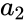: the _quadratic_ coefficient
-   : the _cubic_ coefficient
-   : the th order coefficient
-   : the _degree_ of the polynomial. The degree of  is the largest power of  that appears in the polynomial.

A polynomial of degree  has 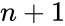 coefficients: .

####[Properties](./Front matter.md)

-   Domain: . Polynomials are defined for all inputs.
-   The roots of  are the values of  for which .
-   The image of a polynomial function depends on the coefficients.
-   The sum of two polynomials is also a polynomial.

The most general first-degree polynomial is a line , where  and  are arbitrary constants. The most general second-degree polynomial is , where again , , and  are arbitrary constants. We call  the _coefficient_ of , since this is the number that appears in front of . Following the pattern, a third-degree polynomial will look like .

In general, a polynomial of degree  has the equation

You can add two polynomials by adding together their coefficients:

The subtraction of two polynomials works similarly. We can also multiply polynomials together using the general algebra rules for expanding brackets.

### Solving polynomial equations

Very often in math, you will have to _solve_ polynomial equations of the form

where  and  are both polynomials. Recall from earlier that to _solve_, we must find the values of  that make the equality true.

Say the revenue of your company is a function of the number of products sold , and can be expressed as . Say also the cost you incur to produce  objects is . You want to determine the amount of product you need to produce to break even, that is, so that revenue equals cost: . To find the break-even value , solve the equation

This may seem complicated since there are s all over the place. No worries! We can turn the equation into its “standard form,” and then use the quadratic formula. First, move all the terms to one side until only zero remains on the other side:

Remember, if we perform the same operations on both sides of the equation, the resulting equation has the same solutions. Therefore, the values of  that satisfy , namely  and , also satisfy , which is the original problem we’re trying to solve.

This “shuffling of terms” approach will work for any polynomial equation . We can always rewrite it as , where  is a new polynomial with coefficients equal to the difference of the coefficients of  and . Don’t worry about which side you move all the coefficients to because  and  have exactly the same solutions. Furthermore, the degree of the polynomial  can be no greater than that of  or .

The form  is the _standard form_ of a polynomial, and we’ll explore several formulas you can use to find its solution(s).

####[Formulas](./Front matter.md)

The formula for solving the polynomial equation  depends on the _degree_ of the polynomial in question.

For a first-degree polynomial equation, , the solution is : just move  to the other side and divide by .

For a second-degree polynomial,

the solutions are  and .

If , the solutions will involve taking the square root of a negative number. In those cases, we say no real solutions exist.

There is also a formula for polynomials of degree  and , but they are complicated. For polynomials with order , there does not exist a general analytical solution.

####[Using a computer](./Front matter.md)

When solving real-world problems, you’ll often run into much more complicated equations. To find the solutions of anything more complicated than the quadratic equation, I recommend using a computer algebra system like `SymPy`: [http://live.sympy.org](./live.sympy.org.md)`.

To make `SymPy` solve the standard-form equation , call the function `solve(expr,var)`, where the expression `expr` corresponds to , and `var` is the variable you want to solve for. For example, to solve , type in the following:

 >>> solve(x\*\*2 - 3\*x + 2, x)          # usage: solve(expr, var)
 \[1, 2\]		

The function `solve` will find the solutions to any equation of the form `expr = 0`. In this case, we see the solutions are  and .

Another way to solve the equation is to factor the polynomial  using the function `factor` like this:

 >>> factor(x\*\*2 - 3\*x + 2)            # usage: factor(expr)
 (x - 1)\*(x - 2)	

We see that , which confirms the two roots are indeed  and .

####[Substitution trick](./Front matter.md)

Sometimes you can solve fourth-degree polynomials by using the quadratic formula. Say you’re asked to solve for  in

Imagine this problem is on your exam, where you are not allowed to use a computer. How does the teacher expect you to solve for ? The trick is to substitute  and rewrite the same equation as

which you can solve by applying the quadratic formula. If you obtain the solutions  and , then the solutions to the original fourth-degree polynomial are  and , since .

Since we’re not taking an exam right now, we are allowed to use the computer to find the roots:

 >>> solve(y\*\*2 - 7\*y + 10, y)
 \[2, 5\]
 >>> solve(x\*\*4 - 7\*x\*\*2 + 10, x)
 \[sqrt(2), -sqrt(2), sqrt(5), -sqrt(5)\]

Note how the second-degree polynomial has two roots, while the fourth-degree polynomial has four roots.

####[Even and odd functions](./Front matter.md)

The polynomials form an entire family of functions. Depending on the choice of degree  and coefficients , , , , a polynomial function can take on many different shapes. Consider the following observations about the symmetries of polynomials:

-   If a polynomial contains only even powers of , like  for example, we call this polynomial _even_. Even polynomials have the property . The sign of the input doesn’t matter.
-   If a polynomial contains only odd powers of , for example , we call this polynomial _odd_. Odd polynomials have the property .
-   If a polynomial has both even and odd terms then it is neither even nor odd.

The terminology of _odd_ and _even_ applies to functions in general and not just to polynomials. All functions that satisfy  are called _even functions_, and all functions that satisfy  are called _odd functions_.

###[Sine](./Front matter.md)

The sine function represents a fundamental unit of vibration. The graph of  _oscillates_ up and down and crosses the \-axis multiple times. The shape of the graph of  corresponds to the shape of a vibrating string. See[Figure 1.26](./Chapter 1_ Math fundamentals.md).

In the remainder of this book, we’ll meet the function  many times. We’ll define the function  more formally as a trigonometric ratio in[Section 1.11](./Chapter 1_ Math fundamentals.md). In[Section 1.13](./Chapter 1_ Math fundamentals.md) we’ll use  and  (another trigonometric ratio) to work out the _components_ of vectors.

At this point in the book, however, we don’t want to go into too much detail about all these applications. Let’s hold off on the discussion about vectors, triangles, angles, and ratios of lengths of sides and instead just focus on the graph of the function .

####[Graph](./Front matter.md)

Figure 1.26: The graph of the function  passes through the following  coordinates: , , , , , , , , and . For  between  and , the function’s graph has the same shape it has for  between  and , but with negative values.

Figure 1.27: The function  crosses the \-axis at .

Let’s start at  and follow the graph of the function  as it goes up and down. The graph starts from  and smoothly increases until it reaches the maximum value at . Afterward, the function comes back down to cross the \-axis at . After , the function drops below the \-axis and reaches its minimum value of  at . It then travels up again to cross the \-axis at . This \-long cycle repeats after . This is why we call the function _periodic_—the shape of the graph repeats.

Figure 1.28: The graph of  from  to  repeats periodically everywhere else on the number line.

####[Properties](./Front matter.md)

-   Domain: . The function  is defined for all input values.
-   Image: . The outputs of the sine function are always between  and .
-   Roots: . The function  has roots at all multiples of .
-   The function is periodic, with period : .
-   The 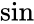 function is _odd_: 
-   Relation to : 
-   Relation to :  ( is read _cosecant_)
-   The inverse function of  is denoted as  or , not to be confused with .
-   The number  is the length-ratio of the vertical side and the hypotenuse in a right-angle triangle with angle  at the base.

####[Links](./Front matter.md)

\[ See the Wikipedia page for nice illustrations \]

[`http://en.wikipedia.org/wiki/Sine`](./Sine.md)

###[Cosine](./Front matter.md)

The cosine function is the same as the sine function _shifted_ by  to the left: . Thus everything you know about the sine function also applies to the cosine function.

####[Graph](./Front matter.md)

Figure 1.29: The graph of the function  passes through the following  coordinates: , , , , , , , , and .

The cos function starts at , then drops down to cross the \-axis at . Cos continues until it reaches its minimum value at . The function then moves upward, crossing the \-axis again at , and reaching its maximum value again at .

####[Properties](./Front matter.md)

-   Domain: 
-   Image: 
-   Roots: 
-   Relation to : 
-   Relation to :  ( is read _secant_)
-   The inverse function of  is denoted  or .
-   The  function is _even_: 
-   The number  is the length-ratio of the horizontal side and the hypotenuse in a right-angle triangle with angle  at the base

###[Tangent](./Front matter.md)

The tangent function is the ratio of the sine and cosine functions:

####[Graph](./Front matter.md)

Figure 1.30: The graph of the function .

####[Properties](./Front matter.md)

-   Domain: 
-   Image: 
-   The function  is periodic with period .
-   The  function “blows up” at values of  where . These are called _asymptotes_ of the function and their locations are .
-   Value at : , because .
-   Value at : .
-   The number  is the length-ratio of the vertical and the horizontal sides in a right-angle triangle with angle .
-   The inverse function of  is denoted  or .
-   The inverse tangent function is used to compute the angle at the base in a right-angle triangle with horizontal side length  and vertical side length : .

###[Exponential](./Front matter.md)

The exponential function base  is denoted

####[Graph](./Front matter.md)

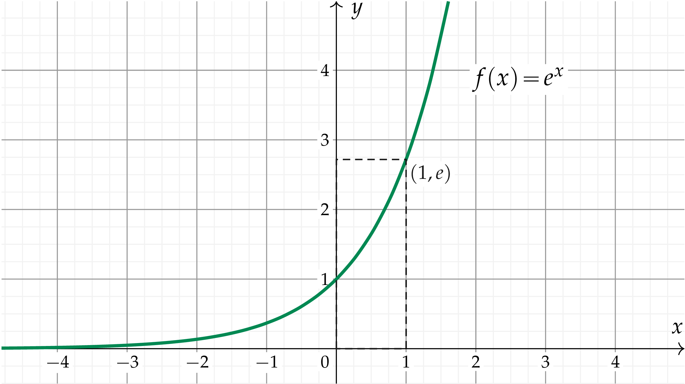

Figure 1.31: The graph of the exponential function  passes through the following points: , , , , , , , etc.

####[Properties](./Front matter.md)

-   Domain: 
-   Image: 
-    since 

A more general exponential function would be , where  is the initial value, and  (the Greek letter _gamma_) is the _rate_ of the exponential. For , the function  is increasing, as in[Figure 1.31](./Chapter 1_ Math fundamentals.md). For 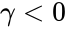, the function is decreasing and tends to zero for large values of . The case  is special since , so  is a constant of .

####[Links](./Front matter.md)

[ The exponential function  evaluated \]

[`http://www.youtube.com/watch?v=e4MSN6IImpI`](./watch_v=e4MSN6IImpI.md)

###[Natural logarithm](./Front matter.md)

The natural logarithm function is denoted

The function  is the inverse function of the exponential 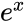.

####[Graph](./Front matter.md)

Figure 1.32: The graph of the function  passes through the following coordinates: , , , , , , , etc.

####[Properties](./Front matter.md)

-   Domain: 
-   Image: 

###[Exercises](./Front matter.md)

E1.10 Find the domain, the image, and the roots of .

E1.11 What are the degrees of the following polynomials? Are they even, odd, or neither?

**a)**  **b)** 

E1.12 Solve for  in the following polynomial equations.

**a)**  **b)** 

##[1.10 Geometry](./Chapter 1_ Math fundamentals.md)

The word “geometry” comes from the Greek roots _geo_, which means “earth,” and _metron_, which means “measurement.” This name is linked to one of the early applications of geometry, which was to measure the total amount of land contained within a certain boundary region. Over the years, the study of geometry evolved to be more abstract. Instead of developing formulas for calculating the area of specific regions of land, mathematicians developed general area formulas that apply to _all_ regions that have a particular shape.

In this section we’ll present formulas for calculating the perimeters, areas, and volumes for various shapes (also called “figures’’) commonly encountered in the real world. For two-dimensional figures, the main quantities of interest are the figures’ areas and the figures’ perimeters (the length of the walk around the figure). For three-dimensional figures, the quantities of interest are the surface area (how much paint it would take to cover all sides of the figure), and volume (how much water it would take to fill a container of this shape). The formulas presented are by no means an exhaustive list of everything there is to know about geometry, but they represent a core set of facts that you want to add to your toolbox.

###[Triangles](./Front matter.md)

The area of a triangle is equal to  times the length of its base times its height:

Note that  is the height of the triangle _relative to_ the side .

Figure 1.33: A triangle with side lengths , , and . The height of the triangle with respect to the side  is denoted .

The perimeter of a triangle is given by the sum of its side lengths:

#####[Interior angles of a triangle rule](./Front matter.md)

The sum of the inner angles in any triangle is equal to . Consider a triangle with internal angles ,  and  as shown in[Figure 1.34](./Chapter 1_ Math fundamentals.md). We may not know the values of the individual angles , , and , but we know their sum is .

Figure 1.34: A triangle with inner angles , , and  and sides , , and .

#####[Sine rule](./Front matter.md)

The sine rule states the following equation is true:

where  is the angle opposite to side ,  is the angle opposite to side , and  is the angle opposite to side , as shown in[Figure 1.34](./Chapter 1_ Math fundamentals.md).

#####[Cosine rule](./Front matter.md)

The cosine rules states the following equations are true:

These equations are useful when you know two sides of a triangle and the angle between them, and you want to find the third side.

###[Circle](./Front matter.md)

The circle is a beautiful shape. If we take the centre of the circle at the origin , the circle of radius  corresponds to the equation

This formula describes the set of points  with a distance from the centre equal to .

####[Area](./Front matter.md)

The area enclosed by a circle of radius  is given by . A circle of radius 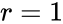 has area .

####[Circumference and arc length](./Front matter.md)

The circumference of a circle of radius  is

A circle of radius  has circumference . This is the total length you can measure by following the curve all the way around to trace the outline of the entire circle. For example, the circumference of a circle of radius  m is  m. This is how far you’ll need to walk to complete a full turn around a circle of radius  m.

What is the length of a part of the circle? Say you have a piece of the circle, called an _arc_, and that piece corresponds to the angle  as shown in[Figure 1.35](./Chapter 1_ Math fundamentals.md). What is the arc’s length ? If the circle’s total length  represents a full  turn around the circle, then the arc length  for a portion of the circle corresponding to the angle  is

The arc length  depends on , the angle , and a factor of .

Figure 1.35: The arc length  equals  of the circle’s circumference .

####[Radians](./Front matter.md)

While scientists and engineers commonly use degrees as a measurement unit for angles, mathematicians prefer to measure angles in _radians_, denoted .

Measuring an angle in radians is equivalent to measuring the arc length  on a circle with radius , as illustrated in[Figure 1.36](./Chapter 1_ Math fundamentals.md).

Figure 1.36: The angle  measured in radians corresponds to the arc length  on a circle with radius . The full circle corresponds to the angle  rad.

The conversion ratio between degrees and radians is

When the angle  is measured in radians, the arc length is given by:

To find the arc length , we simply multiply the circle radius  times the angle  measured in radians.

Note the arc-length formula with  measured in radians is simpler than the arc-length formula with  measured in degrees, since we don’t need the conversion factor of .

###[Sphere](./Front matter.md)

A sphere of radius  is described by the equation . The surface area of the sphere is , and its volume is given by .

Figure 1.37: A sphere of radius  has surface area  and volume .

###[Cylinder](./Front matter.md)

The surface area of a cylinder consists of the top and bottom circular surfaces, plus the area of the side of the cylinder:

The volume of a cylinder is the product of the area of the cylinder’s base times its height:

Figure 1.38: A cylinder with radius  and height  has volume .

#####[Example](./Front matter.md)

You open the hood of your car and see 2.0 L written on top of the engine. The 2.0 L refers to the combined volume of the four pistons, which are cylindrical in shape. The owner’s manual tells you the radius of each piston is 43.75 mm, and the height of each piston is 83.1 mm. Verify the total engine volume is 1998789 mm  L.

###[Cones and pyramids](./Front matter.md)

The volume of a square pyramid with side length  and height  is given by the formula . The volume of a cone of radius  and height  is given by the formula . Note the factor 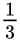 appears in both formulas. These two formulas are particular cases of the general volume formula that applies to all pyramids:

where  is the area of the pyramid’s base and  is its height. This formula applies for pyramids with a base that is a triangle (triangular pyramids), a square (square pyramids), a rectangle (rectangular pyramids), a circle (cones), or any other shape.

Figure 1.39: The volumes of pyramids and cones are described by the formula , where  is the area of the base and  is the height.

###[Exercises](./Front matter.md)

E1.13 Find the length of side  in the triangle below.

Use the cosine rule.

E1.14 Find the volume and the surface area of a sphere with radius .

E1.15 On a rainy day, Laura brings her bike indoors, and the wet bicycle tires leave a track of water on the floor. What is the length of the water track left by the bike’s rear tire (diameter  cm) if the wheel makes five full turns along the floor?

##[1.11 Trigonometry](./Chapter 1_ Math fundamentals.md)

If one of the angles in a triangle is equal to , we call this triangle a _right-angle triangle_. In this section we’ll discuss right-angle triangles in great detail and get to know their properties. We’ll learn some fancy new terms like _hypotenuse_, _opposite_, and _adjacent_, which are used to refer to the different sides of a triangle. We’ll also use the functions _sine_, _cosine_, and _tangent_ to compute the _ratios of lengths_ in right triangles.

Understanding triangles and their associated trigonometric functions is of fundamental importance: you’ll need this knowledge for your future understanding of mathematical concepts like vectors and complex numbers.

Figure 1.40: A right-angle triangle. The angle at the base is denoted  and the names of the sides of the triangle are indicated.

###[Concepts](./Front matter.md)

-   : the three _vertices_ of the triangle
-   : the angle at the vertex . Angles can be measured in degrees or radians.
-   : the length of the _opposite_ side to 
-   : the length of side _adjacent_ to 
-   : the _hypotenuse_. This is the triangle’s longest side.
-   : the “height” of the triangle (in this case )
-   : the _sine_ of theta is the ratio of the length of the opposite side and the length of the hypotenuse
-   : the _cosine_ of theta is the ratio of the adjacent length and the hypotenuse length
-   : the _tangent_ is the ratio of the opposite length divided by the adjacent length

###[Pythagoras’ theorem](./Front matter.md)

In a right-angle triangle, the length of the hypotenuse squared is equal to the sum of the squares of the lengths of the other sides:

If we divide both sides of the above equation by , we obtain

Since  and , this equation can be rewritten as

This is a powerful _trigonometric identity_ that describes an important relation between sine and cosine functions. In case you’ve never seen this notation before, the expression  is used to denote .

###[Sin and cos](./Front matter.md)

Meet the trigonometric functions, or trigs for short. These are your new friends. Don’t be shy now, say hello to them.

“Hello.”

“Hi.”

“Soooooo, you are like functions right?”

“Yep,” sin and cos reply in chorus.

“Okay, so what do you do?”

“Who me?” asks cos. “Well I tell the ratio…hmm…Wait, are you asking what I do as a _function_ or specifically what _I_ do?”

“Both I guess?”

“Well, as a function, I take angles as inputs and I give ratios as answers. More specifically, I tell you how ‘wide’ a triangle with that angle will be,” says cos all in one breath.

“What do you mean wide?” you ask.

“Oh yeah, I forgot to say, the triangle must have a hypotenuse of length 1. What happens is there is a point  that moves around on a circle of radius 1, and we _imagine_ a triangle formed by the point , the origin, and the point on the \-axis located directly below the point .”

“I am not sure I get it,” you confess.

“Let me try explaining,” says sin. “Look at[Figure 1.41](./Chapter 1_ Math fundamentals.md) and you’ll see a circle. This is the unit circle because it has a radius of 1. You see it, yes?”

“Yes.”

“Now imagine a point  that moves along the circle of radius 1, starting from the point . The  and  coordinates of the point  as a function of  are

So, _either_ you can think of us in the context of triangles, or in the context of the unit circle.”

“Cool. I kind of get it. Thanks so much,” you say, but in reality you are weirded out. Talking functions? “Well guys. It was nice to meet you, but I have to get going, to finish the rest of the book.”

“See you later,” says cos.

“Peace out,” says sin.

###[The unit circle](./Front matter.md)

The _unit circle_ is a circle of radius one centred at the origin. The unit circle consists of all points  that satisfy the equation . A point  on the unit circle has coordinates , where  is the angle  makes with the \-axis.

Figure 1.41: The unit circle corresponds to the equation . The coordinates of the point  on the unit circle are  and .

Figure 1.42: The function  describes the vertical position of a point  that travels along the unit circle. The graph shows the values of the function  for angles between  and .

[Figure 1.42](./Chapter 1_ Math fundamentals.md) shows the graph of the function . The values  for the angles ,  (),  (), and  () are marked. There are three values to remember:  when ,  when  (), and  when  (). See[Figure 1.26](./Chapter 1_ Math fundamentals.md) (page 1.26) for a graph of  that shows a complete cycle around the circle. Also see[Figure 1.29](./Chapter 1_ Math fundamentals.md) (page 1.29) for the graph of .

Instead of trying to memorize the values of the functions  and  separately, it’s easier to remember them as a combined “package” , which describes the \- and \-coordinates of the point  for the angle .[Figure 1.43](./Front matter.md) shows the values of  and  for the angles ,  (),  (),  (), and  (). These are the most common angles that often show up on homework and exam questions. For each angle, the \-coordinate (the first number in the bracket) is , and the \-coordinate (the second number in the bracket) is .

Figure 1.43: The combined  coordinates for the points on the unit circle at the most common angles: , 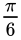 (),  (),  (), and  ().

Note the values of  and  for the angles shown in[Figure 1.43](./Front matter.md) are all combinations of the fractions , , and . The square roots appear as a consequence of the trigonometric identity . This identity tells us that the sum of the squared coordinates of each point on the unit circle is equal to one. Let’s look at what this equation tells us for the angle  (). Remember that  (the length of the dashed line in[Figure 1.43](./Front matter.md)). We can plug this value into the equation  to find the value: .

The coordinates  for the angle  () are obtained from a similar calculation. We know the values of  and  must be equal for that angle, so we’re looking for the number  that satisfies the equation 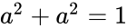, which is . The values of  and  can be obtained from a symmetry argument. Measuring  from the \-axis is the same as measuring  from the \-axis, so  and .

We can extend the calculations described above for all other angles that are multiples of  () and  () to obtain the  and  values for the whole unit circle, as shown in[Figure 1.44](./Chapter 1_ Math fundamentals.md).

Figure 1.44: The coordinates of the point on the unit circle  are indicated for all multiples of  () and  (). Note the symmetries.

Don’t be intimidated by all the information shown in[Figure 1.44](./Chapter 1_ Math fundamentals.md)! You’re not expected to memorize all these values. The primary reason for including this figure is so you can appreciate the symmetries of the sine and cosine values that we find as we go around the circle. The values of  and  for all angles are the same as the values for the angles between 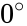 and , but one or more of their coordinates has a negative sign. For example,  is just like , except its \-coordinate is negative since the point lies to the left of the \-axis. Another use for[Figure 1.44](./Chapter 1_ Math fundamentals.md) is to convert between angles measured in degrees and radians, since both units for angles are indicated.

###[Non-unit circles](./Front matter.md)

Consider a point  at an angle of  on a circle with radius 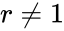. How can we find the \- and \-coordinates of the point ?

We saw that the coefficients  and  correspond to the \- and \-coordinates of a point on the _unit_ circle (. To obtain the coordinates for a point on a circle of radius , we must _scale_ the coordinates by a factor of :

Figure 1.45: The \- and \-coordinates of a point at the angle  and distance of  from the origin are given by  and .

The take-away message is that you can use the functions  and  to find the “horizontal” and “vertical” components of any length . From this point on in the book, we’ll always talk about the length of the _adjacent_ side as , and the length of the _opposite_ side as . It is extremely important you get comfortable with this notation.

The reasoning behind the above calculations is as follows:

and

###[Calculators](./Front matter.md)

Watch out for the units of angle measures when using calculators and computers. Make sure you know what kind of angle units the functions , , and  expect as inputs, and what kind of outputs the functions , , and  return.

For example, let’s see what we should type into the calculator to compute the sine of 30 degrees. If the calculator is set to degrees, we simply type: , , , , and obtain the answer .

If the calculator is set to radians, we have two options:

1.  Change the `mode` of the calculator so it works in degrees.
2.  Convert  to radians
    
    
    
    and type: 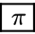, , , ,  on the calculator.
    

Try computing , , and  using your calculator to make sure you know how it works.

###[Exercises](./Front matter.md)

E1.16 Given a circle with radius , find the \- and \-coordinates of the point at . What is the circumference of the circle?

E1.17 Convert the following angles from degrees to radians.

**a)**  **b)**  **c)**  **d)** 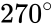

###[Links](./Front matter.md)

\[ Unit-circle walkthrough and tricks by patrickJMT on YouTube \]

[`http://bit.ly/1mQg9Cj`](./1mQg9Cj.md) and[`http://bit.ly/1hvA702`](./1hvA702.md)

##[1.12 Trigonometric identities](./Chapter 1_ Math fundamentals.md)

There are a number of important relationships between the values of the functions  and . Here are three of these relationships, known as _trigonometric identities_. There about a dozen other identities that are less important, but you should memorize these three.

The three identities to remember are:

####[1. Unit hypotenuse](./Front matter.md)

The unit hypotenuse identity is true by the Pythagoras theorem and the definitions of sin and cos. The sum of the squares of the sides of a triangle is equal to the square of the hypotenuse.

####[2. Sine angle sum](./Front matter.md)

The mnemonic for this identity is “sico + sico.”

####[3. Cosine angle sum](./Front matter.md)

The mnemonic for this identity is “coco  sisi.” The negative sign is there because it’s not good to be a sissy.

###[Derived formulas](./Front matter.md)

If you remember the above three formulas, you can derive pretty much all the other trigonometric identities.

####[Double angle formulas](./Front matter.md)

Starting from the sico + sico identity and setting , we can derive the following identity:

Starting from the coco-sisi identity, we obtain

The formulas for expressing  and  in terms of  and  are called _double angle formulas_.

If we rewrite the double-angle formula for  to isolate the  or the  term, we obtain the _power-reduction formulas_:

####[Self-similarity](./Front matter.md)

Sin and cos are periodic functions with period . Adding a multiple of  to the function’s input does not change the function:

This follows because adding a multiple of  brings us back to the same point on the unit circle.

Furthermore, sin and cos have symmetries with respect to zero,

within each  half-cycle,

and within each full  cycle,

Take the time to revisit[Figure 1.26](./Chapter 1_ Math fundamentals.md) (page 1.26),[Figure 1.29](./Chapter 1_ Math fundamentals.md) (page 1.29), and[Figure 1.44](./Chapter 1_ Math fundamentals.md) (page 1.44) to visually confirm that all the equations shown above are true. Knowing the points where the functions take on the same values (symmetries) or take on opposite values (anti-symmetries) is very useful in calculations.

####[Sin is cos, cos is sin](./Front matter.md)

It shouldn’t be surprising if I tell you that sin and cos are actually \-shifted versions of each other:

####[Formulas for sums and products](./Front matter.md)

Here are some formulas for transforming sums into products:

And here are some formulas for transforming products into sums:

###[Discussion](./Front matter.md)

The above formulas will come in handy when you need to find some unknown in an equation, or when you are trying to simplify

###[Exercises](./Front matter.md)

E1.18 Given  and , find

**a)**  **b)**  **c)** 

E1.19 Simplify the following expressions and compute their value without using a calculator.

**a)**  **b)** 

**c)**  **d)** 

##[1.13 Vectors](./Chapter 1_ Math fundamentals.md)

In this section we’ll learn how to manipulate multi-dimensional objects called vectors. Vectors are the precise way to describe directions in space. We need vectors in order to describe physical quantities like the velocity of an object, its acceleration, and the net force acting on the object. Vectors are used more broadly in the study of computer graphics, probability theory, machine learning, and other fields of science and mathematics. It’s all about vectors these days, so you better get to know them.

Figure 1.46: The vector  is an arrow in the Cartesian plane. The horizontal component of  is  and the vertical component is .

Vectors are built from _components_, which are ordinary numbers. You can think of a vector as a list of numbers, and _vector algebra_ as operations performed on the numbers in the list. Vectors can also be manipulated as geometric objects, represented by arrows in space. The arrow that corresponds to the vector  starts at the origin  and ends at the point . The word vector comes from the Latin _vehere_, which means _to carry_. Indeed, the vector  takes the point  and carries it to the point .

Figure 1.47: This figure illustrates the new concepts related to vectors. As you can see, there is quite a bit of new vocabulary to learn, but don’t be fazed—all these terms are just fancy ways of talking about arrows.

Vectors are extremely useful in all areas of life. In physics, for example, we use a vector to describe the velocity of an object. It is not sufficient to say that the speed of a tennis ball is 200 kilometres per hour: we must also specify the direction in which the ball is moving. Both of the two velocities

describe motion at the speed of  kilometres per hour; but since one velocity points along the \-axis, and the other points along the \-axis, they are _completely_ different velocities. The velocity vector contains information about the object’s speed _and_ its direction. The direction makes a big difference. If it turns out the tennis ball is hurtling toward you, you’d better get out of the way!

###[Definitions](./Front matter.md)

A two-dimensional vector  corresponds to a _pair of numbers_:

where  is the _\-component_ of the vector and  is its _\-component_. We denote the set of two-dimensional vectors as , since the components of a two-dimensional vector are specified by two real numbers. We’ll use the mathematical shorthand  to define a two-dimensional vector . Vectors in  can be represented as arrows in the Cartesian plane. See the vector  illustrated in[Figure 1.46](./Chapter 1_ Math fundamentals.md).

We can also define three-dimensional vectors like the vector , which has three components. Three-dimensional vectors can be represented as arrows in a coordinate system that has three axes, like the one shown in[Figure 1.55](./Chapter 1_ Math fundamentals.md) on page 1.55. A three-dimensional coordinate system is similar to the Cartesian coordinate system you’re familiar with, and includes the additional \-axis that measures the height above the plane. In fact, there’s no limit to the number of dimensions for vectors. We can define vectors in an \-dimensional space: . For the sake of simplicity, we’ll define all the vector operation formulas using two-dimensional vectors. Unless otherwise indicated in the text, all the formulas we give for two-dimensional vectors  also apply to \-dimensional vectors .

####[Vector operations](./Front matter.md)

Consider two vectors,  and , and assume that  is an arbitrary constant. The following operations are defined for these vectors:

-   **Addition:** 
-   **Subtraction:** 
-   **Scaling:** 
-   **Dot product:** 
-   **Length:** . The vector’s length is also called the _norm_ of the vector. We sometimes use the letter  to denote the length of the vector .

Note there is no vector division operation.

For vectors in a three-dimensional space  and , we can also define the **cross product** operation . The dot product and the cross product are new operations that you probably haven’t seen before. We’ll talk more about dot products and the cross products later on. For now let’s start with the basics.

####[Vector representations](./Front matter.md)

We’ll use three equivalent ways to denote vectors in two dimensions:

-   : component notation. The vector is written as a pair of numbers called the _components_ or _coordinates_ of the vector.
-   : unit vector notation. The vector is expressed as a combination of the unit vectors  and .
-   : length-and-direction notation (also known as _polar coordinates_). The vector is expressed in terms of its _length_  and the angle  that the vector makes with the \-axis.

Figure 1.48: The vector .

We use the component notation for doing vector algebra calculations since it is most compact. The unit vector notation shows explicitly that the vector  corresponds to the sum of  (a displacement of  steps in the direction of the \-axis) and  (a displacement of  steps in the direction of the \-axis). The length-and-direction notation describes the vector  as a displacement of  steps in the direction of the angle . We’ll use all three ways of denoting vectors throughout the rest of the book, and we’ll learn how to convert between them.

###[Vector algebra](./Front matter.md)

#####[Addition and subtraction](./Front matter.md)

Just like numbers, you can add vectors

subtract them

and solve all kinds of equations where the unknown variable is a vector. This is not a formidably complicated new development in mathematics. Performing arithmetic calculations on vectors simply requires **carrying out arithmetic operations on their components**. Given two vectors,  and , their difference is computed as .

#####[Scaling](./Front matter.md)

We can also _scale_ a vector by any number :

where each component is multiplied by the scale factor . Scaling changes the length of a vector. If  the vector will get longer, and if  then the vector will become shorter. If  is a negative number, the scaled vector will point in the opposite direction.

#####[Length](./Front matter.md)

A vector’s length is obtained from Pythagoras’ theorem. Imagine a right-angle triangle with one side of length  and the other side of length ; the length of the vector is equal to the length of the triangle’s hypotenuse:

A common technique is to scale a vector  by one over its length  to obtain a unit vector that points in the same direction as :

Unit vectors (denoted with a hat instead of an arrow) are useful when you want to describe only a direction in space without any specific length in mind. Verify that .

###[Vector as arrows](./Front matter.md)

So far, we described how to perform algebraic operations on vectors in terms of their components. Vector operations can also be interpreted geometrically, as operations on arrows in the Cartesian plane.

#####[Vector addition](./Front matter.md)

The sum of two vectors corresponds to the combined displacement of the two vectors.[Figure 1.49](./Chapter 1_ Math fundamentals.md) illustrates the addition of two vectors,  and . The sum of the two vectors is the vector .

Figure 1.49: The addition of the vectors  and  produces the vector .

#####[Vector subtraction](./Front matter.md)

Before we describe vector subtraction, note that multiplying a vector by a scale factor  gives a vector of the same length as the original, but pointing in the opposite direction.

This fact is useful if you want to subtract two vectors using the graphical approach. Subtracting a vector is the same as adding the negative of the vector:

Figure 1.50: The vector subtraction  is equivalent to the vector addition , where  is like  but points in the opposite direction.

[Figure 1.50](./Chapter 1_ Math fundamentals.md) illustrates the graphical procedure for subtracting the vector  from the vector . Subtraction of  is the same as addition of .

#####[Scaling](./Front matter.md)

The scaling operation acts to change the length of a vector. Suppose we want to obtain a vector in the same direction as the vector , but half as long. “Half as long” corresponds to a scale factor of . The scaled-down vector is . Conversely, we can think of the vector  as being twice as long as the vector 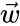.

Figure 1.51: Vectors  and  are related by the equation .

Multiplying a vector by a negative number reverses its direction.

###[Length-and-direction representation](./Front matter.md)

So far, we’ve seen how to represent a vector in terms of its components. There is another way of representing two-dimensional vectors: we can describe the vector  in terms of its length  and its direction —the angle it makes with the \-axis. For example, the vector  can also be written as  using length-and-direction notation. This length-and-direction notation is useful because it makes it easy to see the “size” of vectors. On the other hand, vector arithmetic operations are much easier to carry out in the component notation. It’s therefore good to know the formulas for converting between the two vector representations.

Figure 1.52: The \- and \-components of a vector with length  in the direction  are given by  and .

To convert the length-and-direction vector  into an \-component and a \-component , use the formulas

To convert from component notation  to length-and-direction , use

Finding the angle  is a little tricky. We must use a different formula for computing  depending on the value of  and there are four different cases to consider. The basic idea is to use the inverse tangent function , which is also called , or `atan` on computer systems. By convention, the function  returns values between  ( \[rad\]) and  ( \[rad\]), which correspond to vectors with a positive  component. If the  component is negative, we must add  ( \[rad\]) to the output of the inverse-tangent calculation to obtain the correct angle. When  we can’t compute the fraction  because we cannot divide by zero, so must handle the cases with  separately as described above. Computer algebra systems provide the two-input arctangent function `atan2(y,x)` that will correctly compute the angle  for any coordinate pair .

###[Unit vector notation](./Front matter.md)

In two dimensions, we can think of a vector  as a command to “Go a distance  in the \-direction and a distance  in the \-direction.” To write this set of commands more explicitly, we can use multiples of the vectors  and . These are the unit vectors pointing in the  and  directions:

Any number multiplied by  corresponds to a vector with that number in the first coordinate. For example,  and .

In physics, we tend to perform a lot of numerical calculations with vectors; to make things easier, we often use unit vector notation:

The addition rule remains the same for the new notation:

It’s the same story repeating all over again: we need to add s with s, and s with s.

###[Examples](./Front matter.md)

####[Simple example](./Front matter.md)

Compute the sum . Express your answer in the length-and-direction notation.

Since we want to carry out an addition, and since addition is performed in terms of components, our first step is to convert  into component notation: . We can now compute the sum:

The \-component of the sum is  and the \-component of the sum is . To express the answer as a length and a direction, we compute the length  and the direction . The answer is .

####[Relative motion example](./Front matter.md)

A boat can reach a top speed of 12 knots in calm seas. Instead of cruising through a calm sea, however, the boat’s crew is trying to sail up the St-Laurence river. The speed of the current is 5 knots.

If the boat travels directly upstream at full throttle 12, then the speed of the boat relative to the shore will be

since we must “deduct” the speed of the current from the speed of the boat relative to the water. See the vector diagram in[Figure 1.53](./Chapter 1_ Math fundamentals.md).

Figure 1.53: A boat travels with speed  knots against a current of 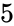 knots.

If the crew wants to cross the river perpendicular to the current flow, they can use some of the boat’s thrust to counterbalance the current, and the remaining thrust to push across. The situation is illustrated in[Figure 1.54](./Chapter 1_ Math fundamentals.md). In what direction should the boat sail to cross the river? We are looking for the direction of  the boat should take such that, after adding in the velocity of the current, the boat moves in a straight line between the two banks (in the  direction).

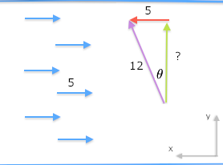

Figure 1.54: Part of the boat’s thrust cancels the current.

Let’s analyze the vector diagram. The opposite side of the triangle is parallel to the current flow and has length . We take the up-the-river component of the velocity  to be equal to , so that it cancels exactly the  flow of the river. The hypotenuse has length  since this is the speed of the boat relative to the surface of the water.

From all of this we can answer the question like professionals. You want the angle? Well, we have that , where  is the angle of the boat’s course relative to the straight line between the two banks. We can use the inverse-sin function to solve for the angle:

The across-the-river component of the velocity can be calculated using , or from Pythagoras’ theorem if you prefer .

###[Discussion](./Front matter.md)

We did a lot of hands-on activities with vectors in this section and skipped over some of the theoretical details. Now that you’ve been exposed to the practical side of vector calculations, it’s worth clarifying certain points that we glossed over.

####[Vectors vs. points](./Front matter.md)

We used the notation  to describe two kinds of math objects: the set of points in the Cartesian plane and the set of vectors in a two-dimensional space. The point  and the vector  are both represented by pairs of real numbers, so we use the notation  and  to describe them. This means that a pair of numbers  could represent the _coordinates_ of a point, or the _components_ of a vector, depending on the context.

Let’s take a moment to review the definitions of points and vectors and clarify the types of operations we can perform on them:

-   **Space of points ** : the set of points  corresponds to locations in the Cartesian plane. The point  corresponds to the geometric instructions: “Starting at the origin , move  units along the \-axis and  units along the \-axis.” The distance between points  and  is denoted .
-   **Vector space ** : the set of vectors  describes displacements in the Cartesian plane. The vector  corresponds to the instructions: “Starting anywhere, move  units along the \-axis and  units along the \-axis.” Vectors can be combined and manipulated using the vector algebra operations , , , , and .

Note the geometric instructions for points and vectors are very similar; the only difference is the starting point. The coordinates of a point  specify a _fixed position_ relative to the origin , while the components of a vector  describe a _relative displacement_ that can have any starting point.

Let’s look at some examples of calculations that combine points and vectors. Consider the points  and  in the Cartesian plane, and the displacement vector  between them. The displacement vector  gives the “move instructions” for getting from point  to point  and is defined by the equation:

This equation says that subtracting two points produces a vector, which make sense if you think about it—the “difference” between two points is a displacement vector.

We can use the displacement vector  in calculations like this:

In words, this calculation shows that “Starting at the point  and moving by  brings us to the point .”

The above equations use addition and subtraction operations between a mix of points and vectors. This is rather unusual: normally we only use operations like “+” and “-” between math objects of the same kind. In this case, we’re allowed to mix points and vectors because they both describe “move instructions” of the same kind.

Let’s keep going. What other useful calculations can we do by combining points and vectors? Suppose we wanted to find the midpoint  that lies exactly in the middle between points  and . We can find the midpoint  using the displacement vector  and some basic vector algebra. If starting from  and moving by  brings us all the way to the point , then starting from  and moving by  will bring us to the midpoint: .

The mathematical bridge between points and vectors allows us to use vector techniques to solve geometry problems. By learning to describe geometric objects like points, lines, and circles using vectors, we can do complicated geometry calculations using simple algebraic manipulations like vector operations. This exemplifies a general pattern in mathematics: applying techniques developed in one domain to solve problems in another domain.

#####[Example](./Front matter.md)

You come to class one day and there’s a surprise quiz that asks you to write the formula for the distance  between two points  and . You don’t remember ever learning about such a formula and feel caught off guard. How can the teacher ask for a formula they haven’t covered in class yet? This seems totally unfair!

After a minute of stressing out, you take a deep breath, come back to your senses, and resolve to give this problem a shot. You start by sketching a coordinate system, placing points  and  in it, and drawing the line that connects the two points. What is the formula that describes the length of this line?

The line from  to  looks like the hypotenuse of a triangle, which makes you think that trigonometry could somehow be used to find the answer. Unfortunately, trying to remember the trigonometry formulas has only the effect of increasing your math anxiety. You take this as a sign that you should look for other options. In math, it’s important to trust your gut instincts.

By a fortunate coincidence, you were recently reading about the connection between points and vectors, and specifically about the displacement vector . The line in your sketch represents the vector . You realize that the distance between the points  and  is the same as the length of the vector . You remember the formula for the length of a vector  is  and you know the formula for the displacement vector is , so you combine these formulas to obtain the answer: . One more win for the “don’t worry and try it” strategy for solving math problems!

####[Vectors in three dimensions](./Front matter.md)

A three-dimensional coordinate system consists of three axes: the \-axis, the \-axis, and the \-axis. The three axes point in perpendicular directions to each other, as illustrated in[Figure 1.55](./Chapter 1_ Math fundamentals.md). Look around you and find a corner of the room you’re in where two walls and the floor meet. The \-axis and the \-axis are the edges where the floor meets the walls. The vertical edge where the two walls meet represents the \-axis.

Figure 1.55: A three-dimensional coordinate system with , , and  axes.

The vector  describes the following displacement instructions: “Move  units in the direction of the \-axis, then move  along the \-axis, and finally move  in the direction of the \-axis.” In three dimensions, there are three unit vectors that describe unit steps in the direction of each of the axes:

We can therefore describe the vector  in terms of unit vectors as .

####[High-dimensional vectors](./Front matter.md)

The most common types of vectors you’ll encounter in math and physics are two-dimensional and three-dimensional vectors. In other fields of science like genetics and machine learning, it’s common to see vectors with many more dimensions. For example, in machine learning we often represent “rich data” like images, videos, and text as vectors with thousands of dimensions.

An example of an \-dimensional vector is

The vector algebra operations you learned in this section also apply to these high-dimensional vectors.

####[Vectors and vector coordinates](./Front matter.md)

One final point we need to clarify is the difference between real-world vector quantities like the velocity of a tennis ball  and its mathematical representation as a coordinate vector . If you know the coordinate vector  then you know what the real-world velocity is, right? Not quite.

Let’s say you’re doing a physics research project on tennis serves. You define an \-coordinate system for the tennis court, which allows you to represent the ball’s velocity  as a triple of components  interpreted as: “The ball is moving with velocity  units in the \-direction,  units in the \-direction, and  units in the \-direction.”

Suppose you want to describe the velocity vector  to a fellow physicist via text message. Referring to your sheet of calculations, you find the values 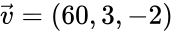, which you know were measured in metres per second. You send this message:

    The velocity is (60,3,-2) measured in metres per second. 

A few minutes later the following reply comes back:

    Wait whaaat? What coordinate system are you using? 

Indeed the information you sent is incomplete. Vector components depend on the coordinate system in which the vectors are represented. The triple of numbers  only makes sense once you know the directions of the axes in the \-coordinate system. Realizing your mistake, you send a text with all the required information:

    Using the coordinate system centred at the south post of
    the net, with the x-axis pointing east along the court,
    the y-axis pointing north along the net, and the z-axis
    pointing up, the velocity is (60,3,-2) in metres per second. 

A few seconds later, you get the reply:

    OK got it now. Thx! 

This hypothetical situation illustrates the importance of the coordinate systems for describing vectors. If you don’t know what the coordinate system is, knowing the coordinates  doesn’t tell you much. Only when you know the directions of the unit vectors , , and  can you interpret the instructions .

It turns out, using the \-coordinate system with the three vectors  is just one of many possible ways we can represent vectors. We can represent a vector  as coordinates 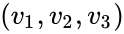 with respect to any _basis_ 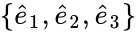 using the expression , which corresponds to the instructions: “Move  units in the direction of , move  units in the direction of , and move 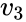 units in the direction of .”

What’s a basis, you ask? I’m glad you asked, because this is the subject of the next section.

###[Basis](./Front matter.md)

One of the most important concepts in the study of vectors is the concept of a _basis_. Consider the three-dimensional vector space . A _basis_ for  is a set of vectors  that can be used as a coordinate system for . If the set of vectors  is a basis, then you can _represent_ any vector  as coordinates  _with respect to_ that basis:

The vector  is obtained by measuring out a distance  in the  direction, a distance  in the  direction, and a distance  in the  direction.

You are already familiar with the _standard_ basis , which is associated with the \-coordinate system. You know that any vector  can be expressed as a triple  with respect to the basis  through the formula . The whole point of this section is to let you know that other bases (coordinate systems) exist, and to get you into the habit of asking, “With respect to which coordinate system?” every time you see a coordinate vector .

####[An analogy](./Front matter.md)

Let’s start with a simple example of a basis. If you look at the HTML source code behind any web page, you’re sure to find at least one mention of the colour stylesheet directive such as `color:#336699;`. The numbers should be interpreted as a triple of values , each value describing the amount of red, green, and blue needed to create a given colour. Let us call the colour described by the triple  CoolBlue. This convention for colour representation is called the RGB colour model and we can think of it as the _RGB basis_. A basis is a set of elements that can be combined together to express something more complicated. In our case, the **R**, **G**, and **B** elements are pure colours that can create any colour when mixed appropriately. Schematically, we can write this mixing idea as

where the _components_ determine the strength of each colour. To create the colour, we combine its components as symbolized by the  operation.

The cyan, magenta, and yellow (CMY) colour model is another basis for representing colours. To express the “cool blue” colour in the CMY basis, you will need the following components:

The _same_ colour CoolBlue is represented by a _different_ set of components when the CMY colour basis is used.

Note that a triple of components by itself doesn’t mean anything unless we know the basis being used. For example, if we were to interpret the triple of components  with respect to the CMY basis, we would obtain a completely different colour, which would not be cool at all. A basis is required to convert mathematical objects like the triple  into real-world ideas like colours. As exemplified above, to avoid any ambiguity we can use a subscript after the bracket to indicate the basis associated with each triple of components. Writing  and  clarifies which basis to use for each triple of components.

####[Discussion](./Front matter.md)

It would be hard to over-emphasize the importance of the basis—the coordinate system you use to describe vectors. The choice of coordinate system is the bridge between real-world vector quantities and their mathematical representation in terms of components. Every time you start a new problem that involves vector calculations, the first thing you should do is choose the coordinate system you want to use, and indicate it clearly in the diagram.

Using a non-standard coordinate system can sometimes simplify the equations you have to solve. For example, let’s say we want to study the motion of a block sliding down an incline with velocity , as illustrated in[Figure 1.56](./Chapter 1_ Math fundamentals.md). Using the standard \-basis, the velocity vector is represented as , which has components in both the \- and \-directions and requires using trigonometric functions. If instead you use the non-standard \-basis, the components of the velocity will be . Note the velocity only has a component along the \-direction, which will simplify all subsequent calculations.

Figure 1.56: The vector  is described by the coordinates  with respect to the standard basis . The same vector  is described by the coordinates  with respect to the “tilted” basis .

###[Links](./Front matter.md)

\[ Vectors and vector operations explained by 3Blue1Brown \]

[https://www.youtube.com/watch?v=fNkzzaMoSs](./watch_v=fNk_zzaMoSs.md)

\[ More vector illustrations and definitions from Wikipedia \]

[https://en.wikipedia.org/wiki/Euclideanvector](./Euclidean_vector.md)

###[Exercises](./Front matter.md)

E1.20 Given the vectors , , and , calculate the following expressions:

**a)**  **b)**  **c)** 

E1.21 Express the following vectors as components:

**a)**  **b)**  **c)** 

E1.22 Express the following vectors in length-and-direction notation:

**a)**  **b)**  **c)** 

##[1.14 Complex numbers](./Chapter 1_ Math fundamentals.md)

By now, you’ve heard about complex numbers . The word “complex” is an intimidating word. Surely it must be a complex task to learn about the complex numbers. That may be true in general, but it helps if you know about vectors. Complex numbers are similar to two-dimensional vectors . We add and subtract complex numbers like vectors. Complex numbers also have components, length, and “direction.” If you understand vectors, you will understand complex numbers at almost no additional mental cost.

We’ll begin with a practical problem.

####[Example](./Front matter.md)

Suppose you’re asked to solve the following quadratic equation:

You’re looking for a number , such that . If you are only allowed to give real answers (the set of real numbers is denoted ), then there is no answer to this question. In other words, this equation has no solutions. Graphically speaking, this is because the quadratic function  does not cross the \-axis.

However, we’re not taking no for an answer! If we insist on solving for  in the equation , we can imagine a new number  that satisfies . We call  the unit imaginary number. The solutions to the equation are therefore  and . There are two solutions because the equation is quadratic. We can check that  and also .

Thus, while the equation  has no real solutions, it _does_ have solutions if we allow the answers to be imaginary numbers.

###[Definitions](./Front matter.md)

Complex numbers have a real part and an imaginary part:

-   : the unit imaginary number  or 
-   : an imaginary number that is equal to  times 
-   : the set of real numbers
-   : the set of complex numbers 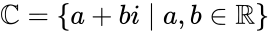
-   : a complex number
    -   : the real part of 
    -   : the imaginary part of 
-   : the _complex conjugate_ of . If , then .

The polar representation of complex numbers:

-   
-   : the _magnitude_ of 
-   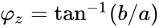: the _phase_ or _argument_ of 
-   
-   

###[Formulas](./Front matter.md)

####[Addition and subtraction](./Front matter.md)

Just as we performed the addition of vectors component by component, we perform addition on complex numbers by adding the real parts together and adding the imaginary parts together:

####[Polar representation](./Front matter.md)

We can give a geometric interpretation of the complex numbers by extending the real number line into a two-dimensional plane called the _complex plane_. The horizontal axis in the complex plane measures the _real_ part of the number. The vertical axis measures the _imaginary_ part. Complex numbers are points in the complex plane.

Figure 1.57: The complex number  corresponds to the point with coordinates  in the complex plane.

It is possible to represent any complex number  in terms of its _magnitude_ and its _phase_:

The _magnitude_ (or _absolute value_) of a complex number  is

This corresponds to the _length_ of the vector that represents the complex number in the complex plane. The formula is obtained by using Pythagoras’ theorem.

The _phase_, also known as the _argument_ of the complex number  is given by the formula

The phase corresponds to the angle that  forms with the real axis.

We previously saw this complicated-looking formula with four cases when we talked about vectors [Section 1.13](./Chapter 1_ Math fundamentals.md)). When a certain formula comes up two times in a math book, this should tell you the author _really_ wants you to know it. Seriously, do me a favour and revisit the exercise [1.13.10](./Chapter 1_ Math fundamentals.md) (page 1.13.10).

Computer algebra systems provide the two-input inverse tangent function `atan2`, which is the easiest way to calculate the phase  for the complex number . The function `atan2` handles all four cases automatically and always computes the correct phase . Try doing some calculations with `atan2` using the computer algebra systems at  [https://live.sympy.org](./live.sympy.org.md).

In addition to the vector-like operations we can perform on complex numbers, like computing their magnitude and phase, we can also perform other operations on complex numbers that are not defined for vectors. The set of complex numbers  is a _field_. This means, in addition to the addition and subtraction operations, we can also perform multiplication and division with complex numbers.

####[Multiplication](./Front matter.md)

The product of two complex numbers is computed using the usual rules of algebra:

In the polar representation, the product formula is

To multiply two complex numbers, multiply their magnitudes and add their phases.

#####[Example](./Front matter.md)

Verify that .

####[Division](./Front matter.md)

Let’s look at the procedure for dividing complex numbers:

In other words, to divide the number  by the complex number , compute  and  and then use

You can think of  as being equivalent to .

#####[Cardano’s example](./Front matter.md)

One of the earliest examples of reasoning involving complex numbers was given by Gerolamo Cardano in his 1545 book _Ars Magna_. Cardano wrote, “If someone says to you, divide 10 into two parts, one of which multiplied into the other shall produce 40, it is evident that this case or question is impossible.” We want to find numbers  and  such that  and . This sounds kind of impossible. Or is it?

“Nevertheless,” Cardano said, “we shall solve it in this fashion:

When you add  you obtain 10. When you multiply the two numbers the answer is

Hence  and  are two numbers whose sum is  and whose product is 40.

#####[Example 2](./Front matter.md)

Let’s compute the product of  and . The answer is obviously , but let’s look at this simple calculation geometrically. The polar representation of the number  is . Multiplication of any complex number  by  corresponds to adding  to the phase of the number:

In other words, multiplication by  is equivalent to applying a  () counterclockwise rotation in the complex plane. We can therefore interpret the answer  as the complex number  experiencing a  rotation to arrive at .

#####[Example 3](./Front matter.md)

Find the polar representation of  and compute . Let’s denote the polar representation of  by  as shown in[Figure 1.58](./Chapter 1_ Math fundamentals.md). We find  and . Using the polar representation, we can easily compute :

Note we can ignore multiples of  in the phase. We thus find the value of  is .

Figure 1.58: The complex number  has magnitude  and phase .

####[Fundamental theorem of algebra](./Front matter.md)

The fundamental theorem of algebra states that any polynomial of degree , , can be written as

where  are the polynomial’s roots. In other words, the equation  has  solutions: the complex numbers 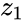, 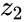, …, . Before today, you might have said the equation  has no solutions. Now you know its solutions are the complex numbers  and .

The theorem is “fundamental” because it tells us we’ll never need to invent numbers “fancier” than the complex numbers to solve polynomial equations. To understand why this is important, recall that each set of numbers is associated with a different class of equations.[Figure 1.2](./Chapter 1_ Math fundamentals.md) on page 1.2 shows the nested containment structure of the number sets , 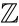, , , and . The natural numbers  appear as solutions of the equation , where  and  are natural numbers (denoted ). The integers  are the solutions to equations of the form , where . The rational numbers  are necessary to solve for  in , with . To find the solutions of , we need the real numbers . And in this section, we learned that the solutions to the equation  are complex numbers . At this point you might be wondering if you’re attending some sort of math party, where mathematicians write down complicated equations and—just for the fun of it—invent new sets of numbers to describe the solutions to these equations. Can this process continue indefinitely?

Nope. The party ends with . The fundamental theorem of algebra guarantees that any polynomial equation you could come up with—no matter how complicated it is—has solutions that are complex numbers .

####[Euler’s formula](./Front matter.md)

It turns out the exponential function is related to the functions sine and cosine. Lo and behold, we have _Euler’s formula_:

Inputting an imaginary number to the exponential function outputs a complex number that contains both  and . Euler’s formula gives us an alternate notation for the polar representation of complex numbers: .

If you want to impress your friends with your math knowledge, plug  into the above equation to find

which can be rearranged to obtain the equation . The equation  is called _Euler’s identity_, and it shows a relationship between the five most important numbers in all of mathematics: Euler’s number , , the imaginary number , 1, and zero. It’s kind of cool to see all these important numbers reunited in one equation, don’t you agree?

One way to understand the equation , is to think of  as the polar representation of the complex number , which is the same as  rotated counterclockwise by  radians () in the complex plane. We know  and so .

####[De Moivre’s formula](./Front matter.md)

By replacing  in Euler’s formula with , we obtain de Moivre’s formula:

De Moivre’s formula makes sense if you think of the complex number , raised to the th power:

Setting 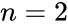 in de Moivre’s formula, we can derive the double angle formulas (page 1.12.1.1) as the real and imaginary parts of the following equation:

###[Links](./Front matter.md)

\[ Intuitive proof of the fundamental theorem of algebra \]

[`https://www.youtube.com/watch?v=shEk8sz1oOw`](./watch_v=shEk8sz1oOw.md)

##[1.15 Solving systems of linear equations](./Chapter 1_ Math fundamentals.md)

Solving equations with one unknown—like , for instance—requires manipulating both sides of the equation until the unknown variable is _isolated_ on one side. For this instance, we can subtract  from both sides of the equation to obtain , which simplifies to .

What about the case when you are given _two_ equations and must solve for _two_ unknowns? For example,

Can you find values of  and  that satisfy both equations?

###[Concepts](./Front matter.md)

-   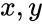: the two unknowns in the equations
-   : a system of two equations that must be solved _simultaneously_. These equations will look like
    
    
    
    where s, s, and s are given constants.
    

###[Principles](./Front matter.md)

If you have  equations and  unknowns, you can solve the equations _simultaneously_ and find the values of the unknowns. There are several different approaches for solving equations simultaneously. We’ll show three of these approaches for the case .

###[Solution techniques](./Front matter.md)

When solving for two unknowns in two equations, the best approach is to _eliminate_ one of the variables from the equations. By combining the two equations appropriately, we can simplify the problem to the problem of finding one unknown in one equation.

####[Solving by substitution](./Front matter.md)

We want to solve the following system of equations:

We can isolate  in the first equation to obtain

Now _substitute_ the expression for  from the top equation into the bottom equation:

We just eliminated one of the unknowns by substitution. Continuing, we expand the bracket to find

or

We find , but what is ? Easy. To solve for , plug the value  into any of the equations we started from. Using the equation , we find .

####[Solving by subtraction](./Front matter.md)

Let’s now look at another way to solve the same system of equations:

Observe that any equation will remain true if we multiply the whole equation by some constant. For example, we can multiply the first equation by  to obtain an equivalent set of equations:

Why did I pick 3 as the multiplier? By choosing this constant, the  terms in both equations now have the same coefficient.

Subtracting two true equations yields another true equation. Let’s subtract the top equation from the bottom one:

The  terms cancel. This subtraction eliminates the variable  because we multiplied the first equation by . We find . To find , substitute  into one of the original equations:

from which we deduce that .

####[Solving by equating](./Front matter.md)

There is a third way to solve the system of equations

We can isolate  in both equations by moving all other variables and constants to the right-hand sides of the equations:

Though the variable  is unknown to us, we know two facts about it:  is equal to  and  is equal to . Therefore, we can eliminate  by equating the right-hand sides of the equations:

We solve for  by adding  to both sides and subtracting  from both sides. We find  then plug this value into the equation  to find . The solutions are  and .

###[Discussion](./Front matter.md)

The repeated use of the three algebraic techniques presented in this section will allow you to solve any system of  linear equations in  unknowns. Each time you eliminate one variable using a substitution, a subtraction, or an elimination by equating, you’re simplifying the problem to a problem of finding  unknowns in a system of  equations. In[Chapter 3](./Chapter 3_ Computational linear algebra.md) we’ll develop a more advanced, systematic approach for solving systems of linear equations.

###[Geometric solution](./Front matter.md)

Solving a system of two linear equations in two unknowns can be understood geometrically as finding the point of intersection between two lines in the Cartesian plane. In this section we’ll explore this correspondence between algebra and geometry to develop yet another way of solving systems of linear equations.

The algebraic equation  containing the unknowns  and  can be interpreted as a _constraint_ equation on the set of possible values for the variables  and . We can visualize this constraint geometrically by considering the coordinate pairs  that lie in the Cartesian plane. Recall that every point in the Cartesian plane can be represented as a coordinate pair , where  and  are the coordinates of the point.

[Figure 1.59](./Chapter 1_ Math fundamentals.md) shows the geometrical representation of three equations. The line  corresponds to the set of points  that satisfy the equation , the line  is the set of points  that satisfy the equation , and the line  corresponds to the set of points that satisfy .

Figure 1.59: Graphical representations of three linear equations.

You can convince yourself that the geometric lines shown in[Figure 1.59](./Chapter 1_ Math fundamentals.md) are equivalent to the algebraic equations by considering individual points  in the plane. For example, the points , , and  are all part of the line  since they satisfy the equation . For the line , you can verify that the line’s \-intercept  and its \-intercept  both satisfy the equation .

The Cartesian plane as a whole corresponds to the set , which describes all possible pairs of coordinates. To understand the equivalence between the algebraic equation  and the line  in the Cartesian plane, we can use the following precise math notation:

In words, this means that the line  is defined as the subset of the pairs of real numbers  that satisfy the equation .[Figure 1.60](./Chapter 1_ Math fundamentals.md) shows the graphical representation of the line .

You don’t have to take my word for it, though! Think about it and convince yourself that all points on the line  shown in[Figure 1.60](./Chapter 1_ Math fundamentals.md) satisfy the equation . For example, you can check that the \-intercept  and the \-intercept  satisfy the equation .

Figure 1.60: Graphical representation of the equation .

Solving the system of two equations

corresponds to finding the intersection of the lines  and  that represent each equation. The pair  that satisfies both algebraic equations simultaneously is equivalent to the point  that is the intersection of lines  and , as illustrated in[Figure 1.61](./Chapter 1_ Math fundamentals.md).

Figure 1.61: The point  that lies at the intersection of lines  and .

#####[Example](./Front matter.md)

Let’s see how we can use the geometric interpretation to solve the system of equations

We’ve already seen three different _algebraic_ techniques for finding the solution to this system of equations; now let’s see a _geometric_ approach for finding the solution. I’m not kidding you, we’re going to solve the exact same system of equations a fourth time!

The first step is to draw the lines that correspond to each of the equations using pen and paper or a graphing calculator. The second step is to find the coordinates of the point where the two lines intersect as shown in[Figure 1.62](./Chapter 1_ Math fundamentals.md). The point  that lies on both lines  and  corresponds to the  and  values that satisfy both equations simultaneously.

Figure 1.62: The line  with equations  intersects the line  with equation  at the point .

Visit the webpage at[`www.desmos.com/calculator/exikik615f`](./exikik615f.md) to play with an interactive version of the graphs shown in[Figure 1.62](./Chapter 1_ Math fundamentals.md). Try changing the equations and see how the graphs change.

###[Exercises](./Front matter.md)

E1.23 Plot the lines , , and  shown in[Figure 1.59](./Chapter 1_ Math fundamentals.md) (page 1.59) using the[Desmos graphing calculator](./calculator.md). Use the graphical representation of these lines to find: **a)** the intersection of lines  and , **b)** the intersection of  and , and **c)** the intersection of lines  and .

E1.24 Solve the system of equations simultaneously for  and :

E1.25 Solve the system of equations for the unknowns , , and :

E1.26 Solve for  and  given the equations  and .

##[1.16 Set notation](./Chapter 1_ Math fundamentals.md)

A _set_ is the mathematically precise notion for describing a group of objects. You don’t need to know about sets to perform simple math; but more advanced topics require an understanding of what sets are and how to denote set membership, set operations, and set containment relations. This section introduces all the relevant concepts.

###[Definitions](./Front matter.md)

-   _set_: a collection of mathematical objects
-   : the usual variable names for sets
-   : this statement is read “ is an element of ” or “ is in ”
-   : some important number sets: the naturals, the integers, the rationals, and the real numbers, respectively.
-   : the _empty set_ is a set that contains no elements
-   : the curly brackets are used to define sets, and the expression inside the curly brackets describes the set contents.

Set operations:

-   : the _union_ of two sets. The union of  and  corresponds to the elements in either  or .
-   : the _intersection_ of the two sets. The intersection of  and  corresponds to the elements that are in both  and .
-   : _set difference_ or _set minus_. The set difference  corresponds to the elements of  that are not in .

Set relations:

-   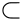: is a strict subset of
-   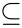: is a subset of or equal to

Here is a list of special mathematical shorthand symbols and their corresponding meanings:

-   : element of
-   : not an element of
-   : for all
-   : there exists
-   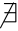: there doesn’t exist
-   : such that

These symbols are used in math proofs because they allow us to express complex mathematical arguments succinctly and precisely.

An _interval_ is a subset of the real line. We denote an interval by specifying its endpoints and surrounding them with either square brackets “” or round brackets “” to indicate whether or not the corresponding endpoint is included in the interval.

-   ![[a,b]](../Images/0127303c2247a29e7eb054904ab693237ca4075e.png): the _closed_ interval from  to . This corresponds to the set of numbers between  and  on the real line, including the endpoints  and . ![[a,b] = \{ x\in \mathbb{R}\; | \; a \leq x \leq b \}](../Images/5d8da925651b88012743bcd282b7920d9ddb148a.png).
-   : the _open_ interval from  to . This corresponds to the set of numbers between  and  on the real line, _not_ including the endpoints  and . .
-   : the half-open interval that includes the left endpoint  but not the right endpoint . .

Sometimes we encounter intervals that consist of two disjointed parts. We use the notation ![[a,b] \cup [c,d]](../Images/7318231c0c5580407630f17e90d4e9e374d53cff.png) to denote the union of the two intervals, which is the set of numbers _either_ between  and  (inclusive) _or_ between  and  (inclusive).

###[Sets](./Front matter.md)

Much of math’s power comes from _abstraction_: the ability to see the bigger picture and think _meta_ thoughts about the common relationships between math objects. We can think of individual numbers like , , and , or we can talk about the set of _all_ numbers.

It is often useful to restrict our attention to a specific _subset_ of the numbers as in the following examples.

####[Example 1: The nonnegative real numbers](./Front matter.md)

Define  (read “ is a subset of ”) to be the set of nonnegative real numbers:

or expressed more compactly,

If we were to translate the above expression into plain English, it would read “The set  is defined as the set of all real numbers  such that  is greater or equal to zero.”

Note we used the “is defined as” symbol “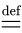” instead of the basic “” to give an extra hint that we’re defining a new variable  that is equal to the set expression on the right. In this book, we’ll sometimes use the symbol “” when defining new variables and math quantities. Some other books use the notation “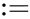” or “” for this purpose. The meaning of “” is identical to “” but it tells us the variable on the left of the equality is new.

####[Example 2: Even and odd integers](./Front matter.md)

Define the set of even integers as

and the set of odd integers as

Indeed, every even number is divisible by two, so it can be written in the form  for some integer . Odd numbers can be obtained from the “template” , with  varying over all integers.

In both of the above examples, we use the _set-builder_ notation  to define the sets. Inside the curly braces we first describe the general kind of mathematical objects we are talking about, followed by the symbol “” (read “such that”), followed by the conditions that must be satisfied by all elements of the set.

###[Number sets](./Front matter.md)

Recall the fundamental number sets we defined in[Section 1.2](./Chapter 1_ Math fundamentals.md) in the beginning of the book. It is worthwhile to review them briefly.

The _natural_ numbers form the set derived when you start from  and add  any number of times:

We use the notation  to denote the set of _positive natural numbers_. The set  is the same as  but excludes zero.

The integers are the numbers derived by adding or subtracting 1 some number of times:

If we allow for divisions between integers, we require the set of rational numbers to represent the results:

In words, this expression is telling us that every rational number can be written as a fraction , where  is an integer (), and  is a positive natural number ().

The broader class of real numbers also includes all rationals as well as irrational numbers like  and :

Finally, we have the set of complex numbers:

where  is the unit imaginary number.

Note that the definitions of  and  are not very precise. Rather than give a precise definition of each set inside the curly braces as we did for  and , we instead stated some examples of the elements in the set. Mathematicians sometimes do this and expect you to guess the general pattern for all the elements in the set.

The following inclusion relationship holds for the fundamental sets of numbers:

This relationship means every natural number is also an integer. Every integer is a rational number. Every rational number is a real. And every real number is also a complex number. See[Figure 1.2](./Chapter 1_ Math fundamentals.md) (page 1.2) for an illustration of the subset relationship between the number sets.

###[Rational numbers and fractions](./Front matter.md)

So far in this book, we’ve used the notions of “fraction” and “rational number” somewhat interchangeably. Now that we’ve learned about sets, we can clarify the differences and equivalencies between these related concepts.

The same rational number  can be written as a fraction in multiple, equivalent ways. The fractions , , , , and  all correspond to the same rational number. Keep in mind the existence of these _equivalent fractions_ whenever checking whether two rational numbers are equal. For example, one person could obtain the answer  to a given problem, while another person obtains the answer . Since the two fractions look different, we might think these are different answers, when in fact both answers correspond to the same rational number.

A _reduced fraction_ is a fraction of the form  such that the numbers  and  are the smallest possible. We can obtain the reduced fraction by getting rid of any common factors that appear both in the numerator and denominator. For example,

where we cancelled the common factor  to obtain the equivalent reduced fraction. Reduced fractions are a useful representation for the set of rational numbers, because each rational number corresponds to a unique reduced fraction. Two rational numbers are equal if and only if they correspond to the same reduced fraction.

###[Subsets of the real line](./Front matter.md)

Recall that the real numbers  have a graphical representation as points on the number line. See[Figure 1.9](./Chapter 1_ Math fundamentals.md) on page 1.9 for a reminder. The number line is also useful for representing various subsets of the real numbers, which we call _intervals_. We can graphically represent an interval by setting a section of the number line in **bold**. For example, the set of numbers that are strictly greater than  and strictly smaller than  is represented mathematically either as “,” or more explicitly as

or graphically as in[Figure 1.63](./Chapter 1_ Math fundamentals.md).

Figure 1.63: The open interval .

Let’s read the mathematical definition of this set carefully, and try to connect it with the graphical representation. Recall that the symbol  denotes set membership and the vertical bar stands for “such that,” so the whole expression “” is read “the set of real numbers , such that .” Indeed this is also the region shown in bold in[Figure 1.63](./Chapter 1_ Math fundamentals.md).

Note that this interval is described by _strict_ inequalities, which means the subset contains  and , but doesn’t contain the endpoints  and . These _open_ endpoints  and  are denoted on the number line as empty dots. An empty dot indicates that the endpoint is not included in the set.

We use the _union_ symbol () to denote subsets of the number line that consist of several parts. For example, the set of numbers that lies _either_ between  and  _or_ between  and  is written as

Figure 1.64: The graphical representation of the set ![[-3,0] \cup [1,2]](../Images/4c30a9349c70900ce717ecb528c987b7d0b2465a.png).

This set is defined by less-than-or-equal inequalities, so the intervals contain their endpoints. These _closed_ endpoints are denoted on the number line with filled-in dots.

###[Set relations](./Front matter.md)

We’ll now introduce a useful graphical representation for set relations and set operations. Although sets are purely mathematical constructs and they have no “shape,” we can draw _Venn diagrams_ to visualize relationships between sets and different subsets.

Consider the notion of a set  that is strictly contained in another set . We write  if ,  as well. Written in words,  tells us every element of  is also an element of .

Figure 1.65: Venn diagram showing an example of the set relation . The set  is strictly contained in the set .

[Figure 1.65](./Chapter 1_ Math fundamentals.md) shows the picture that mathematicians have in mind when they say, “The set  is contained in the set .” The picture helps us visualize this abstract mathematical notion.

Mathematicians use two different symbols to describe set containment, in order to specify either a _strict_ containment relation or a _subset-or-equal_ relation. The two types of containment relations between sets are similar to the _less-than_ () and _less-than-or-equal_ () relations between numbers. A strict containment relation is denoted by the symbol . We write  if and only if every element of  is also an element of , and there exists at least one element of  that is not an element of . Using set notation, the previous sentence is expressed as

For example, the expression  shows that the even numbers are a strict subset of the integers. Every even number is an integer, but there exist integers that are not even (the odd numbers). Some mathematicians prefer the more descriptive symbol  to describe strict containment relations.

A subset-or-equal relation is denoted . In writing , a mathematician claims, “Every element of  is also an element of ,” but makes no claim about the existence of elements that are contained in  but not in . The statement  implies ; however,  does not imply . This is analogous to how  implies , but  doesn’t imply , since  and  could be equal.

###[Set operations](./Front matter.md)

Venn diagrams also help us visualize the subsets obtained from set operations.[Figure 1.66](./Chapter 1_ Math fundamentals.md) illustrates the set union , the set intersection , and the set difference , for two sets  and .

The union  describes all elements that are in either set  or set , or both. If , then  or .

Recall the set of even numbers  and the set of odd numbers  defined above. Since every integer is either an even number or an odd number, we know . The union of two subsets is always contained within the parent set, so we also know . Combining these facts, we can establish the equality , which states the fact, “The combination of all even and odd numbers is the same as all integers.”

Figure 1.66: Venn diagrams showing different subsets obtained using the set operations: set union , set intersection , and set difference .

The set intersection  and set difference  are also illustrated in[Figure 1.66](./Chapter 1_ Math fundamentals.md). The intersection of two sets contains the elements that are part of both sets. The set difference  contains all the elements that are in  but not in .

Note the meaning of the conjunction “or” in English is ambiguous. The expression “in  or ” could be interpreted as either an “inclusive or,” meaning “in  or , or in both”—or as an “exclusive or,” meaning “in  or , but not both.” Mathematicians always use “or” in the inclusive sense, so  denotes elements that are in  or , or in both sets. We can obtain an expression that corresponds to the “exclusive or” of two sets by taking the union of the sets and subtracting their intersection: .

####[Example 3: Set operations](./Front matter.md)

Consider the three sets , , and . Using set operations, we can define new sets, such as

which correspond to elements in either  or , the set of elements in  and , and the set of elements in  but not in , respectively.

We can also construct expressions involving three sets:

And we can write more elaborate set expressions, like

which is the set of elements that are in  or  but not in .

Another example of a complicated set expression is

which describes the set of elements in both  and  or in both  and . As you can see, set notation is a compact, precise language for writing complicated set expressions.

####[Example 4: Word problem](./Front matter.md)

A startup is looking to hire student interns for the summer. Define  to be the subset of students who are good with computers,  the subset of students who know math,  the students with design skills, and  the students with good language skills.

Using set notation, we can specify different subsets of the students the startup might hire. Let’s say the startup is a math textbook publisher; they want to hire students from the set —the students who are good at math and who also have good language skills. A startup that builds websites needs both designers and coders, and therefore would choose students from the set .

###[New vocabulary](./Front matter.md)

The specialized notation used by mathematicians can be difficult to get used to. You must learn how to read symbols like , , , and  and translate their meaning in the sentence. Indeed, learning advanced mathematics notation is akin to learning a new language.

To help you practice the new vocabulary, we’ll look at a simple mathematical proof that makes use of the new symbols.

####[Simple proof example](./Front matter.md)

**Claim:** Given ,  for all .

The claim is that the function  outputs an even number, whenever the input  is an integer. To prove this claim, we have to show that the expression  is even for all numbers .

We want to show  for all . Let’s first review the definition of the set of even numbers . A number is even if it is equal to  for some integer . Next let’s simplify the expression for  as follows:

Observe that the number  is always an integer whenever  is an integer. Since the output of  is equal to  for some integer , we’ve proven that , for all .

###[Sets as solutions to equations](./Front matter.md)

Another context where sets come up is when describing solutions to equations and inequalities. In[Section 1.1](./Chapter 1_ Math fundamentals.md) we learned how to solve for the unknown  in equations. To solve the equation  is to find all the values of  that satisfy this equation. For simple equations like , the solution is a single number , but more complex equations can have multiple solutions. For example, the solution to the equation  is the set , since both  and  satisfy the equation.

Please update your definition of the math verb “to solve” (an equation) to include the new notion of a _solution set_—the set of values that satisfy the equation. A solution set is the mathematically precise way to describe an equation’s solutions:

-   The solution set to the equation  is the set .
-   The solution set for the equation  is the set .
-   The solution set of  is the set .
-   The solution set for the equation  is  (the empty set), since there is no number  that satisfies the equation.

The `SymPy` function `solve` returns the solutions of equations as a list. To solve the equation  using `SymPy`, we first rewrite it as expression that equals zero , then call the function `solve`:

 >>> solve(x-3 -6, x)       # usage: solve(expr, var)
 \[9\]
 
 >>> solve(x\*\*2 -4, x)
 \[-2, 2\]
 
 >>> solve(sin(x), x)
 \[0, pi\]                    # found only solutions in \[0,2\*pi) 
 
 >>> solve(sin(x) -2, x)
 \[\]                         # empty list = empty set		

In the next section we’ll learn how the notion of a solution set is used for describing the solutions to systems of equations.

####[Solution sets to systems of equations](./Front matter.md)

Let’s revisit what we learned in[Section 1.15](./Chapter 1_ Math fundamentals.md) about the solutions to systems of linear equations, and define their solution sets more precisely. The solution set for the system of equations

corresponds to the intersection of two sets:

Recall that the lines  and  are the geometric interpretation of these sets. Each line corresponds to a set of coordinate pairs  that satisfy the equation of the line. The solution to the system of equations is the set of points at the intersection of the two lines . Note the word _intersection_ is used in two different mathematical contexts: the solution is the _set intersection_ of two sets, and also the _geometric intersection_ of two lines.

Let’s take advantage of this correspondence between set intersections and geometric line intersections to understand the solutions to systems of equations in a little more detail. In the next three sections, we’ll look at three possible cases that can occur when trying to solve a system of two linear equations in two unknowns. So far we’ve only discussed Case A, which occurs when the two lines intersect at a point, as in the example shown in[Figure 1.67](./Chapter 1_ Math fundamentals.md). To fully understand the possible solutions to a system of equations, we need to think about all other cases; like Case B when  as in[Figure 1.68](./Chapter 1_ Math fundamentals.md), and Case C when  as in[Figure 1.69](./Chapter 1_ Math fundamentals.md).

#####[Case A: One solution.](./Front matter.md)

When the lines  and  are non-parallel, they will intersect at a point as shown in[Figure 1.67](./Chapter 1_ Math fundamentals.md). In this case, the solution set to the system of equations contains a single point:

Figure 1.67: Case A: The intersection of the lines with equations  and  is the point .

#####[Case B: No solution.](./Front matter.md)

If the lines  and  are parallel then they will never intersect. The intersection of these lines is the empty set:

Think about it—there is no point  that lies on both  and . Using algebra terminology, we say this system of equations has no solution, since there are no numbers  and  that satisfy both equations.

Figure 1.68: Case B: The lines with equations  and  are parallel and do not intersect. Using set notation, we can describe the solution set as  (the empty set).

#####[Case C: Infinitely many solutions.](./Front matter.md)

If the lines  and  are parallel and overlapping then they intersect everywhere. This case occurs when one of the equations in a system of equations is a multiple of the other equation, as in the case of equations  and . The lines  and  that correspond to these equations are shown in[Figure 1.69](./Chapter 1_ Math fundamentals.md). Any point  that satisfies  also satisfies . Since both equations describe the same geometric line, the intersection of the two lines is equal to the lines: . In this case, the solution to the system of equations is described by the set .

Figure 1.69: Case C: the line  described by equation  and the line  described by equation  correspond to the same line in the Cartesian plane. The intersection of these lines is the set .

We need to consider all three cases when thinking about the solutions to systems of linear equations: the solution set can be a point (Case A), the empty set (Case B), or a line (Case C). Observe that the same mathematical notion (a set) is able to describe the solutions in all three cases even though the solutions correspond to very different geometric objects. In Case A the solution is a set that contains a single point . In Case B the solution is the empty set . And in Case C the solution set is described by the infinite set , which corresponds to a line  in the Cartesian plane. I hope you’ll agree with me that set notation is useful for describing mathematical concepts precisely and for handling solutions to linear equations.

Sets are also useful for describing the solutions to inequalities, which is what we’ll learn about next.

####[Inequalities](./Front matter.md)

In this section, we’ll learn how to solve inequalities. The solution set to an inequality is an _interval_—a subset of the number line. Consider the inequality , which is equivalent to asking the question, “For which values of  is  less than or equal to ?” The answer to this question is the interval ![[-2,2] = \{ x\in \mathbb{R} \; | \; -2 \leq x \leq 2 \, \}](../Images/c12d35ed9589c3e9ced4f8444b8eeb304a73d7cf.png).

Working with inequalities is essentially the same as working with their endpoints. To solve the inequality , we first solve  to find the endpoints and then use trial and error to figure out which part of the space to the left and right of the endpoints satisfies the inequality.

It’s important to distinguish the different types of inequality conditions. The four different types of inequalities are

-   : a strict inequality. The function  is always _strictly less than_ the function .
-   : the function  is _less than or equal to_ .
-   :  is _strictly greater than_ .
-   :  is _greater than or equal to_ .

Depending on the type of inequality, the answer will be either a _open_ or _closed_ interval.

To solve inequalities we use the techniques we learned for solving equations: we perform simplifying steps **on both sides of the inequality** until we obtain the answer. The only new aspect when dealing with inequalities is the following. When multiplying an inequality by a negative number on both sides, we must flip the direction of the inequality:

#####[Example 5](./Front matter.md)

To solve the inequality  we must _dig_ toward the  and _undo_ all the operations that stand in our way:

To obtain the second line we simply rewrote the order of operations on the left side of the inequality. In the third line we subtracted  from both sides of the inequality to undo the  operation. In the last step we multiplied both sides of the inequality by , which had the effect of changing the inequality from  to . The solution set to the inequality  is the interval .

#####[Example 6](./Front matter.md)

To solve the inequality , we must undo the quadratic function by taking the square root of both sides of the inequality. Note the equation  has two solutions:  and . Similarly, we’ll need to consider two separate cases for the inequality conditions. Simplifying the inequality  by taking the square root on both sides results in two inequality conditions

which we can express more concisely as . If  is a negative number, it must be greater than ; and if  is a positive number, it must be less than  in order for . The solution set for the inequality  is the interval ![[-2,2] = \{ x\in \mathbb{R}\; | \; -2 \leq x \leq 2 \}](../Images/b9d0722e8fc54887cbe9dbeee083932e23cf556e.png). Note the solution is a closed interval (square brackets), which means the endpoints are included.

The best way to convince yourself that the above algebraic reasoning is correct is to think about the graph of the function . The inequality  corresponds to the condition . For what values of  is the graph of the function  below the line with equation ?

As you can see, solving inequalities is no more complicated than solving equations. You can think about an inequality in terms of its endpoints, which correspond to the equality conditions. Whenever things get complicated (as in Example 6), you can sketch the function graphs for the different terms in the inequality and visually determine the appropriate directions for the inequality signs.

###[Sets related to functions](./Front matter.md)

A function that takes real variables as inputs and produces real numbers as outputs is denoted . The _domain_ of a function is the set of all possible inputs to the function that produce an output:

Inputs for which the function is undefined are not part of the domain. For instance the function  is not defined for negative inputs, so we have .

The _image_ of a function is the set of all possible outputs of the function:

For example, the function  has the image set  since the outputs it produces are always nonnegative.

###[Discussion](./Front matter.md)

Knowledge of the precise mathematical jargon introduced in this section is not crucial to understanding basic mathematics. That said, I wanted to expose you to some technical math notation here because this is the language in which mathematicians think and communicate. Most advanced math textbooks will assume you understand technical math notation, so it’s good to be prepared.

###[Exercises](./Front matter.md)

E1.27 Given the three sets , , and , compute the following set expressions.

**a)**  **b)**  **c)**  **d)** 

**e)**  **f)**  **g)**  **h)** 

E1.28 Find the values of  that satisfy the following inequalities.

**a)**  **b)**  **c)** 

**d)**  **e)**  **f)** 

Express your answer as an interval with appropriate endpoints.

##[1.17 Math problems](./Chapter 1_ Math fundamentals.md)

We’ve now reached the first section of problems in this book. The purpose of these problems is to give you a way to comprehensively practice your math fundamentals. Knowing how to solve math problems is a very useful skill to develop. At times, honing your math chops might seem like tough mental work, but at the end of each problem, you’ll gain a stronger foothold on all the topics you’ve been learning about. You’ll also experience a small _achievement buzz_ after each problem you vanquish.

Sit down and take a crack at these practice problems today, or another time when you’re properly caffeinated. If you make time for some math practice, you’ll develop long-lasting comprehension and true math fluency.

Without solving any problems, you’re likely to forget most of what you’ve learned in the next few months. You might still remember the big ideas, but the details will be fuzzy and faded. By solving some of the practice problems, you’ll remember a lot more stuff. Don’t break the pace now: with math, it’s very much _use it or lose it_!

Make sure you put your phone away while you’re working on the problems. You don’t need fancy technology to do math; grab a pen and some paper from the printer and you’ll be fine. The great mathematicians like Descartes, Hilbert, Leibniz, and Noether did most of their work with pen and paper and they did well. Spend some time with math the way they did.

P1.1 Solve for  in the equation .

P1.2 Solve for  in the equation .

P1.3 Solve for  in the equation .

P1.4 Use a calculator to find the values of the following expressions:

**a)**  ![\sqrt[4]{3^3}](../Images/f87127449bc98ea0603bf5464ea8f971495d187a.png)**b)**  **c)**  **d)** 

P1.5 Compute the following expressions involving fractions:

**a)**  **b)**  **c)** 

P1.6 Use the basic rules of algebra to simplify the following expressions:

**a)**  **b)**  **c)** 

**d)**  **e)**  ![\dfrac{a}{c\sqrt[3]{b}}\dfrac{b^{\frac{4}{3}} }{a^2}](../Images/739eeda91ef7d9687e80c352241b91ad4eef69fb.png)**f)** 

P1.7 Expand the brackets in the following expressions:

**a)**  **b)**  **c)** 

P1.8 Factor the following expressions as a product of linear terms:

**a)**  **b)**  **c)** 

P1.9 Complete the square in the following quadratic expressions to obtain expressions of the form .

**a)**  **b)**  **c)** 

P1.10 A golf club and a golf ball cost $1.10 together. The golf club costs one dollar more than the ball. How much does the ball cost?

P1.11 A father is 35 years old and his son is 5 years old. In how many years will the father’s age be four times the son’s age?

P1.12 A boy and a girl collected 120 nuts. The girl collected twice as many nuts as the boy. How many nuts did each collect?

P1.13 Alice is 5 years older than Bob. The sum of their ages is 25 years. How old is Alice?

P1.14 A publisher needs to bind 4500 books. One print shop can bind these books in 30 days, another shop can do it in 45 days. How many days are necessary to bind all the books if both shops work in parallel?

Find the books-per-day rate of each shop.

P1.15 A plane leaves Vancouver travelling at km/h toward Montreal. One hour later, a second plane leaves Vancouver heading for Montreal at km/h. How long will it take for the second plane to overtake the first?

Distance travelled is equal to velocity multiplied by time: .

P1.16 The golden ratio, denoted , is the positive solution to the quadratic equation . Find the golden ratio.

P1.17 Solve for  in the equation .

Multiply both sides of the equation by .

P1.18 Use substitution to solve for  in the following equations:

**a)**  **b)** 

P1.19 Find the range of values of the parameter  for which the equation  has no real solutions.

Use the quadratic formula.

P1.20 Use the properties of exponents and logarithms to simplify

**a)**  **b)**  **c)** 

P1.21 Two algorithms, P and Q, can be used to solve a certain problem. The running time of Algorithm P as a function of the size of the problem  is described by the function . The running time of Algorithm Q is described by . For small problems, Algorithm P runs faster. Starting from what  will Algorithm Q be faster?

P1.22 Consider a right-angle triangle in which the shorter sides are cm and cm. What is the length of the triangle’s longest side?

P1.23 A television screen measures 26 inches on the diagonal. The screen height is 13 inches. How wide is the screen?

P1.24 Given the angle and distance measurements labelled in[Figure 1.70](./Front matter.md), calculate the distance  and the height of the mountain peak .

Figure 1.70

Use the definition of  to obtain two equations in two unknowns.

P1.25 Find . Express your answer in terms of , ,  and .

Use Pythagoras’ theorem twice; then use the function .

P1.26 Use the power-reduction trigonometric identities (page 1.12.1.1) to express  in terms of .

P1.27 Find the length of side  in the triangle:

Use the sine rule.

P1.28 Consider the obtuse triangle shown in[Figure 1.71](./Front matter.md).

1.  Express  in terms of  and .
2.  What is the area of this triangle?
3.  Express  in terms of the variables , , and .

You can use the cosine rule for part **c)**.

Figure 1.71

P1.29 Satoshi likes warm saké. He places 1 litre of water in a sauce pan with diameter cm. How much will the height of the water level rise when Satoshi immerses a saké bottle with diameter cm?

You’ll need the volume conversion ratio  litre = cm.

P1.30 The length of a rectangle is  and its height is . What is the area of the rectangle?

P1.31 A box of facial tissues has dimensions cm by cm by cm. What is the volume of the box in litres?

L = cm.

P1.32 A swimming pool has length m, width m, and depth m. Calculate the volume of water in the swimming pool in litres?

m = L.

P1.33 How many litres of water remain in a tank that is m long, m wide, and m high, if 30% of its capacity is spent?

P1.34 A building has two water tanks, each with capacity L. One of them is  full and the other contains three times more water. How many litres of water does the building have in total?

P1.35 A man sells firewood. To make standard portions, he uses a standard length of rope  to surround a pack of logs. One day, a customer asks him for a double portion of firewood. What length of rope should he use to measure this order? Assume the packs of logs are circular in shape.

P1.36 How much pure water should be added to 10 litres of a solution that is 60% acid to make a solution that is 20% acid?

P1.37 A tablet screen has a resolution of 768 pixels by 1024 pixels, and the physical dimensions of the screen are 6 inches by 8 inches. One might conclude that the best size of a PDF document for such a screen would be 6 inches by 8 inches. At first I thought so too, but I forgot to account for the status bar, which is 20 pixels tall. The actual usable screen area is only 768 pixels by 1004 pixels. Assuming the width of the PDF is chosen to be 6 inches, what height should the PDF be so that it fits perfectly in the content area of the tablet screen?

P1.38 Find the sum of the natural numbers 1 through 100.

Imagine pairing the biggest number with the smallest number in the sum, the second biggest number with the second smallest number, etc.

P1.39 Solve for  and  simultaneously in the following system of equations:  and .

P1.40 Solve the following system of equations for the three unknowns:

P1.41 Express the following vectors in length-and-direction notation:

**a)**  **b)**  **c)** 

P1.42 Express the following vectors as components:

**a)**  **b)**  **c)** 

P1.43 Express the following vectors in terms of unit vectors , , and :

**a)**  **b)**  **c)** 

P1.44 Given the vectors , , and , calculate the following expressions:

**a)**  **b)**  **c)** 

P1.45 Starting from the point , the three displacement vectors shown in[Figure 1.72](./Front matter.md) are applied to obtain the point . What are the coordinates of the point ?

Figure 1.72

P1.46 Compute the following expressions:

**a)**  **b)**  **c)** 

P1.47 Solve for  in the following equations:

**a)**  **b)** 

**c)**  **d)** 

To solve **d)**, use the substitution .

P1.48 Given the numbers , , and , compute

**a)**  **b)**  **c)** 

P1.49 Let  be the set of people who are bankers and  be the set of crooks. Rewrite the math statement  in plain English.

P1.50 Let  denote the set of people who run Monsanto, and  denote the people who ought to burn in hell for all eternity. Write the math statement  in plain English.

P1.51 When starting a business, one sometimes needs to find investors. Define  to be the set of investors with money, and  to be the set of investors with connections. Describe the following sets in words: **a)** , **b)** , and the most desirable set **c)** .
