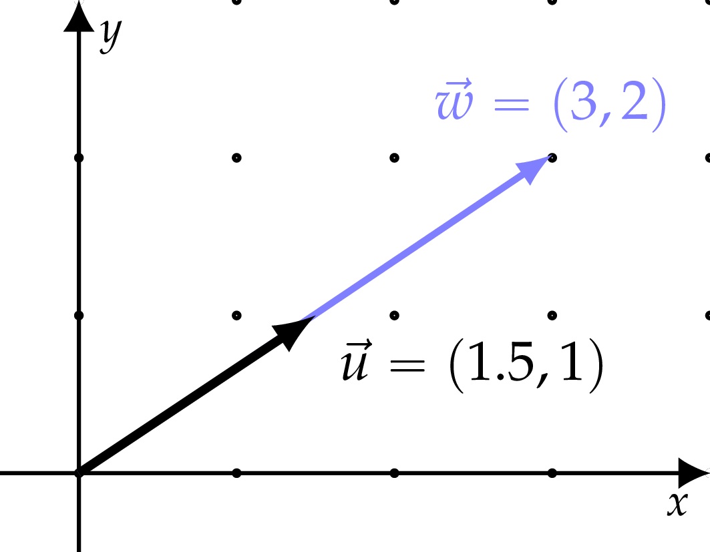
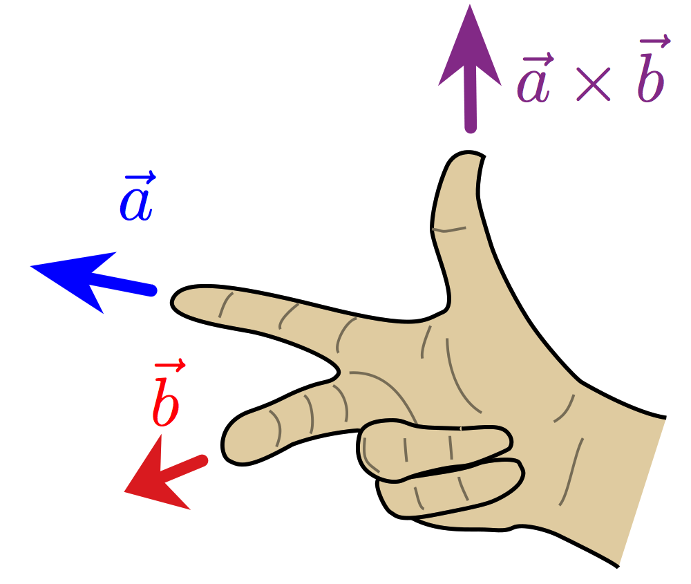

Chapter 2      

#[Chapter 2 Intro to linear algebra](./Chapter 2_ Intro to linear algebra.md)

The first chapter reviewed core ideas of mathematics. Now that we’re done with the prerequisites, we can begin the main discussion of linear algebra: the study of vectors and matrices.

##[2.1 Definitions](./Chapter 2_ Intro to linear algebra.md)

Vectors and matrices are the objects of study in linear algebra, and in this chapter we’ll define them and learn the basic operations we can perform on them.

We denote the set of \-dimensional vectors with real coefficients as . A vector  is an \-tuple of real numbers[1](./Front matter.md) For example, a three-dimensional vector is defined as a triple of numbers:

To specify the vector , we must specify the values for its three components, , , and . We’ll use the terms _components_ and _coordinates_ interchangeably throughout the book.

A matrix  is a rectangular array of real numbers with  rows and  columns. For example, a  matrix is defined like this:

![\; 
A
\; \eqdef  \; 
\left[\begin{array}{ccc}
a_{11} & a_{12} 	\\
a_{21} & a_{22}  	\\
a_{31} & a_{32} 
\end{array}\right]\!.](../Images/c3b4b3bc50ade70bc644e45b47543be8f5385517.png)

To specify the matrix , we need to specify the values of its six _entries_: , , , , , and .

In the remainder of this chapter we’ll learn about the mathematical operations we can perform on vectors and matrices. Many problems in science, business, and technology can be described in terms of vectors and matrices, so it’s important you understand how to work with these math objects.

###[Context](./Front matter.md)

To illustrate what’s new about vectors and matrices, let’s begin by reviewing the properties of something more familiar: the set of real numbers . The basic operations for real numbers are:

-   Addition (denoted )
-   Subtraction, the inverse of addition (denoted )
-   Multiplication (denoted implicitly)
-   Division, the inverse of multiplication (denoted by fractions)

You’re familiar with these operations and know how to use them to evaluate math expressions and solve equations.

You should also be familiar with _functions_ that take real numbers as inputs and give real numbers as outputs, denoted . Recall that, by definition, the _inverse function_  _undoes_ the effect of . If you are given  and want to find , you can use the inverse function as follows: . For example, the function  has the inverse , and the inverse of  is .

Having reviewed the basic operations for real numbers , let’s now introduce the basic operations for vectors  and matrices .

####[Vector operations](./Front matter.md)

The operations we can perform on vectors are:

-   Addition (denoted )
-   Subtraction, the inverse of addition (denoted )
-   Scaling (denoted implicitly)
-   Dot product (denoted )
-   Cross product (denoted )

We’ll discuss each of these vector operations in[Section 2.2](./Chapter 2_ Intro to linear algebra.md). Although you should already be familiar with vectors and vector operations from[Section 1.13](./Chapter 1_ Math fundamentals.md), it’s worth revisiting these concepts in greater depth, because vectors are the foundation of linear algebra.

####[Matrix operations](./Front matter.md)

The mathematical operations defined for matrices  and  are:

-   Addition (denoted )
-   Subtraction, the inverse of addition (denoted )
-   Scaling by a constant  (denoted )
-   Matrix product (denoted )
-   Matrix-vector product (denoted )
-   Matrix inverse (denoted )
-   Trace (denoted )
-   Determinant (denoted  or )

We’ll define each of these operations in[Section 2.3](./Chapter 2_ Intro to linear algebra.md), and we’ll learn about the various computational, geometric, and theoretical considerations associated with these matrix operations throughout the remainder of the book.

Let’s now examine one important matrix operation in closer detail: the matrix-vector product .

####[Matrix-vector product](./Front matter.md)

Consider the matrix  and the vector . The matrix-vector product  produces a linear combination of the columns of the matrix  with coefficients . For example, the product of a  matrix  and a  vector  results in a  vector, which we’ll denote :

![\begin{align*}
\vec{y} 
&= A \vec{x}, \\
\begin{bmatrix}
y_1 \\
y_2 \\
y_3
\end{bmatrix}
& = 
\begin{bmatrix}
a_{11} & a_{12} \\
a_{21} & a_{22} \\
a_{31} & a_{32} 
\end{bmatrix}
\!\!
\begin{bmatrix}
x_1 \\
x_2 
\end{bmatrix}
=
\!
\underbrace{
\begin{bmatrix}
x_1a_{11} + x_2a_{12} \\
x_1a_{21} + x_2a_{22} \\
x_1a_{31} + x_2a_{32} 
\end{bmatrix}
}_{\textrm{row picture}}
\!\!
=
\underbrace{
x_1\!
\begin{bmatrix}
a_{11} \\
a_{21} \\
a_{31} 
\end{bmatrix}
+
x_2\!
\begin{bmatrix}
a_{12} \\
a_{22} \\
a_{32} 
\end{bmatrix}
}_{\textrm{column picture}}\!\!.
\end{align*}](./images/f647f594c89aa5ff483ec631dec7e038a689bffc.png)

The key thing to observe in the above formula is the dual interpretation of the matrix-vector product  in the “row picture” and in the “column picture.” In the row picture, we obtain the vector  by computing the dot product of the vector  with each of the rows of the matrix . In the column picture, we interpret the vector  as  times the first column of  plus  times the second column of . In other words,  is a linear combination of the columns of . For example, if you want to obtain the linear combination consisting of three times the first column of  and four times the second column of , you can multiply  by the vector .

####[Linear combinations as matrix products](./Front matter.md)

Consider some set of vectors , and a third vector  that is a _linear combination_ of the vectors  and :

The numbers  are the coefficients in this linear combination.

The matrix-vector product is defined expressly for the purpose of studying linear combinations. We can describe the linear combination  as the following matrix-vector product:

The matrix  has  and  as columns. The dimensions of the matrix  will be , where  is the dimension of the vectors , , and .

####[Linear transformations](./Front matter.md)

Dear readers, we’ve reached the key notion in the study of linear algebra. This is the crux. The essential fibre. The main idea. I know you’re ready to handle it because you’re familiar with functions of a real variable , and you just learned the definition of the matrix-vector product (in which the variables were chosen to subliminally remind you of the standard conventions for the function input  and the function output ). Without further ado, I present to you the concept of a _linear transformation_.

The matrix-vector product corresponds to the abstract notion of a _linear transformation_, which is one of the key notions in the study of linear algebra. Multiplication by a matrix  can be thought of as computing a linear transformation  that takes \-vectors as inputs and produces \-vectors as outputs:

Instead of writing  to denote the linear transformation  applied to the vector , we can write . Since the matrix  has  rows, the result of the matrix-vector product is an \-vector. Applying the linear transformation  to the vector  corresponds to the product of the matrix  and the column vector . We say  is _represented by_ the matrix .

#####[Inverse](./Front matter.md)

When a matrix  is square and invertible, there exists an inverse matrix  which _undoes_ the effect of  to restore the original input vector:

Using the matrix inverse  to undo the effects of the matrix  is analogous to using the inverse function  to undo the effects of the function .

#####[Example 1](./Front matter.md)

Consider the linear transformation that multiplies the first components of input vectors by  and multiplies the second components by , as described by the matrix

The inverse of the matrix  is

The inverse matrix multiplies the first component by  and the second component by , which effectively undoes what  did.

#####[Example 2](./Front matter.md)

Things get a little more complicated when matrices _mix_ the different components of the input vector, as in this example:

Make sure you understand how to compute  using both the _row picture_ and the _column picture_ of the matrix-vector product.

The inverse of the matrix  is the matrix

Multiplication by the matrix  is the “undo action” for multiplication by :

By definition, the inverse  _undoes_ the effects of the matrix . The cumulative effect of applying  after  is the _identity matrix_ , which has 1s on the diagonal and 0s everywhere else:

Note that  for any vector .

We’ll discuss matrix inverses and how to compute them in more detail later [Section 3.5](./Chapter 3_ Computational linear algebra.md)). For now, it’s important you know they exist.

###[An overview of linear algebra](./Front matter.md)

In the remainder of the book, we’ll learn all about the properties of vectors and matrices. Matrix-vector products play an important role in linear algebra because of their relation to _linear transformations_.

Functions are transformations from an input space (the domain) to an output space (the image). A linear transformation  is a function that takes \-vectors as inputs and produces \-vectors as outputs. If the function  is linear, the output  of  applied to  can be computed as the matrix-vector product , for some matrix . We say  is _represented by_ the matrix . Equivalently, every matrix  corresponds to some linear transformation . Given the equivalence between matrices and linear transformations, we can reinterpret the statement “linear algebra is about vectors and matrices” by saying “linear algebra is about vectors and linear transformations.”

You can adapt your existing knowledge about functions to the world of linear transformations. The action of a function on a number is similar to the action of a linear transformation on a vector. The table below summarizes several useful correspondences between functions and linear transformations.

![\begin{align*}
\textrm{function } 
f:\mathbb{R}\to \mathbb{R}
& \; \Leftrightarrow \!\!\:
\begin{array}{l}
\textrm{linear transformation } 
T_A:\mathbb{R}^{n}\! \to \mathbb{R}^{m}		 \\
\textrm{represented by the matrix } A \in \mathbb{R}^{m \times n}
\end{array} \\
\textrm{input }  x\in \mathbb{R} 	
& \; \Leftrightarrow \;  
\textrm{input }  \vec{x} \in \mathbb{R}^n           \\
\textrm{output } f(x) \in \mathbb{R}
& \; \Leftrightarrow \; 
\textrm{output }      T_A(\vec{x}) = A\vec{x} \in \mathbb{R}^m \\
g\circ\! f \: (x) =  g(f(x))
& \; \Leftrightarrow \; 
T_B(T_A(\vec{x})) = BA \vec{x} \\
\textrm{function inverse } f^{-1}
& \; \Leftrightarrow \; 
\textrm{matrix inverse } A^{-1}												 	\\
\textrm{roots of } f
& \; \Leftrightarrow \; 
\textrm{kernel of } T_A  =  \textrm{null space of } A = \mathcal{N}(A)  			  	\\
\textrm{image of } f
& \; \Leftrightarrow \!
\begin{array}{l}
\textrm{image of } T_A =  \textrm{column space of } A  = \mathcal{C}(A) 		  
\end{array}
\end{align*}](./images/e0747bb248a8a973a2d740cfd58b4f4e6fb3d19f.png)

Table 2.1: Correspondences between functions and linear transformations.

This table of correspondences serves as a roadmap for the rest of the material in this book. You’ll notice the table introduces several new linear algebra concepts like _kernel_, _null space_, and _column space_, but not too many. You can totally do this!

Remember to always connect the new concepts of linear algebra to concepts you’re already familiar with. For example, the roots of a function  are the set of inputs for which the function’s output is zero. Similarly, the _kernel_ of a linear transformation  is the set of inputs that  sends to the zero vector. The roots of a function  and the kernel of a linear transformation  are essentially the same concept; we’re just upgrading functions to vector inputs.

In[Chapter 1](./Chapter 1_ Math fundamentals.md), I explained why functions are useful tools for modelling the real world. Well, linear algebra is the “vector upgrade” to your real-world modelling skills. With linear algebra you’ll be able to model complex relationships between multivariable inputs and multivariable outputs. To build modelling skills, you must first develop your geometric intuition about lines, planes, vectors, bases, linear transformations, vector spaces, vector subspaces, etc. It’s a lot of work, but the effort you invest will pay dividends.

###[Links](./Front matter.md)

\[ Linear algebra lecture series by Prof. Strang from MIT \]

[`http://bit.ly/1ayRcrj`](./1ayRcrj.md) (row and column picture example)

\[ A system of equations in the row picture and column picture \]

[`https://www.youtube.com/watch?v=uNKDw46_Ev4`](./watch_v=uNKDw46_Ev4.md)

###[Exercises](./Front matter.md)

E2.1 Find the inverse matrix  for the matrix . Verify that  for any vector .

E2.2 Given the matrices  and , and the vectors  and , compute the following expressions.

1.  
2.  
3.  
4.  
5.  
6.  

E2.3 Find the components  and  of the vector  so that , where  is the following matrix:

###[What next?](./Front matter.md)

We won’t bring geometry, vector spaces, algorithms, and the applications of linear algebra into the mix all at once. Instead, let’s start with the basics. Since linear algebra is about vectors and matrices, let’s define vectors and matrices precisely, and describe the math operations we can perform on them.

##[2.2 Vector operations](./Chapter 2_ Intro to linear algebra.md)

[Section 1.13](./Chapter 1_ Math fundamentals.md) introduced some basic notions about vectors. Understanding vectors is so important for linear algebra that it’s worth going beyond the rudimentary understanding of vectors as “directional quantities,” and so we took the time to describe vectors more abstractly—as math objects. With vectors defined, our next step is to specify their properties and the operations we can perform on vectors. This is what this section is all about.

###[Definitions](./Front matter.md)

Consider the vectors  and , and an arbitrary constant . Vector algebra can be summarized as the following operations:

-   Addition: 
-   Subtraction: 
-   Scaling: 
-   Dot product: 
-   Cross product: 
-   Length: 

In the next few pages we’ll see what these operations can do for us.

###[Notation](./Front matter.md)

The set of real numbers is denoted . An \-dimensional real vector consists of  real numbers slapped together in a bracket. We denote the set of three-dimensional vectors as . Similarly, the set of \-dimensional real vectors is denoted .

When learning about new math operations, it’s important to keep track of the types of inputs and the types of outputs of each operation. In computer science, this information is called the _type signature_. For example, the type signature “” tells us the math operation  takes real numbers as inputs and produces real numbers as outputs. Certain operations take pairs of numbers as inputs, like addition for example:  (usually denoted ). The type signature for addition is “,” which tells us addition takes two real numbers as inputs and produces real numbers as outputs. The symbol “” denotes the _Cartesian product_ of two sets. The Cartesian product  contains all possible pairs of real numbers , where  and . Note the math symbol “” has two different meanings depending on the objects that surround it. The expression  denotes the cross product of vectors  and , while the expression  denotes the Cartesian product of sets  and .

The use of such formal math notation may seem complicated at first, but it’s very helpful when defining new math operations.

###[Addition and subtraction](./Front matter.md)

Addition and subtraction take pairs of vectors as inputs and produce vectors as outputs:

Addition and subtraction are performed component-wise:

![\vec{w}=\vec{u} \pm \vec{v} \qquad  \; \; \Leftrightarrow \qquad \; \;  w_{i} = u_i \pm  v_i, 
\; \;  \forall i \in[1,\ldots,n].](../Images/831567c9b5e802295da876513f877a4a0a9ef293.png)

###[Scaling by a constant](./Front matter.md)

Scaling is an operation that takes a number and a vector as inputs and produces a vector output:

There is no symbol to denote scalar multiplication—we just write the scale factor in front of the vector and the multiplication is implicit.

Multiplying the vector  by the scale factor  is equivalent to multiplying each component of the vector by :

For example, choosing , we obtain the vector , which is two times longer than the vector :

Figure 2.1: Vectors  and  are related by the equation .

###[Vector products](./Front matter.md)

We’ll now define the _dot product_ and the _cross product_: two geometric operations useful for working with three-dimensional vectors.

####[Dot product](./Front matter.md)

The _dot product_ takes two vectors as inputs and produces a single, real number as an output:

The dot product between the vector  and the vector  can be computed using either the algebraic formula,

or the geometric formula,

where  is the angle between the two vectors. Note the value of the dot product depends on the vectors’ lengths and the cosine of the angle between them.

The dot product is the key tool for calculating vector projections, vector decompositions, and determining orthogonality. The name _dot product_ comes from the symbol used to denote it. It is also known as the _scalar product_, since the result of the dot product is a scalar number—a number that does not change when the basis changes. The dot product is also sometimes called the _inner product_.

We can combine the algebraic and the geometric formulas for the dot product to obtain the formula,

This formula makes it possible to find the angle between two vectors if we know their components.

The geometric factor  depends on the relative orientation of the two vectors as follows:

-   If the vectors point in the same direction, then , so .
-   If the vectors are perpendicular to each other, then , so .
-   If the vectors point in exactly opposite directions, then , so .

The dot product is defined for vectors of any dimension; as long as two vectors are defined with respect to the same basis, we can compute the dot product between them.

###[Cross product](./Front matter.md)

The _cross product_ takes two vectors as inputs and produces another vector as the output:

The cross product of two vectors is perpendicular to both vectors:

If you take the cross product of one vector pointing in the \-direction with another vector pointing in the \-direction, the result will be a vector in the \-direction: . The name _cross product_ comes from the symbol used to denote it. It is also sometimes called the _vector product_, since the output of this operation is a vector.

The cross products of individual basis elements are defined as

Look at[Figure 1.55](./Chapter 1_ Math fundamentals.md) on page 1.55 and imagine the vectors , , and  pointing along each axis. Try to visualize the three equations above.

The cross product is _anticommutative_, which means swapping the order of the inputs introduces a negative sign in the output:

It’s likely that, until now, the products you’ve seen in math have been _commutative_, which means the order of the inputs doesn’t matter. The product of two numbers is commutative , and the dot product of two vectors is commutative , but the cross product of two vectors is _anti_commutative .

Given two vectors  and , their cross product is calculated as

Computing the cross product requires a specific combination of multiplications and subtractions of the input vectors’ components. The result of this combination is the vector  which is perpendicular to both  and .

The length of the cross product of two vectors is proportional to the sine of the angle between the two vectors:

####[The right-hand rule](./Front matter.md)

Consider the plane formed by the vectors  and . There are actually _two_ vectors perpendicular to this plane: one above the plane and one below the plane. We use the _right-hand rule_ to figure out which of these vectors corresponds to the cross product .

Make a fist with your right hand and then extend your thumb, first finger, and middle finger. When your index finger points in the same direction as the vector  and your middle finger points in the direction of , your thumb will point in the direction of . The relationship encoded in the right-hand rule matches the relationship between the standard basis vectors: .

Figure 2.2: Using the right-hand rule to determine the direction of the cross product  based on directions of  and .

###[Links](./Front matter.md)

\[ Nice illustrations of the cross product \]

[`http://1ucasvb.tumblr.com/post/76812811092/`](./76812811092.md)

[https://www.youtube.com/watch?v=eu6i7WJeinw](./watch_v=eu6i7WJeinw.md)

###[Length of a vector](./Front matter.md)

The length of a vector is a nonnegative number that describes the extent of the vector in space, and is sometimes referred to as the vector’s _magnitude_ or the _norm_. We express the notion of length as an \-dimensional extension of Pythagoras’ formula: it is the length of the hypotenuse in a right-angle triangle, given the lengths of its two sides, just applied to  dimensions. The length of a vector  is denoted  or  or sometimes simply .

The _length_ of the vector  is computed as follows:

There are many mathematical concepts that correspond to the intuitive notion of length. The formula above computes the _Euclidian length_ (or _Euclidian norm_) of the vector. Another name for the Euclidian length is the \-norm (pronounced _ell-two norm[2](./Front matter.md)).

Note a vector’s length can also be computed as the square root of the dot product of the vector with itself: . Indeed, there is a deep mathematical connection between norms and inner products.

###[Unit vectors](./Front matter.md)

A _unit vector_ is a vector that has length one. Given a vector  of any length, we can build a unit vector in the same direction by dividing  by its own length:

Unit vectors are useful in many contexts. For instance, when we want to specify a direction in space, we use a unit vector in that direction.

###[Projection](./Front matter.md)

Pop-quiz time! Can you remember some essentials from[Section 1.13](./Chapter 1_ Math fundamentals.md)? Suppose I give you a direction  and some vector , and ask you how much of  is in the direction ? To find the answer, you must compute the dot product:

where  is the angle between  and . This formula is used in physics to compute \-components of forces: .

Define the _projection_ of a vector  in the  direction as follows:

If the direction is specified by a vector  that doesn’t have length one, then the projection formula becomes

Division by the length squared transforms the two appearances of the vector  into the unit vectors  needed for the projection formula:

Remember these projection formulas well because we’ll need them later: when computing projections onto planes [Section 4.2.4](./Chapter 4_ Geometric aspects of linear algebra.md)), when computing vector coordinates [Section 4.3](./Chapter 4_ Geometric aspects of linear algebra.md)), and when describing the change-of-basis operation [Section 5.3](./Chapter 5_ Linear transformations.md)).

###[Discussion](./Front matter.md)

This section elaborated on the properties of \-dimensional vectors, which are ordered tuples (lists) of  components. It’s important to think of vectors as whole mathematical objects, rather than as components. Although vector operations boil down to manipulations of their components, vectors are most useful (and best understood) when you think of them as whole objects that have components, rather than focussing on their components.

###[Links](./Front matter.md)

\[ Nice illustration of the cross product \]

[`http://1ucasvb.tumblr.com/post/76812811092/`](./76812811092.md)

\[ Vectors explained by 3Blue1Brown \]

[`https://youtube.com/watch?v=fNk_zzaMoSs`](./watch_v=fNk_zzaMoSs.md)

\[ Cross products explained by 3Blue1Brown \]

[`https://youtube.com/watch?v=eu6i7WJeinw`](./watch_v=eu6i7WJeinw.md)

###[Exercises](./Front matter.md)

E2.4 Given the vectors  and , compute the following vector expressions:

**a)**  **b)**  **c)**  **d)** 

E2.5 Given  and , compute the following vector products: **a)** ; **b)** ; **c)** ; **d)** .

E2.6 For each of the following vectors, , , , , complete the following tasks:

1.  Draw the vector in a Cartesian plane.
2.  Compute the vector’s \- and \-coordinates.
3.  Compute the projection of the vector in the direction . Your answer should be a vector quantity.
4.  Compute the projection of the vector in the direction .
5.  Compute the projection of the vector in the direction , and find the length of the projection.

Recall the formula for the projection of the vector  in the direction  is defined as .

##[2.3 Matrix operations](./Chapter 2_ Intro to linear algebra.md)

A matrix is a two-dimensional array (a table) of numbers. Consider the  by  matrix . We denote the matrix as a whole  and refer to its individual entries as , where  is the number in the th row and the th column of . What are the mathematical operations we can perform on this matrix?

###[Addition and subtraction](./Front matter.md)

The matrix addition and subtraction operations take pairs of matrices as inputs and produce matrices as outputs:

Addition and subtraction are performed as follows:

![C = A \pm B
\quad \Leftrightarrow \quad
c_{ij} = a_{ij} \pm b_{ij}, \; \forall i \in[1,\ldots,m], j\in[1,\ldots,n].](../Images/66d32033b19b4a6ac81d8a14457690b863117aad.png)

For example, addition for two  matrices is expressed as

Matrices must have the same dimensions to be added or subtracted.

###[Multiplication by a constant](./Front matter.md)

Recall that _scaling_ is another word for multiplication by a constant. Given a number  and a matrix , we can _scale_  by  as follows:

###[Matrix-vector multiplication](./Front matter.md)

The result of the matrix-vector product between a matrix  and a vector  is an \-dimensional vector:

The formula for the matrix-vector product is

![\vec{w} = A\vec{v}
\qquad \Leftrightarrow  \qquad
w_{i} = \sum_{j=1}^n a_{ij}v_{j}, \quad \forall i \in[1,\ldots,m].](../Images/e283e255ff4f8d6c4d8fef4ef8b9ba8025635ad7.png)

For example, the product of a  matrix  and the  column vector  results in a  vector:

![\begin{align*}
A\vec{v} =
\begin{bmatrix}
a_{11} 		& a_{12}	 \\
a_{21} 		& a_{22}	 \\
a_{31} 		& a_{32}	
\end{bmatrix}\!\!
\begin{bmatrix}
v_{1} 	\\
v_{2} 
\end{bmatrix}
& = 	
\underbrace{		
v_1\!\!
\begin{bmatrix}
a_{11} \\
a_{21} \\
a_{31} 
\end{bmatrix}
+
v_2\!\!
\begin{bmatrix}
a_{12} \\
a_{22} \\
a_{32} 
\end{bmatrix} 							 
}_{\textrm{column picture}}  						 \\
&=
\left.
\begin{bmatrix}
(a_{11}, a_{12}) \cdot \vec{v} \\
(a_{21}, a_{22}) \cdot \vec{v} \\
(a_{31}, a_{32}) \cdot \vec{v}  
\end{bmatrix} 
\;  \; \right\} \textrm{\scriptsize row picture} 			\\
&=
\begin{bmatrix}
a_{11}v_{1} 		+ a_{12}v_{2}		\\
a_{21}v_1 		+ a_{22}v_2		 \\
a_{31}v_1 		+ a_{32}v_2	
\end{bmatrix}
\quad \in \mathbb{R}^{3 \times 1}.
\end{align*}](./images/d9b061527732c29a23e7aeac5bd925082095288e.png)

Note the two equivalent ways to understand the matrix-vector product: the _column picture_ and the _row picture_. In the column picture, the multiplication of the matrix  by the vector  produces a **linear combination of the columns of the matrix**. In the row picture, multiplication of the matrix  by the vector  produces a column vector with components equal to the **dot products of the rows of the matrix  with the vector .**

###[Matrix-matrix multiplication](./Front matter.md)

The matrix product  of matrices  and  results in an  matrix:

The formula for matrix multiplication computes the dot product between each row of  and each column of :

![C = AB
\qquad \Leftrightarrow  \qquad
c_{ij} = \sum_{k=1}^\ell a_{ik}b_{kj}, \forall i \in[1,\ldots,m],j \in[1,\ldots,n].](../Images/d0e6619f25e929299db9cc7d409a3eff6af97f8e.png)

###[Transpose](./Front matter.md)

The transpose matrix  is defined by the formula . We obtain the transpose by “flipping” the matrix through its diagonal:

Note that entries on the diagonal of the matrix do not change when we apply the transpose operation.

####[Properties of the transpose operation](./Front matter.md)

-   
-   
-   
-   

###[Vectors as matrices](./Front matter.md)

A vector is a special type of matrix. You can treat a vector  either as a _column vector_ ( matrix) or as a _row vector_ ( matrix).

####[Inner product](./Front matter.md)

Recall the definition of the _dot product_ or _inner product_ for vectors:

If we think of vectors as _column_ vectors, we can write the dot product in terms of the matrix transpose operation  and the standard rules of matrix multiplication:

The dot product for vectors is thus a special case of matrix multiplication. Alternatively, we could say that matrix multiplication is defined in terms of the dot product.

####[Outer product](./Front matter.md)

Consider again two _column_ vectors  and  ( matrices). We obtain the inner product by applying the transpose to the _first_ vector in the product: . Instead, if we apply the transpose to the _second_ vector, we’ll obtain the _outer product_ of  and . The outer product operation takes pairs of vectors as inputs and produces matrices as outputs:

For example, the outer product of two vectors in  is

Observe that the matrix-matrix product of a  matrix and a  matrix results in a  matrix.

In[Section 4.2.6](./Chapter 4_ Geometric aspects of linear algebra.md) we’ll see how the outer product is used to build _projection matrices_. For example, the matrix that corresponds to the projection onto the \-axis is . The \-projection of any vector  is computed as the matrix-vector product, . More on that later.

###[Matrix inverses](./Front matter.md)

Multiplying an invertible matrix  by its inverse  produces the identity matrix: . The _identity matrix_ obeys  for all vectors . The inverse matrix  _undoes_ whatever  did. The cumulative effect of multiplying by  and  is equivalent to the identity transformation,

We can think of “finding the inverse” () as an operation of the form

Note that only _invertible_ matrices have an inverse. Some matrices are not invertible—there is no “undo” operation for them. We’ll postpone the detailed discussion of invertibility until[Section 5.4](./Chapter 5_ Linear transformations.md).

####[Properties of matrix inverse operation](./Front matter.md)

-   
-   
-   
-   

The matrix inverse plays the role of “division by the matrix ” in matrix equations. We’ll discuss matrix equations in[Section 3.2](./Chapter 3_ Computational linear algebra.md).

###[Trace](./Front matter.md)

The _trace_ of an  matrix is the sum of the  values on its diagonal:

![\textrm{Tr} : \mathbb{R}^{n \times n} \to \mathbb{R}, \qquad \quad
\textrm{Tr}\!\left[ A \right] 
\; \eqdef \; 
\sum_{i=1}^n a_{ii}.](../Images/4f7cd34025fcfd96f0639597bc683106e9500f76.png)

####[Properties of the trace operation](./Front matter.md)

-   ![\textrm{Tr}\!\left[ \alpha A + \beta B\right]  
    =  \alpha\textrm{Tr}\!\left[ A \right]   +  \beta \textrm{Tr}\!\left[ B\right]](../Images/cdd59c073cdf1fe41cea8952df8fffc30f8838af.png)              (linear property)
-   ![\textrm{Tr}\!\left[ AB \right]  	=  \textrm{Tr}\!\left[ BA \right]](../Images/3f059047e6e135b6b1fe22bb7fa7875b41e6d0bc.png)
-   ![\textrm{Tr}\!\left[ ABC \right]    	=  \textrm{Tr}\!\left[ CAB \right] =  \textrm{Tr}\!\left[ BCA \right]](../Images/c76355ed458bf3c7ddc636a0727bf073b01d42ad.png)             (cyclic property)
-   ![\textrm{Tr}\!\left[ A^\sfT \right]  =  \textrm{Tr}\!\left[ A \right]](../Images/c2b5797e810f13049a83838059f7649f49174555.png)
-   ![\textrm{Tr}\!\left[ A \right]  	=  \sum_{i=1}^{n} \lambda_i](../Images/899e08f08319403c2d2e2d02f313a9dfdc8be08b.png),    where  are the eigenvalues of 

###[Determinant](./Front matter.md)

The _determinant_ of a matrix is a calculation that involves all the entries of the matrix, and whose output is a single number:

The determinant describes the relative geometry of the vectors that make up the rows of the matrix. More specifically, the determinant of a matrix  tells you the _volume_ of a box with sides given by rows of .

For example, the determinant of a  matrix is

The quantity  corresponds to the area of the parallelogram formed by the vectors  and . Observe that if the rows of  point in the same direction,  for some , then the area of the parallelogram will be zero. If the determinant of a matrix is nonzero, then the rows of that matrix are linearly independent.

####[Properties of determinants](./Front matter.md)

-   
-   ,    where  are the eigenvalues of 
-   
-   

###[Discussion](./Front matter.md)

Understanding vector and matrix operations is essential for understanding more advanced theoretical topics and the applications of linear algebra. In the remainder of this book, you’ll learn about various algebraic and geometric interpretations of the matrix operations defined in this section. Seeing all these definitions at the same time can be overwhelming, I know; but the good news is that we’ve defined all the math operations and notation we’ll need for the rest of the book. It could be worse, right?

So far, we’ve defined two of the main actors in linear algebra: vectors and matrices. But our introduction to linear algebra won’t be complete until we introduce _linearity_, the main thread that runs through all the topics in this book.

###[Exercises](./Front matter.md)

E2.7 Given the matrices , , and , compute the expressions.

1.  
2.  
3.  
4.  
5.  
6.  
7.  
8.  
9.  
10.  
11.  
12.  
13.  
14.  

Some of these expressions may not exist.

E2.8 Given the  matrices (row vectors)  and , compute the following products:

1.  
2.  
3.  
4.  
5.  
6.  

The transpose of a  row vector is a  column vector.

E2.9 Find the unknowns  and  in the equation .

##[2.4 Linearity](./Chapter 2_ Intro to linear algebra.md)

What is linearity and why is this entire book dedicated to learning about it? Consider an arbitrary function that contains terms with different powers of the input variable :

The term  is the _linear_ term in this expression—it contains  raised to the first power. All the other terms are _nonlinear_. The linear term is special because changes in the value of the input  lead to proportional changes in the value of . If the input is , the linear term will have value . If the input is , the linear term will have value . This input-output proportionality does not hold for nonlinear terms.

In this section we’ll discuss the special properties of expressions and equations containing only linear terms.

###[Introduction](./Front matter.md)

A single-variable function takes as its input a real number  and outputs a real number . The type signature of this function is

The most general linear function from  to  looks like this:

where  is called the _coefficient_ of . The action of a linear function is to multiply the input by the constant . So far, so good.

#####[Example of composition of linear functions](./Front matter.md)

Given the linear functions  and , what is the equation of the function ? The composition of  and  is the function . Note the composition of two linear functions is also a linear function. The coefficient of  is equal to the product of the coefficients of  and .

###[Definition](./Front matter.md)

Linear functions map any linear combination of inputs to the same linear combination of outputs. A function  is _linear_ if it satisfies the equation

for any two inputs  and , and for all constants  and .

###[Lines are not linear functions!](./Front matter.md)

Consider the equation of a line:

where the constant  corresponds to the slope of the line, and the constant  is its initial value. A _line_  with  is _not_ a linear function. This logic may seem a bit weird, but if you don’t trust me, you can check for yourself:

A function with a linear part added to a constant term is called an _affine transformation_. Affine transformations are cool but a bit off-topic, since this book focuses on _linear_ transformations.

###[Multivariable functions](./Front matter.md)

The study of linear algebra is the study of _all_ things linear. In particular, we’ll learn how to work with functions that take multiple variables as inputs. Consider the set of functions that take pairs of real numbers as inputs and produce real numbers as outputs:

The most general linear function of two variables is

You can think of  as the \-slope and  as the \-slope of the function. We say  is the \-coefficient and  the \-coefficient in the linear expression .

###[Linear expressions](./Front matter.md)

A _linear expression_ in the variables , , and  has the form,

where , , and  are arbitrary constants. Note the new terminology “linear in ,” which refers to an expression in which the variable  is raised to the first power. The expression  contains nonlinear factors (, , and ) but is a linear expression in the variables , , and .

###[Linear equations](./Front matter.md)

A _linear equation_ in the variables , , and  has the form

This equation is linear because it contains only linear terms in the variables , , and .

#####[Example](./Front matter.md)

Linear equations are very versatile. Suppose you know that the following equation describes some real-world phenomenon:

where , , and  correspond to three variables of interest. You can interpret this equation as describing the variable  as a function of the variables  and , and rewrite the equation as

Using this function, you can predict the value of  given the knowledge of the quantities  and .

Another option would be to interpret  as a function of  and : . This model would be useful if you know the quantities  and  and want to predict the value of the variable .

###[Applications](./Front matter.md)

####[Geometric interpretation of linear equations](./Front matter.md)

The linear equation in  and ,

corresponds to a line with the equation  in the Cartesian plane. The slope of the line is  and its \-intercept is . The special case when  corresponds to a vertical line with equation .

The most general linear equation in , , and ,

corresponds to the equation of a plane in a three-dimensional space. Assuming , we can rewrite this equation so  (the “height”) is a function of the coordinates  and : . The slope of the plane in the \-direction is  while the slope in the \-direction is . The \-intercept of this plane is .

####[First-order approximations](./Front matter.md)

When we use a linear function as a mathematical model for a nonlinear, real-world input-output process, we say the function represents a _linear model_ or a _first-order approximation_ for the process. Let’s analyze what this means in more detail, and see why linear models are so popular in science.

In calculus, we learn that functions can be represented as infinite Taylor series:

where the coefficient  depends on the th derivative of . The Taylor series is only equal to the function  if infinitely many terms in the series are calculated. If we sum together only a finite number of terms in the series, we obtain a _Taylor series approximation_. The first-order Taylor series approximation to  is

The above equation describes the best approximation to  near , by a line of the form . To build a linear model  of a real-world process, it is sufficient to measure two parameters: the initial value  and the rate of change .

Scientists routinely use linear models because this kind of model allows for easy _parametrization_. To build a linear model, the first step is to establish the initial value  by inputting  to the process and seeing what comes out. Next, we vary the input by some amount , and observe the resulting change in the output . The rate of change parameter is equal to the change in the output divided by the change in the input . Thus, we can obtain the parameters of a linear model in two simple steps. In contrast, finding the parametrization of nonlinear models is a more complicated task.

For a function  that takes three variables as inputs, the first-order Taylor series approximation is

Except for the constant term, the function has the form of a linear expression. The “first-order approximation” to a function of  variables  has the form .

As in the single-variable case, finding the parametrization of a multivariable linear model is a straightforward task. Suppose we want to model some complicated real-world phenomenon that has  input variables. First, we input only zeros to obtain the initial value . Next, we go through each of the input variables one-by-one and measure how a small change in each input  affects the output . The rate of change with respect to the input  is . By combining the knowledge of the initial value  and the “slopes” with respect to each input parameter, we’ll obtain a complete linear model of the phenomenon.

###[Discussion](./Front matter.md)

In the next three chapters, we’ll learn about more mathematical objects and mathematical operations. Linear algebra is the study of vectors, matrices, linear transformations, vector spaces, and other abstract, vector-like objects. The mathematical operations we’ll perform on these objects will be linear: . Linearity is the core assumption of linear algebra.

###[Exercises](./Front matter.md)

E2.10 Are these expressions linear in the variables , , and ?

1.  
2.  
3.  

##[2.5 Overview of linear algebra](./Chapter 2_ Intro to linear algebra.md)

In linear algebra, you’ll learn new computational techniques and develop new ways of thinking about math. With these new tools, you’ll be able to use linear algebra techniques for many applications. Let’s look at what lies ahead in this book.

###[Computational linear algebra](./Front matter.md)

The first steps toward understanding linear algebra will seem a little tedious. In[Chapter 3](./Chapter 3_ Computational linear algebra.md) you’ll develop basic skills for manipulating vectors and matrices. Matrices and vectors have many components and performing operations on them involves many arithmetic steps—there is no way to circumvent this complexity. Make sure you understand the basic algebra rules (how to add, subtract, and multiply vectors and matrices) because they are a prerequisite for learning more advanced material. You should be able to perform all the matrix algebra operations with pen and paper for small and medium-sized matrices.

The good news is, with the exception of your homework assignments and final exam, you won’t have to carry out matrix algebra by hand. It is much more convenient to use a computer for large matrix calculations. The more you develop your matrix algebra skills, the deeper you’ll be able to delve into the advanced topics.

###[Geometric linear algebra](./Front matter.md)

So far, we’ve described vectors and matrices as arrays of numbers. This is fine for the purpose of doing _algebra_ on vectors and matrices, but this description is not sufficient for understanding their geometric properties. The components of a vector  can be thought of as distances measured along a coordinate system with  axes. The vector  can therefore be said to “point” in a particular direction with respect to the coordinate system. The fun part of linear algebra starts when you learn about the geometric interpretation of the algebraic operations on vectors and matrices.

Consider some unit vector that specifies a direction of interest . Suppose we’re given some other vector , and we’re asked to find _how much of  is in the  direction_. The answer is computed using the dot product: , where  is the angle between  and . The technical term for the quantity  is “the length of the projection of  in the  direction.” By “projection,” I mean we ignore all parts of  that are not in the  direction. Projections are used in mechanics to calculate the \- and \-components of forces in force diagrams. In[Section 4.2](./Chapter 4_ Geometric aspects of linear algebra.md) we’ll learn how to calculate all kinds of projections using the dot product.

To further consider the geometric aspects of vector operations, imagine the following situation. Suppose I gave you two vectors  and , and asked you to find a third vector  that is perpendicular to both  and . A priori this sounds like a complicated question to answer, but in fact the required vector  can easily be obtained by computing the cross product .

In[Section 4.1](./Chapter 4_ Geometric aspects of linear algebra.md) we’ll learn how to describe lines and planes in terms of points, direction vectors, and normal vectors. Consider the following geometric problem: given the equations of two planes in , find the equation of the line where the two planes intersect. There is an algebraic procedure called _Gauss–Jordan elimination_ we can use to find the solution.

The determinant of a matrix has a geometric interpretation [Section 3.4](./Chapter 3_ Computational linear algebra.md)). The determinant tells us something about the relative orientation of the vectors that make up the rows of the matrix. If the determinant of a matrix is zero, it means the rows are not _linearly independent_, in other words, at least one of the rows can be written in terms of the other rows. Linear independence, as we’ll see shortly, is an important property for vectors to have. The determinant is a convenient way to test whether vectors are linearly independent.

As you learn about geometric linear algebra, practice _visualizing_ each new concept you learn about. Always keep a picture in your head of what is going on. The relationships between two-dimensional vectors can be represented in vector diagrams. Three-dimensional vectors can be visualized by pointing pens and pencils in different directions. Most of the intuition you build about vectors in two and three dimensions are applicable to vectors with more dimensions.

###[Theoretical linear algebra](./Front matter.md)

Linear algebra will teach you how to reason about vectors and matrices in an abstract way. By thinking abstractly, you’ll be able to extend your geometric intuition of two and three-dimensional problems to problems in higher dimensions. Much _knowledge buzz_ awaits as you learn about new mathematical ideas and develop new ways of thinking.

You’re no doubt familiar with the normal coordinate system made of two orthogonal axes: the \-axis and the \-axis. A vector  is specified in terms of its coordinates  with respect to these axes. When we say , what we really mean is , where  and  are unit vectors that point along the \- and \-axes. As it turns out, we can use many other kinds of coordinate systems to represent vectors. A _basis_ for  is any set of two vectors  that allows us to express all vectors  as linear combinations of the basis vectors: . The same vector  corresponds to two different coordinate pairs, depending on which basis is used for the description:  in the basis  and  in the basis . We’ll learn about bases and their properties in great detail in the coming chapters. The choice of basis plays a fundamental role in all aspects of linear algebra. Bases relate the real-world to its mathematical representation in terms of vector and matrix components.

In the text above, I explained that computing the product between a matrix and a vector  can be thought of as a linear transformation, with input  and output . Any linear transformation [Section 5.1](./Chapter 5_ Linear transformations.md)) can be represented [Section 5.2](./Chapter 5_ Linear transformations.md)) as a multiplication by a matrix . Conversely, every  matrix  can be thought of as performing a linear transformation . The equivalence between matrices and linear transformations allows us to identify certain matrix properties with properties of linear transformations. For example, the _column space_  of the matrix  (the set of vectors that can be written as a combination of the columns of ) corresponds to the image space of the linear transformation  (the set of possible outputs of ).

The eigenvalues and eigenvectors of matrices [Section 6.1](./Chapter 6_ Theoretical linear algebra.md)) allow us to describe the actions of matrices in a natural way. The set of eigenvectors of a matrix are special input vectors for which the action of the matrix is described as a _scaling_. When a matrix acts on one of its eigenvectors, the output is a vector in the same direction as the input vector scaled by a constant. The scaling constant is the _eigenvalue_ (own value) associated with this eigenvector. By specifying all the eigenvectors and eigenvalues of a matrix, it is possible to obtain a complete description of what the matrix does. Thinking of matrices in terms of their eigenvalues and eigenvectors is a powerful technique for describing their properties and has many applications.

Linear algebra is useful because linear algebra techniques can be applied to all kinds of “vector-like” objects. The abstract concept of a vector space [Section 6.3](./Chapter 6_ Theoretical linear algebra.md)) captures precisely what it means for some class of mathematical objects to be “vector-like.” For example, the set of polynomials of degree at most two, denoted , consists of all functions of the form . Polynomials are vector-like because it’s possible to describe each polynomial in terms of its coefficients . Furthermore, the sum of two polynomials and the multiplication of a polynomial by a constant both correspond to vector-like calculations of coefficients. Once you realize polynomials are vector-like, you’ll be able to use notions like _linear independence_, _dimension_, and _basis_ when working with polynomials.

###[Useful linear algebra](./Front matter.md)

One of the most useful skills you’ll learn in linear algebra is the ability to solve systems of linear equations. Many real-world problems are expressed as linear equations in multiple unknown quantities. You can solve for  unknowns simultaneously if you have a set of  linear equations that relate the unknowns. To solve this system of equations, eliminate the variables one by one using basic techniques such as substitution and subtraction (see[Section 1.15](./Chapter 1_ Math fundamentals.md)); however, the procedure will be slow and tedious for many unknowns. If the system of equations is linear, it can be expressed as an _augmented matrix_ built from the coefficients in the equations. You can then use the Gauss–Jordan elimination algorithm to solve for the  unknowns [Section 3.1](./Chapter 3_ Computational linear algebra.md)). The key benefit of the augmented matrix approach is that it allows you to focus on the coefficients without worrying about the variable names. This saves time when you must solve for many unknowns. Another approach for solving  linear equations in  unknowns is to express the system of equations as a matrix equation [Section 3.2](./Chapter 3_ Computational linear algebra.md)) and then solve the matrix equation by computing the matrix inverse [Section 3.5](./Chapter 3_ Computational linear algebra.md)).

In[Section 6.6](./Chapter 6_ Theoretical linear algebra.md) you’ll learn how to _decompose_ a matrix into a product of simpler matrices. Matrix decompositions are often performed for computational reasons: certain problems are easier to solve on a computer when the matrix is expressed in terms of its simpler constituents. Other decompositions, like the decomposition of a matrix into its eigenvalues and eigenvectors, give you valuable information about the properties of the matrix. Google’s original PageRank algorithm for ranking webpages by “importance” can be explained as the search for an eigenvector of a matrix. The matrix in question contains information about all hyperlinks that exist between webpages. The eigenvector we’re looking for corresponds to a vector that describes the relative importance of each page. So when I tell you eigenvectors are _valuable information_, I’m not kidding: a little 350-billion-dollar company called Google started as an eigenvector idea.

The techniques of linear algebra find applications in many areas of science and technology. We’ll discuss applications such as _modelling_ multidimensional real-world problems, finding _approximate solutions_ to equations (curve fitting), solving constrained optimization problems using _linear programming_, and many other in[Chapter 7](./Chapter 7_ Applications.md). As a special bonus for readers interested in physics, a short introduction to quantum mechanics can be found in[Chapter 9](./Chapter 9_ Quantum mechanics.md); if you have a good grasp of linear algebra, you can understand matrix quantum mechanics at no additional mental cost.

Our journey into the land of linear algebra will continue in the next chapter with the study of computational aspects of linear algebra. We’ll learn how to solve large systems of linear equations, practice computing matrix products, discuss matrix determinants, and compute matrix inverses.

##[2.6 Introductory problems](./Chapter 2_ Intro to linear algebra.md)

We’ve been having fun learning about vector and matrix operations, and we’ve also touched upon linear transformations. I’ve summarized what linear algebra is about; now it’s time for you to put in the effort and check whether you understand the definitions of the operations.

Don’t cheat yourself by thinking my summaries are enough; you can’t magically understand everything about linear algebra merely by reading about it. Learning doesn’t work that way! The only way to truly “get” math—especially advanced math—is to solve problems using the new concepts you’ve learned. Indeed, the only math I remember from my university days is math that I practiced by solving lots of problems. There’s no better way to test whether you understand than testing yourself. Of course, it’s your choice whether you’ll dedicate the next hour of your life to working through the problems in this section. All I’ll say is that you’ll have something to show for your efforts; and it’s totally worth it.

P2.1 Which of the following functions are linear?

1.  
2.  , where     and      
3.  
4.  

P2.2 Find the sum of the vector  and the vector .

P2.3 Your friend is taking a quantum physics class and needs your help answering the following vectors question. “Let  and . Find .”

The angle-bracket notation describes vectors:  and .

P2.4 Given unit vectors , , and , find the following cross products: **a)** , **b)** , **c)** , **d)** .

P2.5 Given  and , compute the following vector products: **a)** , **b)** , **c)** , and **d)** .

P2.6 Given the vectors , , and , compute the following products:

**a)**  **b)**  **c)** 

**d)**  **e)**  **f)** 

P2.7 Given the vectors  and , calculate the following expressions:

**a)**  **b)**  **c)** 

P2.8 Find a unit vector that is perpendicular to both  and .

Use the cross product.

P2.9 Find a vector that is orthogonal to both  and , and whose dot product with the vector  is equal to .

P2.10 A farmer with a passion for robotics has built a prototype of a robotic tractor. The tractor is programmed to move with a speed of  km/h and follow the direction of the hour-hand on a conventional watch. Assume the tractor starts at 12:00 p.m. (noon) and is left to roam about in a field until 6:00 p.m. What is the shape of the trajectory that the tractor will follow? What is the total distance travelled by the tractor after six hours?

P2.11 Prove the geometric formula for the dot product , where  is the angle between vectors  and .

Consider the triangle with sides , , and . Connect the algebraic calculation of the length  with the geometric calculation based on the cosine rule from[Section 1.10](./Chapter 1_ Math fundamentals.md).

P2.12 Compute the product  where  and .

P2.13 Consider the following three linear transformations that take two-dimensional vectors as inputs and produce two-dimensional vectors as outputs:

Find the  matrices , , and  such that

Use your answers to compute the matrix products  and .

P2.14 Consider the following matrices of different dimensions:

Compute the following matrix expressions:

1.  
2.  
3.  
4.  
5.  
6.  
7.  
8.  
9.  
10.  
11.  
12.  
13.  

P2.15 Use the determinant properties to simplify these expressions:

1.      
2.      
3.  

P2.16 Suppose , , and  are unknown matrices such that , , and . Determine the values of the following expressions:

1.            
2.            
3.            
4.  

Use the properties of the determinant operation.

[1.](./Front matter.md) The notation “” is read “ is an element of ” or “ in .”

[2.](./Front matter.md) The name _\-norm_ refers to the process of squaring each of the vector’s components, and then taking the square root. Another norm is the \-norm, defined as the fourth root of the sum of the vector’s components raised to the fourth power: ![\|\vec{u}\|_4 \eqdef \sqrt[4]{u_1^4+u_2^4+u_3^4}](../Images/c937a356c743ab00fc0df4d7667728c153faaab3.png).
