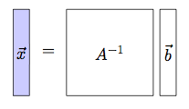

Chapter 3      

#[Chapter 3 Computational linear algebra](./Chapter 3_ Computational linear algebra.md)

This chapter covers the computational aspects of performing matrix calculations. Understanding matrix computations is important because the rest of the chapters in this book depend on them. Suppose we’re given a huge matrix  with . Behind the innocent-looking mathematical notation of the matrix inverse , the matrix product , and the matrix determinant , are hidden monster computations involving all the  million entries of the matrix . Millions of arithmetic operations must be performed…so I hope you have at least a thousand pencils ready!

Okay, calm down. I won’t _actually_ make you calculate millions of arithmetic operations. In fact, to learn linear algebra, it is sufficient to know how to carry out calculations with  and  matrices. Yet, even for such moderately sized matrices, computing products, inverses, and determinants by hand are serious computational tasks. If you’re ever required to take a linear algebra final exam, you’ll need to make sure you can do these calculations quickly. And even if no exam looms in your imminent future, it’s still important you practice matrix operations by hand to get a feel for them.

This chapter will introduce you to four important computational tasks involving matrices.

#####[Gauss–Jordan elimination](./Front matter.md)

Suppose we’re trying to solve two equations in two unknowns  and :

If we add \-times the first equation to the second equation, we obtain an equivalent system of equations:

This is called a _row operation_: we added \-times the first row to the second row. Row operations change the coefficients of the system of equations, but leave the solution unchanged. Gauss–Jordan elimination is a systematic procedure for solving systems of linear equations using row operations.

#####[Matrix multiplication](./Front matter.md)

The product  between matrices  and  is the matrix  whose entries  are defined by the formula  for all ![i \in[1,\ldots,m]](../Images/45e70e4792892aa567503fc88c3c3a95abb0d6ca.png) and ![j \in[1,\ldots,n]](../Images/9d367204a9bd98753a8c90edec37bf9fda56dbc5.png). In[Section 3.3](./Chapter 3_ Computational linear algebra.md), we’ll unpack this formula and learn about its intuitive interpretation: that computing  is computing all the dot products between the rows of  and the columns of .

#####[Determinant](./Front matter.md)

The determinant of a matrix , denoted , is an operation that gives us useful information about the linear independence of the rows of the matrix. The determinant is connected to many notions of linear algebra: linear independence, geometry of vectors, solving systems of equations, and matrix invertibility. We’ll discuss these aspects of determinants in[Section 3.4](./Chapter 3_ Computational linear algebra.md).

#####[Matrix inverse](./Front matter.md)

In[Section 3.5](./Chapter 3_ Computational linear algebra.md), we’ll build upon our knowledge of Gauss–Jordan elimination, matrix products, and determinants to derive three different procedures for computing the matrix inverse .

##[3.1 Reduced row echelon form](./Chapter 3_ Computational linear algebra.md)

In this section we’ll learn to solve systems of linear equations using the _Gauss–Jordan elimination_ procedure. A system of equations can be represented as a matrix of coefficients. The Gauss–Jordan elimination procedure converts any matrix into its _reduced row echelon form_ (RREF). We can use the RREF to easily find the solution (or solutions) of the system of equations.

Heads up: the material covered in this section requires your full-on, caffeinated attention, as the procedures you’ll learn are somewhat tedious. Gauss–Jordan elimination involves many repetitive manipulations of arrays of numbers. It’s important you follow the step-by-step manipulations, as well as verify each step I present _on your own_ with pen and paper. Don’t just take my word for it—always verify the steps!

###[Solving equations](./Front matter.md)

Suppose you’re asked to solve the following system of equations:

The standard approach is to use one of the equation-solving tricks we learned in[Section 1.15](./Chapter 1_ Math fundamentals.md) to combine the equations and find the values of the two unknowns  and .

Observe that the _names_ of the two unknowns are irrelevant to the solution of the system of equations. Indeed, the solution  to the above system of equations is the same as the solution  to the system of equations

The important parts of a system of linear equations are the _coefficients_ in front of the variables, and the constants on the right side of each equation.

###[Augmented matrix](./Front matter.md)

The system of linear equations can be written as an _augmented matrix_:

![\left[ 
\begin{array}{cc|c}
1 & 2  \; \; &  5  \\
3 & 9  \;  \; & 21
\end{array} \right]\!.](../Images/a37d7817b5d6f51865400fd64c52465e370fb4cf.png)

The first column corresponds to the coefficients of the first variable; the second column is for the second variable; and the last column corresponds to the constants on the right side. It is customary to draw a vertical line where the equal signs in the equations would normally appear. This line helps distinguish the coefficients of the equations from the column of constants on the right side.

Once we have the augmented matrix, we can simplify it by using _row operations_ (which we’ll discuss shortly) on its entries. After simplification by row operations, the augmented matrix will be transformed to

![\left[ 
\begin{array}{cc|c}
1 & 0 \; \;  & \; 1  \\
0 & 1 \; \;  & \; 2
\end{array} \right]\!,](../Images/05d86885e525341cb69ee3ee34a5ef82614aee66.png)

which corresponds to the system of equations

This is a _trivial_ system of equations; there is nothing left to solve and we can see the solutions are  and . This example illustrates the general idea of the Gauss–Jordan elimination procedure for solving systems of equations by manipulating an augmented matrix.

###[Row operations](./Front matter.md)

We can manipulate the rows of an augmented matrix without changing its solutions. We’re allowed to perform the following three types of row operations:

-   Add a multiple of one row to another row
-   Swap the position of two rows
-   Multiply a row by a constant

Let’s trace the sequence of row operations needed to solve the system of equations

starting from its augmented matrix:

![\qquad  \; \; 
\left[
\begin{array}{cc|c}
1 & 2 \; \;  & \;  5  \\
3 & 9 \; \;  & \; 21  
\end{array} \right]\!.](../Images/af062780e897fe81ebcedccff019d9edead5a517.png)

1.  As a first step, we eliminate the first variable in the second row by subtracting three times the first row from the second row:
    
    ![\left[\begin{array}{cc|c}1 & 2 \; \; & \; 5\\0 & 3 \; \; & \; 6\end{array}\right]\!.](../Images/0a527bc4fbb3afee4b3427c7b03f8352f8773367.png)
    
    We denote this row operation as .
    
2.  To simplify the second row, we divide it by  to obtain
    
    ![\left[\begin{array}{cc|c}1 & 2 \; \; & \; 5\\0 & 1 \; \; & \; 2\end{array}\right]\!.](../Images/bca1a886a8d0898b3b95f69a7354fdf66d7a73ae.png)
    
    This row operation is denoted .
    
3.  Finally we eliminate the second variable from the first row by subtracting two times the second row, :
    
    ![\left[\begin{array}{cc|c}1 & 0 \; \; & \; 1\\0 & 1 \; \; & \; 2\end{array}\right]\!.](../Images/14a28fe45e7866a0fd56e0175c8a57aa56eb77f6.png)
    
    We can now read off the solution:  and .
    

Note how we simplified the augmented matrix through a specific procedure: we followed the _Gauss–Jordan elimination_ algorithm to bring the matrix into its _reduced row echelon form_.

The _reduced row echelon form_ (RREF) is the simplest form for an augmented matrix. Each row contains a _leading one_ (a numeral 1) also known as a _pivot_. Each column’s pivot is used to eliminate the numbers that lie below and above it in the same column. The end result of this procedure is the reduced row echelon form:

![\left[ \begin{array}{cccc|c}
1 & 0 & *  & 0 \; \; & \; * \\
0 & 1 & *  & 0 \; \; & \; * \\
0 & 0 & 0  & 1 \; \; & \; * 
\end{array} \right]\!.](../Images/fa488389ea9148cc7630db08ad8c44c9972ca340.png)

Note the matrix contains only zero entries below and above the pivots. The asterisks  denote arbitrary numbers that cannot be eliminated because no leading one is present in these columns.

###[Definitions](./Front matter.md)

-   The _solution_ to a system of linear equations in the variables  is the set of values  that satisfy _all_ the equations.
-   The _pivot_ for row  of a matrix is the left-most nonzero entry in the row . Any _pivot_ can be converted into a _leading one_ by an appropriate scaling of that row.
-   _Gaussian elimination_ is the process of bringing a matrix into _row echelon form_.
-   A matrix is said to be in _row echelon form_ (REF) if all entries below the leading ones are zero. This form can be obtained by adding or subtracting the row with the leading one from the rows below it.
-   _Gaussian-Jordan elimination_ is the process of bringing a matrix into _reduced row echelon form_.
-   A matrix is said to be in _reduced row echelon form_ (RREF) if all the entries below _and above_ the pivots are zero. Starting from the REF, we obtain the RREF by subtracting the row containing the pivots from the rows above that row.
-   : the _rank_ of the matrix  is the number of pivots in the RREF of .

###[Gauss–Jordan elimination algorithm](./Front matter.md)

The Gauss–Jordan elimination algorithm proceeds in two phases: a forward phase in which we move left to right, and a backward phase in which we move right to left.

1.  Forward phase (left to right):
    1.  Obtain a pivot (a leading one) in the leftmost column.
    2.  Subtract the row with the pivot from all rows below it to obtain zeros in the entire column.
    3.  Look for a leading one in the next column and repeat.
2.  Backward phase (right to left):
    1.  Find the rightmost pivot and use it to eliminate all numbers above the pivot in its column.
    2.  Move one column to the left and repeat.

#####[Example](./Front matter.md)

We’re asked to solve the following system of equations:

The first step toward the solution is to build the augmented matrix that corresponds to this system of equations:

![\left[\begin{array}{ccc|c}{\color{blue}1} & 2 & 3 \; \; & \;  14\\2 & 5 & 6 \; \; & \;  30\\-1 & 2 & 3 \; \; & \;  12\end{array}\right]\!.](../Images/db4159461b033314cb416d743de9e8b6bdc3e5bb.png)

We can now start the left-to-right phase of the algorithm:

1.  Conveniently, there is a leading one at the top of the leftmost column. If a zero were there instead, a row-swap operation would be necessary to obtain a nonzero entry.
2.  The next step is to clear the entries in the entire column below this pivot. The row operations we’ll use for this purpose are  and :
    
    ![\left[\begin{array}{ccc|c}
    1 & 2 & 3 \; \; & \;  14\\
    0 & {\color{blue}1} & 0 \; \; & \;  2\\
    0 & 4 & 6 \; \; & \;  26
    \end{array}\right]\!.](../Images/f40f4ea3f3ac15dc9afeb1a7bbe4375f96fd9209.png)
    
3.  We now shift our attention to the second column. Using the leading one for the second column, we set the number in the column below it to zero using . The result is
    
    ![\left[\begin{array}{ccc|c}1 & 2 & 3 \; \; & \;   14\\0 & 1 & 0 \; \; & \;   2\\0 & 0 & {\color{blue}6} \; \; & \;  18\end{array}\right]\!.](../Images/f9f56ed69cf2e31d5a6d60ff9bfbf7419273487b.png)
    
4.  Next, we move to the third column. Instead of a leading one, we find it contains a “leading six,” which we can convert to a leading one using . We thus obtain
    
    ![\left[\begin{array}{ccc|c} 1 & 2 & 3 \; \; & \; 14\\0 & 1 & 0 \; \; & \; 2\\0 & 0 & {\color{blue}1} \; \; & \; 3\end{array}\right]\!.](../Images/03e855e557ef4493f6991b656767bb33fb1924ff.png)
    

The forward phase of the Gauss–Jordan elimination procedure is now complete. We identified three pivots and used them to systematically set all entries below each pivot to zero. The matrix is now in _row echelon form_.

Next, we perform the backward phase of the Gauss–Jordan elimination procedure, where we’ll work right-to-left to set all numbers above each pivot to zero:

1.  The first row operation is , and it leads to
    
    ![\left[\begin{array}{ccc|c}1 & 2 & 0 \; \; & \;  5\\0 & 1 & 0 \; \; & \; 2\\0 & 0 & 1 \; \; & \; 3\end{array}\right]\!.](../Images/52182ec46a5716d9d0db9978490779e1d7a91be0.png)
    
2.  The final step is , which gives
    
    ![\left[\begin{array}{ccc|c}1 & 0 & 0 \; \; & \;  1\\0 & 1 & 0 \; \; & \;  2\\0 & 0 & 1 \; \; & \;  3\end{array}\right]\!.](../Images/f80053975abde3cc0b01cd095cbc84d4cd3163c4.png)
    

The matrix is now in _reduced row echelon form_, and we can see the solution is , , and .

We’ve described the general idea of the Gauss–Jordan elimination and explored some examples where the solutions to the system of equations were _unique_. There are other possibilities for the solutions of a system of linear equations. We’ll describe these other possible scenarios next.

###[Number of solutions](./Front matter.md)

A system of three linear equations in three variables could have:

-   **One solution**. If the RREF of a matrix has a pivot in each row, we can read off the values of the solution by inspection:
    
    ![\left[ \begin{array}{ccc|c}
    1 & 0 & 0  \; \; &  \;  c_1 \\
    0 & 1 & 0  \; \; & \;  c_2 \\
    0 & 0 & 1  \; \;  &\;  c_3
    \end{array}\right]\!.](../Images/a1d9a09c3b229789668918d5633abdbea4a8a981.png)
    
    The _unique_ solution is , , and .
    
-   **Infinitely many solutions**. If one of the equations is redundant, a row of zeros will appear when the matrix is brought to the RREF. This happens when one of the original equations is a linear combination of the other two. In such cases, we’re really solving _two_ equations in _three_ variables, so we can’t “pin down” one of the unknown variables. We say the solution contains a _free variable_. For example, consider the following RREF:
    
    ![\left[ \begin{array}{ccc|c}
    1 & 0 & a_1  \; \; & \;  c_1 \\
    0 & 1 & a_2  \; \; & \;  c_2 \\
    0 & 0 & 0      \; \; & \;  0
    \end{array}\right]\!.](../Images/a1b53042a60dced1ea98cee2191f3660d4ded125.png)
    
    The column that doesn’t contain a leading one corresponds to the free variable. To indicate that  is a free variable, we give it a special label, . The variable  could be any number . In other words, when we say  is free, it means  can take on _any_ value from  to . The information in the augmented matrix can now be used to express  and  in terms of the constants and the free variable :
    
    
    
    The solution corresponds to the equation of a line passing through the point  with direction vector . We’ll discuss the geometry of lines in[Chapter 4](./Chapter 4_ Geometric aspects of linear algebra.md). For now, it’s important you understand that a system of equations can have more than one solution; any point on the line  is a solution to the above system of equations.
    
-   **Infinitely many solutions in two dimensions**. It’s also possible to obtain a two-dimensional solution space. This happens when two of the three equations are redundant. This results in a single leading one, and thus two free variables. For example, in the RREF
    
    ![\left[ \begin{array}{ccc|c}
    0 & 1 & a_2   \; \; & \;  c_2 \\
    0 & 0 & 0    \; \; & \;   0 \\
    0 & 0 & 0    \; \; & \;  0 
    \end{array}\right]\!,](../Images/62c7c4284e9d2b19b8a157e7e55e711122d40e9a.png)
    
    the variables  and  are free. As in the previous infinitely-many-solutions case, we define new labels for the free variables  and , where  and  are two arbitrary numbers. The solution to this system of equations is
    
    
    
    This solution set corresponds to the _parametric equation_ of a plane that contains the point  and the vectors  and .
    
    The _general equation_ for the solution plane is , as we can observe from the first row of the augmented matrix. We’ll learn more about the geometry of planes and how to convert between their general and parametric forms in[Section 4.1](./Chapter 4_ Geometric aspects of linear algebra.md).
    
-   **No solutions**. If there are no numbers  that simultaneously satisfy all three equations, the system of equations has no solution. An example of a system of equations with no solution is the pair  and . There are no numbers  that satisfy both of these equations.
    
    A system of equations has no solution if its reduced row echelon form contains a row of zero coefficients with a nonzero constant in the right side:
    
    ![\left[ \begin{array}{ccc|c}
    1 & 0 & 0   \; \; &  \; c_1 \\
    0 & 1 & 0   \; \; &  \; c_2 \\
    0 & 0 & 0   \; \; & \; c_3 
    \end{array}\right]\!.](../Images/f6401890c4e6f1774d6e17370168631ad795d134.png)
    
    If , this system of equations is impossible to satisfy. There is no solution because there are no numbers  such that .
    

Dear reader, we’ve reached a moment in this book where you’ll need to update your math vocabulary. The solution to an individual equation is a finite set of points. The solution to a _system_ of equations can be an entire space containing infinitely many points, such as a line or a plane. Please update your definition of the term _solution_ to include the new, more specific term _solution set_—the set of points that satisfy the system of equations. The _solution set_ of a system of three linear equations in three unknowns could be either the empty set  (no solution), a set with one element , or a set with infinitely many elements like a line  or a plane . Another possible solution set is all of , where every vector  is a solution to the equation:

Note the distinction between the three types of infinite solution sets. A line is one-dimensional, a plane is two-dimensional, and  is three-dimensional. Describing all points on a line requires one parameter, describing all points on a plane takes two parameters, and describing a point in  takes three parameters.

###[Geometric interpretation](./Front matter.md)

We can gain some intuition about solution sets by studying the geometry of the intersections of lines in  and planes in .

####[Lines in two dimensions](./Front matter.md)

Equations of the form  correspond to lines in . Solving systems of equations of the form

requires finding the point  where these lines intersect. There are three possibilities for the solution set:

-   **One solution** if the two lines intersect at a point
-   **Infinitely many solutions** if the lines are superimposed
-   **No solution** if the two lines are parallel and never intersect

See figures[1.67](./Chapter 1_ Math fundamentals.md),[1.68](./Chapter 1_ Math fundamentals.md), and[1.69](./Chapter 1_ Math fundamentals.md) (pages 1.67–1.69) for an illustration.

####[Planes in three dimensions](./Front matter.md)

Equations of the form  correspond to planes in . When solving three such equations,

we want to find the points  that satisfy all three equations simultaneously. There are four possibilities for the solution set:

-   **One solution**. Three non-parallel planes intersect at a point.
-   **Infinitely many solutions**. If one of the plane equations is redundant, the solution corresponds to the intersection of two planes. Two non-parallel planes intersect on a line.
-   **Infinitely many solutions in two dimensions**. If two of the equations are redundant, the solution space is a two-dimensional plane.
-   **No solution**. If no common points exist at the intersection of all three planes, then the system of equations has no solution.

Figure 3.1: Three planes can intersect at a unique point, as in figure (a); or along a line, as in figure (b). In the first case, there is a unique point  common to all three planes. In the second case, all points on the line  are shared by the planes.

Figure 3.2: These illustrations depict systems of three equations in three unknowns that have no solution. No common points of intersection exist.

###[Computer power](./Front matter.md)

The computer algebra system at[`http://live.sympy.org`](./live.sympy.org.md) can be used to compute the reduced row echelon form of any matrix.

Here is an example of how to create a sympy `Matrix` object:

\>>> from sympy.matrices import Matrix
>>> A = Matrix(\[\[1, 2,  5\],      # use SHIFT+ENTER for newline
                \[3, 9, 21\]\]) 

In `Python`, we define lists using the square brackets `[` and `]`. A matrix is defined as a list of lists.

To compute the reduced row echelon form of `A`, call its `rref()` method:

\>>> A.rref()
( \[1, 0, 1\] # RREF of A         # locations of pivots
  \[0, 1, 2\],                    \[0, 1\]               ) 

The `rref()` method returns a tuple containing the RREF of `A` and an array that tells us the 0-based indices of the columns that contain leading ones. Usually, we’ll want to find the RREF of `A` and ignore the pivots; to obtain the RREF without the pivots, select the first (index zero) element in the result of `A.rref()`:

\>>> Arref = A.rref()\[0\]
>>> Arref
\[1, 0, 1\]
\[0, 1, 2\]  

The `rref()` method is the fastest way to obtain the reduced row echelon form of a `SymPy` matrix. The computer will apply the Gauss–Jordan elimination procedure and show you the answer. If you want to see the intermediary steps of the elimination procedure, you can also manually apply row operations to the matrix.

#####[Example](./Front matter.md)

Let’s compute the reduced row echelon form of the same augmented matrix by using row operations in `SymPy`:

\>>> A = Matrix(\[\[1, 2,  5\],
                \[3, 9, 21\]\])

>>> A\[1,:\] = A\[1,:\] - 3\*A\[0,:\]
>>> A
\[1, 2, 5\]
\[0, 3, 6\]

We use the notation `A[i,:]` to refer to entire rows of the matrix. The number `i` specifies the \-based row index: the first row of `A` is `A[0,:]` and the second row is `A[1,:]`. The code example above implements the row operation .

To obtain the reduced row echelon form of the matrix `A`, we carry out two more row operations,  and , using the following commands:

\>>> A\[1,:\] = S(1)/3\*A\[1,:\]
>>> A\[0,:\] = A\[0,:\] - 2\*A\[1,:\]
>>> A    
\[1, 0, 1\]           # the same result as A.rref()\[0\]
\[0, 1, 2\]   

Note we represent the fraction  as `S(1)/3` in order to obtain the exact rational expression `Rational(1,3)`. If we were to input  as `1/3`, `SymPy` would interpret this either as integer or floating point division, which is not what we want. The single-letter helper function `S` is an alias for the function `sympify`, which ensures a `SymPy` object is produced. Another way to input the exact fraction  is `S(’1/3’)`.

If you need to swap two rows of a matrix, you can use the standard Python tuple assignment syntax. To swap the position of the first and second rows, use

\>>> A\[0,:\], A\[1,:\] = A\[1,:\], A\[0,:\] 
>>> A    
\[0, 1, 2\]
\[1, 0, 1\] 

Using row operations to compute the reduced row echelon form of a matrix allows you to see the intermediary steps of a calculation; which is useful, for instance, when checking the correctness of your homework problems.

There are other applications of matrix methods that use row operations (see[Section 7.6](./Chapter 7_ Applications.md)), so it’s good idea to know how to use `SymPy` for this purpose.

###[Discussion](./Front matter.md)

In this section, we learned the Gauss–Jordan elimination procedure for simplifying matrices, which just so happens to be one of the most important computational tools of linear algebra. Beyond being a procedure for finding solutions to systems of linear equations, the Gauss–Jordan elimination algorithms can be used to solve a broad range of other linear algebra problems. Later in the book, we’ll use the Gauss–Jordan elimination algorithm to compute inverse matrices [Section 3.5](./Chapter 3_ Computational linear algebra.md)) and to “distill” bases for vector spaces [Section 4.5](./Chapter 4_ Geometric aspects of linear algebra.md)).

###[Exercises](./Front matter.md)

You’ve read about linear algebra—now you must apply what you’ve learned. Let’s see if you can solve the exercises in this section. It will probably take you a few hours to complete all of them, but trust me: if you do the work, you’ll reap the rewards.

Imagine you want to join a martial arts school and the master tells you to first practice horse stance for hours before you can learn any moves. Well, this is the math equivalent. You need to know the Gauss–Jordan elimination procedure inside out, since it’s the base on which we’ll build many other linear algebra skills.

E3.1 Consider the system of equations and its augmented matrix representation:

![\begin{array}{rrl}
3x &  + \; \; 		3y 	&	=  \; \; 6	\\
2x &  + \; \, \frac{3}{2}y 	& 	= \; \; 5
\end{array}
\qquad
\Rightarrow
\qquad
\left[\!\!\begin{array}{cc|c} 
3 & 		3  \;  & 6 \\
2 &  \frac{3}{2}    \; & 5 
\end{array}\!\!\right]\!	.](../Images/e5e4aaff03a298f0b8f114b597db83166afa7100.png)

Find the solution to this system of equations by bringing the augmented matrix into reduced row echelon form.

E3.2 Repeat [3.1.10](./Chapter 3_ Computational linear algebra.md) using the calculator at[`http://live.sympy.org`](./live.sympy.org.md). First define the augmented matrix using

\>>> A = Matrix(\[
         \[3,       3,  6\],
         \[2,  S(3)/2,  5\]\])  # note use of S(3)/2 to obtain 3/2

Then perform row operations using `SymPy` to bring the matrix into RREF. Confirm your answer using the direct method `A.rref()`.

E3.3 Find the solutions to the systems of equations that correspond to the following augmented matrices.

1.  ![\left[\!\!\begin{array}{cc|c} 
    3 & 		3  \;  & 6 \\
    1 &  		1   \; & 5 
    \end{array}\!\!\right]\!](../Images/80359efd5ec310a05e979190afdc14e08291eff4.png)          
2.  ![\left[\!\!\begin{array}{cc|c} 
    3 & 		3  \;  & 6 \\
    2 &  \frac{3}{2}   \; & 3 
    \end{array}\!\!\right]\!](../Images/69e7e676ab03de3a12b5b12eb9b93ea064681733.png)          
3.  ![\left[\!\!\begin{array}{cc|c} 
    3 & 		3  \;  & 6 \\
    1 &  		1   \; & 2 
    \end{array}\!\!\right]\!](../Images/abbe01ffe5cf3cce1418f39defc63464b5e1287d.png)

The third system of equations has many solutions.

In this section we learned a practical computational algorithm for solving systems of equations by a using row operations on an augmented matrix. In the next section, we’ll increase the level of abstraction. By “zooming out” one level, we can view the entire system of equations as a matrix equation  and solve the problem in one step: .

##[3.2 Matrix equations](./Chapter 3_ Computational linear algebra.md)

We can express the problem of solving a system of linear equations as a matrix equation and obtain the solution using the matrix inverse. Consider the following system of linear equations:

We can rewrite this system of equations as a matrix-vector product:

or, more compactly, as , where  is a  matrix,  is the vector of unknowns (a  matrix), and  is a vector of constants (a  matrix).

We can solve for  in this matrix equation by multiplying both sides of the equation by the inverse :

Thus, to solve a system of linear equations, we can find the inverse of the matrix of coefficients, then compute the product:

The amount of effort it takes to find  is roughly equivalent to the effort needed to bring an augmented matrix ![[\:A\; | \; \vec{b}\:]](../Images/2d800063df7c3d7f3ce6ef8fb9bdc52d1dca9a26.png) to reduced row echelon form—it’s not like we’re given the solution for free by simply rewriting the system of equations in matrix form. Nevertheless, expressing the system of equations as  and its solution as  is useful in that it saves us from needing to juggle dozens of individual coefficients. The same symbolic expression  applies whether  is a  matrix or a  matrix.

###[Introduction](./Front matter.md)

It’s time we had an important discussion about matrix equations and how they differ from regular equations with numbers. If , , and  are three numbers, and I tell you to _solve_ for  in the equation

you’d know the answer is , and that would be the end of it.

Now suppose , , and  are matrices and you want to solve for  in the matrix equation

The answer  is not allowed. So far, we defined matrix _multiplication_ and matrix _inversion_, but not matrix _division_. Instead of dividing by , we must multiply by , which has the same effect as a “divide by ” operation. The product of  and  gives the identity matrix,

When applying the inverse matrix  to the equation, we must specify whether we are multiplying from the left or from the right, because matrix multiplication is not commutative. Can you determine the correct answer for  in the above equations? Is it  or ?

To solve matrix equations, we employ the same technique we used to solve equations in[Chapter 1](./Chapter 1_ Math fundamentals.md): undoing the operations that stand in the way of the unknown. Recall that we must always **do the same thing to both sides of an equation** for it to remain true.

With matrix equations, it’s the same story all over again, but there are two new things you need to keep in mind:

-   The order in which matrices are multiplied matters. Matrix multiplication is not a commutative operation, . The expressions  and  are different despite the fact that they are the product of the same three matrices.
-   When performing operations on matrix equations, you can act either _from the left_ or _from the right_ on the equation.

The best way to familiarize yourself with the peculiarities of matrix equations is to look at example calculations. Don’t worry, there won’t be anything too mathematically demanding in this section; we’ll just look at some pictures.

###[Matrix times vector](./Front matter.md)

Suppose we want to solve the equation , in which an  matrix  multiplies the vector  to produce a vector . Recall, we can think of vectors as “tall and skinny”  matrices.

The picture corresponding to the equation  is

 .

Assuming  is invertible, we can multiply by the inverse  on the left of both sides of the equation:

 .

By definition,  times its inverse  is equal to the identity matrix , which is a diagonal matrix with ones on the diagonal and zeros everywhere else:

 .

Any vector times the identity matrix remains unchanged, so

 ,

which is the final answer.

Note that the question “Solve for  in ” sometimes arises in situations where the matrix  is not invertible. If the system of equations is under-specified ( is wider than it is tall), there will be a whole subspace of acceptable solutions . Recall the cases with infinite solutions (lines and planes) we saw in the previous section.

###[Matrix times matrix](./Front matter.md)

Let’s look at some other matrix equations. Suppose we want to solve for  in the equation :

 .

To isolate , we multiply by  _from the right_ on both sides:

 .

When  hits , the matrices cancel () and we obtain

 .

###[Matrix times matrix variation](./Front matter.md)

What if we want to solve for  in the same equation ?

 .

Again, we must _do the same_ to both sides of the equation. To cancel , we need to multiply by  from the left:

 .

When  cancels with , we obtain the final result

  .

This completes our lightning tour of matrix equations. There is really nothing new to learn here; just make sure you’re aware that the _order_ in which matrices are multiplied matters, and remember the general principle of “doing the same thing to both sides of the equation.” Acting according to this principle is essential in all of math, and particularly important when manipulating noncommutative operations as in matrix equations.

In the next section, we’ll “zoom in” on matrix equations by examining the arithmetic operations performed on matrix entries during multiplication.

###[Exercises](./Front matter.md)

E3.4 Solve for  in the following matrix equations: **a)** , **b)** , and **c)** . You can assume the matrices , , , , and  are all invertible.

##[3.3 Matrix multiplication](./Chapter 3_ Computational linear algebra.md)

Suppose we’re given the matrices

![A = 
\left[
\begin{array}{cc}
a&b \\
c&d
\end{array}
\right]\! 
\qquad 
\textrm{and}
\qquad
B = 
\left[
\begin{array}{cc}
e&f \\
g&h
\end{array}
\right]\!,](../Images/bc276e1dbe02d47ef101da84eb81d782fd222c5e.png)

and we want to compute the _matrix product_ .

Unlike matrix addition and subtraction, matrix multiplication is _not_ performed entry-wise:

![\left[
\begin{array}{cc}
a&b \\
c&d
\end{array}
\right] \!
\left[
\begin{array}{cc}
e&f \\
g&h
\end{array}
\right] 
\; 
\neq
\; 
\left[
\begin{array}{cc}
ae&bf \\
cg&dh
\end{array}
\right]\!.](../Images/40c0982a4969535981004f8e6754ca70a5e56e5c.png)

Instead, the matrix product is computed by taking the dot product between each row of the matrix  and each column of the matrix :

![\begin{align*}
\begin{array}{c}
\begin{array}{c} 
\vec{r}_1 \rightarrow \\
\vec{r}_2 \rightarrow 
\end{array}
\!\!
\left[
\begin{array}{cc}
a & b \\
c & d
\end{array}
\right] \\
\; \\
\; 
\end{array}
\!\!\!\!\!\!
\begin{array}{c}
\left[
\begin{array}{cc}
e&f \\
g&h
\end{array}
\right] \\
\uparrow \; \; \; \,  \uparrow  \\
{\vec{c}_1} \; \; \;  {\vec{c}_2}
\end{array} 
&
\begin{array}{c} 
= \\
\;  \\
\; 
\end{array}
\begin{array}{c} 
\left[
\begin{array}{cc}
\vec{r}_1 \cdot \vec{c}_1  & 	\; \; \vec{r}_1 \cdot \vec{c}_2   \\
\vec{r}_2 \cdot \vec{c}_1  & 	\; \; \vec{r}_2 \cdot \vec{c}_2 
\end{array}
\right] \\
\;  \\
\; 
\end{array} \\
& \; =
\; \;  \left[
\begin{array}{cc}
ae+ bg  & af + bh  \\
ce + dg & cf + dh
\end{array}
\right]\!.
\end{align*}](../Images/23fae57614e45d0ef82402dd328d7e81a363b235.png)

Recall the dot product between two vectors  and  is computed using the formula .

Now, let’s look at a picture that shows how to compute the product of a matrix with four rows and another matrix with five columns. To compute the top left entry of the result, take the dot product of the first row of the first matrix and the first column of the second matrix.

Figure 3.3: Matrix multiplication is performed rows-times-columns. The first-row, first-column entry of the product is the dot product of  and .

Similarly, the entry on the third row and fourth column of the product is computed by taking the dot product of the third row of the first matrix and the fourth column of the second matrix. See[Figure 3.4](./Front matter.md).

Figure 3.4: The third-row, fourth-column entry of the product is computed by taking the dot product of  and .

For the matrix product to work, the rows of the first matrix must have the same length as the columns of the second matrix.

###[Matrix multiplication rules](./Front matter.md)

-   Matrix multiplication is associative:
    
    
    
-   The touching dimensions of the matrices must be the same. For the triple product  to exist, the rows of  must have the same dimension as the columns of , and the rows of  must have the same dimension as the columns of .
-   Given two matrices  and , the product  is an  matrix.
-   Matrix multiplication is not a commutative operation.

Figure 3.5: The order of multiplication matters for matrices: the product  does not equal the product .

#####[Example](./Front matter.md)

Consider the matrices  and . The product  is computed as

We can also compute the product :

In each case, the touching dimensions of the two matrices in the product are the same. Note that , and in fact, the products  and  are matrices with different dimensions.

###[Applications](./Front matter.md)

Why is matrix multiplication defined the way it is defined?

####[Composition of linear transformations](./Front matter.md)

The long answer to this question will be covered in depth when we reach the chapter on linear transformations [Section 5](./Chapter 5_ Linear transformations.md), page 5). Since I don’t want you to live in suspense, I’ll give you the short answer now. We can think of multiplying a column vector  by a matrix  as analogous to applying a _linear transformation_  of the form:

Applying the linear transformation  to the input  is the same as computing the matrix-vector product :

Every linear transformation from  to  can be described as a multiplication by some matrix .

What happens when we apply two linear transformations in succession? When we do this to ordinary functions, we call it _function composition_, and denote it with a little circle:

where  indicates we should first apply  to , then apply  to the output of . The composition of two linear transformations  (applying  then ) corresponds to multiplication by matrices  and :

Note we can describe the composite transformation  by the matrix , which is the product of matrices  and . **Matrix products enable us to easily compose linear transformations.**

Understanding the connection between matrices and linear transformations helps explain why matrix multiplication is not commutative. In general, : there’s no reason to expect  will equal , just as there’s no reason to expect that  will equal  for two arbitrary functions.

Matrix multiplication is an extremely useful computational tool. At the moment, your feelings about matrix multiplication might not be so warm and fuzzy, given it can be tedious and repetitive. Be patient and stick with it. Solve some exercises to make sure you understand. Afterward, you can let computers multiply matrices for you—because computers are good at repetitive tasks.

####[Row operations as matrix products](./Front matter.md)

There is an important connection between row operations and matrix multiplication. Performing the row operation  on a matrix is equivalent to a left multiplication by an _elementary matrix_ :

There are three types of elementary matrices that correspond to the three types of row operations. Let’s look at an example.

#####[Example](./Front matter.md)

The row operation of adding  times the second row to the first row () corresponds to the elementary matrix

We’ll discuss elementary matrices in more detail in[Section 3.5.4](./Chapter 3_ Computational linear algebra.md).

We can also perform column operations on matrices if we multiply them by elementary matrices from the right.

###[Exercises](./Front matter.md)

E3.5 Compute the following matrix products:

E3.6 Consider the following matrices of different dimensions:

Compute the following matrix expressions.

1.  
2.  
3.  
4.  
5.  
6.  
7.  

##[3.4 Determinants](./Chapter 3_ Computational linear algebra.md)

What is the volume of a rectangular box of length m, width m, and height m? It’s easy to compute the volume of this box because its shape is a _right rectangular prism_. The volume of this rectangular prism is m. What if the shape of the box was a _parallelepiped_ instead? A parallelepiped is a box whose opposite faces are parallel but whose sides are slanted, as shown in[Figure 3.9](./Chapter 3_ Computational linear algebra.md) on page 3.9. How do we compute the volume of a parallelepiped? The determinant operation, specifically the  determinant, is the perfect tool for this purpose.

The determinant operation takes square matrices as inputs and produces numbers as outputs:

The determinant of a matrix, denoted  or , is a particular way to multiply the entries of the matrix to produce a single number. We use determinants for all kinds of tasks: to compute areas and volumes, to solve systems of equations, to check whether a matrix is invertible or not, etc.

We can intuitively interpret the determinant of a matrix as a geometric calculation. The determinant is the “volume” of the geometric shape whose “sides” are the rows of the matrix. For  matrices, the determinant corresponds to the area of a parallelogram. For  matrices, the determinant corresponds to the volume of a parallelepiped. For dimensions , we say the determinant measures a \-dimensional hyper-volume.

Consider the linear transformation  defined through the matrix-vector product with a matrix : . The determinant of the matrix  is the _scale factor_ associated with the linear transformation . The scale factor of the linear transformation  describes how the area of a unit square in the input space (a square with dimensions ) is transformed by . After passing through , the unit square is transformed to a parallelogram with area . Linear transformations that “shrink” areas have , while linear transformations that “enlarge” areas have . A linear transformation that is _area preserving_ has .

Figure 3.6: A square with side length  in the input space of  is transformed to a parallelogram with area  in the output space of . The determinant measures the _scale factor_ by which the area changes.

The determinant is also used to check linear independence for a given set of vectors. We construct a matrix using the vectors as the matrix rows, and compute its determinant. If the determinant is nonzero, the vectors are linearly independent.

The determinant of a matrix tells us whether or not the matrix is invertible. If , then  is invertible; if ,  is not invertible.

The determinant shares a connection with the vector cross product, and is also used in the definition of the eigenvalue equation.

In this section, we’ll discuss all the applications of determinants. As you read along, I encourage you to actively draw connections between the geometric, algebraic, and computational aspects of determinants. Don’t worry if it doesn’t all click right away—you can always review this section once you’ve learned more about linear transformations, the geometry of cross products, and eigenvalues.

###[Formulas](./Front matter.md)

The determinant of a  matrix is

The formulas for the determinants of larger matrices are defined recursively. For example, the determinant of a  matrix is defined in terms of  determinants:

![\begin{align*}
\; 
&\!\!\!\!\!\!\!\!
\begin{vmatrix}
a_{11} & a_{12} & a_{13} \\ 
a_{21} & a_{22} & a_{23} \\
a_{31} & a_{32} & a_{33}
\end{vmatrix} = 														\\
&=
a_{11}
\begin{vmatrix}
a_{22} & a_{23} \\
a_{32} & a_{33}
\end{vmatrix}
-
a_{12}
\begin{vmatrix}
a_{21} & a_{23} \\
a_{31} & a_{33}
\end{vmatrix}
+
a_{13}
\begin{vmatrix}
a_{21} & a_{22} \\
a_{31} & a_{32}
\end{vmatrix}														\\
&=
a_{11}(a_{22}a_{33}-a_{23}a_{32})
-
a_{12}(a_{21}a_{33} - a_{23}a_{31})
+
a_{13}(a_{21}a_{32} - a_{22}a_{31})									\\
&=
a_{11}a_{22}a_{33}   \qquad - a_{12}a_{21}a_{33} \qquad  + a_{13}a_{21}a_{32}  				\\
& \qquad 
- a_{11}a_{23}a_{32} \qquad  + a_{12}a_{23}a_{31}  \qquad - a_{13}a_{22}a_{31}.
\end{align*}](./images/1c78f6a93d8d863a8499b61c027da4b591c301d3.png)

There’s a neat computational trick for computing  determinants by hand. The trick consists of extending the matrix  into a  array that contains copies of the columns of : the first column of  is copied to the fourth column of the extended array, and the second column of  is copied to the fifth column. The determinant is then computed by summing the products of the entries on the three positive diagonals and subtracting the products of the entries on the three negative diagonals, as illustrated in[Figure 3.7](./Chapter 3_ Computational linear algebra.md).

Figure 3.7: Computing the determinant using the extended array trick. The solid lines indicate the positive terms while the dashed lines indicate the negative terms in the determinant calculation.

The general formula for the determinant of an  matrix is

where  is called the _minor_ associated with the entry . The minor  is the determinant of the submatrix obtained by removing the th row and the th column of the matrix . Note the factor  that alternates between the values  and  for different terms in the formula.

In the case of  matrices, applying the determinant formula gives the correct formula,

The determinant of a  matrix  is

The determinant formula, , assumes we _expand_ the determinant along the first row of the matrix. In fact, a determinant formula can be obtained by expanding the determinant along _any_ row or column of the matrix. For example, expanding the determinant of a  matrix along the second column produces the determinant formula

The expand-along-any-row-or-column nature of determinants can be very handy: if you need to calculate the determinant of a matrix with one row (or column) containing many zero entries, it makes sense to expand along that row since many of the terms in the formula will be zero. If a matrix contains a row (or column) consisting entirely of zeros, we can immediately tell its determinant is zero.

###[Geometric interpretation](./Front matter.md)

####[Area of a parallelogram](./Front matter.md)

Suppose we’re given vectors  and  in  and we construct a parallelogram with corner points , , , and .

The area of this parallelogram is equal to the determinant of the matrix that contains  and  as rows:

Figure 3.8: The determinant of a  matrix corresponds to the area of the parallelogram constructed from the rows of the matrix.

####[Volume of a parallelepiped](./Front matter.md)

Suppose we’re given three vectors: , , and  in . Then suppose we construct the parallelepiped with corner points , , , , , , , and , as illustrated in[Figure 3.9](./Chapter 3_ Computational linear algebra.md).

The volume of this parallelepiped is equal to the determinant of the matrix containing the vectors , , and  as rows:

Figure 3.9: The determinant of a  matrix corresponds to the volume of the parallelepiped constructed from the rows of the matrix.

####[Sign and absolute value of the determinant](./Front matter.md)

Calculating determinants can produce positive or negative numbers. Consider the vectors  and  and the determinant

Let’s denote the value of the determinant by the variable . The absolute value of the determinant is equal to the area of the parallelogram constructed by the vectors  and . The sign of the determinant (positive, negative, or zero) tells us information about the relative orientation of the vectors  and . If we let  be the measure of the angle from  toward , then the following possibilities exist.

-   If  is between  and  (), the determinant is positive . This is the case illustrated in[Figure 3.8](./Chapter 3_ Computational linear algebra.md).
-   If  is between  () and  (), the determinant is negative .
-   When  (the vectors point in the same direction), or when  (the vectors point in opposite directions), the determinant is zero, .

The formula for the area of a parallelogram is , where  is the length of the parallelogram’s base, and  is the parallelogram’s height. In the case of the parallelogram in[Figure 3.8](./Chapter 3_ Computational linear algebra.md), the length of the base is  and the height is , where  is the angle measure between  and . The geometric interpretation of the  determinant is described by the formula,

Observe the “height” of the parallelogram is negative when  is between  and .

###[Properties](./Front matter.md)

Let  and  be two square matrices of the same dimension. The determinant operation has the following properties:

-   
-   If , the matrix is invertible and 
-   
-   , for an  matrix 
-   , where  are the eigenvalues of 

###[The effects of row operations on determinants](./Front matter.md)

Recall the three row operations we used for the Gauss–Jordan elimination procedure:

-   Add a multiple of one row to another row
-   Swap two rows
-   Multiply a row by a constant

We’ll now describe the effects of these row operations on the value of the matrix determinant. In each case, we’ll connect the effects of the row operation to the geometric interpretation of the determinant operation.

####[Add a multiple of one row to another row](./Front matter.md)

Adding a multiple of one row of a matrix to another row does not change the determinant of the matrix.

Figure 3.10: Row operations of the form  do not change the value of the matrix determinant.

This property follows from the fact that parallelepipeds with equal base enclosed between two parallel planes have the same volume even if they have different slants. This is called _Cavalieri’s principle_.

It is easier to visualize Cavalieri’s principle in two dimensions by considering two parallelograms with base  and different slants, enclosed between two parallel lines. The area of both parallelograms is the same: , where  is the distance between the parallel lines.

####[Swapping rows](./Front matter.md)

Swapping two rows of a matrix changes the sign of its determinant.

Figure 3.11: Swapping any two rows, , flips the sign of the determinant.

This property is a consequence of measuring _signed volumes_. Swapping two rows changes the relative orientation of the vectors, and hence changes the sign of the volume from positive to negative or vice versa.

####[Multiply a row by a constant](./Front matter.md)

Multiplying a row by a constant is equivalent to multiplying the determinant by the constant.

Figure 3.12: Row operations of the form  scale the value of the determinant by the factor .

This property follows from the fact that making one side of the parallelepiped  times longer increases the volume of the parallelepiped by a factor of .

When each entry of an  matrix is multiplied by the constant , each of the  rows is multiplied by , and so the determinant changes by a factor of : .

####[Zero-vs-nonzero determinant property](./Front matter.md)

There is an important distinction between matrices with zero determinant and matrices with nonzero determinant. We can understand this distinction geometrically by considering the  determinant calculation. Recall, the volume of the parallelepiped with sides , , and  is equal to the determinant of the matrix containing the vectors , , and  as rows. If the determinant is zero, it means at least one of the rows of the matrix is a linear combination of the other rows. The volume associated with this determinant is zero because the geometric shape it corresponds to is a flattened, two-dimensional parallelepiped; in other words, a parallelogram. We say the matrix is “deficient” if its determinant is zero.

On the other hand, if the determinant of a matrix is nonzero, the rows of the matrix are linearly independent. In this case, the determinant calculation corresponds to the volume of a real parallelepiped. We say the matrix is “full” if its determinant is nonzero.

The zero-vs-nonzero determinant property of a matrix does not change when we perform row operations on the matrix. If a matrix  has a nonzero determinant, we know its reduced row echelon form will also have nonzero determinant. The number of nonzero rows in the reduced row echelon form of the matrix is called the _rank_ of the matrix. We say a matrix  has _full rank_ if its RREF contains  pivots. If the RREF of the matrix  contains a row of zeros, then  is not full rank and . On the other hand, if , we know that .

###[Applications](./Front matter.md)

Apart from the geometric and invertibility-testing applications of determinants described above, determinants are related to many other topics in linear algebra. We’ll briefly cover some of these in this section.

####[Cross product as a determinant](./Front matter.md)

We can compute the cross product of the vectors  and  by computing the determinant of a special matrix. We place the symbols , , and  in the first row of the matrix then write the components of  and  in the second and third rows. After expanding the determinant along the first row, we obtain the cross product:

![\begin{align*}
\vec{v}\times\vec{w} 
& =
\left|\begin{array}{ccc}
\hat{\imath} & \hat{\jmath} & \hat{k} \\
v_1 & v_2 & v_3 \\
w_1 & w_2 & w_3
\end{array}\right|  					\\
& =
\hat{\imath}
\left|\begin{array}{cc}
v_{2}  & v_{3} \\
w_{2} &  w_{3}
\end{array}\right|
\; -
\hat{\jmath}
\left|\begin{array}{cc}
v_{1} & v_{3} \\
w_{1} & w_{3}
\end{array}\right|
\; +
\hat{k}
\left|\begin{array}{cc}
v_{1} & v_{2} \\
w_{1} & w_{2}
\end{array}\right| 					\\
&= (v_2w_3-v_3w_2)\hat{\imath}   
-(v_1w_3 - v_3w_1)\hat{\jmath} 
+(v_1w_2-v_2w_1)\hat{k} 				\\
& = (v_2w_3-v_3w_2,\; v_3w_1 - v_1w_3,\; v_1w_2-v_2w_1).
\end{align*}](./images/2a8e16ef51a6614acd107f696a73f3b94794e5e5.png)

Observe that the anticommutative property of the vector cross product, , corresponds to the swapping-rows-changes-the-sign property of determinants.

The extended array trick for computing  determinants (see[Figure 3.7](./Chapter 3_ Computational linear algebra.md)) doubles as a trick for computing cross products:

Figure 3.13: We can quickly compute the cross product of two vectors using the extended array trick.

Using the correspondence between the cross product and the determinant, we can write the determinant of a  matrix in terms of the dot product and cross product:

####[Cramer’s rule](./Front matter.md)

Cramer’s rule is an approach for solving systems of linear equations using determinants. Consider the following system of equations and its representation as a matrix equation:

We’re looking for the vector  that satisfies this system of equations.

Begin by writing the system of equations as an augmented matrix:

![\left[\begin{array}{ccc|c}
a_{11} & a_{12} & a_{13} \; \; &  \; b_1 \\
a_{21} & a_{22} & a_{23} \; \; &  \; b_2 \\
a_{31} & a_{32} & a_{33} \; \; &  \; b_3
\end{array}\right]
\; = \; 
\left[\begin{array}{ccc|c}
\vert & \vert & \vert  \; \; & \; \vert \\
\vec{a}_1 \; & \vec{a}_2 \; & \vec{a}_3 \; \;  & \; \vec{b} \\
\vert & \vert & \vert \; \; & \; \vert 
\end{array}\right].](../Images/9d8178aae3fcd00a95303a1439b15577544c7800.png)

We use the notation  to denote the th column of the matrix , and  to denote the column of constants.

Cramer’s rule requires computing ratios of determinants. To find , the first component of the solution vector , we compute the following ratio of determinants:

![x_1=
\frac{
\left|\begin{array}{ccc}
\vert & \vert & \vert \\
\vec{b} & \vec{a}_2 & \vec{a}_3  \\
\vert & \vert & \vert 
\end{array}\right|
}{
\left|\begin{array}{ccc}
\vert & \vert & \vert \\
\vec{a}_1 & \vec{a}_2 & \vec{a}_3  \\
\vert & \vert & \vert 
\end{array}\right|
} 
= 
\frac{ 
\left|\begin{array}{ccc}
b_1 & a_{12} & a_{13}  \\
b_2 & a_{22} & a_{23}  \\
b_3 & a_{32} & a_{33}
\end{array}\right|
}{
\left|\begin{array}{ccc}
a_{11} & a_{12} & a_{13}  \\
a_{21} & a_{22} & a_{23}  \\
a_{31} & a_{32} & a_{33}
\end{array}\right|
}\;.](./images/9f58b8791e320df537c3f0c240bee144ca95a5e8.png)

Basically, we replace the column that corresponds to the unknown we want to solve for (in this case the first column) with the vector of constants , and compute the determinant before dividing by . To find , we’ll need to compute the determinant of a matrix where  replaces the second column of . Similarly, to find , we replace the third column with .

Cramer’s rule is a neat computational trick that might come in handy if you ever want to solve for one particular component of the unknown vector , without solving for the other components.

####[Linear independence test](./Front matter.md)

Suppose you’re given a set of , \-dimensional vectors  and asked to check whether the vectors are linearly independent.

You could use the Gauss–Jordan elimination procedure to accomplish this task. Write the vectors  as the rows of a matrix . Next, use row operations to find the reduced row echelon form (RREF) of the matrix . Row operations do not change the linear independence between the rows of a matrix, so you can tell whether the rows are independent from the reduced row echelon form of the matrix .

Alternatively, you can use the _determinant test_ as a shortcut to check whether the vectors are linearly independent. If  is zero, the vectors that form the rows of  are not linearly independent. On the other hand, if , then the rows of  are linearly independent.

####[Eigenvalues](./Front matter.md)

The determinant operation is used to define the _characteristic polynomial_ of a matrix. The characteristic polynomial of  is denoted , and is defined as the determinant of the expression :

The variable  (the Greek letter _lambda_) is customarily used in this definition. The roots of the characteristic polynomial are the _eigenvalues_ of the matrix . Observe the coefficient of the linear term in  is equal to  and the constant term equals . The name _characteristic polynomial_ is indeed appropriate since  encodes the information about three important properties of the matrix : its eigenvalues , its trace , and its determinant .

We’ll continue to discuss characteristic polynomials and eigenvalues in[Section 6.1](./Chapter 6_ Theoretical linear algebra.md).

###[Exercises](./Front matter.md)

E3.7 Find the determinants of the following matrices.

1.  
2.  
3.  
4.  

E3.8 Find the volume of the parallelepiped whose sides are the vectors , , and .

E3.9 Determine whether the set of vectors  is linearly dependent or linearly independent.

###[Links](./Front matter.md)

\[ More information about determinants from Wikipedia \]

[`http://en.wikipedia.org/wiki/Determinant`](./Determinant.md)

[`http://en.wikipedia.org/wiki/Minor_(linear_algebra)`](./Minor_(linear_algebra.md))

\[ The determinant explained by 3Blue1Brown \]

[`https://youtube.com/watch?v=Ip3X9LOh2dk`](./watch_v=Ip3X9LOh2dk.md)

##[3.5 Matrix inverse](./Chapter 3_ Computational linear algebra.md)

In this section, we’ll learn four different approaches for computing the inverse of a matrix. Since knowing how to compute matrix inverses is a pretty useful skill, learning several approaches is hardly overkill. Note that the matrix inverse is _unique_, so no matter which method you use to find the inverse, you’ll always obtain the same answer. You can verify your calculations by computing the inverse in different ways and checking that the answers agree.

###[Existence of an inverse](./Front matter.md)

Not all matrices are invertible. Given a matrix , we can check whether it is invertible by computing its determinant:

Calculating the determinant of a matrix serves as an _invertibility test_. The exact value of the determinant is not important; it could be big or small, positive or negative; as long as the determinant is nonzero, the matrix passes the invertibility test.

###[Adjugate matrix approach](./Front matter.md)

The inverse of a  matrix can be computed as follows:

The above formula is the  version of a general formula for obtaining the inverse based on the _adjugate matrix_:

What is the adjugate matrix, you ask? The adjugate matrix is kind of complicated, so let’s proceed step by step. We’ll first define a few prerequisite concepts.

In this section, we’ll work on a matrix  and refer to its entries as , where  is the row index and  is the column index:

First we’ll define three concepts associated with determinants:

1.  For each entry , the _minor_  is the determinant of the matrix that remains after we remove the th row and the th column of . For example, the minor that corresponds to the entry  is given by:
    
    
    
2.  The _sign_ of each entry  is defined as . For example, the signs of the different entries in a  matrix are
    
    
    
3.  The _cofactor_  for the entry  is the product of this entry’s sign and its minor:
    
    
    

The above concepts should look somewhat familiar, since they previously appeared in the formula for computing determinants. If we expand the determinant along the first row of the matrix, we obtain the formula

Here we can see where the name _cofactor_ comes from: the cofactor  is what multiplies the _factor_  in the determinant formula.

Okay, now we’re ready to describe the adjugate matrix. The adjugate matrix is defined as the transpose of the _matrix of cofactors_ . The matrix of cofactors is a matrix of the same dimensions as the original matrix  that is constructed by replacing each entry  by its cofactor . The matrix of cofactors for  is

![C = 
\begin{bmatrix}
c_{11} & c_{12} & c_{13} \\
c_{21} & c_{22} & c_{23} \\
c_{31} & c_{32} & c_{33}
\end{bmatrix}
=
\begin{bmatrix} 
+\left| \begin{matrix} a_{22} & a_{23} \\  a_{32} & a_{33} \end{matrix} \right| &
-\left| \begin{matrix} a_{21} & a_{23} \\  a_{31} & a_{33}  \end{matrix} \right| &
+\left| \begin{matrix} a_{21} & a_{22} \\  a_{31} & a_{32} \end{matrix} \right| \\ 
& & \\ 
-\left| \begin{matrix} a_{12} & a_{13} \\  a_{32} & a_{33} \end{matrix} \right| &
+\left| \begin{matrix} a_{11} & a_{13} \\  a_{31} & a_{33} \end{matrix} \right| &
-\left| \begin{matrix} a_{11} & a_{12} \\  a_{31} & a_{32} \end{matrix} \right| \\ 
& & \\ 
+\left| \begin{matrix} a_{12} & a_{13} \\  a_{22} & a_{23} \end{matrix} \right| &
-\left| \begin{matrix} a_{11} & a_{13} \\  a_{21} & a_{23} \end{matrix} \right| &
+\left| \begin{matrix} a_{11} & a_{12} \\  a_{21} & a_{22} \end{matrix} \right|
\end{bmatrix}\!\!.](./images/8283c342b58ac9e9cdd7f0704ea718961d58cd69.png)

The adjugate matrix  is the transpose of the matrix of cofactors: page-adjA\_definitions

The formula for the inverse matrix is . In the  case, the matrix inverse formula is

![A^{-1}
=
\frac{1}{
\left|\begin{matrix}
a_{11} & a_{12} & a_{13} \\
a_{21} & a_{22} & a_{23} \\
a_{31} & a_{32} & a_{33}
\end{matrix}
\right|}
\begin{bmatrix} 
+\left| \begin{matrix} a_{22} & a_{23} \\  a_{32} & a_{33} \end{matrix} \right| &
-\left| \begin{matrix} a_{12} & a_{13} \\  a_{32} & a_{33}  \end{matrix} \right| &
+\left| \begin{matrix} a_{12} & a_{13} \\  a_{22} & a_{23} \end{matrix} \right| \\ 
& & \\ 
-\left| \begin{matrix} a_{21} & a_{23} \\  a_{31} & a_{33} \end{matrix} \right| &
+\left| \begin{matrix} a_{11} & a_{13} \\  a_{31} & a_{33} \end{matrix} \right| &
-\left| \begin{matrix} a_{11} & a_{13} \\  a_{21} & a_{23}  \end{matrix} \right| \\ 
& & \\ 
+\left| \begin{matrix} a_{21} & a_{22} \\  a_{31} & a_{32} \end{matrix} \right| &
-\left| \begin{matrix} a_{11} & a_{12} \\  a_{31} & a_{32} \end{matrix} \right| &
+\left| \begin{matrix} a_{11} & a_{12} \\  a_{21} & a_{22} \end{matrix} \right|
\end{bmatrix}\!\!.](./images/cb715edaf9e293a8d9545997141f888c830dfdeb.png)

I know this looks complicated, but I wanted you to know about the adjugate matrix approach for computing the inverse. In practice, you’ll rarely have to compute inverses using this approach; nevertheless, the adjugate matrix formula represents an important theoretical concept. Note the formula fails if , due to a divide-by-zero error.

###[Using row operations](./Front matter.md)

Another way to obtain the inverse of a matrix is to record all the _row operations_  needed to transform  into the identity matrix:

Recall that we can think of the action of the matrix  as a vector transformation, . By definition, the inverse  is the operation that undoes the effect of : . The combination of  followed by  is the identity transformation, .

The cumulative effect of the row operations required to transform  to the identity matrix is equivalent to the “undo” action of . Applying the sequence of row operations  has the same effect as multiplying by :

If you think this method of finding the inverse  seems more complicated than useful, you’re right—if it weren’t for the existence of a neat procedure for recording the row operations , ,, that makes everything simpler. We’ll discuss this procedure next.

Begin by initializing an  array with the entries of the matrix  on the left side and the identity matrix on the right side: ![[\;A\; | \; \mathbbm{1}\:\; ]](../Images/4f6834d8f136f7578b884eca2edded481eea1b8d.png). If we perform the Gauss–Jordan elimination procedure on this array, we’ll end up with the inverse  in the right side of the array:

![[\;A\; | \; \mathbbm{1}\:\;  ] 
\; 
\xrightarrow{  \; \textrm{Gauss--Jordan elimination} \; }
\; 
[ \; \:\mathbbm{1}\;  | \; A^{-1} \;].](../Images/1b8d2d8132e1302da3a5259fd293a54e2953d272.png)

#####[Example](./Front matter.md)

Let’s illustrate the procedure by computing the inverse of the following matrix:

We start by writing the matrix  next to the identity matrix :

![\qquad 
\left[ 
\begin{array}{cc|cc}
1 & 2  \; \; & \; \;  1 & 0  \\
3 & 9  \; \; & \; \;  0 & 1  
\end{array} \right]\!.](../Images/afcf046d9190915b770df2d621dfafbd3a7c7088.png)

Next, we perform the Gauss–Jordan elimination procedure on the resulting  array:

1.  Subtract three times the first row from the second row, written compactly as , to obtain
    
    ![\left[ 
    \begin{array}{cc|cc}
    1 & 2  \; \; & \; \;  1  & 0  \\
    0 & 3  \; \; & \; \;  -3 & 1  
    \end{array} \right]\!.](../Images/d80b90ee4e98a207db248d8a2b52a0c2491cd885.png)
    
2.  Perform another row operation  to obtain a leading one in the second column:
    
    ![\left[ 
    \begin{array}{cc|cc}
    1 & 2  \; \; & \; \;  1  & 0  \\
    0 & 1  \; \; & \; \;  -1 & \frac{1}{3}  
    \end{array} \right]\!.](../Images/107429088b6e129f224947d57c9191dc5969821b.png)
    
3.  Finally, perform  to clear the entry above the leading one in the second column:
    
    ![\; \; 
    \left[ 
    \begin{array}{cc|cc}
    1 & 0  \; \; & \; \;  3  & -\frac{2}{3}  \\
    0 & 1  \; \; & \; \;  -1 & \frac{1}{3}  
    \end{array} \right]\!.](../Images/8ce3977e641bf3cc8fda227fee77ee9205b6dacd.png)
    

The inverse of  now appears in the right side of the above array,

This algorithm works because we identify the sequence of row operations  with the action of the inverse matrix :

The combined effect of the three row operations is to “undo” the action of ; therefore this sequence of row operations has the same effect as the inverse operation . The right side of the  array serves as a record of the cumulative effect of this sequence of row operations performed. Because the right side starts from the identity matrix, it will contain  by the end of the procedure.

###[Using elementary matrices](./Front matter.md)

Every row operation  performed on a matrix is equivalent to an operation of left multiplication by an _elementary matrix_ :

There are three types of elementary matrices that correspond to the three types of row operations. We’ll illustrate the three types of elementary matrices with examples from the  case:

-   Adding  times the second row to the first row corresponds to
    
    
    
-   Swapping the first and second rows corresponds to
    
    
    
-   Multiplying the first row by the constant  corresponds to
    
    
    

The general rule is simple: to find the elementary matrix that corresponds to a given row operation, apply that row operation to the identity matrix .

Recall the procedure we used to find the inverse in the previous section. We applied the sequence of row operations  to transform the array ![[\;A\; | \; \mathbbm{1}\:\;  ]](../Images/4f6834d8f136f7578b884eca2edded481eea1b8d.png) into the reduced row echelon form:

![\mathcal{R}_k(\ldots  \mathcal{R}_2( \mathcal{R}_1( [\;A\; | \; \mathbbm{1}\:\;  ] ) )\ldots)
\; \; =  \; \; [ \; \:\mathbbm{1}\;  | \; A^{-1} \;].](../Images/980b3694cb286b6a763a9d2b2ae68b6e12960936.png)

If we represent each row operation as a multiplication by an elementary matrix, we obtain the equation

![\qquad \quad \; \; 
E_{k}\cdots E_{2}E_{1} [\;A\; | \; \mathbbm{1}\:\;  ] 
\; \; =  \; \; [ \; \:\mathbbm{1}\;  | \; A^{-1} \;].](../Images/f99857016ba80b22cd68b8fe466402da76f71f6f.png)

Observe that , so we’ve obtained an expression for the inverse matrix  as a product of elementary matrices:

We’ll now illustrate how the formula  applies in the case of the matrix  discussed above

Recall the row operations we applied in order to transform ![[\;A\; | \; \mathbbm{1}\:\;  ]](../Images/4f6834d8f136f7578b884eca2edded481eea1b8d.png) into ![[ \; \:\mathbbm{1}\;  | \; A^{-1} \;]](../Images/af44c284ed275a175ca2dba299c72990584a9529.png):

1.  : 
2.  : 
3.  : 

Let’s revisit these row operations, representing each of them as a multiplication by an elementary matrix:

1.  The first row operation, , corresponds to a multiplication by the elementary matrix :
    
    
    
2.  The second row operation, , corresponds to a matrix :
    
    
    
3.  The third row operation, , corresponds to the elementary matrix :
    
    
    

Note that , so the expression  must equal :

Verify the last equation by computing the product of the three elementary matrices.

Since we know , then . We can write  as a product of elementary matrices:

The inverses of the elementary matrices are easy to compute; they correspond to the elementary “undo” operations of , , and . For example,  performs the row operation , so its “undo” operation is , which corresponds to .

The elementary matrix approach teaches us that every invertible matrix  can be decomposed as the product of elementary matrices. The inverse matrix  consists of the product of the inverses of the elementary matrices that make up  (in the reverse order).

###[Using a computer algebra system](./Front matter.md)

You can use a computer algebra system to specify matrices and compute their inverses. Let’s illustrate how to find the matrix inverse using the computer algebra system at[`http://live.sympy.org`](./_evaluate=A%20%3D%20Matrix(%20%5B%20%5B1%2C2%5D%2C%20%5B3%2C4%5D%20%5D%20.md)%0A%23--%0AA.inv()%0A%23--%0A).

\>>> from sympy.matrices import Matrix
>>> A = Matrix( \[ \[1,2\],\[3,9\] \] )   # define a Matrix object    
>>> A.inv()                         # call the inv method on A
\[ 3, -2/3\]
\[-1,  1/3\]

Note `SymPy` returns an answer in terms of exact rational numbers. This is in contrast with numerical computer algebra systems like[`Octave`](./octave.md) and `MATLAB`, which are based on floating point arithmetic.

###[Discussion](./Front matter.md)

We’ve explored several ways to compute matrix inverses. If you need to find the inverse of a matrix using only pen and paper, on a final exam for example, I recommend using the Gauss–Jordan elimination procedure on the extended array:

![[\;A\; | \; \mathbbm{1}\:\;  ]   \; 
- \textrm{G--J elimination} \rightarrow \; 
[ \; \:\mathbbm{1}\;  | \; A^{-1} \;],](../Images/9140923f394793f6195dcc4185ee96219c019728.png)

since it is fairly easy to perform even for large matrices and it leverages your experience with the Gauss–Jordan elimination procedure.

For  matrices, the formula  is faster.

####[Invertibility](./Front matter.md)

Not all matrices are invertible. Keep this in mind, since teachers might try to trick you by asking you to find the inverse of a non-invertible matrix. Let’s analyze how each procedure for computing the inverse fails when applied to a non-invertible matrix . The inverse formula based on the determinant and the adjugate matrix is . However, if the matrix  is not invertible, then  and the formula fails due to a divide-by-zero error. The row operations approach to computing the inverse will also fail. Starting from the extended array ![[\;D\; | \; \mathbbm{1}\:\;  ]](../Images/2375031b452faa85f537067e843d067b19454103.png), you can apply all the row operations you want, but you’ll never be able to obtain the identity matrix in the left half of the extended array. This is because the reduced row echelon form of a non-invertible matrix  has at least one row of zeros: . We’ll discuss invertible matrices and their properties in[Section 5.4](./Chapter 5_ Linear transformations.md). For now, be sure to remember the determinant _invertibility test_: if , then  is non-invertible, and if , then  is invertible.

###[Exercises](./Front matter.md)

E3.10 For what values of  is the matrix  invertible?

E3.11 Compute  where .

E3.12 Solve for  and  in the equation .

E3.13 Show that for an  invertible matrix , the determinant of the adjugate matrix is .

Recall that  and .

##[3.6 Computational problems](./Chapter 3_ Computational linear algebra.md)

We’ve reached the problem section where you’re supposed to practice all the computational techniques of linear algebra. This is not going to be the most exciting three hours of your life, but you’ll get through it. You need to know how to solve computational problems by hand and apply the Gauss–Jordan elimination procedure; and you need to know how to multiply matrices, calculate determinants, and find matrix inverses. These computational techniques enable all the advanced procedures we’ll develop later in the book. If you skip these practice problems, you’ll have trouble later when it comes to mastering more advanced topics that rely on these basic matrix operations as building blocks. Do this important work now, and you’ll be on your way to becoming fluent in linear algebra computations... plus, the rest of the book will be much more pleasant.

P3.1 Mitchell is on a new diet. His target is to eat exactly  grams of fat and  grams of protein for lunch today. There are two types of food in the fridge,  and . One serving of food  contains one gram of fat and two grams of protein, while a serving of food  contains five grams of fat and one gram of protein. To figure out how many servings of each type of food he should eat, Mitchell writes the following system of equations:

![\begin{array}{rll}
x &   +  \; \;    	5y 	&	= \; 25	\\
2x &  +  \; \;    \; y 		& 	= \; 32
\end{array}
\qquad
\Rightarrow
\qquad		
\left[\begin{array}{cc|c}
1& 5 		& 25  \! \\
2 & 1 	& 32  \!
\end{array}\right]\!.](../Images/ed3fcadb77be1838503a18299f732cf541166a2b.png)

Help Mitchell find how many servings of  and  he should eat.

Find the reduced row echelon form of the augmented matrix.

P3.2 Alice, Bob, and Charlotte are solving this system of equations:

![\begin{array}{rrl}
3x &  + 		3y 	&	= 6	\\
2x &  + \frac{3}{2}y 	& 	= 5
\end{array}
\qquad
\Rightarrow
\qquad
\left[\!\!\begin{array}{cc|c} 
3 & 		3  \;  & 6 \\
2 &  \frac{3}{2}    \; & 5 
\end{array}\!\!\right]\!	.](../Images/0ce5495cde37f935354a8ce7c70d39e1270a3476.png)

Alice follows the standard procedure to obtain a leading one by performing the row operation . Bob starts with a different row operation, applying  to obtain a leading one. Charlotte takes a third approach by swapping the first and second rows: . Their respective versions of the augmented matrix are shown below.

1.            ![\left[\!\!\begin{array}{cc|c} 
    1 & 		1  \;  & 2 \\
    2 &  \frac{3}{2}    \; & 5 
    \end{array}\!\!\right]\!](../Images/a35dd2297dbf8f147479c8104cb236b3c036348f.png)
2.            ![\left[\!\!\begin{array}{cc|c} 
    1 & \frac{3}{2}    \;  & 1 \\
    2 &  \frac{3}{2}    \; & 5 
    \end{array}\!\!\right]](../Images/2030501e70c111e64c260fc52a94077b091036fb.png)
3.  ![\left[\!\!\begin{array}{cc|c} 
    2 &  \frac{3}{2}    \; & 5 \\	
    3 & 		3  \;  & 6 
    \end{array}\!\!\right]](../Images/0d425e64083f4b081edd5b458df5324990e5d6b6.png)

Help Alice, Bob, and Charlotte finish solving the system of equations by writing the remaining row operations each of them must perform to bring their version of the augmented matrix into reduced row echelon form.

P3.3 Find the solutions to the systems of equations that correspond to the following augmented matrices.

1.  ![\left[\!\!\begin{array}{cc|c}
    -1 & -2 \;  & -2  \\
    3 &  3  \; & 0 
    \end{array}\!\!\right]\!](../Images/6b894059c84bfd124a525ae9bf5bf844b3c5a90e.png)
2.  ![\left[\!\!\begin{array}{ccc|c}
    1 & -1 & -2  &   1 \\
    -2 &  3 &  3  &  -1 \\
    -1 &  0 &  1  &   2
    \end{array}\!\!\right]](../Images/e96d33fddf48a78d49f163a970fe51d85eb0b49a.png)
3.  ![\left[\!\!\begin{array}{ccc|c} 
    2 & \!-2 &  3  &  2 \\
    1 & \!-2 & -1  &  0 \\
    -2 &  2 &  2  &  1
    \end{array}\!\!\right]](../Images/ca829bf3de7dadcd4a5aac29a69d578e222404d8.png)

P3.4 Find the solution sets for the systems of equations described by the following augmented matrices.

1.  ![\left[\!\!\begin{array}{cc|c}
    -1 & -2 & -2\\
    3 & 6 & 6
    \end{array}\!\!\right]\!](../Images/535822df0c99b152bda1a0eba64fc6a49c7e592d.png)
2.  ![\left[\!\!\begin{array}{ccc|c}
    1 & -1 & -2 & 1\\
    -2 & 3 & 3 & -1\\
    -1 & 2 & 1 & 0
    \end{array}\!\!\right]](../Images/744bcf9c73b9de2322881584404c3e82204e687b.png)
3.  ![\left[\!\!\begin{array}{ccc|c}
    2 & -2 & 3 & 2\\
    0 & 0 & 5 & 3\\
    -2 & 2 & 2 & 1
    \end{array}\!\!\right]](../Images/19faf5110cb247ff8641f440205015b02c01c397.png)

P3.5 Find the solution sets for the augmented matrices.

1.         ![\left[\!\!\begin{array}{ccc|c}
    1 & -1 & -2 & 1\\
    -2 & 2 & 4 & -2\\
    3 & -3 & -6 & 3
    \end{array}\!\!\right]](../Images/45ea31e7c81576824e338c298e151f7fac03d529.png)
2.  ![\left[\!\!\begin{array}{cccc|c}
    2 & -2 & 3 & 2 & 2\\
    0 & 0 & 5 & 3 & 3\\
    6 & -6 & -1 & 0 & 0\\
    6 & -6 & 9 & 6 & 6
    \end{array}\!\!\right]](../Images/aa91aa62d9393fb54c808f928d8c1d9e88b81c5d.png)

P3.6 Find the solutions to the systems of equations.

1.  ![\left[\begin{array}{ccc|c}
    2 & 1 & -1 & 0\\
    0 & 1 & 1 & 0\\
    4 & 2 & -2 & 0
    \end{array}\right]](../Images/8851dbd22d844c7dd63b82a4ac658b396e2aaada.png)
2.  ![\left[\begin{array}{ccc|c}
    2 & 0 & 1 & 5\\
    1 & 4 & 2 & 2\\
    0 & 2 & 1 & 1
    \end{array}\right]](../Images/899172544f3029238070c32e29a037bd872ab8c9.png)
3.  ![\left[\begin{array}{ccc|c}
    1 & 1 & 2 & 2\\
    4 & -2 & -4 & 5\\
    3 & -3 & -6 & 3
    \end{array}\right]](../Images/bf7e75941b3c805ef6e2effe0c407eefea47b057.png)

P3.7 Consider an unknown matrix . You’re told the system of linear equations  has an infinite number of solutions. What is the maximum rank of the matrix ?

P3.8 Solve for  in the matrix equation .

P3.9 Solve for the following matrix equations problems:

1.  Simplify the expression .
2.  Simplify .
3.  Solve for  in the equation .
4.  Solve for  in .

You can assume all matrices are invertible.

P3.10 Solve for  in , where  and .

Express the equation  as an augmented matrix.

P3.11 Solve for  in the equation , where , and . Use[`live.sympy.org`](./live.sympy.org.md) to perform the calculations.

Rewrite as , then bring all the s to one side.

P3.12 Given the following two matrices,

compute the matrix products **a)** , **b)** , **c)** , and **d)** .

P3.13 Compute the product of three matrices:

P3.14 Consider the following three matrices:

Show that  and that .

P3.15 Given the matrices

compute the value of the following matrix products:

1.  
2.  
3.  
4.  
5.  
6.  

P3.16 Given an unknown variable  and the matrices

compute the value of **a)** , **b)** , and **c)** . Give your answer in terms of  and use the double-angle formulas as needed.

P3.17 Find the determinants of the following matrices.

**a)**  **b)**  **c)** 

P3.18 Find the determinants of the matrices.

 

P3.19 Determine if the following sets of vectors are linearly dependent or linearly independent.

1.  
2.  
3.  

P3.20 Find the area of a parallelogram that has vectors  and  as its sides.

Use the formula from[Section 3.4.2](./Chapter 3_ Computational linear algebra.md) (page 3.4.2).

P3.21 Find the volume of the parallelepiped that has the vectors , , and  as sides. See[Figure 3.9](./Chapter 3_ Computational linear algebra.md) for an illustration.

P3.22 Suppose  and  are unknown  matrices with  and . Compute the values of these determinant expressions:

1.      
2.      
3.      
4.      
5.  

Use the properties of the determinant operation.

P3.23 Given the matrix

**a)**-   Find the determinant of .
**b)**-   Find the determinant when you interchange the first and third rows.
**c)**-   Find the determinant after multiplying the second row by .

P3.24 Check whether the rows of the following matrices are linearly independent:

   

   

Are the _columns_ of these matrices linearly independent?

P3.25 The transformation from _polar coordinates_   to Cartesian coordinates  is given by the equations  and . Under this transformation, “a little piece of area”  is transformed to “a little piece of area” , where  is the _area scale factor_ of the transformation from polar coordinates to Cartesian coordinates. The matrix  contains the partial derivates of  and , and is called the _Jacobian matrix_ of the transformation:

Compute the value of .

P3.26 Spherical coordinates  are described by

Small “volume chunks” transform according to , where  is the _volume scale factor_, computed as the determinant of the Jacobian matrix of the change-of-coordinates transformation:

Compute the absolute value of .

P3.27 Find the inverses of the following matrices:

**a)**  **b)**  **c)** 

P3.28 Given the matrix equation , where  and  are  matrices, find the matrix .

   

P3.29 Find the inverses of the matrices  and .

P3.30 Prove that the zero matrix  has no inverse.

P3.31 Obtain the matrices of cofactors for the following matrices.

  

P3.32 Implement the formula  for the case of  matrices using a spreadsheet application like LibreOffice, OpenOffice, Excel, or Google Sheets. Assume the entries of the matrix are specified in the top right corner of the spreadsheet: `A1:C3`. Start by writing the formula for computing the determinant and the matrix of cofactors, then combine these partial calculations to obtain the nine entries of the matrix inverse. Test that your formula is correct by finding the inverse of . Compare your formula’s output with the built-in function `=MINVERSE(A1:C3)`.

P3.33 Find the values , , , and  that satisfy the equation

P3.34 Given the constraints , , and , find a choice of the variables , , , , , , ,  that satisfies the matrix equation:

P3.35 Given the matrix , explain how you can obtain the matrices  and .

Use matrix multiplication (from the left and from the right).
