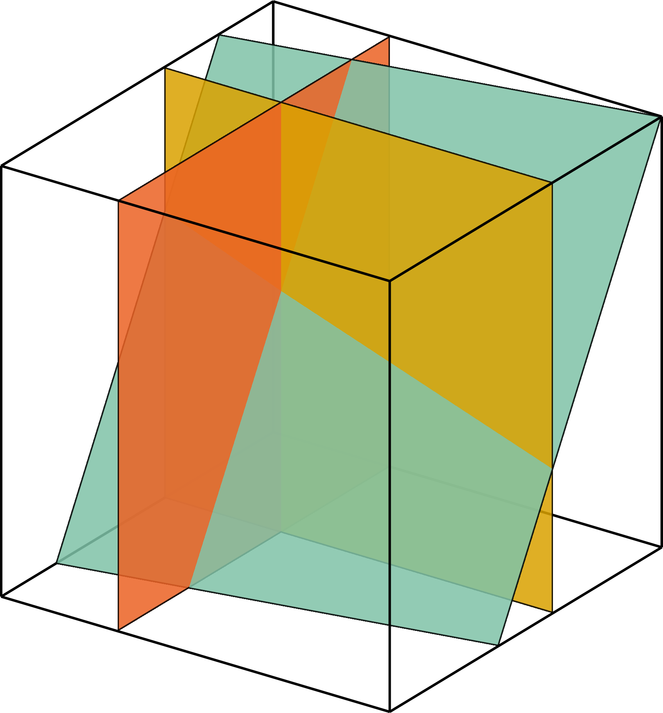
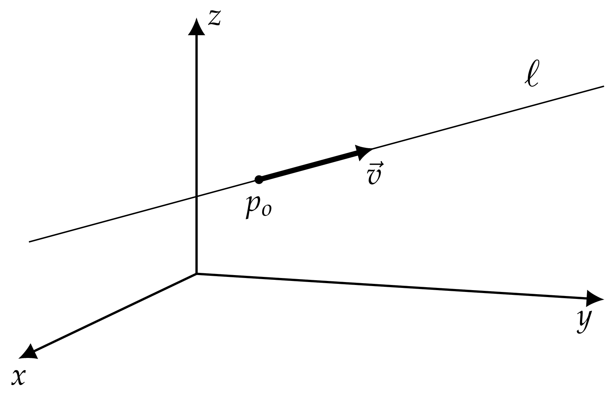
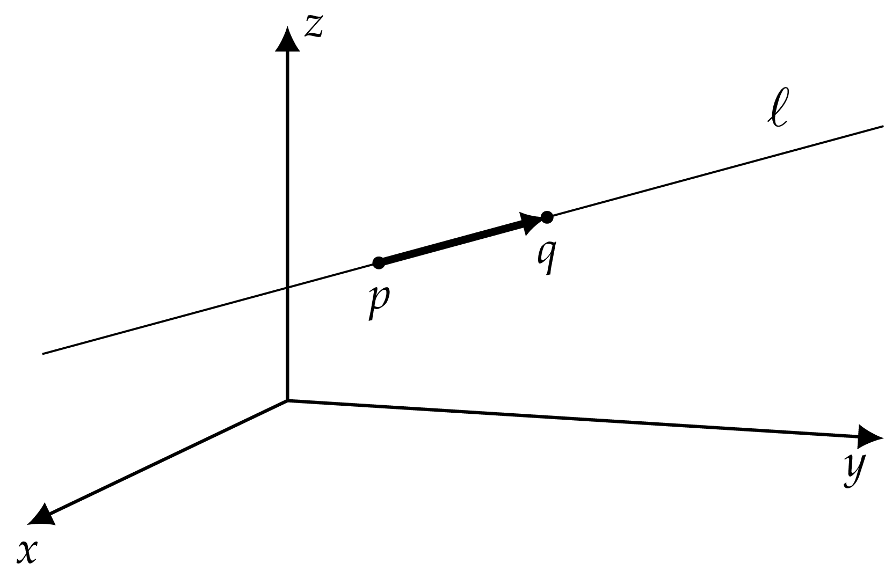
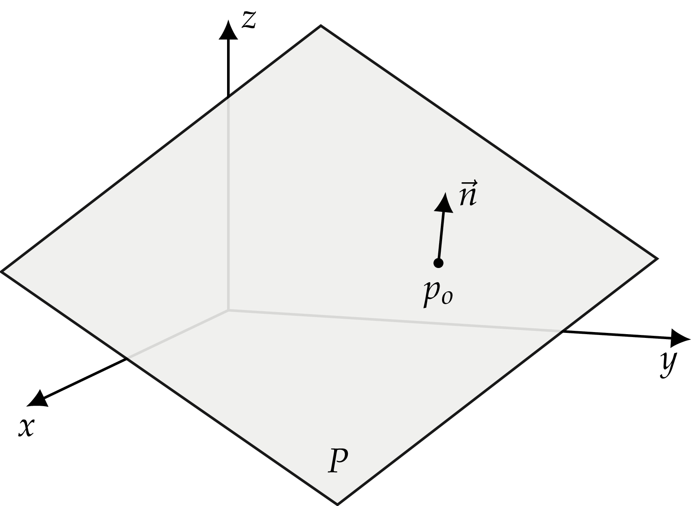
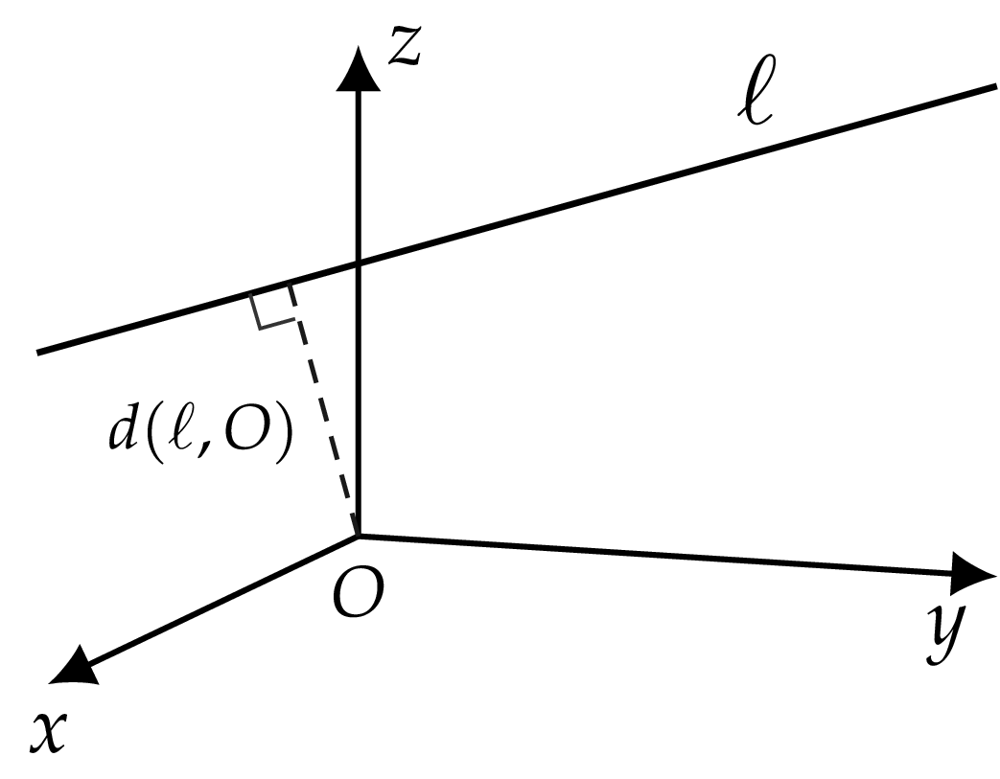
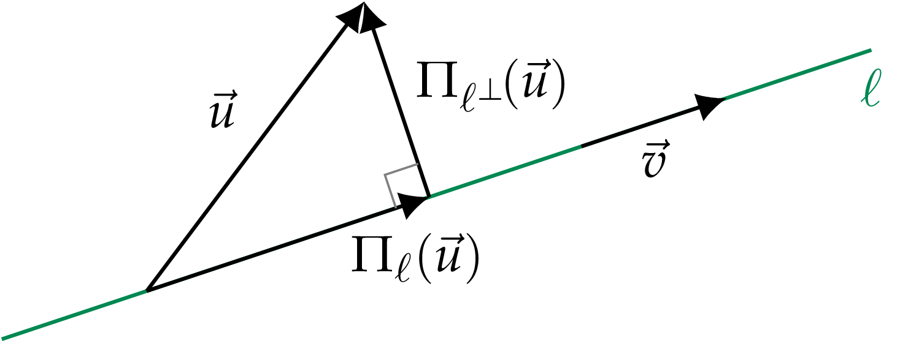
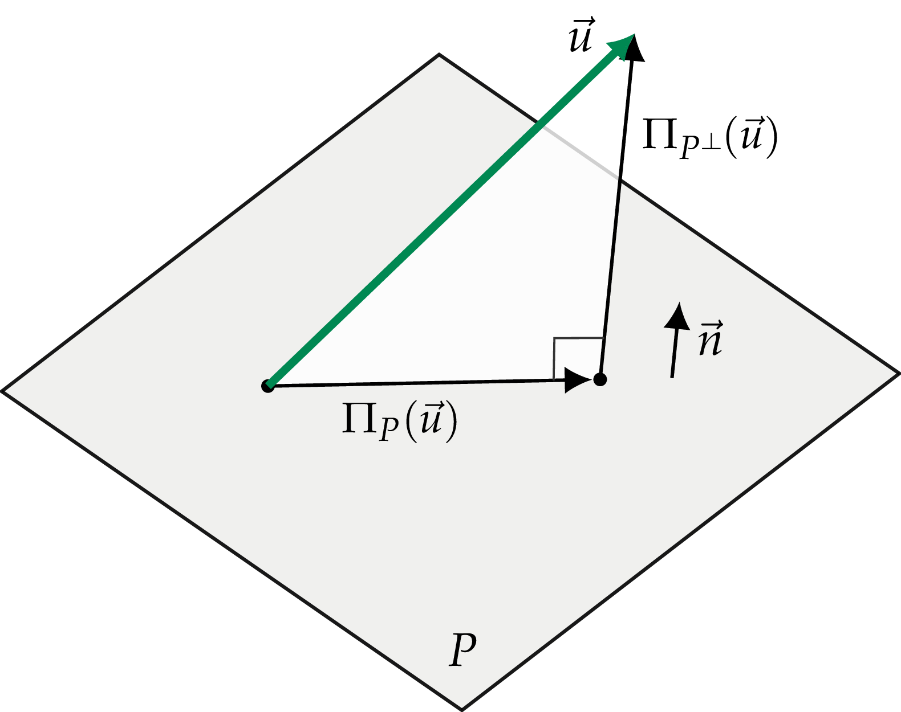
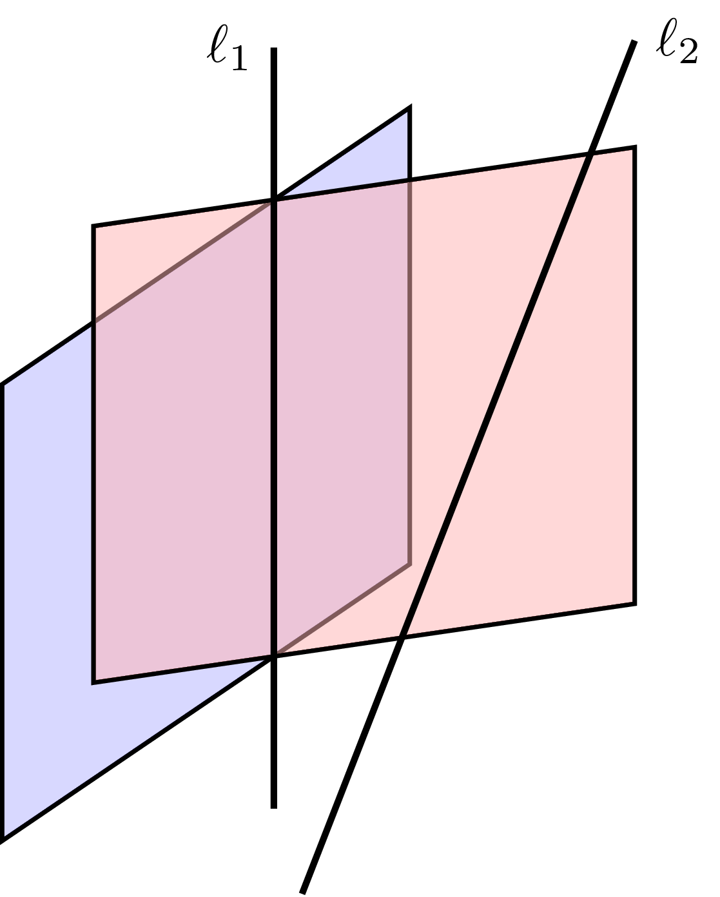

Chapter 4      

#[Chapter 4 Geometric aspects of linear algebra](./Chapter 4_ Geometric aspects of linear algebra.md)

In this section, we’ll study geometric objects like lines, planes, and vector spaces. We’ll use what we learned about vectors and matrices in the previous chapters to perform geometric calculations such as projections and distance measurements.

Developing your intuition about the geometric problems of linear algebra is very important: of all the things you learn in this course, your geometric intuition will stay with you the longest. Years from now, you may not recall the details of the Gauss–Jordan elimination procedure, but you’ll still remember that the solution to three linear equations in three variables corresponds to the intersection of three planes in .

##[4.1 Lines and planes](./Chapter 4_ Geometric aspects of linear algebra.md)

_Points_, _lines_, and _planes_ are the basic building blocks of geometry. In this section, we’ll explore these geometric objects, the equations that describe them, and their visual representations.

###[Concepts](./Front matter.md)

-   : a _point_ in 
-   : a _vector_ in 
-   : the _unit vector_ in the same direction as the vector 
-   An infinite line  is a one-dimensional space defined in one of several possible ways:
    -   : a _parametric equation_ of a line with direction vector  passing through the point 
    -   : a _symmetric equation_
-   An infinite plane  is a two-dimensional space defined in one of several possible ways:
    -   : a _general equation_
    -   : a _parametric equation_
    -   ![P: \left\{ 				    				\vec{n} \cdot[ (x,y,z) - p_{\textrm{o}} ] = 0 \,\right\}](../Images/152619953d7ca5bab185f313b14543a2d1aef8cb.png): a _geometric equation_ of the plane that contains point  and has normal vector 
-   : the shortest _distance_ between geometric objects  and 

###[Points](./Front matter.md)

We can specify a point in  by its coordinates , which is similar to how we specify vectors. In fact, the two notions are equivalent: we can either talk about the destination point  or the vector  that takes us from the origin to the point . This equivalence lets us add and subtract vectors and points. For example,  denotes the displacement vector that takes the point  to the point .

We can also specify a point as the intersection of two lines. As an example in , let’s define  to be the intersection of the lines  and . We must solve the two equations simultaneously to find the coordinates of the point . We can use the standard techniques for solving equations to find the answer. The intersection point is . Note that for two lines to intersect at a point, the lines must not be parallel.

Figure 4.1: Two non-parallel lines in  intersect at a point.

#####[Example 1](./Front matter.md)

Find where the lines  and  intersect. To find the point of intersection, we solve these equations simultaneously and obtain the point  that is contained in both lines. The answer is the point .

In three dimensions, a point can also be specified as the intersection of three planes. This is precisely what happens when we solve equations of the form:

To solve this system of equations, we must find the point  that satisfies all three equations, which means this point is contained in all three planes.

Figure 4.2: Three non-parallel planes in  intersect at a point.

###[Lines](./Front matter.md)

A line  is a one-dimensional space that is infinitely long. There are several equivalent ways to specify a line in space.

The _parametric equation_ of a line is obtained as follows. Given a direction vector  and some point  on the line, we define the line as the following set:

The line consists of all the points  that can be reached by starting from the point  and adding any multiple of the direction vector , as illustrated in[Figure 4.3](./Chapter 4_ Geometric aspects of linear algebra.md). We say the line is _parametrized_ by the variable .

Figure 4.3: All points on the line  can be reached by starting from the point  and adding some multiple of the direction vector .

The _symmetric equation_ is an equivalent way to describe a line that does not require an explicit parametrization. The equations that correspond to each coordinate in the parametric equation of a line are

When we solve for  in these equations and equate the results, we obtain the _symmetric equation_ of a line:

Note the parameter  does not appear. The symmetric equation specifies the line as the relationships between the , , and  coordinates that hold for all points on the line.

You’re probably most familiar with the symmetric equation of lines in , which does not involve the variable . For nonvertical lines in  (), we can think of  as a function of  and write the equation of the line in the equivalent form:

where  and . The equation  makes sense intuitively: the slope of a line  corresponds to how much the line “moves” in the \-direction divided by how much the line “moves” in the \-direction.

Another way to describe a line is to specify two points that are part of the line, as shown in[Figure 4.4](./Chapter 4_ Geometric aspects of linear algebra.md). The equation of a line that contains the points  and  can be obtained as follows:

where  plays the role of the direction vector  for this line. Any vector parallel to the line can be used as the direction vector for the line.

Figure 4.4: The line  is defined by the points  and .

#####[Example 2](./Front matter.md)

Find the parametric equation of the line that passes through the points  and . What is the symmetric equation of this line?

Using the direction vector  and the point  on the line, we can write a parametric equation for the line as . Note that a parametric equation using the direction vector  would be equally valid: . The symmetric equation of the line is .

####[Lines as intersections of planes](./Front matter.md)

In three dimensions, the intersection of two non-parallel planes forms a line. For example, the intersection of the \-plane  and the \-plane  is the \-axis: . For this simple case, we can imagine the two planes (use your hands) and visually establish that they intersect along the \-axis. Wouldn’t it be nice if there was a general procedure for finding the line of intersection of two planes?

Figure 4.5: The \-axis is the intersection of the \-plane and the \-plane.

You already know such a procedure! The line of intersection between the planes  and  is the solution of the following set of linear equations:

#####[Example 3](./Front matter.md)

Find the intersection of the planes  and . We follow the standard Gauss–Jordan elimination procedure we learned in[Chapter 3](./Chapter 3_ Computational linear algebra.md): construct an augmented matrix, perform row operations (denoted ), obtain the RREF, and interpret the solution:

![\left[ \begin{array}{ccc|c}
0 & 0 & 1  \; \; & \;  0 \\
0 & 1 & 1  \; \;  &\;  0 
\end{array}\right]
\; \; 
\sim
\; \; 
\left[ \begin{array}{ccc|c}
0 & 1 & 1  \; \; & \;  0 \\
0 & 0 & 1  \; \;  &\;  0 
\end{array}\right]
\; \; 
\sim
\; \; 
\left[ \begin{array}{ccc|c}
0 & 1 & 0  \; \; & \;  0 \\
0 & 0 & 1  \; \;  &\;  0 
\end{array}\right]							    
\!\!.](../Images/d45ded6c557fcaa93feb9b4d3aa6c1cfebf5c1ed.png)

The first column is a free variable . The solution is the line

which corresponds to the \-axis.

###[Planes](./Front matter.md)

A plane  in  is a two-dimensional space with infinite extent. In general, we specify a plane through a constraint equation that must be satisfied by all points in the plane:

The plane  is the set of all points  that satisfy the equation . The equation  is called the _general equation_ of the plane. This definition represents the _algebraic view_ of planes, which is useful for calculations.

There is an equally useful geometric view of planes. A plane can be specified by a _normal vector_  and some point  in the plane. The normal vector  is perpendicular to the plane: it sticks out at right angles to the plane like the normal force between surfaces in physics problems. All points in the plane  can be obtained by starting from the point  and moving in a direction orthogonal to the normal vector . The geometric formula of a plane is

![P: \; \;  \vec{n} \cdot[ (x,y,z) - p_{\textrm{o}} ] = 0.](../Images/a928708f5c8a2b15c6e2759821b7ffacfd451b01.png)

Recall that the dot product of two vectors is zero, if and only if these vectors are orthogonal. In the above equation, the expression ![[(x,y,z) - p_{\textrm{o}}]](../Images/93748512ffa1efc5a111f55811f84f8c6acd8d18.png) forms an arbitrary vector with one endpoint at . From all these vectors, we select _only_ those that are perpendicular to , and thus we obtain all the points in the plane.

Figure 4.6: All points on the plane  can be reached by starting from the point  and moving perpendicularly to the normal vector .

The geometric equation ![\vec{n} \cdot[ (x,y,z) - p_{\textrm{o}} ] = 0](../Images/c9b03b10a641578b860d1aaaadbfdef6fd999ff2.png) is equivalent to the general equation . We can find the parameters , , , and  by calculating the dot product: , and .

Observe that scaling the general equation of a plane by a constant factor does not change the plane: the equations  and  define the same plane. Similarly, the geometric equations ![\vec{n} \cdot[ (x,y,z) - p_{\textrm{o}} ] = 0](../Images/c9b03b10a641578b860d1aaaadbfdef6fd999ff2.png) and ![\alpha\vec{n} \cdot[ (x,y,z) - p_{\textrm{o}} ] = 0](../Images/318cc98f12d2c57ff6f5dfa6d7625c33349b2894.png) define the same plane. In each case, the direction of the normal vector  is important, but not its length.

We can also give a _parametric equation_ of a plane . If we know a point  in the plane and two linearly independent vectors  and  that lie in the plane, then a parametric equation for the plane can be obtained as follows:

Since a plane is a two-dimensional space, we need two parameters ( and ) to describe the location of arbitrary points in the plane.

Suppose we’re given three points , , and  that lie in the plane. How can we find the geometric equation for this plane ![\vec{n} \cdot[ (x,y,z) - p_{\textrm{o}} ] = 0](../Images/c9b03b10a641578b860d1aaaadbfdef6fd999ff2.png)? We can use the point  as the reference point , but how do we find the normal vector  for the plane? The trick is to use the cross product. First we build two vectors that are parallel to the plane,  and . Then compute their cross product to find a vector that is perpendicular to both of them, and hence normal to the plane:

We can use the vector  to write the geometric equation of the plane ![\vec{n} \cdot[ (x,y,z) - p ] = 0](../Images/f6b351fcd421a87fd9134bd04f1133a2b9b061ec.png). Recall that the cross product of two vectors is perpendicular to both vectors. This property of the cross product makes it the perfect tool for finding normal vectors. This procedure is illustrated in[Figure 4.7](./Chapter 4_ Geometric aspects of linear algebra.md).

Figure 4.7: We can obtain the normal vector  for the plane  by starting from the three points , , and  which lie in the plane.

#####[Example 4](./Front matter.md)

Consider the plane that contains the points , , and . Find a geometric equation, a general equation, and a parametric equation for this plane.

We need a normal vector for the geometric equation. We can obtain a normal vector from the cross product of the vectors  and , which both lie in the plane. We obtain the normal  and write the geometric equation as ![(1,1,1) \cdot[ (x,y,z) - (1,0,0) ] = 0](../Images/2dafcf0614a4c87c07bbdeb300ff41d8ce4f87de.png), using  as the point  in the plane. To find the general equation for the plane, we compute the dot product in the geometric equation and obtain , which is the same as . The vectors  and  obtained above can also be used in the parametric equation of the plane: .

###[Distance formulas](./Front matter.md)

We’ll now discuss three formulas for calculating distances: the distance between two points, the closest distance between a line and the origin, and the closest distance between a plane and the origin.

####[Distance between points](./Front matter.md)

The distance between points  and  is equal to the length of the vector that goes from  to :

####[Distance between a line and the origin](./Front matter.md)

The closest distance between the line with equation  and the origin  is given by the formula

Figure 4.8: The closest distance between the line  and the origin.

#####[Example 5](./Front matter.md)

The closest distance between the line  and the origin  is calculated as follows:

####[Distance between a plane and the origin](./Front matter.md)

The closest distance between the plane with geometric equation ![P: \; \vec{n} \cdot[ (x,y,z) - p_{\textrm{o}} ] = 0](../Images/3b42b973a9a9df3c0649f9575efbf864bc145a14.png) and the origin  is given by

For example, the distance between the plane ![P: \; (-3,0,-4) \cdot[ (x,y,z) - (1,2,3)] = 0](../Images/202f81a5499371914c5e14c836e43797f40a40c4.png) and the origin is computed as

Figure 4.9: The closest distance between the plane  and the origin.

###[Discussion](./Front matter.md)

The distance formulas  and  are complicated expressions that involve dot products and vector lengths. To understand the logic behind these distance formulas, we need to learn a bit about _projective geometry_. The techniques of projective geometry allow us to measure distances between arbitrary points, lines, and planes. No new math operations are required. Instead, we’ll learn how to use a combination of vector subtraction, vector length, and the dot product to compute distances. Each distance function  corresponds to an abstract procedure with one or two steps which can be described using a vector diagram. Projections play a key role in projective geometry, so we’ll learn about them in detail in the next section.

###[Exercises](./Front matter.md)

E4.1 Define the line . Find the closest distance between the line  and the origin.

E4.2 Find the closest distance between the origin and the line defined by .

E4.3 Find the distance between the plane  with geometric equation ![(1,1,1)\cdot[ (x,y,z)-(4,5,6) ]=0](../Images/1ff723d8c0b4cd1f8d4985a5bedd07337e5ef54d.png) and the origin.

E4.4 Find the general equation of the line that passes through the points  and  in .

E4.5 Given the point , the line , the plane , and the origin , compute the following closest distances:

1.  
2.  
3.  
4.  
5.  
6.  

Draw a diagram and find the closest distances visually. Label the point , which is an arbitrary point in the line, and the point , which is an arbitrary point in the plane. Don’t look for a one-size-fits-all formula for the different cases; derive the appropriate formula for each case starting from the basic projection operations  and .

##[4.2 Projections](./Chapter 4_ Geometric aspects of linear algebra.md)

In this section we’ll learn to compute projections of vectors onto lines and planes. Given an arbitrary vector, we’ll find how much of this vector points in a given direction (projection onto a line). We’ll also find the part of the vector that lies in some plane (projection onto a plane). The dot product, , will play a central role in these calculations.

**Each projection formula corresponds to a vector diagram**. Vector diagrams, also known as “picture proofs,” are used to describe the precise sequence of operations for computing a projection. Focussing on vector diagrams makes it much easier to understand projection and distance formulas. Indeed, the pictures in this section are a heck of a lot more important than the formulas. Be sure you understand each vector diagram, and don’t worry about memorizing the corresponding formula. You can easily reproduce the formula by starting from the vector diagram.

###[Concepts](./Front matter.md)

-   :  is a _vector subspace_ of . In this section, we assume . The subspaces of  are lines  and planes  that pass through the origin.
-   : the orthogonal complement to , . The symbol  stands for _perpendicular to_.
-   : the _projection_ onto the subspace .
-   : the projection onto the subspace .

###[Definitions](./Front matter.md)

Let  be a _vector subspace_ of , denoted . In this section, we’ll focus on the subspaces of the vector space  because they are easy to visualize and understand intuitively. The vector subspaces of  are lines and planes that pass through the origin. We defer the general discussion of subspaces in  dimensions until[Section 4.4](./Chapter 4_ Geometric aspects of linear algebra.md).

The projection operation onto the subspace  is a linear transformation that takes as inputs vectors in , and produces outputs in the subspace :

The transformation , pronounced “projection onto ,” cuts off all parts of the input that do not lie within the subspace . We can understand  by analyzing its action for different inputs:

-   If , then .
-   If , then .
-   Linearity and the above two conditions imply that, for any vector  with  and , we have
    
    
    

The _orthogonal subspace_ to  is the set of vectors that are perpendicular to all vectors in :

The transformation  “projects” to the space  in the sense that, no matter which vector  you start from, applying the projection  results in a vector that is in :

All parts of  in the _perp_\-space  were killed by . Meet —the \-_perp_ killer.

We can split the set of all vectors  into two disjoint sets: vectors entirely contained in  and vectors perpendicular to . We say  decomposes into the _direct sum_ of the subspaces  and :

Any vector  can be split into an \-part  and a \-part , such that

A defining property of projections is that they are _idempotent operations_, meaning it doesn’t matter if you project a vector once, twice, or a million times; the result will always be the same:

Once you project a vector onto the subspace , any further projections to  have no effect.

In the remainder of this section, we’ll derive formulas for projections onto lines and planes that pass through the origin.

###[Projection onto a line](./Front matter.md)

Consider the line  passing through the origin with direction vector :

The projection onto  for an arbitrary vector  is given by the formula

Figure 4.10: The vector  can be decomposed into the sum of two projections defined with respect to the line . The projection  is parallel to the line , while the projection  is perpendicular to the line .

The orthogonal complement to the line  consists of all vectors perpendicular to the direction vector . Mathematically speaking,

Recognize that the equation  defines a _plane_. The orthogonal complement for a line  with direction vector  is a plane with normal vector . Makes sense, yes?

We can easily find the projection operation onto  as well. Any vector can be written as the sum of an  part and a  part: , where  and . To obtain , subtract the  part from the original vector :

We can think of  as the part of  that remains after we’ve removed the \-part.

#####[Example 1](./Front matter.md)

Consider the line  defined by the parametric equation . Find the projection of the vector  onto . Find the projection of  onto  and verify that .

The direction vector of the line  is , so . Next, using the formula , we find . Observe that , which shows the vector  is indeed perpendicular to . Adding the results of the two projections, we obtain the whole : .

###[Projection onto a plane](./Front matter.md)

Now consider the two-dimensional plane  passing through the origin with normal vector :

The perpendicular space  is a line with direction vector :

Again, the vector space  decomposes into the direct sum of  and : .

We want to find , but it will actually be easier to find  first and then compute  using , where . See[Figure 4.11](./Chapter 4_ Geometric aspects of linear algebra.md) for an illustration.

Figure 4.11: Any vector  can be written as the sum of two projections defined with respect to the plane . The projection  is parallel to the plane , while the projection  is perpendicular to the plane .

Since  is a line, we know the formula for projecting onto it is

We can now obtain the formula for :

#####[Example 2](./Front matter.md)

Consider the plane  defined by the geometric equation ![(1,1,1) \cdot[ (x,y,z) - (0,0,0) ] = 0](../Images/831d0fb6bd5dae0e3cb3e02a0edeaa790a4e388a.png). Find the projection of the vector  onto  and onto . Verify that .

Using the formula , we find . We also find , which is a vector in the same direction as . Observe that the vector  can be reconstructed by adding the two projections: .

###[Distances formulas revisited](./Front matter.md)

Suppose you want to find the distance between the line  and the origin . This problem is equivalent to finding the distance between the line  and the point , the answer to which is the length of the projection :

The distance between a plane ![P: \; \vec{n} \cdot[ (x,y,z) - p_{\textrm{o}} ] = 0](../Images/3b42b973a9a9df3c0649f9575efbf864bc145a14.png) and the origin  is the same as the distance between the plane  and the point . We can obtain this distance by finding the length of the projection of  onto  using the formula

On your own, try drawing the pictures for the above two scenarios. Make sure the formulas make sense to you.

###[Projections matrices](./Front matter.md)

Since projections are _linear transformations_, they can be expressed as matrix-vector products:

Multiplying the vector  by the matrix  is the same as applying the projection .

We’ll learn more about projection matrices later. For now, I’ll show you a simple example of a projection matrix in . Let  be the projection onto the \-plane. This projection operation corresponds to the following matrix-vector product:

Note how multiplying a vector by  results in selecting only the \- and \-components of the vector while killing the \-component, which is precisely what the projection onto the \-plane is supposed to do.

###[Discussion](./Front matter.md)

In the next section we’ll talk about a particular set of projections known as _coordinate projections_. We use coordinate projections to find the components of vectors  with respect to a coordinate system:

The coordinate projection  projects onto the \-axis. Similarly,  and  project onto the \- and \-axes.

###[Exercises](./Front matter.md)

E4.6 Consider the points , , the vector , and the plane  that passes through the origin and has normal vector . Compute the projections.

1.  
2.  
3.  
4.  
5.  

Your answer should be a vector in each case.

E4.7 Consider the points  and the two parallel lines  and . Compute the following quantities.

1.  
2.  
3.  
4.  
5.  

Is  closer to  or to ?

E4.8 Find the orthogonal projection of the vector  onto the plane that passes through the origin and contains the vectors  and .

##[4.3 Coordinate projections](./Chapter 4_ Geometric aspects of linear algebra.md)

In science, it’s common to express vectors as components: . Thinking of vectors as lists of components is fine for computational purposes, since vector operations require manipulating the components of vectors. However, focussing on a vector’s components overlooks an important concept—the _basis_ with respect to which the vector’s components are expressed.

It’s not uncommon for students to have misconceptions about linear algebra due to an incomplete understanding of the fundamental distinction between vectors and their components. Since I want you to have a _thorough_ understanding of linear algebra, we’ll review—in full detail—the notion of a basis and how to compute vector components with respect to different bases.

Before we begin, let’s quickly review what we know about vectors and vector components from previous sections of the book. In[Section 1.13](./Chapter 1_ Math fundamentals.md), we described vectors in terms of their \- and \-components. Given a standard \-coordinate system, we can decompose a vector  in terms of its components:

where  is the angle the vector  makes with the \-axis. We can express the vector as _coordinates_ with respect to the basis  as . The number  corresponds to the length of the _projection_ of the vector  onto the \-axis.

In the last section, we discussed the projection operation and learned how to compute projections using the dot product or as a matrix-vector product:

where  is the projection onto the \-axis (a linear transformation) and  is the matrix representation of  with respect to the basis .

In this section, we’ll extend what we know about basic vectors coordinates with respect to the basis , and formally define vector coordinates with respect to any basis.

###[Concepts](./Front matter.md)

We can define three different types of bases for an \-dimensional vector space :

-   A generic basis  consists of any set of linearly independent vectors in .
-   An orthogonal basis  consists of  mutually orthogonal vectors in  obeying , .
-   An orthonormal basis  is an orthogonal basis of unit vectors:  and .

A vector  is expressed as coordinates  with respect to any basis :

We can use two different bases,  and , to express the same vector:

-   : a vector
-   ![[\vec{v}]_{B}=(v_1, v_2, \ldots, v_n)_{B}](../Images/ae5fa7027263f23d2c0d77a80caa4f551e0f168e.png): the vector  expressed in the basis 
-   ![[\vec{v}]_{B^\prime}=(v^\prime_1, v^\prime_2, \ldots, v^\prime_n)_{B^\prime}](../Images/c933d43adc9042c63f65c64b1bf50b24808d6d3b.png): the same vector  expressed in a different basis 
-   ![\tensor[_{B^\prime}]{\left[\mathbbm{1}\right]}{_{B}}](../Images/029b9a61176cd5f29400e699e84a44a9f08e60cd.png): the change-of-basis matrix that converts from  coordinates to  coordinates: ![[\vec{v}]_{B^\prime} = \tensor[_{B^\prime}]{\left[\mathbbm{1}\right]}{_{B}}\,[\vec{v}]_{B}](../Images/f1c32ab9c513e7c6ac32d1ad4a9b2d10b40416a0.png)

###[Components with respect to a basis](./Front matter.md)

A vector’s _components_ describe how much of the vector lies in a given direction. For example, a vector  expressed as components _with respect to_ the standard orthonormal basis  is denoted . The _components_ of a vector are also called _coordinates_ (in the context of a coordinate system) and _coefficients_ (in the context of a linear combination). Don’t be confused by this multitude of terms because it’s all the same idea: components, coordinates, and coefficients are all ways to describe vectors with respect to bases.

When the basis consists of a set of orthonormal vectors like the vectors , , and , we can compute vector components using the dot product:

In this section, we’ll discuss how to find coordinates with respect to three different types of bases: orthonormal bases, orthogonal bases, and generic bases. First, let’s precisely define what a _basis_ is.

###[Definition of a basis](./Front matter.md)

A basis  for the vector space  has the following two properties:

-   **Spanning property**: Any vector  can be expressed as a linear combination of the basis vectors:
    
    
    
    This property guarantees that the vectors in the basis  are _sufficient_ to represent any vector in .
    
-   **Linear independence property**: The vectors that form the basis  are linearly independent. The linear independence of the vectors in the basis guarantees that none of the vectors  are redundant.

If a set of vectors  satisfies both properties, we say  is a basis for . In other words,  can serve as a coordinate system for .

###[Coordinates with respect to an orthonormal basis](./Front matter.md)

An orthonormal basis  consists of a set of mutually orthogonal, unit vectors:

The vectors are mutually orthogonal since  for all , and the vectors have length one since  implies .

To compute the coordinates of the vector  with respect to an orthonormal basis , we use the standard “prescription” similar to the one we used for the  basis:

###[Coordinates with respect to an orthogonal basis](./Front matter.md)

Consider a basis  that is orthogonal, but not orthonormal. We can compute the coordinates of any vector  with respect to the basis  as follows:

To find the coordinates of the vector  with respect to , we use the general projection formula,

Observe that each component of the vector can be computed independently of the other components: to compute , all we need to know is  and ; we don’t need to know , , , , because we know the other basis vectors are orthogonal to . The computation of the coordinates correspond to  independent _orthogonal projections_. The coordinate  tells us how much of the basis vector  we need in the linear combination to construct the vector .

###[Coordinates with respect to a generic basis](./Front matter.md)

Suppose we’re given a generic basis  for a vector space. To find the coordinates  of a vector  with respect to this basis, we need to solve the equation

for the unknowns . Because the vectors  are not orthogonal, the calculation of the coefficients  must be done simultaneously.

#####[Example](./Front matter.md)

Express the vector  in terms of the basis  where  and .

We are looking for the coefficients  and  such that

To find the coefficients we need to solve the following system of equations _simultaneously_:

From the second equation we find . We substitute this answer into the first equation and find . Thus, the vector  written with respect to the basis  is .

The general case of computing a vector’s coordinates with respect to a generic basis  requires solving a system of  equations in  unknowns. You know how to do this, but it will take some work. The take-away message is that computing vector coordinates with respect to generic bases is more difficult than computing vector coordinates with respect to orthogonal and orthonormal bases.

###[Change of basis](./Front matter.md)

We often identify a vector  with its components . It’s important to always keep in mind the basis with respect to which the components are taken, and if necessary specify the basis as a subscript . When performing vector arithmetic operations like , we don’t really care what basis the vectors are expressed in so long as the _same_ basis is used for both  and .

We sometimes need to use multiple bases, however. Consider the basis  and another basis . Suppose we’re given the coordinates  of some vector  in terms of the basis :

How can we find the coordinates of  in terms of the basis ?

This is called a _change-of-basis_ transformation, and it’s performed as a matrix multiplication with a _change-of-basis matrix_:

![\left[
\begin{array}{c}
v_1^\prime  \\
v_2^\prime  \\
v_3^\prime  
\end{array}
\right]_{\!B^\prime }
=
\underbrace{\!\!
\left[
\begin{array}{ccc}
\hat{e}^\prime_1 \cdot \hat{e}_1		& \hat{e}^\prime_1 \cdot \hat{e}_2	& \hat{e}^\prime_1 \cdot \hat{e}_3 \\
\hat{e}^\prime_2 \cdot \hat{e}_1		& \hat{e}^\prime_2 \cdot \hat{e}_2	& \hat{e}^\prime_2 \cdot \hat{e}_3 \\
\hat{e}^\prime_3 \cdot \hat{e}_1		& \hat{e}^\prime_3 \cdot \hat{e}_2	& \hat{e}^\prime_3 \cdot \hat{e}_3 
\end{array}
\right]\!\!
}_{  \tensor[_{B^\prime}]{\left[\mathbbm{1}\right]}{_{B}}  } 
\!
\begin{bmatrix}
v_1  \\
v_2  \\
v_3  
\end{bmatrix}_{\!B }.](../Images/610f47a287e0100b0075f5ea9706de561963a937.png)

The columns of the change-of-basis matrix describe the vectors of the basis  in terms of the basis .

Note that multiplying a vector by the matrix ![\!\tensor[_{B^\prime}]{\left[\mathbbm{1}\right]}{_{B}}](../Images/b3068d47a22daef194cb14735750ffa22f484a70.png) doesn’t actually _do_ anything since it doesn’t change the vector. The change-of-basis operation acts like the identity transformation, which is why we use the notation ![\!\tensor[_{B^\prime}]{\left[\mathbbm{1}\right]}{_{B}}](../Images/b3068d47a22daef194cb14735750ffa22f484a70.png) to describe it. The vector  stays the same—it is simply expressed in terms of a different basis:

We say the vector  has two _representations_. The vector  corresponds to the coordinates triple  with respect to the basis , and to the triple  with respect to the basis .

The matrix ![\!\tensor[_{B^\prime}]{\left[\mathbbm{1}\right]}{_{B}}](../Images/b3068d47a22daef194cb14735750ffa22f484a70.png) contains the information about how each vector of the old basis () is expressed in terms of the new basis (). For example, the first column of the change-of-basis matrix describes how the vector  is expressed in terms of the basis :

Note this is the generic formula for expressing vectors in the basis .

To find the entries of the change-of-basis matrix ![\!\tensor[_{B^\prime}]{\left[\mathbbm{1}\right]}{_{B}}](../Images/b3068d47a22daef194cb14735750ffa22f484a70.png) between orthonormal bases  and , it’s sufficient to compute all the dot products . To compute the entries of a change-of-basis matrix between bases  and  (which are orthogonal but not necessarily orthonormal), we use ![\left(\!\tensor[_{B^\prime}]{\left[\mathbbm{1}\right]}{_{B}}\right)_{ij}
=\frac{ \vec{e}^\prime_i \cdot \vec{e}_j }{ \| \vec{e}^\prime_i \| \, \|\vec{e}_j\|}](../Images/dd44d79ee20bd0512605128dfba17e45f7b009b3.png). Computing the change-of-basis matrix between nonorthogonal bases is more complicated.

###[Change of basis to the standard basis](./Front matter.md)

We’ll now discuss an important special case of the change-of-basis operation, where we change from a generic basis  to the standard basis . In three dimensions, the vectors of the standard basis are denoted , , and . Assume the vectors of the generic basis are given to us as coordinate vectors with respect to the standard basis , , and . The change-of-basis matrix needed to convert vectors from the generic basis  to the standard basis  is

![\!\tensor[_{B_s}]{\left[\mathbbm{1}\right]}{_{B_{\!f}}}
=
\left[\begin{array}{ccc}
\hat{\imath} \cdot \vec{f}_1   & \hat{\imath} \cdot \vec{f}_2     & \hat{\imath} \cdot \vec{f}_3 \\
\hat{\jmath} \cdot \vec{f}_1   & \hat{\jmath} \cdot \vec{f}_2     & \hat{\jmath} \cdot \vec{f}_3 \\
\hat{k} \cdot \vec{f}_1   & \hat{k} \cdot \vec{f}_2 & \hat{k} \cdot \vec{f}_3 
\end{array}\right]
=
\begin{bmatrix}
f_{1x}	&	f_{2x}	&	f_{3x}	\\
f_{1y}	&	f_{2y}	&	f_{3y}	\\
f_{1z}	&	f_{2z}	&	f_{3z}
\end{bmatrix}\!.](../Images/61ba57c0ee606923ef2ec37d0a46bd6962b3bc13.png)

Observe the matrix ![\!\tensor[_{B_s}]{\left[\mathbbm{1}\right]}{_{B_{\!f}}}](../Images/9cfbb8a0ef04b98727cd55a015b525ce95ff958e.png) contains the components of the vectors , , and  as its columns. This makes sense, since we’re computing dot products with the vectors , , and .

To obtain the change-of-basis matrix for the opposite direction—from  to —compute the inverse of the change-of-basis matrix:

![\tensor[_{B_{\!f}}]{\left[\mathbbm{1}\right]}{_{B_s}}
=
\left( \!\tensor[_{B_s}]{\left[\mathbbm{1}\right]}{_{B_{\!f}}}	\right)^{\!-1}\!.](../Images/3f5fc37ad9e26f7b222843beb116be7b56bcbecc.png)

We can find the inverse using one of the computational techniques we learned in[Chapter 3](./Chapter 3_ Computational linear algebra.md).

#####[Example](./Front matter.md)

Consider the basis , where  and . Find the coordinates of the vector  with respect to the standard basis. Also, find the coordinates of the vector  with respect to the basis .

To answer the first part of the question, we need to find the change-of-basis matrix from  to the standard basis:

![\!\tensor[_{B_s}]{\left[\mathbbm{1}\right]}{_{B_{\!f}}}
=
\left[\begin{array}{cc}
\hat{\imath} \cdot \vec{f}_1   & \hat{\imath} \cdot \vec{f}_2 \\
\hat{\jmath} \cdot \vec{f}_1   & \hat{\jmath} \cdot \vec{f}_2
\end{array}\right]
=
\begin{bmatrix}
\; 1 & 1 \; \\
\; 2 & 1 \; 
\end{bmatrix}\!.](../Images/27c354ee98ba178cee022012321870753af062cb.png)

We then compute . Thus we’ve shown that .

To answer the second part of the question, we compute ![(\!\tensor[_{B_s}]{\left[\mathbbm{1}\right]}{_{B_{\!f}}})^{-1}](../Images/3894b04c04da8e8bf09dd33a8f2664c3555bd8a2.png):

![\left[\!\!\begin{array}{cc|cc}
1 & 1		&	1  &  \!0		\\ 
2 & 1		&	0  &  \!1
\end{array}\!\!\right]\!
\sim
\!\left[\!\!\begin{array}{cc|cc}
1 & 1 	& 1 	& \! 0	\\
0 & \!-1 	& -2 	& \! 1
\end{array}\!\!\right]\!
\sim
\!\left[\!\!\begin{array}{cc|cc}
1 & 1 	& 1 & 0\\
0 & 1 	& 2 & \!\!-1
\end{array}\!\!\right]\!
\sim
\!\left[\!\!\begin{array}{cc|cc}
1 & 0 	& -1 & 1\\
0 & 1 	& 2 & \!\!-1
\end{array}\!\!\right]\!.](../Images/720b634e45bcff8e7fdeba37a317161fcb64d0e6.png)

Having obtained ![\!\tensor[_{B_{\!f}}]{\left[\mathbbm{1}\right]}{_{B_s}}
=
(\!\tensor[_{B_s}]{\left[\mathbbm{1}\right]}{_{B_{\!f}}})^{-1} = 
\begin{bmatrix}
-1 & 1\\2 & \!-1
\end{bmatrix}](../Images/007c59965d93750bf9a31f7a1a3f07dda9519072.png), we can now compute the coordinates of  in the basis  using . Thus we’ve shown that .

###[Links](./Front matter.md)

\[ Khan Academy video on the change-of-basis operation \]

[`https://youtube.com/watch?v=meibWcbGqt4`](./watch_v=meibWcbGqt4.md)

\[ Change of basis explained by 3Blue1Brown \]

[`https://youtube.com/watch?v=P2LTAUO1TdA`](./watch_v=P2LTAUO1TdA.md)

###[Exercises](./Front matter.md)

E4.9 Find the coordinates of the vector  with respect to the basis .

E4.10 Find the change-of-basis matrix ![\tensor[_{B_m}]{\left[\mathbbm{1}\right]}{_{B_s}}](../Images/5d85dae919c04439ee32425615ebc808f1513ad6.png) that transforms vectors expressed in the standard basis  to vectors in the modified basis .

Find the change-of-basis matrix ![\tensor[_{B_s}]{\left[\mathbbm{1}\right]}{_{B_m}}](../Images/ad4fa74f52191f97b5de69d468880e054975bfed.png) first.

E4.11 How many vectors exist in a basis for a four-dimensional vector space? Besides the number of vectors it contains, what other condition must a set of vectors satisfy to be a basis?

##[4.4 Vector spaces](./Chapter 4_ Geometric aspects of linear algebra.md)

We’re about to shift our attention from individual vectors to entire sets of vectors. We’re entering the territory of _vector spaces_. For instance, the set of all possible three-dimensional vectors is denoted , and is a type of _vector space_. A vector space consists of a set of vectors and all linear combinations of these vectors. This means if the vectors  and  are part of some vector space, then so is the vector  for any  and . A _vector subspace_ consists of a subset of all possible vectors. The vector subspaces of  are lines and planes that pass through the origin.

Since vector spaces and subspaces play a central role in many areas of linear algebra, you’ll want to learn about the properties of vector spaces and develop your vocabulary for describing them.

By using the language of vector spaces, you’ll be able to describe certain key properties of matrices. The four _fundamental subspaces_ associated with a matrix  are its _column space_ , its _row space_ , its _null space_ , and its _left null space_ . Let’s now define these vector spaces and discuss how they help us understand the solutions to the matrix equation , and the properties of the linear transformation .

###[Definitions](./Front matter.md)

-   : a _vector space_
-   : a _vector_. We use the notation  to indicate the vector  is part of the vector space .
-   : a _vector subspace_. We use the notation  to indicate the vector space  is a subspace of the vector space .
-   _span_: the span of a set of vectors is the set of vectors that can be constructed as linear combinations of these vectors:
    
    
    

For every matrix , we define the following _fundamental subspaces_ associated with the matrix :

-   : the _row space_ of the matrix  consists of all possible linear combinations of the rows of the matrix .
-   : the _column space_ of the matrix  consists of all possible linear combinations of the columns of the matrix .
-   : the _null space_ of  is the set of vectors that go to the zero vector when multiplying  from the right: .
-   : the _left null space_ of  is the set of vectors that go to the zero vector when multiplying  from the left: .

The dimensions of the column space and the row space of a matrix are equal. We call this dimension the _rank_ of the matrix: .

###[Vector space](./Front matter.md)

A vector space  consists of a set of vectors and all possible linear combinations of these vectors. The notion of _all possible linear combinations_ is very powerful. In particular, it implies two useful properties. First, vector spaces are _closed under addition_: for all vectors in that space, the sum of two vectors is also a vector in that vector space. Mathematically, we write this as

Recall the symbol  is math shorthand for the phrase “for all.”

Second, vector spaces are _closed under scalar multiplication_:

Starting from any vector  in the vector space  and scaling the vector by any constant  results in a vector in the same vector space.

These two properties codify the essential nature of what a vector space is: a space of vectors that can be added together and scaled by constants.

###[Span](./Front matter.md)

The _span_ operator is a useful shorthand for denoting “the set of all linear combinations” of some set of vectors. This may seem like a weird notion at first, but it will prove very useful for describing vector spaces.

Let’s now illustrate how to define vector spaces using the span operator through some examples. Given a vector , define the following vector space:

We say  is _spanned_ by , which means any vector in  can be written as a multiple of . The shape of  is an infinite line.

Given two vectors , we define the vector space spanned by these vectors as

The vector space  contains all vectors that can be written as a linear combination of  and . This is a two-dimensional vector space. Geometrically speaking, the shape of  is an infinite plane that passes through the origin.

Now suppose we’re given three vectors , such that , and we define the vector space . The vector space  is actually the same as ; adding the vector  to the span of  and  does not enlarge the vector space because the vector  is a linear combination of  and . Geometrically speaking, the vector  lies in the same plane as  and .

Consider the vector space , where , for some . Since  is a linear combination of the vector , the vector space  is one-dimensional. In fact,  is the same as the vector space  defined above: .

Note that the word “span” can be used as a verb or a noun. The statement “The vectors  and  span the vector space ” is equivalent to the statement “The span of  and  is .” Both uses of the word communicate the same idea.

###[Vector subspaces](./Front matter.md)

We use the notation  to indicate that  is a _subspace_ of . A _subspace_ is a subset of the vectors in the larger space that has a vector space structure. In other words,  if the following conditions are satisfied:

-    is contained in : for all , if , then .
-    is closed under addition: for all , .
-    is closed under scalar multiplication: for all , .

Subspaces always contain the zero vector . This is implied by the third condition: _any_ vector becomes the zero vector when multiplied by the scalar : .

###[Subspaces specified by constraints](./Front matter.md)

One way to define a vector subspace  is to start with a larger space  and describe a _constraint_ that is satisfied by all vectors in the subspace . For example, the \-plane is defined as the set of vectors  that satisfy the constraint

More formally, we define the \-plane as

Since the vector  is perpendicular to all vectors in the \-plane, we can describe the \-plane as “the set of all vectors perpendicular to the vector .”

###[Subspaces specified as a span](./Front matter.md)

Another way to represent the \-plane is to describe it as the span of two linearly independent vectors in the plane:

which is equivalent to saying,

This expression is a _parametrization_ of the space  with  and  as the two parameters. Each point in the plane is described by a unique pair of parameters . The parametrization of an \-dimensional vector space requires  parameters.

###[Subsets vs. subspaces](./Front matter.md)

In linear algebra, the terms _subset_ and _subspace_ are used somewhat interchangeably, and the same symbol is used to denote both subset () and subspace () relationships. Every subspace is also a subset, but not every subset is a subspace.

Let’s clarify the distinction between the terms _subset_ and _subspace_. Assume we’re working in a vector space . A subset of  can be described in the form  and consists of all vectors in  that satisfy the . A subspace  is a type of subset with a _vector space structure_, meaning it is closed under addition (for all , ), and closed under scalar multiplication (for all , ). When mathematicians refer to some subset as a _subspace_, they’re letting you know that you can take arbitrary vectors in the set, scale or add them together, and obtain a vector in the same set.

To further illustrate the difference between _subsets_ and _subspaces_, let’s compare the solution sets of two systems of equations:  and . The solution set of  is , for all , which is not a subspace of  unless . Observe that if  and  are two solutions to , their sum is not a solution: . The solution set to the equation  is not a subspace. In contrast, the solution set of  is a _vector space_ that is called _null space of _ and denoted . If  and  are two solutions to , then  is also a solution to .

####[A real-life situation](./Front matter.md)

You walk into class one day and are caught completely off guard by a surprise quiz—wait, let’s make it a mini-exam for emotional effect. Although you’ve read a chapter or two in the book, you’ve been “busy” and are totally unprepared for this exam. The first question asks you to “find the solution of the _homogeneous_ system of equations and the _non-homogeneous_ system of equations.” You rack your brain, but the only association with homogeny that comes to mind is the homogenized milk you had for breakfast. Oh, there’s more: the question also asks you to “state whether each of the solutions obtained is a _vector space_.” As you stare at the page, the words and equations begin to blur and panic sets in.

Don’t fear! Look at the problem again. You don’t know what the heck a homogeneous system of equations is, but you sure as heck know how to solve systems of equations. You solve the given system of equations  by building the augmented matrix ![[ \, A\, | \, \vec{b} \,]](../Images/cc915725ad874062d2459af26791e32439eefc58.png) and computing its reduced row echelon form using row operations. You obtain the solution set , where  is the particular solution and  is a vector that spans the null space of .

Next, you ponder the “vector space” part of the question. You notice the solution set to the _system_ of equations  isn’t a vector space since it doesn’t pass through the origin. However, the solution set to the equation  _is_ a vector space . Suddenly it clicks: a _homogeneous_ system of equations must be the system of equations , in which the constants on the right side of the equation are all zero. The term _homogeneous_ kind of makes sense; all the constants of the right side have the same value . The solution to the non-homogeneous system of equations  is the set , which is not a vector space. The solution to the homogeneous system of equations  is , which is a vector space. Well done!

###[Matrix fundamental subspaces](./Front matter.md)

We now define four _fundamental subspaces_ associated with a matrix .

-   The column space  is the span of the columns of the matrix. The column space consists of all possible output vectors the matrix can produce when multiplied by a vector from the right:
    
    
    
-   The null space  of a matrix  consists of all vectors the matrix  sends to the zero vector:
    
    
    
    The null space is sometimes called the _kernel_ of the matrix.
    
-   The row space  is the span of the rows of the matrix. We obtain linear combinations of the rows by multiplying the matrix with an \-dimensional vector from the left:
    
    
    
    Note, we used the transpose  to transform  to a row vector.
    
-   The left null space  of a matrix  consists of all vectors the matrix  sends to the zero vector when multiplied from the left:
    
    
    

These vector spaces are called _fundamental_ because they describe important properties of the matrix . Recall that matrix equations can be used to represent systems of linear equations, as well as linear transformations. A solid understanding of the fundamental subspaces leads to a solid understanding of linear equations and linear transformations.

###[Matrices and systems of linear equations](./Front matter.md)

The null space  corresponds to the solution set of the matrix equation . If a matrix has a nonempty null space, the system of equations corresponding to  has an infinite solution set. Indeed, we can write the solution of  as a _particular solution_  plus all possible vectors in the null space of :

We can verify this claim as follows. Suppose  is a solution to the equation . Consider the vector , which contains  and some arbitrary linear combination of vectors from the null space of . Observe that  is also a solution to the equation :

If the null space of  contains only the zero vector , then the system of equations  has a unique solution. It’s worth connecting the above observations with what we learned about the Gauss–Jordan elimination procedure in[Chapter 3](./Chapter 3_ Computational linear algebra.md). Suppose we want to solve the matrix equation , where  is an \-dimensional matrix,  is an \-dimensional vector of unknowns, and  is an \-dimensional vector of constants. We can construct the augmented matrix ![[\:M\; | \; \vec{b}\:]](../Images/36ac424d36667b368bb79b250bf051d1fd933e3f.png) and perform row operations until we bring the augmented matrix to its reduced row echelon form ![[\:\textrm{rref}(M)\; | \; \vec{c}\:]](../Images/945e02529ff542821508fe2881c9b0831cbf4c66.png). In the case where the null space of  is \-dimensional, the reduced row echelon form of the matrix  will have  free variables and  pivots. The solution the system of equations is , where  are the vectors in the null space of .

###[Matrices and linear transformations](./Front matter.md)

Matrices can be used to _represent_ linear transformations. We postpone the detailed discussion about linear transformations and their representation as matrices until[Chapter 5](./Chapter 5_ Linear transformations.md), but we’ll discuss the subject here briefly—mainly to introduce an important connection between the column space and the row space of a matrix, and to explain why each matrix has _two_ null spaces (what’s up with that?).

####[Matrix-vector and vector-matrix products](./Front matter.md)

A matrix  corresponds to not one but _two_ linear transformations. Up until now we’ve focused on the matrix-vector product , which corresponds to a linear transformation of the form . In addition to the linear transformation we obtain by multiplication from the right, there is also the option of multiplying  by a vector from the left: , where  (the input) is an \-dimensional row vector, and  (the output) is an \-dimensional row vector[1](./Front matter.md)

The vector-matrix product  corresponds to a linear transformation of the form . We identify the output of this linear transformation, , with the result of the vector-matrix product . The linear transformation  is called the _adjoint_ of the linear transformation . Adjoint linear transformations are represented by the same matrix .  is defined as the multiplication of  from the right, while  is defined as multiplication of  from the left.

Let’s clarify why we used the notation  to denote the adjoint operation of . We previously used the notation  to describe the linear transformation obtained by right multiplication by  (). Instead of creating a new notation for left multiplication, we can transform left multiplication into right multiplication by using the transpose operation:

**We can think of left multiplication by  as right multiplication by .** This correspondence also explains why we use the notation  for the left null space of ; we can rewrite the condition  as , so the left null space of  is equivalent to the right null space of .

####[Left and right input spaces](./Front matter.md)

Let’s call the _left space of _ the set of vectors suitable for multiplying  from the left. Similarly, we’ll call _right space of _ the set of vectors suitable for multiplying  from the right. If , the left space is  and the right space is .

By combining all the vectors in the row space of  and all the vectors in its null space, we obtain the full right space:

This means any vector  can be written as a sum, , such that  and . The symbol  stands for _orthogonal sum_, which means we can pick  and  to be orthogonal vectors, .

If we consider the dimensions involved the above equation, we obtain the following important relation between the dimension of the row space and the null space of a matrix:

The \-dimensional right space splits into row-space dimensions and null-space dimensions.

Similar to the split in the right space, the left-space  decomposes into an orthogonal sum of the column space and the left null space of the matrix:

If we count the dimensions in this equation, we obtain a relation between the dimension of the column space and the left null space of the matrix: .

###[Matrix rank](./Front matter.md)

The column space and the row space of a matrix have the same dimension. We call this dimension the _rank_ of the matrix:

The _rank_ of  is the number of linearly independent rows in , which is equal to the number of linearly independent columns in . The dimension of the null space of  is called the _nullity_ of : .

Applying this new terminology, we can update our earlier observation about the dimensions of the right fundamental subspaces of a matrix:

This formula is called the _rank–nullity theorem_, and can be used to deduce the rank of a matrix given its nullity, or vice versa.

###[Summary](./Front matter.md)

Together, , , , and  describe all aspects of the matrix  when multiplied by vectors from the left or the right. Everything we’ve learned so far about how the matrix  maps vectors between its left and right spaces can be summarized by the following observations:

Note the zero vector in the second row is , while the zero vector in the third row is . In[Section 5.1.5](./Chapter 5_ Linear transformations.md), we’ll learn how to interpret the fundamental subspaces of the matrix  as the input and output spaces of the linear transformations  and .

###[Linear independence](./Front matter.md)

One of the most important ideas in linear algebra is the notion of linear independence. Given a set of vectors , we’re often interested in knowing whether one of the vectors in the set can be written as a linear combination of the other vectors. For example, if , then the set  is _linearly dependent_. On the other hand, if none of the vectors in the set can be written as a linear combination of the other vectors, then the set is _linearly independent_.

Understanding the concept of linear independence of a set of vectors is a prerequisite for understanding the concept of a basis for a vector space, so it is important to give a clear definition.

**Definition:** The set of vectors  is _linearly independent_ if the only solution to the equation

is the zero vector .

When  is the only solution to the equation, then none of the vectors  can be written as a linear combination of the other vectors.

To understand the importance of the all zeros solution, let’s consider an example where a nonzero solution  exists. Suppose the set of vectors  satisfy , with , , and . Then we can write , which shows that  is a linear combination of  and , hence the vectors are linearly dependent. The strange wording of the definition in terms of an all zeros solution is required to make the definition of linear independence symmetric. An all zero alphas solution implies that _no_ vector can be written as a linear combination of the other vectors.

###[Basis](./Front matter.md)

To carry out calculations with vectors in a vector space , we need to know a basis  for that space. Intuitively, a basis for a vector space is any set of vectors that can serve as a coordinate system for that vector space. A _basis_ for an \-dimensional vector space  is a set of  linearly independent vectors in . Throughout this section, we’ve referred to the _dimension_ of a vector space, which is essentially the number of vectors in a basis for that vector space. A basis for an \-dimensional vector space contains exactly  vectors. Any set of fewer than  vectors would not satisfy the spanning property. Any set of more than  vectors from  cannot be linearly independent (see page 4.3.3). To form a basis for a vector space, a set of vectors must be “just right”: it must contain a sufficient number of vectors (but not too many) so that the coordinates of each vector are uniquely determined.

###[The rank–nullity theorem](./Front matter.md)

The relationship between the _rank_ and the _nullity_ of a matrix is so important that it’s worth formally stating the rank–nullity theorem.

\[Rank–nullity theorem\]

For any matrix , the following statement holds:

where the rank of  is  and its nullity is defined as .

The rank–nullity theorem is important because it “splits” the vectors in the right space of the matrix into two categories: those that lie in its row space and those that lie in its null space. We can use the rank–nullity theorem to infer the dimension of the row space of a matrix given the dimension of the null space. Vice versa, given the dimension of a null space, we can infer the dimension of the matrix’s row space.

#####[Example 1](./Front matter.md)

Suppose the null space of the matrix  consists only of the zero vector, ; then the nullity of the matrix is . Using the rank–nullity theorem we can conclude that .

#####[Example 2](./Front matter.md)

Consider a matrix . After performing some calculations (which we’ll discuss in the next section) we find that one of the rows of the matrix is a linear combination of the other two. Therefore, the row space of  is two-dimensional and . From this, we can infer , meaning the null space of  is four-dimensional.

###[Distilling bases](./Front matter.md)

A basis for an \-dimensional vector space  consists of _exactly_  vectors. Any set of vectors  can serve as a basis for , as long as the vectors are linearly independent and there are exactly  of them.

Sometimes an \-dimensional vector space  is specified as the span of more than  vectors:

Since there are  of the \-vectors, there are _too many_ to form a basis. We say this set of vectors is _overcomplete_. They cannot all be linearly independent since there can be at most  linearly independent vectors in an \-dimensional vector space.

If we want to find a basis for the space , we must reject some of the vectors. Given the set of vectors , our task is to _distill_ a set of  linearly independent vectors  from them. We’ll learn how to do this in the next section.

###[Links](./Front matter.md)

\[ Linear combinations, span, and bases explained by 3Blue1Brown \]

[`https://youtube.com/watch?v=k7RM-ot2NWY`](./watch_v=k7RM-ot2NWY.md)

\[ Inverse, column space, and null space explained by 3Blue1Brown \]

[`https://youtube.com/watch?v=uQhTuRlWMxw`](./watch_v=uQhTuRlWMxw.md)

###[Exercises](./Front matter.md)

E4.12 Determine whether the following subsets are subspaces of .

1.  The single vector 
2.  The line 
3.  The plane defined by the equation 
4.  The plane defined by the equation 
5.  

E4.13 Find the rank and the dimensions of the row space, the column space, the null space, and the left null space of each of these matrices.

Make sure your answers are consistent with the rank–nullity theorem.

E4.14 Consider the matrix . Specify bases for its row space , its column space , and its null space .

E4.15 Do the matrices  and  have the same fundamental subspaces?

##[4.5 Vector space techniques](./Chapter 4_ Geometric aspects of linear algebra.md)

In this section, we’ll learn how to “distill” a basis for any vector space, which is an important procedure for characterizing vector spaces. Actually, the procedure is not new—it’s really an application of the Gauss–Jordan elimination procedure we saw in[Section 3.1](./Chapter 3_ Computational linear algebra.md).

Starting from a set of vectors that are not linearly independent, we can write them as the rows of a matrix, and then perform _row operations_ on this matrix until we find the reduced row echelon form of the matrix. Since row operations do not change the row space of a matrix, the nonzero rows in the final RREF of the matrix will span the same space as the original set of vectors. The rows in the RREF of the matrix will be linearly independent and thus will form a basis.

The ability to distill a basis is important when characterizing any vector space. The basis serves as the coordinate system for that vector space, and the number of vectors in a basis tells us the dimension of the vector space. For this reason, we’ll spend an entire section learning how to distill bases for various vector spaces.

###[Finding a basis](./Front matter.md)

Suppose the vector subspace  is defined as the span of  vectors , which are not necessarily linearly independent:

Our task is to find a basis for . We’re looking for an alternate description of the vector space  as

such that the vectors  will be linearly independent.

One way to accomplish this task is to write the vectors  as the rows of a matrix . By this construction, the space  corresponds to the _row space_ of the matrix , denoted . We can then use standard _row operations_ to bring the matrix into its reduced row echelon form. Applying row operations to a matrix does not change its row space: . Transforming the matrix into its RREF allows us to see which of the rows are linearly independent, and thus can serve as basis vectors:

The nonzero rows in the RREF of the matrix form a set of linearly independent vectors  that span the vector space . The linearly dependent vectors have been reduced to rows of zeros.

The above process is called “finding a basis” or “distilling a basis” and it’s important you understand how to carry out this procedure. Even more important is that you understand _why_ we’d want to distill a basis in the first place! By the end of the Gauss–Jordan procedure, we obtain a description of the same vector space  in terms of a new set of vectors. Why is it better to describe the vector space  in terms of the vectors , rather than in terms of ?

I’ll tell you exactly why. We prefer to use the basis  to characterize the vector space  because there exists a one-to-one correspondence between each vector  and the coefficients  in the linear combination

Using the basis  allows us to represent each vector  as a unique list of coordinates .

Expressing every vector  as a unique list of coordinates would not be possible if we used the vectors  to describe the vector space . Since the vectors  are not linearly independent, the same vector  can be represented by many different linear combinations of the form

We cannot identify  with a _unique_ set of coefficients , therefore vectors are not represented faithfully by the coefficients in the linear combination.

Another reason we prefer to describe  in terms of a basis is because we can immediately see the vector space  is \-dimensional, since there are  vectors in the basis for .

###[Definitions](./Front matter.md)

-   . A _basis_ for an \-dimensional vector space  is a set of  linearly independent vectors that span . Any vector  can be written as a linear combination of the basis vectors:
    
    
    
    A basis for an \-dimensional vector space contains exactly  vectors.
    
-   : the dimension of the vector space  is equal to the number of vectors in a basis for .

Recall the four _fundamental subspaces_ of a matrix  we defined in the previous section:

-   : the _row space_ of the matrix  that consists of all possible linear combinations of the rows of the matrix .
-   : the _null space_ of the matrix contains all the vectors that become the zero vector when multiplied by :
    
    
    
-   : the _column space_ of the matrix  that consists of all possible linear combinations of the columns of the matrix .
-   : the _left null space_ of the matrix contains all the vectors that become the zero vector when multiplying  from the left:
    
    
    

###[Bases for the fundamental subspaces of matrices](./Front matter.md)

Performing the Gauss–Jordan elimination procedure on a matrix  has the effect of distilling a basis for its row space . How do we find bases for the other fundamental subspaces of a matrix? In this section, we’ll learn about a useful shortcut for computing bases for the column space  and the null space  of a matrix, starting from the reduced row echelon form of the matrix. Sorry, there is no shortcut for finding the left null space—we’ll have to use the transpose operation to obtain  and then find its null space .

Pay careful attention to the locations of the pivots (leading ones) in the RREF of , because they play an important role in the procedures described below.

####[Basis for the row space](./Front matter.md)

The row space  of a matrix  is defined as the space of all vectors that can be written as linear combinations of the rows of . To find a basis for , we use the Gauss–Jordan elimination procedure:

1.  Perform row operations to find the RREF of .
2.  The nonzero rows in the RREF of  form a basis for .

####[Basis for the column space](./Front matter.md)

To find a basis for the column space  of a matrix , we need to determine which columns of  are linearly independent. To find the linearly independent columns of , follow these steps:

1.  Perform row operations to find the RREF of .
2.  Identify the columns that contain pivots (leading ones).
3.  The corresponding columns in the original matrix  form a basis for the column space of .

This procedure works because elementary row operations do not change the independence relations between the columns of the matrix. If two columns are linearly independent in the RREF of , then these columns are also linearly independent in the original matrix .

Note that the column space of the matrix  corresponds to the row space of the matrix transposed . From this fact, we derive another procedure for finding a basis for the column space of a matrix : we can use the find-a-basis-for-the-row-space procedure on .

####[Basis for the null space](./Front matter.md)

The null space  of a matrix  is

The vectors in the null space are orthogonal to the row space of the matrix .

The null space of  is the _solution_ of the equation . You should already be familiar with the procedure for finding the solution of systems of equations from[Section 3.1](./Chapter 3_ Computational linear algebra.md). The steps of the procedure are:

1.  Perform row operations to find the RREF of .
2.  Identify the columns that _do not_ contain a leading one. These columns correspond to _free variables_ of the solution. For example, consider a matrix whose reduced row echelon form is
    
    
    
    The second column and the fourth column do not contain leading ones (pivots), so these columns correspond to free variables, which are customarily called , , , etc. We’re looking for a vector with two free variables: .
    
3.  Rewrite the null space problem as a system of equations:
    
    
    
    We can express the unknowns  and  in terms of the free variables  and :  and . The vectors in the null space are of the form , for all . We can rewrite this expression by splitting it into an \-part and a \-part:
    
    
    
4.  The direction vectors associated with each free variable form a basis for the null space of the matrix :
    
    
    

Verify that the matrix  multiplied by any vector from its null space produces a zero vector.

###[Examples](./Front matter.md)

Let’s check out some examples that illustrate the procedures for finding bases for , , and . It’s important you become proficient at these “find a basis” tasks because they often appear on homework assignments and exams.

#####[Example 1](./Front matter.md)

Find a basis for the row space, the column space, and the null space of the matrix:

![A = 	\left[\begin{array}{ccc}
4 & -4 & 0\\
1 & 1 & -2\\
2 & -6 & 4
\end{array}\right]\!.](../Images/93e5795831caedd837011b4abdff04956862b6e6.png)

The first steps toward finding the row space, column space, and the null space of a matrix all require calculating the RREF of the matrix, so this is what we’ll do first.

1.  Let’s focus on the first column. To create a pivot in the top left corner, we divide the first row by , denoted :
    
    ![\left[\begin{array}{ccc}1 & -1 & 0\\1 & 1 & -2\\2 & -6 & 4\end{array}\right]\!.](../Images/a834c5e5785281d1ff4392299729f29320fe2aeb.png)
    
2.  We use this pivot to clear the numbers on the second and third rows by performing  and :
    
    ![\left[\begin{array}{ccc}1 & -1 & 0\\0 & 2 & -2\\0 & -4 & 4\end{array}\right]\!.](../Images/04ae4bb27d606036b4cf03e1defd1eede36a85d4.png)
    
3.  We can create a pivot in the second row if we divide it by , denoted :
    
    ![\left[\begin{array}{ccc}1 & -1 & 0\\0 & 1 & -1\\0 & -4 & 4\end{array}\right]\!.](../Images/94d907fba79608b6c6d110eeda73ca09cb9ddba6.png)
    
4.  We now clear the entry below the pivot using :
    
    ![\left[\begin{array}{ccc}1 & -1 & 0\\0 & 1 & -1\\0 & 0 & 0\end{array}\right]\!.](../Images/163806c1596dd38272b2c16eaf3217f149a362c0.png)
    
5.  The final simplification step is to clear the  in the first row using :
    
    ![\left[\begin{array}{ccc}1 & 0 & -1\\0 & 1 & -1\\0 & 0 & 0\end{array}\right]\!.](../Images/07dd82dd6d402cd8221f6c1c216e127f2dcd25de.png)
    

Now that we have the RREF of the matrix, we can answer the questions like professionals.

Before we find bases for the fundamental subspaces of , let’s first do some basic dimension counting. Observe that the matrix has just two pivots. We say . This means both the row space and the column spaces are two-dimensional.

Recall the equation , which we saw in the previous section. The right space  splits into two types of vectors: those in the row space of  and those in the null space. Since we know the row space is two-dimensional, we can deduce the dimension of the null space: .

Now let’s answer the questions posed in the problem. The row space of  consists of the two nonzero vectors in the RREF of :

To find the column space of , observe that the first and second columns contain the pivots in the RREF of . If they do, then the first two columns of the original matrix  form a basis for the column space of :

Let’s now find an expression for the null space of . First, observe that the third column does not contain a pivot. No pivot indicates that the third column corresponds to a free variable; it can take on any value, which we write . We want to give a description of all vectors  that satisfy the system of equations:

![\left[\begin{array}{ccc}1 & 0 & -1\\ 0 & 1 & -1\\ 0 & 0 & 0\end{array}\right]
\!\!\!
\left[\begin{array}{c}x_1\\ x_2\\ t \end{array}\right]=
\left[\begin{array}{c}0\\ 0\\ 0 \end{array}\right]
\qquad 
\Rightarrow
\qquad 
\begin{array}{rcl}
1x_1  - 1t			&=&0 \\
1x_2  - 1t			&=&0 \\
0				&=&0 \,.
\end{array}](../Images/25778817f7dd4f899ff55a3a8d68577e5ca4e18d.png)

Solving the system equations for  and , we find  and , and thus obtain the following final expression for the null space:

The null space of  is one-dimensional and consists of all multiples of the vector .

#####[Example 2](./Front matter.md)

Find a basis for the row space, column space, and null space of the matrix:

First, we find the reduced row echelon form of the matrix :

As in the previous example, we begin by calculating the dimensions of the subspaces. The rank of this matrix is three, so the column space and the row space will be three-dimensional. Since the right space is , this leaves one dimension for the null space. Next, let’s find the fundamental subspaces for the matrix .

The row space of  consists of the three nonzero vectors in the RREF of :

The column space of  is spanned by the first, second and fourth columns of  since these columns contain the leading ones in the RREF of :

The third column lacks a leading one, so it corresponds to a free variable . The null space of  is the set of vectors  such that:

![\begin{bmatrix} 1 & 0 & -2 & 0 \\  0 & 1 & 1 & 0 \\  0 & 0 & 0 & 1 \\  0 & 0 & 0 & 0 \end{bmatrix}
\!\!
\left[\begin{array}{c}x_1\\x_2\\t \\x_4 \end{array}\right]=
\left[\begin{array}{c}0\\0\\0\\0 \end{array}\right]
\qquad 
\Rightarrow
\qquad 
\begin{array}{rcl}
1x_1  - 2t			&=&0 \\
1x_2  + 1t			&=&0 \\
x_4 				&=&0 \\
0				&=&0\,.
\end{array}](../Images/c882fcb48ad84daddc64e002042ba27a121b900c.png)

We find the values of , , and  in terms of  and obtain

###[Discussion](./Front matter.md)

####[Dimensions](./Front matter.md)

For an  matrix  the row space and the null space consist of vectors with  components, while the column space and the left null space consist of vectors with  components.

Don’t confuse the number of components of vectors in a vector space with the _dimension_ of the space. Suppose we’re given a matrix  with five rows and 10 columns, and the RREF of  contains three pivots. We say the _rank_ of the matrix is , which means the row space of  is three-dimensional. A basis for the row space of  contains three vectors, each vector having  components. The null space of the matrix is seven-dimensional  and consist of vectors with  components. The column space of the matrix is also three-dimensional (). A basis for the column space of  consists of three vectors with five components. The left null space of  is two-dimensional  and is spanned by vectors with five components.

####[Importance of bases](./Front matter.md)

The procedures for identifying bases are somewhat technical and potentially boring, but they are of great practical importance. To illustrate the importance of a basis, consider a scenario in which you’re given a description of the \-plane  as the span of _three_ vectors:

The above definition of  says that any point  can be written as a linear combination of the form

for some coefficients , , and . This representation of  is misleading. It might make us think (erroneously) that  is three-dimensional, since it takes three coefficients to describe points in .

Do we really need linear combinations of three vectors and three coefficients to describe any point in ? No, we don’t. Linear combinations using two vectors are sufficient:  and , for example. The same point  described above can be written as:

Note the point is described in terms of _two_ coefficients  and . The vector  is not _necessary_ for the description of points in . The vector  is redundant because it can be expressed in terms of the vectors  and . By getting rid of the redundant vector, we obtain a description of  in terms of a basis:

Recall that a basis  for a space  must be made of linearly independent vectors and must span the space . The set  is sufficient to represent any point in , and the vectors in this set are linearly independent. We can correctly conclude that the space  is two-dimensional. If someone asks you, “How do you know that  is two-dimensional?” you can say, “Because its basis contains two vectors.”

###[Exercises](./Front matter.md)

E4.16 Find the null spaces  and  of the following matrices:

E4.17 Consider the matrix

Find the RREF of , and bases for , , and .

##[4.6 Geometric problems](./Chapter 4_ Geometric aspects of linear algebra.md)

So far, we’ve defined all the important linear algebra concepts like vectors and matrices, and we’ve learned some useful computational techniques like the Gauss–Jordan elimination procedure. It’s now time to apply what you’ve learned to solve geometric problems.

Points, lines, and planes can be difficult to understand and conceptualize. But now that you’re armed with the tools of vectors, projections, and geometric intuition, you can solve all kinds of complicated geometric analysis problems—such as those waiting for you at the end of this paragraph. Remember to always sketch a diagram before you begin to write equations. Diagrams are great for visualizing and determining the steps you’ll need to solve each problem.

P4.1 Find the intersections of the these pairs of lines: **a)** :  and : , **b)** :  and : , **c)** :  and : .

P4.2 Find the lines of intersection between these pairs of planes: **a)** :  and : , **b)** :  and : .

P4.3 Find whether the planes are parallel, perpendicular, or neither: **a)** :  and : , **b)** :  and : , **c)** :  and : .

P4.4 Find the distance from the point  to the plane  defined by the equation .

P4.5 Find the closest distance between  and .

Consider an arbitrary point in the plane , such as .

P4.6 Find the distance between the points **a)**   and , **b)**   and , **c)**   and , **d)**   and .

P4.7 Find the general equation of the plane that passes through the points , , and .

P4.8 Find the symmetric equation of the line  described by the equations

P4.9 Define the line  to be the intersection of the planes  and . Define  to be the line with parametric equation , , . Find the equation of the plane that contains the line  and is parallel to the line . See[Figure 4.12](./Front matter.md).

Figure 4.12

P4.10 Given two vectors  and , find the projection of  onto , and the projection of  onto .

P4.11 Find a projection of  onto the plane .

P4.12 Find the component of the vector  that is perpendicular to the plane , and that contains the points , , and .

P4.13 Find the distance between the line  and the plane .

P4.14 Find the coordinates of the vector  with respect to the basis , which consists of the vectors , , and .

P4.15 Find the change-of-basis matrix ![\tensor[_{V}]{\left[\mathbbm{1}\right]}{_{U}}](../Images/0167271e0ceefd6d3f846eeffbe5c2caf23b8c2a.png) that transforms vectors expressed in the basis  to vectors in the basis .

Start by computing the change-of-basis matrices to the standard basis: ![\tensor[_{B_s}]{\left[\mathbbm{1}\right]}{_{U}}](../Images/86ee681b22fd6b9c5b09013fc4d8b37a1160597c.png) and ![\tensor[_{B_s}]{\left[\mathbbm{1}\right]}{_{V}}](../Images/e0b11f74317587fc4a3b237cb3672a91d032f14e.png). Then combine the matrices to obtain ![\tensor[_{V}]{\left[\mathbbm{1}\right]}{_{U}}](../Images/0167271e0ceefd6d3f846eeffbe5c2caf23b8c2a.png).

P4.16 An  matrix  is upper triangular if all entries lying below the main diagonal are zero; that is, if  whenever . Prove that upper triangular matrices form a subspace of .

Is the set closed under addition and scaling? Does it contains zero?

P4.17 Consider the vector space of three-dimensional vectors . Which of the following sets are subspaces of ?

1.  
2.  
3.  
4.  
5.  

To form a subspace, a set must be closed under addition, closed under scalar multiplication, and contain the zero element.

P4.18 Find  matrices , , and  that satisfy the conditions.

1.    and  
2.  
3.  

P4.19 Consider the matrix  where , , and  are fixed constants and . Find the value of  so that  will have rank one.

In this chapter we studied geometric objects like points, lines, and planes, and we derived various distance and projection formulas. We also introduced the notion of a vector and studied the vector spaces associated with matrices. With so much new material, it’s easy to miss the important new definitions found throughout this chapter. Here’s a little reminder:

-   The _span_ of a set of vectors is the vector space that can be constructed from linear combinations of the vectors:
    
    
    
-   A set of  vectors  is _linearly independent_ if the equation  has only trivial solution .
-   A _basis_ for a \-dimensional vector space consists of any set of  linearly independent vectors.

The problems below will ensure that you’ve internalized these important concepts, and that you feel comfortable using the above definitions in proofs.

P4.20 Describe geometrically the subspaces of  spanned by the following sets of vectors.

1.   
2.   
3.   
4.  
5.  

P4.21 Suppose the set of vectors  spans the vector space . Prove that  also spans .

P4.22 A given set of  vectors is known to span the vector space . Can you conclude that  is \-dimensional? Explain why or why not.

P4.23 Consider the vector space  and the vectors  and . Prove that  is a subspace of .

P4.24 Suppose the set of vectors  is linearly independent. Prove that  is also a linearly independent set.

P4.25 Suppose the set  forms a linearly independent set. Show that  is also a linearly independent set.

Use a proof by contradiction.

P4.26 Suppose  is a linearly independent set, and the vector . Show that  is linearly independent.

Use a proof by contradiction.

P4.27 Suppose that  is a linearly independent set. Define the vectors , , and . Prove  is a linearly independent set.

P4.28 Let  and  be distinct vectors from the vector space , and assume that  is a basis for . Show that  and  are also bases for , for any choice of nonzero constants  and .

P4.29 Consider the vectors  and . Find a vector  such that  is a basis for . Also, find another vector  such that  is not a basis for .

P4.30 Find a vector that is perpendicular to the vectors , , and .

[1.](./Front matter.md) Our convention is to assume vectors are column vectors by default. The transpose operation is required to obtain row vectors.
