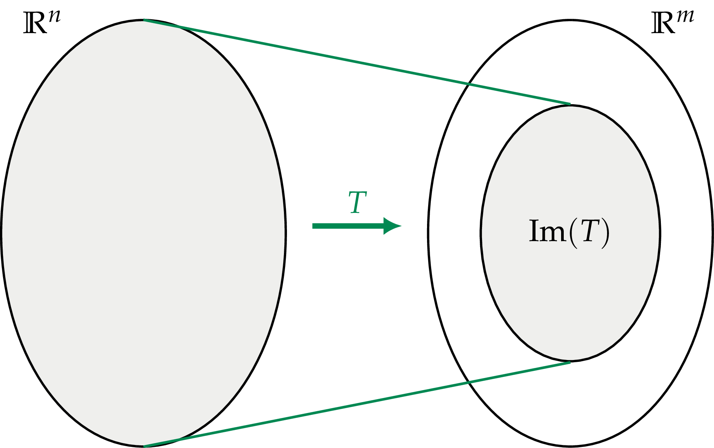
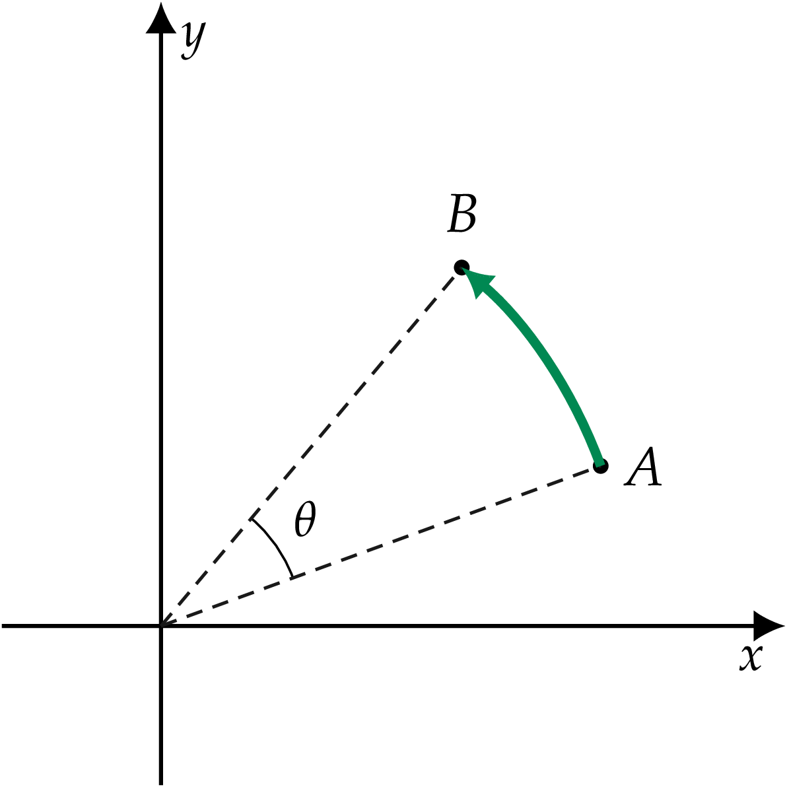

Chapter 5      

#[Chapter 5 Linear transformations](./Chapter 5_ Linear transformations.md)

Linear transformations are a central idea of linear algebra—they form the cornerstone that connects all the seemingly unrelated concepts we’ve studied so far. We previously introduced linear transformations, informally describing them as “vector functions.” In this chapter, we’ll formally define linear transformations, describe their properties, and discuss their applications.

In[Section 5.2](./Chapter 5_ Linear transformations.md), we’ll learn how matrices can be used to _represent_ linear transformations. We’ll show the matrix representations of important types of linear transformations like projections, reflections, and rotations.[Section 5.3](./Chapter 5_ Linear transformations.md) discusses the relation between bases and matrix representations. We’ll learn how the bases chosen for the input and output spaces determine the entries of matrix representations. A single linear transformation can correspond to many different matrix representations, depending on the choice of bases for the input and output spaces.

[Section 5.4](./Chapter 5_ Linear transformations.md) discusses and characterizes the class of _invertible linear transformations_. This section serves to connect several topics we covered previously: linear transformations, matrix representations, and the fundamental subspaces of matrices.

##[5.1 Linear transformations](./Chapter 5_ Linear transformations.md)

Linear transformations take vectors as inputs and produce vectors as outputs. A transformation  that takes \-dimensional vectors as inputs and produces \-dimensional vectors as outputs is denoted .

The class of linear transformations includes most of the useful transformations of analytical geometry: stretchings, projections, reflections, rotations, and combinations of these. Since linear transformations describe and model many real-world phenomena in physics, chemistry, biology, and computer science, learning the theory behind them is worthwhile.

###[Concepts](./Front matter.md)

Linear transformations are mappings between _vector inputs_ and _vector outputs_. The following concepts describe the input and output spaces:

-   : the input vector space of 
-   : the output vector space of 
-   : the dimension of the vector space 
-   : a linear transformation that takes vectors  as inputs and produces vectors  as outputs. The notation  describes  acting on  to produce the output .
    
    
    
    Figure 5.1: An illustration of the linear transformation .
    
-   : the _image space_ of the linear transformation  is the set of vectors that  can output for some input . The mathematical definition of the image space is
    
    
    
    The image space is the vector equivalent of the _image set_ of a single-variable function .
    
-   : the _kernel_ of the linear transformation ; the set of vectors mapped to the zero vector by . The mathematical definition of the kernel is
    
    
    
    The kernel of a linear transformation is the vector equivalent of the roots of a function: .
    
    
    
    Figure 5.2: Two key properties of a linear transformation ; its kernel , and its image space .
    

#####[Example](./Front matter.md)

The linear transformation  is defined by the equation . Applying  to the input vector  produces the output vector . Applying  to the input vector  produces the output vector .

The kernel of  contains only the zero vector . The image space of  is a two-dimensional subspace of the output space , namely .

###[Matrix representations](./Front matter.md)

Given bases for the input and output spaces of a linear transformation , the transformation’s action on vectors can be represented as a matrix-vector product:

-   : a basis for the input vector space 
-   : a basis for the output vector space 
-   : a matrix representation of the linear transformation :
    
    
    
    To be precise, we denote the matrix representation as ![\tensor[_{B_W}]{\left[M_T\right]}{_{B_V}}](../Images/21e22525b5b5e7cd7c60f91b419268473d9a2290.png) to show it depends on the input and output bases.
    
-   : the _column space_ of the matrix 
-   : the _row space_ of the matrix 
-   : the _null space_ the matrix 

###[Properties of linear transformations](./Front matter.md)

We’ll start with the feature of linear transformations that makes them suitable for modelling a wide range of phenomena in science, engineering, business, and computing.

####[Linearity](./Front matter.md)

The fundamental property of linear transformations is—you guessed it—their _linearity_. If  and  are two input vectors and  and  are two constants, then

where  and .

Figure 5.3: A linear transformation  maps the linear combination of inputs  to the linear combination of outputs .

Linear transformations map any linear combination of inputs to the same linear combination of outputs. If you know the outputs of  for the inputs  and , you can deduce the output  for any linear combination of the vectors  and  by computing the appropriate linear combination of the outputs  and . This is perhaps the most important idea in linear algebra: it’s the _linear_ that we refer to when we talk about _linear algebra_. Linear algebra is not about lines, but about mathematical transformations that map linear combinations of inputs to the same linear combinations of outputs.

In this chapter, we’ll study various aspects and properties of linear transformations, the abstract objects that map input vectors to output vectors. The fact that linear transformations map linear combinations of inputs to corresponding linear combinations of outputs will be of central importance in many calculations and proofs. Make a good note and store a mental image of the example shown in[Figure 5.3](./Chapter 5_ Linear transformations.md).

####[Linear transformations as black boxes](./Front matter.md)

Suppose someone gives you a black box that implements the linear transformation . While you can’t look inside the box to see how  acts, you can _probe_ the transformation by choosing various input vectors and observing what comes out.

Assume the linear transformation  is of the form . By probing this transformation with  vectors of a basis for the input space and observing the outputs, you can characterize the transformation  completely.

To see why this is true, consider a basis  for the \-dimensional input space . To characterize , input each of the  basis vectors  into the black box and record the  that comes out. Any input vector  can be written as a linear combination of the basis vectors:

Using these observations and the linearity of , we can predict the output of  for this vector:

This black box model of probing is used in many areas of science and is one of the most important ideas in linear algebra. The transformation  could be the description of a chemical process, an electrical circuit, or some phenomenon in biology. As long as we know that  is (or can be approximated by) a linear transformation, we can describe it completely by probing it with a small number of inputs. This is in contrast to characterizing nonlinear transformations, which correspond to arbitrarily complex input-output relationships and require significantly more probing.

###[Input and output spaces](./Front matter.md)

Consider the linear transformation  from \-vectors to \-vectors:

The _input space_ of the linear transformation  is  and its _output space_ is . The output space is also called the _target space_ and it is similar to the notion of the _target set_ for functions. The input space is identical to the _domain_ of the linear transformation, since  is defined for all inputs .

The _image space_  consists of all possible outputs of the transformation . The image space of a linear transformation is a subset of its output space, . A linear transformation  whose image space is equal to its output space () is called _surjective_ or _onto_.

The _kernel_ of  is the subspace of the domain  that is mapped to the zero vector by : . A linear transformation with an empty kernel  is called _injective_. Injective transformations map different inputs to different outputs.

If a linear transformation  is both injective and surjective, it is called _bijective_. In this case,  is a _one-to-one correspondence_ between the input vector space and the output vector space.

Note the terminology used to characterize linear transformations (injective, surjective, and bijective) is the same as the terminology used to characterize functions in[Section 1.8](./Chapter 1_ Math fundamentals.md). Indeed, we can use the same terminology since linear transformations are functions. The concepts of image space and kernel are illustrated in[Figure 5.4](./Chapter 5_ Linear transformations.md).

       

Figure 5.4: Pictorial representations of the image space  and the kernel  of a linear transformation . The image space is the set of all possible outputs of . The kernel of  is the set of inputs that  maps to the zero vector.

#####[Observation](./Front matter.md)

The dimensions of the input space and the output space of a bijective linear transformation must be the same. Indeed, if  is bijective, then it is both injective and surjective. Since  is surjective, the input space must be at least as large as the output space; . Since  is injective, the output space must be larger or equal to the input space; . Combining these observations, we find that if  is bijective then .

#####[Example 2](./Front matter.md)

Consider the linear transformation  defined by the equation . Find the kernel and the image space of . Is  injective? Is  surjective?

The action of  is to delete the \-components of inputs. Any vector that has only a \-component will be sent to the zero vector. We have . The image space is . The transformation  is not injective. As an explicit example proving  is not injective, observe that  but . Since  is equal to the output space ,  is surjective.

###[Linear transformations as matrix multiplications](./Front matter.md)

An important relationship exists between linear transformations and matrices. If you fix a basis for the input vector space and a basis for the output vector space, a linear transformation  can be represented as matrix multiplication  for some matrix :

Using this equivalence, we can re-interpret several properties of matrices as properties of linear transformations. The equivalence is useful in the other direction too, since it allows us to use the language of linear transformations to talk about the properties of matrices.

The idea of representing the action of a linear transformation as a matrix multiplication is extremely important since it transforms the abstract, mathematical description of the linear transformation  into a concrete, computational one: “take the input vector  and multiply it from the right by the matrix .” Borrowing an idea from the field of software engineering, we can understand the relationship between a linear transformation and its matrix representation as analogous to the relationship between the abstract software specification of a computer program, and the program’s concrete implementation as code that runs on a computer.

#####[Example 3](./Front matter.md)

We’ll now illustrate the “linear transformation  matrix-product” equivalence with an example. Define  to be the _orthogonal projection_ onto the \-plane . In words, the action of this projection is to zero-out the \-component of input vectors. The matrix that corresponds to this projection is

####[Finding the matrix](./Front matter.md)

In order to find the matrix representation of any linear transformation , it is sufficient to probe  with the  vectors in the standard basis for :

To obtain , we combine the outputs , , ,  as the _columns_ of a matrix:

Observe that the matrix constructed in this way has the correct dimensions: . We have  since we used  “probe vectors,” and since the outputs of  are \-dimensional column vectors. To help visualize the column structure of , let’s analyze what happens when we compute the product . The probe vector  “selects” only the second column from ; thus we obtain the correct output: . Similarly, applying  to other basis vectors selects the other columns of .

Any input vector can be written as a linear combination of the standard basis vectors . Therefore, by linearity, we can compute the output  as follows:

![\begin{align*}
T(\vec{v}) &= v_1 T(\hat{e}_1) + v_2 T(\hat{e}_2) + \cdots + v_n T(\hat{e}_n) \\
& = 	v_1\!\begin{bmatrix} \vert \\  T(\hat{e}_1) \\ \vert \end{bmatrix}
+
v_2\!\begin{bmatrix} \vert \\  T(\hat{e}_2) \\ \vert \end{bmatrix}
+ \cdots
+ v_n\!\begin{bmatrix} \vert \\  T(\hat{e}_n) \\ \vert \end{bmatrix} \\
& = 	\begin{bmatrix} 
\vert & \vert &  & \vert \\ 
T(\hat{e}_1) & T(\hat{e}_2) & \cdots & T(\hat{e}_n) \\
\vert & \vert &  & \vert 
\end{bmatrix}
\!\!
\begin{bmatrix} \vert \\  \vec{v} \\ \vert \end{bmatrix} \\
& = M_T [\vec{v}],
\end{align*}](../Images/2c0e48e41680f18b9c88d0af8a8b0861c6baa5e9.png)

where ![[\vec{v}] = (v_1,v_2,\ldots, v_n)^\sfT](../Images/9d9458d13220ecf07f53fc5e51d1ddfb3a743d44.png) is the coordinate vector of , represented as a column vector.

####[Input and output spaces](./Front matter.md)

We can identify correspondences between the properties of a linear transformation  and the properties of a  matrix  that implements .

The outputs of the linear transformation  consist of all possible linear combinations of the columns of the matrix . Thus, the _image space_ of the linear transformation  is equivalent to the _column space_ of the matrix :

There is also an equivalence between the kernel of the linear transformation  and the null space of the matrix :

The null space of a matrix  consists of all vectors that are orthogonal to the rows of the matrix . The vectors in the null space of  have a zero dot product with each of the rows of . This orthogonality can also be phrased in the opposite direction: any vector in the row space  is orthogonal to the null space .

These observations allow us to decompose the domain of the transformation  as the _orthogonal sum_ of the row space and the null space of a matrix :

This split implies the _conservation of dimensions_ formula:

which describes how the sum of the dimensions of the row space and the null space of a matrix  is equal to the total dimensions of the input space.

We can summarize everything we know about the input-output relationship of the linear transformation  as follows:

Input vectors  are mapped to output vectors  in a one-to-one correspondence. Input vectors  are mapped to the zero vector .

####[Composition of linear transformations](./Front matter.md)

The consecutive application of two linear transformations  and  on an input vector  corresponds to the following matrix product:

The matrix  acts on the vector first, followed by the matrix .

For this composition to be well-defined, the dimension of the output space of  must be the same as the dimension of the input space of . This requirement corresponds to the condition that the rows of  and the columns of  must have the same dimension for the product  to exist.

####[Importance of the choice of bases](./Front matter.md)

Above, we assumed the standard basis was used both for inputs and outputs of the linear transformation. Thus, we obtained the entries in the matrix  _with respect to_ the standard basis.

In particular, we assumed that the outputs of  were given as column vectors in terms of the standard basis for . If the outputs were given in some other basis , the entries of the matrix  would have been _with respect to_ .

Due to the dependence of matrix entries on the basis used, **a linear transformation does not correspond to a unique matrix**. Indeed, the same linear transformation  will correspond to different matrices when different bases are used. We say the linear transformation  corresponds to a matrix  for a _given_ choice of input and output bases. We write ![_{B_W}[M_T]_{B_V}](../Images/f77141e8752269c2a401514ac1c4324af8e681b6.png) to show the entries of the matrix  depend on the choice of left and right bases. Recall we can also use the basis-in-a-subscript notation for vectors. For example, writing  shows the components , , and  are expressed in terms of the standard basis .

The choice of basis is an important technical detail: be aware of it, but don’t worry about it too much. Unless otherwise specified, assume the standard basis is used for specifying vectors and matrices. When you see the product , it means ![\!\tensor[_{B_s}]{\left[A\right]}{_{B_s}} [\vec{v}]_{B_s}](../Images/19197accab1e415389f53069c627c7e7c6c04bb6.png). The only time you really need to pay attention to the choice of bases is when performing _change-of-basis_ transformations, which we’ll discuss in[Section 5.3](./Chapter 5_ Linear transformations.md).

###[Invertible transformations](./Front matter.md)

We’ll now revisit the properties of invertible matrices and connect them to the notion of invertible transformations. Think of multiplication by a matrix  as “doing” something to vectors, and multiplication by  as doing the opposite thing, restoring the original vector:

For example, the matrix

corresponds to a stretching of space by a factor of 2 in the \-direction, while the \-direction remains unchanged. The inverse transformation corresponds to a shrinkage by a factor of 2 in the \-direction:

In general, it’s hard to see exactly what the matrix  does, since it performs some arbitrary linear combination of the components of the input vector.

If  is an invertible matrix, we can start from any output vector , and go back to find the input  that produced the output . We do this by multiplying  by the inverse: .

A linear transformation  is _invertible_ if there exists an inverse transformation  such that . By the correspondence , we can identify the class of invertible linear transformations with the class of invertible matrices. A linear transformation  is invertible if and only if its matrix representation  is an invertible matrix.

###[Affine transformations](./Front matter.md)

An _affine transformation_ is a function  that is the combination of a linear transformation  followed by a _translation_ by a fixed vector :

By the  equivalence, we can write the formula for an affine transformation as

To obtain the output , apply the linear transformation  (the matrix-vector product ), then add the vector . This is the vector generalization of a single-variable _affine function_ .

###[Discussion](./Front matter.md)

####[The most general linear transformation](./Front matter.md)

In this section we learned that a linear transformation _can_ be represented as matrix multiplication. Are there other ways to represent linear transformations? To study this question, let’s analyze the most general form a linear transformation  can take. We’ll use  and  to keep things simple.

First consider the component  of the output vector  when the input vector is . The fact that  is linear means that  can be an arbitrary mixture of the input vector components :

Similarly, the component  must be some arbitrary linear combination of the input components . Thus, the most general linear transformation  can be written as

This is precisely the kind of expression that can be obtained as a matrix product:

Indeed, matrix multiplication is defined as rows-times-columns because it allows us to easily describe linear transformations.

###[Links](./Front matter.md)

\[ Examples of linear transformations from Wikibooks \]

[`http://wikibooks.org/wiki/Linear_Algebra/Linear_Transformations`](./Linear_Transformations.md)

\[ Linear transformations and matrices explained by 3Blue1Brown \]

[`https://youtube.com/watch?v=kYB8IZa5AuE`](./watch_v=kYB8IZa5AuE.md)

\[ Three-dimensional transformations explained by 3Blue1Brown \]

[`https://youtube.com/watch?v=rHLEWRxRGiM`](./watch_v=rHLEWRxRGiM.md)

\[ Nonsquare matrices explained by 3Blue1Brown \]

[`https://youtube.com/watch?v=v8VSDg_WQlA`](./watch_v=v8VSDg_WQlA.md)

###[Exercises](./Front matter.md)

E5.1 Determine whether the following transformations are linear.

1.         
2.  
3.         
4.  

If the transformation is linear, find its matrix representation. If the transformation is nonlinear, show an example where linearity fails.

E5.2 Consider the transformation . Find the input space, the output space, the kernel, and the image of the linear transformation . Is  injective, surjective, or bijective?

E5.3 Consider the matrix  and the linear transformations  and  defined through left and right multiplication by :  and . Find the input, output, kernel, and image spaces of the linear transformations  and .

E5.4 What linear transformation  takes the vector  to the vector , and the vector  to the vector ? Express your answer as a function  and as a matrix .

##[5.2 Finding matrix representations](./Chapter 5_ Linear transformations.md)

Every linear transformation  can be represented as a matrix . Suppose you’re given the following description of a linear transformation: “ is the counterclockwise rotation of all points in the \-plane by ,” and you want to find the matrix  that corresponds to this transformation.

Do you know how to find the matrix representation of ? This section describes a simple and intuitive probing procedure for finding matrix representations. Don’t worry; no alien technology is involved, and we won’t be probing any humans—only linear transformations! As you read, try to bridge your understanding between the abstract, mathematical specification of a transformation  and its concrete implementation as a matrix-vector product . We’ll use the probing procedure to study various linear transformations and derive their matrix representations.

Once we find the matrix representation of a given transformation, we can efficiently apply that transformation to many vectors. This is exactly how computers carry out linear transformations. For example, a black-and-white image file can be represented as a long list that contains the coordinates of the image’s black pixels: . The image is obtained by starting with a white background and drawing a black pixel in each of the locations  on the screen[1](./Front matter.md) To rotate the image, we can process the list of pixels using the matrix-vector product , where  is the matrix representation of the desired rotation. The transformed list of pixels  corresponds to a rotated version of the image. This is essentially the effect of using the “rotate tool” in an image editing program—the computer multiplies the image by a rotation matrix.

###[Concepts](./Front matter.md)

The previous section covered linear transformations and their matrix representations:

-   : a linear transformation that takes inputs in  and produces outputs in 
    
-   : the matrix representation of 

The action of the linear transformation  is equivalent to multiplication by the matrix :

###[Theory](./Front matter.md)

To find the matrix representation of the transformation , it is sufficient to probe  with the  vectors of the standard basis for the input space :

The matrix  that corresponds to the action of  on the standard basis is

This is an  matrix whose columns are the outputs of  for the  probe inputs.

The remainder of this section illustrates the probing procedure for finding matrix representations of linear transformations.

###[Projections](./Front matter.md)

We’ll start with a class of linear transformations you’re already familiar with: _projections_. I hope you still remember what you learned in[Section 4.2](./Chapter 4_ Geometric aspects of linear algebra.md) (page 4.2).

####[X projection](./Front matter.md)

The projection onto the \-axis is denoted . The projection  acts on any vector or point by leaving the \-component unchanged and setting the \-component to zero. The action of  on two sample points is illustrated in[Figure 5.5](./Chapter 5_ Linear transformations.md).

Figure 5.5: The projection  takes all points to the \-axis.

Let’s analyze how the projection  transforms the two vectors of the standard basis:

The action of  on the basis  is to leave it unchanged. The action of  on the basis  is to send it to the zero vector.

The matrix representation of  is therefore given by:

####[Y projection](./Front matter.md)

Similar to ,  is defined as the projection onto the \-axis. The action of  on two sample points is illustrated in[Figure 5.6](./Chapter 5_ Linear transformations.md). Can you guess what the matrix for the projection onto the \-axis will look like?

Figure 5.6: The projection  takes all points to the \-axis.

Use the standard approach to find the matrix representation of :

The first column of the matrix representation  contains the zero vector since . The second column of  contains  since .

We can verify that the matrices  and  do indeed select the appropriate components from a general input vector :

####[Projection onto a vector](./Front matter.md)

Recall that the general formula for the projection of a vector  onto another vector  is obtained as:

To find the matrix representation of a projection onto an arbitrary direction , we compute

####[Projection onto a plane](./Front matter.md)

We can also compute the projection of the vector  onto the plane  as follows:

How should we interpret the above formula? First compute the part of the vector  that is perpendicular to the plane (in the  direction); then subtract this part from  to obtain the part that lies in the plane.

To obtain the matrix representation of , calculate what  does to the vectors in the standard basis , , and .

####[Projections as outer products](./Front matter.md)

We can obtain the projection matrix onto any unit vector by computing the _outer product_ of the vector with itself. As an example, we’ll find the matrix for the projection onto the \-axis . Recall the _inner product_ (dot product) between two column vectors  and  is equivalent to the matrix product , while the _outer product_ is given by the matrix product . The inner product is a product between a  matrix and an  matrix, whose result is a  matrix—a single number. The outer product corresponds to an  matrix times a  matrix, making the answer an  matrix. The projection matrix corresponding to  is .

Where did that equation come from? To derive the equation, we use the commutative law of scalar multiplication , rewrite the dot product as a matrix product , and use the _associative_ law of matrix multiplication . Check it out:

![\begin{align*}
\Pi_x(\vec{v}) =
(\hat{\imath}\cdot\vec{v})\:\hat{\imath}
=
\hat{\imath} (\hat{\imath}\cdot\vec{v})
& =
\hat{\imath} (\hat{\imath}^\sfT \vec{v} )
=
\begin{bmatrix}
1 \\
0 
\end{bmatrix}
\!
\left(
\begin{bmatrix}
1 & 	0	
\end{bmatrix}
\!\!
\begin{bmatrix}
v_x \\
v_y 
\end{bmatrix}
\right) \\
& =
\left(\hat{\imath} \hat{\imath}^\sfT\right)  \vec{v} 
=
\left(
\begin{bmatrix}
1 \\
0 
\end{bmatrix}
\!\!
\begin{bmatrix}
1 & 	0	
\end{bmatrix}
\right)
\begin{bmatrix}
v_x \\
v_y 
\end{bmatrix} \\
& =
\left(M \right)  \vec{v} 
=
\begin{bmatrix}
1 & 0  \\
0 & 0 
\end{bmatrix}
\!\!
\begin{bmatrix}
v_x \\
v_y 
\end{bmatrix}
=
\begin{bmatrix}
v_x \\
0 
\end{bmatrix}\!.
\end{align*}](./images/f9a1cc5e92ccaf29a3ac65734f812558f913c265.png)

The outer product  corresponds to the projection matrix  we’re looking for.

More generally, we obtain the projection matrix onto a line with direction vector  by constructing the unit vector , and then calculating the outer product of  with itself:

#####[Example](./Front matter.md)

Find the matrix representation  for the projection  onto the \-diagonal line with equation .

The line with equation  corresponds to the parametric equation , so the direction vector for this line is . We want to find the matrix that corresponds to the linear transformation .

The projection matrix onto  is computed using the outer product approach. First, compute a normalized direction vector ; then compute  using the outer product:

Usually, the idea of representing projections as outer products is not covered in a first linear algebra course, so don’t worry about outer products appearing on the exam. The purpose of introducing you to the equivalence between projections onto  and the outer product  is to illuminate this interesting connection between vectors and matrices. This connection plays a fundamental role in quantum mechanics, where projections in different directions are frequently used.

If you’re asked a matrix representation question on an exam, keep things simple and stick to the “probing with the standard basis” approach, which gives the same answer as the one computed using the outer product:

####[Projections are idempotent](./Front matter.md)

A projection matrix  satisfies . This is one of the defining properties of projections. The technical term for this is _idempotence_, meaning the operation can be applied multiple times without changing the result beyond the initial application.

####[Subspaces](./Front matter.md)

A projection acts differently on different sets of input vectors. While some input vectors remain unchanged, other input vectors are “killed.” This is murder! Well, murder in a mathematical sense, which means multiplication by zero.

Let  be the projection onto the space , and  be the _orthogonal complement_ to  defined by . The action of  is completely different for the vectors from  and . All vectors  in  remain unchanged,

whereas vectors  in  are killed,

The action of  on any vector from  is equivalent to multiplication by zero. This is why  is called the _null space_ of .

###[Reflections](./Front matter.md)

We’ll now compute matrix representations for simple _reflection_ transformations.

####[X reflection](./Front matter.md)

Reflection through the \-axis leaves the \-component unchanged and flips the sign of the \-component.[Figure 5.7](./Chapter 5_ Linear transformations.md) illustrates the effect of reflecting two points through the \-axis.

Figure 5.7: The reflection through the \-axis sends every point  in the plane to its mirror point  on the other side of the \-axis.

Using the usual probing procedure, we obtain the matrix that corresponds to this linear transformation:

This matrix sends  to  as expected for a reflection through the \-axis.

####[Y reflection](./Front matter.md)

The matrix associated with , the reflection through the \-axis, is given by:

The numbers in the above matrix tell us to change the sign of the \-component of the input and leave its \-component unchanged. In other words, every point that starts to the left of the \-axis moves to the right of the \-axis, and every point that starts to the right of the \-axis moves to the left.

Figure 5.8: The reflection through the \-axis flips the \-component of every point in the plane.

Do you see the power and simplicity of the probing procedure for finding matrix representations? In the first column, enter what you want to happen to the  vector; in the second column, enter what you want to happen to the  vector, and voila!

####[Diagonal reflection](./Front matter.md)

Suppose we want to find the formula for the reflection through the line . We’ll call this reflection . This time, dear readers, it’s up to you to draw the diagram. In words,  is the transformation that makes  and  “swap places.”

Based on this notion of swapping places, the matrix for  is

Alternatively, the usual probing procedure leads us to the same result.

Now I must point out an important property common to all reflections. The effect of a reflection is described by one of two possible actions: some points remain unchanged by the reflection, while other points flip into their exact negatives. For example, the _invariant_ points under  are the points that lie on the \-axis—that is, the multiples of . The points that become their _exact negatives_ are those with only an \-component—the multiples of . The action of  on all other points can be obtained as a linear combination of the actions “do not change” and “multiply by .” We’ll continue this line of reasoning further at the end of this section, and again in[Section 6.1](./Chapter 6_ Theoretical linear algebra.md).

####[Reflections through lines and planes](./Front matter.md)

What about finding reflections through arbitrary lines and planes? We can leverage the formulas for projections onto lines and planes we saw earlier to obtain formulas for reflections through any line or plane that passes through the origin.

Consider the line with parametric equation . The formula for the reflection of any vector  through the line  is

where  is the projection of  onto the vector .

The vector diagram in[Figure 5.9](./Chapter 5_ Linear transformations.md) illustrates the reflection formula. Annotating the figure with a pencil can help you visualize how the formula works. Draw the vector  followed by the vector  and confirm that  results in the vector .

Figure 5.9: The reflection of the vector  through the line  is computed using the formula .

We can derive two equivalent formulas for computing the reflection of the vector  through the plane  defined by the equation :

The first formula uses a reasoning similar to the formula for the reflection through a line. The second formula can be understood as computing the projection of  in the direction of the normal vector, , subtracting that vector once from  to reach a point in the plane, and subtracting it a second time to move to the point  on the other side of the plane. See[Figure 5.10](./Chapter 5_ Linear transformations.md) for the illustration.

Figure 5.10: The reflection of the vector  through the plane  with normal vector  is computed by starting with  and subtracting twice the projection of  in the direction of the normal: .

###[Rotations](./Front matter.md)

We’ll now find the matrix representations for _rotation_ transformations. The counterclockwise rotation by the angle  is denoted .[Figure 5.11](./Chapter 5_ Linear transformations.md) illustrates the action of the rotation : the point  is rotated around the origin to become the point .

 

Figure 5.11: The linear transformation  rotates every point in the plane by the angle  in the counterclockwise direction. Note the effect of  on the basis vectors  and .

To find the matrix representation of , probe it with the standard basis as usual:

To compute the values in the first column, observe that  rotates the vector  to the vector . The second input  is rotated to . Therefore, the matrix for  is

Finding the matrix representation of a linear transformation is like a colouring-book activity for mathematicians. Filling in the columns is just like colouring inside the lines—nothing too complicated.

###[Inverses](./Front matter.md)

Can you determine the inverse matrix of ? You could use the formula for finding the inverse of a  matrix, _or_ you could use the ![[ \: A \: |\; I \;]](../Images/85c2d240f85887a06fb4a22d6b859577f7c63c49.png)\-and-RREF algorithm for finding the inverse; but using either of these approaches would be _waaaaay_ too much work. Try to guess the matrix representation of the inverse without doing any calculations. If  rotates points by , can you tell me what the inverse operation does? I’ll leave a blank line here to give you some time to think….

Think you have it? The inverse operation of  is , a rotation by , which corresponds to the matrix

Recall that  is an even function, so , while  is an odd function, so .

For any vector  we have ; or in terms of matrices,

Cool, right? This is what _representation_ really means: the abstract notion of composition of linear transformations is _represented_ as a matrix product.

Here’s another quiz question: what is the inverse operation of the reflection through the \-axis ? The “undo” action for  is to apply  again. We say  is a self-inverse operation.

What is the inverse matrix of a projection ? Good luck finding that one—it’s a trick question. The projection  sends all input vectors from the subspace  to the zero vector. Projections are inherently many-to-one transformations and therefore not invertible.

###[Nonstandard-basis probing](./Front matter.md)

At this point, you should feel confident facing any linear transformation  and probing it with the standard basis to find its matrix representation . But what if you’re not allowed to probe  with the standard basis? Instead, let’s say you must find the matrix of the transformation given the outputs of  for some other basis :

Let’s test this idea. We’re given the information , and , and must find the matrix representation of  with respect to the standard basis.

Because the vectors  and  form a basis, we can reconstruct the information about the matrix  from the input-output information given. We’re looking for four unknowns—, , , and — that form the matrix representation of :

We can write four equations with the input-output information provided:

Since there are four equations and four unknowns, we can solve for the coefficients , , , and .

This system of equations differs from ones we’ve seen before, so we’ll examine it in detail. Think of the entries of  as a  vector of unknowns . We can rewrite the four equations as a matrix equation:

Next, solve for  by computing .

Finding the matrix representation by probing with a nonstandard basis is more work than probing with the standard basis, but it’s totally doable.

###[Eigenspaces](./Front matter.md)

Probing the transformation  with _any_ basis for the input space gives sufficient information to determine its matrix representation. We’re free to choose the “probing basis,” so how do we decide which basis to use? The standard basis is good for computing the matrix representation, but perhaps there’s a basis that allows us to simplify the abstract description of ; a so-called _natural_ basis for probing each transformation.

Indeed, such a basis exists. Many linear transformations have a basis  such that the action of  on the basis vector  is equivalent to the scaling of  by the constant :

Recall how projections leave some vectors unchanged (multiply by ) and send other vectors to the zero vector (multiply by ). These subspaces of the input space are specific to each transformation, and are called the _eigenspaces_ (from the German “own spaces”) of the transformation .

Consider the reflection  and its two eigenspaces:

-   The space of vectors that remain unchanged (the eigenspace corresponding to ) is spanned by the vector :
    
    
    
-   The space of vectors that become the exact negatives of themselves (corresponding to ) is spanned by :
    
    
    

From a theoretical point of view, describing the action of a liner transformation  in its natural basis is the best way to understand it. For each of the _eigenvectors_ in the various eigenspaces of , the action of  is a simple scalar multiplication. We defer the detailed discussion on _eigenvalues_ and _eigenvectors_ until the next chapter.

###[Links](./Front matter.md)

\[ Rotation operation as the composition of three shear operations \]

[`http://datagenetics.com/blog/august32013/index.html`](./index.md)

###[Exercises](./Front matter.md)

E5.5 Find the matrix representation of the linear transformations: the rotation by  radians , and the rotation by  radians . Verify the equation  by computing the product of the matrix representations.

The trigonometric identities from[Section 1.12](./Chapter 1_ Math fundamentals.md) might be helpful.

E5.6 Find the matrix representation of the projection   that projects vectors onto the subspace spanned by the direction vector .

Compute the unit vector , then use the outer product formula.

##[5.3 Change of basis for matrices](./Chapter 5_ Linear transformations.md)

Every linear transformation  can be represented as a matrix . The entries of the matrix  depend on the basis used to describe the input and output spaces. Note, this dependence of matrix entries on the basis is directly analogous to the dependence of vector coordinates on the basis.

In this section, we’ll learn how the choice of basis affects the entries of matrix representations, and discuss how to carry out the change-of-basis operation for matrices.

###[Concepts](./Front matter.md)

You should already be familiar with the concepts of vector spaces, bases, vector coordinates with respect to different bases, and the change-of-basis transformation:

-   : an \-dimensional vector space
-   : a vector in 
-   : an orthonormal basis for 
-   ![\left[\vec{v} \right]_{B}=(v_1, v_2, \ldots, v_n)_{B}](../Images/1d2d4efed865758c4439a744272106d7293ae64b.png): the vector  expressed in the basis 
-   : another orthonormal basis for 
-   ![[\vec{v}]_{B^\prime}=(v^\prime_1, v^\prime_2, \ldots, v^\prime_n)_{B^\prime}](../Images/c933d43adc9042c63f65c64b1bf50b24808d6d3b.png): the vector  expressed in the basis 
-   ![\!\tensor[_{B^\prime}]{\left[\mathbbm{1}\right]}{_{B}}](../Images/b3068d47a22daef194cb14735750ffa22f484a70.png): the change-of-basis matrix that converts from  coordinates to  coordinates, ![[\vec{v}]_{B^\prime} = \tensor[_{B^\prime}]{\left[\mathbbm{1}\right]}{_{B}}\,[\vec{v}]_{B}](../Images/f1c32ab9c513e7c6ac32d1ad4a9b2d10b40416a0.png)
-   ![\!\tensor[_{B}]{\left[\mathbbm{1}\right]}{_{B^\prime}}](../Images/17cc63d61cf74f9d91e01962ea51c62dc63ad57f.png): the inverse change-of-basis matrix ![[\vec{v}]_{B} = \tensor[_{B}]{\left[\mathbbm{1}\right]}{_{B^\prime}}\,[\vec{v}]_{B^\prime}](../Images/22bf3a6dca137eefd52b975862c1e64e1cf54cf0.png) (note that ![\!\tensor[_{B}]{\left[\mathbbm{1}\right]}{_{B^\prime}} = \left(\!	\tensor[_{B^\prime}]{\left[\mathbbm{1}\right]}{_{B}} \!\,\right)^{-1}](../Images/29fdc1749faeac53388f1e40c5ca71940959a6e9.png))

We’ll use the following concepts when describing a linear transformation :

-   : a basis for the input vector space 
-   : a basis for the output vector space 
-   ![\!\tensor[_{B_W}]{\left[M_T\right]}{_{B_V}} \in \mathbb{R}^{m\times n}](../Images/2e63f8bcee5de1be1728f10858cf7438a09374de.png): a matrix representation of the linear transformation  with respect to the bases  and ,
    
    ![\vec{w} = T(\vec{v})  
    \; \;  \qquad \Leftrightarrow \qquad  \; \; 
    \tensor{[\vec{w}]}{_{B_W}} = \tensor[_{B_W}]{\left[M_T\right]}{_{B_V}} \tensor{[\vec{v}]}{_{B_V}}](../Images/fb0aaa72d5f733307a61ebdee6faa0f1120ba3fb.png)
    

By far, the most commonly used basis in linear algebra is the standard basis , , etc. It is therefore customary to denote the matrix representation of a linear transformation  simply as , without an explicit reference to the input and output bases. This simplified notation causes much confusion when students later try to learn about change-of-basis operations.

In order to _really_ understand the connection between linear transformations and their matrix representations, we need to have a little talk about bases and matrix entries. It’s a little complicated, but the mental effort you invest is worth the overall understanding you’ll gain. As the old Samurai saying goes, “Cry during training, laugh on the battlefield.”

By the end of this section, you’ll be able to handle any basis question your teacher may throw at you.

###[Matrix entries](./Front matter.md)

Every linear transformation  can be represented as a matrix . Consider the linear transformation . Assume the input vector space  is \-dimensional and let  be a basis for . Assume the output space  is \-dimensional and let  be a basis for output space of . The entries of the matrix  depend on the bases  and . We’ll now analyze this dependence in detail.

To compute the matrix representation of  with respect to the input basis , we probe  with each of the vectors in the basis and record the outputs as the columns of a matrix:

![\tensor{\left[M_T\right]}{_{B_V}}
=
\begin{bmatrix}
\vert & \vert &  & \vert \\
T(\hat{e}_1) & T(\hat{e}_2) & \cdots & T(\hat{e}_n) \\
\vert & \vert &  & \vert 
\end{bmatrix}_{\!B_V}.](../Images/8348848e2f67ca686edfe175de759daa5327fadc.png)

The subscript  indicates the columns are built from outputs of the basis . We can use the matrix ![\tensor{\left[M_T\right]}{_{B_V}}](../Images/a794d511390dc656a4019b80d9e72d0597cf7a49.png) to compute  for a vector  expressed in the basis : . The matrix-vector product produces the correct linear combination of outputs:

![\begin{align*} 
\tensor{\left[M_T\right]}{_{B_V}} \tensor{\left[\vec{v}\right]}{_{B_V}} 
&=    \begin{bmatrix}
\vert & \vert &  & \vert \\
T(\hat{e}_1) & T(\hat{e}_2) & \cdots & T(\hat{e}_n) \\
\vert & \vert &  & \vert
\end{bmatrix}_{\!B_V}
\!\!
\begin{bmatrix}
v_1 \\ v_2 \\ \vdots \\ v_n 
\end{bmatrix}_{\!B_V} 								\\
& = v_1T(\hat{e}_1) + v_2T(\hat{e}_2) + \cdots + v_nT(\hat{e}_n) 	\\
&=  T(v_1\hat{e}_1 + v_2\hat{e}_2 + \cdots + v_n\hat{e}_n)		\\
& = T(\vec{v}).
\end{align*}](../Images/bdfe9c2e788d3220296bcfa625bbf018ee0c506c.png)

So far we’ve treated the outputs of  as abstract vectors . Like all vectors in the space , each output of  can be expressed as a vector of components with respect to the basis . For example, the output  can be expressed as

for some coefficients . Similarly, the other output vectors  can be expressed as components with respect to the basis , .

We’re now in a position to find the matrix representation ![\!\tensor[_{B_W}]{\left[M_T\right]}{_{B_V}}](../Images/3401dfce825d454c6a48a24f481b72575d31d13a.png) of the linear transformation , with respect to the input basis  and the output basis :

![\; \tensor[_{B_W}]{\left[M_T\right]}{_{B_V}}
=
\tensor[_{B_W}]{
\begin{bmatrix}
c_{11} & c_{12} & \cdots 	& c_{1n}	\\
c_{21} & c_{22} & \cdots 	& c_{2n}	\\
\vdots &		 & 		& \vdots 	\\
c_{m1} & c_{m2} & \cdots 	& c_{mn}	\\
\end{bmatrix}
}{_{B_V}}
\; 
\in \mathbb{R}^{m \times n}.](../Images/16234553160b3ee6dcf5d56b6e2dff9a67029b30.png)

The action of  on a vector  is the same as the product of ![\!\tensor[_{B_W}]{\left[M_T\right]}{_{B_V}}](../Images/3401dfce825d454c6a48a24f481b72575d31d13a.png) and the vector of components ![\tensor{\left[\vec{v}\right]}{_{B_V}}=(v_1,v_2,\ldots,v_n)^\sfT_{B_V}](../Images/84a0b8b4f0571b192b3b694614cec5baebf036cc.png):

![\left[ T(\vec{v})\right]_{B_W} 
= \tensor[_{B_W}]{\left[M_T\right]}{_{B_V}}
\tensor{\left[\vec{v}\right]}{_{B_V}}.](../Images/7b86678811a56cdb2d662aa6a468278cfc24ec52.png)

You may feel this example has stretched the limits of your attention span, but bear in mind, these nitty-gritty details hold the meaning of matrix entries. If you can see how the _positions_ of the entries in the matrix encode the information about  and the choice of bases  and , you’re well on your way to getting it. The entry  in the th row and th column in the matrix ![\!\tensor[_{B_W}]{\left[M_T\right]}{_{B_V}}](../Images/3401dfce825d454c6a48a24f481b72575d31d13a.png) is the th component (with respect to ) of the output of  when the input is .

Let’s verify that the matrix representation ![\!\tensor[_{B_W}]{\left[M_T\right]}{_{B_V}}](../Images/3401dfce825d454c6a48a24f481b72575d31d13a.png) correctly predicts the output of  for the input . Using the linearity of , we know the correct output is . We can verify that the matrix-vector product ![\!\tensor[_{B_W}]{\left[M_T\right]}{_{B_V}} \tensor{\left[\vec{v}\right]}{_{B_V}}](../Images/d42f370ffe9567b3580cb9a4d0b35777698786c2.png) leads to the same answer:

###[Change of basis for matrices](./Front matter.md)

Given the matrix representation ![\!\tensor[_{B_W}]{\left[M_T\right]}{_{B_V}}](../Images/3401dfce825d454c6a48a24f481b72575d31d13a.png) of the linear transformation , you’re asked to find the matrix representation of  with respect to different bases  and . This is the _change-of-basis_ task for matrices.

We’ll discuss the important special case where the input space and the output space of the linear transformation are the same. Let  be a linear transformation, and let  and  be two bases for the vector space .

Recall the change-of-basis matrix ![\!\tensor[_{B^\prime}]{\left[\mathbbm{1}\right]}{_{B}}](../Images/b3068d47a22daef194cb14735750ffa22f484a70.png) that converts vectors from  coordinates to  coordinates, and its inverse ![\tensor[_{B}]{\left[\mathbbm{1}\right]}{_{B^\prime}}](../Images/1a734635c91bfad2c510fd7637a4502e2ac1ea24.png), which converts vectors from  coordinates to  coordinates:

![\tensor{\left[\vec{v}\right]}{_{B^\prime}} 
= 	\tensor[_{B^\prime}]{\left[\mathbbm{1}\right]}{_{B}} \!
\tensor{\left[\vec{v}\right]}{_{B}}
\qquad \; \textrm{and} \qquad \; 
\tensor{\left[\vec{v}\right]}{_{B}} 
= 	\tensor[_{B}]{\left[\mathbbm{1}\right]}{_{B^\prime}} \!
\tensor{\left[\vec{v}\right]}{_{B^\prime}}.](../Images/267982d0d627415f56d720deed4e034f2ec596f0.png)

A clarification of notation is in order. The change-of-basis matrix ![\!\tensor[_{B^\prime}]{\left[\mathbbm{1}\right]}{_{B}}](../Images/b3068d47a22daef194cb14735750ffa22f484a70.png) is not equal to the identity matrix . However, the change-of-basis operation is _logically_ equivalent to an identity transformation: the vector  doesn’t change—only its coordinates change. If you don’t remember the change-of-basis operation for vectors, now’s the time to flip back to[Section 4.3.7](./Chapter 4_ Geometric aspects of linear algebra.md) (page 4.3.7) and review before continuing.

Given the matrix representation ![\tensor[_{B}]{\left[M_T\right]}{_{B}}](../Images/d08ccfc9e7da7d58678ca11fb56ad98e9a123121.png) of the linear transformation  with respect to , we want to find the matrix ![\tensor[_{B^\prime}]{\left[M_T\right]}{_{B^\prime}}](../Images/719ea1111f36bb97d59e253e5debcc3eba220a9d.png), which is the representation of  with respect to the basis . The computation is straightforward. Perform the change-of-basis operation on the input and output vectors:

![\tensor[_{B^\prime}]{\left[M_T\right]}{_{B^\prime}}  \;  
=  \;	\tensor[_{B^\prime}]{\left[\mathbbm{1}\right]}{_{B}} \!
\tensor[_{B}]{\left[M_T\right]}{_{B}}  \!
\tensor[_{B}]{\left[\mathbbm{1}\right]}{_{B^\prime}}.](../Images/d3666b95505d29cab8f80e45cc62c0c18f421307.png)

This group of three matrices is interpreted as follows. Imagine an input vector ![[\vec{v}]_{B^\prime}](../Images/b64d5488c31ca6787f2c25d5a6133d547784e921.png) multiplying the three matrices ![\!\tensor[_{B^\prime}]{\left[\mathbbm{1}\right]}{_{B}} \!
\tensor[_{B}]{\left[M_T\right]}{_{B}}  \!
\tensor[_{B}]{\left[\mathbbm{1}\right]}{_{B^\prime}}](../Images/a8caaf7bfbaff9c009e51628b004bc57010f5f6f.png) from the right. In the first step, ![\tensor[_{B}]{\left[\mathbbm{1}\right]}{_{B^\prime}}](../Images/1a734635c91bfad2c510fd7637a4502e2ac1ea24.png) converts the vector from the basis  to the basis  so the matrix ![\!\tensor[_{B}]{\left[M_T\right]}{_{B}}](../Images/329ad4eabeb8473cdcee59b31d00979c34052824.png) can be applied. In the last step, the matrix ![_{B^\prime}[\mathbbm{1}]_{B}](../Images/22118f361c19dc13119fb50488d1ef14c2a13bed.png) converts the output of ![\!\tensor[_{B}]{\left[M_T\right]}{_{B}}](../Images/329ad4eabeb8473cdcee59b31d00979c34052824.png) to the basis . The combined effect of multiplying by this specific arrangement of three matrices is the same as applying  to the input vector :

![\tensor[_{B^\prime}]{\left[\mathbbm{1}\right]}{_{B}} \!
\tensor[_{B}]{\left[M_T\right]}{_{B}}  \!
\tensor[_{B}]{\left[\mathbbm{1}\right]}{_{B^\prime}}
\! \tensor{\left[\vec{v}\right]}{_{B^\prime}}		
=  \tensor{\left[T(\vec{v})\right]}{_{B^\prime}},](../Images/3d42b1b9a1176b4ac1ad80f13b31ce59c74ef791.png)

which means

![\tensor[_{B^\prime}]{\left[M_T\right]}{_{B^\prime}}
=
\tensor[_{B^\prime}]{\left[\mathbbm{1}\right]}{_{B}} \!
\tensor[_{B}]{\left[M_T\right]}{_{B}}  \!
\tensor[_{B}]{\left[\mathbbm{1}\right]}{_{B^\prime}}.](../Images/b4b0e4fafba1f0775f45aac5746f8d9958d983ab.png)

This formula makes sense intuitively: to obtain a matrix with respect to a different basis, we must surround it by appropriate change-of-basis matrices.

Note the touching dimensions of the matrices are expressed with respect to the same basis. Indeed, we can think of the change-of-basis matrices as adaptors we use to express vectors in different bases. The change-of-basis operation for matrices requires two adaptors; one for the input space and one for the output space.

###[Similarity transformation](./Front matter.md)

It’s interesting to note the abstract mathematical properties of the operation used above. Consider any matrix  and an invertible matrix . Define  to be the result when  is multiplied by  on the left and by the inverse  on the right:

We say matrices  and  are related by a _similarity transformation_.

Since the matrix  is invertible, its columns form a basis for the vector space . Thus, we can interpret  as a _change-of-basis_ matrix that converts the standard basis to the basis of the columns of . The matrix  corresponds to the inverse change-of-basis matrix. Using this interpretation, the matrix  corresponds to the _same_ linear transformation as the matrix , but is expressed with respect to the basis .

Similarity transformations preserve certain properties of matrices:

-   Trace: 
-   Determinant: 
-   Rank: 
-   Eigenvalues: 

Together, the trace, the determinant, the rank, and the eigenvalues of a matrix are known as the invariant properties of the matrix because they don’t depend on the choice of basis.

###[Exercises](./Front matter.md)

E5.7 Suppose you’re given the matrix representation of a linear transformation  with respect to the basis : ![\!\tensor[_{B^\prime}]{\left[M_T\right]}{_{B^\prime}}](../Images/f461417616d8a82b56141ceb0376ca0af92e32dd.png). What formula describes the matrix representation of  with respect to the basis ?

E5.8 Consider the linear transformation , which represents a stretching by a factor of three along the \-axis. Find the matrix representation of  with respect to the following bases.

1.  The standard basis 
2.  The flipped basis 
3.  The diagonal basis 

E5.9 You asked your lab assistant to compute the outputs of a list of vectors  when passed through the linear transformation . You specified the vectors in the basis . Unfortunately, your lab assistant made a mistake and used a different basis , applying the matrix ![\tensor[_{B^\prime}]{\left[M_T\right]}{_{B^\prime}}](../Images/719ea1111f36bb97d59e253e5debcc3eba220a9d.png) to the vectors, and obtaining the wrong outputs ![\tensor{\left[ \vec{y}^{\textrm{w}}_i \right]}{_{*}} = \!
\tensor[_{B^\prime}]{\left[M_T\right]}{_{B^\prime}}
\tensor{\left[\vec{x}_i\right]}{_{B}}](../Images/6c413dd89297edd22e4af7ed9a2cbff22daa97fa.png). To make things worse, your assistant deleted the original data ! “No worries,” you say. “Since the linear transformation  is invertible, we can recover the data.” What sequence of operations will recover  from ![\tensor{\left[ \vec{y}^{\textrm{w}}_i \right]}{_{*}}](../Images/4bf7656e9b1a8b5404ac13d866fa1bbd767490d6.png)? What sequence of operations will convert ![\tensor{\left[ \vec{y}^{\textrm{w}}_i \right]}{_{*}}](../Images/4bf7656e9b1a8b5404ac13d866fa1bbd767490d6.png) into the correct output ![\tensor{\left[ \vec{y}_i \right]}{_{B}}](../Images/3b58aa2d31215bbae4fdeab5927a35fc5875cdcb.png)?

##[5.4 Invertible matrix theorem](./Chapter 5_ Linear transformations.md)

So far, we discussed systems of linear equations, matrices, vector spaces, and linear transformations. It’s time to tie it all together! We’ll now explore connections between these different contexts where matrices are used. Originally, we saw how matrices can be used to solve systems of linear equations. Later, we studied geometric properties of matrices, including their row spaces, column spaces, and null spaces. We also learned about the connection between matrices and linear transformations. In each of these domains, _invertible_ matrices play a particularly important role. Lucky for us, there’s a theorem that summarizes 10 important facts about invertible matrices. One theorem; 10 facts. Now that’s a good deal!

\[Invertible matrix theorem\]

For an  matrix , the following statements are equivalent:

1.   is invertible
2.  The equation  has exactly one solution for each 
3.  The null space of  contains only the zero vector 
4.  The equation  has only the trivial solution 
5.  The columns of  form a basis for :
    -   The columns of  are linearly independent
    -   The columns of  span ; 
6.  The rank of the matrix  is 
7.  The RREF of  is the  identity matrix 
8.  The transpose matrix  is invertible
9.  The rows of  form a basis for :
    -   The rows of  are linearly independent
    -   The rows of  span ; 
10.  The determinant of  is nonzero 

thm-invertible\_matrix\_thm

These 10 statements are either all true or all false for any given matrix . We can split the set of  matrices into two disjoint subsets: invertible matrices, for which all 10 statements are true, and non-invertible matrices, for which all statements are false.

###[Proving the invertible matrix theorem](./Front matter.md)

It’s essential that you understand the details of this theorem, including its proof. The reasoning that connects these 10 statements unites all the chunks of linear algebra we’ve discussed. Not being a “proof person” is not a valid excuse! Be sure to read the proof, as it will help to solidify your understanding of the material covered thus far.

####[Proofs by contradiction](./Front matter.md)

Since our arrival at the invertible matrix theorem marks an important step, we’ll first quickly review some handy proof techniques, just to make sure everyone’s ready. A _proof by contradiction_ starts by assuming the opposite of the fact we want to prove, and after several derivation steps arrives at a contradiction—a mathematical inconsistency. Arriving at a contradiction implies our original premise is false, which means the fact we want to prove is true. Thus, to show that (A) implies (B)—denoted (A)(B)—we can show that not-(B) implies not-(A).

####[Review of definitions](./Front matter.md)

To really make sure we’re all on board before the train leaves the station, it’s wise to review some definitions from previous chapters. The matrix  is _invertible_ if there exists a matrix  such that . The _null space_ of  is the set of vectors that become the zero vector when multiplying  from the right: . The _column space_  consists of all possible linear combinations of the columns of the matrix . Similarly, the _row space_  consists of all possible linear combinations of the rows of . The _rank_ of a matrix, denoted , is equal to the dimension of the row space and the column space . The rank of  is also equal to the number of pivots (leading ones) in the reduced row echelon form of . The _determinant_ of  corresponds to the _scale factor_ by which the linear transformation  transforms the \-dimensional volume of the hyper-cube in the input space when it maps it to the output space. If any of the columns of the matrix  are linearly dependent, the determinant  will be zero.

Now tell me, do you feel ready to board the train? Don’t worry too much if some of the above definitions about matrices and vector spaces are still unclear for you. The whole point of this theorem is to solidify your understanding by demonstrating how the concepts you understand less are connected to the concepts you understand well.

\[Proof of the invertible matrix theorem\] The moment has arrived: we’ll prove the equivalence of the 10 statements in the theorem by showing a closed chain of implications between statements  through . We’ll separately show the equivalences  and .[Figure 5.12](./Chapter 5_ Linear transformations.md) shows an outline of the proof.

Figure 5.12: The chain of implications used to prove the invertible matrix theorem.

**(1)****(2)**: Assume  is invertible so there exists an inverse matrix  such that . Therefore, for all , the expression  is a solution to the equation . We must show the solution  is the unique solution to this equation. Suppose that another solution  exists such that . Multiplying both sides of the equation  by , we obtain , which shows that , and so  is the unique solution to .

**(2)****(3)**: We want to show that a unique solution to  implies the matrix  has a trivial null space . We start by assuming the opposite is true: that  contains at least one nonzero vector . If this were true, then  would also be a solution to , since , since . The fact that two solutions ( and ) exist contradicts the statement that  has a unique solution. Thus, for  to have a unique solution,  must have a trivial null space .

**(3)****(4)** Statements  and  are equivalent by definition: the condition that ’s null space contains only the zero vector, , is equivalent to the condition that the only solution to the equation  is .

**(4)****(5)**: Analyze the equation  in the column picture of matrix multiplication, denoting the  columns of  as . We obtain . Since  is the only solution to this equation, we obtain the statement in the definition of linear independence for a set of vectors. The fact that  has only  as a solution implies the columns of  form a linearly independent set. Furthermore, the columns of  form a basis for  because they are a set of  linearly independent vectors in an \-dimensional vector space.

**(5)****(6)**: We know  equals the number of linearly independent columns in . Since the  columns of  are linearly independent, it follows that .

**(6)****(7)**: The rank is equal to the number of leading ones (pivots) in the RREF of . Since  has rank , its reduced row echelon form must contain  pivots. The reduced row echelon form of an  matrix with  pivots is the identity matrix .

**(7)****(1)**: We start from the assumption . This means it’s possible to use a set of row operations  to transform  to the identity matrix: . Consider the elementary matrices  that correspond to the row operations . Rewriting the equation  in terms of these elementary matrices gives us . This equation implies the inverse of  exists and is equal to the product of elementary matrices .

**(1)****(8)**: If  is invertible, there exists  such that . If we apply the transpose operation to this equation, we obtain

which shows the matrix  exists and is the inverse of . Therefore,  is invertible if and only if  is invertible.

**(8)****(9)**: Statement  follows by a combination of statements  and : if  is invertible, its columns form a basis for . Since the columns of  are the rows of , it follows that the rows of  form a basis for .

**(5)****(10)**: The determinant of an  matrix is nonzero if and only if the columns of the matrix are linearly independent. Thus, the columns of the matrix  form a basis for  if and only if .

Nice work! By proving the chain of implications , we’ve shown that the first seven statements are equivalent. If one of these statements is true, then all others are true—just follow the arrows of implication. Alternatively, if one statement is false, all statements are false, as we see by following the arrows of implication in the backward direction.

We also “attached” statements , , and  to the main loop of implications using “if and only if” statements. Thus, we’ve shown the equivalence of all 10 statements, which completes the proof.

The steps of the proof shown above cover only a small selection of all possible implications between the 10 statements. In a few pages, you’ll reach the exercises and you’ll be asked to prove several other implications. It’s important to try these exercises on your own! By checking whether you can obtain the proofs, you’ll force your brain to truly grasp the definitions and properties of linear algebra concepts. Note the crucial difference between _one-way_ implications of the form  and _if and only if_ statements . The latter require you to prove both directions of the implication:  and .

###[Invertible linear transformations](./Front matter.md)

We can reinterpret the statements in the invertible matrix theorem as a statement about _invertible linear transformations_:

The set of linear transformations splits into two disjoint subsets; invertible linear transformations and non-invertible linear transformations.

####[Kernel and null space](./Front matter.md)

The _kernel_ of the linear transformation  is the same as the null space of its matrix representation . Recall statement  of the invertible matrix theorem: a matrix  is invertible if and only if its null space contains only the zero vector . The equivalent condition for linear transformations is the zero kernel condition. A linear transformation  is invertible if and only if its kernel contains only the zero vector:

Invertible linear transformations  map different input vectors  to different output vectors ; therefore it’s possible to build an inverse linear transformation  that restores every  back to the  it came from.

In contrast, a non-invertible linear transformation  sends all vectors  to the zero vector . When this happens, there is no way to undo the action of , since we can’t determine the input  that  sent to .

####[Linear transformations as functions](./Front matter.md)

In[Section 1.8](./Chapter 1_ Math fundamentals.md), we discussed the notion of _invertibility_ for functions of a real variable, . In particular, we used the terms _injective_, _surjective_, and _bijective_ to describe how a function maps different inputs from its domain to outputs in its target set (see page 1.8.1). Since linear transformations are functions, we can apply the general terminology for functions to describe how linear transformations map different inputs to outputs.

A linear transformation is _injective_ if it maps different inputs to different outputs:

A linear transformation  is _surjective_ if its image space equals its output space:

The surjective condition for linear transformations is equivalent to the condition that the column space of the matrix  spans the outputs space: .

If a function is both injective and surjective then it is _bijective_. Bijective functions are _one-to-one correspondences_ between elements in their input space and elements in their output space.

All bijective functions are invertible since each output  in the output space corresponds to exactly one  in the input space.

Interestingly, for a linear transformation  to be invertible, the presence of either the injective or surjective property is sufficient. If  is injective, it must have a  so it is invertible. If  is surjective, its matrix representation  has rank . The rank–nullity theorem () tells us  has an empty null space , making  invertible.

###[Links](./Front matter.md)

\[ Nice writeup about the invertible matrix theorem with proofs \]

[`http://bit.ly/InvMatThmProofs2`](./InvMatThmProofs2.md)

\[ Visualization of two-dimensional linear transformations \]

[`http://ncase.me/matrix/`](./matrix.md)

###[Exercises](./Front matter.md)

E5.10 Prove that statement  of the invertible matrix theorem implies statement .

E5.11 Prove statement  implies statement  in the invertible matrix theorem.

Use the rank–nullity theorem from[Chapter 4](./Chapter 4_ Geometric aspects of linear algebra.md) (page 4.4.15).

###[Discussion](./Front matter.md)

In this chapter, we learned about linear transformations and their matrix representations. The equivalence  is important because it forms a bridge between the abstract notion of a linear transformation and its concrete implementation as a matrix-vector product. Everything you know about matrices can be applied to linear transformations, and everything you know about linear transformations can be applied to matrices. Which is mind-blowing, if you think about it.

We say  is _represented_ by the matrix ![\tensor[_{B_W}]{\left[M_T\right]}{_{B_V}}](../Images/21e22525b5b5e7cd7c60f91b419268473d9a2290.png) with respect to the basis  for the input space, and the basis  for the output space. In[Section 5.2](./Chapter 5_ Linear transformations.md), we learned about the probing procedure for finding matrix representations with respect to the standard basis, while[Section 5.3](./Chapter 5_ Linear transformations.md) discussed the notion of change of basis for matrices. Hold tight, because in the next chapter we’ll learn about the eigenvalues and eigenvectors of matrices and discuss the _eigendecomposition_ of matrices, which is a type of change of basis.

[Section 5.4](./Chapter 5_ Linear transformations.md) gave us the invertible matrix theorem along with a taste of what it takes to prove formal math statements. It’s extra important that you attempt some of the proofs in the exercise section on page 5.4.4. Although proofs can be complicated, they’re so worth your time because they force you to clarify the definitions and properties of all the math concepts you’ve encountered thus far. Attempt the proofs in the problems section to find out if you’re a linear algebra amateur, or a linear algebra expert.

##[5.5 Linear transformations problems](./Chapter 5_ Linear transformations.md)

Understanding linear transformations is extremely important for your overall understanding of linear algebra. This is why it’s crucial for you to solve all the problems in this section. By working on these problems, you’ll discover whether you really understand all the new material covered in this chapter. Remember in the book’s introduction, when I mentioned that linear algebra is all about vectors and linear transformations? Well, if you can solve all the problems in this section, you’re 80% of the way to understanding all of linear algebra.

P5.1 Determine whether each of the following transformations are linear.

1.  
2.  
3.  
4.  
5.  
6.  

If the transformation is linear, find its matrix representation. If the transformation is nonlinear, show a calculation where the linear property fails.

P5.2 Find image space  for the linear transformation  defined by .

P5.3 Consider the transformation defined by , where . Find the matrix representation of . What is the kernel of ?

P5.4 Find the matrix representation of the linear transformation  that maps the input vector  to the output vector  and the input vector  to the output vector .

This is a nonstandard basis probing question. See page 5.2.7.

P5.5 Given the linear transformation , the standard basis for  , and the alternative basis , find the following matrix representations of :

1.  ![\!\!\tensor[_{B}]{\left[M_T\right]}{_{B}}](../Images/7a3345be78f2ebc1dbef139b04ac049b814bb2a8.png): the representation of  with respect to the standard basis
2.  ![\!\!\tensor[_{B^\prime}]{\left[M_T\right]}{_{B^\prime}}](../Images/6b54b8cfc29ff9d0185819274d14f0f99fb55ba6.png): the representation of  with respect to the basis  
3.  ![\!\!\tensor[_{B}]{\left[M_T\right]}{_{B^\prime}}](../Images/005a6f56f02cdcefaabb152460eaa1c64519f8c5.png): the mixed representation of  with respect to input vectors expressed in the basis  and output vectors in the standard basis  

P5.6 Consider the linear transformation . Find the matrix of  with respect to the basis .

P5.7 Find the matrix representations of each of the transformations shown in[Figure 5.13](./Front matter.md). The input to each transformation is the triangle with vertices , ,  that is shown in[Figure 5.13](./Front matter.md) image (a).

Your answers should be  matrices. Recall that .

Figure 5.13

P5.8 Prove that statement  implies statement  in the invertible matrix theorem.

P5.9 Prove that statements  and  of the invertible matrix theorem are equivalent.

P5.10 Prove statement  implies statement  in the invertible matrix theorem.

P5.11 Prove statement  implies statement  in the invertible matrix theorem.

P5.12 Prove the chain of implications **(1)(7)(10)** in the invertible matrix theorem.

P5.13 Suppose  is an injective linear transformation, and  is a linearly independent set in . Prove that  is a linearly independent set in .

P5.14 Suppose  is a surjective linear transformation, and the set  spans . Prove that the set  spans .

Consider an arbitrary .

P5.15 Let  and  be  matrices such that . Show that  has rank  (full rank) and prove that .

Use a proof by contradiction to show  has full rank, then apply the associative law of matrix multiplication.

[1.](./Front matter.md) Location on a computer screen is denoted using pixel coordinates . The number  describes a horizontal distance measured in pixels from the left edge of the image, and  measures the vertical distance from the top of the image.
