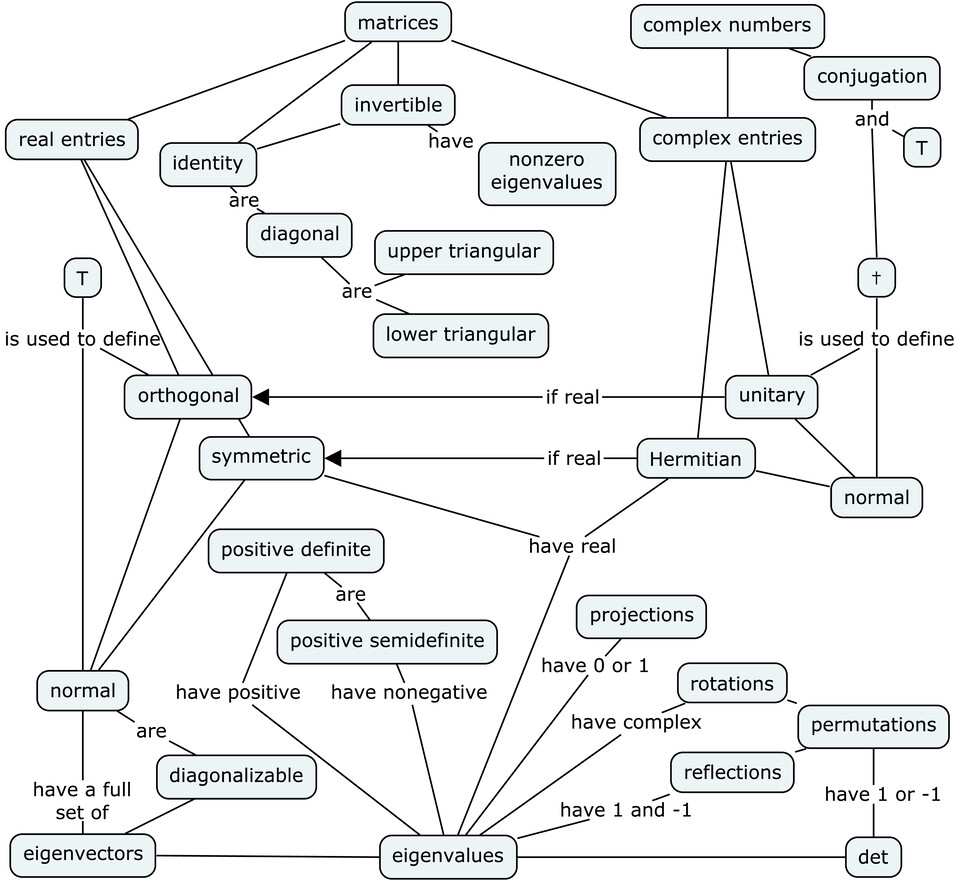

Chapter 6      

#[Chapter 6 Theoretical linear algebra](./Chapter 6_ Theoretical linear algebra.md)

Let’s take a trip down memory lane: 170 pages ago, we embarked on a mind-expanding journey through the land of linear algebra. We encountered vector and matrix operations. We studied systems of linear equations, solving them with row operations. We covered miles of linear transformations and their matrix representations. With the skills you’ve acquired to reach this point, you’re ready to delve into the abstract, theoretical aspects of linear algebra—that is, since you know all the useful stuff, you can officially move on to the cool stuff.

In math, we often use abstraction to find the commonalities between different mathematical objects. These parallels give us a deeper understanding of the mathematical structures we compare. This chapter extends what we know about the vector space  to the realm of abstract vector spaces of vector-like mathematical objects [Section 6.3](./Chapter 6_ Theoretical linear algebra.md)). We’ll discuss linear independence, find bases, and count dimensions for these abstract vector spaces. We’ll define abstract inner product operations and use them to generalize the concept of orthogonality for abstract vectors [Section 6.4](./Chapter 6_ Theoretical linear algebra.md)). We’ll explore the Gram–Schmidt orthogonalization procedure for distilling orthonormal bases from non-orthonormal bases [Section 6.5](./Chapter 6_ Theoretical linear algebra.md)). Finally, we’ll introduce vectors and matrices with complex entries [Section 6.7](./Chapter 6_ Theoretical linear algebra.md)).[Section 6.7](./Chapter 6_ Theoretical linear algebra.md) also reviews everything we’ve learned in this book, so be sure to read it even if complex numbers are not required for your course. Along the way, we’ll develop a taxonomy for the different types of matrices according to their properties and applications [Section 6.2](./Chapter 6_ Theoretical linear algebra.md)). We’ll also investigate matrix decompositions—techniques for splitting matrices into products of simpler matrices [Section 6.6](./Chapter 6_ Theoretical linear algebra.md)). The chapter begins by discussing the most important decomposition technique of them all: the _eigendecomposition_, which is a way to uncover the “natural basis” for any matrix.

##[6.1 Eigenvalues and eigenvectors](./Chapter 6_ Theoretical linear algebra.md)

The set of eigenvectors of a matrix is a special set of input vectors for which the action of the matrix is described as a simple _scaling_. In[Section 5.2](./Chapter 5_ Linear transformations.md), we observed how linear transformations act differently on different input spaces. We also observed the special case of the “zero eigenspace,” called the _null space_ of a matrix. The action of a matrix on the vectors in its null space is equivalent to a multiplication by zero. We’ll now put these eigenvalues and eigenvectors under the microscope and see what more there is to see.

Decomposing a matrix in terms of its eigenvalues and its eigenvectors gives valuable insights into the properties of the matrix. Certain matrix calculations, like computing the power of the matrix, become much easier when we use the _eigendecomposition_ of the matrix. For example, suppose we’re given a square matrix ,

and we want to compute . In other words, we want to compute

That’s an awful lot of matrix multiplications! Now imagine how many times we’d need to multiply the matrix if we wanted to find  or . Too many times, that’s how many. Let’s be smart about this. Every matrix corresponds to some linear operation. This means it’s legit to ask, “What does the matrix  do?” Once we figure that out, we can compute  by simply doing what  does  times.

The best way to see what a matrix does is to look inside it and see what it’s made of (you may need to gradually gain the matrix’s trust before it lets you do this). To understand the matrix , you must find its _eigenvectors_ and its _eigenvalues_. The word _eigen_ is the German word for “self.” The eigenvectors of a matrix are its “self vectors,” and correspond to a natural choice of basis for describing the action of the matrix. The _eigendecomposition_ is a change-of-basis operation that expresses the matrix  with respect to its _eigenbasis_ (“self-basis”). The eigendecomposition of the matrix  is a product of three matrices:

You can multiply the three matrices  to obtain . Note that the middle matrix  (the capital Greek letter _lambda_) has entries only on the diagonal. The diagonal matrix  is sandwiched between the matrix  on the left and  (the inverse of ) on the right.

The eigendecomposition of  allows us to compute  in a civilized manner:

![\begin{align*}
A^7\! & =  A A A A A A A \\
& =  	Q\Lambda 
\underbrace{Q^{-1}Q}_{\mathbbm{1}}\Lambda 
\underbrace{Q^{-1}Q}_{\mathbbm{1}}\Lambda 
\underbrace{Q^{-1}Q}_{\mathbbm{1}}\Lambda 
\underbrace{Q^{-1}Q}_{\mathbbm{1}}\Lambda 
\underbrace{Q^{-1}Q}_{\mathbbm{1}}\Lambda 
\underbrace{Q^{-1}Q}_{\mathbbm{1}}\Lambda Q^{-1}  \\
& =  	Q\Lambda \mathbbm{1} 
\Lambda \mathbbm{1} 
\Lambda \mathbbm{1}
\Lambda \mathbbm{1} 
\Lambda \mathbbm{1} 
\Lambda \mathbbm{1}
\Lambda Q^{-1}  \\
& =  	Q\Lambda \Lambda \Lambda  \Lambda  \Lambda  \Lambda  \Lambda Q^{-1}  \\
& =  	Q\Lambda^7 Q^{-1}.
\end{align*}](./images/1de159682927438827693d0b37a4f4f42ce2c1dc.png)

All the inner s cancel with the adjacent s. How convenient! Since the matrix  is diagonal, it’s easy to compute its seventh power:

Thus we can express our calculation of  as

We still need to multiply these three matrices together, but we’ve cut the work from six matrix multiplications to two. The answer is

With this technique, we can compute  just as easily:

We could even compute  if we wanted to. I hope by now you get the point: once you express  in its _eigenbasis_, computing the powers of  requires computing the powers of its _eigenvalues_, which is much simpler than carrying out matrix multiplications.

###[Definitions](./Front matter.md)

-   : an  square matrix. The entries of  are denoted as .
-   : the list of _eigenvalues_ of . Eigenvalues are usually denoted by the Greek letter _lambda_. Note that some eigenvalues could be repeated in the list.
-   : the _characteristic polynomial_ of . The eigenvalues of  are the roots of the characteristic polynomial.
-   : the set of _eigenvectors_ of . Each eigenvector is associated with a corresponding eigenvalue.
-   : the diagonalized version of . The matrix  contains the eigenvalues of  on the diagonal:
    
    
    
    The matrix  is the matrix  expressed in its eigenbasis.
    
-   : a matrix whose columns are eigenvectors of :
    
    ![Q 
    \eqdef
    \begin{bmatrix}
    \vert  &  & \vert \\
    \vec{e}_{\lambda_1}  &  \cdots &  \vec{e}_{\lambda_n} \\
    \vert  &  & \vert 
    \end{bmatrix}
    =  
    \tensor[_{B_s}]{\left[\mathbbm{1}\right]}{_{B_\lambda}}.](../Images/587cea6ded6ad6bd2f30e9a2d2bde8106d69cb35.png)
    
    The matrix  corresponds to the _change-of-basis_ matrix from the eigenbasis  to the standard basis .
    
-   : the _eigendecomposition_ of the matrix 
-   : the _diagonalization_ of the matrix 

###[Eigenvalues](./Front matter.md)

The fundamental eigenvalue equation is

where  is an eigenvalue and  is an eigenvector of the matrix . Multiply  by one of its eigenvectors , and the result is the same vector scaled by the constant .

To find the eigenvalues of a matrix, start from the eigenvalue equation , insert the identity , and rewrite the equation as a null-space problem:

This equation has a solution whenever . The eigenvalues of , denoted , are the roots of the _characteristic polynomial_:

Calculate this determinant and we obtain an expression involving the entries  and the variable . If  is an  matrix, the characteristic polynomial is a polynomial of degree  in .

We denote the list of eigenvalues as . If  is a repeated root of the characteristic polynomial , it’s called a _degenerate_ eigenvalue. For example, the identity matrix  has the characteristic polynomial , which has a repeated root at . We say the eigenvalue  is _degenerate_ and has _algebraic multiplicity_ . It’s important to keep track of degenerate eigenvalues, so we specify the multiplicity of an eigenvalue by repeatedly including it in the list of eigenvalues: .

###[Eigenvectors](./Front matter.md)

The _eigenvectors_ associated with eigenvalue  of matrix  are the vectors in the _null space_ of the matrix .

To find the eigenvectors associated with the eigenvalue , you need to solve for the components  and  of the vector  that satisfies the equation

or equivalently,

You previously solved this type of problem when you learned how to compute the null space of a matrix.

If  is a repeated root (_degenerate_ eigenvalue), the null space of  could contain multiple eigenvectors. The dimension of the null space of  is called the _geometric multiplicity_ of the eigenvalue .

###[Eigendecomposition](./Front matter.md)

If an  matrix  is _diagonalizable_ (I promise I didn’t make that word up) this means we can find  eigenvectors for that matrix. The eigenvectors that come from different eigenspaces are guaranteed to be linearly independent (see exercise [6.1.10](./Chapter 6_ Theoretical linear algebra.md)). We can also pick a set of linearly independent vectors _within_ each of the degenerate eigenspaces. Combining the eigenvectors from all the eigenspaces gives us a set of  linearly independent eigenvectors, which form a _basis_ for . This is the _eigenbasis_.

Let’s place the  eigenvectors side by side as the columns of a matrix:

We can decompose  in terms of its eigenvalues and its eigenvectors:

The matrix  is a diagonal matrix of eigenvalues, and the matrix  is the change-of-basis matrix that contains the corresponding eigenvectors as columns.

Note that only the _direction_ of each eigenvector is important and not the length. Indeed, if  is an eigenvector (with eigenvalue ), so is any  for all . Thus we’re free to use any multiple of the vectors  as the columns of the matrix .

#####[Example](./Front matter.md)

Find the eigendecomposition of the matrix:

In decreasing order, the eigenvalues of the matrix are:

The eigenvalues of  are the values that appear on the diagonal of .

When a  matrix has three distinct eigenvalues, it is diagonalizable, since it has the same number of linearly independent eigenvectors as eigenvalues. We know the eigenvectors are linearly independent by the following reasoning. The matrix  has three different eigenvalues. Each eigenvalue is associated with at least one eigenvector, and these eigenvectors are linearly independent (see [6.1.10](./Chapter 6_ Theoretical linear algebra.md) on page 6.1.10). Recall that any set of  linearly independent vectors in  forms a basis for . Since the three eigenvectors of  are linearly independent, we have enough columns to construct a change-of-basis matrix of eigenvectors  and use it to write .

To find the eigenvectors of , solve for the null space of the matrices , , and  respectively:

Check that  for each of the vectors above. Let  be the matrix constructed with the eigenvectors as its columns:

Together with the matrix , these matrices form the eigendecomposition of the matrix :

To find the diagonalization of , move  and  to the other side of the equation. More specifically, multiply the equation  by  on the left and by  on the right to obtain the diagonal matrix:

Have you noticed how time consuming it is to compute the eigendecomposition of a matrix? It’s really incredible. Though we skipped some details of the calculation (including finding the solution of the characteristic polynomial and the three null space calculations), finding the eigendecomposition of a  matrix took more than a page of work. Don’t be surprised if it takes hours to compute eigendecompositions on homework problems; you’re not doing anything wrong. Eigendecompositions simply take a lot of work. We’re dealing with a seven-syllable word here—did you really expect the process to be easy?

Actually, computing eigenvectors and eigenvalues _will_ become easier with practice. After eigendecomposing a dozen matrices or so using only pen and paper, you’ll be able to whip through the steps for a  matrix in about 20 minutes. That’s a really good thing for your GPA, because the probability of seeing an eigenvalue question on your linear algebra final exam is about 80%. It pays to have a mathematical edge with this stuff.

For readers learning linear algebra without the added motivational bonus of exam stress, I recommend you eigendecompose at least one matrix using only pen and paper to prove to yourself you can do it. In all other circumstances, you’re better off using `SymPy` to create a `Matrix` object; then calling its `eigenvals()` method to find the eigenvalues, or its `eigenvects()` method to find both its eigenvalues and eigenvectors.

###[Explanations](./Front matter.md)

Yes, we’ve got some explaining to do.

####[Eigenspaces](./Front matter.md)

Recall the definition of the _null space_ of a matrix :

The _dimension_ of the null space is the number of linearly independent vectors in the null space.

#####[Example](./Front matter.md)

If the matrix  sends exactly two linearly independent vectors  and  to the zero vector, , then its null space is two-dimensional. We can always choose the vectors  and  to be orthogonal () and thus obtain an _orthogonal basis_ for the null space.

Each eigenvalue  is associated with an _eigenspace_. The eigenspace  is the null space of the matrix :

Every eigenspace contains at least one nonzero eigenvector. For degenerate eigenvalues (repeated roots of the characteristic polynomial), the null space of  can contain multiple eigenvectors.

####[Change-of-basis matrix](./Front matter.md)

The matrix  is a _change-of-basis_ matrix. Given a vector expressed in the eigenbasis ![\tensor{[\vec{v}]}{_{B_{\lambda}}}=(v^\prime_1,v^\prime_2,v^\prime_3)^\sfT_{B_{\lambda}}
= v^\prime_1\vec{e}_{\lambda_1}+ v^\prime_3\vec{e}_{\lambda_3}+v^\prime_3\vec{e}_{\lambda_3}](../Images/e1ff007c9ccfe657e462ee31278d2ac5949eb0ee.png), we can use the matrix  to convert it to coordinates in the standard basis ![[\vec{v}]_{B_{s}} = (v_1, v_2,v_3)^\sfT_{B_s} = v_1\hat{\imath} + v_2\hat{\jmath}+v_3\hat{k}](../Images/0abde0bc45fe185b110483e33c4025985eefd6f4.png) as follows:

![\tensor{[\vec{v}]}{_{B_{s}}} 
= 	Q 
\tensor{[\vec{v}]}{_{B_{\lambda}}} 
=  	\tensor[_{B_{s}}]{[\mathbbm{1}]}{_{B_{\lambda}}} 
\tensor{[\vec{v}]}{_{B_{\lambda}}}.](../Images/9fb9cc15a7cf3b5264f3fec6a4f95d704f00d6b6.png)

The change of basis in the other direction is given by the inverse matrix:

![\quad \; 
\tensor{[\vec{v}]}{_{B_{\lambda}}} 
=  	\; Q^{-1} 
\tensor{[\vec{v}]}{_{B_{s}}}
= 	\tensor[_{B_{\lambda}}]{[\mathbbm{1}]}{_{B_{s}}} 
\tensor{[\vec{v}]}{_{B_{s}}}.](../Images/c1f4bdb4b9649a9250297794b39091b905c3ed97.png)

####[Interpretation](./Front matter.md)

The eigendecomposition  allows us to interpret the action of  on an arbitrary input vector  as the following three steps:

![\tensor{[\vec{w}]}{_{B_{s}}} 
=   	\tensor[_{B_{s}}]{[A]}{_{B_{s}}} 
\tensor{[\vec{v}]}{_{B_{s}}}
= 	Q
\Lambda 
Q^{-1} 
\tensor{[\vec{v}]}{_{B_{s}}}
= 	\underbrace{\!\!\; \tensor[_{B_{s}}]{[\mathbbm{1}]}{_{B_{\lambda}}} 
\underbrace{\!\!\; \tensor[_{B_{\lambda}}]{[\Lambda]}{_{B_{\lambda}}}
\underbrace{\; \tensor[_{B_{\lambda}}]{[\mathbbm{1}]}{_{B_{s}}} 
\tensor{[\vec{v}]}{_{B_{s}}} 
}_1 
}_2 
}_3\!.](../Images/178b57f0a10ce7545d8c813a5949e38266ba096e.png)

1.  In the first step, we convert the vector  from the standard basis to the eigenbasis of .
2.  In the second step, the action of  on vectors expressed with respect to its eigenbasis corresponds to a multiplication by the diagonal matrix .
3.  In the third step, we convert the output  from the eigenbasis back to the standard basis.

Another way to interpret these three steps is to say that, deep down inside, the matrix  is actually the diagonal matrix . To see the diagonal form of the matrix, we must express the input vectors with respect to the _eigenbasis_:

![[\vec{w}]_{B_{\lambda}} 
=  	\tensor[_{B_{\lambda}}]{[\Lambda]}{_{B_{\lambda}}}
\tensor{[\vec{v}]}{_{B_{\lambda}}}.](../Images/0f1d1b99c0b5950f18585f08c39152afc430f1f7.png)

It’s extremely important you understand the meaning of the equation  intuitively in terms of the three-step procedure. To help understand the three-step procedure, we’ll analyze in detail what happens when we multiply  by one of its eigenvectors. Let’s pick  and verify the equation  by following the vector through the three steps:

![\begin{align*}
\tensor[_{B_{s}}]{[A]}{_{B_{s}}} 
\tensor{[\vec{e}_{\lambda_1}]}{_{B_{s}}}
&= 	Q
\Lambda 
Q^{-1} 
\tensor{[\vec{e}_{\lambda_1}]}{_{B_{s}}}											\\
&= 	\underbrace{\! \tensor[_{B_{s}}]{[\mathbbm{1}]}{_{B_{\lambda}}} \; 
\underbrace{\! \tensor[_{B_{\lambda}}]{[\Lambda]}{_{B_{\lambda}}} 
\underbrace{    \tensor[_{B_{\lambda}}]{[\mathbbm{1}]}{_{B_{s}}} 
\tensor{[\vec{e}_{\lambda_1}]}{_{B_{s}}} 
}_{ (1,0,\ldots)^\sfT_{B_\lambda}    		} 
}_{ (\lambda_1,0,\ldots)^\sfT_{B_\lambda}	} 
}_{ \lambda_1 \tensor{[\vec{e}_{\lambda_1}]}{_{B_{s}}} }
= 	\lambda_1 
\tensor{[\vec{e}_{\lambda_1}]}{_{B_{s}}}.
\end{align*}](../Images/684b68c4fcc2669c326993497ebcb0881b4b97af.png)

In the first step, we convert the vector ![\tensor{[\vec{e}_{\lambda_1}]}{_{B_{s}}}](../Images/4691dd74123cf3b09ce44313987663f6e80eb398.png) to the eigenbasis and obtain . The second step results in , because multiplying  by the vector  selects the value in the first column of . For the third step, we convert  back to the standard basis to obtain ![\lambda_1\tensor{[\vec{e}_{\lambda_1}]}{_{B_{s}}}](../Images/788d13bf732e6dd446b0e4659836bab4a00ea092.png). Boom!

####[Invariant properties of matrices](./Front matter.md)

The determinant and the trace of a matrix are strictly functions of the eigenvalues. The determinant of  is the product of its eigenvalues:

and the trace is the sum of the eigenvalues:

The above equations are true because

and

The first equation follows from the properties of determinants:  and  (see page 2.3.9). The second equation follows from the cyclic property of the trace operator  (see page 2.3.8).

In fact, the above calculations are true for any _similarity transformation_. Recall that a similarity transformation is a change-of-basis calculation in which a matrix  gets multiplied by an invertible matrix  from the left and by the inverse  from the right: . The determinant and the trace of a matrix are _invariant_ properties under similarity transformations—they don’t depend on the choice of basis.

####[Relation to invertibility](./Front matter.md)

Let’s briefly revisit three of the equivalent conditions we stated in the invertible matrix theorem. For a matrix , the following statements are equivalent:

-    is invertible
-   
-   The null space contains only the zero vector 

The formula  reveals why the last two statements are equivalent. If , none of the s are zero (if one of the eigenvalues is zero, the whole product is zero). We know  is _not_ an eigenvalue of , which means there exists no vector  such that . Therefore, there are no vectors in the null space . We can also follow this reasoning in the other direction. If the null space of  is empty, then there is no nonzero vector  such that , which means  is not an eigenvalue of ; hence the product .

However, if there exists a nonzero vector  such that , then  has a non-empty null space and  is an eigenvalue of ; thus .

###[Eigendecomposition for normal matrices](./Front matter.md)

A matrix  is _normal_ if it satisfies the equation . All normal matrices are diagonalizable, and the change-of-basis matrix  can be chosen to be an _orthogonal_ matrix .

The eigenvectors corresponding to different eigenvalues of a normal matrix are _orthogonal_. Furthermore, we can choose the eigenvectors within the same eigenspace to be orthogonal. By collecting the eigenvectors from all eigenspaces of the matrix , it is possible to obtain a basis  of orthogonal eigenvectors:

Normalizing these vectors gives a set of _orthonormal_ eigenvectors  that form a basis for the space :

Consider now the matrix  constructed by using these orthonormal vectors as the columns:

The matrix  is an _orthogonal_ matrix, meaning it satisfies . In other words, the inverse of  is obtained by taking the transpose . To see how this works, consider the following product:

Each of the ones on the diagonal arises from taking the dot product of a unit-length eigenvector with itself. The off-diagonal entries are zero because the vectors are orthogonal. By definition, the inverse  is the matrix, which gives  when multiplied by , so we have .

Using the orthogonal matrix  and its inverse , we can write the eigendecomposition of a matrix  as

The key advantage of using an orthogonal matrix  in the diagonalization procedure is that computing its inverse becomes a trivial task: . The class of normal matrices enjoys a special status by virtue of being diagonalizable by orthogonal matrices.

###[Discussion](./Front matter.md)

####[Non-diagonalizable matrices](./Front matter.md)

Not all matrices are diagonalizable. For example, the matrix

has  as a repeated eigenvalue, but the null space of the matrix  contains only one eigenvector: . The matrix  has a single eigenvector in the eigenspace . To describe this situation using precise mathematical terminology, we say the _algebraic multiplicity_ of the eigenvalue  is two, but the _geometric multiplicity_ of the eigenvalue is one.

The matrix  is a  matrix with a single eigenvector. Since we’re one eigenvector short, we can’t construct the diagonalizing change-of-basis matrix . We say the matrix has _deficient_ geometric multiplicity, meaning it doesn’t have a full set of eigenvectors. Therefore,  is not diagonalizable.

####[Matrix power series](./Front matter.md)

One of the most useful concepts of calculus is the idea that functions can be represented as Taylor series. The Taylor series of the exponential function  is

Nothing stops us from using the same Taylor series expression to define the exponential function of a matrix:

Okay, there _is_ one thing stopping us—we need to compute an infinite sum of progressively larger matrix powers. Remember how we used the diagonalization of  to write  as ? We can apply that trick here to obtain the exponential of a matrix in a much simpler form:

![\begin{align*}
e^A  
& 	= \sum_{k=0}^\infty \frac{A^k}{k!}  
= \sum_{k=0}^\infty \frac{(Q\Lambda Q^{-1})^k}{k!} 			\\
& 	= \sum_{k=0}^\infty \frac{Q\:\Lambda^k\:Q^{-1} }{k!}  			\\
&  	=  Q\left[ \sum_{k=0}^\infty \frac{ \Lambda^k }{k!}\right]Q^{-1}  	\\
& 	= Q\left( 1 + \Lambda 
+ \frac{\Lambda^2}{2} + \frac{\Lambda^3}{3!} 
+ \frac{\Lambda^4}{4!} + \ldots \right)Q^{-1} 			\\
& 	= Qe^\Lambda Q^{-1} 								\\
&	= 
\begin{bmatrix}
\; \\
\; \; \; \; \; \; Q \;  \; \; \; \; \; \;  \\
\; 
\end{bmatrix}
\!\!\!
\begin{bmatrix}
e^{\lambda_1}	&  \cdots  &  0 \\
\vdots 	&  \ddots  &  0  \\
0  	&   0      &  e^{\lambda_n}
\end{bmatrix}
\!\!\!
\begin{bmatrix}
\; \\
\; \; \; \; \; \; Q^{-1} \; \; \; \; \; \;  \\
\; 
\end{bmatrix}\!.
\end{align*}](../Images/10103bdc2c3ab27bea296a8ac53c5828f35aae10.png)

We can use this approach to define “matrix functions” of the form

as Taylor series of matrices. Computing the matrix function  on an input matrix  is equivalent to computing the function  of each of the eigenvalues of the matrix: .

####[Review](./Front matter.md)

We learned how to decompose matrices in terms of their eigenvalues and eigenvectors. The fundamental equation is , where the vector  is an _eigenvector_ of the matrix , and the number  is an _eigenvalue_ of .

The characteristic polynomial is derived from a simple manipulation of the eigenvalue equation:

For this equation to be satisfied, the vector  must be in the _null space_ of . The problem of finding the eigenvalues reduces to finding the values of  for which the matrix  has a non-empty null space. Recall that a matrix has a non-empty null space if and only if it is not invertible. The easiest way to check if a matrix is invertible is to compute the determinant: .

Because multiple eigenvalues and eigenvectors may satisfy this equation, we keep a list of eigenvalues  and corresponding eigenvectors . The eigendecomposition of the matrix is , where  is the matrix with eigenvectors as columns, and  contains the eigenvalues on the diagonal.

###[Applications](./Front matter.md)

Many scientific methods use the eigendecomposition of a matrix as a building block. For instance:

-   In statistics, the _principal component analysis_ technique aims to uncover the dominant cause of the variation in datasets by eigendecomposing the _covariance matrix_—a matrix computed from the dataset.
-   Google’s original PageRank algorithm for ranking webpages by “importance” can be explained as the search for an eigenvector of a matrix. The matrix contains information about all the hyperlinks that exist between webpages (see[Section 8.1.15](./Chapter 8_ Probability theory.md)).
-   In quantum mechanics, the energy of a system is described by the Hamiltonian operator. The eigenvalues of the Hamiltonian are the possible energy levels the system can have.

Analyzing a matrix in terms of its eigenvalues and its eigenvectors is a powerful technique to “see inside” a matrix and understand what the matrix does. In the next section, we’ll analyze several different types of matrices and discuss their properties in terms of their eigenvalues.

###[Links](./Front matter.md)

\[ Good visual examples of eigenvectors from Wikipedia \]

[`http://en.wikipedia.org/wiki/Eigenvalues_and_eigenvectors`](./Eigenvalues_and_eigenvectors.md)

\[ Eigenvectors and eigenvalues explained by 3Blue1Brown \]

[`https://youtube.com/watch?v=PFDu9oVAE-g`](./watch_v=PFDu9oVAE-g.md)

###[Exercises](./Front matter.md)

E6.1 Find the characteristic polynomial and the eigenvalues of each of the following matrices:

1.  
2.  
3.  
4.  
5.  

E6.2 Find the characteristic polynomial, the eigenvalues, and the eigenvectors of the matrix:

E6.3 Suppose  is a  matrix with two distinct eigenvalues,  and . Prove that the eigenvectors that correspond to the different eigenvalues are linearly independent.

E6.4 Let  be an eigenvalue of  and let  be the corresponding eigenvector. Show that  is an eigenvalue of .

E6.5 Suppose  is an eigenvalue of the invertible matrix  with corresponding eigenvector . Show that  is an eigenvalue of the inverse matrix .

E6.6 Find the values of  and  so the matrix  will have eigenvalues  and .

E6.7 Consider the matrix . Which of the following vectors are eigenvectors of ?

##[6.2 Special types of matrices](./Chapter 6_ Theoretical linear algebra.md)

Mathematicians just love to categorize things. Conveniently for us, they’ve categorized certain types of matrices. Rather than embarking on a verbose explanation of the properties of a matrix, such as

  I have this matrix A whose rows are perpendicular vectors and 
  when you multiply any vector by this matrix it doesn't change 
  the length of the vector but just kind of rotates it---
	

it’s much simpler to refer to the categorization by saying,

   Let A be an orthogonal matrix.
	

Most advanced science textbooks and research papers routinely use terminology like “diagonal matrix,” “symmetric matrix,” and “orthogonal matrix,” so make sure you’re familiar with these concepts.

This section will also review and reinforce what we learned about linear transformations. Recall that we can think of the matrix-vector product  as applying a linear transformation  to an input vector . Therefore, each of the special matrices discussed here also corresponds to a special type of linear transformation. Keep this dual correspondence in mind because we’ll use the same terminology to describe matrices _and_ linear transformations.

###[Notation](./Front matter.md)

-   : the set of  matrices
-   : typical names for matrices
-   : the entry in the th row and th column of the matrix 
-   : the transpose of the matrix 
-   : the inverse of the matrix 
-   : the _eigenvalues_ of the matrix . For each eigenvalue  there is at least one associated _eigenvector_  that obeys the equation . Multiplying the matrix  by its eigenvectors  is the same as scaling  by .

###[Diagonal matrices](./Front matter.md)

Diagonal matrices contain entries on the diagonal and zeros everywhere else. For example:

A diagonal matrix  satisfies . The eigenvalues of a diagonal matrix are .

###[Symmetric matrices](./Front matter.md)

A matrix  is symmetric if and only if

The eigenvalues of symmetric matrices are real numbers, and the eigenvectors can be chosen to be mutually orthogonal.

Given any matrix , the product of  with its transpose  is always a symmetric matrix.

###[Upper triangular matrices](./Front matter.md)

Upper triangular matrices have zero entries below the main diagonal:

For a _lower_ triangular matrix, all the entries _above_ the diagonal are zeros: .

###[Identity matrix](./Front matter.md)

The identity matrix is denoted  or  and plays the role of multiplication by the number  for matrices: . The identity matrix is diagonal with ones on the diagonal:

Any vector  is an eigenvector of the identity matrix with eigenvalue .

###[Orthogonal matrices](./Front matter.md)

A matrix  is _orthogonal_ if it satisfies . In other words, the inverse of an orthogonal matrix  is obtained by taking its transpose: .

**Multiplication by an orthogonal matrix preserves lengths**. Consider the matrix-vector product . The length of a vector before the multiplication is . The length of a vector after the multiplication is

The second equality follows from the interpretation of the dot product as a matrix product . The third equality follows from the properties of matrix transpose .

When  is an orthogonal matrix, we can substitute  in the above expression to establish , which shows that multiplication by an orthogonal matrix is a _length preserving_ operation.

The eigenvalues of an orthogonal matrix have _unit_ length, but can in general be complex numbers . The determinant of an orthogonal matrix is either one or negative one .

You can visualize orthogonal matrices by thinking of their columns as a set of vectors that form an orthonormal basis for :

You can verify the matrix  is orthogonal by computing . The orthogonal matrix  is a change-of-basis matrix from the standard basis to the column basis .

Everything stated above about multiplication by an orthogonal matrix also applies to orthogonal transformations  because of the equivalence .

The set of orthogonal matrices contains three special cases: _rotations_ matrices, _reflection_ matrices, and _permutation_ matrices.

####[Rotation matrices](./Front matter.md)

A rotation matrix takes the standard basis  to a rotated basis . Consider an example in . The counterclockwise rotation by the angle  is given by the matrix

The matrix  takes  to , and  to .

As another example, consider the rotation by the angle  around the \-axis in :

This rotation is entirely in the \-plane, so the \-component of a vector multiplying this matrix remains unchanged.

The determinant of a rotation matrix is equal to one. The eigenvalues of rotation matrices are complex numbers with unit magnitude.

####[Reflections](./Front matter.md)

If the determinant of an orthogonal matrix  is equal to negative one, we say it is _mirrored orthogonal_. For example, the reflection through the line with direction vector  is given by:

A reflection matrix always has at least one eigenvalue equal to negative one, which corresponds to the direction perpendicular to the axis of reflection.

####[Permutation matrices](./Front matter.md)

Permutation matrices are another important class of orthogonal matrices. The action of a permutation matrix is simply to change the _order_ of the vector components. For example, the permutation , ,  can be represented as the matrix

An  permutation matrix contains  ones in  different columns and zeros everywhere else.

The _sign_ of a permutation corresponds to the determinant . We say that permutation  is _even_ if  and _odd_ if .

###[Positive matrices](./Front matter.md)

A matrix  is _positive semidefinite_ if

The eigenvalues of a positive semidefinite matrix are all nonnegative .

If instead the matrix  obeys the strict inequality  for all , we say the matrix  is _positive definite_. The eigenvalues of positive definite matrices are strictly greater than zero .

###[Projection matrices](./Front matter.md)

The defining property of a projection matrix is that it can be applied multiple times without changing the result:

A projection has two eigenvalues: one and zero. The space  that is left invariant by the projection  corresponds to the eigenvalue . The orthogonal complement  corresponds to the eigenvalue  and consists of vectors that get annihilated by . The space  is the null space of .

###[Normal matrices](./Front matter.md)

The matrix  is _normal_ if it obeys . If  is normal, it has the following properties:

-    is an eigenvector of  if and only if  is an eigenvector of .
-   For all vectors  and  and a normal transformation , we have
    
    
    
-   The matrix  has a full set of linearly independent eigenvectors. Eigenvectors corresponding to distinct eigenvalues are orthogonal, and eigenvectors from the same eigenspace can be chosen to be mutually orthogonal.

Every normal matrix is diagonalizable by an orthogonal matrix . The eigendecomposition of a normal matrix is written as , where  is orthogonal and  is diagonal.

Orthogonal () and symmetric () matrices are normal matrices, since  and .

Figure 6.1: This concept map illustrates the connections and relations between special types of matrices. We can understand matrices through the constraint imposed on their eigenvalues or their determinants. This diagram shows only a subset of the many connections between the different types of matrices. We’ll discuss matrices with complex entries in[Section 6.7](./Chapter 6_ Theoretical linear algebra.md).

###[Discussion](./Front matter.md)

We’ve defined several special categories of matrices and described their properties. You’re now equipped with some very precise terminology for describing different types of matrices. Each of these special matrices plays a role in certain applications.

This section also highlighted the importance of the eigenvalue description of matrices. Indeed, we can understand all special matrices in terms of the constraints imposed on their eigenvalues. The concept map in[Figure 6.1](./Chapter 6_ Theoretical linear algebra.md) summarizes the relationships between the different special types of matrices. The map also refers to _unitary_ and _Hermitian_ matrices, which extend the concepts of _orthogonal_ and _symmetric_ matrices to describe matrices with complex entries.

###[Exercises](./Front matter.md)

E6.8 Find the determinants and inverses of these triangular matrices:

E6.9 Is the matrix  symmetric?

E6.10 In this section we learned about different types of matrices: diagonal, triangular, positive (semi)definite, symmetric, and orthogonal matrices. What types of matrices are these?

1.  
2.  
3.  

Compute the matrices’ eigenvalues to analyse their properties.

##[6.3 Abstract vector spaces](./Chapter 6_ Theoretical linear algebra.md)

You can apply your knowledge of vectors more generally to other vector-like mathematical objects. For example, polynomials behave similarly to vectors. To add two polynomials  and , we add together the coefficients of each power of —the same way vectors are added component by component.

In this section, we’ll learn how to use the terminology and concepts associated with vectors to study other mathematical objects. In particular, we’ll see that notions such as _linear independence_, _basis_, and _dimension_ can be applied to mathematical objects like matrices, polynomials, and functions. We’ll use the notation  for describing abstract vectors as opposed to the usual  used for ordinary vectors.

###[Definitions](./Front matter.md)

An abstract vector space  consists of four things:

-   A set of vector-like objects 
-   A field  of scalar numbers, usually 
-   An addition operation “” for elements of  that dictates how to add vectors: 
-   A scalar multiplication operation “” for scaling a vector by an element of the field. Scalar multiplication is usually denoted implicitly  (without the dot).

A vector space satisfies the following eight axioms, for all scalars  and all vectors :

1.   (associativity of addition)
2.   (commutativity of addition)
3.  There exists a zero vector , such that  for all .
4.  For every , there exists an inverse element  such that .
5.   (distributivity I)
6.   (distributivity II)
7.   (associativity of scalar multiplication)
8.  There exists a unit scalar  such that .

If you know anything about vectors, the above properties should be familiar. Indeed, these are the standard properties for the vector space , where the field  is , and for which standard vector addition and scalar multiplication operations apply.

###[Theory](./Front matter.md)

Believe it or not, we’re actually done with all the theory for this section. Move along folks, there’s nothing more to see here aside from the definitions above—which are restatements of the properties of vector addition and vector scaling that you’ve already seen before.

The only thing left to do is illustrate these concepts through some examples.

###[Examples](./Front matter.md)

Matrices, polynomials, and functions are vector-like math objects. The following examples demonstrate how we can treat these math objects as abstract vector spaces .

####[Matrices](./Front matter.md)

Consider the vector space of  matrices over the real numbers . The addition operation for two matrices  is the usual rule of matrix addition: .

This vector space is \-dimensional, which can be seen by constructing a basis for the space. The standard basis for  consists of  matrices with zero entries everywhere except for a single  in the th row and the th column. Any matrix  can be written as a linear combination of the matrices in the standard basis.

#####[Example](./Front matter.md)

The standard basis  for the vector space  is

Any matrix  can be written as a linear combination of the vectors in :

In other words,  can be expressed as a vector of coordinates with respect to the basis : .

The abstract concept of a matrix  can be expressed as two equivalent representations. We can think of  either as an array of numbers with two columns and two rows, or as a four-dimensional vector of coordinates with respect to the basis :

We’ve arrived at a major _knowledge buzz_ milestone: **matrices are vectors!** In precise mathematical terms, we just demonstrated the existence of an _isomorphism_ between the set of  matrices and the set of four-dimensional vectors. We can add, subtract, and scale  matrices in their  representations. In the following exercises, we’ll see how to compute the matrix trace operation  in terms of the vector representation.

####[Symmetric 2x2 matrices](./Front matter.md)

Define the vector space consisting of  symmetric matrices

in combination with the usual matrix addition and scalar multiplication operations. We obtain an explicit basis for this space as follows:

Any element of the vector space  can be written as a linear combination of the basis vectors:

Since there are three vectors in a basis for , the vector space  is three-dimensional.

Note how we count the dimensions in this case. The space of  matrices is four-dimensional in general, but imposing the symmetry constraint  eliminates one parameter, so we’re left with a three-dimensional space.

####[Polynomials of degree n](./Front matter.md)

Define the vector space  of polynomials with real coefficients and degree less than or equal to . The “vectors” in this space are polynomials of the form

The coefficients of the polynomial  are the components of the vector .

The addition of vectors  is performed component-wise:

Similarly, scalar multiplication acts as you’d expect:

The space  is \-dimensional since each “vector” in this space has  components.

####[Functions](./Front matter.md)

Another interesting vector space is the set of functions  in combination with the point-wise addition and scalar multiplication operations:

The space of functions is _infinite_\-dimensional.

###[Discussion](./Front matter.md)

We’ve talked about bases, components, and dimensions of _abstract_ vector spaces. Indeed, these notions are well-defined for any vector-like object. Though this section only discussed vector spaces with real components, we can apply the same techniques to vectors with components from any _field_. The notion of a _field_ describes any number-like object for which the operations of addition, subtraction, multiplication, and division are defined. An example of another field is the set of complex numbers . We’ll discuss the linear algebra of vectors with complex components in[Section 6.7](./Chapter 6_ Theoretical linear algebra.md).

In the next section, we’ll define an _abstract inner product_ operation and use this definition to discuss concepts like orthogonality, length, and distance in abstract vector spaces.

###[Links](./Front matter.md)

\[ Further discussion and examples on Wikipedia \]

[`http://en.wikipedia.org/wiki/Vector_space`](./Vector_space.md)

\[ Examples of vector spaces \]

[`http://wikibooks.org/wiki/Linear_Algebra/Definition_and_Examples_of_Vector_Spaces`](./Definition_and_Examples_of_Vector_Spaces.md)

\[ Abstract vector spaces explained by 3Blue1Brown \]

[`https://youtube.com/watch?v=TgKwz5Ikpc8`](./watch_v=TgKwz5Ikpc8.md)

###[Exercises](./Front matter.md)

E6.11 Find a basis for the space of  upper triangular matrices.

E6.12 Can every polynomial of degree at most two be written in the form ?

Try to express an arbitrary polynomial in this form.

##[6.4 Abstract inner product spaces](./Chapter 6_ Theoretical linear algebra.md)

An inner product space is an abstract vector space  for which we define an _abstract inner product_ operation that takes pairs of vectors as inputs and produces numbers as outputs:

We can use any inner product operation, as long as it satisfies the following criteria for all  and . The inner product operation must be:

-   Symmetric: 
-   Linear: 
-   Positive semidefinite:  for all  with  if and only if 

These criteria are inspired by the properties of the standard inner product (dot product) for vectors in :

In this section, we’ll extend the idea of the dot product by defining inner product operations  for abstract vectors . We’ll define inner product operations for matrices , polynomials , and functions . These inner product operations will allow us to talk about _orthogonality_ between abstract vectors,

the _length_ of an abstract vector,

and the _distance_ between two abstract vectors,

Let’s get started.

###[Definitions](./Front matter.md)

We’ll work with vectors from an abstract vector space  where:

-    is the set of vectors in the vector space.
-    is the _field_ of real numbers. The components of the abstract vectors are taken from this field.
-    is the addition operation defined for elements of .
-    is the scalar multiplication operation between an element of the field  and a vector .

We define a new operation called _abstract inner product_ for that space:

The abstract inner product takes as inputs two vectors  and produces real numbers as outputs: .

We define the following related quantities in terms of the inner product operation:

-   : the _norm_ or _length_ of an abstract vector
-   : the _distance_ between two vectors

###[Orthogonality](./Front matter.md)

Recall that two vectors  are said to be orthogonal if their dot product is zero. This follows from the geometric interpretation of the dot product:

where  is the _angle_ between  and . Orthogonal means “at right angle with.” Indeed, if , the angle between  and  must be  or , since  only for these two angles.

In analogy with the regular dot product, we define the notion of _orthogonality_ between abstract vectors in terms of the abstract inner product:

Translating the geometric intuition of “at  angle with” might not be possible for certain abstract vector spaces. For instance, what is the angle between two polynomials? Nevertheless, the fundamental notion of “perpendicular to” exists in all abstract inner product vector spaces.

###[Norm](./Front matter.md)

Every definition of an inner product for an abstract vector space  induces a _norm_ for that vector space:

The norm is defined in terms of the inner product. The norm of a vector is the square root of the inner product of the vector with itself:

The norm corresponds to the abstract notion of length for vectors. All norms must satisfy the following criteria:

-    with equality if and only if 
-   
-   The triangle inequality:
    
    
    
-   Cauchy–Schwarz inequality:
    
    
    
    with equality if and only if  and  are linearly dependent
    

Norms defined in terms of a valid inner product automatically satisfy these criteria.

###[Distance](./Front matter.md)

The distance between two points  and  in  is equal to the norm of the vector that goes from  to : . We can similarly define a _distance_ function between pairs of vectors in an abstract vector space :

The distance between two abstract vectors is equal to the norm of their difference:

Distances defined in terms of a valid norm obey the following criteria:

-   
-    with equality if and only if 

###[Examples](./Front matter.md)

Let’s define some inner product functions for the aforementioned abstract vector spaces.

####[Matrix inner product](./Front matter.md)

The Hilbert–Schmidt inner product for real matrices is defined in terms of the matrix transpose, matrix multiplication, and matrix trace operations:

We can use this inner product to talk about _orthogonality_ properties of matrices. In the last section, we defined the set of  symmetric matrices

and gave an explicit basis for this space:

It’s easy to show that these vectors are all _mutually orthogonal_ with respect to the Hilbert–Schmidt inner product :

Verify these three equations by computing each inner product. Try this by hand on a piece of paper … like right now.

The three inner product calculations of the last equation indicate that the set  forms an orthogonal basis for the vector space  with respect to the inner product .

####[Hilbert–Schmidt norm](./Front matter.md)

The Hilbert–Schmidt inner product induces the Hilbert–Schmidt norm:

![\|A\|_{\textrm{HS}}
\,\eqdef\, \sqrt{ \langle A, A \rangle_{\textrm{HS}} }
= \sqrt{ \textrm{Tr}\!\left( A^\sfT A \right) }
= \left[ \sum_{i,j=1}^{n} |a_{ij}|^2 \right]^{\frac{1}{2}}.](../Images/20997666b40eb04597c4fa3c113498dacb322969.png)

We can use this norm to define an abstract notion of length for matrices. Continuing with the above example, we can obtain an ortho**normal** basis  for  as follows:

Verify that .

####[Function inner product](./Front matter.md)

Consider two functions,  and , and define their inner product as follows:

This formula is the continuous-variable version of the inner product formula for vectors . Instead of a summation, we have an integral; otherwise the idea is the same since we’re measuring the _overlap_ between  and . The integral passes along the real line from  until  like a zipper that brings together  times  at each point.

#####[Example](./Front matter.md)

Consider the function inner product on the interval ![[-1,1]](../Images/b072cebfd75fdf83cba4813cb0cd96d340e840ab.png) as defined by the formula:

Verify that the following polynomials, known as the Legendre polynomials , are mutually orthogonal with respect to the above inner product:

####[Generalized dot product](./Front matter.md)

We can think of the regular dot product for vectors as the following vector-matrix-vector product:

More generally, we can insert any _symmetric_, _positive semidefinite_ matrix  between the vectors and obtain a valid inner product:

The matrix  is called the _metric_ for this inner product, and it encodes the relative contributions of the different components of the vectors to the inner product.

The requirement that  be symmetric stems from the symmetric requirement for inner products: . The requirement that the matrix be positive semidefinite comes from the positive semidefinite requirement for inner products: , for all .

We can always obtain a symmetric and positive semidefinite matrix  by setting  for some matrix . To understand why we might want to construct  in this way, recall that each matrix  implements some linear transformation . An inner product  can be interpreted as the regular dot product in the output space of :

The notion of a generalized inner product with metric matrix  is a powerful idea with applications in advanced math areas like analysis and differential geometry. The concept of a metric also shows up in physics: when Einstein talks about masses causing space to become “curved,” he’s talking about the curvature of the metric of space-time.

####[Valid and invalid inner product spaces](./Front matter.md)

A standard question profs like to ask on exams is to check whether a given vector space and some weird definition of an inner product operation form a valid inner product space. Recall that _any_ operation can be used as the inner product, as long as it satisfies the _symmetry_, _linearity_, and _positive semidefinite_ criteria. To prove an inner product operations is valid, you must show it satisfies the three criteria.

Alternatively, you can prove the vector space  with inner product  is _not_ a valid inner product space if you find an example of one or more  that don’t satisfy the axioms.

###[Discussion](./Front matter.md)

This has been another one of those sections where we learn no new linear algebra, but simply generalize notions we already know about standard vectors  to abstract vector-like objects . You can now talk about orthogonality and norms for matrices, polynomials, and functions.

###[Exercises](./Front matter.md)

E6.13 Prove the set of matrices  is an orthonormal set under the inner product .

E6.14 Compute the norm of the functions  and  with respect to the function inner product  defined on the interval ![[-1,1]](../Images/b072cebfd75fdf83cba4813cb0cd96d340e840ab.png). Also compute the distance .

Recall that a vector’s norm is defined as .

##[6.5 Gram–Schmidt orthogonalization](./Chapter 6_ Theoretical linear algebra.md)

Recall what we learned in[Section 4.3](./Chapter 4_ Geometric aspects of linear algebra.md) about the three “quality grades” for bases: orthonormal, orthogonal, and generic, with orthonormal bases being the easiest to work with. In this section, we’ll learn how to take a generic basis for an \-dimensional vector space —that is, a set of  linearly independent vectors —and transform it into an orthonormal basis  that satisfies the conditions

This procedure is known as _Gram–Schmidt orthogonalization_ and is based on a sequence of projection and subtraction operations.

The discussion and procedures in this section are described in terms of vectors in an abstract inner product space. Thus, the Gram–Schmidt algorithm applies to ordinary vectors , matrices , and polynomials . Indeed, we can talk about orthogonality for any set of mathematical objects for which we’ve defined an inner product operation.

###[Definitions](./Front matter.md)

-   : an \-dimensional vector space
-   : a generic basis for the space 
-   : an _orthogonal basis_ for . Each vector  is orthogonal to all other vectors: , for .
-   : an _orthonormal_ basis for . An orthonormal basis is an orthogonal basis of unit vectors.

We assume the vector space  is equipped with an inner product operation:

The following operations are defined in terms of the inner product:

-   The _length_ of a vector 
-   The _projection_ operation. The projection of the vector  onto the subspace spanned by the vector  is denoted  and is computed using
    
    
    
-   The _projection complement_ of the projection  is the vector  that we must add to  to recover the original vector :
    
    
    
    The vector  is orthogonal to the vector , .
    

###[Orthonormal bases are nice](./Front matter.md)

Recall that a _basis_ for an \-dimensional vector space  is any set of  linearly independent vectors in . The choice of basis is a big deal because we express the coordinates of vectors and matrices with respect to the basis. From a theoretical standpoint, all bases are equally good; but from a practical standpoint, orthogonal and orthonormal bases are much easier to work with.

An orthonormal basis  is the most useful kind of basis because the coordinates , , and  of a vector  with respect to  are obtained using three independent inner product calculations:

We can express any vector  as

This formula is a generalization of the usual formula for coordinates with respect to the standard basis : .

###[Orthogonalization](./Front matter.md)

The “best” kind of basis for computational purposes is an orthonormal basis like . How can we _upgrade_ some general set of  linearly independent vectors  into an orthonormal basis ? The vectors  must be linear combinations of the vectors , but which linear combinations should we choose?

Note the vector space  remains the same:

However, the basis  is easier to work with.

The technical term for distilling a high-quality orthonormal basis from a low-quality basis of arbitrary vectors is called _orthogonalization_. Most of the work lies in obtaining the set of vectors  that are _orthogonal_ to each other:

To convert an orthogonal basis into an orthonormal basis, divide each vector by its length: .

It’s now time to see how orthogonalization works; get ready for some Gram–Schmidting.

###[Gram–Schmidt orthogonalization procedure](./Front matter.md)

The Gram–Schmidt orthogonalization procedure converts a basis of arbitrary vectors  into an orthonormal basis . The main idea is to take the vectors  one at a time, each time defining a new vector  as the _orthogonal complement_ of  to all the previously chosen vectors , , , . Recall we can use the projection formula  to compute the component of any vector  in the direction .

The orthogonalization algorithm consists of  steps:

![\begin{align*}
\mathbf{e}_1 &= \mathbf{v}_1  
& \hat{\mathbf{e}}_1 &= {\mathbf{v}_1 \over \|\mathbf{v}_1\|},  \\
\mathbf{e}_2 &= \mathbf{v}_2-\Pi_{\hat{\mathbf{e}}_1}\!(\mathbf{v}_2), 
& \hat{\mathbf{e}}_2 &= {\mathbf{e}_2 \over \|\mathbf{e}_2\|}, \\
\mathbf{e}_3 &= \mathbf{v}_3-\Pi_{\hat{\mathbf{e}}_1}\!(\mathbf{v}_3)-\Pi_{\hat{\mathbf{e}}_2}\!(\mathbf{v}_3), 
& \hat{\mathbf{e}}_3 &= {\mathbf{e}_3 \over \|\mathbf{e}_3\|}, \\
\mathbf{e}_4 &= \mathbf{v}_4-\Pi_{\hat{\mathbf{e}}_1}\!(\mathbf{v}_4)-\Pi_{\hat{\mathbf{e}}_2}\!(\mathbf{v}_4),
-\Pi_{\hat{\mathbf{e}}_3}\!(\mathbf{v}_4), 
& \hat{\mathbf{e}}_4 &= {\mathbf{e}_4 \over \|\mathbf{e}_4\|}, \\
& \vdots &&\vdots \\
\mathbf{e}_n &= \mathbf{v}_n-\sum_{i=1}^{n-1}\Pi_{\hat{\mathbf{e}}_i}\!(\mathbf{v}_n),
&\hat{\mathbf{e}}_n &= {\mathbf{e}_n\over\|\mathbf{e}_n\|}.
\end{align*}](./images/9eab988fd402555b95c240f5864463419961b372.png)

In the th step of the procedure, we compute a vector  by starting from  and subtracting all the projections of  onto the previous vectors  for all . In other words,  is the part of  that is orthogonal to all the vectors .

This procedure is known as orthogonalization because it splits the vector space  into orthogonal subspaces :

Recall that the symbol  denotes the _set difference_ operation. The set  consists of all elements that are in set  but not in set .

Observe that the subspaces  are, by construction, mutually orthogonal. Given any vector  and another vector , then .

The vector space  is the sum of these subspaces:

The notation  means _orthogonal sum_. Each space  is spanned by a vector  which is orthogonal to all the s, for .

###[Discussion](./Front matter.md)

The main point you must remember about orthogonalization is simply that it can be done. Any “low-quality” basis (a set of  linearly independent vectors  in an \-dimensional space) can be converted into a “high quality” orthonormal basis  using the Gram–Schmidt procedure.

You can also perceive the Gram–Schmidt procedure as a technique for creating structure in an arbitrary vector space . The initial description  lacks structure. It’s just some amorphous vector space spanned by an arbitrary set of vectors. After the orthogonalization procedure, we obtain the equivalent description  that shows  is the direct sum of orthogonal subspaces.

In the next section, we’ll continue on our mathematical quest for structure by discussing procedures that uncover hidden structure in matrices. For example, when phrased in terms of matrices, the Gram–Schmidt orthogonalization procedure is called _ decomposition_—stay tuned! And meanwhile, try the following exercises.

###[Exercises](./Front matter.md)

E6.15 Convert the vectors  and  into an orthogonal basis for .

E6.16 Perform the Gram–Schmidt orthogonalization procedure on the vectors , , and  to obtain an orthonormal basis .

E6.17 Consider the vector space of polynomials of degree at most two , and consider the inner product . Perform the Gram–Schmidt orthogonalization procedure on the polynomials , , and  to obtain an orthonormal basis for .

##[6.6 Matrix decompositions](./Chapter 6_ Theoretical linear algebra.md)

It’s often useful to express a given matrix as the product of other, simpler matrices. These matrix decompositions (also known as factorizations) can help us understand the structure of matrices by revealing their constituents. In this section, we’ll discuss various matrix factorizations and specify the types of matrices they apply to.

Most of the material covered here is not usually included in a first-year linear algebra course. Nevertheless, knowing about the different matrix decompositions is quite helpful, as many linear algebra applications depend on these decompositions. Got that? Good. Onward!

###[Eigendecomposition](./Front matter.md)

The eigendecomposition breaks a matrix into its eigenvalues and eigenvectors. The eigenbasis, when it exists, is the most “natural” basis for looking at a matrix. A diagonalizable matrix  can be written as

where  is a matrix whose columns are eigenvectors of , and  is a diagonal matrix containing the eigenvalues of .

The eigendecomposition of a matrix is a similarity transformation (a change of basis) where the new basis matrix consists of eigenvectors of the matrix.

If  is positive semidefinite then its eigenvalues are nonnegative. If the matrix  is symmetric then its eigenvalues are real numbers.

When the matrix  is _normal_, meaning it satisfies , we can choose  to be an orthogonal matrix  that satisfies . Calculating the inverse of an orthogonal matrix is easy: . The eigendecomposition for normal matrices is .

###[Singular value decomposition](./Front matter.md)

We can generalize the concepts of eigenvalues and eigenvectors to non-square matrices. Consider a matrix . Since the matrix  is not a square matrix, we can’t use the standard eigendecomposition. However, there is a trick for turning a non-square matrix into a square matrix while preserving some of its properties: multiply the matrix by its transpose. The matrix  has the same column space as the matrix . Similarly,  has the same row space as the matrix .

The _singular value decomposition_ breaks a matrix into the product of three matrices: an  orthogonal matrix  which consists of _left singular vectors_, an  matrix  with the _singular values_  on the diagonal, and an  orthogonal matrix  of _right singular vectors_:

![A \; = \; 
\underbrace{ \!\!
\begin{bmatrix}
\vert  &  & \vert \\
\hat{u}_1  &  \!\cdots \! &  \hat{u}_m \\
\vert  &  & \vert 
\end{bmatrix}\!\!
}_U
\; 
\underbrace{\!\!
\begin{bmatrix}
\sigma_1 & 0 		& \cdots \; \;  \\
0	  & \sigma_2	& \cdots \; \;  \\
0 	  & 0			& \cdots \; \; 
\end{bmatrix}\!\!
}_\Sigma
\; 
\underbrace{\!\!
\begin{bmatrix}
\textrm{ ---} & \hat{v}_{1}  & \textrm{--- }  \\
& \vdots &  \\
\textrm{ ---} & \hat{v}_{n} & \textrm{--- } 
\end{bmatrix}\!\!
}_{V^\sfT}
\; = \; U\Sigma V^\sfT.](./images/32d7b88dce50d0b384e297e668e458086b7414d2.png)

To find the matrices , , and , perform eigendecomposition on the matrix products  and .

Consider first the matrix . Since  is a square matrix, we can compute its eigendecomposition . The eigenvectors of  span the same space as the column space of the matrix . We call these vectors the _left singular vectors_ of .

The left singular vectors of  (the columns of ) are the eigenvectors of the matrix :

To find the right singular vectors of  (the rows of ), perform the eigendecomposition on the matrix , denoted . Build the orthogonal matrix  by stacking the eigenvectors of  as rows:

The eigenvalues of the matrix  are the same as the eigenvalues of the matrix . In both cases, the eigenvalues  correspond to the squares of the singular values of the matrix .

On its diagonal, the matrix of singular values  contains the singular values , which are the positive square roots of the eigenvalues  of the matrix  (or the matrix ):

The singular value decomposition shows the inner structure of the matrix . We can interpret the operation  as a three-step process:

1.  Convert the input  to the basis of right singular vectors .
2.  Scale each component by the corresponding singular value .
3.  Convert the output from the  basis to the standard basis.

This three-step procedure is analogous to the three-step procedure we used to understand the eigendecomposition of square matrices in[Section 6.1](./Chapter 6_ Theoretical linear algebra.md) (see page 6.1.5.3).

The singular value decomposition (SVD) has numerous applications in statistics, machine learning, and computer science. Applying the SVD to a matrix is like looking inside it with X-ray vision, since you can see its s. The action of  occurs in  parallel streams: the th stream consists of multiplying the input vector by the right singular vector , scaling by the weight , and finally multiplying by the left singular vector . Each singular value  corresponds to the “strength” of  on the th subspace—the subspace spanned by its th left and right singular vectors.

#####[Example](./Front matter.md)

Suppose you need to calculate the product  where  and . Suppose furthermore the matrix  has only three large singular values, , , , and many small singular values, . Observe that most of the “weight” of the matrix  is concentrated in the first three singular values, , , and . We can obtain a _low-rank approximation_ to the matrix  by keeping only the large singular values and their associated singular vectors. Construct the matrix  which contains only the first three singular values, and surround  with matrices  and  which contain the singular vectors associated with the first three singular values. Despite the significant reduction in the size of the matrices used in the decomposition, the matrix  represents a good approximation to the original matrix . We cut some small, insignificant singular values, which doesn’t change the matrix too much. We can quantify the difference between the original  and its low-rank approximation  using the Hilbert–Schmidt norm: . Since  are tiny numbers, we can say .

####[Links](./Front matter.md)

\[ Singular value decomposition on Wikipedia \]

[`http://en.wikipedia.org/wiki/Singular_value_decomposition`](./Singular_value_decomposition.md)

\[ Excellent blog post series that explains the SVD intuitively \]

Part 1, motivation:[`https://jeremykun.com/?p=5946`](./_p=5946.md)

Part 2, computations:[`https://jeremykun.com/?p=8329`](./_p=8329.md)

\[ Understanding the SVD and its applications \]

[`http://www.math.umn.edu/~lerman/math5467/svd.pdf`](./svd.pdf.md)

\[ Principal component analysis in statistics is based on SVD \]

[`http://en.wikipedia.org/wiki/Principal_component_analysis`](./Principal_component_analysis.md)

###[LU decomposition](./Front matter.md)

Computing the inverse of a triangular matrix is far easier than computing the inverse of a general matrix. Thus, for computational purposes, it’s sometimes useful to write a matrix as the product of two triangular matrices. We call this factorization the  decomposition:

where  is an _upper triangular_ matrix and  is a _lower triangular_ matrix.

The main application of this decomposition is to obtain more efficient solutions to equations of the form . Because , we can solve this equation in two steps. Starting from , first multiply by  and then by :

We’ve split the work of finding the inverse  into two simpler subtasks: finding  and , which are easier to compute.

The  decomposition is mainly used for linear algebra calculations on computers, but it’s also possible to find the  decomposition of a matrix by hand. Recall the algorithm for finding the inverse of a matrix, in which we start from the array ![[\,A\,|\;\mathbbm{1}\;]](../Images/99316346f44937a2a7d39e935c178b73ef2813c0.png) and perform row operations to bring the array into reduced row echelon form ![[\;\mathbbm{1}\; |\,A^{-1}\,]](../Images/ef35a70727afaf732412a1dcbcf669e0998c6b3c.png). Consider the midpoint of the algorithm when the left side of the array is the row echelon form (REF). Since the matrix  in its REF is upper triangular, the array will contain ![[\; U\;|\,L^{-1}\,]](../Images/1bc827518360cda2d300cd03c00789cbda7002d2.png). The  part of the decomposition is on the left side, and the  part is obtained by finding the inverse of the right side of the array.

Note the  decomposition exists only for matrices that can be brought to RREF without using row-swap operations. If a matrix  requires row-swap operations to be transformed to RREF, we can decompose it as , where  is a permutation matrix. The  decomposition has the same computational advantages of splitting the inverse computation into three simpler subtasks: .

###[Cholesky decomposition](./Front matter.md)

For a _symmetric_, _positive semidefinite_ matrix , the  decomposition can take on a simpler form. Such matrices can be written as the product of a triangular matrix and its transpose:

where  is an _upper triangular_ matrix and  is a _lower triangular_ matrix. This is called the _Cholesky decomposition_ of a matrix, and like the  decomposition, it has applications for faster numerical linear algebra calculations, nonlinear optimization, and machine learning.

###[QR decomposition](./Front matter.md)

Any real square matrix  can be decomposed as a product of an orthogonal matrix  and an upper triangular matrix :

For historical reasons, the orthogonal matrix is denoted  instead of , and the upper triangular matrix is denoted  (think “right-triangular” since it contains entries only to the _right_ of the main diagonal). Using the conventional names, the decomposition becomes

which is why it’s known as the  decomposition.

The  decomposition is equivalent to the Gram–Schmidt orthogonalization procedure applied to the columns of the matrix. The matrix  records the orthonormal basis while the matrix  contains the coefficients required to express the columns of  as linear combinations of the columns of .

#####[Example](./Front matter.md)

Consider the decomposition

We’re looking for an orthogonal matrix  and an upper triangular matrix  such that . We can obtain the orthogonal matrix  by performing the Gram–Schmidt procedure on the columns of .

Let’s illustrate the procedure by computing the factorization . Begin by changing the second column in  so it becomes orthogonal to the first (by subtracting a multiple of the first column). Next, change the third column in  so it is orthogonal to both of the first columns (by subtracting multiples of the first two columns). We obtain a matrix with the same column space as , but which has orthogonal columns:

To obtain an orthogonal matrix, we must normalize each column to have length one:

We can obtain the matrix  from  and :

The columns of  contain the mixture of coefficients required to obtain the columns of  from the columns of . For example, the second column of  is equal to .[Verify that  equals .](http://bit.ly/1c2Wjxk)

###[Discussion](./Front matter.md)

The last several pages have only scratched the surface of matrix decompositions. There are countless applications for matrix methods, and matrix factorizations play key roles in many of them.

Machine learning techniques often use matrix decompositions to uncover useful structure within data matrices. Two examples include _nonnegative matrix factorization_ (used for recommender systems) and _latent Dirichlet allocation_ (used for document classification). I encourage you to research this subject further on your own—it’s quite an interesting wormhole to get sucked into.

###[Links](./Front matter.md)

\[ Cool retro video showing the steps of the SVD procedure \]

[`http://www.youtube.com/watch?v=R9UoFyqJca8`](./watch_v=R9UoFyqJca8.md)

\[ More info and examples on Wikipedia \]

[`http://en.wikipedia.org/wiki/Matrix_decomposition`](./Matrix_decomposition.md)

[`http://en.wikipedia.org/wiki/Cholesky_decomposition`](./Cholesky_decomposition.md)

\[ A detailed example of the QR factorization of a matrix \]

[`http://www.math.ucla.edu/~yanovsky/Teaching/Math151B/handouts/GramSchmidt.pdf`](./GramSchmidt.pdf.md)

###[Exercises](./Front matter.md)

E6.18 Compute the  factorization of the matrix .

##[6.7 Linear algebra with complex numbers](./Chapter 6_ Theoretical linear algebra.md)

So far we’ve discussed the math of vectors and matrices with real components. In fact, the linear algebra techniques you’ve learned apply to any _field_ . The term _field_ applies to any mathematical object for which the operations of addition, subtraction, multiplication, and division are defined.

Since the complex numbers  are a field, we can perform linear algebra over the field of complex numbers. In this section, we’ll define vectors and matrices with complex components, and discover that they behave similarly to their real counterparts. You’ll see that complex linear algebra is no more complex than real linear algebra. It’s the same, in fact, except for one small difference: instead of matrix transpose , we use the Hermitian transpose , which is the combination of the transpose and an entry-wise complex conjugate operation.

Complex vectors are not just an esoteric mathematical concept intended for specialists. Complex vectors can arise as answers for problems involving ordinary real matrices. For example, the rotation matrix

has complex eigenvalues  and  and its eigenvectors have complex components. If you want to know how to calculate the eigenvalues and eigenvectors of rotation matrices, you need to understand how to do linear algebra calculations with complex numbers. This section serves as a review of all the important linear algebra concepts we’ve learned in this book. I recommend you read this section, even if you’re not required to know about complex matrices for your course. As your guide through the land of linear algebra, it’s my duty to make sure you understand linear algebra in the complex field. It’s good stuff; I guarantee there’s _knowledge buzz_ to be had in this section.

###[Definitions](./Front matter.md)

Recall the basic notions of complex numbers introduced in[Section 1.14](./Chapter 1_ Math fundamentals.md):

-   : the unit imaginary number;  and 
-   : a complex number  whose real part is  and whose imaginary part is 
-   : the set of complex numbers 
-   : the _real_ part of 
-   : the _imaginary_ part of 
-   : the _complex conjugate_ of . If  then 
-   : the _magnitude_ or _length_ of 
-   : the _phase_ or _argument_ of . Note that  and  coincide only if . A correction is necessary to the output of  when . The computer function `atan2(b,a)` returns the correct phase for all .

####[Complex vectors](./Front matter.md)

A complex vector  is an array of  complex numbers:

####[Complex matrices](./Front matter.md)

A complex matrix  is a table of numbers with  rows and  columns. An example of a  matrix with complex entries is

####[Hermitian transpose](./Front matter.md)

The _Hermitian transpose_ operation, denoted , consists of the combination of the regular transpose () and the complex conjugation of each entry in the matrix ():

Expressed in terms of the entries of the matrix , the Hermitian transpose corresponds to the transformation . There are _many_ mathematical terms that refer to this operation, including _Hermitian conjugate_, _complex transpose_, “dagger” operation, _conjugate transpose_, and _adjoint_.

The term _adjoint_ is preferred by mathematicians and the notation  is used consistently in mathematics research papers. The dagger notation  is preferred by physicists and engineers, but shunned by mathematicians. Mathematicians prefer to stick with the star superscript because they feel they invented the concept. We use the notation  in this book because at some point the author had to make an allegiance with one of the two camps, and because the symbol  looks a bit like the transpose symbol .

The Hermitian transpose applied to a  matrix acts as follows:

Recall that vectors are special types of matrices. We can identify a vector  with a column matrix  or with a row matrix . We apply the complex conjugation operation to transform column vectors into conjugate row vectors:

The Hermitian transpose of a column vector is a row vector in which each component has been complex-conjugated:

The Hermitian transpose for vectors is important because it’s related to the definition of the inner product for complex vectors.

####[Complex inner product](./Front matter.md)

The inner product for vectors with complex components  is defined as the following operation:

In this expression, complex conjugation is applied to the components of the first vector. This corresponds to the notion of applying the Hermitian transpose to the first vector to turn it into a row vector of complex conjugates, then using the matrix multiplication rule for a  matrix  times an  matrix .

For real vectors , the complex inner product formula reduces to the inner product formula we used previously: . Rather than thinking of the inner product for complex vectors as a new operation, we can say the inner product has always been defined as —we just never noticed until now because complex conjugation has no effect on vectors with real components. Specifically,  if all the s are real numbers.

###[Linear algebra over the complex field](./Front matter.md)

One of the fundamental linear algebra ideas we’ve learned is how to use _linear transformations_ to model input-output phenomena in which input vectors  are linearly transformed to output vectors: . Linear transformations are functions of the form . We can _represent_ these linear transformations as  matrices _with respect to_ some choice of input and output bases.

These linear algebra ideas also apply to complex vectors and complex matrices. For example, a linear transformation from  can be represented as the matrix multiplication

Each linear transformation  corresponds to some  matrix  with entries .

The change from real entires to complex entires has the effect of doubling the number of parameters required to describe the transformation. A  complex matrix has eight parameters, not four. Where are those eight parameters, you ask? Here:

Each of the four entries of the matrix has a real part and an imaginary part, making for a total of eight parameters to pick when specifying the matrix.

Similarly, to specify a vector  you need to specify four parameters:

In practice, this doubling of dimensions doesn’t play a role in calculations because we usually perform algebra steps with the complex entries and rarely split the matrices into their real and imaginary parts.

All the linear algebra techniques you’ve learned also work with complex numbers, as you’ll see in the following examples.

#####[Example 1: Solving systems of equations](./Front matter.md)

Suppose you’re solving a problem that involves complex numbers and a system of two linear equations in two unknowns:

You’re asked to find the values of the unknowns  and .

The solutions  and  will be complex numbers, but apart from that, there’s nothing special about this problem—keep in mind, linear algebra with complex numbers is the same as linear algebra with real numbers, so the techniques you learned for real numbers work just as well for complex numbers. Now let’s solve this system of equations.

First observe that the system of equations can be written as a matrix-vector product:

We’ve expressed the system as a  matrix  multiplying the vector of unknowns  (a  matrix) to produce a vector of constants  (another  matrix). We can solve for  by multiplying both sides of the equation by the inverse matrix . The inverse matrix of  is

We can now compute the answer  using the equation :

#####[Example 2: Finding the inverse](./Front matter.md)

We learned several approaches for computing matrix inverses in[Section 3.5](./Chapter 3_ Computational linear algebra.md). Here we’ll review the procedure for computing the inverse using row operations.

Given the matrix

first build a  array that contains  on the left side and the identity matrix  on the right side:

![\quad \; \; 
\left[ 
\begin{array}{cc|cc}
1 & 2  	\,&\,  1 & 0  \\
3 & 9+i  	\,&\,  0 & 1  
\end{array}\right]\!.](../Images/2222dde6bf34ed792faf9beed8ab832497e4732b.png)

Now perform the Gauss–Jordan elimination procedure on the resulting  array.

1.  Subtract three times the first row from the second row () to obtain
    
    ![\left[ 
    \begin{array}{cc|cc}
    1 & 2  	\,&\,   1  & 0  \\
    0 & 3+i  	\,&\,   -3 & 1  
    \end{array} \right]\!.](../Images/99277ca82243cb1c6a0f45890d44b5fa127249d8.png)
    
2.  Perform  to create a pivot in the second row:
    
    ![\qquad \quad
    \left[ 
    \begin{array}{cc|cc}
    1 & 2  \,&\,   1  & 0  \\
    0 & 1  \,&\,   \frac{-3}{3+i} & \frac{1}{3+i} 
    \end{array} \right]\!.](../Images/1fd4040f3cd39e48d8eb5cc408052656551ab1db.png)
    
3.  Finally, perform  to obtain the RREF:
    
    ![\qquad \qquad \quad \; 
    \left[ 
    \begin{array}{cc|cc}
    1 & 0  \,&\,   1 + \frac{6}{3+i}  & - \frac{2}{3+i}   \\
    0 & 1  \,&\,   \frac{-3}{3+i} & \frac{1}{3+i} 
    \end{array} \right]\!.](../Images/0a5d0ce067997f05e2a30525937f2706a7db64d0.png)
    

The inverse of  appears on the right side of the array,

#####[Example 3: Linear transformations as matrices](./Front matter.md)

The effect of multiplying a vector  by a matrix  is the same as applying a linear transformation  to the vector:

The opposite is also true—any linear transformation  can be _represented_ as a multiplication by some matrix :

We’ll use a simple example to review the procedure for finding the matrix representation of a linear transformation.

Consider the linear transformation , which produces the input-output pairs

How can we use the information provided above to find the matrix representation of the linear transformation ?

To obtain the matrix representation of  with respect to a given basis, we need to combine, as columns, the outputs of  for the  vectors of that basis:

where the set  is a basis for the input space.

The problem statement gives us the information needed for the first column of , but we’re not given the output of  for . However, we can work around this limitation since we know  is _linear_. The property  implies

Combining the information for  and , we obtain the matrix representation of :

###[Complex eigenvalues](./Front matter.md)

I want you to learn about linear algebra with complex vectors so that we can complete the classification of linear transformations in terms of their eigenvalues. Recall that projections obey  and have eigenvalues zero or one, and reflections have at least one eigenvalue equal to .

What are the eigenvalues of rotation matrices? The eigenvalues of a matrix  are the roots of its characteristic polynomial . To find the eigenvalues of the rotation matrix  we defined in[Section 5.2.5](./Chapter 5_ Linear transformations.md) (page 5.2.5), we must find the solutions of the equation :

To solve for , first move  to the other side of the equation,

then take the square root on both sides:

The eigenvalues of  are  and . Using Euler’s formula (see page 1.14.2.6) we can express the eigenvalues more compactly as  and . What’s interesting here is that complex numbers emerge as answers to a matrix problem that was originally stated in terms of real variables.

This is not a coincidence: complex exponentials are in many ways the natural way to talk about rotations, periodic motion, and waves. If you pursue a career in math, physics, or engineering, you’ll use complex numbers and Euler’s formula on a daily basis.

###[Special types of matrices](./Front matter.md)

We’ll now define a few special types of matrices with complex entries. These matrices are analogous to the special matrices we defined in[Section 6.2](./Chapter 6_ Theoretical linear algebra.md), but their definitions are adapted to use the Hermitian transpose operation .

####[Unitary matrices](./Front matter.md)

A matrix  is _unitary_ if it obeys . The norm of the determinant of a unitary matrix is , . For an  matrix , the following statements are equivalent:

-    is unitary.
-   The columns of  form an orthonormal basis.
-   The rows of  form an orthonormal basis.
-   The inverse of  is .

Unitary matrices are the complex analogues of orthogonal matrices. Indeed, if a unitary matrix  has real entries, then  and we have , which is the definition of an orthogonal matrix.

####[Hermitian matrices](./Front matter.md)

A Hermitian matrix  is equal to its own Hermitian transpose:

Hermitian matrices are complex-number analogues of symmetric matrices.

A Hermitian matrix  can be freely moved from one side to the other in a complex inner product:

The eigenvalues of Hermitian matrices are real numbers.

####[Normal matrices](./Front matter.md)

Previously, we defined the set of real normal matrices to be matrices that satisfy . For matrices with complex entries, the definition of a normal matrix uses the dagger: .

Consulting the concept map in[Figure 6.1](./Chapter 6_ Theoretical linear algebra.md) on page 6.1 will help you see the parallels between the different types of special matrices. I realize there’s a lot of new terminology to absorb all at once, so don’t worry about remembering everything. The main idea is to know that these special types of matrices exist—not to know _everything_ about them.

###[Inner product for complex vectors](./Front matter.md)

The complex inner product is an operation of the form

The inner product  for real vectors is equivalent to the matrix multiplication between the row vector  and the column vector . Extending the notion of inner product to work with complex vectors requires a modification to the inner product formula. The inner product for vectors  is defined as

The formula is similar to the inner product formula for real vectors, but uses the Hermitian transpose  instead of the regular transpose . The inner product of two vectors  is

This dagger thing is very important. Using the definition of the inner product with a dagger on the first input ensures the complex inner product will obey the positive semidefinite criterion (see page 6.4). The inner product of a vector  with itself is

where  is the magnitude-squared of the component . The magnitudes of the complex components are nonnegative real numbers, so the sum of their squares is also a nonnegative real number. Therefore, the complex inner product satisfies the positive semidefinite requirement  for inner products.

###[Length of a complex vector](./Front matter.md)

The complex inner product induces the following complex norm:

The norm for complex vectors satisfies the positive semidefinite requirement  for norms (see page 6.4.3).

#####[Example](./Front matter.md)

Calculate the norm of the vector .

The Hermitian transpose of the row vector  is the column vector . The norm of  is equal to the square root of  so .

###[Complex inner product spaces](./Front matter.md)

A real inner product space is an abstract vector space  for which we’ve defined an inner product operation  which obeys (1) the symmetric property, (2) the linearity property, and (3) the positive semidefinite property.

Similarly, a complex inner product space is an abstract vector space  with an inner product operation  that satisfies the following criteria for all  and :

-   Conjugate symmetric: 
-   Linear: 
-   Positive semidefinite:  for all  with  if and only if 

The conjugate symmetry property  ensures the inner product of a vector with itself is a real number: .

#####[Example](./Front matter.md)

The Hilbert–Schmidt inner product for matrices  is defined as

The product  has the effect of “selecting” the th column of the matrix ; we can consider the Hilbert–Schmidt inner product of matrices  and  as the sum of the vector inner products of the columns of the two matrices.

We can also define the Hilbert–Schmidt norm for matrices:

![\|A\|_{\textrm{HS}}
\,\eqdef\, 	\sqrt{ \langle A, A \rangle_{\textrm{HS}} }
= 		\sqrt{ \textrm{Tr}\!\left( A^\dagger A \right) }
= 		\!\left[ \sum_{i=1}^m \sum_{j=1}^{n} |a_{ij}|^2 \right]^{\!\frac{1}{2}}\!.](../Images/71f60cb249fdfa5010e312136331e6f39a6ac048.png)

The Hilbert–Schmidt norm is the square root of the sum of the squared magnitudes of the entries of the matrix.

The Hilbert–Schmidt inner product and norm are sometimes called _Frobenius inner product_ and _Frobenius norm_, respectively.

###[Singular value decomposition](./Front matter.md)

The singular value decomposition we introduced for real matrices in[Section 6.6.2](./Chapter 6_ Theoretical linear algebra.md) also applies to matrices with complex entries.

The singular value decomposition of a matrix  is a way to express  as the product of three matrices:

The  unitary matrix  consists of _left singular vectors_ of . The  matrix  contains the _singular values_  on the diagonal. The  unitary matrix  consists of _right singular vectors_.

The singular values  of  are the positive square roots of the eigenvalues of the matrix . To find the matrix of left singular vectors , calculate the eigenvectors of  and pack them as columns. To find the matrix of right singular vectors , calculate the eigenvectors , pack them as columns in a matrix , then take the Hermitian transpose of this matrix.

The Hilbert–Schmidt norm of a matrix  is equal to the square root of the sum of the squares of its singular values:

This equation shows an important connection between the matrix’s norm and the size of its singular values. The singular value  corresponds to the multiplier that  applies between the th left singular vector and the th right singular vector.

The singular value decomposition is used in many algorithms and procedures to uncover the inner structure of matrices. The machine learning technique called _principal component analysis_ (PCA) corresponds to applying the SVD to a data matrix. Alternatively, you can think of the PCA as applying an eigendecomposition of the _covariance matrix_ of the data.

###[Explanations](./Front matter.md)

####[Complex eigenvectors](./Front matter.md)

The characteristic polynomial of the rotation matrix  is . The eigenvalues of  are  and . What are its eigenvectors?

Before we get into the eigenvector calculation, I want to show you a useful trick for rewriting  and  expressions in terms of complex exponential functions. Recall Euler’s formula, . Using this equation and the analogous expression for , we can obtain the following expressions for  and :

Try calculating the right side in each case to verify the accuracy of each expression. These formulas are useful because they allow us to rewrite expressions of the form  as  , which is simpler.

Let’s now see how to find the eigenvector  associated with the eigenvalue . The eigenvalue equation for the eigenvalue  is

We’re looking for the components  and . Do you remember how to find eigenvectors? Don’t worry if you’ve forgotten—this is why we have this review chapter! We’ll go through the problem in detail. Brace yourself though, because the calculation is quite long.

The “finding the eigenvector(s) of  for the eigenvalue ” task is carried out by finding the _null space_ of the matrix . We rewrite the eigenvalue equation stated above as

It’s now clear that the finding-the-eigenvectors procedure corresponds to a null space calculation.

Let’s use the \-rewriting trick to simplify :

We substitute this simplified expression in the two places where it appears, and do some row operations to simplify the matrix:

We can now solve the null space problem. Observe that the second column of the matrix does not contain a pivot, so  is a free variable, which we’ll denote . We thus obtain the equations:

Solving for  in terms of , we find , and therefore the solution is . The eigenspace that corresponds to the eigenvalue  is the null space of the matrix :

After all this work, we’ve finally obtained an eigenvector  that corresponds to the eigenvalue . Let’s verify that the vector we obtained satisfies the eigenvalue equation :

The eigenvector for the eigenvalue  is . Verify that it satisfies the eigenvalue equation .

I know it was quite a struggle to find the eigenvectors of this rotation matrix, but this is the case in general when finding eigenvectors. You must complete the null space calculation steps for each eigenspace, and this takes a long time. Be sure to practice finding eigenvectors by hand—I can pretty much guarantee you’ll need this skill on your linear algebra final. And don’t forget to give yourself a pat on the back when you’re done!

####[Properties of the Hermitian transpose operation](./Front matter.md)

The Hermitian transpose obeys the following properties:

-   
-   
-   
-   

Note these are the same properties as the regular transpose operation from[Section 2.3.5](./Chapter 2_ Intro to linear algebra.md) (see page 2.3.5).

####[Conjugate linearity in the first input](./Front matter.md)

The complex inner product we defined is linear in the second input and _conjugate-linear_ in the first input:

Keep this in mind every time you deal with complex inner products. The complex inner product is not symmetric since it requires that the complex conjugation be performed on the first input. Remember, instead of , we have .

The choice of complex conjugation in the first input is a matter of convention. In this text, we _defined_ the inner product  with the  operation on the first input, which is known as the _physics convention_. Some old mathematics texts define the inner product of complex vectors using the complex conjugation on the second input, which makes the inner product linear in the first input and conjugate-linear in the second input. This convention is fine, too. The choice of convention doesn’t matter, as long as one of the inputs is conjugated to ensure the inner product obeys the positive semidefinite requirement .

####[Function inner product](./Front matter.md)

In the section on inner product spaces, we discussed the notion of the vector space of all real-valued functions of a real variable , and defined an inner product between functions:

Suppose we have two complex-valued functions  and :

We define the inner product for complex-valued functions as

The complex conjugation of one of these functions ensures that the inner product of a function with itself results in a real number. The function inner product measures the _overlap_ between  and .

###[Linear algebra over other fields](./Front matter.md)

We can carry out linear algebra calculations over any _field_. A field is a set of numbers for which an addition, subtraction, multiplication, and division operations are defined. The addition and multiplication operations we define must be associative and commutative, and multiplication must distribute over addition. Furthermore, a field must contain an additive identity element (denoted ) and a multiplicative identity element (denoted ). The properties of a field are essentially all the properties of the numbers you’re familiar with: , , and .

The focus of our discussion in this section was to show that the linear algebra techniques we learned for manipulating real numbers work equally well with complex numbers. This shouldn’t be too surprising since, after all, linear algebra manipulations boil down to arithmetic manipulations of the components of vectors and matrices. Since both real numbers and complex numbers can be added, subtracted, multiplied, and divided, we can study linear algebra over both  and .

We can also perform linear algebra over _finite fields_. A _finite field_ is a set , where  is a prime number or the power of a prime number. All the arithmetic operations in this field are performed _modulo_ the number , which means all arithmetic operations must result in answers in the set . If the result of an operation falls outside this set, we either add or subtract  until the number falls in the set . Consider the finite field . To add two numbers in , proceed as follows:

Similarly, for subtraction,

The field of binary numbers  is an important finite field used in many areas of communications, engineering, and cryptography. In the next chapter we’ll discuss the one-time cryptosystem, which allows for secure communication of messages encoded in binary [Section 7.9](./Chapter 7_ Applications.md)). We’ll also discuss error-correcting codes that enable the reliable transmission of information over noisy communication channels [Section 7.10](./Chapter 7_ Applications.md)). For example, the data packets that your cell phone sends via radio waves are first linearly encoded using a matrix-vector product operation carried out over the finite field .

At first, thinking of linear algebra over the finite field  may seem complicated, but don’t worry about it. It’s the same stuff we’ve been practicing—you just need to apply “” after every arithmetic calculation. All of your intuition about dimensions and orthogonality, and all the computational procedures you know, are still applicable.

The field of rational numbers  is another example of a field that’s often used in practice. Solving systems of equations using rational numbers on computers is interesting because the answers obtained are exact—using rational numbers allows us to avoid many of the numerical accuracy problems associated with floating point numbers.

###[Discussion](./Front matter.md)

####[The adjoint operator](./Front matter.md)

Though we used the term _Hermitian transpose_ and the notation  throughout this section, it’s worth commenting that mathematicians prefer the term _adjoint_ for the same operation, and denote it . Recall we previously discussed the concept of an _adjoint linear transformation_ , which corresponds to the multiplication of a matrix  by a row vector from the left  (see page 4.4.10.1). We didn’t use the term “transpose” then because transposing is something you do to matrices. Instead, we used the math term _adjoint_, which precisely describes the notion of the “transpose of a linear transformation.” Since we’re on the topic of math terminology, it should be noted that some mathematicians use the term _adjoint operator_ instead of _adjoint linear transformation_, since they call _operators_ what we call _linear transformations_.

####[Matrix quantum mechanics](./Front matter.md)

Guess what? Understanding linear algebra over the complex field means you understand quantum mechanics! Quantum mechanics unfolds in a complex inner product space (called a Hilbert space). If you understood the material in this section, you should be able to understand the axioms of quantum mechanics at no additional mental cost. If you’re interested in this kind of stuff you should read[Chapter 9](./Chapter 9_ Quantum mechanics.md).

###[Exercises](./Front matter.md)

E6.19 Calculate **a)** , **b)** , and **c)** .

E6.20 Find the characteristic polynomial, the eigenvalues and their associated eigenvectors for the matrix .

E6.21 Find the change-of-basis matrix ![\tensor[_{F}]{\left[\mathbbm{1}\right]}{_{B}}](../Images/8319c38f54f68673d5178c62d31ad46b0ebd502f.png) that transforms vectors expressed in the standard basis     to vectors in the _Fourier basis_    .

Find the change-of-basis matrix ![\tensor[_{B}]{\left[\mathbbm{1}\right]}{_{F}}](../Images/016b885767d5a0bb22b0aae4a7d61cf55f8caece.png) first.

E6.22 Is the matrix  Hermitian?

##[6.8 Theory problems](./Chapter 6_ Theoretical linear algebra.md)

It’s now time to test your understanding of the theoretical concepts we discussed in this chapter. The eigenvector equation  is one of the deepest ideas in linear algebra. I’ve prepared several problems so you can challenge yourself and test your understanding of eigenvalues and eigenvectors. The problems will test your theoretical understanding as well as your stamina, because computing eigenvectors requires many steps of arithmetic and takes a long time. The first eigenvector problem you’ll solve might take you up to an hour. Don’t be alarmed by this—that’s totally normal. After solving a few eigenvector problems, your problem-solving time will drop to 30 minutes; and quickly after that you’ll able to solve eigenvalue problems easily in 15 minutes.

It’s up to you how fluent you want to become. Certainly if you have a linear algebra exam coming up, it would be good to solve all the problems and maybe even solve problems in other books, too. If you’re just reading about linear algebra for fun, you probably don’t need to suffer through the steps of finding eigenvalues using only pen and paper. Solve the problems using `SymPy` instead—you can’t say no to that!

In this chapter we also learned about abstract vector spaces, another important theoretical idea in linear algebra. All the techniques you’ve learned about vectors can be applied to polynomials, matrices, functions, and other vector-like objects. That’s all nice in theory, but we’re going to move beyond passive appreciation and get into the nitty gritty by solving problems that involve bases, linear independence, dimensions, and orthogonality in abstract vector spaces. It might seem like crazy stuff, but if you trust the idea of equivalent representations and the abstract notion of a linear transformation, you’ll see it’s all good and that you can work with abstract vectors.

Finally, the problems that involve linear algebra over the complex field will serve as the final review of what you’ve learned in this book. This is the final boss. You’ll be asked to review and combine your computational, geometric, and theoretical linear algebra skills, applying them to vectors and matrices with complex coefficients. Are you ready for this?

I’m not going to lie to you and say the problems are easy, but this is the final push, so hang in there and you’ll be done with all the linear algebra theory in just a few hours. After finishing the problems in this chapter, the rest of the book winds down with three chapters of cool applications, which are much lighter reading. So grab a pen, pull out some paper and kick some problem ass!

P6.1 Yuna wants to cheat on her exam and she needs your help. Please help her compute the eigenvalues of the following matrices, and slip her the piece of paper carefully so the teacher doesn’t notice. Yuna will give you a chocolate bar to thank you.

1.  
2.  

P6.2 Find the eigenvalues of the following matrices.

1.  
2.  
3.  
4.  

P6.3 Compute the eigenvalues of the matrix .

P6.4 Show that the vectors  and  are eigenvectors of the matrix . What are the eigenvalues associated with these eigenvectors?

Compute  and  to see what happens. Use the fact that  satisfies the equation  to simplify expressions.

P6.5 We can write the matrix  as the product of three matrices , where  contains the eigenvectors of , and  contains its eigenvalues:

Find the matrix .

P6.6 Compute the eigenvalues and eigenvectors of these matrices:

1.  
2.  

P6.7 Given , find .

P6.8 Consider the sequence of triples  produced according to the formula:

Give a formula for  in terms of . This recurrence relation is related to “surface smoothing” algorithms used in 3D graphics; see[`https://youtu.be/mX0NB9IyYpU`](./mX0NB9IyYpU.md) for more explanations.

Compute the eigenvalues , , and  of the matrix . What will happen to the eigenvalues if you raise them to the power ?

P6.9 Explain why an  matrix can have at most  different eigenvalues.

P6.10 Prove that  is an invertible linear transformation if and only if  is not an eigenvalue of .

P6.11 An unknown matrix  has eigenvalues , , and . Calculate the value of the following expressions:

1.  
2.  
3.  
4.  

P6.12 Prove that diagonal matrices are symmetric matrices.

P6.13 Check whether the following matrices are orthogonal or not:

1.  
2.  
3.  

P6.14 Given a normal matrix  (), show that  and  for all .

Think of the eigendecomposition for normal matrices.

P6.15 Given  and  are two positive semidefinite matrices, show that the sum  is also a positive semidefinite matrix.

P6.16 Two friends are arguing over a matrix question. Jane claims that a matrix is orthogonal if and only if its columns are an orthonormal basis. John says that a matrix is orthogonal if and only if its rows are an orthonormal basis. Use the rows-times-columns interpretation of the matrix product to figure out who is right.

P6.17 Given that  is an orthogonal matrix, find the inverse of .

P6.18 Prove that the set of polynomials of degree two  is a vector space. Consider arbitrary elements  and , arbitrary constants  and , and verify that all eight axioms stated in[Section 6.3](./Chapter 6_ Theoretical linear algebra.md) hold.

P6.19 Let  be the set of two-dimensional vectors of real numbers, with addition defined as  and scalar multiplication defined as . Is  a vector space? Justify your answer.

Check whether scaling by zero obeys the vector space axioms.

P6.20 Let , with . Define vector addition as  and scalar multiplication as . Is  a vector space? Justify your answer.

Check that the associative property holds.

P6.21 Determine whether the following subsets of  are subspaces:

1.  
2.  
3.  

P6.22 Consider an arbitrary matrix  and its representation as a vector of coordinates with respect to : . Suppose we want to compute the matrix trace operation in terms of the vector dot product. What vector  makes this equation true ?

P6.23 Repeat the previous question, but now think of  as a  matrix. Find the matrix  that implements the trace operation: . Assume the standard matrix-matrix product is used.

P6.24 Prove that the set of polynomials of degree two  is a vector subspace of the vector space .

A subspace of  must be closed under addition and scalar multiplication, and contain the zero element.

P6.25 Give an example of a subset of  that is closed under scalar multiplication, but is not a subspace.

P6.26 Give an example of a subset of  that is closed under addition, but is not a subspace.

P6.27 Consider the linear transformation  defined as . Find the matrix representation of  with respect to the basis , and compute the eigenvalues of .

P6.28 Find the dimension of the vector space of functions that satisfy the differential equation .

Which function is equal to a multiple of its own derivative?

P6.29 Let  be the vector space consisting of all functions of the form . Consider the linear transformation , . Find the matrix representing  with respect to the basis .

P6.30 Find the matrix representation of the derivative operator  for the vector space of polynomials of degree three , represented as coordinates .

P6.31 Give a basis for the vector space of  diagonal matrices.

P6.32 What is the dimension of the vector space of  symmetric matrices?

See page 6.2.3 for definition.

P6.33 How many matrices are there in a basis for the vector space of  Hermitian matrices?

See page 6.7.4 for definition.

P6.34 The linear operator  is defined by the equation

Find the eigenvalues and eigenvectors of this linear operator.

The eigenvectors of  are  matrices.

P6.35 Show that the following functions, called Laguerre polynomials, are orthogonal with respect to the inner product .

Use the formula .

P6.36 Let  be vectors from a vector space . Given , , , , and , find:

1.         
2.         
3.  

P6.37 Prove the Cauchy–Schwarz inequality .

It is true that  for any vector . Use this fact to expand the expression , choosing .

P6.38 Prove the triangle inequality .

Compute  as an inner product and simplify the expression using the fact  for all vectors  and .

P6.39 Perform the Gram–Schmidt orthogonalization procedure on the following basis for : .

P6.40 Perform Gram–Schmidt orthogonalization on vectors  and  to obtain an orthonormal basis.

P6.41 Convert the vectors  and  into an orthonormal basis.

P6.42 Consider the vector space  of polynomials of degree two in combination with the inner product . The functions , , and  are linearly independent and form a basis for . Transform  into an orthonormal basis for .

P6.43 Find the eigendecomposition of the matrix .

P6.44 Compute the following expressions:

1.  
2.  
3.  
4.  

P6.45 Given complex matrices , , and , find , , and .

P6.46 Find the eigenvalues of the following matrices:

1.               
2.               
3.  

P6.47 Determine all the eigenvalues of . For each eigenvalue  of , find the set of eigenvectors corresponding to . Determine whether or not  is diagonalizable; if so, find an invertible matrix  and a diagonal matrix  such that .

P6.48 Show that the set  is a basis for the space of polynomials with complex coefficients of degree at most two.

P6.49 Given the matrix , show that  has a real eigenvalue if and only if .

P6.50 Given a normal matrix , prove that .

Think of the eigendecomposition for normal matrices.

P6.51 Prove that the eigenvalues of Hermitian matrices are real.

Consider the equation  and the expression .

P6.52 Show that eigenvalues of unitary matrices have magnitude one.

Use the fact that unitary matrices are length preserving.

P6.53 A matrix is _nilpotent_ if it becomes the zero matrix when repeatedly multiplied by itself. We say  is nilpotent if  for some power . A nilpotent matrix has only the eigenvalue zero, hence its trace and determinant are zero. Are the following matrices nilpotent?

1.  
2.  
3.  
4.  
5.  
6.  

P6.54 Given  is a normal matrix, show that the matrix  exists.

Does an eigendecomposition of  exist?
