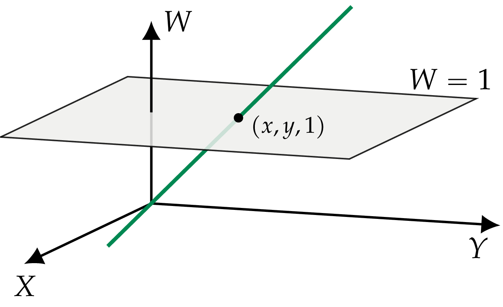
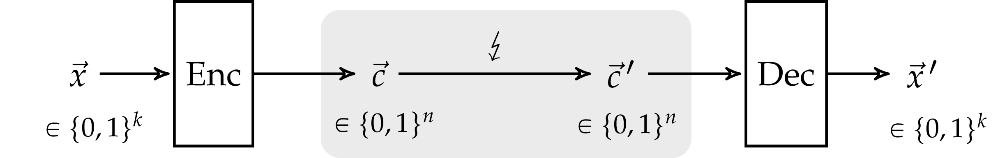

Chapter 7      

#[Chapter 7 Applications](./Chapter 7_ Applications.md)

In this chapter, we’ll learn about applications of linear algebra. We’ll cover a wide range of topics from different areas of science, business, and technology to give you an idea of the spectrum of possible calculations based on vector and matrix algebra. Don’t worry if you’re not able to follow all the details in each section—we’re taking a broad approach here, covering many different topics in the hope that some will interest you. Note that most of the material covered in this chapter is not likely to show up on your linear algebra final, so no pressure—this is just for fun.

Before we start, I want to say a few words about scientific ethics. Linear algebra is a powerful tool for solving problems and modelling the real world. But with great power comes great responsibility. I hope you’ll make an effort to think about the ethical implications when you use linear algebra to solve problems. Certain applications of linear algebra, like building weapons, interfering with crops, and building mathematically-complicated financial scams are clearly evil, so you should avoid them. Other areas where linear algebra can be applied are not so clear-cut: perhaps you’re building a satellite localization service to find missing people in emergency situations, but the same technology could be used by governments to spy on and persecute your fellow citizens. Do you want to be the person responsible for bringing about an Orwellian state? All I ask of you is to run a quick “System check” before you set to work on a project: ask yourself “Am I working for the System?” Don’t just say “It’s my job” and proceed without caution. If you find what you’re doing for your employer is unethical, then maybe you should find a different job. There are a lot of jobs out there for people who know math, and if the bad guys can’t hire qualified people like you, their power will decrease—and that’s a good thing.

Our System check is complete. On to the applications!

##[7.1 Balancing chemical equations](./Chapter 7_ Applications.md)

Suppose you’re given the chemical equation , which indicates that hydrogen molecules () and oxygen molecules () can combine to produce water molecules (). Chemical equations describe how a set of _reactants_ are transformed into a set of _products_. In this case, the reactants are hydrogen and oxygen molecules and the products are water molecules.

The equation  is misleading since it doesn’t tell us the correct _stoichiometric ratios_: how much of each type of molecule is consumed and produced. We say the equation is not _balanced_. To _balance_ the equation, we must add coefficients in front of each reactant and each product, so that the total number of atoms on both sides of the reaction is the same: . Two hydrogen molecules are required for each oxygen molecule, since water molecules contain one oxygen and two hydrogen atoms.

Let’s look at another example. The combustion of methane gas is described by the following chemical equation:

We want to answer the following two questions. How many molecules of oxygen will be consumed during the combustion of 1000 molecules of methane? How many  molecules will be produced as a result?

Before we can answer such questions, we must find the coefficients , , , and  that balance the methane-combustion equation:

For the equation to be balanced, the same number of atoms of each type must appear on each side of the equation. For the methane combustion reaction to be balanced, the following equations must be satisfied:

We can move the  and  terms to the left side of each equation and rewrite the system of equations as a matrix equation:

We’re looking for the vector of coefficients , which is the solution to the null space problem . See [4.5.6](./Chapter 4_ Geometric aspects of linear algebra.md) on page 4.5.6 for details. The RREF of  contains three pivots and one free variable. The solution to the null space problem is one-dimensional:

The solution is the span of the vector . The solution space is infinite since any balanced equation will remain balanced if we double or triple the amount of reactants and products. Choosing the coefficients as suggested by the solution to the null space problem gives , which is a balanced equation. The convention in chemistry is to choose integer coefficients for reactants and products, so we’ll multiply the equation by two to obtain the final answer:

Balancing chemical equations may not seem like the most exciting technique ever, but it’s a useful skill for many chemistry calculations. It’s a good start to know that substances  and  can transform into substances  and , but it’s better to know _how much_ of each reactant is consumed and how much of each product is produced per “unit of reaction.” Once we’ve identified one “unit of reaction,” we can calculate other quantities in terms of it, such as measuring the energy released per unit of reaction. The combustion of \[mol\] ( molecules) of methane produces \[kJ\] of heat:

![\textrm{C}\textrm{H}_4 + 2\textrm{O}_2  
\; \to \;  
\textrm{C}\textrm{O}_2 + 2\textrm{H}_2\textrm{O}  \; \;  + \; 890\,\textrm{[kJ/mol]}.](../Images/3a7e9ff879341d7506ad5ea5dfb0668c52b16f20.png)

Now _this_ is cool. If you’re heating your chalet with methane gas, and you know how many joules of heat you’ll need, then the balancing chemical equation will help you calculate how many litres of methane you need to stock in order to survive this winter.

###[Exercises](./Front matter.md)

The exercises below aren’t difficult, so you should totally try to solve them. Plus, they’ll give you some extra practice with the Gauss–Jordan elimination procedure. It’s been _ages_ since[Chapter 3](./Chapter 3_ Computational linear algebra.md), so a refresher can’t hurt.

Watch out, chemistry is coming at ya! Can you handle it?

E7.1 Balance the chemical equation .

E7.2 Balance the equation .

##[7.2 Input–output models in economics](./Chapter 7_ Applications.md)

Suppose you’re the top economic official of a small country and you want to make a production plan for the coming year. For the sake of simplicity, let’s assume your country produces only three commodities: electric power, wood, and aluminum. Your job is to choose the production rates of these commodities: , , and . Your country must produce enough to satisfy both the internal demand and the external demand for these commodities. The problem is complicated because the production rates in one industry may affect the production rates of other industries. For instance, it takes some electric power to produce each unit of aluminum, so your production plan must account for both external demand for electric power, as well as _internal demand_ for electric power for aluminum production. When complex interdependences exist between the different internal industries, as is often the case, it makes the process of picking the right production rates more complex.

In reality, most high-ranking government officials make their decisions about which industry to sponsor based on the dollar amounts of the kickbacks and bribes they received during the previous year. Let’s ignore reality for a moment and assume you’re an honest economist interested in using math to do what is right for the country instead of abusing your position of power like a blood-thirsty leech.

Let’s assume the electric production  must satisfy an external demand of  units, plus an additional  units for each unit of wood produced (electricity needed for saw mill operations) and an additional  units for each unit of aluminum produced. The wood production must be  units plus additional small amounts that depend on  and  (wood for construction). The production of aluminum must match  units of external demand plus an additional  units for each unit of electric power (for repairs of electric cables). We can model the interdependence between the industries using the following system of equations:

You can use linear algebra to solve this complicated industry interdependence problem and choose appropriate production rates. Express the system of equations as a matrix equation:

This is known as a _Leontief input-output model_ in honour of Wassily Leontief, who first applied linear algebra techniques to economics, and was awarded the Nobel prize for this contribution.

To find the appropriate production rates, we must solve for the unknown  in the above equation. The equation  is a little unusual, but we can solve it using standard techniques:

The solution to the electricity, wood, and aluminum production scenario is . See [3.6](./Chapter 3_ Computational linear algebra.md) for the details of the solution.

Note the electricity production rate is significantly higher than the external demand, in order to account for the internal demand of electricity for the aluminum production.

####[Links](./Front matter.md)

\[ History of the Leontief input-output model in economics \]

[`https://en.wikipedia.org/wiki/Input-output_model`](./Input-output_model.md)

###[Exercises](./Front matter.md)

E7.3 A group of farmers has formed a cooperative that specializes in three crops: arugula (_eruca sativa_), broccoli, and carrots. They need to produce 10 tons of arugula, 200 tons of broccoli, and 300 tons of carrots for sale. The farmers also need some additional production to feed themselves and the work-for-food tourists that come to help them scale up production during the harvest season. To feed the workers needed to grow 100 kg of arugula, they need to produce an extra 10 kg of broccoli and 10 kg of carrots. To produce 100 kg of broccoli, it takes 1 kg of arugula and 15 kilograms of carrots. To produce 100 kg of carrots, it takes 1 kg of arugula and 20 kilograms of broccoli. How much of each vegetable should the farmers produce?

##[7.3 Electric circuits](./Chapter 7_ Applications.md)

We can use Ohm’s law to solve many circuit problems. To _solve_ a circuit is to find the current flowing in each wire in the circuit, and the value of the voltage at every point in the circuit. Ohm’s law, , tells us the voltage  required to “push” a current  through a resistor with resistance . This simple equation is all we need to find the currents and voltages of any electric circuit involving wires, batteries, and resistors.

Since we’re in Math Land, the units of the circuit quantities won’t play a direct role in our analysis; but we’ll still introduce them, since units will help us perform dimensional analysis of the equations. Voltages are measured in volts \[V\], currents are measured in Amperes \[A\], and resistance is measured in Ohms [\]. Intuitively, the resistance of a resistor measures how difficult it is to “push” current through it. Indeed, the units for resistance have the dimensions of Volt per Ampere: ![[\Omega]=[\textrm{V}/\textrm{A}]](../Images/f9583bd165d27fdc3d6183f88738808c7a0ad3a6.png). The equation  tells us how much current \[A\] flows through a resistor with resistance [\] connected to a voltage source with potential \[V\]. Alternatively, if we know the current \[A\] and the resistance [\], we can find , the voltage applied to the resistor. A third way to use the equation  is to solve for the resistance  in cases when we know both  and .

#####[Example](./Front matter.md)

Your friend gives you a 121[\] light bulb (a resistor) and asks you to connect it outdoors on the backyard porch to provide some extra lighting for a summer party. You run to the basement and find three different spools of electric wire: a green wire rated for currents of up to \[A\], a blue wire rated for currents of up to \[A\], and a red wire rated for currents of up to \[A\]. Knowing that the voltage coming out of the wall socke[1](./Front matter.md) is \[V\], what is the lowest-rating wire you can use to connect the light bulb?

A simple calculation using  shows us that the current flowing through the lightbulb is ![I = \frac{V}{R} = \frac{110[\textrm{V}]}{121[\Omega]} = 0.909](../Images/3e0c4842d648d05f64923bce730797a46bf69198.png)\[A\]. Thanks to your calculation, you choose the blue wire rated for \[A\] knowing you won’t have problems with wires overheating and causing a fire.

It can be difficult to solve for all the voltages and currents in electric circuits that contain multiple voltage sources (batteries) and resistors (light bulbs), like the circuit shown in[Figure 7.1](./Chapter 7_ Applications.md). Using the equation  for each resistor leads to several equations that must be solved simultaneously to find the unknowns. Did someone say “system of linear equations”? Linear algebra to the rescue!

Figure 7.1: An electric circuit with three batteries and three resistors.

Knowing linear algebra will enable you to solve even the most complicated circuit using row operations (Gauss–Jordan elimination) in one or two minutes. We’ll illustrate this application of linear algebra by solving the example circuit shown on the right, which involves three batteries (the parallel lines labelled  and ) and three resistors (the wiggly lines).

###[Background](./Front matter.md)

Before we get started, let me introduce the minimum information you need to know about circuits: _Kirchhoff’s voltage law_ and _Kirchhoff’s current law_.

The voltages in a circuit are related to the electric potential energy of the electrons flowing in the circuit. The electric potential is analogous to the concept of gravitational potential: a battery raises the electric potential of electrons like an elevator raises the gravitational potential of objects by increasing their height. Starting from this heightened potential, electrons flow through the circuit and lose potential when they pass through resistors. _Kirchhoff’s voltage law_ (KVL) states that the sum of the voltage gains and losses along any _loop_ in the circuit must sum to zero. Intuitively, you can think of KVL as a manifestation of the _conservation of energy_ principle: the potential gained by electrons when they pass through batteries is lost in the resistors (in the form of heat). By the time the electrons complete their journey around any loop in the circuit, they must return to their initial potential.

_Kirchhoff’s current law_ states that the total current flowing into a wire junction must equal the total current flowing out of the junction. You can think of this as a manifestation of the _conservation of charge_ principle: the total charge coming into a junction equals the total charge flowing out of the junction, because charges cannot be created or destroyed.

Recall that to solve a circuit is to find the currents that flow in each wire and the voltage across each resistor. We’ll now illustrate how to solve a complicated circuit by introducing current variables, applying Kirchhoff’s laws to obtain systems of linear equations, and solving these equations using linear algebra.

###[Using linear algebra to solve circuits](./Front matter.md)

The first step is to define variables for each of the quantities of interest in the circuit as shown in[Figure 7.2](./Chapter 7_ Applications.md). We’ll call  the current that flows down through the middle wire of the circuit, which then splits into the current  in the left branch and the current  going to the right. Next we follow the currents in the circuit and label the terminals of each resistor “” and “” to indicate its _polarity_—the direction of the voltage drop across it. The rule to follow is simple: the label “” goes on the side where the current enters the resistor, and the label “” goes on the side where the current leaves the resistor. We write the “” on the side where the current enters because electric potential always _drops_ when passing through a resistor. It’s important to keep track of the polarity of resistors when writing the KVL equations for the circuit.

Figure 7.2: The circuit with branch currents labelled. Each resistor is assigned a _polarity_ relative to the current flowing through it.

We’re now in a position to apply Kirchhoff’s voltage and current laws to this circuit and obtain a set of equations that relate the unknown currents. Let’s first apply Kirchhoff’s voltage law to the loop along the path A-B-C-D-A, computing the total of the voltage gains along this path:

\\label{eqn:electric\_circuits\_abcda} Each battery produces a gain in potential for the electrons flowing through it. Each resistor leads to a drop in potential (negative gain) proportional to the current flowing through the resistor (recall $V = RI$). Similarly, we obtain a second KVL equation by following the path A-F-E-D-A in the circuit:

\\label{eqn:electric\_circuits\_afeda} We're measuring voltage \\emph{gains} along this loop, therefore the contribution of the battery is positive while the contributions of the resistors are negative. We obtain a third equation linking the unknown currents from Kirchhoff's current law applied to junction~A:

Combining the three circuit equations, we obtain a system of three linear equations in three unknowns:

Do you see where this is going? Perhaps rewriting the equations into the standard form we discussed in[Section 3.1](./Chapter 3_ Computational linear algebra.md) will help you see what is going on:

Rewriting the system of equations as an augmented matrix, we obtain:

![\left[\begin{array}{ccc|c}
R_2 & R_1 & 0 \; \; & \;  15\\
R_2 & 0 & R_3 \; \; & \;  20\\
1 & -1 & -1 \; \; & \;  0
\end{array}\right]\!.](../Images/ee067717c13d7f2611df025de851a5495de14cf3.png)

Assume the values of the resistors are [\], [\], and [\]. We substitute these values into the augmented matrix, and then find its reduced row echelon form:

![\left[\begin{array}{ccc|c}
2 & \; 1 & \; 0 \; \; & 15	\\
2 & \; 0 & \; 1 \; \; & 20	\\
1 & -1 & -1 \; \; & 0
\end{array}\right]
\quad
\textrm{---{\sc rref}}\!\!\rightarrow
\quad
\left[\begin{array}{ccc|c}
1 & 0 & 0 \; \; & 7		\\
0 & 1 & 0 \; \; & 1		\\
0 & 0 & 1 \; \; & 6
\end{array}\right]\!.](../Images/b1ea9a40106fbb4709415c1d9cb5aab1f9363882.png)

The currents are \[A\], \[A\], and \[A\]. The voltage drop across  is \[V\] with polarity as indicated in[Figure 7.2](./Chapter 7_ Applications.md). The voltage drops across  and  are \[V\] and \[V\] respectively. Verify that these currents and voltages are consistent with the KVL equations we started from.

The combination of Kirchhoff’s laws and linear algebra techniques allows us to solve any electric circuit. Analyzing complicated circuits will require solving large systems of equations; but, by using matrix methods, you should be able to handle even the most complex circuit. And you can always[use `SymPy` to perform a RREF computation](./1kmYLmz.md) if it’s ever too hairy to calculate by hand.

###[Other network flows](./Front matter.md)

The same techniques we used for finding the flow of currents in circuits can also be applied to many other problems involving flow: the flow of cars on city streets, the flow of goods and services between economies, and the flow of information (data packets) through the internet. In each case, a different law governs how the flows travel through the network, yet we can use the same matrix techniques to solve the resulting systems of linear equations.

###[Exercises](./Front matter.md)

E7.4 Obtain a third KVL equation for the path A-B-C-D-E-F-A in the circuit from[Figure 7.2](./Chapter 7_ Applications.md). Combine this third equation with the KVL equations for the paths A-B-C-D-A and A-F-E-D-A given on page eqn:electric\_circuits\_abcda. Are these three equations in three unknowns sufficient to solve the circuit without using the KCL equation?

E7.5 Write the three KVL equations for the three inner loops of the circuit. Obtain the KCL equations for junctions B and C.

Combine the five equations to form a matrix equation , where  is a  matrix,  is the vector of unknown currents, and  is a vector of constants.

##[7.4 Graphs](./Chapter 7_ Applications.md)

A _graph_ is an abstract mathematical model that describes connections between a set of nodes. We call the nodes _vertices_ and the connections _edges_. The graph is defined as a pair of sets , where  is the set of vertices and  is the set of edges in the graph. We can also describe the edges by specifying the _adjacency matrix_ of the graph.

Rather than define graphs formally and in detail, we’ll look at a simple graph example to give you an idea of the main concepts and introduce graph notation.[Figure 7.3](./Chapter 7_ Applications.md) shows a small graph with five vertices and seven edges. This abstract link structure could represent many real-world scenarios: five websites and the hyperlinks between them, five Twitter accounts and their “following” relationships, or seven financial transactions between five businesses.

Figure 7.3: A simple graph with five vertices and seven edges.

The graph in[Figure 7.3](./Chapter 7_ Applications.md) is represented mathematically as , where  is the set of vertices, and        is the set of edges. Note the edge from vertex  to vertex  is represented as the pair .

###[Adjacency matrix](./Front matter.md)

The _adjacency matrix_ representation of the graph in[Figure 7.3](./Chapter 7_ Applications.md) is a  matrix  that contains information about the edges in the graph. Specifically,  if the edge  exists, otherwise  if the edge doesn’t exist:

Each row contains ones in the positions where edges exist. The adjacency matrix representation works in tandem with the integer labels of the vertices—Vertex 1 corresponds to the first row of , Vertex 2 to the second row, and so on for the other rows. We don’t need labels for the vertices since the labels can be deduced from their position in the matrix .

###[Applications](./Front matter.md)

The adjacency matrix of a graph can be used to answer certain questions about the graph’s properties. For example, powers of the adjacency matrix  tell us information about the connectivity in the graph. The number of ways to get from vertex  to vertex  in two steps is , which is the th entry of :

The number of ways to get from vertex  to vertex  in zero, one, or two steps is :

Observe that most of the graph  is well connected, except for Vertex 4, which has no inbound edges. The only way to get to Vertex 4 is if we start there.

The fact that we can discuss graph connectivity by doing matrix algebra is amazing when you think about it. The entry  tells us there are two ways to get from Vertex 4 to Vertex 1 in two steps or less. Indeed, we can either transition directly through the edge  in one step, or indirectly via Node 5 in two steps by passing through the edges  and . Rather than manually counting all possible paths between vertices, we can compute all possible paths at once using matrix algebra on the adjacency matrix .

###[Discussion](./Front matter.md)

The analysis of connectivity between vertices is useful in many domains. Graphs are used to describe network flows, matching problems, social networks, webpages, and many other applications. In all these domains, the adjacency matrix plays a key role in graph representation. In[Section 8.1.15](./Chapter 8_ Probability theory.md), we’ll study the graph of all webpages on the web, and we’ll discuss Google’s PageRank algorithm, which uses information in the adjacency matrix of the web to compute an “importance” rank for each webpage.

###[Links](./Front matter.md)

\[ Graph theory and its applications \]

[`https://en.wikipedia.org/wiki/Graph_theory`](./Graph_theory.md)

\[ More details about adjacency matrices with examples \]

[`https://en.wikipedia.org/wiki/Adjacency_matrix`](./Adjacency_matrix.md)

###[Exercises](./Front matter.md)

E7.6 Find the adjacency matrix representation of the following graphs:

1.      
2.      
3.  

E7.7 For each of the graphs in [7.4.5](./Chapter 7_ Applications.md), find the number of ways to get from vertex  to vertex  in two steps or less.

You can obtain the answer by computing the matrix .

##[7.5 Fibonacci sequence](./Chapter 7_ Applications.md)

We’ll now look at a neat trick for computing the th term in the Fibonacci sequence . The terms in the Fibonacci sequence  start with , , and then each subsequent term is computed as the sum of the two terms preceding it:

The technical term for this type of formula is a _recurrence relation_. To compute the th term in the sequence using the formula, you’ll need to perform  steps of arithmetic. But do we really need  steps to compute ? In this section we’ll learn an eigenvalue trick that allows us to compute  in just five steps of symbolic computation, no matter how big  is.

First we express the recurrence relation as a matrix product:

We can compute the th term in the Fibonacci sequence by starting from the initial column vector , and repeatedly multiplying by the matrix :

We can “extract”  from the vector  by computing the dot product of  with the vector . This dot product operation has the effect of “selecting” the second component of the vector .

Thus, we obtain the following compact formula for computing the th term in the Fibonacci sequence in terms of the th power of the matrix :

Do you remember the eigendecomposition trick for computing powers of matrices by only computing powers of their eigenvalues? We can use the eigendecomposition trick to compute  very efficiently. The first step is to find the eigendecomposition of the matrix :

The two eigenvalues of  are  (the golden ratio), and  (the negative inverse of the golden ratio). The columns of  contain the corresponding eigenvectors of .

We can compute  using the following formula:

To compute  it is sufficient to compute the th powers of the eigenvalues  and . For example, to compute , the fifth element in the Fibonacci sequence, we compute  using , then use the formula :

![\begin{align*}
a_5 
& =
\begin{bmatrix} 0 & 1 \end{bmatrix}\!\!
\begin{bmatrix}
1   &  1 \\
1   & 0
\end{bmatrix}^{\!5} \!
\begin{bmatrix} 1 \\ 0 \end{bmatrix}								\\
& =
\begin{bmatrix} 0 & 1 \end{bmatrix}
\!
Q
\begin{bmatrix}
\varphi^5 		& 0 					\\
0			& \frac{-1}{\varphi^5}
\end{bmatrix}
\!
Q^{-1}
\begin{bmatrix} 1 \\ 0 \end{bmatrix}								\\
& =
\begin{bmatrix} 0 & 1 \end{bmatrix}
\!\!
\begin{bmatrix}
8   &  5 \\
5   & 3
\end{bmatrix}
\!\!
\begin{bmatrix}1 \\ 0 \end{bmatrix}
=
\begin{bmatrix} 0 & 1 \end{bmatrix}
\!\!
\begin{bmatrix}8 \\ 5 \end{bmatrix}
=
5.
\end{align*}](./images/9fafb718c2eeaeac0d61364daf94592edaf4bccf.png)

We can similarly compute :

then compute  using the formula,

The eigendecomposition trick allows us to take a mathematical shortcut by obtaining the answer  using a constant number of math operations—regardless of the size of :

First compute the th power of . Then multiply  by  on the left, and by  on the right. This is interesting since other algorithms for computing the Fibonacci numbers usually require a number of steps proportional to the size of .

There are some caveats to the approach outlined above. We assumed computing  and  could be done in a single operation, which is not a realistic assumption on any computer. Computing the power of a number usually takes several multiplication steps, so we’re kind of cheating when we count computing  as a single step. Also, infinite-precision (symbolic) manipulations are not realistic either since computers work with finite-precision approximations to real numbers, so the eigenvalue trick will not work for large values of . Basically, the eigenvalue trick is only a theoretical result and can’t be used in practical programs.

####[Links](./Front matter.md)

\[ See the Wikipedia page for more on the Fibonacci numbers \]

[`https://en.wikipedia.org/wiki/Fibonacci_number`](./Fibonacci_number.md)

###[Exercises](./Front matter.md)

E7.8 Recall the Fibonacci sequence . Describe what happens to the ratio  as .

Compare the size of  and  for large values of .

E7.9 Compute the matrix products in the expression  to obtain a closed-form expression for .

You can simplify expressions that contain square roots in the denominator as follows: .

##[7.6 Linear programming](./Chapter 7_ Applications.md)

In the early days of computing, computers were primarily used to solve optimization problems, so the term “programming” is often used to describe optimization problems. _Linear programming_ is the study of linear optimization problems that involve linear constraints. These types of optimization problems play an important role in business: the whole point of corporations is to constantly optimize profits subject to time, energy, and legal constraints.

Many optimization problems can be expressed as _linear programs_. To solve an optimization problem is to find the optimal value, which is either the maximum or the minimum of some function, called the _objective function_. In a linear program, the objective function is a multivariable linear function  and the constraints on the variables of the problem are also linear. A linear program with  variables and  constraints is expressed as a maximization problem,

subject to  linear constraints,

The solution to this linear program is the vector  that makes  as large as possible, and also satisfies all the constraints. For example, the variables  could represent the production rates of  different products made by a company. If the coefficients  represent the selling price for each of the  products, then  represents the revenue generated by selling  units of product , and  represents the total revenue for a given choice of production rates. The  inequalities could represent various limitations of human resources, production capacity, or logistics constraints. To solve the linear program is to find the production rates  that maximize revenue, subject to the constraints.

The _simplex algorithm_ is a systematic procedure for finding solutions to linear programming problems. The simplex algorithm is somewhat similar to the Gauss–Jordan elimination procedure since it uses row operations on a matrix-like structure called a _tableau_. For this reason, linear programming and the simplex algorithm are often forced upon students taking a linear algebra course, especially business students. I’m not going to lie to you and tell you the simplex algorithm is very exciting, but it is very powerful. For this reason, you should know it exists, and develop a general intuition about how it works. And, as with all things corporate-related, it’s worth learning about so you’ll know the techniques of the enemy.

Since the details of the simplex algorithm might not be of interest to all readers of the book, I split the topic of linear programming into a separate tutorial, which you can read online at the link below.

\[ Linear programming tutorial \]

[`https://minireference.github.io/linear_programming/tutorial.pdf`](./tutorial.pdf.md)

##[7.7 Least squares approximate solutions](./Chapter 7_ Applications.md)

An equation of the form  could have exactly one solution (if  is invertible), infinitely many solutions (if  has a null space), or no solution at all (if  is not in the column space of ). In this section, we’ll discuss the case with no solution, and describe an approach for computing an _approximate_ solution  such that the vector  is as close as possible to .

We could jump right away to the formula for the least squares approximate solution (), but this would hardly be enlightening or useful for your understanding. Instead, let’s learn about the least squares approximate solution in the context of a machine learning problem in which we’ll try to predict some unknown quantities based on a linear model learned from past observations. This is called _linear regression_ and it’s one of the most useful applications of linear algebra.

Your company’s database of current clients contains all the information about the frequency of purchases , value of purchases , promptness of payment , and other useful information. You know what is _really_ useful information, though? Knowing the customer lifetime value (CLV)—the total revenue this customer will generate during their entire relationship with your company. You have data on the CLVs of existing customers and you want to leverage this data to predict the CLVs of new customers.

Suppose you have data for  existing customers in the form of vectors, expressed as , and you calculate a customer lifetime value (CLV) for each existing customer, . The resulting dataset consists of observations  and outcomes :

The clients’ observational data is stored in an  matrix , and the corresponding CLVs are stored as an  column vector .

#####[Statement of the problem](./Front matter.md)

Given the  of a new customer, predict the customer’s , based on the information in the dataset .

###[Linear model](./Front matter.md)

A simple way to model the dependence of the label  on the observational data  is to use a linear model with  parameters :

If your model is accurate, then  will closely approximate . But how can we measure the accuracy of the approximation?

Let’s define _error terms_ that measure how the model’s predictions  differ from the observed values . The error term for the th customer is

The expression  measures the _squared error_ between the model’s prediction and the known value. Our goal is to choose a model that makes the sum of all the error terms as small as possible:

We’ll refer to the function  as the _objective function_, which is the usual terminology for optimization problems. Our goal is to choose the value of  that minimizes , the _sum of squared errors_ of the model’s predictions.

Intuitively, it makes sense to minimize the objective function  because it captures how the predictions of the model  differ from the values . The objective function will be zero () if the model _perfectly_ predicts the data. On the other hand, any model prediction  that overshoots or undershoots the correct  value will lead to a large error term: . Observe that the objective function  is a quadratic function: the error terms grow quadratically with the size of the discrepancy between the model and the actual values.

###[Linear algebra formulation](./Front matter.md)

When faced with an unfamiliar problem (such as finding the approximate solution to a system of equations  using a quadratic error model) don’t become alarmed. Stand your ground and try relating the problem to something you’re more familiar with. Thinking about problems in terms of linear algebra can often unlock your geometric intuition and show you a path toward the solution.

Using a matrix-vector product, we can express the “vector prediction” of the model  for the whole dataset in one shot: . The total squared error function for the model  on the dataset  can be written as the following expression:

The total squared error for the model  on the dataset  is the squared length of the vector .

In the ideal case, if the model were to perfectly match the observations, the total squared error would be zero, and the equation  would have a solution:

In practice, however, the model predictions  will never perfectly match the data , so we must be content with the approximate solution :

The _least squares approximate solution_ to this equation is chosen so as to minimize the total squared error function:

In other words, of all the possible approximate solutions , we must pick the one that makes the length of the vector  the smallest.

###[Finding the least squares approximate solution](./Front matter.md)

There are two possible approaches for finding the least squares solution, denoted . We can either use calculus techniques to minimize the total squared error , or geometry techniques to find the shortest vector .

Regardless of the approach chosen, the trick to finding the least squares approximate solution to  is to multiply the equation by  to obtain

The matrix  will be invertible if the columns of A are linearly independent, which is the case for most tall-and-skinny matrices. We can therefore solve for  by multiplying both sides of the above equation by the matrix :

Indeed, this expression is the _least squares solution_ to the optimization problem we set out to solve in the beginning of this section:

We can refer to the linear model  as the _best fit_ for the dataset  since it minimizes the sum of the prediction errors.

#####[Moore–Penrose inverse](./Front matter.md)

When we combine the particular combination of , its transpose , and the inverse operation that we used to find the approximate solution , we get what’s called the _Moore–Penrose inverse_ or _pseudoinverse_ of the matrix . We use the shorthand notation  (not to be confused with ), for the entire expression:

Applying  to both sides of the approximate equation  is analogous to solving the equation by applying the inverse,

However, the solution is approximate, since . The solution  is optimal according to the sum of squared errors criterion .

#####[Example 1](./Front matter.md)

Given the dataset with six samples : , , , , , , what is the best linear model  for predicting  given ? The first step is to express the given samples in the standard form , where  and . We then calculate the best parameter  using the Moore–Penrose inverse formula:

The best-fitting linear model for the data is . For the details of the calculation, see[`http://bit.ly/leastsq_ex1`](./leastsq_ex1.md).[Figure 7.4](./Chapter 7_ Applications.md) shows a scatter plot of the dataset  and the graph of the linear model that best fits the data.

Figure 7.4: The line of the form  that best fits the set of data points . The plot shows a scatter plot of the data points, and the line of best fit . The line passes through the middle of the dataset and minimizes the sum of the squared vertical differences between the model output  and the true value .

###[Geometric interpretation](./Front matter.md)

The solution to the least squares optimization problem,

can be understood geometrically as the search for the vector in the column space of  that is _closest_ to the vector , as illustrated in[Figure 7.5](./Chapter 7_ Applications.md). As we vary the parameter vector , we obtain different vectors . Of all the points  in the column space of , the point  is the closest to the point .

Let’s define the _error vector_ that corresponds to the difference between the model prediction  and the actual value :

Using the geometric intuition and looking at[Figure 7.5](./Chapter 7_ Applications.md), we see that the optimal solution  occurs when the error vector is perpendicular to the column space of . Recall the left fundamental subspaces of the matrix : its column space  and its orthogonal complement, the left null space . Thus, if we want an error vector that is perpendicular to , we must find an error vector that lies in the left null space of : . Using the definition of the left null space,

we obtain the following equation that defines :

Taking the transpose of the last equation, we obtain , which is equivalent to condition  used to find .

Figure 7.5: Linear regression can be seen as a “search” problem restricted to the column space of the data matrix . The least squares approximate solution  corresponds to the point in  that is closest to . For this , the error vector  is perpendicular to the column space of .

Using geometric intuition about vector spaces and orthogonality proves helpful in solving this complex optimization problem. Choosing  orthogonal to  leads to the shortest vector, , and produces the smallest total squared error, .

###[Affine models](./Front matter.md)

We can also apply the Moore–Penrose inverse formula to more complicated models. A simple extension of a linear model is the _affine model_ , which adds a constant term  to the output of a linear model. The model parameters correspond to an \-vector :

For uniformity of notation, we’ll refer to the constant term as  instead of . You can think of the parameter  as the \-intercept of the model.

To accommodate this change in the model, we must preprocess the dataset  by adding a column of ones to the matrix , turning it into  matrix . The new dataset looks like this:

Except for the preprocessing step, which is commonly called “data-massaging,” the remainder of the steps for finding a least squares solution are the same as in the case of linear regression. We find the optimal parameter vector  by applying the Moore–Penrose inverse formula:

#####[Example 2](./Front matter.md)

Find the affine model  that best fits the data points from Example 1 (page ). To find the best parameter vector , we first preprocess the dataset by adding a column of ones to the data matrix. We then apply the inverse formula:

The affine model  is the best fit. I’ve omitted the details of the matrix calculation for brevity, but you can verify everything is legit here:[`http://bit.ly/leastsq_ex2`](./leastsq_ex2.md). See[Figure 7.6](./Chapter 7_ Applications.md) for the graph of the best fitting affine model.

Figure 7.6: The affine model () that best fits the data points is the line . Allowing for one extra parameter,  (the \-intercept), results in a model that fits the data much better, as compared to the fit in[Figure 7.4](./Chapter 7_ Applications.md).

Note the terms _linear regression_ and _linear least squares_ apply to fitting both linear models , and affine models . After all, an affine model is just a linear model with a \-intercept, so it makes sense to refer to them by the same name.

###[Quadratic models](./Front matter.md)

The mathematical approach based on the Moore–Penrose inverse we used in linear regression can also be used to find approximate solutions for nonlinear models. For the sake of simplicity, let’s assume there are only two observed quantities in the dataset (). The most general quadratic model for two variables is:

The terms with coefficients , , and  describe an affine model for the variables  and , and we add additional terms with parameters , , and  to describe quadratic components in  and . The parameter vector for the most general quadratic model of two variables is six-dimensional: .

Assume we start from the following dataset:

To use the Moore–Penrose inverse formula, we must preprocess  by adding several new columns:

This preprocessing step allows us to compute a vector prediction of the model with parameters  applied to the entire dataset: . The total squared error for this model is . The least squares approximate solution  is obtained as usual: .

Note the number of parameters in a quadratic model grows—surprise, surprise—quadratically. There were  variables in the above example, and the parameters vector  is six-dimensional. The number of parameters of a general quadratic model in  variables is . The number of model parameters is an important consideration to take into account when fitting models to large datasets.

#####[Example 3](./Front matter.md)

Imagine you’re a data-friendly business person and you want to pick which model to fit to a dataset  with  features. The observational data matrix  has  rows and  columns. You have the option of choosing either an affine model, , or a quadratic model, , for the dataset.

To fit an affine model, you’ll need to preprocess  into , and then find the inverse of . That’s totally doable.

In contrast, the number of parameters in a quadratic model with  dimensions is . To fit a quadratic model, you’ll need to preprocess the data matrix to obtain , and then find the inverse of . That’s a big matrix. You’ll need one terabyte of memory just to store all the entries of the matrix , and computing its inverse will take a _really_ long time.

So the choice is made; affine model it is. The affine model may be less accurate than a quadratic model, but if it works and provides value, you can use it. This is the reason why scientists, engineers, statisticians, and business folk are so crazy about building linear models, even though more advanced models are available. Linear models are a _sweet spot_ for prediction applications: they have great modelling power, they’re easy to implement, and they lead to computational problems that are easy to solve.

###[Links](./Front matter.md)

\[ Further discussion about least squares problems on Wikipedia \]

[`https://en.wikipedia.org/wiki/Linear_regression`](./Linear_regression.md)

[`https://en.wikipedia.org/wiki/Linear_least_squares_(mathematics)`](./Linear_least_squares_(mathematics.md))

\[ More about the Moore–Penrose inverse \]

[`https://en.wikipedia.org/wiki/Moore-Penrose_inverse`](./Moore-Penrose_inverse.md)

###[Exercises](./Front matter.md)

E7.10 You want to determine whether a coin is fair, so you toss it repeatedly and record the number of times it lands heads. On the first trial, you flip the coin eight times and obtain four heads, which is a heads-to-flips ratio of . On subsequent trials you obtain heads-to-flips ratios of , , , and . Find the best-fitting linear model  to describe the number of heads in a trial with  flips.

E7.11 Find the best-fitting affine model  to the  data points , , and . Perform all the calculations by hand.

Find the Moore–Penrose inverse.

E7.12 Calculate the total squared error  of the best-fit linear model obtained in Example 1 (page ). Use the `SymPy` calculation at[`bit.ly/leastsq_ex1`](./leastsq_ex1.md) as your starting point.

The `Matrix` method `.norm()` might come in handy.

E7.13 Revisit Example 2 (page ) and find the total squared error of the best-fit affine model . You can start from the calculation provided here[`bit.ly/leastsq_ex2`](./leastsq_ex2.md) and extend it.

##[7.8 Computer graphics](./Chapter 7_ Applications.md)

Linear algebra is the mathematical language of computer graphics. Whether you’re building a simple two-dimensional game with stick figures, or a fancy three-dimensional visualization, knowing linear algebra will help you understand the graphics operations that draw pixels on the screen.

In this section, we’ll discuss some basic computer graphics concepts. In particular, we’ll introduce _homogeneous coordinates_, a representation for vectors and matrices that uses an extra dimension. Instead of representing a three-dimensional vector as a triple of Cartesian coordinates , we’ll use a four-dimensional homogeneous coordinates vector . Homogeneous coordinates allow us to represent any computer graphics transformation as a matrix-vector product. We’ve already seen that scalings, rotations, reflections, and orthogonal projections can be represented as matrix-vector products. With homogeneous coordinates, we can represent translations and perspective projections as matrix products, too. That’s very convenient, since it enables us to understand all computer graphics operations in terms of matrix multiplications.

Computer graphics is a vast subject, far more extensive than the pages allotted in this book. To keep things simple, we’ll focus on two-dimensional graphics, and only briefly touch upon three-dimensional graphics. The goal is not to teach you the commands of computer graphics APIs like OpenGL and WebGL, but to give you the basic math tools for understanding what’s happening under the hood.

###[Affine transformations](./Front matter.md)

In[Chapter 5](./Chapter 5_ Linear transformations.md) we studied various linear transformations and their representations as matrices. We also briefly discussed the class of _affine transformations_, which consist of a linear transformation followed by a translation:

In the above equation, the input vector  is first acted upon by a linear transformation , and then the output of  is translated by the displacement vector  to produce the output vector .

In this section, we’ll use _homogeneous coordinates_ for vectors and transformations, which allow us to express affine transformations as matrix-vector products in a larger vector space:

If  is an \-dimensional vector, then its representation in homogeneous coordinates  is an \-dimensional vector. The  matrix  contains the combined information about both the linear transformation  and the translation .

###[Homogeneous coordinates](./Front matter.md)

Instead of using a triple of Cartesian coordinates to represent points , we’ll use the quadruple , which is a representation of the same point in _homogeneous coordinates_. Similarly, the vector  in Cartesian coordinates corresponds to the vector  in homogeneous coordinates. Though there is no mathematical difference between points and vectors, we’ll stick to the language of points as it is more natural for graphics problems.

An interesting property of homogeneous coordinates is that they’re not unique: the vector  corresponds to a whole _set of points_ in homogeneous coordinates, , for . This makes homogeneous coordinates invariant to scaling:

This is kind of weird, but this extra freedom to rescale vectors arbitrarily leads to many useful applications.

To convert from homogeneous coordinates  to Cartesian coordinates, we divide each component by the \-component to obtain the equivalent vector , which corresponds to the point .

In the case when the underlying Cartesian space is two-dimensional, the point  is written as  in homogeneous coordinates. The homogeneous coordinates  (where ) represent the point .

This conversion between homogeneous coordinates and Cartesian coordinates can also be understood geometrically, as illustrated in[Figure 7.7](./Chapter 7_ Applications.md). The point  in homogeneous coordinates corresponds to an infinite line in the three-dimensional \-coordinate space. To obtain the Cartesian coordinates for this point, find the intersection of the infinite line with the plane .

Figure 7.7: A two-dimensional Cartesian point  corresponds to an infinite line in a three-dimensional homogeneous coordinates space . To convert a point from homogeneous coordinates to Cartesian coordinates, we must find where the infinite line intersects the plane . The homogeneous coordinates of the intersection point will have the form . The first two components of this point are the Cartesian coordinates .

To distinguish Cartesian vectors from homogeneous vectors, we’ll use capital letters like  for points and vectors in homogeneous coordinates, and lowercase letters like  when referring to points and vectors in Cartesian coordinates.

####[Affine transformations in homogeneous coordinates](./Front matter.md)

Consider the affine transformation that consists of the transformation  followed by a translation by . If  is represented by the matrix , then the affine transformation as a whole can be represented as follows:

In the homogeneous coordinates representation, the input has an additional component that contains the constant value one, and the matrix has an additional column that operates on this constant component. The result of the matrix-vector product is to add the constants  and  to the first and second coordinates:

which is exactly what translation by  is all about. As you can see, there’s nothing fancy about homogeneous coordinates. Make sure you understand the above matrix-vector products and that you’re convinced there is no new math here—just the good old matrix-vector product you’re familiar with.

###[Graphics transformations in 2D](./Front matter.md)

When points and vectors are represented in homogeneous coordinates, we can express most useful geometric transformations of the form  as  matrices in homogeneous coordinates. In addition to affine transformations we discussed above, homogeneous coordinates also allow us to perform _perspective transformations_, which are of central importance in computer graphics. The most general transformation we can perform using homogeneous coordinates is

where  corresponds to any linear transformation,  corresponds to a translation, and  is a perspective transformation.

####[Linear transformations](./Front matter.md)

Let  be the clockwise rotation by the angle  of all points in . In homogeneous coordinates, this rotation is represented as

where  is the following  matrix:

The  submatrix in the top-left corner of matrices in homogeneous coordinates can represent any linear transformation: projections, reflections, scalings, and shear transformations. The following equation shows the homogeneous-coordinates matrix representations of three linear transformations: the reflection through the \-axis , an arbitrary scaling , and a shear along the \-axis .

####[Orthogonal projections](./Front matter.md)

Projections can also be represented as  matrices. The projection onto the \-axis corresponds to the following representation in homogeneous coordinates:

####[Translation](./Front matter.md)

The translation by the displacement vector  corresponds to the matrix

Note the top-left submatrix of  contains the identity matrix; we perform the identity linear transformation and a translation by .

Figure 7.8: Illustration of the different transformations on a sample shape. Source:[`wikipedia File:2D_affine_transformation_matrix.svg`](./Transformation_matrix.md)

Rotations, reflections, shear transformations, and translations can all be represented as multiplications by  matrices.[Figure 7.8](./Chapter 7_ Applications.md) shows examples of transformations we can perform using the matrix-vector product in homogeneous coordinates. I hope by now you’re convinced that this idea of adding an extra “constant” dimension to vectors is useful. But wait, there’s more! We haven’t yet seen what happens when we put coefficients in the last row of the matrix.

####[Perspective projections](./Front matter.md)

The notion of perspective is very important in the world of visual art. For a painting to look realistic, the relative size of the objects pictured must convey their relative distance from the viewer. Distant objects in the scene are painted smaller than objects in the foreground. To transform a three-dimensional scene into a realistic two-dimensional painting, we need to apply a _perspective transformation_. Rather than give you the general formula for perspective transformations, we’ll derive the matrix representation for perspective transformations from scratch. Trust me, it will be a lot more interesting.

We can understand perspective transformations by tracing imaginary light rays that originate from each corner of an object and travel to the eye of an observer  in a straight line (see[Figure 7.9](./Chapter 7_ Applications.md)). The image of the perspective projections is created along the path of the light ray, where the ray intersects the _projective plane_, which represents the screen where the image will form. Since we’re working in , we can draw a picture of what’s going on.

Figure 7.9: The perspective projection of a square onto a screen. Note how the side of the square that is closer to the observer appears longer than the farther side.

Let’s assume the observer is placed at the origin, , and let’s compute the _perspective transformation_ that projects points onto the line with equation . Under this perspective projection, every point  in the plane maps to a point  on the line .[Figure 7.10](./Chapter 7_ Applications.md) illustrates the situation.

Figure 7.10: The point  is the projection of the point  onto the line with equation . The ratio of lengths  must equal the ratio of lengths .

The only math prerequisite you need to remember is the general principle for _similar_ triangles: if a triangle with sides , ,  is similar to a triangle with sides , , , then the ratios of the lengths of the triangles’ sides will be equal:

Since the two triangles in[Figure 7.10](./Chapter 7_ Applications.md) are similar, we know , and therefore we directly obtain the expression for  as follows:

This doesn’t look very promising, however, since the expression for  contains a division by . The set of equations is not linear in , and therefore cannot be expressed as a matrix-product. If only there were some way to represent vectors and transformations that also allowed division by coefficients too.

Let’s analyze the _perspective transformation_ in terms of homogeneous coordinates, and see if we find anything useful:

The second equality holds because vectors in homogeneous coordinates are invariant to scalings:  for all . We can shift the factor  as we please: . In the alternate homogeneous coordinates expression, we’re no longer dividing by . This means we can represent the perspective transformation as a matrix-vector product:

Now that’s interesting. By preparing the vector  with a third component , we can force each coefficient to be scaled by , which is exactly what we need for perspective transformations. Depending on how the coefficient  is constructed, different perspective transformations can be obtained.

A _perspective projection_ transformation is a perspective transformation followed by an orthogonal projection that removes some of the vector’s components. The perspective projection onto the line with equation  is the composition of a _perspective transformation_  followed by an orthogonal projection  which simply discards the  coordinate:

Note that only the  coordinate remains after the projection. This is the desired result since we want only the “local” coordinates of the projection plane  to remain after the projection.

Certain textbooks on computer graphics discuss only the combined perspective-plus-projection transformation , as described on the right side of the above equation. I prefer to treat the perspective transformation separately from the projection, since it makes the math easier to understand. Also, by including the “depth information” (the \-coordinates) of the objects we’re projecting we can determine which objects appear in front of others.

####[General perspective transformation](./Front matter.md)

Let’s now look at the general case of a perspective transformation that projects arbitrary points  onto the line . Again, we assume the observer is located at the origin . We want to calculate the coordinates of the projected point , as illustrated in[Figure 7.11](./Chapter 7_ Applications.md).

Figure 7.11: The point  is the projection of the point  onto the line with equation . We define points  and  in the direction of line’s normal vector . The distances from the origin to these points are  and  respectively. We have .

To obtain the general perspective transformation, we’ll follow a logical reasoning similar to the special case we considered above based on the properties of similar triangles. Define  to be the projection of the point  onto the line with direction vector  passing through the origin. Using the general formula for distances (see[Section 4.1.5.3](./Chapter 4_ Geometric aspects of linear algebra.md)), we can obtain the length  from  to :

Similarly, we define  to be the length of the projection of  onto :

The last equation holds true because the point  is located on the line with equation .

By the similarity of triangles, we know the ratio of lengths  and  must equal the ratio of orthogonal distances :

We can use this fact to express the coordinates  and  in terms of the original  and  coordinates. As in the previous case, expressing points in homogeneous coordinates allows us to arbitrarily shift scale factors:

The last expression is linear in the variables  and , therefore it has a matrix representation:

This is the most general example of a perspective transformation. The “scale factor”  is a linear combination of the input coordinates: . Observe that by setting  and , we recover the perspective transformation for the projection onto the line .

###[Graphics transformations in 3D](./Front matter.md)

Everything we saw in the previous section about two-dimensional transformations also applies to three-dimensional transformations. A three-dimensional Cartesian coordinate triple  is represented as  in homogeneous coordinates. Transformations in homogeneous coordinates are represented by  matrices. An affine transformation is represented by the matrix

and the perspective transformation onto the line  with the observer at the origin is expressed as the matrix

These should look somewhat familiar to you. Affine transformations, projections, and perspective transformations are the same in 3D as in 2D, except we’re now working in a four-dimensional homogeneous coordinates space.

The best part about being able to apply the homogeneous coordinates representation to all transformations is that we can _compose_ transformations together, in a way that’s similar to building with LEGOs. We’ll learn about this in the next section.

###[3D graphics programming](./Front matter.md)

Inside every modern computer is a special-purpose processor, called the _graphics processing unit_ (GPU), which is dedicated to computer graphics operations. Modern GPUs can have thousands of individual graphics processing units called _shaders_, and each shader can perform millions of linear algebra operations per second. Think about it; thousands of processors working in parallel to calculate matrix-vector products for you—that’s a lot of linear algebra calculating power!

The reason we need so much processing power is because 3D models are made of thousands of little polygons. Drawing a 3D scene (also known as _rendering_) involves performing linear algebra manipulations on all these polygons. This is where the GPU comes in. The job of the GPU is to translate, rotate, and scale the polygons of the 3D models by placing them into the scene, and then computing what the scene looks like when projected to the two-dimensional window (the screen) through which you’re observing the virtual world. This transformation—from the model coordinates to world coordinates, and then to screen coordinates (pixels)—is carried out in a _graphics processing pipeline_.

Figure 7.12: A graphics processing pipeline for drawing 3D objects on the screen. A 3D model is composed of polygons expressed with respect to a coordinate system centred on the object. The model matrix positions the object in the scene, the view matrix positions the camera in the scene, and finally the projection matrix computes what should appear on the screen.

We can understand the graphics processing pipeline as a sequence of matrix transformations: the model matrix , the view matrix , and the projection matrix . The GPU applies this sequence of operations to each of the object’s vertices, , to obtain the pixel coordinates, , of the vertices on the screen:

In the context of computer graphics, it is customary to represent the graphics processing pipeline in the “transpose picture,” so that vertex data flows from left to right as in[Figure 7.12](./Chapter 7_ Applications.md). Instead of representing vertices as column vectors multiplied by matrices , , and  from the left, we represent vertices as row vectors multiplied by matrices , , and  from the right. All the reasoning remains the same, and all the transformation matrices described above still work; you just might need to transpose them if you’re using them in a program.

Finally, a comment on efficiency. It is not necessary to compute the matrix-vector products with , , and  for each vertex. It’s much more efficient to pre-compute a combined transformation matrix, , and apply  to each of the coordinates of the 3D objects. Similarly, when adding another object to the scene, only the model matrix needs to be modified, while the view and projection matrices remain the same.

####[Practical considerations](./Front matter.md)

We discussed homogeneous coordinates and the linear algebra transformations used for computer graphics. This is the essential theory you’ll need in order to get started with computer graphics programming. The graphics pipelines used in modern 3D software involve a few more steps than the simplified version shown in[Figure 7.12](./Chapter 7_ Applications.md). We’ll now discuss some points and practical considerations for programming computer graphics on real GPUs:

-   There are actually _two_ graphics pipelines at work in the GPU. The _geometry pipeline_ handles the transformation of polygons that form the 3D objects. A separate _texture pipeline_ controls the graphics patterns that fill the polygons. The final step in the rendering process combines the outputs of the two pipelines.
-   The model and view matrices can be combined to form a single model-view matrix that converts object coordinates to camera coordinates.
-   Not all objects in the scene need to be rendered. We don’t need to render objects that fall outside the camera’s viewing angle. We can also skip objects that are closer than the _near plane_ or farther than the _far plane_ of the camera. Though the scene could extend infinitely, we’re only interested in rendering the subset of the scene that we want displayed on the screen, which we call the _view frustum_. See the illustration in[Figure 7.13](./Chapter 7_ Applications.md).

Figure 7.13: The perspective transformation that projects a three-dimensional model onto a two-dimensional screen surface. Note only a subset of the scene (the _view frustum_) is drawn, which lies between the _near plane_ and the _far plane_ within the field of view.

I encourage you to pursue the subject of computer graphics on your own. There are excellent free resources for learning OpenGL and WebGL on the web.

###[Discussion](./Front matter.md)

Homogeneous coordinates and projective geometry are powerful mathematical techniques with deep connections to many advanced math subjects. For the purpose of this section, we explored the subject from an engineering perspective—as a handy trick for working with computer graphics using matrix-vector products. Homogeneous coordinates have many other applications that we did not have time to discuss. We’ll briefly mention some of these additional applications here, with the hope of inspiring you to research the subject further.

Homogeneous coordinates are convenient for representing planes in . The plane with general equation  is represented by the vector  in homogeneous coordinates. This is a natural way to express planes. Instead of describing the plane’s normal vector  separately from the constant , we can represent the plane by an “enhanced” normal vector :

This is really cool because we can now use the same representation for both vectors and planes, and perform vector operations between them. Yet again, we find a continuation of the “everything is a vector” theme we’ve encountered throughout this book.

What good is representing planes in homogeneous coordinates? For starters, it allows us to verify whether any point  lies in the plane  by computing the dot product . The point  lies inside the plane with normal vector  if and only if . Consider the point  that lies in the plane ; we can verify that

It’s also possible to easily obtain the homogeneous coordinates of the plane  that passes through any three points, , , and . We’re looking for a vector  that is perpendicular to all three points. We can obtain  using a generalization of the cross product, computed using a four-dimensional determinant:

where  is the standard basis for . I bet you haven’t seen a four-dimensional cross product before—this stuff is wild! See the links below if you want to learn more about homogeneous coordinates, projective spaces, or computer graphics.

###[Links](./Front matter.md)

\[ A detailed tutorial series on WebGL \]

[`https://github.com/greggman/webgl-fundamentals/`](./webgl-fundamentals.md)

\[ Visualization of polygon drawing in a 3D scene \]

[`http://orbides.org/apps/superslow.html`](./superslow.md)

##[7.9 Cryptography](./Chapter 7_ Applications.md)

Cryptography is the study of secure communication. The two main tasks that cryptographers aim to achieve are private communication (no eavesdroppers) and authenticated communication (no impersonators). Using algebraic operations over finite fields , it’s possible to achieve both of these goals. Math is the weapon for privacy!

The need for private communication between people has existed long before the development of modern mathematics. Thanks to modern mathematical techniques, we can now perform cryptographic operations with greater ease, and build cryptosystems with security guaranteed by mathematical proofs. In this section, we’ll discuss the famous _one-time pad_ encryption technique invented by Gilbert Vernam. One-time pad encryption is important because Claude Shannon proved it is _absolutely secure_. In order to understand what that means precisely, we’ll first need some context about the concepts studied in the field of cryptography.

###[Context](./Front matter.md)

The secure communication scenarios we’ll discuss in this section involve three parties:

-   Alice is the message sender
-   Bob is the message receiver
-   Eve is the eavesdropper

Alice wants to send a private message to Bob, but Eve has the ability to see all communication between Alice and Bob. You can think of Eve as a Facebook administrator, or an employee of the Orwellian, privacy-invading web application _du jour_. To defend against Eve, Alice will _encrypt_ her messages before sending them to Bob, using a secret key only Alice and Bob have access to. Eve will be able to capture the encrypted messages (called _ciphertexts_) but they will be unintelligible to her because of the encryption. Assuming Bob receives the messages from Alice, he’ll be able to _decrypt_ them using his copy of the secret key. Encryption allows Alice and Bob to have _private_ communication despite Eve’s eavesdropping.

Cryptography is an interesting subject that is very pertinent in the modern age of pervasive network surveillance. Learning cryptography is a bit like learning kung fu for self defence. You don’t need to go around beating people up, but you should know how to defend yourself in case something happens. I encourage you to learn more about practical cryptography for your communications. Knowing some basics about passwords, secret keys, digital signatures, and certificates will help you keep pace with the forces out there.

The material in this section only scratches the surface of all there is to learn about cryptography; it serves to illustrate the main concepts through a simple example: the _one-time pad_ encryption protocol. This simple encryption scheme is provably unconditionally secure, given some assumptions about the secret key .

###[Definitions](./Front matter.md)

A cryptographic protocol consists of an encryption function, a decryption function, and a procedure for generating the secret key . For simplicity we assume messages and keys are all binary strings:

-   : the _message_ or _plaintext_ is a bitstring of length 
-   : the _key_ is a shared secret between Alice and Bob
-   : the _ciphertext_ is the encrypted message
-   : the encryption function that takes as input a message  and the key  and produces a ciphertext  as output
-   : the decryption function that takes as input a ciphertext  and the key  and produces the decrypted message  as output

We consider the protocol to be secure if Eve cannot gain any information about the messages  from the ciphertexts  she intercepts.

Before we describe the one-time pad encryption protocol and discuss its security, we must introduce some background about binary numbers.

###[Binary](./Front matter.md)

The cryptographic operations we’ll discuss in this section apply to information encoded _in binary_. A _bit_ is an element of the binary field, a finite field with two elements . A _bitstring_ of size  is an \-dimensional vector of bits . For notational simplicity, we denote bitstrings as  instead of using the usual vector notation . For example,  is a bitstring of length .

All information in modern digital systems is encoded in binary. Every file on your computer consists of long sequences of bits that are copied between disk memory, RAM, caches, and CPU registers. For example, using the ASCII encoding convention, the character `a` is encoded as the bitstring , and the character `b` is encoded as . We can express a message that consists of several characters by concatenating the bitstrings that correspond to each character, like so:

For example, if the secret message  is the text `beer@18h`, we’ll represent it as a sequence of eight chunks of eight bits each, making for a bitstring of total length :

Representing the text `beer@18h` as a \-dimensional binary vector allows us to manipulate it using linear algebra operations. This may sound like a little thing—a convenience at best—but it’s actually a big deal since it opens the door to many applications.

In this section we’ll describe how basic vector operations on bitstrings can be used for cryptography. In the next section, we’ll learn about _error-correcting codes_, which apply matrix operations on binary information vectors to protect them from noise.

###[The XOR operation](./Front matter.md)

The XOR operation, usually denoted , corresponds to addition in the finite field :

[Table 7.1](./Chapter 7_ Applications.md) shows the results of the XOR operation on all possible combinations of inputs.

0

1

0

0

1

1

1

0

Table 7.1: The XOR operation  applied to all possible binary inputs.

The XOR operation acting on two bitstrings of the same length is the XOR operation applied to each of their elements:

The XOR operation isn’t anything new—it’s just the normal vector addition operation for vectors with components in the finite field .

Intuitively, you can think of XOR as a “conditional toggle” operation. Computing the XOR of a bit  with  leaves the bit unchanged, while computing the XOR with  toggles the bit, changing  to  or  to . To illustrate this “toggle” effect, consider the bitstring  and the results of XOR-ing it with the all-zeros bitstring , the all-ones bitstring , and a random-looking bitstring :

In the first case, none of the bits are flipped; in the second case all the bits are flipped; and in the third case only the second and fourth bits are flipped.

An important property of the XOR operation is that it is its own inverse: , for all . In particular, if XOR-ing the bitstring  with some bitstring  produces , then XOR-ing  with  recovers the original vector :

This statement follows from the self-inverse property of the XOR operation and the associative law for vector addition:

The self-inverse property of the XOR operation is the basis for the one-time pad encryption and decryption operations.

###[One-time pad cryptosystem](./Front matter.md)

The one-time pad encryption scheme is based on computing the XOR of the message  and the secret key , which has the same length as the message. The security of the protocol depends crucially on how the secret key  is generated, and on how the key is used:

-   The key must be kept secret. Only Alice and Bob know .
-   The key must be random: the value of each bit of the key  is random;  with probability 50%, and  with probability 50%.
-   Alice and Bob must _never reuse_ the secret key.

####[One-time pad encryption](./Front matter.md)

To obtain the ciphertext  for the message , Alice computes the XOR of  and the secret key :

####[One-time pad decryption](./Front matter.md)

Upon receiving the ciphertext , Bob decrypts it by computing the XOR with the secret key:

From the self-inverse property of the XOR operation, we know XOR-ing any bitstring with the secret key  twice acts like the identity operation: .

####[Discussion](./Front matter.md)

Observe that using this encryption method to send an \-bit message requires  bits of secret key. Since bits of the secret key cannot be reused, we say that sending  bits securely “consumes”  bits of secret key. This notion of secret keys as a “consumable resource” is an important general theme in cryptography. Indeed, coming up with encryption and decryption functions is considered the easy part of cryptography, and the hard parts of cryptography are _key management_ and _key distribution_.

Consider a practical use of the one-time pad encryption scheme. Sending multiple messages , ,  requires multiple secret keys ,  that Alice uses when she wants to communicate with Bob. Imagine a pad of paper; each page of the pad contains one secret key . Since keys cannot be reused, Alice must keep flipping through the pad, using the key from each page only once. This is where the name “one-time pad” comes from.

###[One-time pad security](./Front matter.md)

Security definitions in cryptography are based on different assumptions about the powers of the eavesdropper Eve. We need to formally define what _secure_ means, before we can evaluate the security of any cryptosystem. Modern cryptography is a subfield of mathematics, so we shouldn’t be surprised if the definition of security is stated in mathematical terms.

#####[Definition: Indistinguishability under chosen-plaintext attack (IND-CPA)](./Front matter.md)

A cryptosystem is considered secure in terms of indistinguishability if no eavesdropper can distinguish the ciphertexts of two messages  and  chosen by the eavesdropper, with a probability greater than guessing randomly.

This is one of the strongest security standards we can expect from a cryptosystem. It is also the simplest to understand. This definition of security can be understood as a game played between Alice and Eve. Suppose Eve can force Alice to send only one of two possible messages  or . Every time Eve sees a ciphertext , she must guess whether Alice sent  or . We want to compare an Eve that has access to , with a “control Eve” that only has access to a random string  that is completely uncorrelated with the message or the ciphertext. A cryptosystem is secure, according to the _indistinguishability under chosen-plaintext_ security definition, if the Eve with access to  is no better at distinguishing between messages  and  than she is at guessing randomly (which is the best that “control Eve” can do).

We won’t go into the formal details of the math, but we need to specify exactly what we mean by “with a probability greater than guessing randomly.” Control Eve has a completely random string , which contains no information about the message , so control Eve must guess randomly and her probability of success is . An Eve that can distinguish the ciphertext  from the ciphertext  with a probability significantly greater than  is considered to have an advantage in distinguishing the ciphertext. Any such scheme is not considered secure in terms of IND-CPA. Intuitively, the IND-CPA definition of security captures the notion that Eve should learn no information about the message  after seeing its ciphertext .

#####[Sketch of security proof](./Front matter.md)

The one-time pad encryption system is secure according to IND-CPA because of the assumption we make about the shared, secret key —namely that it is generated randomly. Each bit  takes on the binary value  with probability 50%, and the value  with probability 50%.

Eve knows the plaintext of the two possible messages  and , but she can’t tell which message was sent from the ciphertext  since she can’t distinguish between two equally likely alternative scenarios. In Scenario 1, Alice sent , and the secret key is , where . In Scenario 2, Alice sent , and the secret key is , where . The XOR operation combines the randomness of  with the randomness in the secret key , so trying to distinguish whether  or  was sent is just as difficult as distinguishing  and . Since  is completely random, Eve is forced to guess randomly. Thus the probability of determining the correct message is no better than guessing, which is precisely the requirement for the definition of security.

The randomness of the shared secret key is crucial to the security of the one-time pad encryption scheme. In general, we can think of _shared randomness_ (shared secret key) as a communication resource that allows for mathematically-secure private communication between two parties. But what if Alice and Bob don’t have access to shared randomness (that is, to some shared secret)? In the next section, we’ll introduce a different type of cryptosystem that doesn’t depend on a shared secret between Alice and Bob.

###[Public key cryptography](./Front matter.md)

Assume Alice and Bob are dissidents in two neighbouring countries who want to communicate with each other, but they can’t trust the network that connects them. If the dissidents cannot meet in person, obtaining a shared secret key to use for encryption will be difficult. They can’t send the secret key  over the network because the eavesdropper will see it, and thus be able to decrypt all subsequent encrypted communications between the dissidents. This is a major limitation of all cryptosystems in which the same secret is used to encrypt and decrypt.

Do not despair dear readers, the System hasn’t won yet: the dissidents can use _public-key_ cryptography techniques to share a secret key over the untrusted network, in plain view of all state and non-state sponsored eavesdroppers. The security of public-key cryptosystems comes from some clever math operations (which are performed in a finite field), and the computational difficulty of “reversing” these mathematical operations for very large numbers. For example, the security of the _Rivest–Shamir–Adleman_ (RSA) cryptosystem depends on the difficulty of factoring integers. It’s easy to compute the product of two integers  and ; but given only the product , it is computationally difficult to find the factors  and . For very large prime numbers  and , even the letter agencies will have a difficult time finding the factors of . This means ordinary citizens can use the power of math and cryptography to defend against corporate spying and the police state. Understanding cryptography will become increasingly important in the 21st century.

####[Definitions](./Front matter.md)

In a public-key cryptosystem, the secret key is actually a pair of keys, , where  is the public encryption key and  is the private decryption key. The same encryption function, called , is used for both encryption and decryption, but with different keys.

To use public-key cryptography, each communicating party must generate their own public-private key pairs. We’ll focus on Alice, and assume Bob performs analogous steps. Alice generates a public-private key pair , and then shares the public part of the key with Bob. Note the public key can be shared openly, in plain sight, and it’s not a problem if Eve intercepts it—this is why it’s called a public key—everyone is allowed to know it.

####[Encryption](./Front matter.md)

Bob uses Alice’s public encryption key whenever he wants to send Alice a secret message. To encrypt message , Bob uses the function  and Alice’s public encryption key  as follows:

When Alice receives the ciphertext , she uses her private key  (that only she knows) to decrypt the message:

Observe that public-key cryptosystems are inherently many-to-one: anyone who knows Alice’s public key  can create encrypted messages that only she can decode.

####[Digital signatures](./Front matter.md)

Alice can also use her public-private key pair to broadcast one-to-many _authenticated_ statements , meaning receivers can be sure the statements they receive were sent by Alice. The math is the same; we just use the keys in the opposite order. Alice encrypts the statement  to produce a ciphertext,

then publishes the encrypted post  to her blog or a public forum. Everyone who knows Alice’s public key  can decrypt the post  to obtain the statement :

The interesting property here is that we can be sure the statement  was sent by Alice, since only she controls the private key . This digital signature scheme makes it difficult for any third parties to impersonate Alice, since they don’t know Alice’s private key . This is the principle behind _digital signatures_ used in the delivery of software updates.

We don’t have space in this section to delve deeper into public-key cryptography, but we’ll illustrate the main ideas through an example.

####[Example: ssh keys for remote logins](./Front matter.md)

The secure shell protocol allows users to login to remote hosts. To login as `user` on the server `remotehost.com`, run the command `ssh user@remotehost.com` on the command prompt. The remote host will usually ask you for a password before it lets you login.

Passwords are the weakest form of authentication. Given enough effort, it’s always possible for an attacker to guess your password. Furthermore, people tend to use the same password for multiple accounts, meaning that if one account is compromised then all accounts will be compromised. In this section, we’ll describe a more secure approach for `ssh` logins based on public key authentication.

Setting up key-based authentication for `ssh` requires that steps are performed on your machine and on the remote server. Commands prefixed with `laptop>` should be typed on your local machine, while commands that start with `remotehost>` are to be executed on the remote server. Note these commands assume a UNIX environment. If you’re using a Windows machine, I recommend you install[`cygwin`](./www.cygwin.com.md) to obtain the same functionality.

The first step is to generate an `ssh` private-public key pair in the subdirectory called `.ssh` inside your home directory:

laptop> cd ~                           # go to you home dir ~
laptop> mkdir .ssh                     # create a .ssh subdir
laptop> ssh-keygen -t rsa -b 4096      # generate an RSA key pair

Accept the defaults for the questions you’re asked, and be sure to set a password to protect your `ssh` private key. A new public key pair will be created in the directory `~/.ssh/`. The private key is contained in the file `~/.ssh/id_rsa`, and the corresponding public key is in the file `~/.ssh/id_rsa.pub`. You can confirm that these files exist by running the command `ls .ssh`. Additionally, you can ensure that these files have restrictive access permissions by issuing the command,

laptop> chmod -R go-rwx .ssh 

This command has the effect of recursively (`-R`) changing permissions for users in the same group (`g`) as you and other (`o`) users, by removing (`-`), read (`r`), write (`w`), and execute (`x`) permissions. Basically, nobody other than you should be allowed to touch these files.

Another useful command to know involves adding the private key to a “key chain,” which is a temporary store of credentials tied to your current login session on your laptop:

laptop> ssh-add -K ~/.ssh/id\_rsa    # add priv. key to keychain 

This command will prompt you to enter the password you used when generating the `ssh` key pair. Now that the private key is on your keychain, you won’t be prompted for a password for a little while.

Next, copy the public key `~/.ssh/id_rsa.pub` from your laptop to the remote server. You can do this via the command `scp` as follows:

laptop> scp id\_rsa.pub user@remotehost:~/key\_from\_laptop.pub 

You’ll need to substitute `user` and `remotehost` with the actual username and hostname (or IP address) of the remote server for which you want to set up the ssh-key login.

The final step is to place the public key information in a special file called `~/.ssh/authorized_keys`, located on the remote host. You can do this using the following commands:

laptop> ssh user@remotehost
remotehost> cd ~
remotehost> mkdir .ssh
remotehost> cat key\_from\_laptop.pub >> .ssh/authorized\_keys 
remotehost> chmod -R go-rwx .ssh 

Inspect the resulting file and you’ll see it contains a copy of the public key from your laptop. Now, if you log out of the remote host and try reconnecting to it using `ssh user@remotehost.com`, you’ll be logged in automatically without needing to enter a password.

Once you’ve set up your login using `ssh` keys for your server, it’s a good idea to completely disable password logins. In general, this is the best approach for ensuring security, and many hosting services only support logins using `ssh` keys.

###[Discussion](./Front matter.md)

We’ll conclude with some basic advice for programmers who want to use cryptography in their software. Rather than trying to roll your own crypto functions, keep in mind it’s best to use established libraries. Libraries are good for you—there are many ways cryptosystems can fail, and experts have thought about defending against many potential attacks. Don’t be a cowboy programmer—use the libraries.

###[Links](./Front matter.md)

\[ Signal is a secure messaging app for mobile \][`https://whispersystems.org/`](./whispersystems.org.md)

\[ Public-key cryptography general concepts \][`https://en.wikipedia.org/wiki/Public-key_cryptography`](./Public-key_cryptography.md)

###[Exercises](./Front matter.md)

E7.14 Alice wants to send the message  to Bob. They have pre-shared the secret key . Compute the ciphertext  that Alice will send to Bob. Verify that Bob will obtain the correct message after decrypting.

##[7.10 Error-correcting codes](./Chapter 7_ Applications.md)

The raw information-carrying capacity of a DVD is roughly 5.64GB; which is about 20% more than the 4.7GB of data that your computer will let you write to it. Why this overhead? Are DVD manufacturers trying to cheat you? Actually, they’re looking out for you; the extra space is required for the _error-correcting code_ that is applied to your data before writing it to the disk. Without the error-correcting code, even the tiniest scratch on the surface of the disk would make the disk unreadable, destroying your precious data. In this section, we’ll learn how error-correcting codes work.

Error-correcting codes play an essential part in the storage, the transmission, and the processing of digital information. Even the slightest change to a computer program will make it crash—computer programs simply don’t like it when you fiddle with their bits. Crashing was the norm back in the 1940s as illustrated by this quote:

> “Two weekends in a row I came in and found that all my stuff had been dumped and nothing was done. I was really annoyed because I wanted those answers and two weekends had been lost. And so I said, Dammit, **if the machine can detect an error, why can’t it locate the position of the error and correct it?**”
> 
> — Richard Hamming

Richard Hamming was a researcher at Bell in the 1940s. He ran into the problem of digital data corruption, and decided to do something to fix it. As a solution, he figured out a clever way to encode  bits of information into  bits of storage, such that it’s possible to recover the information even if some errors occurred on the storage medium. An _error-correcting code_ is a mathematical strategy for defending against erasures and errors. Hamming’s invention of error-correcting codes became a prerequisite for the modern age of computing—after all, reliable computation is much more useful than unreliable computation.

###[Definitions](./Front matter.md)

An _error-correcting code_ is a prescription for encoding _binary_ information. Recall that bits are elements of the binary field, . A bitstring of length  is an \-dimensional vector of bits . For example,  is a bitstring of length .

We use several parameters to characterize error-correcting codes:

-   : the size, or length, of the messages for the code.
-   : a _message_. Any bitstring of length  is a valid message.
-   : the size of the codewords in the code.
-   : the _codeword_ that corresponds to message .
-   A _code_ consists of  codewords , one for each of the possible messages .
-   : the _Hamming distance_ between codewords  and .
-   An  code is a procedure for encoding messages into codewords; , which guarantees the _minimum distance_ between any two codewords is at least .

The _Hamming distance_ between two bitstrings  counts the number of bits where the two bitstrings differ:

Intuitively, the Hamming distance between two bitstrings measures the minimum number of substitutions required to transform one bitstring into the other. For example, the Hamming distance between codewords  and  is , because it takes three substitutions (also called _bit flips_) to convert  to  or vice versa.

An  code is defined by a function  that encodes messages  into codewords . Usually the encoding procedure  is paired with a decoding procedure, , which recovers messages from (possibly corrupted) codewords.

Figure 7.14: An error-correcting scheme using the encoding function  and the decoding function  to protect against the effect of noise (denoted ). Each message  is encoded into a codeword . The codeword  is transmitted through a _noisy channel_ that can corrupt the codeword by transforming it into another bitstring . The decoding function  looks for a valid codeword  that is close in Hamming distance to . If the protocol is successful, the decoded message will match the transmitted message , despite the noise ().

###[Linear codes](./Front matter.md)

A code is _linear_ if its encoding function  is a linear transformation:

An  linear code encodes \-bit messages into \-bit codewords with minimum inter-codeword distance . Linear codes are interesting because their encoding function  can be implemented as a matrix multiplication. We use the following terms when defining linear codes as matrices:

-   : the _generating matrix_ of the code. Each codeword  is produced by multiplying the message  by  from the right:
    
    
    
-   : the row space of the generator matrix is called the _code space_. We say a codeword  is valid if , which means there exists some message  such that .
-   : the _parity check matrix_ of the code. The _syndrome_ vector  of any bitstring  is obtained by multiplying  by  from the left:
    
    
    
    If  is a valid codeword (no error occurred), then . If , we know an error has occurred. The syndrome information helps us correct the error.
    

We can understand linear codes in terms of the input and output spaces of the encoding function . Left multiplication of  by a \-dimensional row vector produces a linear combination of the rows of . Thus, the set of all possible codewords (called the _code space_) corresponds to the row space of .

Every vector in the null space of  is orthogonal to every codeword . We can construct a parity-check matrix  by choosing any basis for the null space for . We call  the orthogonal complement of , which means . Alternately, we can say the space of \-dimensional bitstrings decomposes into orthogonal subspaces of valid and invalid codewords: . We know  for all valid codewords . Furthermore, the _syndrome_ obtained by multiplying an invalid codeword  with the parity check matrix  can help us characterize the error that occurred, and correct it.

###[Coding theory](./Front matter.md)

The general idea behind error-correcting codes is to choose the  codewords so they are placed far apart from each other in the space . If a code has minimum distance  between codewords, then this code is robust to one-bit errors. To understand why, imagine a bubble of radius one (in Hamming distance) around each codeword. When a one-bit error occurs, a codeword will be displaced from its position, but it will remain within the bubble of radius one. In other words, if a one-bit error occurs, we can still find the correct codeword by looking for the closest valid codeword. See[Figure 7.15](./Chapter 7_ Applications.md) for an illustration of a set of codewords that are  distance apart. Any bitstring that falls within one of the bubbles will be decoded as the codeword at the centre of the bubble. We cannot guarantee this decoding procedure will succeed if more than one errors occur.

Figure 7.15: The rectangular region represents the space of binary strings of length . Each codeword  is denoted with a black dot. A “bubble” of Hamming distance one around each codeword is shown. Observe that the distance between any two codewords is greater than two (). By Observation 1, we know this code can correct any one-bit error ().

#####[Observation 1](./Front matter.md)

An \-code can correct up to  errors.

The notation  describes the _floor_ function, which computes the closest integer value smaller than . For example,  and . We can visualize Observation 1 using[Figure 7.15](./Chapter 7_ Applications.md) by imagining the radius of each bubble is  instead of .

###[Repetition code](./Front matter.md)

The simplest possible error-correcting code is the _repetition code_, which protects information by recoding multiple copies of each message bit. For instance, we can construct a  code by repeating each message bit three times. The encoding procedure  is defined as follows:

Three bit flips are required to change the codeword  into the codeword , and vice versa. The Hamming distance between the codewords of this repetition code is .

Encoding a string of messages  results in a string of codewords . We can apply the “majority vote” decoding strategy using the following decoding function , defined by

Observe that any one-bit error is corrected. For example, the message  is encoded as the codeword . If an error occurs on the first bit during transmission, the received codeword will be , and majority-vote decoding will correctly output . Since  for this repetition code, the code can correct all one-bit errors.

###[The Hamming code](./Front matter.md)

The  _Hamming code_ is a linear code that encodes four-bit messages into seven-bit codewords with minimum Hamming distance of  between any two codewords. The generator matrix for the Hamming code is

Note that other possibilities for the matrix  exist. Any permutation of the columns and rows of the matrix will be a generator matrix for a  Hamming code. We have chosen this particular  because of the useful structure in its parity-check matrix , which we’ll discuss shortly.

####[Encoding](./Front matter.md)

We’ll now look at how the generating matrix is used to encode four-bit messages into seven-bit codewords. Recall that all arithmetic operations are performed in the finite field . The message  is encoded as the codeword

similarly  is encoded into . Now consider the message , which is a linear combination of the messages  and . To obtain the codeword for this message, we can multiply it with  as usual to find . Another approach is to use the linearity of the code and add the codewords for the messages  and : .

####[Decoding with error correction](./Front matter.md)

The minimum distance for this Hamming code is , which means it can correct one-bit errors. In this section, we’ll look at some examples of bit-flip errors that can occur, and discuss the decoding procedure we can follow to extract messages—even from a corrupted codeword .

The _parity-check matrix_ for the  Hamming code is

This matrix is the orthogonal complement of the generating matrix . Every valid codeword  is in the row space of , since  for some message . Since the rows of  are orthogonal to , the product of  with any valid codeword will be zero: .

On the other hand, if the codeword  contains an error, then multiplying it with  will produce a nonzero _syndrome_ vector :

The decoding procedure  uses the information in the syndrome vector  to correct the error. In general, the decoding function can be a complex procedure that involves  and . In the case of the Hamming code, the decoding procedure is very simple because the syndrome vector  contains the binary representation of the location where the bit-flip error occurred. Let’s look at an example to illustrate how error correction works.

#####[Example](./Front matter.md)

Suppose we send the message  encoded as the codeword . If an error on the last bit occurs in transit, the received codeword will be . Computing the syndrome for , we obtain

The syndrome vector  corresponds to the binary string , which is the number one. Note we count bits from right to left when interpreting the syndrome of an error: bit one is the rightmost bit of the codeword, bit two is the second to last, and so on. This syndrome  tells us the location of the error is on bit one of the codeword, which is the rightmost bit. After correcting the error by flipping the rightmost bit, we obtain the correct codeword , which decodes to the message  that was sent.

Let’s check the error-correcting ability of the Hamming code with another single-bit error. If a bit-flip error occurs on bit four (counting from the right), the received codeword will be . The syndrome for  is , which corresponds to the number four when interpreted in binary. Again, we’re able to obtain the position where the error has occurred from the syndrome.

The fact that the syndrome tells us where the error has occurred is not a coincidence, but a consequence of deliberate construction of the matrices  and  of the Hamming code. Let’s analyze the possible received codewords , when the transmitted codeword is :

where  is a vector that contains a single one in position . Indeed a bit flip in the th position is the same as adding one in that position, since we’re working in the finite field .

In the case when no error occurs, the syndrome will be zero , because  is defined as the orthogonal complement of the code space (the row space of ). In the case when a single error occurs, the syndrome calculation only depends on the error:

If you look carefully at the structure in the parity-check matrix , you’ll see its columns contain the binary encoding of the numbers between seven and one. With this clever construction of the matrix , we’re able to obtain a syndrome that tells us the binary representation of where an error has occurred.

####[Discussion](./Front matter.md)

Throughout this section, we referred to “the”  _Hamming code_, but in fact there exists much freedom when defining a Hamming code with these dimensions. For example, we’re free to perform any permutation of the columns of the generator matrix  and the parity check matrix , and the resulting code will have the same properties as the  Hamming code discussed in this section.

The term _Hamming code_ actually applies to a whole family of linear codes. For any , there exists a  Hamming code that has similar structure and properties as the _Hamming  code_. The ability to “read” the location of the error directly from the syndrome is truly a marvellous mathematical construction particular to the Hamming code. Other types of error-correcting codes that infer the error from the syndrome vector  may require more complicated procedures.

Note that all Hamming codes have minimum distance , which means they allow us to correct  bit errors. Hamming codes are therefore not appropriate for use with communication channels on which multi-bit errors are likely to occur. There exist other code families, like the _Reed–Muller codes_ and _Reed–Solomon codes_, which can be used in noisier scenarios. For example, Reed–Solomon codes are used by NASA for deep-space communications and for error correction on DVDs.

###[Error-detecting codes](./Front matter.md)

Another approach for dealing with errors is to focus on _detecting_ the errors, rather than trying to correct them. Error-detecting codes, like the _parity-check code_, are used in scenarios where it is possible to retransmit messages. If the receiver detects a transmission error has occurred, she can ask the sender to retransmit the corrupted message. The receiver will be like, “Yo, Sender, I got your message, but its _parity_ was _odd_, so I know there was an error and I want you to send that message again.” Error detection and retransmission is how internet protocols work (TCP/IP).

The _parity-check code_ is a simple example of an error-detecting code. The _parity_ of a bitstring describes whether the number of 1s in the string is odd or even. The bitstring  has odd parity, while the bitstring  has even parity. We can compute the parity of any bitstring by taking the sum of its bits—the sum being performed in the finite field .

A simple  parity-check code is created by appending a single bit  (the parity bit) to the end of every message to indicate the parity of the message bitstring . We append  if the message has odd parity, and  if the message has even parity. The resultant message-plus-parity-check bitstring  will always have even parity.

If a single bit-flip error occurs during transmission, the received codeword  will have odd parity, which tells us the message data has been affected by noise. More advanced error-detecting schemes can detect multiple errors, at the cost of appending more parity-check bits at the end of messages.

###[Links](./Front matter.md)

\[ The Hamming distance between bitstrings \][`https://en.wikipedia.org/wiki/Hamming_distance`](./Hamming_distance.md)

\[ More examples of linear codes on Wikipedia \][`https://en.wikipedia.org/wiki/Linear_code`](./Linear_code.md)[`https://en.wikipedia.org/wiki/Hamming_code`](./Hamming_code.md)[`https://en.wikipedia.org/wiki/Reed-Muller_code`](./Reed-Muller_code.md)

###[Exercises](./Front matter.md)

E7.15 Find the codeword  that corresponds to the message  for the  Hamming code, which has the generator matrix  as given on page eqn:hamming\_code\_generator\_matrix.

E7.16 Construct the  parity check code’s encoding matrix .

##[7.11 Fourier analysis](./Chapter 7_ Applications.md)

Way back in the 17th century, Isaac Newton carried out a famous experiment using light beams and glass prisms. He showed that when a beam of white light passes through a prism, it splits into a rainbow of colours: the rainbow is red at one end, followed by orange, yellow, green, blue, and finally violet at the other end. This experiment showed that white light is made of _components_ with different colours. Using the language of linear algebra, we can say that white light is a “linear combination” of different colours.

Today we know that different colours of light correspond to electromagnetic waves with different frequencies: red light has a frequency around  THz, while violet light has a frequency around  THz. We can therefore say that white light is made of components with different frequencies. The notion of describing complex phenomena in terms of components with different frequencies is the main idea behind _Fourier analysis_.

Fourier analysis is used to describe sounds, vibrations, electric signals, radio signals, light signals, and many other phenomena. The Fourier transform allows us to represent all these “signals” in terms of components with different frequencies. Indeed, the Fourier transform can be understood as a change-of-basis operation that converts a signal from a time basis to a frequency basis:

![[\mathbf{v}]_t  
\qquad 
\Leftrightarrow 
\qquad[\mathbf{v}]_f.](../Images/0ef23ff05b427c5b9320da0f8db1c56e49c5bd6e.png)

For example, if  represents a musical vibration, then ![[\mathbf{v}]_t](../Images/32978e6e76d951d5e1da2e96c034eeda1c66da45.png) corresponds to the vibration as a function of time, while ![[\mathbf{v}]_f](../Images/2e4ec0302884d1c59de7a403cd8fb39d04d42d3b.png) corresponds to the frequency content of the vibration. Depending on the properties of the signal in the time domain and the choice of basis for the frequency domain, different Fourier transformations are possible.

We’ll study three different bases for the frequency domain based on orthonormal sets of sinusoidal and complex exponential functions. The _Fourier series_ is a representation for continuous periodic functions ; that is, functions that satisfy . The Fourier basis used in the Fourier series is the set of sines and cosines of the form  and , which form an orthogonal set. The _Fourier transform_ is the continuous version of the Fourier series. Instead of a countable set of frequency components, the frequency representation of the signal is described by a complex-valued continuous function . Instead of a continuous time parameter , certain signals are described in terms of  _samples_ from the time signal: ![\{ f[t] \}_{t\in[0,1,\ldots, N-1]}](../Images/450da87035ae3248d72ae1ee135cd2539e4eb949.png). The _discrete Fourier transform_ is a version of the Fourier transform for signals defined at discrete time samples.[Table 7.2](./Chapter 7_ Applications.md) shows a summary of these three Fourier-type transformations. The table indicates the class of functions for which the transform applies, the Fourier basis for the transform, and the frequency-domain representation used.

**Fourier transformations**

Name

Time domain

Fourier basis

Frequency domain

**FS**

s.t. 

**FT**

s.t. 

**DFT**

![f[t] \in \{ [N] \to \mathbb{R}\}](../Images/981bc6ca11cfedf0373e60d7a98257339b1c8b98.png)

![\{e^{\frac{i w t}{N}} \}_{w \in[N]}](../Images/755bb993a491c8930515cf46223827378ee3f3bc.png)

![f[w]\in \{ [N] \to\mathbb{C}\}](../Images/f35c8bb68a9aa370ccb6c513a140b3b2d723081d.png)

Table 7.2: This table shows the time domains, Fourier bases, and frequency domains for the three Fourier transformations that we’ll discuss. The _Fourier series_ (**FS**) converts periodic continuous time signals into Fourier coefficients. The _Fourier transform_ (**FT**) converts finite-power continuous signal into continuous functions of frequency. The _discrete Fourier transform_ (**DFT**) is the discretized version of the Fourier transform.

Fourier transforms are normally studied by physics and electrical engineering students during their second or third year at university. You, dear readers, thanks to your understanding of linear algebra, are ready for a 10-page sneak-peek of the Fourier transformations course right now. In this section, we’ll study the mathematics behind the Fourier transforms and discuss how they’re used in practical signal-processing applications. Before we jump into signal processing, let’s look at something much simpler: the vibration of a guitar string.

###[Example 1: Describing the vibrations of a string](./Front matter.md)

Imagine a string of length  that is stretched between two attachment points, like a guitar string. If you pluck this string it will vibrate. As it vibrates, we can describe the displacement of the string from its resting (straight, or non-vibrating) position as a function , where ![x \in[0, L]](../Images/45b607204ada714caed9d60404d327f6bbf32c62.png). The longest vibration along the string’s length is called the _fundamental_, while other, shorter vibrations are called _overtones_. See[Figure 7.16](./Chapter 7_ Applications.md) for an illustration. When you pluck the guitar string, your ears perceive the fundamental and the overtones combined as a single tone. The relative prominence of the fundamental vs. overtone frequencies varies among instruments.

When strings vibrate, only certain _modes_ of vibration continue to vibrate over time, while others decay (fade out and stop) more quickly. Once the string is plucked and the initial vibration begins, the energy in the string “bounces around,” reflecting from the fixed attachments at both ends, and many vibrations cancel out. After some time, the only vibrations remaining on the string are the following sine-like vibrations:

Vibrations of the form  persist because they are stable, which means they satisfy the physics constraints imposed on the string[2](./Front matter.md) One constraint is that the string’s endpoints are clamped down:  and . Another constraint requires that the vibration of the string  must satisfy the equation .

Figure 7.16: Standing waves on a string with length . The longest vibration is called the _fundamental_. Other vibrations are called _overtones_.

The functions  form a basis for the set of vibrations that satisfy , , and  on ![[0,L]](../Images/39ec3fdc51f265bbabe7152214c3b5ac77f73582.png). Any vibration on the string can be described in terms of a sequence of coefficients :

The coefficient  represents how much of the th vibration exists on the string.

Depending how you pluck the string, the shape of the vibrating string  will be some linear combination of the vibrations :

That’s quite crazy if you think about it: rather than describing the exact shape of the vibrating string , it’s sufficient to specify a list of coefficients to describe the vibration. The coefficient  tells us the prominence of the fundamental vibration, and the other coefficients tell us the prominence of the overtones. Since the laws of physics restrict the possible vibrations to linear combinations of the basis vibrations , we can represent any vibration on the string through its sequence of coefficients .

###[The main idea](./Front matter.md)

The guitar string example shows it’s possible to understand a complex real-world system in terms of a succinct description—the coefficients . This general pattern occurs when solving many science problems stated in terms of differential equations. Often, the solutions can be expressed as linear combinations of an orthonormal basis of functions. Using this example, we’re now positioned to explain the main idea behind Fourier transformations and their connection to the concept of inner product space, which we studied in[Section 6.4](./Chapter 6_ Theoretical linear algebra.md).

The fundamental starting point of all Fourier-type reasoning is to define the inner product space for the solution space, and a basis of orthonormal functions for that space. In the case of the vibrating string, the space of string vibrations consists of functions  on the interval ![[0,L]](../Images/39ec3fdc51f265bbabe7152214c3b5ac77f73582.png) that satisfy , , and . The inner product operation we’ll use for this space is

and the functions  form an orthogonal basis for this space. We can verify that  for all . See Exercise [7.11.9](./Chapter 7_ Applications.md) for a hands-on experience.

Since  forms a basis, we can express any function as a linear combination of the basis functions. The complicated-looking Fourier transform formulas that we’ll discuss shortly can therefore be understood as applications of the general change-of-basis formula.

#####[Change-of-basis review](./Front matter.md)

Let’s quickly review the change-of-basis formula. You recall the change-of-basis operation, right? Given two orthonormal bases,  and , you should know how to convert a vector ![[\vec{v}]_{B}](../Images/a9c18efe9118dbe0258614d5a0b292f46ff3e3ce.png) expressed with respect to basis , into coordinates with respect to basis . In case you’ve forgotten, look back to page 4.3.7, where we define the change-of-basis matrix ![\tensor[_{B^\prime}]{\left[\mathbbm{1}\right]}{_{B}}](../Images/029b9a61176cd5f29400e699e84a44a9f08e60cd.png) that converts from  coordinates to  coordinates, and its inverse ![\tensor[_{B}]{\left[\mathbbm{1}\right]}{_{B^\prime}}](../Images/1a734635c91bfad2c510fd7637a4502e2ac1ea24.png) that converts from  coordinates to  coordinates:

![[\vec{v}]_{B^\prime} = 
\!\tensor[_{B^\prime}]{\left[\mathbbm{1}\right]}{_{B}}\! 
[\vec{v}]_{B}
\qquad
\Leftrightarrow
\qquad[\vec{v}]_{B} = 
\!\tensor[_{B}]{\left[\mathbbm{1}\right]}{_{B^\prime}}\! 
[\vec{v}]_{B^\prime}.](../Images/fb9aac065bd8d61571c1109910c28102b271ddb4.png)

When the bases are orthonormal, the change-of-basis operation depends only on the inner product between the vectors of the two bases:

Orthonormal bases are nice like that—if you know how to compute inner products, you can perform the change of basis.

To apply the general formulas for change of basis to the case of the vibrating string, we must first define the two bases and compute the inner product between them. We can think of the function ![f(x) \in \{ [0,L] \to \mathbb{R} \}](../Images/40fc2fd02aea67816f4e4239909a551ef83c418b.png) as described in the “default basis” , which is equal to one at  and zero everywhere else. The Fourier basis for the problem consists of the functions  for . The inner product between  and  is

since the function  is equal to zero everywhere except at .

We can obtain the change-of-basis transformations by extending the notion of a matrix-vector appropriately. We use the integral on the interval ![[0,L]](../Images/39ec3fdc51f265bbabe7152214c3b5ac77f73582.png) for the change of basis to the Fourier coefficients, and the infinite sum over coefficients to change from the space of Fourier coefficients to functions:

Compare these formulas with the basic change-of-basis formula between bases  and .

Figure 7.17: Any string vibration  can be represented as coefficients  with respect to the basis of functions .

[Figure 7.17](./Chapter 7_ Applications.md) illustrates the right side of the change-of-basis formula. A vibration expressed in the Fourier basis  is transformed to a function ![f(x) \in \{ [0,L] \to \mathbb{R} \}](../Images/40fc2fd02aea67816f4e4239909a551ef83c418b.png) in the default basis.

####[Analysis and synthesis](./Front matter.md)

The terminology for describing Fourier transformations borrows from the world of music. A _frequency analyzer_ is a device used to measure the sonic frequencies contained in audio signals. A _synthesizer_ is an instrument that generates combinations of electronic signals to produce various musical sounds.

Similarly, in the jargon of Fourier transformations, we refer to the change of basis from the default basis to the Fourier basis (![\!\tensor[_{f}]{\left[\mathbbm{1}\right]}{_{x}}](../Images/07ad44e8c9769aa95446e773fead7912fa195206.png)) as _Fourier analysis_, and the transformation from the Fourier basis to the default basis (![\!\tensor[_{x}]{\left[\mathbbm{1}\right]}{_{f}}](../Images/38ab62344d03d7f4a083c95315cd6750218b5b07.png)) as _Fourier synthesis_. This terminology, in addition to sounding extra fancy, gives us some useful intuition about the purpose of the Fourier transform. Given a vibration on the string, we use the Fourier transform to analyze the vibration, decomposing it into its constituent vibrations. The _Fourier analysis equations_ describe how to calculate the Fourier coefficients of the different frequencies.

The opposite process of the Fourier transformation—starting with the Fourier coefficients and combining them to obtain a vibration in the default basis—is called _synthesis_, in analogy with a synthesizer that can generate myriad sounds. The synthesis of a vibration as a function of  is expressed mathematically as a linear combination of vibrations with different frequencies multiplied by frequency-domain coefficients. For example, you can pick any set of coefficients , and form the linear combination ; then you can check to hear what that vibration sounds like. This is how synthesizers work: they can mimic the sounds of various musical instruments and natural phenomena, as well as create totally new sounds, by producing different linear combinations of a basis of vibrations.

###[Fourier series](./Front matter.md)

When discussing Fourier transformations, it is natural to work with functions of time , which we call _signals_. A signal in the “time basis” is specified by its values  for all times . This is the “time domain” representation for signals. The _Fourier series_ corresponds to the following change-of-basis operation:

The coefficients  are called the _Fourier coefficients_ of . The _Fourier series_ applies to all signals  that satisfy the constraint  for all . We say such signals are _periodic_ with period .

The basis used for the Fourier series consists of the set of cosine and sine functions with frequencies that are multiples of :

This family of functions forms an orthogonal set with respect to the standard inner product:

Every periodic signal  can be represented as a _Fourier series_ of the form:

This is the Fourier series _synthesis_ equation, hence the label[(7.15)](./Chapter 7_ Applications.md). The coefficient  represents how much of the th cosine-like vibration is contained in , and the coefficient  represents how much of the th sine-like vibration is contained in . See the illustration in[Figure 7.18](./Chapter 7_ Applications.md) for a visual representation of the synthesis equation. This representation of a periodic signal is directly analogous to the analysis we performed for the vibrating string, but this time we use both sines and cosines.

Figure 7.18: The Fourier series synthesis[equation (7.15)](./Chapter 7_ Applications.md) represented as a matrix-vector product. A periodic signal  is represented as a series of Fourier coefficients . The first column of the change-of-basis matrix corresponds to the constant component . The remaining columns correspond to cosines and sines with different frequencies.

We compute the Fourier coefficients using the following formulas:

These are the Fourier series _analysis_ equations, hence the label[(7.16)](./Chapter 7_ Applications.md). These transformations correspond to the standard change of basis for the function  in the time domain to the Fourier basis of cosines and sines.

For the Fourier series representation of a periodic time signal to be exact, we must compute an infinite number of coefficients in the Fourier series . However, we’re often interested in obtaining an approximation to a  using only a finite set of Fourier coefficients:

This is called a _Fourier series approximation_ since the frequency representation does not contain the components with frequencies , , and higher. Nevertheless, these finite-series approximations of signals are used in many practical scenarios; it’s much easier to compute a finite number of Fourier coefficients instead of an infinite number.

#####[Example](./Front matter.md)

For an example calculation of the Fourier coefficients of the _square wave_ signal, see[`bit.ly/fourier_series_square_wave`](./fourier_series_square_wave.md) by Joshua Vaughan. Note the square wave analyzed is an _odd_ function, so its coefficients  are all zero.

Figure 7.19: The square-wave signal can be approximated by a linear combination of sine functions with different frequencies.

In the next section, we’ll describe the Fourier transform, which is a continuous-frequency version of the Fourier series.

###[Fourier transform](./Front matter.md)

The Fourier series representation applies only to periodic functions , but not every function of interest in signal processing is periodic. The _Fourier transform_ applies to all signals  (periodic or not) that obey the _finite-power_ constraint:

This class of functions includes most signals of practical importance in communication scenarios.

The result of the _Fourier transform_ is a complex-valued continuous function in the frequency domain:

The basis used in the Fourier transforms is

parametrized by the continuous parameters . The functions  form an orthogonal basis with respect to the standard inner product for functions:

The change-of-basis from the time domain to the frequency domain is performed using the integral:

This is the Fourier transform _analysis_ equation. We can understand this formula as an instance of the general change-of-basis formula from the “default basis” for the time domain  to the basis . The function  is called the _spectrum_ or _Fourier transform_ of ; it tells us all the information about the frequency content of the signal . Note _Fourier transform_ can be used as a verb when referring to the change-of-basis transformation, or as a noun when referring to the function , which is the result of the Fourier transform.

The _Inverse Fourier transform_ is the change of basis from the frequency domain back to the time domain. Given the frequency representation of a function , we can reconstruct the time representation of the signal using the Fourier transform _synthesis_ integral:

Note the similarity between the forward (analysis) and the inverse (synthesis) Fourier transform formulas. Indeed, these are representations of the general change-of-basis formula using the inner product for functions. Compare the Fourier transform change-of-basis formulas and the basic change-of-basis formulas between bases  and  discussed on page . The conjugate-symmetric property of the inner product  explains the change from  to .

Further discussion about the Fourier transform and its many applications is beyond the scope of the current section. If you take a signal-processing course (the _best_ course in the electrical engineering curriculum), you’ll learn all about the Fourier transform.

###[Discrete Fourier transform](./Front matter.md)

Continuous-time signals are important in sound engineering, radio communications, and other communication scenarios. Signals can also be digitized and represented as discrete samples rather than continuous functions. A continuous-time signal  can be approximated by taking a finite set of  _samples_ from the signal. This sampling results in a discrete-time signal ![f[t] \in \{ [N] \to \mathbb{R} \}](../Images/981bc6ca11cfedf0373e60d7a98257339b1c8b98.png), where the shorthand ![[N]](../Images/91b08290a667f9d50dd342f06055023c8a9e339c.png) denotes the sequence ![[0,1,\ldots,N-1]](../Images/6021fa72f457ae2f3cc1eba0874ab226541f7585.png). We’ll use square brackets around the function input to distinguish the discrete-time signal ![f[t]](../Images/cb4e46bdb39df946b82871daf7862013a89d6b2e.png) from its continuous-time counterpart .

The _discrete Fourier transform_ converts  samples of a discrete-time signal into a frequency representation with  frequency components:

![f[t] \in \mathbb{R}, \textrm{ for } t \in[N]
\qquad
\Leftrightarrow
\qquad
f[w] \in \mathbb{C}, \textrm{ for } w \in[N].](../Images/5b8b8359541da349bef85223fb3a5f498f171838.png)

The basis for the frequency domain consists of complex exponentials:

![\mathbf{e}_w
\; = \; 
e^{i\frac{2\pi w}{N} t}, \textrm{ for } t \in[N] \textrm{ and } w \in[N].](../Images/cb1bf163b9e6665396796953900ec05a28326dfa.png)

These functions form an orthonormal set with respect to the inner product ![\langle f[n], g[n] \rangle \,\eqdef\, \tfrac{1}{\sqrt{N}} \sum_{n=0}^{N-1} \overline{f[n]}g[n]](../Images/bb2d2ec7c16ed745adf47589214cc7e401e2f3d7.png). You can understand this inner product and this basis as a discrete version of the inner product and basis used for the Fourier transform; hence the name.

To convert from the time domain to the frequency domain, we use the discrete Fourier transform analysis equation:

![\begin{equation}
f[w]
=
\sum_{t=0}^{N-1}
\langle \mathbf{e}_w, \mathbf{e}_t  \rangle 
f[t]			
=
\tfrac{1}{\sqrt{N}}
\sum_{t=0}^{N-1}
f[t]
e^{ -i\frac{2\pi w}{N}t }.
\tag{DFTA}
\label{eqn:DFTA}
\end{equation}](../Images/772a7f86fac0a01ea90e29ebdced1b5606d976f0.png)

This is the usual change-of-basis formula from the standard basis in the time domain  to the discrete Fourier basis .

To convert a signal from the frequency domain back to the time domain, we use the discrete Fourier transform synthesis equation:

![\begin{equation}
f[t]
=
\sum_{w=0}^{N-1}
\langle \mathbf{e}_t, \mathbf{e}_w  \rangle 
f[w]
=
\tfrac{1}{\sqrt{N}}
\sum_{w=0}^{N-1}			
f[w]
e^{i\frac{2\pi w}{N} t}.
\tag{DFTS}
\label{eqn:DFTS}
\end{equation}](../Images/a277158d939eff13a2e2776bc2b76877da36d3d9.png)

Again, this inverse change-of-basis transformation can be understood as a special case of the standard change-of-basis formula we learned in[Section 4.3.7](./Chapter 4_ Geometric aspects of linear algebra.md) (see page 4.3.7).

#####[Sampling signals](./Front matter.md)

The _sample rate_ is an important practical consideration to take into account when converting analog signals to digital form. Usually the samples of the continuous signal  are taken at uniform time intervals spaced by time . The _sample rate_ or _sampling frequency_  is defined as the inverse of the time between samples: . For good performance, we must choose the sampling frequency  to be at least double that of the highest frequency of interest in the signal we’re sampling.

For example, the upper limit of the range of human hearing is  kHz; therefore CD digital audio recordings are sampled at  kHz. This means one second of audio recording corresponds to  discrete audio samples, which we’ll denote as a sequence ![f[0]](../Images/938db20156753904dd73ff8450ff87f8316977a9.png), ![f[1]](../Images/b5768b62952d715dac1ad7940b7b88387d739a22.png), ![f[2]](../Images/32796664c6758378493776a4835ada9b4b8c7ecd.png), , ![f[44099]](../Images/45e753f6120e9a7c5a68be9d87b51f902248cf11.png). The sample ![f[0]](../Images/938db20156753904dd73ff8450ff87f8316977a9.png) corresponds to the value of the signal at , ![f[1]](../Images/b5768b62952d715dac1ad7940b7b88387d739a22.png), which corresponds to the value of  at the next sampling time , and so on for the rest of the samples ![f[t] = f(t \frac{1}{f_s})](../Images/ce9466a4587264db266816749b793f75653b5c63.png).

###[Digital signal processing](./Front matter.md)

Fourier transforms play a central role in digital signal processing. Many image compression and sound compression algorithms depend on the discrete Fourier transform. For example, `mp3` compression works by cutting an audio file into short time segments, transforming these segments to the frequency domain using the discrete Fourier transform, and then omitting the high-frequency components. Below, we give a high-level overview of the pipeline of transformations used for `mp3` encoding and playback. We’ll assume we start from a song recorded in the digital audio `wav` format. A `wav` file describes the song’s sound intensity as a function of time; in other words, the song is represented in the time basis ![[\texttt{song}]_{t}](../Images/1b5d5fff3715b19321abdd6939e46c61afed05eb.png).

The idea behind `mp3` encoding is to leave out certain “non-essential” aspects of audio recordings. The field of psychoacoustics develops models of human hearing that tell us which aspects of audio signals can and cannot be detected by humans. For example, we can delete the sound frequencies that are beyond the range of human hearing without noticeably degrading a recording’s playback quality. Let’s consider a simplified model of `mp3` encoding that consists of a projection in the frequency domain ![\!\tensor[_{f}]{\left[\Pi\right]}{_{f}}](../Images/9a2d7b08ed81ad58f1c456cf14fa768c78c45e3e.png). The overall `mp3` encoding and playback pipeline can be described as a sequence of transformations:

![\underbrace{ \!
[\texttt{song}^\prime]_{t} = 
\!\tensor[_{t}]{\left[\mathbbm{1}\right]}{_{f}}
\!\!}_{\texttt{mp3} \textrm{ playback}}
\; 
\underbrace{ \!
\!\tensor[_{f}]{\left[\Pi\right]}{_{f}}
\!\tensor[_{f}]{\left[\mathbbm{1}\right]}{_{t}} \! 
[\texttt{song}]_{t}.
\!\!}_{\texttt{mp3} \textrm{ encoding}}](../Images/84e802328911a116e64558cfc3cade9af1b2f914.png)

Note we’re modelling the `mp3` pipeline using standard matrix-vector products, so the sound information flows from right to left in the above equation. First we use the Fourier transform, denoted ![\!\tensor[_{f}]{\left[\mathbbm{1}\right]}{_{t}}](../Images/e4d82bc868d55dd9206a11e8f9e32e02f851d7d8.png), to transform the song from the time-basis to the frequency-basis, where the psychoacoustic projection ![\!\tensor[_{f}]{\left[\Pi\right]}{_{f}}](../Images/9a2d7b08ed81ad58f1c456cf14fa768c78c45e3e.png) is applied. An `mp3` file is the frequency-domain representation of the song after applying the projection: ![[\texttt{song}^\prime]_{f} = \!\tensor[_{f}]{\left[\Pi\right]}{_{f}}
\!\tensor[_{f}]{\left[\mathbbm{1}\right]}{_{t}} \! 
[\texttt{song}]_{t}](../Images/9aa8bf7283c9a994b0d5aa22b39a9e070dc3e0fa.png). Compression ratios up to a factor of 10 can be achieved using this approach: a  MB `wav` file can be compressed to a  MB `mp3` file. During playback, the inverse change of basis, ![\!\tensor[_{t}]{\left[\mathbbm{1}\right]}{_{f}}](../Images/8eec38660e8e098f3f9ee02a35bd2f4e45274666.png), transforms the song from the frequency-basis back to the time-basis.

Obviously some level of sound degradation occurs in this process, and the song you hear during playback ![[\texttt{song}^\prime]_{t}](../Images/5848a5d655f569548e1bc176acb95da089257951.png) sounds different from the original ![[\texttt{song}]_{t}](../Images/1b5d5fff3715b19321abdd6939e46c61afed05eb.png). If good models of human hearing are used, the differences should be mostly imperceptible. Crucial to the `mp3` encoding process, the psychoacoustic models are applied in the frequency domain. This is an example of the Fourier transform acting as a building block for a more complex procedure.

###[Discussion](./Front matter.md)

In this section we learned about three different Fourier transformations: the Fourier series, the Fourier transform, and the discrete Fourier transform. All the scary-looking formulas we saw can be understood as special cases of the same idea: Fourier transformations are change-of-basis operations between a time basis and a frequency basis, which consists of orthogonal functions of the form .

It may seem like the Fourier series, with its sine and cosine terms, is a different kind of beast; but it only looks different until you recall Euler’s formula,  (see page 1.14.2.6). Using Euler’s formula, we can express the Fourier series of a function as a sequence of complex coefficients  that contain the combined information of both cosine- and sine-like components of a periodic signal . The complex Fourier coefficients  are obtained using the formula

Problem [7.12](./Chapter 7_ Applications.md) will ask you to verify the connection between the Fourier series of complex exponentials and the Fourier series of sines and cosines.

The Fourier change of basis is a general principle that can be applied in many contexts. All the transforms we discussed in this section use the family of orthogonal functions , but there are other sets of orthogonal functions that can serve as alternate bases for different applications. To mention a few, we have the Bessel functions , the spherical harmonics , the Legendre polynomials , the Hermite polynomials , and the Laguerre polynomials . All these families of functions form orthogonal sets on different intervals with respect to different inner products.

###[Links](./Front matter.md)

\[ Visualizations of Fourier synthesis of a square wave signal \]

[`http://codepen.io/anon/pen/jPGJMK/`](./jPGJMK.md)

[`http://bgrawi.com/Fourier-Visualizations/`](./Fourier-Visualizations.md)

\[ Excellent video tutorial about digital audio processing \]

[`http://xiph.org/video/vid2.shtml`](./vid2.shtml.md)

\[ Website with animations that explain signal processing concepts \]

[`http://jackschaedler.github.io/circles-sines-signals/`](./circles-sines-signals.md)

\[ A nice discussion on math.stackexchange.com \]

[`https://math.stackexchange.com/questions/1002/`](./fourier-transform-for-dummies.md)

\[ Wikipedia pages of the three Fourier transforms we described \]

[`https://en.wikipedia.org/wiki/Fourier_series`](./Fourier_series.md)

[`https://en.wikipedia.org/wiki/Fourier_transform`](./Fourier_transform.md)

[`https://en.wikipedia.org/wiki/Discrete_Fourier_transform`](./Discrete_Fourier_transform.md)

\[ Orthogonal polynomials and generalized Fourier series \]

[`http://math24.net/orthogonal-polynomials.html`](./orthogonal-polynomials.md)

###[Exercises](./Front matter.md)

E7.17 Recall the functions  that can be used to describe all vibrations of a guitar string of length . Verify that  and  are orthogonal functions by computing the inner product . Use the inner product definition from page 7.11.2.

You might find the double-angle formula from page 1.12.1.1 useful.

E7.18 Explain why the Fourier series  of a periodic function  contains a coefficient  but not a coefficient .

##[Discussion](./Front matter.md)

We’ve only scratched the surface of all the possible problem domains that can be modelled using linear algebra. The topics covered in this chapter are a small sample of the range of scientific, computing, and business activities that benefit from the use of matrix methods and understanding of vector spaces. Linear algebra allows you to perform complex numerical procedures using a high level of abstraction.

Normally, a linear algebra class should end here. We’ve covered all the information you need to know about vectors, matrices, linear transformations, and vector spaces; and also discussed several applications. Feel free to close this book now, content that your valiant effort to learn linear algebra is done. But perhaps you’d like to learn some further topics and make use of your linear algebra skills? If this sounds interesting, I encourage you to keep reading, as there are two more chapters of cool “optional material” ahead.

[Chapter 8](./Chapter 8_ Probability theory.md) covers the basics of probability theory, Markov chains, and the idea behind Google’s PageRank algorithm for classifying web pages. Probability theory is not directly related to linear algebra, but the applications we’ll discuss make heavy use of linear algebra concepts.

The laws of quantum mechanics govern physics phenomena at the femto-scale—think individual atoms. It’s a common misconception to assume quantum laws are somehow mysterious or counterintuitive, and that perhaps they can only be understood by people with a solid math background.[Chapter 9](./Chapter 9_ Quantum mechanics.md) contains a concise introduction to the principles of quantum mechanics specifically tailored to people who know linear algebra. The material is adapted from lectures the author prepared for a graduate-level introductory course, so there will be no dumbing down or oversimplification. With your background in linear algebra, you can handle the real stuff.

##[More linear algebra applications](./Front matter.md)

You’ll find the following resources useful if you want to learn more about linear algebra applications.

\[ Three compilations of linear algebra applications \]

[`http://aix1.uottawa.ca/~jkhoury/app.htm`](./Chapter 7_ Applications.md)

[`https://medium.com/@jeremyjkun/633383d4153f`](./here-s-just-a-fraction-of-what-you-can-do-with-linear-algebra-633383d4153f.md)

[`http://people.math.harvard.edu/~knill/teaching/math21b2018/handouts/use.pdf`](./use.pdf.md)

\[ A document that describes many applications in detail \]

[`http://www.geverstine.com/reprints/Everstine_linearalgebra.pdf`](./Everstine_linearalgebra.pdf.md)

\[ 33 miniatures: algorithmic applications of linear algebra \]

[`http://kam.mff.cuni.cz/~matousek/stml-53-matousek-1.pdf`](./stml-53-matousek-1.pdf.md)

\[ A book about linear algebra applications to data science \]

[`http://amazon.com/Data-Science-from-Scratch/dp/149190142X`](./149190142X.md)

##[7.12 Applications problems](./Chapter 7_ Applications.md)

It would be easy to think of all the applications of linear algebra presented in this chapter as a TV program, designed to entertain rather than teach. Certainly you can continue to the next chapter without solving any problems, but do you really want to do that to yourself?

Presented next are a number of practice problems that will test your understanding of the new concepts and give you a great opportunity to practice your linear algebra skills. The linear algebra techniques we learned in previous chapters are key building blocks for applications. So don’t sit on your laurels thinking, “Yay, I’m in[Chapter 7](./Chapter 7_ Applications.md) and I know linear algebra now, I’m so good.” Prove it.

P7.1 Consider the following chemical equation that describes how your body burns fat molecules: . Balance this chemical equation.

P7.2 Check out this circuit containing two batteries and five resistors:

1.  Label the polarity of each resistor in the circuit.
2.  Write three KVL equations and two KCL equations.
3.  Rewrite the equations in the form , where  is a  matrix, , and  is a vector of constants.
4.  Find the value of the currents  and  given \[V\], \[V\], [\], [\], [\], [\], [\].

The direction of the voltage drop across a resistor depends on the direction of the current flowing through it.

P7.3 Given the  pairs , , , and , find the best-fitting affine model  for this data.

Find the Moore–Penrose inverse.

P7.4 You just moved to a new city and you’re looking for a new place to live. To get an idea of the rent prices per square foot, you check out the classifieds and find the following offers: a 200 sq ft mini-studio for $500, a 300 sq ft studio for $620, a 400 sq ft small apartment for $750, a 500 sq ft one bedroom condo for $890, a 900 sq ft two bedroom aparment for $1250, and a 1000 sq ft apartment for $1300. Find the best-fitting curve  to the above data, where  represents the price for  square feet. What is the estimated price for a 700 sq ft apartment?

Use a computer algebra system like `SymPy` for the calculations. To get you started, I set up the problem data here:[`bit.ly/apt_rent_data`](./apt_rent_data.md).

P7.5 Redo [7.12](./Chapter 7_ Applications.md), but this time find the best-fitting quadratic model  for the price per square foot. What is the estimated price for a 700 sq ft apartment predicted by the quadratic model?

After preprocessing, the data matrix must have three columns.

P7.6 Describe the possible types of solutions to the equation , where  is an  matrix. Discuss the following three cases: when  is wide (), when  is square (), and when  is tall ().

Describe the column space, row space, and null space of the matrix.

P7.7 Find the adjacency matrix representation of the following graphs:

1.  
2.  
3.  

P7.8 For each of the graphs in [7.12](./Chapter 7_ Applications.md), find the number of ways to get from vertex  to vertex  in two steps or less.

Obtain the answer by inspection or by looking at the appropriate entry of the matrix .

P7.9 Draw the graphs that correspond to these adjacency matrices:

      1.                     
2.  

P7.10 Find the homogeneous coordinates representations of each of the transformations shown in[Figure 7.20](./Front matter.md). The input to each transformation is the triangle with vertices , ,  shown in[Figure 7.20](./Front matter.md) (a).

Your answers should be  matrices. Recall that .

Figure 7.20

P7.11 Find the homogeneous coordinates representations of each of the transformations shown in[Figure 7.21](./Front matter.md). The input to each transformation is the triangle with vertices , ,  shown in[Figure 7.20](./Front matter.md) (a).

Use your answers from parts (b) and (d) to answer parts (e) and (f).

Figure 7.21

P7.12 Find the homogeneous coordinates representation of the perspective transformation illustrated in the following figure. The observer is located at the origin  and the projection line is given by the equation .

         

Use the matrix to find the coordinates of the projected points  and .

P7.13 Alice and Bob share the key . Bob receives the ciphertext  sent by Alice. What is the message sent by Alice? Find an[ASCII lookup table](./binary-to-ascii-text-converter.md) on the web and use it to convert the binary message into characters.

P7.14 Consider the signal  that is periodic with period . The coefficients of the Fourier series with complex coefficients are defined using the formula

Show that , where  and  are the coefficients of the regular Fourier series for  defined in terms of cosines and sines.

Obtain the real and imaginary parts of  using Euler’s formula.

P7.15 Find the Fourier transform of the function .

Use the complete-the-square technique from page 1.5.4, and remove from the exponent a factor that does not contain . The change of variable  might also come in handy. Recall .

P7.16 Find the Fourier transform of the function .

Split  into sine and cosine terms and use symmetry to convert the two-sided integral  into a one-sided integral .

P7.17 Consider the function , which has Fourier transform . Find the Fourier transform of the function’s derivative , and express your answer in terms of .

Start from the formula for  in[equation 7.18](./Chapter 7_ Applications.md) on page 7.18.

[1.](./Front matter.md) The voltage coming out of wall outlets is actually not a constant 110\[V\] but a sine-wave oscillating between \[V\] and \[V\], but in this example we’ll treat the socket’s output as a constant voltage of \[V\].

[2.](./Front matter.md) You can learn more about the physics of standing waves from this tutorial:[`http://www.phy.duke.edu/~rgb/Class/phy51/phy51/node34.html`](./node34.md).
