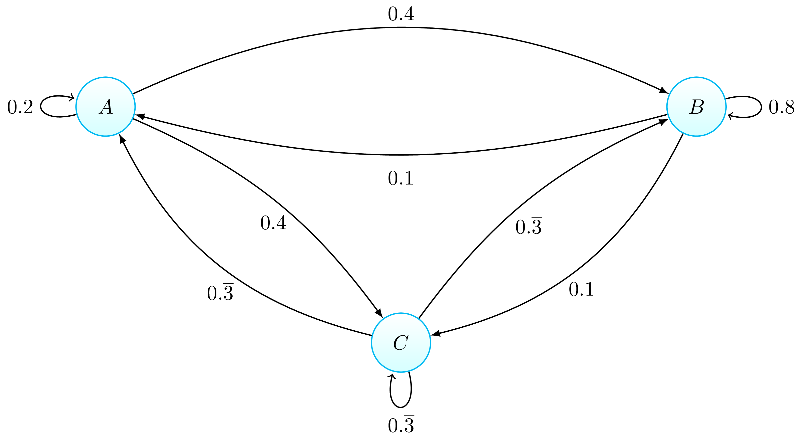
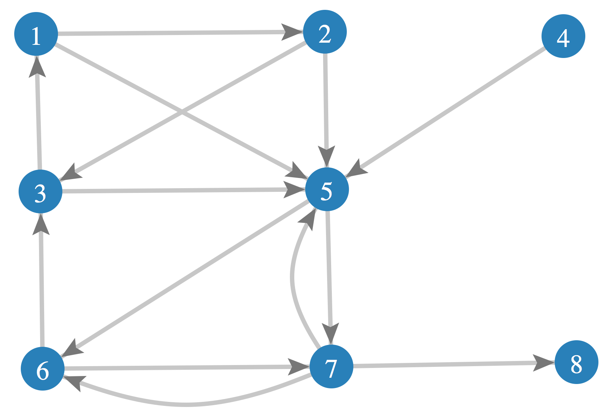

Chapter 8      

#[Chapter 8 Probability theory](./Chapter 8_ Probability theory.md)

In this chapter, we’ll use linear algebra concepts to explore the world of probability theory. Think of this as bonus material because the topics we’ll discuss are not normally part of a linear algebra course. Given the general usefulness of probabilistic reasoning and the fact that you have already covered all the prerequisites, it would be a shame _not_ to learn a bit about probability theory and its applications.

The chapter is structured as follows. In[Section 8.1](./Chapter 8_ Probability theory.md), we’ll discuss probability distributions, which are mathematical models for describing random events.[Section 8.1.10](./Chapter 8_ Probability theory.md) introduces the concept of a _Markov chain_, which can be used to characterize the random transitions between different states of a system. Of the myriad of topics in probability theory, we’ve chosen to discuss probability distributions and Markov chains because they correspond one-to-one with vectors and matrices. This means you should feel right at home. In[Section 8.1.15](./Chapter 8_ Probability theory.md), we’ll describe Google’s PageRank algorithm for ranking webpages, which is an interesting application of Markov chains.

##[8.1 Probability distributions](./Chapter 8_ Probability theory.md)

Many phenomena in the world are inherently unpredictable. When you throw a six-sided die, one of the outcomes  will result, but you don’t know which one. Similarly, when you toss a coin, you know the outcome will be either `heads` or `tails` but you can’t predict which outcome will result. Probabilities are used to describe events where uncertainty plays a role. We can assign probabilities to the different outcomes of a dice roll, the outcomes of a coin toss, and also to many real-world systems. For example, we can build a probabilistic model of hard drive failures using past observations. We can then calculate the probability that your family photo albums will survive the next 10 or 20 years. Backups my friends, backups.

Probabilistic models can help us better understand random events. The fundamental concept in probability theory is that of a _probability distribution_, which describes the likelihood of different outcomes of a random event. For example, the probability distribution for the roll of a fair die is , and the probability distribution for a coin toss is . Each entry of a probability distribution corresponds to the _probability mass_ of a given outcome. This terminology borrows from the concept of mass distribution used in physics. The entries of a probability distribution satisfy the following conditions: each entry is a nonnegative number, and the sum of the entries is one. These two conditions are known as the _Kolmogorov axioms_ of probability.

Strictly speaking, understanding linear algebra is not required for understanding probability theory. However, vector notation is very effective for describing probability distributions. Your existing knowledge of vectors and the rules for matrix multiplication will allow you to quickly understand many concepts in probability theory. Probabilistic reasoning is highly useful, so it’s totally worth taking the time to learn about it.

###[Random variables](./Front matter.md)

A random variable  is described by a probability distribution . Before we formally define the notion of a probability distribution, we must introduce some formalism. We denote by  (calligraphic ) the _sample space_ of the random variable , which is the set of all possible outcomes of the random variable. A _discrete_ random variable has a finite sample space. For example, we can describe the outcome of rolling a six-sided die using the random variable , where the sample space is . The number of possible outcomes is six: .

We can describe the random outcome of a coin toss as a random variable . The possible outcomes of the coin toss are . The number of possible outcomes is two: .

In the case of the hard drive failure model, we can define the random variable  as the years of a hard drive’s lifetime before it fails. Using the random variable  we can describe interesting scenarios using probabilistic reasoning. For example, the condition that a hard drive will function correctly for at least eight years can be described as .

###[Probability distributions](./Front matter.md)

The probability distribution of a discrete random variable  is a vector of  nonnegative numbers that sum to one. Using mathematically precise notation, we write the definition of  as follows:

A probability distribution is a vector in  that satisfies two special requirements: its entries must be nonnegative and the sum of the entries must be one.

###[Events](./Front matter.md)

In addition to the individual outcomes of a random variable, we can define _events_ that consist of compositions of individual outcomes. Events correspond to different subsets of the sample space and are usually defined using words like “,” which is the standard curly-bracket notation used to denote sets and subsets.

Recall the random variable  that describes the outcome of rolling a six-sided die. The sample space for this random variable is . We can define various events that involve the six-sided die and describe them as subsets of the sample space. For example, the event  corresponds to the subset .

Events are useful because they allow us to describe specific combinations of outcomes that are of practical interest. We can use the logical operators `OR` and `AND` to define composite events. The logical `OR` operator for events corresponds to the union operation for sets. For example,  resulting in an odd number,

corresponds to the union of sets .

The logical `AND` operator corresponds to the intersection of sets, and is often used to describe composite events that involve multiple random variables.

With these simple principles for describing probabilistic phenomena, we can build rich combinations of random events, expectations, and statistics—and develop methods for predicting the likelihood of future events. In the remainder of this section, we’ll explore concepts of probabilistic reasoning through a series of examples.

#####[Example 1](./Front matter.md)

Consider again the random variable  that describes the outcome of rolling a six-sided die. Assuming the die is fair, the probability distribution of the random variable  is

The probability distribution  is a six-dimensional vector and the probability of each outcome is . The sum of the entries is one.

Let’s take a moment to discuss the different notations for referring to the entries of the distribution . The th element of the vector  can be written in three equivalent ways:

These three different ways of denoting the probability mass associated with outcome  in the distribution  represent three different ways of thinking about probability distributions. We can use the normal vector notation based on subscripts, , but the appearance of two subscripts tends to be confusing. When the meaning of the random variable  is clearly apparent from the context, we can use the simpler notation . The notation  emphasizes the idea that a probability distribution can be understood as a _probability mass function_ that assigns probability mass for each of the possible outcomes. We can think of  as a function of the form . The most precise notation for probabilities is , which describes the probability, denoted , of the event that a random draw from  results in the outcome , denoted . Note we use the capital letter  when referring to the random variable, and the lowercase letter  to refer to particular outcomes of . In the standard terminology for probability theory, we refer to the particular outcome  as a _realization_ of the random variable .

Let’s use the distribution  to compute the probability of rolling a number five or greater, which corresponds to the event . Note the outcome “greater than or equal to five” occurs when we roll a five _or_ a six. Thus, the complex event  is the logical `OR` of these two basic events:

The probability of the event  is

Since the outcomes five and six are mutually exclusive, the logical `OR` of these events corresponds to the sum of the probabilities of the outcomes.

#####[Example 2](./Front matter.md)

The probability distribution of the random variable  that describes the outcome of a coin toss is

The probability distribution  corresponds to a function of the form , but for the sake of notational convenience, we associate the probability of `heads` and `tails` with the first and second entries of a two-dimensional vector . After all, this is a book about linear algebra, so everything must be turned into a vector!

What is the probability of getting `heads` three times in a row? We need three variables, , , and , to represent the outcomes of the three coin tosses. Each random variable  is an independent copy of the random variable . The probability of the outcome “three `heads` in a row” corresponds to the outcome where all three coin tosses come out `heads`: the first coin toss results in `heads` (), the second coin toss results in `heads` (), and the third coin toss also results in `heads` (). The probability of throwing three `heads` in a row is given by:

Since each coin toss is an _independent_ random event, the probability of the logical `AND` of the three events is the product of the probabilities of the three events.

The examples above only scratch the surface of possibilities for modelling real-world situations in terms of random events, and for reasoning mathematically about the probabilities of different outcomes. I encourage you to research the topic of probability theory further on your own.

###[Expectations](./Front matter.md)

Consider a function  that assigns values to each of the possible outcomes of a random variable . You can think of  as the payout function in a game of chance based on the random variable . You obtain  dollars when the outcome of  is . Using the usual notation for functions, we can write  to describe the payout of this game. Since the input  is a random variable, the output value  is also a random variable. We can obtain the _expected payout_ of this game if we multiply each of the possible payouts by its probability of occurrence:

![\mathbb{E}_X\!\big[f(X) \big]
\; \eqdef \; 
\sum_{x \in \mathcal{X}}  f(x) \psub{X}(x).](../Images/170e78155579bc54a511d2a5aa3c2d1382c9211a.png)

The above equation introduces the _expectation operator_ , which computes the weighted sum of the payouts for all possible outcomes. The payout amount for each outcome is multiplied by the probability of the outcome. The expected amount you’ll take home after playing the game of chance  times is ![n\mathbb{E}_X\!\big[f(X) \big]](../Images/1894f2dd86afb8c0dc5ca24743ff51b303fa9214.png). Sometimes you win big, sometimes you win less—by weighting each payout by its probability, we obtain the correct estimate of your expected winnings or losses.

#####[Example 3](./Front matter.md)

Consider the following game involving a six-sided die. You pay $1 to roll the die and the payout for the game is as follows. If you roll a , a , a , or a , you win nothing. If you roll a , you win $1. If you roll a , you win $4. Should you play this game?

The payout function for this game is defined as follows:

We’ll model the die roll as a random variable  with distribution . The expected payout for this game is

![\begin{align*}
\mathbb{E}_X[f(X)]  
&=  \textstyle \sum_x f(x)\, \psub{X}(x)																	\\
&= f(\myepsdice{1})\tfrac{1}{6} + f(\myepsdice{2})\tfrac{1}{6} + f(\myepsdice{3})\tfrac{1}{6}
+ f(\myepsdice{4})\tfrac{1}{6} + f(\myepsdice{5})\tfrac{1}{6} + f(\myepsdice{6})\tfrac{1}{6}  		\\
&= (\$0)\tfrac{1}{6} + (\$0)\tfrac{1}{6} + (\$0)\tfrac{1}{6} + (\$0)\tfrac{1}{6} + (\$1)\tfrac{1}{6} +  (\$4)\tfrac{1}{6}  				\\
&= \tfrac{\$1+\$4}{6}  \; = \;  \tfrac{\$5}{6} \; \approx \; 83 \textrm{ cents}.
\end{align*}](../Images/6c63ec83eb45dd9aa33767dc44da7c30d43cd879.png)

The expected payout of this game is less than the cost of playing, so it doesn’t make sense to play. Computing the expected value for any casino game will quickly convince you not to play—the expected payout is always less then what you must pay to play.

###[Expected value and variance of random variables](./Front matter.md)

We can use the expectation operator to compute certain characteristic properties of the random variable. The _expected value_ and the _variance_ are two properties of any random variable  that capture important aspects of its behaviour.

The _expected value_ of the random variable  is computed using the formula

![\musub{X}
\eqdef \mathbb{E}_X[X]
= \sum_x x\, \psub{X}(x).](../Images/d47b99be2d3617fca8d9ff5702d5208b68553f86.png)

The expected value is a single number that tells us what value of  we can expect to obtain on average from the random variable . The expected value is also called the _average_ or the _mean_ of the random variable .

The _variance_ of the random variable  is defined as follows:

![\sigma^2_X
\eqdef	\mathbb{E}_X\!\big[(X-\musub{X})^2\big]
= 		\sum_x (x-\musub{X})^2 \, \psub{X}(x).](../Images/f2fae43fbf14cf2c3df63d9892a6309c8b101630.png)

The variance formula computes the expectation of the squared distance of the random variable  from its expected value. The variance , also denoted , gives us an indication of how clustered or spread the values of  are. A small variance indicates the outcomes of  are tightly clustered near the expected value , while a large variance indicates the outcomes of  are widely spread.

The expected value  and the variance  are two central concepts in probability theory and statistics because they allow us to characterize any random variable. The expected value is a measure of the _central tendency_ of the random variable, while the variance  measures its _dispersion_. Readers familiar with concepts from physics can think of the expected value as the _centre of mass_ of the distribution, and the variance as the _moment of inertia_ of the distribution.

Computing expected values and variances allows us to compare different random variables. Suppose you want to compare two random variables,  and . It can be difficult to compare their probability distributions  and  directly, but we can compute their expected values and their variances and use these properties as the basis for the comparison. If we find , then we know  takes on larger values than  on average. If , then we know the probability mass function of  is more spread out than that of .

###[Conditional probability distributions](./Front matter.md)

Probability theory also allows us to model dependencies between random variables. We use _conditional probability distributions_ to describe situations where one random variable depends on another. Consider the random variable  whose random outcomes depend on another variable . To describe this probability dependence, we must specify the probability distributions of  for each of the possible values of . This information is expressed as a conditional probability distribution:

The vertical bar is pronounced “given,” and it separates the unknown random variable from the random variable whose value is known. The distribution  satisfies the conditions for a probability distribution for all :

It is natural to represent  as a  matrix, with each column representing the probability of  for a given value of .

#####[Example 4](./Front matter.md)

Consider a probability distribution with six possible outcomes obtained by rolling one of two different dice—one fair and one biased. The probability distribution when rolling the fair die is . The probability distribution when rolling the biased die is . Introducing the conditioning variable  that describes which die is rolled, we can express the situation with the two dice as the following conditional probability distribution:

The first column corresponds to the fair die , and the second column corresponds to the biased die .

Combining the probability distributions for the two dice,  and , into a single conditional distribution, , allows us to construct more complex probabilistic structures, as illustrated in the next example.

#####[Example 5](./Front matter.md)

Consider an experiment in which the outcome of a coin toss  decides which die we throw—the fair die or the biased die. Suppose the coin is biased with . If the outcome of the coin toss is `heads`, we roll the fair die. If the coin toss gives `tails`, we roll the biased die. We’re interested in describing the random variable , which corresponds to die rolls in which the fair die is used  of the time and the biased die is used  of the time. What is the probability distribution  for ?

To model this situation, we combine the “which die” probability distribution  with the conditional probability distribution  obtained in the previous example:

![\begin{align*}
\psub X(x) 
& =		\sum_{y \in \mathcal{Y}} \psub{X|Y}(x|y) \psub Y (y)			\\
& =		\psub{X|Y}(x|f) \psub Y (\texttt{heads})   + \psub{X|Y}(x|b) \psub Y (\texttt{tails})		\\
& = 		\psub{X|Y}(x|f) \tfrac{3}{4}  \; \;  \quad \qquad + \psub{X|Y}(x|b) \tfrac{1}{4}					\\
& = 		\tfrac{3}{4} (\tfrac{1}{6},\tfrac{1}{6},\tfrac{1}{6},\tfrac{1}{6},\tfrac{1}{6},\tfrac{1}{6})^\sfT
+ \tfrac{1}{4} (\tfrac{1}{4},\tfrac{1}{4},\tfrac{1}{4},\tfrac{1}{4},0,0)^\sfT	\\
& = 		(\tfrac{3}{16},\tfrac{3}{16},\tfrac{3}{16},\tfrac{3}{16},\tfrac{1}{8},\tfrac{1}{8})^\sfT.
\end{align*}](./images/08bed187c68cd4175ba94ce664c18cd5cb835ef1.png)

The probabilistic mixture of two random events corresponds to a linear combination—and when you think “linear combination,” you immediately think “matrix-vector product representation,” right? Indeed, we can also express  as a matrix-vector product between the conditional probability distribution of the matrix  and the vector :

![\psub X \; 
= \begin{bmatrix} 
\; \tfrac{1}{6} & \; \; \tfrac{1}{4} \; 	\\ 
\; \tfrac{1}{6} & \; \; \tfrac{1}{4} \; 	\\ 
\; \tfrac{1}{6} & \; \; \tfrac{1}{4} \; 	\\ 
\; \tfrac{1}{6} & \; \; \tfrac{1}{4} \;  	\\ 
\; \tfrac{1}{6} & \; \; 0 \;   		\\ 
\; \tfrac{1}{6} & \; \; 0 \;  \; 
\end{bmatrix}
\!\!
\begin{bmatrix}
\; \tfrac{3}{4} \; 	\\
\; \tfrac{1}{4} \; \; 
\end{bmatrix}
=
\begin{bmatrix} 
\; \tfrac{3}{16}  \; 		\\
\; \tfrac{3}{16}  \;  	\\
\; \tfrac{3}{16}  \;  	\\
\; \tfrac{3}{16}  \;  	\\
\; \tfrac{1}{8}  \;     	\\
\; \tfrac{1}{8}  \; \; 
\end{bmatrix}\!.](./images/b8c440b11e0ade218afa1b8242a227aca6a9c0ab.png)

You can verify that  as expected for all probability distributions.

Note we were able to use conditional probability distributions to describe complicated random events in terms of the matrix-vector product. The notion of a conditional probability distribution is a fundamental building block of probability theory. Many modern machine learning techniques use probabilistic models constructed from conditional probability distributions.

###[Interpretations of probability theory](./Front matter.md)

One approach to understanding probability theory is to think about probabilities as describing relative frequencies of occurrence for different possible outcomes. The quantity  represents the proportion of outcomes of the event  among all possible outcomes of .

This suggests an approach for estimating the probability mass of each of the possible outcomes. To characterize some real-world phenomenon as the random variable , we estimate the probability distribution of  by repeating the real-world phenomenon  times, where  grows to infinity. The probability mass of each outcome  is defined as the following limit:

where  is the number of times the outcome  occurs during  repetitions. If I tell you the probability mass of outcome  is , it means that if you take  draws from the random variable , you can expect approximately  of those draws to result in the outcome . Defining probabilities by counting the occurrences of different outcomes is called the _frequentist_ approach to probability theory. In practice, we don’t have time to actually repeat events an infinite number of times in order to obtain their exact probabilities; so think of this frequentist approach as a thought experiment, rather than applicable in practice.

Another conceptual interpretation of probability theory is to consider probability distributions as representations of our state of _knowledge_ or _beliefs_ about reality. Instead of describing some objective reality, the random variable  and its probability distribution  can represent our state of knowledge about the real-world phenomenon that  describes. Since  represents our state of knowledge about the random variable , it makes sense to update the distribution  as we learn new facts. This is called the _Bayesian_ approach to probability theory, named after Thomas Bayes who was an 18th century statistician. Consider the following example of Bayesian-style reasoning.

You’re given a coin and asked to come up with a probability distribution that describes its chances of landing `heads` or `tails`. Initially you have no information about whether the coin is biased in favour of heads or tails, so it makes sense to start with the initial belief that the coin is fair. This is called the _prior belief_, or simply _prior_—it’s the belief you hold prior to gathering data. If you toss the coin several times and observe significantly more `heads` than `tails`, you can update your belief about the coin’s probability distribution to account for your observations of the data. The specific technique for updating a prior belief in light of new observations is called _Bayes’ rule_.

Both the frequentist and Bayesian perspectives lead to useful techniques for modelling random events. Frequentist methods are concerned with drawing principled conclusions given a set of empirical observations. Bayesian models are generally more flexible and allow us to combine empirical observations with priors that encode the domain knowledge provided by experts. The frequentist approach is useful when you want to analyze data, prepare reports, and come up with hard numbers about the data. The Bayesian approach is more useful for building machine learning applications like voice recognition.

###[Discussion](./Front matter.md)

We described the basic notions in probability theory, such as random variables, probability distributions, and conditional probability distributions. These concepts are the bread-and-butter of probabilistic reasoning. Let’s take a minute to recap and summarize this new material, linking it back to vectors and linear transformations—the main subjects of this book. The probability distribution of a discrete random variable is a vector of real numbers. For instance, the probability distribution describing the outcome of rolling a six-sided die is a six-dimensional vector, . Probability distributions are vectors that obey some extra constraints: each entry must be a nonnegative number, and the sum of the entries in the vector must equal one.

Conditional probability distributions are mappings that describe how a set of random “given” variables influence the probabilities of a set of random “outcome” variables. Conditional probability distributions can be represented as matrices, where each column of the matrix contains the outcome distribution for one of the values of the given variable. A conditional probability distribution with five possible outcomes, conditioned on a given variable with 10 possible states, is represented as a  matrix that contains probability distributions in each of its columns.

Conditional probability distributions are powerful tools for modelling real-world scenarios. Many machine learning algorithms involve the characterization, estimation, and exploitation of conditional probability distributions. We can also describe a noisy communication channel as a conditional probability distribution of the channel’s outputs given each of the channel’s possible inputs.

In the next section, we’ll learn about an application of conditional probability distributions that describes the state of a system undergoing random transitions between a number of possible states. This is a special case of a conditional probability distribution for which the random conditioning variable and random outcome variable are of the same dimension. Indeed, the outcome variable and the conditional space both represent states of the same system at different times.

###[Links](./Front matter.md)

\[ Discussion on the Bayesian way of thinking about probabilities \]

[`https://en.wikipedia.org/wiki/Bayesian_probability`](./Bayesian_probability.md)

\[ Detailed discussion about Bayes rule \]

[`http://yudkowsky.net/rational/bayes`](./bayes.md)

[`http://yudkowsky.net/rational/technical`](./technical.md)

###[Exercises](./Front matter.md)

E8.1 Do the following vectors represent probability distributions?

1.  
2.  
3.  

E8.2 Compute the expected value  and the variance  of the random variable  that describes the outcome of rolling a six-sided die. The probability distribution of  is .

So far, we’ve talked about random events without any reference to the flow of time. In this section we’ll combine the idea of random variables with the notion of time. A _random process_ is a model of a system that undergoes transitions between states over time. The state of the system at time  is described by a random variable . We obtain the next state of the system  from the following conditional probability distribution:

The random variable  depends on the previous states of the system: , , , , . Studying such history-dependent processes is a formidable task due to the myriad of possible influences from past states. Faced with this complexity, we can make a useful simplifying assumption by considering _memoryless_ random processes.

A _Markov process_ or _Markov chain_ is a random process for which the transition probabilities for the system’s next state depend only on its current state, regardless of previous states:

The system’s next state  depends only on its current state , and not on its prior history: , , , . Markov chains forget everything that happened in the past, which is why we refer to them as _memoryless_ random processes. A Markov chain is fully described by the conditional probability distribution , which describes the probability of the system’s next state, given its current state. We also refer to  as the _transition matrix_, since it describes the probabilities that the system will transition from one state to another.

Markov chains are extremely versatile models for analyzing many real-world systems. We don’t have the space to cover the topic in full, but I’ll introduce the basic notions for your general knowledge. First, we’ll look at the connection between Markov chains and matrix multiplication. Then, we’ll see how your eigenvalue-finding skills can help compute an important property of Markov chains. Understanding Markov chains is also necessary background material for understanding Google’s PageRank algorithm, which we’ll discuss in[Section 8.1.15](./Chapter 8_ Probability theory.md).

###[Example](./Front matter.md)

Three friends are kicking a football in the park: Alice, Bob, and Charlie. Whenever Alice gets the ball, she passes it to Bob 40% of the time, passes it to Charlie 40% of the time, or holds onto the ball 20% of the time. Bob is kind of a greedy dude: when he gets the ball, he holds onto it 80% of the time, and is equally likely to pass it to Alice or Charlie 20% of the time. When Charlie gets the ball, he’s equally likely to pass the ball to Alice or Bob, or keep it for himself. Assume these friends kick the ball around for a very long time (hundreds of passes), and you observe them at some point. What is the probability that each player will be in possession of the ball at the instant you observe them?

We can model the ball possession as a Markov process with three possible states, , where each state describes moments when Alice, Bob, or Charlie has the ball. The transition probabilities  describe how the next state of the ball’s possession  depends on the previous state of the ball’s possession . The transition matrix of the Markov chain in our current example is

To maintain consistency with the notation for conditional probability distributions, we refer to the entries of  as . The “given” variable  selects the column of the matrix , and the different entries in this column represent the transition probabilities for that state. Using the matrix  and some basic linear algebra techniques, we can calculate the probability of finding the ball in any given player’s possession after many iterations of the “pass the ball” Markov process.

Figure 8.1: Graphical representation of the transition probabilities between three states: “Alice has the ball,” “Bob has the ball,” and “Charlie has the ball.”

Let’s walk through an example calculation in which we assume the ball starts in Alice’s possession. Since we know that Alice has the ball at , we can describe the initial state of the system by the probability distribution , with 100% of the probability on Alice. We obtain the probability of finding the ball in each player’s possession after one time step, or unit of time, by multiplying the initial probability vector  by the matrix :

All of the “where is the ball” probability starts with Alice, but after one time step it spreads to Bob and Charlie, according to Alice’s expected passing behaviour (the first column in the transition matrix).

We can continue this process to obtain the probability of ball possession after two time steps. We simply multiply the probability vector  by the transition matrix , which is the same as multiplying the initial state  by  twice:

![\begin{align*}
\psub{X_2} 
&= MM\psub{X_0} = M\psub{X_1}	\\
&= 
\begin{bmatrix} 
\; 0.2 & \; \; 0.1 & \; \; 0.\overline{3}		\; \\ 
\; 0.4 & \; \; 0.8 & \; \; 0.\overline{3}      	\; \\ 
\; 0.4 & \; \; 0.1 & \; \; 0.\overline{3}		\;  \; 
\end{bmatrix}
\!\!\!
\begin{bmatrix} 
\; 0.2 & \; \; 0.1 & \; \; 0.\overline{3}		\; \\ 
\; 0.4 & \; \; 0.8 & \; \; 0.\overline{3}      	\; \\ 
\; 0.4 & \; \; 0.1 & \; \; 0.\overline{3}		\;  \; 
\end{bmatrix}
\!\!\!
\begin{bmatrix} 
\; 1		\; \\ 
\; 0      	\; \\ 
\; 0		\;  \; 
\end{bmatrix}
= 		
\begin{bmatrix} 
0.21\overline{3}\; \\
0.5\overline{3} \; \; \\
0.25\overline{3} \, \,
\end{bmatrix}\!\!.			   
\end{align*}](./images/f5866ce96ec0ff4c2057480bfdd0c1b78ac5fe53.png)

Let’s focus on the first entry of this vector. The probability that Alice is holding the ball after two time steps is . This number represents the combination of three different “paths” of starting from the state  and coming to the state  at . Either Alice kept the ball for two time steps (); or Alice passed the ball to Bob () and then he passed it back to her; or Alice passed the ball to Charlie () and Charlie passed it back to her. By computing the sum of the products of the probabilities of the events on each path, we arrive at the value

This is a lot of work to do manually. Compare the above calculation with the multiplication-by-the-transition-matrix approach, and the compact expression  which “takes care” of these three different paths automatically: there’s no need to manually consider all possible paths—instead, just multiply the state by the transition matrix to obtain the state probabilities in the next time step.

Thanks to the power of the Markov chain construction, we can carry the ball possession probabilities vector forward through time as far as we want to. To calculate the random state , multiply the previous state vector  by the Markov transition probabilities matrix . The probability distribution of ball possession after three time steps is

Continuing this process, we can obtain the probability state vector after 10 and 20 time steps of the Markov chain:

Observe how the weights of the probability distribution seem to change less and less as the Markov chain advances. Recall we originally set out to calculate the probability that each player will be in possession of the ball after a very long time. We seem to be on the right track to find this long-term probability of ball possession.

###[Stationary distribution](./Front matter.md)

If the evolution of a Markov chain continues for long enough, the probability vector will converge to a stable distribution  that remains unchanged when multiplied by :

This is called the _stationary distribution_ of the Markov chain. Observe that  is an eigenvector of the matrix  with eigenvalue .

The convergence to a unique stationary distribution is a fundamental property of Markov chains. Assuming the Markov chain represented by  satisfies some technical conditions (which we won’t go into), it will converge to a stationary distribution . Thus, if we want to find , we just need to keep repeatedly multiplying by  until the distribution stabilizes:

The Markov chain will converge to the same stationary distribution  regardless of the starting point . The ball could start with Bob  or with Charlie ; and after running the Markov chain for long enough, we’d still arrive at the stationary distribution .

Since we know the stationary distribution is an eigenvector of  with eigenvalue , we can use the usual eigenvector-finding techniques to obtain  directly: just solve for  in . This approach gives us an exact analytic expression for the answer. Note we must normalize the eigenvector  so the sum of its components equals one. The final answer is , where  is the \-norm of the eigenvector.

###[Discussion](./Front matter.md)

Markov chains have countless applications in physics, speech recognition, information processing, machine learning, and many other areas. Their simple, memoryless structure and their intuitive representation as matrices make them easy to understand and easy to fit to many situations.

In the next section, we’ll describe a Markov chain model for people’s web browsing behaviour. The stationary distribution of this Markov chain serves to quantify the relative importance of webpages.

###[Links](./Front matter.md)

\[ Awesome visual representation of states and transitions \]

[`http://setosa.io/blog/2014/07/26/markov-chains/index.html`](./index.md)

\[ More details about Markov chain applications from Wikipedia \]

[`https://en.wikipedia.org/wiki/Markov_chain`](./Markov_chain.md)

###[Exercises](./Front matter.md)

E8.3 After reading the section on Markov chains, you decide to research the subject further by checking out a book on Markov chains from the library. In the book’s notation, Markov chains are represented using _right_\-multiplication of the state vector: , where  is the state of the system at time ,  is the state at time , and the matrix  represents the Markov chain transition probabilities. Find the matrix  that corresponds to the transition probabilities discussed in the Markov chain example on page 8.1.11. How is this matrix  related to the matrix  that we used in the Markov chain example?

E8.4 Go to[`https://live.sympy.org`](./live.sympy.org.md) and create a `Matrix` object describing the passing-the-ball Markov chain transition probabilities. Use the `Matrix` methods `.eigenvects()` and `.nullspace()` to confirm the stationary distribution of the Markov chain is .

You can create a `Matrix` object using

\>>> M = Matrix(\[\[ 2/10, 1/10, 1/3 \],
                \[ 4/10, 8/10, 1/3 \],
                \[ 4/10, 1/10, 1/3 \]\])

If you start from a matrix with exact rational entries, you’ll obtain the exact answer in terms of rational numbers. You can also use the function `S` (short for `sympify`) to create rationals: `S(1/3)` = .

The eigenspace that corresponds to the eigenvalue  is the null space of the matrix . Use the `SymPy` command `eye(3)` to create a  identity matrix , then apply the `nullspace` method.

Use `vec.norm(1)` to compute the \-norm of the vector `vec`.

E8.5 Find the stationary distribution of the following Markov chain:

Consider the information contained in the **links between webpages**. Each link from Page A to Page B can be interpreted as a recommendation by Page A’s author for the contents of Page B. In web-speak we say links from Page A to Page B are “sending eyeballs” to Page B, presumably because there is something interesting to see on Page B. These observations about “eyeball worthiness” are the inspiration behind Google’s PageRank algorithm. We find a good summary of the idea behind PageRank in Google’s 2001 patent application:

> A method assigns importance ranks to nodes in \[...\] the world wide web or any other hypermedia database. The rank assigned to a document is calculated from the ranks of documents citing it. In addition, the rank of a document is calculated from a constant representing the probability that a browser through the database will randomly jump to the document. — Patent[`US6285999`](./US6285999.md)

You may notice there is a weird self-referential thing going on in that definition. The rank of a document depends on the ranks of documents that link to it, but how do you discover the ranks of these documents? By calculating the ranks of documents that link to them, and so on and so forth. Don’t worry if this sounds confusing, it will all start to make sense very soon.

###[The random surfer model](./Front matter.md)

Imagine someone who browses the web by randomly clicking on links. We’ll call this person Randy. Every time Randy opens his web browser he follows the following two strategies:

1.  When visiting a webpage, he’ll make a list of all the outbound links on that page and click on one of the links at random.
2.  Randy randomly selects a page on the web and goes to it.

Randy follows Strategy 1 90% of the time and Strategy 2 the remaining 10% of the time. In the unlikely event that he reaches a page with no outbound links, he’ll follow Strategy 2 and jump to a random page.

You have to agree that Randy’s behaviour is pretty random! This is a simple model for the behaviour of users on the web that assumes people either follow links blindly, or randomly jump to webpages. Simple as it is, this model allows us to capture an important aspect of web browsing behaviour: it allows us to measure the relative importance of different webpages. In the next section, we’ll describe the random surfer model using the machinery of Markov chains.

###[The PageRank Markov chain](./Front matter.md)

We want to construct a Markov chain that models the behaviour of Randy, the random web surfer. The _state_ in the Markov chain corresponds to the webpage Randy is currently viewing, and the transition matrix describes Randy’s link-clicking behaviour. Modelling Randy’s behaviour as a Markov chain will help us calculate the PageRank vector, which describes the “importance” of each webpage on the web.

We’ll now revisit the two random strategies Randy uses to browse the web, and construct the appropriate Markov chain matrices to describe them. Note the dimension of the matrices is , where  is the number of webpages on the web.

1.  Suppose Randy visits webpage , which has  outbound links. The probability he’ll click on one of these links is . Thus, the column for Page  should contain entries  in the rows that correspond to the pages that Page  links to. In the special case that Page  has zero outbound links, we’ll fill column  with the uniform distribution . Thus, we can describe the th entry of the transition matrix for Strategy 1 as follows:
    
    
    
2.  The transition matrix for Strategy 2 is much simpler. No matter which page Randy visited previously, we want him to jump to a random page on the web; thus each column of the transition matrix  will contain the uniform distribution over all pages . We can express this succinctly as:
    
    
    
    where  is a matrix with ones in all its entries.
    

Recall that Randy uses Strategy 1 90% of the time and Strategy 2 10% of the time. The Markov chain  that describes his behaviour is a linear combination of the Markov chains for the two strategies:

where in this instance,  gives us a 90-10 mix of strategies. Note that in general,  is a parameter we can adjust for different applications.

The PageRank vector is the stationary distribution of the Markov chain , which is defined through the equation . We can obtain  by finding the eigenvector of  in the eigenspace , which is equivalent to solving the null space problem . We can also obtain the stationary distribution  by running the Markov chain for many iterations, until we see the probability distribution converge:

Both approaches for finding  are useful in different contexts. Solving the null space problem gives us the answer directly, whereas the second approach of iterating the Markov chain is more scalable for large graphs.

The PageRank value of a webpage is the probability that Randy will navigate to a given page after running the Markov chain for a sufficiently long time. The PageRank vector  captures an important aspect of the well-connectedness or importance of webpages. Let’s illustrate the entire procedure for calculating the PageRank vector for the simple network shown in[Figure 8.2](./Chapter 8_ Probability theory.md).

####[Example: micro-web](./Front matter.md)

We’ll now study the micro-web illustrated in[Figure 8.2](./Chapter 8_ Probability theory.md). This is a _vastly_ simplified version of the link structure between webpages on the web. Rather than include billions of webpages, the micro-web contains only eight webpages . Instead of trillions of links between webpages, the micro-web contains only fourteen links              . Simple as it may be, this example is sufficient to illustrate the main idea of the PageRank algorithm. Scaling the solution from the case  to the case  is left as an exercise for the reader.

Figure 8.2: A graph showing the links between the pages on the micro-web. Page 5 seems to be an important page because many pages link to it. Since Page 5 links to pages 6 and 7, these pages will probably get a lot of eyeballs, too. Page 4 is the least important, since no links lead to it. Page 8 is an example of the unlikely case of a webpage with no outbound links.

We’ll first construct the transition matrix  that corresponds to Strategy 1 (follow a random outbound link), and the matrix  for Strategy 2 (teleport to a random page), then construct a 90-10 weighted linear combination of  and , which is the PageRank Markov chain matrix.

The state of the Markov chain we want to construct corresponds to the probability distribution of Randy visiting one of the eight pages. Let’s say he is currently on Page 1, so the state of the Markov chain is . Following Strategy 1, Randy will next go to either Page 2 or Page 5. Since there are two possible outbound links, the probability mass of choosing one of them is . Recall that Page 1 corresponds to the first column of the matrix . The first column of  must therefore contain the value  in its second and fifth rows. Similarly, the entries in the second column of  correspond to the probabilities of Randy following links randomly starting at Page 2. Since Page 2 links to Page 3 and Page 5, the second column of  must contain  in its third and fifth rows.

Continuing with this approach, we find the rest of the entries in the transition matrix for Strategy 1:

![M_1
=
\begin{bmatrix}
0 & 0 & \frac{1}{2} & 0 & 0 & 0 & 0 & \frac{1}{8}\\
\frac{1}{2} & 0 & 0 & 0 & 0 & 0 & 0 & \frac{1}{8}\\
0 & \frac{1}{2} & 0 & 0 & 0 & \frac{1}{2} & 0 & \frac{1}{8}\\
0 & 0 & 0 & 0 & 0 & 0 & 0 & \frac{1}{8}\\
\frac{1}{2} & \frac{1}{2} & \frac{1}{2} & 1 & 0 & 0 & \frac{1}{3} & \frac{1}{8}\\
0 & 0 & 0 & 0 & \frac{1}{2} & 0 & \frac{1}{3} & \frac{1}{8}\\
0 & 0 & 0 & 0 & \frac{1}{2} & \frac{1}{2} & 0 & \frac{1}{8}\\
0 & 0 & 0 & 0 & 0 & 0 & \frac{1}{3} & \frac{1}{8}				
\end{bmatrix}\!\!.](./images/0f6afa0b2f5a5a56a64add55a642b8fd11034309.png)

To convince yourself that  has the correct entries, compare the rest of the columns with the link structure in[Figure 8.2](./Chapter 8_ Probability theory.md). Recall that Strategy 1 handles the exceptional case of a page with no outbound links by jumping to a random page. Since the micro-web contains eight pages, the uniform distribution over all pages is .

Do you recall the _adjacency matrix_ representation for graphs we discussed in[Section 7.4](./Chapter 7_ Applications.md)? You can obtain  by taking the transpose of the adjacency matrix , and then normalizing the columns so they become probability distributions.

The Markov chain for Strategy 2 is to jump to a random page on the micro-web:

![M_2
=
\frac{1}{8}\,
\mathbb{J}_{8}
=
\begin{bmatrix}
\frac{1}{8}& \frac{1}{8}& \frac{1}{8}& \frac{1}{8}& \frac{1}{8}& \frac{1}{8}& \frac{1}{8}& \frac{1}{8}\\
\frac{1}{8}& \frac{1}{8}& \frac{1}{8}& \frac{1}{8}& \frac{1}{8}& \frac{1}{8}& \frac{1}{8}& \frac{1}{8}\\	
\frac{1}{8}& \frac{1}{8}& \frac{1}{8}& \frac{1}{8}& \frac{1}{8}& \frac{1}{8}& \frac{1}{8}& \frac{1}{8}\\
\frac{1}{8}& \frac{1}{8}& \frac{1}{8}& \frac{1}{8}& \frac{1}{8}& \frac{1}{8}& \frac{1}{8}& \frac{1}{8}\\	
\frac{1}{8}& \frac{1}{8}& \frac{1}{8}& \frac{1}{8}& \frac{1}{8}& \frac{1}{8}& \frac{1}{8}& \frac{1}{8}\\
\frac{1}{8}& \frac{1}{8}& \frac{1}{8}& \frac{1}{8}& \frac{1}{8}& \frac{1}{8}& \frac{1}{8}& \frac{1}{8}\\	
\frac{1}{8}& \frac{1}{8}& \frac{1}{8}& \frac{1}{8}& \frac{1}{8}& \frac{1}{8}& \frac{1}{8}& \frac{1}{8}\\
\frac{1}{8}& \frac{1}{8}& \frac{1}{8}& \frac{1}{8}& \frac{1}{8}& \frac{1}{8}& \frac{1}{8}& \frac{1}{8}	
\end{bmatrix}\!\!.					\qquad  \; \;](./images/f899b6eedaa437ca4d37a26ca939f00f5ab30f38.png)

Note the new notation , which corresponds to an  matrix with ones in all its entries.

The PageRank Markov chain  is defined in terms of the matrices  and  and a mixture parameter, which we denote . Choosing  models a Randy who uses Strategy 1 90% of the time and Strategy 2 10% of the time:

Or, written out in full detail:

![M
=
\begin{bmatrix}
\frac{1}{80} & \frac{1}{80} & \frac{37}{80} & \frac{1}{80} & \frac{1}{80} & \frac{1}{80} & \frac{1}{80} & \frac{1}{8}\\
\frac{37}{80} & \frac{1}{80} & \frac{1}{80} & \frac{1}{80} & \frac{1}{80} & \frac{1}{80} & \frac{1}{80} & \frac{1}{8}\\
\frac{1}{80} & \frac{37}{80} & \frac{1}{80} & \frac{1}{80} & \frac{1}{80} & \frac{37}{80} & \frac{1}{80} & \frac{1}{8}\\
\frac{1}{80} & \frac{1}{80} & \frac{1}{80} & \frac{1}{80} & \frac{1}{80} & \frac{1}{80} & \frac{1}{80} & \frac{1}{8}\\
\frac{37}{80} & \frac{37}{80} & \frac{37}{80} & \frac{73}{80} & \frac{1}{80} & \frac{1}{80} & \frac{5}{16} & \frac{1}{8}\\
\frac{1}{80} & \frac{1}{80} & \frac{1}{80} & \frac{1}{80} & \frac{37}{80} & \frac{1}{80} & \frac{5}{16} & \frac{1}{8}\\
\frac{1}{80} & \frac{1}{80} & \frac{1}{80} & \frac{1}{80} & \frac{37}{80} & \frac{37}{80} & \frac{1}{80} & \frac{1}{8}\\
\frac{1}{80} & \frac{1}{80} & \frac{1}{80} & \frac{1}{80} & \frac{1}{80} & \frac{1}{80} & \frac{5}{16} & \frac{1}{8}
\end{bmatrix}\!\!.](./images/652e46b53dd4d01c67d5be4816425b35831466a7.png)

Notice the sprinkling of s that fill the regions which had only zeros in . The addition of these weights is important for technical reasons. The _mixing time_ of a Markov chain is how long it takes for it to reach its steady state distribution. If we were to use just the matrix  for the Markov chain, the probability distribution that describes Randy’s state might get stuck in one part of the graph, and not explore all the nodes. Adding a bit of  creates connections between all the nodes, and this guarantees the Markov chain will quickly converge to its stationary distribution.

Since we built the Markov chain for the micro-web, we can now find its stationary distribution , which is the PageRank vector:

We obtain  by finding the vector in the  eigenspace of . Use[`SymPy`](./live.sympy.org.md) to check this result. See[`bit.ly/microWebPR`](./microWebPR.md) for the commands required to solve the null space problem .

We can now use the entries of the PageRank vector to sort the pages of the micro-web by their relative importance, as shown in[Table 8.1](./Chapter 8_ Probability theory.md).

Page ID

PageRank

Page 5

0.22678

Page 7

0.20793

Page 6

0.18642

Page 3

0.13229

Page 8

0.08437

Page 1

0.08152

Page 2

0.05868

Page 4

0.02199

Table 8.1: The PageRanks of the pages from the graph in[Figure 8.2](./Chapter 8_ Probability theory.md).

According to their PageRank score, the top two pages in the micro-web are Page 5 with PageRank  and Page 7 with PageRank . Page 6 is not far behind with PageRank . Looking at[Figure 8.2](./Chapter 8_ Probability theory.md), we can confirm this ranking makes sense, since Page 5 has the most links pointing to it, and since Page 5 links to Page 6 and Page 7. As expected, Page 4 ranks as the least important page on the micro-web since no pages link to it.

###[Discussion](./Front matter.md)

The example we discussed above involved only eight webpages and an  Markov chain matrix. Imagine the size of the matrix needed to represent all the links between webpages on the web. The web has upward of a billion webpages and contains trillions of hyperlinks. Imagine an  Markov chain matrix, where . You’d need a ridiculous amount of memory to store this matrix, and a huge amount of computing power to work with it.

The computation of the PageRank vector for the entire web can be performed using the _power iteration_ method, which finds the eigenvector for the largest eigenvalue of the matrix. Additionally, careful analysis of the data required to perform the algorithm can avoid the need to construct the impossibly-large  matrix. Thus the contributions of PageRank inventors Larry Page and Sergey Brin go beyond basic linear algebra, since they offer a clever approach for splitting the computation among a cluster of computers. This is a lesson to keep in mind when you use your linear algebra knowledge to build stuff. You need to cultivate a healthy mix of intuition, mathematical tools, _and_ engineering prowess to get things done. Go find the right linear combination of these resources and build your own $300B company. I’m betting on you.

###[Links](./Front matter.md)

\[ The original PageRank paper \]

[`http://ilpubs.stanford.edu/422/1/1999-66.pdf`](./1999-66.pdf.md)

\[ Further discussion about the PageRank algorithm \]

[`https://en.wikipedia.org/wiki/PageRank`](./PageRank.md)

\[ The _power iteration_ method for finding the PageRank eigenvector \]

[`https://en.wikipedia.org/wiki/Power_iteration`](./Power_iteration.md)

###[Exercises](./Front matter.md)

E8.6 Compute the PageRank vector for the network of webpages shown in[Figure 7.3](./Chapter 7_ Applications.md) on page 7.3.

Use[`https://live.sympy.org`](./live.sympy.org.md) and define the matrix  using the syntax `Matrix([[...], ...])`, then mix it with an all-ones matrix `ones(n,n)`. Use the `nullspace` method from [8.1.15](./Chapter 8_ Probability theory.md) to obtain the eigenvector in the  eigenspace.

##[8.2 Probability problems](./Chapter 8_ Probability theory.md)

To better understand random variables and probability distributions, you need to practice using these concepts to solve real-world problems. It just so happens there are some practice problems on this very topic in this section—how convenient is that? Don’t skip them!

Solving practice problems will help you understand probability theory and Markov chains. If you haven’t played with `SymPy` yet, now is a great chance to get to know this powerful computer algebra system because Markov chain calculations are difficult to do by hand.

P8.1 Given a random variable  with three possible outcomes  and probability distribution , prove that .

Use the Kolmogorov’s axioms and build a proof by contradiction.

P8.2 The probability of `heads` for a fair coin is . The probability of getting `heads`   times in a row is given by the expression . What is the probability of getting `heads` four times in a row?

P8.3 You have a biased coin that lands on `heads` with probability , and consequently lands on `tails` with probability . Suppose you want to flip the coin until you get `heads`. Define the random variable  as the number of tosses required until the first `heads` outcome. What is the probability mass function  for success on the th toss? Confirm that the formula is a valid probability distribution by showing .

Find the probabilities for cases  and look for a pattern.

P8.4 The probability mass function for the geometric distribution with success probability  is , where  describes the number of trials until the first success. Compute the expected value ![\mathbb{E}_X[X]](../Images/43baf940f69bd9bce38298d9c5dc6cfec379f3fa.png).

The formula for the sum of the geometric series is , and taking its derivative with respect to  gives .

P8.5 A mathematician walks over to a roulette table in a casino. The roulette wheel has 101 numbers: 50 are black, 50 are red, and the number zero is green. If the mathematician bets $1 on black and the roulette ball stops on a black number, the payout is $2, otherwise the bet is lost. Calculate the expected payout for playing this game, and determine whether it’s worth playing.

P8.6 Consider the following variation of the six-sided die game. You pay $1 to play one round of the game and the payout for the game is as follows. If you roll a , a , or a , you win nothing. If you roll a  or a , you win $1. If you roll a , you win $5. Should you play this game?

P8.7 Show that variance of a random variable  with distribution  is given by the formula .

Start from the definition ![\textrm{var}(X) \eqdef \mathbb{E}_X\!\big[(X-\musub{X})^2\big]](../Images/82ceb728ddc30e69127a795f9bf7444ab7c8852a.png) and simplify it.

P8.8 Consider the weather in a city which has “good” and “bad” years. Suppose the weather conditions over the years form a Markov chain where a good year is equally likely to be followed by a good or a bad year, while a bad year is three times as likely to be followed by a bad year as by a good year. Given that last year, call it Year , was a good weather year, find the probability distribution that describes the weather in Year , Year , and Year .

P8.9 Consider the network of webpages shown in[Figure 8.3](./Front matter.md). Find the Markov chain transition matrices  and  for Randy’s two browsing strategies; then combine the strategies using  to obtain the PageRank matrix . Compute the PageRank vector. Which pages are the most important?

Figure 8.3

Use[`SymPy`](./live.sympy.org.md) for the calculation. Consult the micro-web calculation example [`bit.ly/microWebPR`](./microWebPR.md)) for the `SymPy` commands you’ll need.
