Chapter 9      

#[Chapter 9 Quantum mechanics](./Chapter 9_ Quantum mechanics.md)

By the end of the 19th century, physicists thought they had figured out most of what there is to know about the laws of nature. Newton’s laws of mechanics described the motion of objects in space, and Maxwell’s equations described electricity and magnetism. Wave phenomena—including the propagation of sound, light, and waves on the surface of liquids—were also well understood. Only a few small inconsistencies between theory and experiments with atoms and radiation remained unsolved.

> “\[ …\] it seems probable that most of the grand underlying principles have now been firmly established and that further advances are to be sought chiefly in the rigorous application of these principles to all the phenomena which come under our notice.” — Albert A. Michelson in 1894

Physicists like Michelson were worried about the future of physics research. It was as if they were wondering, “What are we going to do now that we’ve figured everything out?” Little did they know about the quantum storm that was about to hit physics, and with it, the complete rewrite of our understanding of nature at the smallest scale.

Understanding the structure of atoms—the smallest constituents of matter known at the time—was no trivial task. Describing the absorption of electromagnetic radiation by metals also turned out to be quite complicated. In both cases, the physical theories of the time predicted that the energy of physical systems could take on any value; yet experimental observations showed _discrete_ energy levels. Imagine you throw a (very-very tiny) ball, and the laws of physics force you to choose an initial velocity for the ball from a list of “allowed” values:  m/s,  m/s,  m/s,  m/s, and so forth. That would be weird, no? Weird indeed, and this is the situation physicists were facing in the beginning of the 20th century: their theories described the energy levels of atoms as real numbers , but experiments showed that only a discrete set of energy levels exist. For example, the energy levels that the electrons of the hydrogen atom can take on are:

Other experimental observations suggested that electromagnetic radiation is not a continuous wave, but comes in discrete “wave packets,” which we call _photons_ today. The theory of _quantum mechanics_ was born out of a need to explain these observations. The term _quantum_, from the Latin _quantus_ for quantity, was coined to describe the discrete nature of the phenomena that physicists were trying to explain.

During the first half of the 20th century, in experiment after experiment, quantum principles were used to correctly predict many previously-unexplained observations. During the second half of the 20th century, biologists, chemists, engineers, and physicists applied quantum principles to all areas of science. This process of “upgrading” classical models to quantum models led to a better understanding of the laws of nature, and the discovery of useful things like transistors and lasers.

The fundamental principles of quantum mechanics can be explained in the space on the back of an envelope. Understanding quantum mechanics is a matter of combining a little knowledge of linear algebra (vectors, inner products, projections) with some probability theory [Chapter 8](./Chapter 8_ Probability theory.md)). In this chapter, we’ll take a little excursion to the land of physics to learn about the ideas of great scientists like Bohr, Planck, Dirac, Heisenberg, and Pauli. Your linear algebra skills will allow you to learn about some fascinating 20th\-century discoveries. This chapter is totally optional reading, reserved for readers who _insist_ on learning about the quantum world. If you’re not interested in quantum mechanics, it’s okay to skip this chapter, but I recommend you check out[Section 9.1.4](./Chapter 9_ Quantum mechanics.md) on _Dirac notation_ for vectors and matrices. Learning Dirac notation serves as an excellent review of the core concepts of linear algebra.

sec-quantum\_mechanics\_introduction

The principles of quantum mechanics have far-reaching implications for many areas of science: physics, chemistry, biology, engineering, philosophy, and many other fields of study. Each field of study has its own view on quantum mechanics, and has developed a specialized language for describing quantum concepts. We’ll formally introduce the postulates of quantum mechanics in[Section 9.3](./Chapter 9_ Quantum mechanics.md), but before we get there, let’s look at some of the disciplines where quantum principles are used.

#####[Physics](./Front matter.md)

Physicists use the laws of quantum mechanics as a toolbox to understand and predict the outcomes of atomic-scale physics experiments. By “upgrading” classical physics models to reflect the ideas of quantum mechanics, physicists (and chemists) obtain more accurate models that lead to better predictions.

For example, in a _classical_ physics model, the motion of a particle is described by its position  and velocity  as functions of time:

At any given time , the particle is at position  and moving with velocity . Using Newton’s laws of motion and calculus, we can predict the position and the velocity of a particle at all times.

In a quantum description of the motion of a particle in one dimension, the state of a particle is represented by a _wave function_ , which is a complex-valued function of position  and time :

At any given time , the state of the particle corresponds to a complex-valued function of a real variable . The wave function  is also called the _probability-amplitude_ function. The probability of finding the particle at position  is proportional to the value of the squared norm of the wave function:

Instead of having a definite position  as in the classical model, the position of the particle in a quantum model is described by a probability distribution calculated from its wave function . Instead of having a definite momentum , the momentum of a quantum particle is another function calculated based on its wave function .

Classical models provide accurate predictions for physics problems involving macroscopic objects, but fail to predict the physics of atomic-scale phenomena. Much of 20th\-century physics research efforts were dedicated to the study of quantum concepts like ground states, measurements, spin angular momentum, polarization, uncertainty, entanglement, and non-locality.

#####[Computer science](./Front matter.md)

Computer scientists understand quantum mechanics using principles of information. Quantum principles impose a fundamental change to the “data types” used to represent information. Classical information is represented as _bits_, elements of the finite field of size two :

In the quantum world, the fundamental unit of information is the _qubit_, which is a two-dimensional unit vector in a complex inner product space:

This change to the underlying information model requires reconsidering fundamental information processing tasks like computation, data compression, encryption, and communication.

#####[Philosophy](./Front matter.md)

Philosophers have also updated their conceptions of the world to incorporate the laws of quantum mechanics. Observations of physics experiments forced them to reconsider the fundamental question, “What are things made of?” Another interesting question philosophers have considered is whether the quantum state  of a physical system really exists, or if  is a representation of our knowledge about the system.

A third central philosophy concept that quantum mechanics calls into question is _determinism_—the clockwork-model of the universe, where each effect has a cause we can trace, like the connections between gears in a mechanical clock. The laws of physics tell us that the next state of the universe is determined by the current state of the universe, and the state changes according to the equations of physics. However, representing the universe as a quantum state has implications for our understanding of how the universe “ticks.” Clockwork (deterministic) models of the universe are not wrong—they just require a quantum upgrade.

Many scientists are also interested in the philosophical aspects of quantum mechanics. Physicists call these types of questions _foundations_ or _interpretations_. Since different philosophical interpretations of quantum phenomena cannot be tested experimentally, these questions are considered outside the scope of physics research. Nevertheless, these questions are so deep and fascinating that physicists continue to pursue them, and contribute interesting philosophical work.

\[ Philosophical issues in quantum theory \]

[`http://plato.stanford.edu/entries/qt-issues/`](./qt-issues.md)

###[Physical models of the world](./Front matter.md)

We’ll situate our discussion of quantum mechanics within two conceptual worlds:

-   The **real world** is where physical experiments are performed.
-   The **mathematical world** is a purely theoretical construct that aims to model certain aspects of the real world.

The better the mathematical model, the more closely its predictions correspond to the behaviour of real-world systems. Sill, no math or physics model can ever predict real-world outcomes with 100% accuracy. When we say that a certain mathematical model is better than another, we mean it can predict the outcomes of controlled experiments with greater accuracy. Physicists are very open to new theories—anyone can be a physicist! You can start by constructing any crazy mathematical model for describing nature, and if your model correctly predicts the outcomes of experiments, other physicists will start using it.

We can make a further distinction among mathematical models, classifying them into two categories depending on the type of math they use:

-   **Classical models** describe the world in terms of real variables like positions and velocities.
-   **Quantum models** describe systems in terms of vectors in complex vector spaces.

[Table 9.1](./Chapter 9_ Quantum mechanics.md) compares the objects used in the two types of mathematical models of the real world. In physics, classical models describe the motion of particles using trajectories , whereas quantum models use wave functions . In computer science, classical information is stored in bits , whereas quantum information is stored in qubits .

**Real world:**

-   The motion of a ball thrown in the air
-   The motion of an electron through space
-   The paths of light particles moving through optical circuits
-   The electric current flowing though a superconducting loop

**Classical models:**

-   
-   
-    (a bit)
-   
    

**Quantum models:**

-   
-   
-    (a qubit)
-   

Table 9.1: Examples of the math used in classical and quantum models.

#####[Example](./Front matter.md)

Let’s analyze the difference between classical and quantum models of the real world using an example. Consider a photon (a particle of light) going through an optical circuit that consists of several lenses, mirrors, and other optical instruments. A photon detector is placed at position  at the end of the circuit. The objective of the experiment is to predict if the photon will arrive at the detector and cause it to “click.” The two possible outcomes of the experiment are `click` (photon arrives at detector) or `noclick` (photon doesn’t arrive at detector)[1](./Front matter.md)

A classical model of the motion of the photon calculates the photon’s position at all times  and leads to the prediction  (`click`) if , for some . On the other hand, if the detector does not lie on the photon’s trajectory, then the classical model will predict  (`noclick`).

A quantum model would describe the photon’s trajectory through the circuit as a linear combination of two different possible paths:

Here  describes paths that arrive at the detector, and 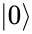 describes paths that don’t. The coefficients  and  describe the relative “weights” of the different paths. Using the quantum model, we can obtain a probabilistic prediction of whether the detector will click or not:

For this example, both the classical and the quantum models describe the same real-world phenomenon. We can test the validity of both models by comparing the models’ predictions with what happens in reality.

Note that the two models make very different assumptions about reality. The classical model assumes the photon follows a single path through the circuit, whereas the quantum model assumes the photon can take multiple paths through the circuit. Despite the difference in the mathematical substrate of the models and their fundamentally different views of reality, we can compare the two models’ predictions on the same footing. Note it doesn’t make sense to say one model is more real than the other. The only thing that is real is the photon in the optical circuit, and the photon doesn’t care whether you use classical or quantum models to describe its path.

###[Quantum model peculiarities](./Front matter.md)

We’ll now comment on the relative “intuitiveness” of classical and quantum models and introduce the concept of _quantum measurement_, which is of central importance in quantum mechanics.

Classical models have the advantage of being more intuitively understandable than quantum models. The variables in classical models often correspond to measurable aspects of real-world systems. We can identify the position variable in a classical model with the position of a particle in the real world. Velocity and momentum are harder to understand intuitively, but we have some general intuition about motion and collisions from everyday life. In general, we can understand classical models more readily because it’s easier for us to think about a mechanistic, clockwork-like universe, in which objects push on each other with clearly defined cause and effect, like a clock that goes click, click, click.

In contrast, we do not enjoy such intuitive interpretation of quantum models, since our senses cannot directly perceive movement and interaction at the quantum level. Because quantum models’ states do not directly correspond to observable aspects in the real world, quantum models are often described as mysterious and counterintuitive. Quantum models are harder to understand in part because they use complex vector quantities to represent systems, and complex numbers are more difficult to visualize. For example, visualizing the complex-valued state of a photon  is difficult, since you must think about both the real part and the imaginary part of . Even though we can’t see what  looks like, we can describe it using an equation, and do math calculations with it. In particular, we can compare the predictions obtained from calculations based on the quantum state  to measurements performed in the real world.

The process of _quantum measurement_ is how we map the predictions of the quantum model to observable quantities. A quantum measurement acts on a particle’s wave function  to produce a classical outcome. **Performing quantum measurements is like asking questions of particles, and the measurement outcomes are the answers to these questions.**

Since measurement outcomes correspond to real-world quantities that can be measured, we can judge the merits of quantum models the same way we judge the merits of classical models—in terms of the quality of their predictions.

###[Chapter overview](./Front matter.md)

In the next section, we’ll describe a tabletop experiment involving lasers and polarization lenses, with an outcome that’s difficult to explain using classical physics. The remainder of the chapter will introduce the tools needed to explain the outcome of this experiment in terms of quantum mechanics. We’ll start by introducing a special notation for vectors that is used to describe quantum phenomena [Section 9.1.4](./Chapter 9_ Quantum mechanics.md)).

In[Section 9.3](./Chapter 9_ Quantum mechanics.md), we’ll formally define the “rules” of quantum mechanics, also known as the _postulates_ of quantum mechanics. We’ll learn the “rules of the game” using the simplest possible quantum systems (qubits), and define how quantum systems are prepared, how we manipulate them using _quantum operations_, and how we extract information from them using _quantum measurements_. This part of the chapter is based on the notes from the introductory lectures of a graduate-level quantum information course, so don’t think you’ll be getting some watered-down, hand-wavy version of quantum mechanics. You’ll learn the real stuff, because I know you can handle it.

In[Section 9.4](./Chapter 9_ Quantum mechanics.md) we’ll apply the quantum formalism to the polarizing lenses experiment, showing that a quantum model leads to the correct qualitative and quantitative prediction for the observed outcome. We’ll close the chapter with short explanations of different applications of quantum mechanics with pointers for further exploration about each topic.

Throughout the chapter, we’ll focus on _matrix_ quantum mechanics and use computer science language to describe quantum phenomena. A computer science approach allows us to discuss the fundamental aspects of quantum theory without introducing all the physics required to understand atoms. Finally, I just might throw in a sample calculation using the wave function of the hydrogen atom, to give you an idea of what that’s like.

##[9.1 Polarizing lenses experiment](./Chapter 9_ Quantum mechanics.md)

Let’s run through a simple tabletop experiment that illustrates the limitations of classical, deterministic reasoning. The outcome of the experiment will highlight the need for careful consideration of the measurements used in scientific experiments.

We’ll describe the experiment using words and diagrams, but you can easily reproduce the experiment in your own “lab,” since it requires only simple equipment. I encourage you to try it yourself. You’ll need three polarizing lenses, a laser pointer, a piece of paper, and three binder clips for holding the lenses upright. You can buy polarizing lenses on the cheap from a second-hand camera shop—any polarizing lens will do.

###[Background](./Front matter.md)

In photography, polarizing lenses are used to filter out undesirable light reflections, like reflections that occur from water surfaces or glass windows. To better understand the experiment, we need to introduce some basic notions about the physics of light, specifically the concept of light polarization.

Light consists of photons. Photons are travelling pulses of electromagnetic energy. Electromagnetic energy can travel through space in the form of a wave. Polarization refers to the orientation of the electric field  of a propagating electromagnetic wave.

Light is normally unpolarized, meaning it corresponds to a mixture of photons that have electric and magnetic components of random orientation. A light beam is _polarized_ if all its photons have the same orientation of their electric field.

Figure 9.1: A photon is a pulse of electromagnetic energy. The energy of a photon travels in the form of a wave that has an electric component  and a magnetic component . The figure shows a photon travelling in the positive \-direction with its electric component along the \-axis.

Light reflected from flat surfaces, like the surface of a lake or a glass window, becomes polarized, which means the electric components of all the reflected photons become aligned.

Photographers use this fact to selectively filter out light with a particular polarization. A _polarizing filter_ or _polarizing lens_ has a special coating which conducts electricity in one direction, but not in the other. You can think of a polarizing lens as a surface covered by tiny conductive bands that interact with the electric component of incoming light particles. Light rays that hit the polarizing lens will either pass through or be reflected depending on their polarization. Light particles with a polarization perpendicular to the conductive bands pass through the lens, while light particles with polarization parallel to the conductive bands are reflected. This is because the surface of the lens has different conductive properties in the parallel and perpendicular directions.

Figure 9.2: Incoming photons interact with the horizontal conductive bands of a polarizing lens. The horizontal bands of the lens reflect the horizontal component of the photons’s electric field. Vertically-polarized photons pass through the lens because the conductive bands are perpendicular to their electric field. Thus, a vertically polarizing lens denoted  allows only vertically polarized light to pass through.

Consider the illustration in[Figure 9.3](./Chapter 9_ Quantum mechanics.md). The effect of a vertically polarizing lens on a beam of light is to only allow vertically polarized light to pass through.

Figure 9.3: A vertically polarizing lens () allows only vertically polarized light particles to pass through.

In[Figure 9.4](./Chapter 9_ Quantum mechanics.md) we see another aspect of polarizing lenses. If the light is already vertically polarized, adding a second vertically polarizing lens will not affect the beam. All light that passes through the first lens will also pass through the second.

Figure 9.4: A second vertically polarizing lens has no further effect since light is already vertically polarized.

Taking a vertically polarizing lens and rotating it by 90 degrees turns it into a horizontally polarizing lens. See[Figure 9.5](./Chapter 9_ Quantum mechanics.md).

Figure 9.5: A horizontally polarizing lens () allows only horizontally polarized light particles to pass through.

Note that horizontally polarizing lenses and vertically polarizing lenses are complementary: vertically polarized light will not pass through a horizontally polarizing lens. This situation is illustrated in[Figure 9.6](./Chapter 9_ Quantum mechanics.md).

Figure 9.6: Placing a horizontally polarizing lens after the vertically polarizing lens has the effect of filtering all light. Zero photons make it through both filters, which we indicate with the empty set symbol 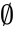.

The previous examples can familiarize you with the properties of polarizing lenses, in case you don’t have actual lenses to play with. If you do have polarizing lenses, you can shine a laser pointer through them, observing when light passes through and when light is filtered out. Use binder clips to position the lenses on a flat surface, and reproduce the setup in[Figure 9.4](./Chapter 9_ Quantum mechanics.md). Don’t worry about finding the exact orientation for “vertical.” Any orientation of the lenses will do, as long as the first and the second polarizing lens have the same orientation. Next, you can rotate the second lens by 90 to obtain the setup shown in[Figure 9.6](./Chapter 9_ Quantum mechanics.md), where the second lens has a perpendicular orientation and thus rejects all light.

#####[Example](./Front matter.md)

Polarized sunglasses leverage the properties of light polarization to make outdoor activities more enjoyable. When a beam of light bounces off the surface of a lake, it becomes horizontally polarized. This polarization effect is due to the interaction of light’s electric field at the surface of the water. A person wearing vertically polarizing lenses (polarized sunglasses) cannot see the sun’s reflection off the water surface because the \-polarizing lenses filter out the horizontally polarized light reflected from the surface of the lake. This effect is useful for people who are often outdoors in bright sunlight, as it reduces the blinding effect of the sun’s reflection.

###[Classical physics paradigm](./Front matter.md)

Before we describe the outcome of the polarizing lenses experiment, let’s take a moment to describe the assumptions about the world that 19th\-century physicists held. Understanding this classical world view will explain why the outcomes of the polarizing lenses experiment are so surprising.

The classical laws of physics are deterministic, meaning they do not allow randomness. According to the classical school, experimental outcomes depend on _definite_ variables, like the properties of particles. Physicists assume they can predict the outcome of any experiment given they know the properties of the particles involved. If some outcome cannot be predicted, it must be because the value of some property of the particles is unknown. In other words, everything happens for a reason. Another key assumption classical physicists make is that a photon’s properties are immutable, meaning we cannot change them. Classical physicists assume their **experiments correspond to passive observations** that cannot change the system’s properties.

A 19th\-century physicist would expect the outcomes of polarizing lenses experiments to be fully determined by the polarization property of photons. Each photon carries a tag `H` or `V` that describes its polarization. In the setup shown in[Figure 9.3](./Chapter 9_ Quantum mechanics.md), each photon that passes through the lens must have `tag="V"`, because we know by definition that a \-polarizing lens only allows vertically polarized photons to pass through. Readers familiar with SQL syntax will recognize the action of the vertically polarizing lens as the following query:

In other words, out of all the incoming photons, only the vertically polarized photons pass through the lens. Similarly, for the \-polarizing lens shown in[Figure 9.5](./Chapter 9_ Quantum mechanics.md), the filtering process can be understood as the query:

In both cases, classical physicists would assume that whether or not a photon passes through a lens is predetermined, and is dependent only on the photon’s tag.

For the purpose of our discussion, we’ll restrict our attention to photons with either horizontal (`tag="H"`) or vertical (`tag="V"`) polarization. There are other possible polarization directions, but we’ll focus on the tags `H` and `V` because they’re mutually exclusive—if a photon is horizontally polarized, we know a vertically polarizing lens will reject it. We can assert that photons that pass through an \-polarizing lens are not vertically polarized; if they were, these photons would reflect off the lens instead of passing through.

###[Polarizing lenses experiment](./Front matter.md)

The physics experiment we’ll describe consists of sending photons through an optical circuit made of polarizing lenses and observing how many photons pass through the circuit. We describe the number of photons that reach any point in the circuit in qualitative terms, by referring to the _optical power_ reaching that point, denoted . We choose the light intensity of the beam after it passes through the first polarizing lens as our reference, and call it  (full brightness). You can think of optical power as brightness. If you were to insert a piece of paper somewhere in the optical circuit, the optical power would measure the brightness of the spot of light on the paper at that particular location in the circuit. When power , the spot of light is fully bright. If  the spot is half as bright as when . The case  corresponds to zero brightness and occurs when no photons hit the piece of paper.

The initial setup for the experiment consists of an \-polarizing lens followed by a \-polarizing lens, as shown in[Figure 9.7](./Chapter 9_ Quantum mechanics.md).

Figure 9.7: The initial setup for the polarizing lenses experiment consists of an \-polarizing lens followed by a \-polarizing lens. Only photons with `tag="H"` can pass through the first lens, so no photons with `tag="V"` pass through the first lens. No photons can pass through both lenses since the \-polarizing lens accepts only photons with `tag="V"`.

We know the photons that pass through the first lens are horizontally polarized. It’s no surprise that when this light hits the second lens, none of the photons make it through, since a \-polarizing lens rejects \-polarized photons.

#####[Adding a third lens](./Front matter.md)

We now introduce a third lens between the first two lenses, and we orient the middle lens differently from the other two—in the diagonal direction, for example. The result is shown in[Figure 9.8](./Chapter 9_ Quantum mechanics.md). Suddenly, light appears at the end of the circuit! How does this make sense? You tell me if this is crazy or not. Intuitively, adding more filtering only reduces the amount of light passing through the circuit; yet the amount of light that passes through the circuit increases when we add the middle filter. How can adding more filtering increase light intensity? What is going on?

Figure 9.8: Adding an additional polarizing lens in the middle of the circuit causes light to appear at the end of the optical circuit.

We pick the middle lens to be a diagonally polarizing lens . A diagonally polarizing lens is obtained by rotating any polarizing lens by 45. The exact choice for the middle lens is not crucial for the experiment to work; so long as its polarization is different from the \- and \-polarizing lenses that surround it.

For a demonstration of the three-polarizing lenses experiment, see this Youtube video:[`https://youtu.be/PJHCADY-Bio?t=6m14s`](./PJHCADY-Bio_t=6m14s.md).

###[Classical analysis](./Front matter.md)

The experimental observations illustrated in[Figure 9.8](./Chapter 9_ Quantum mechanics.md) are difficult to explain using the classical way of thinking, in which particle properties are immutable tags, and experiments are passive observations.

We have evidence that a particle’s state can change during the process of measurement. Let’s examine this more closely. We’ll trace the path of the photons through the optical circuit in[Figure 9.8](./Chapter 9_ Quantum mechanics.md), keeping track of what we know about the photons at each stage. First, all photons that pass through the first \-polarizing lens are known to be horizontally polarized (`tag="H"`). We’re sure no \-polarized photons pass through the first lens, because an \-polarizing lens is guaranteed to reject all \-polarized photons. Yet, after passing through the second lens (the  lens), these same photons appear to be vertically polarized since they pass through the third lens. Is something wrong with the tagging system? It seems the photons’ tag states are affected by the measurements performed on them. This fact is difficult to explain for classical physicists since they assume measurements correspond to passive observations. In the classical paradigm, measuring a photon’s \-polarization using the middle lens should not affect its `H` and `V` tags.

In[Section 9.3](./Chapter 9_ Quantum mechanics.md) we’ll revisit the polarizing lenses experiment after we have learned the postulates of quantum mechanics. We’ll see we can explain the outcome of the experiment by describing the photon’s polarization in terms of vector-like states; and that our understanding of vectors can even predict the final light intensity of  we observed during the experiment. Before we discuss the postulates of quantum mechanics [Section 9.3](./Chapter 9_ Quantum mechanics.md)), we’ll need to introduce some new notation for describing quantum states.

This section is a quick primer on Dirac notation, which is a precise and concise language for talking about vectors and matrices. The Dirac notation for vectors 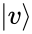 is an alternative to the usual notations for vectors like  or .

This new notation will look weird initially, but once you get the hang of it, I guarantee you’ll like it. Learning Dirac notation is an excellent way to review essential linear algebra concepts like bases, vectors, inner products, and matrices. Understanding Dirac notation is essential if you’re interested in learning quantum mechanics, but it’s also worth learning “just because”—it’s _that_ cool.

We’ll now discuss several vector topics you’re familiar with, and compare standard vector notation  with the equivalent Dirac notation .

####[The standard basis](./Front matter.md)

Consider a \-dimensional complex vector space . We refer to complex vector spaces as Hilbert spaces, in honour of David Hilbert, who contributed prolific developments to math and physics.

To understand any vector space, it is essential to construct a basis for the space. A natural choice for a basis is the standard basis, which we’ll denote . The basis vectors are defined as:

Note the indices are shifted by one so the first basis vector has index , not index . This zero-based indexing is chosen to make certain links between quantum theory and computer science more apparent.

One benefit of Dirac notation is that it doesn’t require writing subscripts. To refer to a vector associated with properties , , and , we can write , instead of the more convoluted expression .

We’ll now focus solely on the two-dimensional complex vector space ; however, the results and definitions presented below also apply to vectors of any dimension.

####[Vectors](./Front matter.md)

In Dirac notation, a vector in  is denoted as a _ket_:

where  and  are the _components_ of  and  is the standard basis for :

Why do we call the angle-bracket thing a “ket,” you ask? Let me tell you about the _bra_ part, and then it will start to make sense.

The Hermitian transpose of the ket-vector  is the _bra_\-vector :

![\bra{v} 	= 	\overline{\alpha}\bra{0} + \overline{\beta}\bra{1} 
\qquad
\Leftrightarrow
\qquad[\overline{\alpha},  \overline{\beta} ]			
= 		\overline{\alpha}[1,0] + \overline{\beta}[0,1].
\qquad](../Images/0637782ac9a2e9904c1e2ca348606211d288f364.png)

Recall that the Hermitian transpose, also called the complex transpose, is the combination of the regular transpose () and the complex conjugation of each component of the vector (), and is denoted as the dagger operator “” (see page 6.7.1.3 for a refresher on the dagger operator). Now observe how much simpler the _bra_ notation for the Hermitian transpose of a vector is compared to the other notations we’ve seen so far:

When you put a bra  next to a ket , they become a bra-ket , which looks very similar to the brackets used to denote the inner product between two vectors. Observe the relative notational simplicity of calculating the inner product between the vectors  and  in Dirac notation:

Complex conjugation was already applied to the coordinates of  when transforming it into a bra-vector , thus we can simply “put together” the bra and the ket to compute the inner product. Because the bra notation  contains the Hermitian transpose, it removes the need for the dagger symbol. For instance, the inner product of  with itself is

This small simplification of the notation for inner products is quite useful, since inner products are the workhorse for calculating vector coordinates, finding projections, and performing change-of-basis transformations. The concise notation enables us to dig deeper into these aspects of linear algebra without getting overwhelmed by notational complexity. Moreover, Dirac’s bra-ket notation is sufficiently simple to use in equations without needing to define new variables  for vector coordinates. We’ll look at this more closely in the next section.

####[Vector coordinates](./Front matter.md)

The _coordinates_  of a vector  with respect to an orthonormal basis  are computed using the inner product . In Dirac notation, the coordinates of  with respect to the standard basis  can be written as . We can write any vector  as a linear combination of kets, with bra-kets as coefficients:

The expression  explicitly defines the th coordinate of ; therefore, we don’t need to define the variable .

Another basis for the vector space  is the _Hadamard basis_, which corresponds to the standard basis rotated by  in the counter-clockwise direction:

The Hadamard basis, henceforth denoted , is an orthonormal basis:

Since the Hadamard basis  is an orthonormal basis, we can express any vector  as a linear combination of kets:

Note that the coefficients of the linear combination are computed using the inner product with the corresponding basis vector  and . The bra-ket notation allows us to refer to the coordinates of  with respect to , without the need to define variables  and .

It’s not uncommon to see vector coordinates with respect to different bases used in calculations. With the usual vector notation, we must specify which basis we’re using as a subscript. For example, the same vector  can be expressed as a coordinate vector  with respect to the standard basis , or as a coordinate vector  with respect to the Hadamard basis. In the bra-ket notation, the coordinates with respect to  are  and , and the coordinate with respect to  are  and , making the choice of basis evident.

####[Change of basis](./Front matter.md)

Consider the task of finding the _change-of-basis_ matrix ![\!\tensor[_{B_h}]{\left[\mathbbm{1}\right]}{_{B_s}}](../Images/9cfa8e1d041179b0d30b22038d5dd2fc0116c10c.png) that converts vectors from the standard basis  to the Hadamard basis .

Using the standard approach for finding change-of-basis matrices discussed in[Section 4.3.7](./Chapter 4_ Geometric aspects of linear algebra.md) (page 4.3.7), we know the columns of ![\!\tensor[_{B_h}]{\left[\mathbbm{1}\right]}{_{B_s}}](../Images/9cfa8e1d041179b0d30b22038d5dd2fc0116c10c.png) contain the coordinates of  and  as expressed with respect the basis :

![\!\tensor[_{B_h}]{\left[\mathbbm{1}\right]}{_{B_s}}
\; = \; 
\tensor[_{B_h\!}]{
\begin{bmatrix}
\braket{+|0} \!	&	\! \braket{+|1}	\\
\braket{-|0}  \!	&	\! \braket{-|1}
\end{bmatrix}
}{_{\!B_s}}
\; = \; 		
\tensor[_{B_h\!}]{
\begin{bmatrix}
\tfrac{1}{\sqrt{2}}	&	\tfrac{1}{\sqrt{2}}	\\
\tfrac{1}{\sqrt{2}}	&	-\tfrac{1}{\sqrt{2}} 
\end{bmatrix}
}{_{\!B_s}}\!.](../Images/6855a9e3a640ce849a81001801875ec74a7edfc8.png)

We can now compute the coordinates of any vector  with respect to the Hadamard basis, by multiplying  by the change-of-basis matrix:

![\begin{align*}
\colvec{ v_+\\ v_- }_{\!B_h}
&=  \!\tensor[_{B_h}]{\left[\mathbbm{1}\right]}{_{B_s}} \colvec{ v_0 \\ v_1 }_{\!B_s}			\\
&=
\tensor[_{B_h\!}]{
\begin{bmatrix}
\tfrac{1}{\sqrt{2}}	&	\tfrac{1}{\sqrt{2}}	\\
\tfrac{1}{\sqrt{2}}	&	-\tfrac{1}{\sqrt{2}}
\end{bmatrix}
}{_{\!B_s}}\!
\colvec{ v_0 \\ v_1 }_{\!B_s}					\\
&=	\colvec{  \tfrac{1}{\sqrt{2}}\big( v_0 + v_1\big) 		\\
\tfrac{1}{\sqrt{2}}\big( v_0 - v_1 \big)
}_{\!B_h}.
\end{align*}](../Images/2bce151d39c9f5ab1c40ee302624e516d0c5de10.png)

This is the usual approach for computing the coordinates of a vector in one basis in terms of the coordinates of another basis using matrix notation.

Consider now the same change-of-basis operation, but with calculations carried out in Dirac notation. Given the vector  expressed as coordinates with respect to the standard basis , we want to find . Starting from the definition of  and , we obtain

Working from the definitions of vectors and their coordinates, and using only basic algebra rules, we can perform the change-of-basis operation without explicitly constructing the change-of-basis matrix.

####[Outer products](./Front matter.md)

Recall the _outer product_ operation for vectors that we introduced in[Section 5.2](./Chapter 5_ Linear transformations.md) (see page 5.2.3.5). The expression  is equivalent to the _projection_ onto the subspace spanned by the vector :

We can verify this by considering the product of  and an arbitrary vector :

The ability to easily express outer products is another win for Dirac notation. For example, the projection onto the \-subspace is .

####[Matrices](./Front matter.md)

Now get ready for some crazy stuff. It turns out outer-product expressions are useful not only for projections, but can in fact represent any matrix. Consider the linear operator  and its matrix representation with respect to the standard basis:

![\begin{align*}
\tensor[_{B_s}]{\left[A\right]}{_{B_s}}  
&=
\tensor[_{B_s}]{
\begin{bmatrix}
a_{00}	&	a_{01}	\\
a_{10}	&	a_{11}	\\
\end{bmatrix}
}{_{B_s}}\!.
\end{align*}](../Images/0f7e2bc5722bdb0cd41d783aab687560ea660a3b.png)

Instead of positioning the entries in an array, we can represent  as a linear combination of outer products:

Consider the matrix vector product . The matrix entry  describes the multiplication factor that connects the \-component in the input  to the \-component of the output vector . The expression  is a concise description of the same story. The  in this expression will “select” only the  component of the input, and the  indicates that this term contributes to the  component of the output.

The entries of the matrix representation ![\tensor[_{B_s}]{\left[A\right]}{_{B_s}}](../Images/97bfbaf85a8e24b39f5472fcb7edb2dedb8983cd.png) depend on the choice of bases for the input and output spaces. The value of the entry  in the matrix representation is computed by “probing” the matrix with the th basis vector of the input basis, and observing the value of the th component in the resulting output. We can express the entire “probing procedure” easily in Dirac notation: . Thus, we can write the matrix entries as follows:

![\begin{align*}
\tensor[_{B_s}]{
\begin{bmatrix}
a_{00}	&	a_{01}	\\
a_{10}	&	a_{11}	\\
\end{bmatrix}
}{_{B_s}}							
&=
\tensor[_{B_s}]{
\begin{bmatrix}
\bra{0}A\ket{0}	&	\bra{0}A\ket{1}	\\
\bra{1}A\ket{0}	&	\bra{1}A\ket{1}	\\
\end{bmatrix}
}{_{B_s}}.
\end{align*}](../Images/c26cbb6c0b6e47592170f9aa2ffaf78679197620.png)

In fact, we don’t need matrix notation or the entries  at all. Instead, we can express  as a linear combination of outer products, with appropriately chosen coefficients:

Let’s verify the formula for the \-entry of , to see how this linear combination of outer products thing works. We start from the definition , and multiply  by  from the right and  from the left:

![\begin{align*}
\bra{1}A\ket{0}
&=
\bra{1}
\Big(
a_{00} \ketbra{0}{0} + a_{01}\ketbra{0}{1} +  a_{10} \ketbra{1}{0} + a_{11}\ketbra{1}{1}
\Big)
\ket{0}		\\
&= 
\bra{1}
\Big(
a_{00} \ket{0} \!\underbrace{\!\!\braket{0|0}\!\!}_1
+ a_{01}\ket{0} \!\underbrace{\!\!\braket{1|0}\!\!}_0 
+  a_{10} \ket{1} \!\underbrace{\!\!\braket{0|0}\!\!}_1
+ a_{11}\ket{1} \!\underbrace{\!\!\braket{1|0}\!\!}_0 
\!\Big)														\\
&=
\bra{1}
\Big(
a_{00} \ket{0} 
+  a_{10} \ket{1} 
\Big)														\\
&= 	    a_{00} \,\underbrace{\!\braket{1|0}\!}_0 \, 
+  a_{10} \,\underbrace{\!\braket{1|1}\!}_1 \,	= a_{10}.
\end{align*}](./images/a8c805aae4df62a383936011f5e9d3f64a8b6948.png)

Indeed,  is the same as . In fact, we’ll rarely use the notation , since  is just as easy to write, and much more intuitive: the \-entry of  is what you obtain when you “sandwich” the matrix  between the vectors  on the left and  on the right.

In Dirac notation, the basis appears explicitly in expressions for entries of a matrix. We can define the entries of  in any other basis easily and precisely. The representation of  with respect to the Hadamard basis  is

![\begin{align*}
\tensor[_{B_h}]{\left[A\right]}{_{B_h}}  
&=
\tensor[_{B_h}]{
\begin{bmatrix}
\bra{+}A\ket{+}	&	\bra{+}A\ket{-}	\\
\bra{-}A\ket{+}	&	\bra{-}A\ket{-}	\\
\end{bmatrix}
}{_{B_h}}\!,
\end{align*}](../Images/8e82d1de18ab6b32b3b6242807809b26510d44a3.png)

or equivalently,

The coefficient  is the \-entry of the matrix representation of  with respect to the Hadamard basis .

#####[Summary](./Front matter.md)

Dirac notation is a convenient way to represent linear algebra concepts: vectors  and their Hermitian transposes , vector coordinates , inner products , outer products , and matrix entries . Because of this expressiveness, Dirac notation is widely used when discussing quantum mechanical topics in modern chemistry, physics, and computer science. In particular, Dirac notation is a core component in the study of quantum mechanics. In fact, we could say that if you understand Dirac notation, you already understand half of quantum mechanics.

###[Exercises](./Front matter.md)

E9.1 Consider the vectors  and , which are elements of . Express the ket  and the bra  as four-dimensional coordinate vectors. Indicate whether your answers correspond to row vectors or column vectors.

E9.2 Express the vector  as a ket  and as a bra . Compute its length .

E9.3 Find the determinant of the following matrix:

E9.4 Consider the vectors , , and . Compute the following expressions:

1.  
2.  
3.  
4.  
5.  
6.  
7.  
8.  
9.  
10.  

The projection matrix onto a unit vector  is equal to .

E9.5 Given the matrix  and the vectors  and , compute:

1.  
2.  
3.  
4.  
5.  
6.  

E9.6 Express the linear transformation  as a matrix that acts on an input vector of the form .

##[9.2 Quantum information processing](./Chapter 9_ Quantum mechanics.md)

Digital technology is sought after because of the computational, storage, and communication advantages of manipulating digital information instead of continuous-time signals. Similarly, quantum technology enables certain new advances for computational and communication tasks. This section will equip you with a mental model for thinking about quantum information processing tasks in analogy to a digital information processing pipeline you’re already familiar with: the digitization, compression, and playback of sound recording that we discussed in[Section 7.11.6](./Chapter 7_ Applications.md) (page 7.11.6).

The use of quantum technology for information processing tasks is no more mysterious than the use of digital technology for information processing tasks. Playing a digital recording on your `mp3` player involves a number of processing, conversion, and signal amplification steps. Similarly, using a quantum computer involves several conversion, processing, and measurement steps. In both cases you input some data into a machine, and wait for the machine to process the data and output the answer.

We can think of both digital and quantum technology as black box processes, with internal workings that we can’t access directly. In both cases, the intermediate representation of data is in a format that is unintelligible: we can’t understand what is encoded in quantum states any more than we can understand what is encoded in digital data. For instance, an `mp3` file contains ones and zeros; but, unless we’re unusually gifted, it’s impossible to tell which artist plays the song  just by looking at the raw, digital data. To understand information processing in the digital and quantum worlds, we must study the “adaptors”—the processes used to convert the internal data representation into signals we can intelligibly perceive.

To further highlight the parallel structure between digital information processing and quantum information processing, we’ll now review the `mp3` compression task as an example of a digital information processing pipeline.

###[Digital signal processing](./Front matter.md)

A _sound card_ is a computer component that converts between analog signals that we can hear and digital signals that computers understand. The sound card digitizes sound using an analog-to-digital converter (ADC). For music playback, the sound card uses a digital-to-analog converter (DAC), which transforms digital sounds into analog sound vibrations to be played through speakers. The ADC receives signal via the sound card’s line-in and microphone jacks; the DAC outputs sound via the sound card’s line-out and headphone jacks.

Figure 9.9: A digital information processing pipeline for sound recording and playback. Sound vibrations are captured by a microphone and converted to digital form using an analog-to-digital converter (ADC). Next the digital `wav` file is converted to the more compact `mp3` format using digital processing. In the last step, sound is converted back into analog sound vibrations by a digital-to-analog converter (DAC).

[Figure 9.9](./Chapter 9_ Quantum mechanics.md) illustrates a full digital information processing pipeline for sound. We use an _analog-to-digital converter_ (ADC) to transform the analog sound into digital form; the sound’s digital representation is then processed, and finally a _digital-to-analog converter_ (DAC) transforms the digital signal into analog form. If the music encoding, processing, and playback steps are successful, the final output will sound like the original sound recorded.

The grey-shaded region in[Figure 9.9](./Chapter 9_ Quantum mechanics.md) corresponds to digital data. The example of `mp3` compression is just one of many uses of digital processing that become possible once we convert analog information into digital form. Information stored in digital form allows for countless other affordances: the long-term storage of the `mp3` file, the file’s transmission over the internet, or the computation of a digital fingerprint of the song. Mathematically speaking, we can describe any digital information processing task as a function, , that takes \-dimensional binary vectors as inputs and produces \-dimensional binary vectors as outputs.

###[Quantum information processing](./Front matter.md)

In order to understand the context where quantum information processing has applications, we’ll describe a hypothetical scenario. Suppose you’re trying to calculate the output of some mathematical function  for the input . Your first approach is to express the math function  as a function in code , but you quickly notice that running the code of the function  takes too long for the types of inputs you’re interested in. Computing `f(x)` would take a century on your laptop, and even if you ran your code on a powerful cluster of computers, it might still take years to compute the output. Normally people quit at this point.

You’re not a quitter though, so instead of waiting for the classical computer to finish computing , you decide to use a quantum computer.[Figure 9.10](./Chapter 9_ Quantum mechanics.md) shows the sequence of steps needed to operate a quantum computer. Starting from the input  expressed as a classical bitstring , you use state preparation to encode the input into a quantum vector  inside the quantum computer. You can then perform quantum operations on the input state to transform it to an output state . Finally, you perform a measurement on the output state  to obtain a classical bitstring , which is hopefully the answer you’re looking for.

The main difference between classical and quantum computation is the underlying data types used in the computation. Instead of working with _bits_ and using digital functions , quantum computers work with _qubits_ and use _quantum operations_  to perform computations. Quantum computation is more general than classical computation since quantum computers can make use of quantum effects like constructive interference.

The other big difference between classical and quantum computation is that the quantum computer outputs the state  only once. You can think of **quantum measurement as asking a question** about the state . You’re free to perform any measurement, but **you can ask only one question**, since quantum measurements disrupt the state of a system.

Figure 9.10: A quantum information processing pipeline. A classical bitstring  of length  is used as instructions for preparing an \-dimensional quantum state . Next, quantum operations are performed on the state  to convert it to the output state . Finally, the state  is _measured_ to obtain the classical bitstring  as output.

Quantum processing pipelines are analogous to digital information processing pipelines. The process of _state preparation_ in quantum processing is analogous to the analog-to-digital conversion step in digital processing. In both cases we convert the input to the format required for the processing step. Similarly, quantum _measurements_ correspond to the digital-to-analog conversion step. In both cases we must convert the output to a format we can understand.

In the next section, we’ll discuss the components of the quantum information processing pipeline in more detail. We’ll introduce the four _postulates_ of quantum mechanics, which specify how quantum systems are represented and what we can do with them. The postulates of quantum mechanics roughly correspond to the conversion steps illustrated in[Figure 9.10](./Chapter 9_ Quantum mechanics.md). One postulate defines how quantum states are prepared, another postulate describe the types of operations we can perform on quantum states, and a third postulate formally defines the process of quantum measurement. The next section is the “quantum mechanics explained in the space on the back of an envelope” part alluded to in the introduction of this chapter. We’ve set the scene, introduced Dirac notation, and now we can finally discuss the details of the quantum formalism.

##[9.3 Postulates of quantum mechanics](./Chapter 9_ Quantum mechanics.md)

The _postulates_ of quantum mechanics dictate the rules for working within the “quantum world.” The four postulates define:

-   What quantum states are
-   Which quantum operations can be performed on quantum states
-   How to extract information from quantum systems by measuring them
-   How to represent composite quantum systems

These postulates specify the structure that all quantum theories must have. Together, the four postulates are known as the _quantum formalism_, and describe the math structure common to all fields that use quantum mechanics: physics, chemistry, engineering, and quantum information. Note the postulates are not provable or derivable from a more basic theory: scientists simply take the postulates as facts and make sure their theories embody these principles.

###[Quantum states](./Front matter.md)

Quantum states are modelled as special types of vectors. The _state_ of a \-dimensional quantum system is a unit vector , in a \-dimensional complex inner product vector space , which we call the Hilbert space. This is the first postulate that belongs on the back of the envelope.

To every isolated quantum system is associated a complex inner product space (Hilbert space) called the _state space_. A state is described by a unit vector in state space.

The following comments apply to the description of quantum systems:

-   The requirement that state vectors must have length one will become important when we discuss the probabilistic nature of quantum measurements.
-   The _global phase_ of a quantum state vector doesn’t matter, which means . The vectors , , and  all represent the same quantum state.
-   Each physical system corresponds to its own Hilbert space, usually denoted with the same label as the system,  and .

In general, the quantum states of physical systems are represented as vectors in \-dimensional or sometimes even infinite-dimensional Hilbert spaces. To keep things simple, we’ll focus on two-dimensional quantum systems.

#####[The qubit](./Front matter.md)

In analogy with two-state classical bits  we call two-dimensional quantum systems _qubits_ , which is short for _quantum bit_. Many physical systems, like the polarization of a photon or the spin of an electron, can be represented as qubits. A qubit is a unit vector in a two-dimensional Hilbert space :

where

Recall that  and  are the vectors of the standard basis for :

The restriction that  must be a real number follows from the fact that the global phase of a quantum state can be ignored. The condition that a quantum state must have length one is equivalent to the constraint .

Figure 9.11: A photon encounters a half-silvered mirror, which is also known as a beam splitter. The photon can take one of the two possible paths, so we describe it as the superposition , where  describes the photon passing through the mirror, and  describes the photon being reflected.

Though the notion of a qubit is an abstract concept, many physical systems can embody it. In[Figure 9.11](./Chapter 9_ Quantum mechanics.md), the information of a qubit is encoded in the path a photon takes after it encounters a half-silvered mirror. Qubits are a device-independent representation of quantum information, similar to how classical bits are device-independent representations for classical information. A bit is a bit, regardless of whether it is transmitted over the network, stored in RAM, or stored on a hard drive. Similarly, a qubit is a qubit, regardless of whether it’s encoded in the polarization of a photon, an electron’s spin, or in the direction of magnetic flux of a superconducting loop.

#####[Quantum state preparation](./Front matter.md)

The operation of encoding some classical information into a quantum system is called _state preparation_. Imagine an apparatus that prepares quantum systems in one of several possible quantum states, depending on the position of the “control switch”  of the machine.

Figure 9.12: The classical input  is used to prepare a quantum system. The quantum state  is produced when the classical input is .

An example of quantum state preparation is a machine that can produce photons in two different polarizations  and . If the input 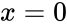 is specified, the machine will produce the state , and if  is specified as the input, the machine will produce .

The quantum state preparation step is analogous to the analog-to-digital conversion step; it’s how we get classical information into a quantum computer. Once we have converted the input  into a quantum state , the natural next question to ask is what we can _do_ with . What quantum operations are we allowed to perform on quantum states?

###[Quantum operations](./Front matter.md)

The second definition we can write on the back of the envelope is about identifying _quantum operations_ with unitary transformations acting on quantum states. Every quantum operation can be represented as a unitary operation  applied to the input state  to produce the output state .

The requirement that all quantum operations be unitary is codified in the second postulate of quantum mechanics. Time evolution of an isolated quantum system is unitary. If the state at time  is  and at time  is , then there exists a unitary operator  such that . This is a major piece of the quantum puzzle, so let’s analyze what it means: mathematically, physically, and computationally.

First let’s get the math out of the way. Recall that a unitary matrix  obeys . Postulate 2 ensures that quantum states will maintain their unit-length property after quantum operations are performed on them. Assume the quantum system starts from a state  that has length one, . After the unitary  is applied, the state after evolution will be  and its squared length will be . In other words, **quantum operations are length-preserving**.

The second postulate refers explicitly to a time variable and the state of the system at different times, which is the physics way of thinking about quantum operations. For example, applying a quantum operation to a real physical system could correspond to applying a certain magnetic field to that system. If applying the magnetic field for one second applies the rotation operation , then applying the magnetic field for two seconds performs the rotation ; therefore the time variable is of central importance to the experiment.

The computer science perspective on the second postulate is more abstract. Instead of counting seconds, computer scientists model quantum operations as discrete “gates” that can be applied to quantum states. Computer scientists describe their quantum algorithms in terms of unitary operators , and they assume there exists a specific physical operation that performs the quantum operation  on a real physical qubit system.

In this chapter, we’ll take the computer science approach and think of quantum information processing tasks in terms of applying different gates to quantum states. We’ll now define several quantum gates that perform useful unitary operations on qubits.

#####[Example 1: phase gate](./Front matter.md)

The  operator is defined by its action on the vectors of the standard basis.

The  operator leaves the  unchanged but flips the phase of .

Given knowledge of the actions of the  operator on the vectors of the standard basis, we can construct its matrix representations:

![Z 
= 
\tensor[_{B_s}]{
\begin{bmatrix}
1	&	0	\\
0	&	-1	\\
\end{bmatrix}
}{_{B_s}}
=
\ketbra{0}{0}  - \ketbra{1}{1}.](../Images/0212d50513ed0c8b6452a877d3e58633ba9aa0de.png)

#####[Example 2: NOT gate](./Front matter.md)

The  operator is defined by the following actions on the vectors of the standard basis:

The  operator acts as a “quantum NOT gate,” changing s into s, and s into s. The matrix representation of the  operator is:

![X 
= 
\tensor[_{B_s}]{
\begin{bmatrix}
0	&	1	\\
1	&	0	\\
\end{bmatrix}
}{_{B_s}}
=
\ket{0}\bra{1}  + \ket{1}\bra{0}.](../Images/266791e5c620bfdfb06b19c75ee858fa75d736b2.png)

#####[Example 3: Hadamard gate](./Front matter.md)

The Hadamard operator takes the vectors of the standard basis to the vectors of the Hadamard basis  and :

You can also think of the  operator as a  counter-clockwise rotation. The matrix representation of the Hadamard gate is

![H 
= 
\tensor[_{B_s}]{	
\left[ \begin{array}{cc}
\frac{1}{\sqrt{2}} 	& \frac{1}{\sqrt{2}} \\
\frac{1}{\sqrt{2}} 	& -\frac{1}{\sqrt{2}}
\end{array} \right]
}{_{B_s}}.](../Images/64c75c65546c9a6e43ca92b918f9cccd105242df.png)

By linearity, we can deduce the effects of the operators , , and  on an arbitrary qubit :

#####[Example 4](./Front matter.md)

The effect of the operator  corresponds to the combination of the effects of the  and  operators. We can understand the action of  either by applying it to an arbitrary qubit :

or by multiplying together the operator’s matrix representations:

![XZ=
\tensor[_{B_s}]{
\begin{bmatrix}
0	&	1	\\
1	&	0	\\
\end{bmatrix}
}{_{B_s}}
\tensor[_{B_s}]{
\begin{bmatrix}
1	&	0	\\
0	&	-1	\\
\end{bmatrix}
}{_{B_s}}
=
\tensor[_{B_s}]{
\begin{bmatrix}
0	&	-1	\\
1	&	0	\\
\end{bmatrix}
}{_{B_s}}.](../Images/ad5d223d419878166a6809e600cb9306d85dde15.png)

In general, it is possible to perform many quantum operations and combinations of operations when working with quantum states. The examples presented above represent the most commonly used operations. Note that unitary time evolution is invertible: for every quantum gate 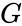 there exists an inverse gate  such that .

####[Links](./Front matter.md)

\[ Wikipedia article on quantum gates \]

[`https://en.wikipedia.org/wiki/Quantum_gate`](./Quantum_gate.md)

####[Exercises](./Front matter.md)

E9.7 The Hadamard gate is defined as . Compute the effect of the operator  on the vectors of the standard basis .

E9.8 Compute , , and .

So far, we’ve filled half the space on the back of the envelope. It’s time to talk about the third fundamental idea in quantum mechanics: quantum measurements.

###[Quantum measurements](./Front matter.md)

A quantum measurement performed on a quantum system corresponds to a collection of projection operators  that act on the Hilbert space. A measurement with  possible outcomes is represented by  projection operators . The projection operators form a _decomposition of the identity_, meaning their sum is equal to the identity matrix:

Intuitively, the  different projection operators correspond to  different alternatives for the evolution of the quantum system. Performing the measurement is like asking “which way is it going to be?” and letting the system decide which path it wants to take. _Born’s rule_ is used to assign probabilities to different measurement outcomes.

A quantum measurement is modelled by a collection of projection operators  that act on the state space of the system being measured and satisfy . The index  labels the different measurement outcomes.

The probability of outcome  when performing measurement  on a quantum system in the state  is given by the squared length of the state after applying the th projection operator:

When outcome  occurs, the post-measurement state of the system is

Let’s unpack this definition to see what is going on.

#####[Born’s rule](./Front matter.md)

For the measurement defined by the projection operators , Born’s rule states that the probability of outcome  is .

This expression for the squared norm of the overlap between  and  can be written in several equivalent ways:

where the last equality follows from the idempotence property of projectors . The last expression, where the projection operator is “sandwiched” by two copies of the quantum state, is the physicist’s usual way of expressing Born’s rule by defining . For the class of projective measurements we’re discussing here, the two definitions are equivalent.

The set of projection operators  forms a decomposition of the identity . This guarantees that the probability distribution of the different outcomes is normalized:

That’s good to check; otherwise Kolmogorov would be angry with us. Note the equality labelled  follows from Pythagoras’ theorem; we’re using the fact that the operators  are mutually orthogonal.

#####[Post-measurement state](./Front matter.md)

When outcome  occurs, Postulate 3 tells us that the state of the quantum system becomes , which is the result of applying the projection  to obtain , and then normalizing the state so that .

Measurements are not passive observations! Quantum measurement is an invasive procedure that typically changes the state of the system being measured. In general, the quantum state after the measurement will not be the same as the state before the measurement:

and we say the state is _disturbed_ by the measurement, (though it’s possible that  when the input state lives entirely within the image space of one of the projection operators ).

A quantum measurement is an interaction that creates classical information and destroys quantum information. By measuring, we obtain the classical information  that tells us which outcome occurred, but we disturb the initial state , forcing the quantum state into the “aligned with ”-state . We can still carry out further experiments with the post-measurement state , but it’s not the same as the initial state . Specifically, we’ve lost all the information about  that used to exist in the subspace .

Another way to describe what happens during a quantum measurement is to say the state  _collapses_ into the state . This is the terminology used by physicists to describe the effects of the projection that occurs during a measurement. Before the measurement, the quantum state  could be any vector, but after we observe the outcome , we know the state has “collapsed” and is now confined to the image subspace of the projection operator . We won’t use the terminology of state collapse in this chapter, because the term “projection” more accurately describes what’s happening.

Historically, the founders of quantum mechanics chose some rather poor terminology to describe quantum measurements. In addition to “collapse,” they also used the term “observer” to describe whomever observes the outcome  of a quantum measurement experiment. Trying to understand quantum mechanics using this terminology often leads to magical thinking and anthropomorphizing of the underlying physical events. Proponents of pop-psychology ideas have latched onto the term “observer” to suggest that the collapse of quantum states that occurs during quantum measurements is caused by the presence of human consciousness. Watch out for that fluff.

A more grounded way to think about quantum measurement is in terms of _interaction_ between the quantum state of a particle and a classical measurement apparatus that can be in one of  possible states. Due to the relative size of the two interacting systems (tiny quantum system and large measurement apparatus), the state  is forced to “align” with one of the  possible states of the measurement apparatus.

#####[Example 4](./Front matter.md)

In Figure  a state vector  is measured with photo detectors modelled as projectors given by

The probability of outcome  is . After the measurement, the quantum system exists in one of two possible states:  or .

#####[Example 5](./Front matter.md)

Consider the measurement  that consists of the projectors onto the Hadamard basis:

Given the quantum state , the probability of outcome “” is given by

![\begin{align*}
\textrm{Pr}( \{ + \} | \psi) 
&= \left\|  \Pi_+  \ket{\psi}	\right\|^2 								\\
&= \left\|  \ketbra{+}{+} 	\ket{\psi} \right\|^2							\\
&= \left\|  \ketbra{+}{+} 	( \alpha \ket{0} + \beta \ket{1} ) \right\|^2			\\
&= \left\| \ket{+} 		( \alpha \braket{+|0} + \beta \braket{+|1} )\right\|^2	\\
&= \left\| \ket{+} 		\left( \alpha \tfrac{1}{\sqrt{2}}  \; \,  +  \beta\tfrac{1}{\sqrt{2}} \right) \right\|^2	\\
&= \frac{|\alpha  + \beta|^2}{2} \left\| \ket{+} \right\|^2						\\
&= \frac{|\alpha  + \beta|^2}{2}.
\end{align*}](./images/955c89e121d8f416d7767145860a2f8951b0e003.png)

The probability of outcome “” is . After the measurement, the quantum system is in one of two possible states:  or .

Figure 9.13: The state of a photon after encountering a \-silvered mirror is . The probability that the horizontal photodetector “clicks” is 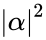, and is obtained by projecting  on the subspace . The probability that the top photodetector clicks is equal to , and is obtained by projecting  on the subspace .

The measurement process is a fundamental aspect of quantum models. You’ll need to acclimate to the idea that measurements change systems’ states. It’s not magic; it’s a phenomenon that occurs due to the relative size of the systems (tiny quantum particles and huge measurement apparatus), and the fact that measurements force quantum and classical systems to interact.

###[Composite quantum systems](./Front matter.md)

So far we discussed state preparation, quantum operations, and quantum measurements of individual qubits. There’s just enough room on the back of our envelope to discuss quantum models for systems made of multiple qubits.

Classically, if we have two bits  and , we can concatenate them to obtain a bit string , which can have one of four possible values: , , , and . The combined state of two qubits  and  is the _tensor product state_  in the four-dimensional _tensor product space_ . A basis for the tensor product space can be obtained by taking all possible combinations of the basis vectors for the individual qubits: .

The state space of a composite quantum system is equal to the tensor product of the state spaces of the individual systems. If systems  exist in states , then the state of the composite system is .

Postulate 4 tells us how we can combine the state spaces of different quantum systems to describe a composite system. Many interesting quantum applications involve operations on multiple qubits and are described by vectors in a tensor product space, so let’s look more closely at this “”-thing.

#####[Tensor product space](./Front matter.md)

If you’d never heard of _tensor products_ before, don’t worry—the only scary part is the tensor product symbol “,” which we’ll explain in this section. A _tensor product space_ consists of all possible combinations of the basis vectors for the two subspaces. For example, consider two qubits  and . We’ll denote the standard basis for 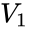 as  and the standard basis for  as . The tensor product space  is four-dimensional and has the following basis:

This level of subscripts and the explicit use of the symbol  hurts the eyes (and the hand if you must use this notation to solve problems). It’s therefore customary to drop the subscripts, omit the tensor product symbol, and draw a single ket that contains a “string” of indices:

The basis for the tensor product space  looks much nicer in the simplified notation:

#####[Tensor product of two vectors](./Front matter.md)

Suppose we’re given two qubits with states described by the following vectors:

Note the subscripts indicate which system we’re describing:  is the state  for the first qubit, while  is the state  of the second qubit.

The state of the combined system is the tensor product state , which is computed by combining all possible combinations of the components of  and the components of :

The notion of “all possible combinations” is easier to see by considering the tensor product operation in terms of the basis vectors:

![\begin{align*}
\ket{\varphi_{ab}}_{12} 	&= \ket{\varphi_a}_1 \otimes \ket{\varphi_b}_2			\\
&= (\alpha_1 \ket{0}_1 + \beta_1\ket{1}_1) 
\otimes (\alpha_2 \ket{0}_2 + \beta_2\ket{1}_2) 		\\
&= \alpha_1\alpha_2 \ket{0}_1\ket{0}_2 
+ \alpha_1\beta_2 \ket{0}_1\ket{1}_2 
+ \beta_1\alpha_2  \ket{1}_1\ket{0}_2 
+ \beta_1\beta_2\ket{1}_1\ket{1}_2 		\\
&= \alpha_1\alpha_2 \ket{00}
+  \alpha_1\beta_2 \ket{01}
+ \beta_1\alpha_2  \ket{10}
+ \beta_1\beta_2\ket{11}				\\
&= \left( \alpha_1\alpha_2,  \; 
\alpha_1\beta_2, \; 
\beta_1\alpha_2,  \; 										
\beta_1\beta_2\right)_{B_{12}},
\end{align*}](./images/74c520eefc5b184552df2e9d5a35da903fd3644d.png)

where  is the standard basis for the tensor product space.

#####[State spaces and dimension counting](./Front matter.md)

A quantum state that consists of  qubits can represent any unit vector in . That’s an insanely big state space—a huge \-dimensional playground. In comparison, a classical bitstring of length  can take on one of  values. Let’s compare the state space of a two-bit classical register  with the state space of a two-qubit quantum register . The classical register can take on one of four possible values:

whereas the quantum register  can be any unit vector in . Similar to a classical registers, the standard basis for the state space of a two-qubit quantum register also consists of four basis vectors:

but the quantum register can also represent superpositions of the basis states like  or .

Using a very large vector space to represent states does not necessarily make a model more powerful, but the large dimension of the tensor product space suggests many new possibilities. Much of the recent excitement in the area of quantum computing is based on the promise of using the qubits of a quantum computer to perform computations in very large quantum state spaces. We shouldn’t get carried away with enthusiasm, because with great state space comes great noise. It’s easy to imagine  qubits in a row in a mathematical model, but building a physical system that can store  qubits and protect them from noise is a much more difficult task. Another bottleneck in quantum computing is the difficulty of extracting information from quantum systems. The quantum state space of  qubits is , but projective measurements of the form  can only obtain _one_ answer to a question with  possible classical outcomes (). We’ll learn more about theoretical and practical considerations for quantum computing in[Section 9.6](./Chapter 9_ Quantum mechanics.md).

###[Exercises](./Front matter.md)

E9.9 Show that the quantum state  is equal to the quantum state .

Express  and  in the basis .

###[Quantum entanglement](./Front matter.md)

At the risk of veering further off-topic for a linear algebra book, we’ll now briefly describe _entangled_ quantum states. In particular, we’ll discuss the properties of the _entangled state_ . Entanglement is some really crazy stuff, and some of the most fascinating results in quantum information science make use of pre-shared entangled states.

In[Section 7.9](./Chapter 7_ Applications.md) we discussed how a secret key shared between two parties, Alice and Bob, can function as a _communication resource_ used to achieve private communication (via the one-time pad cryptosystem). You can think of entanglement as another type of communication resource: a stronger-than-classical correlation between two parts of a quantum system. One half of the system is controlled by Alice, the other half is controlled by Bob. When the collective state of a two-qubit quantum system is in the entangled state , measuring the individual qubits will produce anti-correlated results _in any basis_.

#####[Example 7](./Front matter.md)

The Einstein-Podolsky-Rosen (EPR) state is a two-qubit quantum state with interesting _nonlocal_ properties. We assume Alice controls one half of the quantum state, and Bob controls the other half of the following state:

Note the use of superscripts to denote which party controls each part of the system.

Let’s analyze the different measurements Alice and Bob can perform on this state. If Alice measures her system in the basis , the projection operators that correspond to the two outcomes are

Since only Alice’s half of the state is measured, the measurement acts like the identity operator on Bob’s half of the state. There’s a 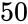\- chance of outcomes  and :

Depending on the outcome, the post-measurement state of the system will be either  or . If Bob then measures his half of the system, he’ll obtain the outcome opposite Alice’s. In other words, the measurement outcomes that Alice and Bob obtain are perfectly anti-correlated.

What if Alice and Bob choose to measure their respective halves of the EPR state  in the basis ? Using some basic calculations (see Exercise [9.3.5](./Chapter 9_ Quantum mechanics.md)), we can express the EPR state  in terms of the basis  as follows:

Observe that the state  has the same structure in the Hadamard basis as in the standard basis. Thus, Alice and Bob’s measurement outcomes will also be perfectly anti-correlated when measuring in the Hadamard basis.

A state  is called _entangled_ if it cannot be written as a tensor product of quantum states , where  describes the state held by Alice and  the state held by Bob. The EPR state  is _entangled_, which means it cannot be written as a tensor product of the quantum states of individual qubits:

for any . Since we cannot describe the EPR state  as the tensor product of two local states  and , we say it requires a _nonlocal_ description, which is another way of saying  is entangled.

There is something strange about the EPR state. If Alice measures her half of the state and finds , then we know immediately that Bob’s state will be . The collapse in the superposition on Alice’s side immediately causes a collapse of the superposition on Bob’s side. Note that Bob’s collapse will occur _immediately_, no matter how distant Bob’s system is from Alice’s. This is what the authors Einstein, Podolsky, and Rosen called “spooky action at a distance.” How could Bob’s system “know” to always produce the opposite outcome even at the other end of the universe?

Now imagine you have a whole bunch of physical systems prepared in the EPR state. Alice controls one half of each of the EPR pairs, while Bob controls the other half. This is a communication resource called _shared entanglement_. Many of the quantum information protocols make use of shared entanglement between Alice and Bob, to achieve novel communication tasks.

A useful perspective for thinking about quantum entanglement is to consider the information encoded in the quantum state. This is called the _information theory_ perspective on quantum mechanics. From the point of view of information, we can say a system is entangled whenever we know more about the system as a whole than about its parts. We have complete certainty about the state of the composite system , and complete uncertainty about the states of the individual subsystems controlled by Alice and Bob. When Alice measures her half of the entangled state, the two outcomes of the measurement are equally likely. Her measurement outcome essentially corresponds to a completely random bit, which encodes zero information. I would like to tell you more about quantum information theory, but let’s not go further off course.

Instead of discussing theory, let’s describe a practical scenario in which it is possible to know more about a whole system than about its constituent parts.

#####[Physics example](./Front matter.md)

We’ll now describe a physical process that leads to the creation of an entangled quantum state. Consider a quantum particle  that _decays_ into two quantum subparticles,  and 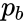. The decay process obeys various physics conservation laws; in particular, the total spin angular momentum before and after the decay must be conserved. Supposing the particle  has zero spin angular momentum before the decay, then the law of conservation of angular momentum dictates the subparticles  and  must have opposite spin. The spin angular momentum of each particle is in an unknown direction (up, down, left, right, in, or out), but whichever spin direction we measure for , the spin angular momentum of  immediately takes on the opposite direction. This way, regardless of the direction of their individual spins, their combined spin angular momentum will be zero, as required by the law of conservation of angular momentum.

The general scenario discussed above describes what would happen if a Helium atom were to explode, the two electrons in its ground state flying off to distant sides of the universe. The two electrons have opposite spins, but we don’t know the directions of the individual spins. The only thing we know is that their total spin equals zero, since the ground state of the Helium atom has spin zero. This is how the “anti-correlation in _any_ basis” aspect of quantum entanglement arises.

###[Summary](./Front matter.md)

We can summarize the concepts of quantum mechanics we learned in this chapter, and relate them to the concepts of linear algebra:

The quantum formalism embodied in the four postulates of quantum mechanics has been applied in describing many physical phenomena. Using complex vectors to represent quantum states leads to useful models and predictions for experimental outcomes. In the next section, we’ll use the quantum formalism to analyze the outcomes of the polarizing lenses experiment.

In addition to the applications of quantum principles, studying the structure of quantum states and operations is an interesting field on its own. An example of a quantum idea that is fundamentally new is the existence of _entangled_ quantum states. Later in this chapter, we’ll discuss an interesting application of quantum entanglement as part of the _quantum teleportation_ protocol, illustrated in[Figure 9.23](./Chapter 9_ Quantum mechanics.md) (page 9.23).

###[Exercises](./Front matter.md)

E9.10 Find the matrix representation of the projection matrices  and . Show that .

E9.11 Compute the probability of outcome “” for the measurement  performed on the quantum state .

E9.12 Given the state , find a quantum state  that is orthogonal to . Find the projection operators  and  that correspond to the measurements in the basis . Verify that . Compute the probability of outcome  when performing the measurement  on the state .

The state  satisfies .

E9.13 Given the two qubits  and , compute the tensor product state .

###[Links](./Front matter.md)

\[ Compact set of notes on QM written by a physicist \]

[`http://graybits.biz/notes/quantum_mechanics/preface`](./preface.md)

\[ Lecture series on QM written by a computer scientist \]

[`http://scottaaronson.com/democritus/lec9.html`](./lec9.md)

\[ Quantum mechanics summary written by a philosopher \]

[`http://plato.stanford.edu/entries/qm/`](./qm.md)

##[9.4 Polarizing lenses experiment revisited](./Chapter 9_ Quantum mechanics.md)

Let’s revisit the polarizing lenses experiment, this time modelling photons’ polarization states as two-dimensional complex vectors. We define the state of a horizontally polarized photon as 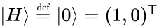, and the state of a vertically polarized photon as . This choice corresponds to the observation that horizontal and vertical polarizations are complementary. We shall interpret the polarizing lenses in the optical circuit both as state preparation and measurement steps. The measurement outcome we observe is whether photons pass through the complete optical circuit.

[Figure 9.14](./Chapter 9_ Quantum mechanics.md) illustrates the state preparation step we can use in experiments with photons. We can prepare photons in the states  or  by starting from unpolarized photons, and passing them through either an \-polarizing lens or a \-polarizing lens.

Figure 9.14: State preparation procedure for photons with horizontal or vertical polarization. Depending on our choice of \- or \-polarizing lens, we can prepare different quantum states.

Placing a polarizing lens in the path of a photon performs the measurement  of the photon’s polarization state. Using the lens to measure a photon’s polarization state yields two possible outcomes: “photon passes through lens” or “photon is reflected by lens.” The polarizing lens is the measurement apparatus, and the measurement corresponds to whether each photon that hits the lens is horizontally or vertically polarized.

[Figure 9.15](./Chapter 9_ Quantum mechanics.md) shows the projection operators that correspond to a measurement using a horizontally polarizing lens. The outcome “passes through” corresponds to the projection operator . The outcome “is reflected” corresponds to the projection matrix .

Figure 9.15: A horizontally polarizing lens corresponds to the quantum measurement . An incoming photon in the state  is asked to choose one of the two alternative paths. With probability , the photon passes through the \-polarizing lens and becomes horizontally polarized . With probability , the photon is reflected.

Recall that the probability of outcome  in a quantum measurement  is given by the expression , where  is the state of the incoming photon. Knowing the projection operators that correspond to the “passes through” and “is reflected” outcomes allows us to predict the probability that photons with a given state will pass through the lens.[Figure 9.16](./Chapter 9_ Quantum mechanics.md) illustrates a two-step experiment in which photons prepared in the horizontally polarized state  arrive at a \-polarizing lens. The probability that photons pass through the \-polarizing lens is

Indeed, we observe the same result in the lab—all  photons are rejected by the \-polarizing lens.

Figure 9.16: Photons prepared in the state  are rejected by the \-polarizing lens because the horizontally polarized state has zero overlap with the projector .

Let’s now use the quantum formalism to analyze the results of the three-lenses experiment we discussed earlier in the chapter.[Figure 9.17](./Chapter 9_ Quantum mechanics.md) shows the optical circuit that consists of a state preparation step and two measurement steps. The diagonally polarizing lens placed in the middle of the circuit only allows photons with \-diagonal polarization to pass through: 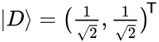. The projection operator associated with the “passes through” outcome of the diagonal polarization measurement is

The probability of  photons passing through the diagonal lens is

![\begin{align*}
\textrm{Pr}\!\left(\{ \textrm{pass through } D \textrm{ lens given state } \ket{H} \} \right)
&=
\left\| 
\ket{D}\!\bra{D}
\ket{H}
\right\|^2 									\\
&=
\left\|
\begin{bmatrix}
\frac{1}{2}	&	\frac{1}{2}	\\
\frac{1}{2}	&	\frac{1}{2}
\end{bmatrix}
\begin{bmatrix} 
1 \\
0
\end{bmatrix}
\right\|^2 									\\
&=
\left\|
\begin{bmatrix}
\frac{1}{2} \\ \frac{1}{2}
\end{bmatrix}
\right\|^2 									\\
&= \left(\tfrac{1}{2}\right)^2 + \left(\tfrac{1}{2}\right)^2	= \frac{1}{2}.
\end{align*}](./images/c4cd62bea73d51f7ce93f257fa33def2518804b0.png)

The post-measurement state of photons that make it through the diagonally polarizing lens is .

Figure 9.17: Photons prepared in the state  are subjected to two sequential measurements: a diagonal polarizing measurement 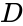 followed by a vertical polarizing measurement . The projection operators for the “is reflected” and “passes though” outcomes are indicated in each step.

Photons that pass through the middle lens are in the state . The probability of these photons passing through the \-polarizing lens is

The overall probability of a photon passing through both measurement lenses is 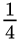.

This probability is consistent with the light intensity observations we see in[Figure 9.8](./Chapter 9_ Quantum mechanics.md) (page 9.8). Note the new interpretation that quantum mechanics provides for the same observations. We previously referred to the optical power  after the first measurement and optical power  after the second measurement. The quantum formalism predicts the probability  for photons to pass through the first lens and the probability  for the photons to reach the end of the circuit.

####[Discussion](./Front matter.md)

The polarizing lenses experiment illustrates some key aspects of the quantum formalism: the modelling of quantum states as vectors, the process of state preparation, and the effects of measurements on systems. Mainly, the experiment shows how a probabilistic approach for describing the light intensity in the circuit successfully predicts the experiment’s outcome.

Let’s compare the quantum interpretation of this experiment with a classical interpretation. It’s possible to explain all the observations of the polarizing lenses experiment using the classical theory of electromagnetic waves. Modelling the light beam as a classical wave allows us to understand the projections to the “passes through” orientation of the polarizing lenses. Because the light beam consists of many photons, it behaves like a continuous quantity that can be split: part of the wave passes through the lens while another part is reflected. Classical wave theory correctly predicts the qualitative aspects of the experiment shown in[Figure 9.17](./Chapter 9_ Quantum mechanics.md), but the light intensity is described in terms of optical power , which is the average squared amplitude of an electromagnetic wave. In contrast, quantum theory models photons as discrete packets of energy, and explains the outcome of the polarizing lenses experiment as the probability  that a photon will pass through the circuit. For this tabletop experiment, both the classical model of light (as a wave that can be infinitely subdivided) and the quantum model of light (as discrete particles) predict the same outcome. Therefore, the polarizing lenses experiment performed with a laser pointer does not serve as proof for the necessity of a quantum mechanical description of reality.

As we discussed in the introduction to this chapter, to really reveal quantum effects, we need to look at the very small-scale or very low-power regimes. It’s possible to reproduce the polarizing lenses experiment using a _single photon source_. A single photon source behaves like a super-weak laser pointer that emits only one photon at a time. When discussing the single photon regime, the classical theory of electromagnetic waves hits a wall, since a single photon cannot subdivide into parts—it is a quantum of light; a small, indivisible bundle of energy. Classical wave theory can correctly predict average optical power, but it can’t provide a clear picture of what exactly happens when individual photons hit a polarizing lens.

The polarizing lenses experiment is inspired by the famous _Stern–Gerlach experiment_, which is performed with the magnetic spin of silver atoms, and which involves a similar demonstration, comparable observed outcomes, and analogous reasoning. I encourage you to learn more about the original Stern–Gerlach experiment.

\[ The Stern–Gerlach experiment \]

[`https://en.wikipedia.org/wiki/Stern-Gerlach_experiment`](./Stern-Gerlach_experiment.md)

[`https://youtube.com/watch?v=rg4Fnag4V-E`](./watch_v=rg4Fnag4V-E.md)

##[9.5 Quantum mechanics is not that weird](./Chapter 9_ Quantum mechanics.md)

Without a doubt, you’ve heard that quantum mechanics is weird, mysterious, and generally “magical.” Well, unless vector operations count as magic, it’s not _that_ magical. In this section, we’ll single out three so-called “weird” aspects of quantum mechanics: superposition, interference, and the fact that quantum measurements affect the states of systems being measured.

###[Quantum superposition](./Front matter.md)

Classical binary variables (bits) can have one of two possible values:  or . Examples of physical systems that behave like bits are electric switches that can be either open or closed, digital transistors that either conduct or don’t conduct electricity, and capacitors that are either charged or discharged.

A quantum bit (qubit), can be both  and  _at the same time_. Wow! Said this way, it surely sounds impressive and mystical, no? But if we use the term _linear combination_ instead of “at the same time,” the quantum reality doesn’t seem so foreign. A quantum state is a linear combination of the basis states. This isn’t so crazy. The _superposition principle_ is a general notion in physics that is not specific to quantum phenomena, but applies to all systems described by differential equations. Indeed, superpositions exist in many classical physics problems, too.

#####[Example](./Front matter.md)

Consider a mass attached to a spring that undergoes simple harmonic motion. The differential equation that governs the motion of the mass is . This equation has two solutions:  and , corresponding to two different starting points of the oscillation. Since both  and  satisfy the equation , any linear combination of  and  is also a solution. Thus, the most general solution to the differential equation is of the form:

Usually we combine the  and  terms and describe the equation of motion for the mass-spring system in the equivalent form , where  and  are computed from  and . The mass-spring system might be described as undergoing both  motion and  motion “at the same time,” but do you see how ridiculous and incomplete this sounds?

The notion of _quantum superposition_ is simply a consequence of the general superposition principle for differential equations. If the quantum states  and  both represent valid solutions to a quantum differential equation, then the state of the system can be described as a linear combination of these two solutions:

The observation that “ is both  and  at the same time” is not wrong; it’s just not very useful. It’s much more precise to describe the quantum state  as a linear combination.

###[Interference](./Front matter.md)

Unlike particles that bounce off each other, waves can co-exist in the same place. The resulting wave pattern is the sum of the constituent waves. Quantum particles behave similarly to waves in certain experiments, and this can lead to _interference_ between quantum systems.

The prototypical example of interference is Young’s double-slit experiment, in which particles passing through two thin slits interact with each other, causing an interference pattern of alternating bright and dark spots on a screen. Classical physics models assume particles behave like tiny point-like balls that bounce off each other whenever they come in contact. A classical model predicts that particles will appear on the screen in two bright peaks, directly facing the two slits.

In contrast, the quantum model of a particle describes it as a travelling energy pulse that exhibits wave-like properties[2](./Front matter.md) In a quantum model, the particles passing through the slits behave like waves and can combine constructively or destructively, depending on the relative distances travelled by the particles. Similar interference patterns occur whenever waves combine, as in the example of waves on the surface of a liquid, or sound waves.

Figure 9.18: The waves emitted by two synchronized sources form an interference pattern. Observe the stripes of destructive interference where the waves meet “out of sync” (peak to trough) and cancel each other out.

Performing Young’s double-slit experiment reveals a pattern of bright and dark stripes (called fringes) on the screen in support of the quantum model. The locations of the dark fringes correspond exactly to the places where particles passing through the two slits arrive “out of sync,” and combine destructively:

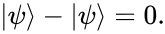

The locations where destructive interference occurs correspond to the dark fringes on the screen, where no particles arrive.

The idea that one wave can cancel another wave is not new. What _is_ new is the observation that particles behave like waves that can interfere with each other. That’s definitely new. Indeed, interference was one of the first puzzling effects of quantum systems that was observed. Observations from interference experiments forced physicists to attribute wave-like properties to particles.

\[ Video demonstration of Young’s double-slit experiment \]

[`https://youtube.com/watch?v=qCmtegdqOOA`](./watch_v=qCmtegdqOOA.md)

###[Measurement of a system affects the system’s state](./Front matter.md)

Another seemingly weird aspect of quantum mechanics is the notion that quantum measurements can affect the states of the systems being measured. This phenomenon is not attributable to some sort of quantum magic, but is rather due to the energy scale and the size of systems where quantum physics comes into play. Let’s see why.

When we think about physical systems on the scale of individual atoms, we can no longer consider ourselves (and our physical measurement apparatuses) as passive observers of these systems. Instead, we need to account for the _interactions_ between quantum systems and the measurement apparatuses used to observe them. The fact that measurements affect the state of the very systems they measure is not some magical process, but rather a consequence of the natural properties of the particles themselves. The particles we observe are affected by our measurement methods.

###[Wave functions](./Front matter.md)

The quantum mechanics techniques we discussed in this chapter are useful for modelling physical systems that have discrete sets of states. In _matrix quantum mechanics_, quantum states are described by vectors in finite-dimensional, complex inner product spaces. Other physics problems require the use of _wave function quantum mechanics_, in which quantum states are represented as complex-valued functions of space coordinates . Instead of the dot product between vectors, the inner product for wave functions is . This may seem like a totally new ball game, but actually calculations using wave functions are not too different from the inner product calculations we used to compute Fourier transformations in[Section 7.11](./Chapter 7_ Applications.md).

It’s beyond the scope of the current presentation to discuss _wave functions_ in detail, but I want to show you an example of a calculation with wave functions, so you won’t say I didn’t show you some proper physics stuff. The ground state of the hydrogen atom is described by the wave function , where . The probability of finding the electron at position 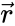 from the proton is described by the inner product :

Since  depends only on the distance , we know the wave function has a spherically symmetric shape, as illustrated in[Figure 9.19](./Chapter 9_ Quantum mechanics.md).

Figure 9.19: The  orbital of an electron is spherically symmetric.

We’ll now check whether  is a properly normalized probability density function. Integrating the probability density function  over all of  should give a total probability of one. Instead of Cartesian coordinates , we’ll use spherical coordinates  to solve this problem. In spherical coordinates, the volume of a thin slice from the surface of a sphere of width , height , and thickness  is given by . If you haven’t seen spherical coordinates before, don’t worry about this expression too much. The conversion factor  is a trick for converting the “small piece of volume”  to an equivalent small piece of volume in spherical coordinates . See [3.6](./Chapter 3_ Computational linear algebra.md) for the derivation.

We split the triple integral into two parts: an integral that depends only on the radius , and double integral over the angles  and . The total probability of finding the electron somewhere in space is

![\begin{align*}
p_{\textrm{total}} 
&= \int\!\!\!\int\!\!\!\int_{\mathbb{R}^3} |\psi(\vec{r})|^2  \; d^3\vec{r}  \\
&= 
\int_0^\infty \!\!\! \int_0^{2\pi} \!\!\! \int_0^\pi  
|\psi(r)|^2  \; r^2 \sin \phi \; d\phi \, d\theta \, dr   					\\
&= 
\left(\int_0^\infty \!\! \frac{1}{\pi a^3}\exp(-2r/a)  \; r^2 \,   dr   \right)
\left(\int_0^{2\pi}\!\!\!\int_0^\pi \!\! \sin \phi \, d\phi \, d\theta  \right)		\\				    &= 
\left(\int_0^\infty  \frac{1}{\pi a^3}\exp(-2r/a)  \; r^2 \,   dr \right)
\left( 4\pi \right)												\\
&= 
\int_0^\infty \!\! \underbrace{\frac{4}{a^3} \exp\left(-\frac{2 r}{a}\right) r^2}_{p(r)} \, dr.
\end{align*}](./images/9bd75e430da8691cd411725dd5e108cdf694e1f0.png)

The expression  describes the probability of finding the electron at a distance  from the centre of the nucleus. We can complete the calculation of total probability by taking the integral of  from  to :

The purpose of working through this wave function calculation is to give you an idea of the complex calculations physicists regularly perform using the wave function formalism. In comparison, the matrix formalism for quantum mechanics is much simpler, involving only basic linear algebra calculations.

##[9.6 Quantum mechanics applications](./Chapter 9_ Quantum mechanics.md)

What can we accomplish using quantum physics that we can’t do using classical physics? What can we compute with qubits that we can’t compute with bits? You’ve learned about the quantum formalism; but how useful is it? In this section, we’ll explore some areas of physics and computer science that wouldn’t exist without the laws of quantum mechanics.

###[Particle physics](./Front matter.md)

The basic quantum mechanics formalism we learned in this chapter is not appropriate for describing the behaviour of high energy particles. The best current model for describing high energy physics is called _quantum field theory_. Quantum field theory is a generalization of basic quantum mechanics that models fundamental particles as disturbances in various _particle fields_. Recall that photons, the quanta of light, are described as disturbances of the electromagnetic field. The equations of quantum field theory describe how elementary particles and antiparticles are created and destroyed, and the various interactions between different particle fields. Quantum field theory is a bit like chemistry, where different combinations of atoms are transformed into other combinations of atoms—only instead of atoms, we have elementary particles like quarks and leptons. In the same way _Mendeleev’s periodic table_ is a catalogue of all available atoms, the _Standard Model_ of particle physics is a catalogue of all available elementary particles. These elementary particles combine to form other, more complex particles, like protons and neutrons. The transformations of these particles are only observed in high energy physics experiments performed in particle accelerators.

High energy physics becomes important at the extreme end of an energy continuum, where quantum field theory is most applicable. In contrast, the rules of chemistry dominate the low-energy end of the energy continuum. Chemical reactions describe how molecules transform into other molecules; and molecules essentially represent the various ways electrons are shared between groups of atoms. At higher energies, atoms are “stripped” of their electrons; the atoms have so much energy, they’re no longer bound to the nucleus. At this point, the laws of chemistry are no longer relevant, since electrons and molecules move freely. Enter nuclear physics, which studies the combinations of protons and neutrons that form the nuclei of different atoms. A nuclear reaction is like a chemical reaction, but instead of chemical molecules, the reactant and products are various types of nuclei. An example of nuclear reaction is the fusion of two heavy hydrogen nuclei to form a helium nucleus. At higher energy still, even protons and neutrons can break apart, and the analysis shifts to interactions between elementary particles like leptons, bosons, neutrinos, quarks, and photons. This is the domain of high energy physics.

The basic postulates of quantum mechanics still apply in quantum field theory, but the models become more complicated since we assume even the interactions between particles are quantized. You can think of the basic quantum mechanics described in this chapter as learning the alphabet, and quantum field theory as studying Shakespeare, including the invention of new words. Studying quantum field theory requires new math tools like path integrals, new intuitions like symmetry observations, and new computational tricks like _renormalization_.

The essential way of thinking about photons, electrons, and the interactions between them can be obtained by reading Richard Feynman’s short book titled _QED_, which stands for _quantum electrodynamics_. In this tiny book, Feynman uses the analogy of a “tiny clock” attached to each particle to explain the phase  of a wave function. From this simple analogy, the author builds to explain complex concepts (path integrals, for instance) at the graduate level of quantum field theory. I highly recommended this book; it’s a wonderful chance to learn from one of the great scientists in the field and one of the best physics teachers of all times.

\[ The Standard Model of particle physics \]

[`https://en.wikipedia.org/wiki/Standard_Model`](./Standard_Model.md)

\[BOOK\] Richard P. Feynman. _QED: The strange theory of light and matter_. Princeton University Press, 2006, ISBN 0691125759.

###[Solid state physics](./Front matter.md)

Physicists have sought to understand the inner structure of materials since the first days of physics. As they’ve learned, they’ve developed numerous applications, from semiconductors to lasers, photovoltaic batteries (solar panels), light emitting diodes (LEDs). These applications all depend on materials with specially engineered conductivity properties. Indeed, working with the conductivity of materials gives us insight into their other properties. We can classify materials into the following general conductivity-type groups: insulators, metals, and semi-conductors. These categories correspond to materials with different _energy band structures_.

Insulators are the most boring type of material, because their energy band structure doesn’t permit any interesting chemical interactions. Take glass, for instance—just a clump of silica (). The term _glass_ is used in physics to describe any material made of randomly oriented molecules that lack a specific crystal structure.

Conductors are more interesting. A hand-wavy explanation of conductivity would be to say the electrons in conductors like aluminum and copper are “free to move around.” Solid state physics allows for a more precise understanding of the phenomenon. Using quantum mechanical models, we can determine the energy levels that electrons can occupy, and predict how many electrons will be available to conduct electricity.

Semiconductors are the most interesting type of material since they can switch between conductive and non-conductive states. The _transistor_, the invention that makes all electronics possible, consists of a sandwich of three different types of semiconductors. The voltage applied to the middle section of a transistor is called the _gate voltage_, and it controls the amount of current that can flow through the transistor. If the gate voltage is set to `ON` (think  in binary), then semiconducting material is biased; free electrons are available in its conduction band, and current can flow through. If the gate voltage is set to `OFF` (think  in binary), then the conduction band is depleted and the transistor won’t conduct electricity. The improvements in semiconductor technologies—specifically the ability to pack billions of transistors into a tiny microprocessor chip—have been fuelling the ongoing computer revolution pretty much since transistors were first commercialized. In summary, no solid state physics = no mobile phones.

Quantum mechanics is used so much in solid state physics that we could suitably nickname the field “applied quantum physics.”

\[ Simple explanation of energy band structure and conductivity \]

[`https://wikipedia.org/wiki/Electrical_resistivity_and_conductivity`](./Electrical_resistivity_and_conductivity.md)

###[Superconductors](./Front matter.md)

Certain materials exhibit surprising physical properties at very low temperatures. By low temperatures, I mean _really low_, like C; a temperature close to _absolute zero_, the temperature at which all molecules stop. You’d exhibit surprising properties too if your were placed in an environment this cold! Take for example the properties of different metals, which are generally considered to have low electric resistance. There are regular conductors like aluminum that have low resistance, and high-end conductors like silver that have even lower resistance, and then there are _superconductors_ which have zero resistance. Superconductors are an example of a purely quantum phenomenon that cannot be explained by classical physics.

Some of the most iconic landmarks of modern scientific progress, like magnetic resonance imaging (MRI) machines and magnetically levitating bullet trains, are made possible by superconductor technology. Superconductors offer zero resistance to electric current, which means they can support much stronger currents than regular conductors like aluminum and silver. All these applications require extensive refrigeration equipment to keep the materials at a temperature where they behave like superconductors.

\[ Superconductivity \]

[`https://en.wikipedia.org/wiki/Superconductivity`](./Superconductivity.md)

###[Quantum optics](./Front matter.md)

Classical optics deals with beams of light that contain quintillions of photons. A _quintillion_ is , which is more than a lot. When working with this many photons, it’s possible to model light beams as continuous electromagnetic waves, and use classical electromagnetic theory and optics to understand experiments. Quantum optics comes into play when we perform optics experiments that involve far fewer photons, including experiments with single photons. When a single photon travels through an optical circuit, it cannot “split” like a continuous wave. For example, when a beam of light hits a half-silvered mirror, we say the beam is partially reflected. However, we can’t say the same for a single photon, since the photon cannot be split. Instead, the state of the photon after it has encountered a half-silvered mirror is best described as a superposition of the “passed through” and “reflected” states, as shown in[Figure 9.11](./Chapter 9_ Quantum mechanics.md) (page 9.11).

An example of a quantum optics effect is the _spontaneous downconversion effect_, in which a single photon is absorbed by a material and then reemitted as two photons with an entangled polarization state:

By the crystal’s properties, we know one of the two emitted photons has horizontal polarization and the other has vertical polarization, but we don’t know which is which. Such entangled photons can be used as starting points for other experiments that involve entanglement. Another interesting aspect of quantum optics are the so-called _squeezed states_ that can be detected more accurately than regular (unsqueezed) photons.

Quantum optics is a field of active research. Scientists in academia and industry study exotic photon generation, advanced photon detection schemes, and generally explore how photons can most efficiently carry information.

\[ Basic principles in physics of light \]

[`https://materialford.wordpress.com/introduction-to-research-light/`](./introduction-to-research-light.md)

###[Quantum cryptography](./Front matter.md)

Performing a quantum measurement on the state  tends to disturb the state. From the perspective of experimental physics, this disturbance is an obstacle since it gives us limited, one-time access to the quantum state , making the study of quantum states more difficult. From the perspective of cryptography however, the state-disturbing aspect of quantum measurement is an interesting and potentially valuable property. If Alice transmits a secret message to Bob encoded in the state of a quantum system, it would be impossible for an eavesdropper Eve to “listen in” on the state unnoticed because Eve’s measurement would disturb the state. The _BB84 protocol_, named after its inventors Charles Bennett and Gilles Brassard, is based on this principle.

The standard basis  and the Hadamard basis  are _mutually unbiased bases_, which means that a basis vector from one basis lies exactly halfway between the vectors from the other basis. If we measure the state  (or ) in the basis , the outcomes  and  are equally unlikely. Similarly, measuring  (or ) in the basis  produces outcomes “” and “” with equal probability. The use of mutually unbiased bases is central to the security of the BB84 protocol, which we’ll describe step by step:

1.  Alice starts with  random candidate bits which she sends to Bob. Roughly half of the candidate bits will live on to become the final shared secret key, while the other half will be discarded. She chooses one of the bases  or  at random when encoding each bit of information she wants to send. Bob chooses to perform his measurement randomly, either in the standard basis or in the Hadamard basis. The information is transmitted correctly whenever Bob happens to pick the same basis as Alice, which happens about half the time. Whenever Bob’s basis for measurement is different from the basis Alice uses for encoding, Bob’s output is completely random.
2.  Alice and Bob publicly announce the basis they used for each transmission and discard the bits where different bases were used. This leaves Alice and Bob with roughly  candidate bits of secret key.
3.  Alice and Bob then publicly reveal  of the candidate bits, which we’ll call the check bits. Assuming the quantum communication channel between Alice and Bob does not introduce any noise, Alice and Bob’s copies of the check bits should be identical, since they used the same basis. If they observe many check bits that disagree, Alice and Bob will immediately abort the protocol.
4.  If the  check bits agree, then Alice and Bob can be sure the remaining  bits they share are known only to them.

Consider what happens if the eavesdropper Eve tries to intercept the messages between Alice and Bob. Eve can measure the quantum state  sent by Alice, then forward to Bob the post measurement state . Eve is forced to choose a basis for the measurement she performs, and her measurement disturbs the state  whenever she picks a basis different from the one used by Alice. Since it’s not possible to measure quantum systems without disturbing them, the eavesdropper Eve reveals her presence by introducing errors in the transmitted data. Some of the _check bits_ Alice and Bob compare in Step 3 will disagree, and thus Alice and Bob will know that someone is eavesdropping on them. Though quantum mechanics does not prevent eavesdropping, it does give Alice and Bob the ability to detect when an eavesdropper is present.

The BB84 protocol established the beginning of a new field at the intersection of computer science and physics that studies _quantum key distribution_ protocols. The field has developed rapidly from theory to research, and today there are even commercial quantum cryptography systems. It’s interesting to compare quantum cryptography with the public key cryptography systems discussed in[Section 7.9](./Chapter 7_ Applications.md). The security of the RSA public-key encryption is based on the computational difficulty of factoring large numbers. The security of quantum cryptography is guaranteed by the laws of quantum mechanics.

\[ Bennett–Brassard quantum cryptography protocol from 1984 \]

[`https://en.wikipedia.org/wiki/BB84`](./BB84.md)

\[ Using quantum phenomena to distribute secret keys \]

[`https://en.wikipedia.org/wiki/Quantum_key_distribution`](./Quantum_key_distribution.md)

###[Quantum computing](./Front matter.md)

The idea of quantum computing has existed since the early days of quantum mechanics. Richard Feynman originally proposed the idea of a _quantum simulator_ in 1982, which is a quantum apparatus that can simulate the quantum behaviour of another physical system. Imagine a device that can simulate the behaviour of physical systems that would otherwise be too difficult and expensive to build. The quantum simulator would be much better at simulating quantum phenomena than any simulation of quantum mechanics on a classical computer.

Another possible application of a quantum simulator could be to encode classical mathematical optimization problems as constraints in a quantum system, then let the quantum evolution of the system “search” for good solutions. Using a quantum simulator in this way, it might be possible to find solutions to optimization problems much faster than any classical optimization algorithm could.

Once computer scientists started thinking about quantum computing, they weren’t satisfied with studying optimization problems alone, and they set out to qualify and quantify all the computational tasks that are possible with qubits. A quantum computer stores and manipulates information that is encoded as quantum states. It’s possible to perform certain computational tasks on a quantum computer much faster than on any classical computer. We’ll discuss _Grover’s search algorithm_ and _Shor’s factoring algorithm_ below, but first let’s introduce the basic notions of quantum computing.

#####[Quantum circuits](./Front matter.md)

Computer scientists like to think of quantum computing tasks as series of “quantum gates,” in analogy with the logic gates used to construct classical computers.[Figure 9.20](./Chapter 9_ Quantum mechanics.md) shows an example of a quantum circuit that takes two qubits as inputs and produces two qubits as outputs.

Figure 9.20: A quantum circuit that applies the Hadamard gate to the first qubit, then applies the controlled-NOT gate from the first qubit to the second qubit.

This circuit in[Figure 9.20](./Chapter 9_ Quantum mechanics.md) is the combination of two quantum gates. The first operation is to apply the Hadamard gate  on the first qubit, leaving the second qubit untouched. This operation is equivalent to multiplying the input state by the matrix . The second operation is called the _controlled-NOT_ (or controlled-) gate, definition-CNOT which applies the  operator (also known as the NOT gate) to the second qubit whenever the first qubit is , and does nothing otherwise:

The circuit illustrated in[Figure 9.20](./Chapter 9_ Quantum mechanics.md) can be used to create entangled quantum states. If we input the quantum state  into the circuit, we obtain the maximally entangled state  as output, as depicted in[Figure 9.21](./Chapter 9_ Quantum mechanics.md).

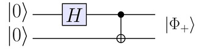

Figure 9.21: Inputting  into the circuit produces an EPR state  on the two output wires of the circuit.

Quantum circuits can also represent quantum measurements.[Figure 9.22](./Chapter 9_ Quantum mechanics.md) shows how a quantum measurement in the standard basis is represented.

Figure 9.22: Measurement in the standard basis . The projectors of this measurement are  and .

We use double lines to represent the flow of classical information in the circuit.

#####[Quantum registers](./Front matter.md)

Consider a quantum computer with a single register  that consists of three qubits. The quantum state of this quantum register is a vector in :

where the tensor product  is used to combine the quantum states of the individual qubits. We’ll call this the “physical representation” of the register and use \-based indexing for the qubits. Borrowing language from classical computing, we’ll call the rightmost qubit the _least significant_ qubit, and the leftmost qubit the _most significant_ qubit.

The tensor product of three vectors with dimension two is a vector with dimension eight. The quantum register  is thus a vector in an eight-dimensional vector space. The quantum state of a three-qubit register can be written as:

where  are complex components. We’ll call this eight-dimensional vector space the “logical representation” of the quantum register. Part of the excitement about quantum computing is the huge size of the “logical space” where quantum computations take place. The logical space of a \-qubit quantum register has dimension . That’s  complex components we’re talking about. That’s a big state space for just a 10-qubit quantum register. Compare this with a 10-bit classical register, which can store one of  discrete values.

We won’t discuss quantum computing further here, but I still want to show you some examples of single-qubit quantum operations and their effect on the tensor product space, so you’ll have an idea of the craziness that is possible.

#####[Quantum gates](./Front matter.md)

Let’s say you’ve managed to construct a quantum register; what can you do with it? Recall the single-qubit quantum operations , , and  we described earlier. We can apply any of these operations on individual qubits in the quantum register. For example, applying the 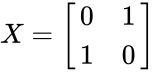 gate to the first (most significant) qubit of the quantum register corresponds to the following quantum operation:

The operator  “toggles” the first qubit in the register while leaving all other qubits unchanged.

Yes, I know the tensor product operation is a bit crazy, but that’s the representation of composite quantum systems and operations so please get used to it. What if we apply the  operator to the middle qubit?

Compare the structure of the operators  and . See how the action of s affects different parts of the tensor product space ?

To complete the picture, let’s also see the effects of applying the  gate to the third (least significant) qubit in the register:

Crazy stuff, right? Don’t worry, in time you’ll get used to the space-within-a-space structure concept.

####[Okay, so what?](./Front matter.md)

Quantum computers give us access to a very large state space. The fundamental promise of quantum computing is that a small set of simple quantum operations (quantum gates) can be used to perform interesting computational tasks. Sure it’s difficult to interact with and manipulate quantum systems, but the space is so damn big that it’s worth checking out what kind of computing you can do in there. It turns out there are already several useful things you can do using a quantum computer. The two flagship applications for quantum computing are Grover’s search algorithm and Shor’s factoring algorithm.

#####[Grover’s search algorithm](./Front matter.md)

Suppose you’re given an unsorted list of  items and you want to find a particular item in that list. This is called an _unstructured search problem_. This is a hard problem to solve for a classical computer since the algorithm must parse through the entire list, which takes roughly  steps. In contrast, the unstructured problem can be solved in roughly  steps on a quantum computer using _Grover’s search algorithm_.

The quantum speed for the unstructured search problem sure is nice, but it’s really nothing to get excited about. The real money-maker for the field of quantum computing has been Shor’s factoring algorithm for factoring products of prime numbers.

#####[Shor’s factoring algorithm](./Front matter.md)

The security of the RSA cryptosystem we discussed in[Section 7.9](./Chapter 7_ Applications.md) is based on the assumption that factoring products of large prime numbers is computationally intractable. Given the product 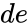 of two unknown prime numbers  and , it is computationally difficult to find the factors  and . No classical algorithm is known that can factor large numbers; even the letter agencies will have a hard time finding the factors of  when  and  are chosen to be sufficiently large prime numbers. Thus, if an algorithm that could quickly factor large numbers existed, attackers would be able to break many of the current security systems. _Shor’s factoring algorithm_ fits the bill, theoretically speaking.

Shor’s algorithm reduces the factoring problem to the problem of _period finding_, which can be solved efficiently using the quantum Fourier transform. Shor’s algorithm can factor large numbers efficiently (in polynomial time). This means RSA encryption would be easily hackable by running Shor’s algorithm on a sufficiently large, and sufficiently reliable quantum computer. The letter agencies are excited about this development since they’d love to be able to hack all present-day cryptography. Can you imagine not being able to log in securely to any website because Eve is listening in, hacking your crypto using her quantum computer?

Currently, Shor’s algorithm is only a _theoretical_ concern. Despite considerable effort, no quantum computers exist today that can manipulate quantum registers with thousands of qubits.

###[Discussion](./Front matter.md)

Quantum computing certainly presents interesting possibilities, but it’s a little early to imagine a quantum computing revolution in tomorrow’s newspaper. As with startup ventures, it’s the implementation that counts—not the idea. The current status of quantum computing as a technology is mixed. On one hand, certain quantum algorithms performed in logical space are very powerful; on the other hand, the difficulty of building a quantum computer is not to be underestimated.

It’s also important to keep in mind that quantum computers are not better at solving arbitrary computational problems than the computers we already use. The problems that may benefit from a quantum speedup have a particular structure, which can be tackled with a choreographed pattern of constructive and destructive interference in quantum registers. Yet not all computationally hard problems have this structure. Quantum computing technology is at a crossroad: it could become a revolutionary development, or it could turn out that building a large-scale quantum computer is not worth the engineering challenge. So although it’s cool we can execute certain tasks faster on a quantum computer, don’t throw out your classical computer just yet.

Even if the quest to build a quantum computer doesn’t pan out, we’re certain to learn many interesting things about fundamental physics along the way. Besides, learning about the fundamental nature of quantum information is more scientifically valuable than trying to hack people’s email. In the next section, we’ll give an example of a new communication task that was discovered through the study of quantum information science.

#####[Quantum teleportation](./Front matter.md)

[Figure 9.23](./Chapter 9_ Quantum mechanics.md) illustrates a surprising aspect of quantum information: we can “teleport” a quantum state  from one lab to another. The quantum state  starts in the first qubit of the register, which is held by Alice, and ends in the third qubit, which is in Bob’s lab, but there is no quantum communication channel between the two labs. This is why the term “quantum teleportation” was coined to describe this communication task, since the state  seems to materialize in Bob’s lab like the teleportation machines used in Star Trek.

The communication resources required for the quantum teleportation protocol are one maximally entangled state shared between Alice’s and Bob’s labs, and two bits of classical communication from Alice to Bob. We can express the quantum teleportation protocol as a quantum circuit.

Figure 9.23: The first two qubits are in Alice’s lab. The state of the first qubit  is transferred into the third qubit , which Bob controls. We say  is “teleported” from Alice’s lab to Bob’s lab because the quantum state ends up in Bob’s lab, but there is no quantum communication channel connecting the labs. The state teleportation happens thanks to the pre-shared entanglement and the two bits of classical information.

The quantum teleportation protocol requires that Alice and Bob pre-share a maximally-entangled state . By meeting in a central location, Alice and Bob can produce an entangled state using the circuit shown in[Figure 9.21](./Chapter 9_ Quantum mechanics.md) (page 9.21). Alice and Bob then bring their respective halves of the entangled state to their labs. Note Bob’s lab could be very far from Alice’s lab; in another building, another city, or even on the other side of the world.

The initial state for the quantum teleportation protocol is

Alice has two qubits in her lab, the state  and half of the entangled state, and Bob has the third qubit, which is the other half of the entangled state. At the end of the teleportation protocol, information about the state  appears in Bob’s lab: .

Without quantum communication, it seems impossible for Alice to communicate the components  and  to Bob. The pre-shared entanglement between Alice and Bob somehow enables this feat. The quantum information about the state  becomes available in Bob’s lab as soon as Alice performs the measurement of her two qubits. But before Bob obtains the state information, he must apply a _recovery operation_, which is one of , , , or . The state information will remain unknown until Bob learns which of the four recovery operations he must perform on the state. The information about which operation Bob should perform can be transmitted by classical means: Alice can shout the result to Bob if he’s next door, tell him the results by phone, or send him a text message. After applying the needed recovery operation, Bob obtains the state , which is the state that originated in the first qubit controlled by Alice.

The need for pre-shared entanglement  between Alice and Bob is analogous to how Alice and Bob needed to pre-share a secret key 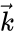 in order to use the one-time pad encryption protocol. Indeed, pre-shared entangled states are a prime resource in quantum information science. The _superdense coding protocol_ is another surprising application of quantum entanglement. With this protocol, Alice can communicate two bits of classical information to Bob by sending him a single qubit and consuming one pre-shared entangled state.

####[Links](./Front matter.md)

\[ Quantum simulators and practical implementations \]

[`https://en.wikipedia.org/wiki/Quantum_simulator`](./Quantum_simulator.md)

\[ Some data about the difficulty of RSA factoring \]

[`https://en.wikipedia.org/wiki/RSA_numbers`](./RSA_numbers.md)

\[ Video tutorials on quantum computing by Michael Nielsen \]

[`http://michaelnielsen.org/blog/quantum-computing-for-the-determined/`](./quantum-computing-for-the-determined.md)

\[ Grover’s algorithm for unstructured search \]

[`https://en.wikipedia.org/wiki/Grover’s_algorithm`](./Grover's_algorithm.md)

\[ Shor’s algorithm for factoring products of prime integers \]

[`https://en.wikipedia.org/wiki/Shor’s_algorithm`](./Shor's_algorithm.md)

\[ Emerging insights on limitations of quantum computing \]

[`https://archive.siam.org/pdf/news/100.pdf`](./100.pdf.md)

###[Quantum error-correcting codes](./Front matter.md)

Quantum states are finicky things. Every interaction of a qubit with its environment corrupts the quantum information the qubit stores. In the previous section we talked about quantum computing in the abstract, assuming the existence of an ideal noiseless quantum computer. Since the real world is a noisy place, constructing a practical quantum computer is a much greater challenge.

Recall that errors caused by noise are also a problem for classical computers. If classical computers can be made robust to errors using error-correcting codes, can we use error-correcting codes on quantum computers too? Indeed it’s possible to use _quantum error-correcting codes_ to defend against the effects of quantum noise. Keep in mind, quantum error-correcting codes are more complicated to build than their classical counterparts, so it’s not an obvious thing to do, but it can be done.

We won’t go into too much detail, but it’s worth pointing out the following interesting fact about quantum error correction. Building quantum error-correcting codes that can defend against a finite set of errors is sufficient to defend against all possible types of errors. The use of quantum error-correcting schemes is analogous to the classical error-correcting schemes we saw in[Section 7.10](./Chapter 7_ Applications.md). We encode  qubits of data that we want to protect from noise into a larger \-qubit state. The encoded state can support some number of errors before losing the data. The error-correcting procedure involves a syndrome measurement on a portion of the state, and “correction” operators applied to the remaining portion. I encourage you to follow the links below to learn more about this topic.

Building reliable quantum gates is a formidably complicated task due to the difficulty of protecting qubits from noise while simultaneously enabling quantum operations and strong interactions between qubits. It is the author’s opinion that Feynman’s original idea of building quantum simulators for physical systems will be the first useful applications in quantum computing.

\[ More on quantum error-correcting codes \]

[`https://en.wikipedia.org/wiki/Quantum_error_correction`](./Quantum_error_correction.md)

###[Quantum information theory](./Front matter.md)

Classical information theory studies problems like the compression of information and the transmission of information through noisy communication channels. Quantum information theory studies the analogous problems of compression of quantum information and communication over noisy quantum channels.

The appearance of the word “theory” in “quantum information theory” should indicate that this is a mostly theoretical area of research that studies problems in the abstract. The main results of information theory are abstract theorems that may not have direct bearing on practical communication scenarios. For now, applications of quantum information theory remain in the far-off future, but that’s how it is with theory subjects in general. The classical information theorems proven in the 1970s probably looked a bit useless, too; but these theorems serve as the basis of all modern wireless communications. Perhaps the purely theoretical quantum information theorems of today will solve the practical communication problems of the future.

Current efforts in quantum information theory aim to establish capacity results for quantum channels. Some of the existing results are directly analogous to classical capacity results. Other problems in quantum information theory, like the use of entanglement-assisted codes, have no classical counterparts and require a completely new way of thinking about communication problems. The book _From Classical to Quantum Shannon Theory_ by Mark M. Wilde is an excellent guide to the field.

Recently, quantum theory has been applied to novel communication systems, and there is a growing interest from the communications industry to develop applications that push optical communication channels to the bounds of their theoretical efficiency. Essentially, quantum networks are being invented in parallel with quantum computers, so that when we finally build quantum computers, we’ll be able to connect them together, presumably so they can share funny cat videos. What else would we use them for?

\[BOOK\] Mark M. Wilde. _From Classical to Quantum Shannon Theory_, Cambridge University Press, Second edition, ISBN 1107176166,[`http://arxiv.org/abs/1106.1445`](./1106.1445.md).

###[Conclusion](./Front matter.md)

With this chapter, I wanted to bring you closer to the fascinating subject of quantum mechanics. I hope the material helped you understand the basic principles of quantum mechanics and clarified some of the sensational mythology surrounding the “mysteries” of the quantum world. While there’s still much to discover, there’s nothing too counterintuitive about quantum mechanics; it’s just linear algebra, right?

One hundred years ago, quantum mechanics was seen as a foreign subject not to be trusted. In time, physicists developed good models, found better ways to explain experiments, wrote good books, and even started teaching the subject to undergraduate students. This gives me hope for humanity that we can handle even the most complex and uncertain topics when we put our minds to it.

Today we face many complex problems: consolidated corporate control of innovation, cartels, corruption, eroding democratic government systems, the militarization of everything, and conflicting ideologies. We have Sunni and Shia brothers shooting at each other and red gang versus blue gang brothers shooting at each other, and all of this for no good reason. We have all kinds of other bullshit divisions between us.

Let’s hope that one hundred years from now, we’ll have learned to limit the violent and corrupt aspects of human nature, so that we can realize the potential of every child born anywhere in the world. Right now it seems like it won’t be an easy change, but this is how it seemed when people were trying to figure out quantum mechanics, too. All it takes is a critical mass of people who realize and truly internalize the fact we’re all on the same team, and all the divisions we see between us are pure bullshit. If we make sure that two generations of kids grow up without economic strife or bullets flying by their heads, then—I guarantee you—they will be able to figure out the rest. Together, an educated citizenry armed with the knowledge of math, history, science, and technology is more powerful than a dozen Systems combined. All the System has is an outdated hierarchical power structure and capital to pay people and make them do as they’re told. We’ve got six billion people, the internet, and printing presses on our side. Who do you think will win?

##[9.7 Quantum mechanics problems](./Chapter 9_ Quantum mechanics.md)

Let’s recap what just happened here. Did we really cover all the topics of an introductory quantum mechanics course? Yes, we did! Thanks to your solid knowledge of linear algebra, learning the postulates of quantum mechanics took only a few dozen pages. Sure we went quickly and skipped the more physics-y topics, but we covered all the core ideas of quantum theory.

But surely it’s impossible to learn quantum mechanics in such a short time? Well, you tell me. You’re here. The problems are here. Prove to me you’ve really learned quantum mechanics by tackling the practice problems presented in this section like a boss. It’s the end of the book, so don’t be saving your energy. Solve these problems and then you’re done.

P9.1 You work in a quantum computing startup and your boss asks you to implement the quantum gate . Can you do it?

Recall the requirements for quantum gates.

P9.2 The  gate is defined as . Compute the effect of the operator  on the vectors of the standard basis .

P9.3 Compute .

Use the Hadamard gate’s properties to simplify the calculation.

P9.4 Specifying an arbitrary vector  requires four parameters: the real and imaginary parts of  and . Thus one might think that qubits have four _degrees of freedom_. However, the unit-length requirement and the fact that we can ignore the global phase of a qubit correspond to additional constraints that reduce the number of degrees of freedom. How many parameters are required to specify a general quantum state ?

P9.5 We can write any qubit using only two real parameters:

where  and . What are the ranges of values for  and  such that all qubits can be represented?

P9.6 Consider the parametrization for qubits using two angles  and :

What values should  and  have for all qubits to be represented?

P9.7 Compute the products of the quantum gates 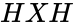 and .

P9.8 Consider the state  and its orthogonal complement . The projection operators  and  correspond to the measurements in the basis . Compute the probability of outcome 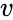 in the measurement  on the state .

P9.9 When we measure a quantum system  in the basis , the Born rule tells us the probability of outcome  is equal to . Consider this calculation that involves the trace operation:

![\begin{align*}
\Pr(\{0\} | \psi )
&=	\bra{\psi}\Pi_0\ket{\psi}
=
\bra{\psi}
\begin{bmatrix} 1&0 \\  0 &0 \end{bmatrix}
\ket{\psi}
=
\Tr \left\{
\bra{\psi}
\begin{bmatrix} 1&0 \\  0 &0 \end{bmatrix}
\ket{\psi}
\right\}														\\
&\stackrel{(c)}{=} 	\Tr \left\{
\begin{bmatrix} 1&0 \\  0 &0 \end{bmatrix}
\ketbra{\psi}{\psi}
\right\}
=  \Tr \bigg\{
\begin{bmatrix} 1&0 \\  0 &0 \end{bmatrix}
\underbrace{
\begin{bmatrix} |\alpha|^2 & \overline{\beta}\alpha \\  \overline{\alpha}\beta &|\beta|^2 \end{bmatrix}
}_{\text{density matrix}}
\bigg\}															\\
&=	\Tr \bigg\{
\begin{bmatrix}|\alpha|^2 & \overline{\beta}\alpha \\  0 & 0 \end{bmatrix}
\bigg\} = |\alpha|^2.
\end{align*}](./images/0d59d283597e778bb88e28a332d8fa1c488586b6.png)

The equality labelled  follows from the cyclic property of the trace operation . The above calculation suggests an alternative approach for computing the probabilities of different outcomes of quantum measurements, , where  is the[_density matrix_](./Density_matrix.md) representation of the quantum state. The density matrix of the quantum state  corresponds to the outer product . Calculate the probability of outcome  using . Calculate the probabilities of the two outcomes of a measurement in the Hadamard basis  and .

P9.10 This problem explores the operation of the quantum teleportation circuit shown in[Figure 9.23](./Chapter 9_ Quantum mechanics.md) (see page 9.23). The initial state of the three-qubits register is , where  is a quantum state Alice wants to send to Bob, and where  is a maximally entangled state shared between Alice and Bob.

1.  Show the following equation holds by expanding the tensor product:
    
    ![\ket{\psi}_1 \otimes \ket{\Phi_+}_{23}
    =
    \tfrac{1}{\sqrt{2}}\left[  \alpha\ket{000}_{123}+\beta\ket{100}_{123}+\alpha\ket{011}_{123}+\beta\ket{111}_{123}\right].](../Images/db4ba18b37bf3061c1748732cc78cba659fa6841.png)
    
2.  The expression from part **a)** can be written as a linear combination of the four Bell states: , , , and . Verify the equation
    
    ![\begin{align*}
    &\!\! \tfrac{1}{\sqrt{2}}\!\left[  \alpha\ket{000}_{123}+\beta\ket{100}_{123}+\alpha\ket{011}_{123}+\beta\ket{111}_{123}\right]	\\
    & \quad \;  =  \tfrac{1}{2}\Big[
    \ket{\Phi_{+}}_{12} \ket{\psi}_{3}
    +\ket{\Phi_{-}}_{12}Z\ket{\psi}_{3}
    +\ket{\Psi_{+}}_{12}X\ket{\psi}_{3}
    +\ket{\Psi_{-}}_{12}XZ\ket{\psi}_{3}
    \Big].
    \end{align*}](../Images/addd0d6c85d7cd2d111409260ee94a1168ac4185.png)
    
3.  A _Bell measurement_ consists of the combination of a controlled-NOT gate and a Hadamard gate on the first qubit, followed by measurements of both qubits in the standard basis, as illustrated in the circuit below.
    
    
    
    Using the definition of the controlled-NOT gate (page ) and the Hadamard gate (page ), show that the Bell measurement performed on the state  produces the classical measurement outcome . Similarly, show that measuring  produces , measuring  produces , and measuring  produces .
4.  After Alice performs the Bell measurement on the two qubits under her control, the state of Bob’s qubit will be one of the following:  if the measurement outcome is ,  if outcome is ,  if outcome is , or  if outcome is . Indicate the _recovery operation_ Bob must apply in order to recover the state  in each case.

P9.11 The wave function of the electron of the hydrogen atom is . The electron’s distance from the centre is described by the random variable  with probability distribution 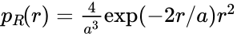. Calculate the expected distance of the electron ![\mathbb{E}_R[R]=\int_{r=0}^{r=\infty}  r \psub{R}(r)\,dr](../Images/f7d24939aa7a8b70af36c7cdecc14642aaa38005.png).

You can solve this problem using integration by parts once.

P9.12 Show that the functions  and  are orthogonal with respect to the inner product .

P9.13 Consider a model of a particle in a one-dimensional box of width one. The state of the particle is described by the wave function , where ![x \in[0,1]](../Images/65a2d9d879fac5ae093905ee17598d3528954e49.png). Find the probability of observing  in the first quarter of the box ( between  and ) for the following wave functions: **a)** 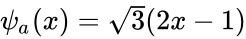, **b)** , **c)** a constant wave function .

The probability of finding the particle somewhere in the interval ![[a,b]](../Images/3ec6e408e98e8d96932dfe13e4692577e912d0aa.png) is computed using the integral .
