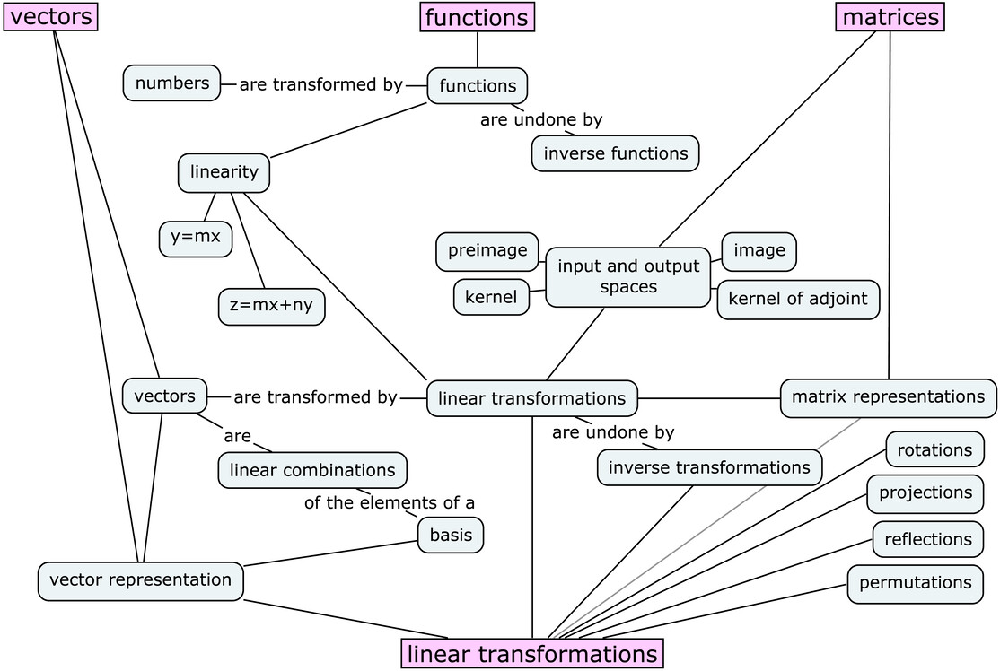

Chapter 0      

# No Bullshit Guide to Linear Algebra

# 

## Ivan Savov

## June 4, 2021

# Contents

-  [Concept maps](./Front matter.md)
-  [Preface](./Front matter.md)
-  [Introduction](./Front matter.md)
-  [Chapter 1 Math fundamentals](./Chapter 1_ Math fundamentals.md)
-   -  [1.1 Solving equations](./Chapter 1_ Math fundamentals.md)
    -  [1.2 Numbers](./Chapter 1_ Math fundamentals.md)
    -  [1.3 Variables](./Chapter 1_ Math fundamentals.md)
    -  [1.4 Functions and their inverses](./Chapter 1_ Math fundamentals.md)
    -  [1.5 Basic rules of algebra](./Chapter 1_ Math fundamentals.md)
    -  [1.6 Solving quadratic equations](./Chapter 1_ Math fundamentals.md)
    -  [1.7 The Cartesian plane](./Chapter 1_ Math fundamentals.md)
    -  [1.8 Functions](./Chapter 1_ Math fundamentals.md)
    -  [1.9 Functions reference](./Chapter 1_ Math fundamentals.md)
    -  [1.10 Geometry](./Chapter 1_ Math fundamentals.md)
    -  [1.11 Trigonometry](./Chapter 1_ Math fundamentals.md)
    -  [1.12 Trigonometric identities](./Chapter 1_ Math fundamentals.md)
    -  [1.13 Vectors](./Chapter 1_ Math fundamentals.md)
    -  [1.14 Complex numbers](./Chapter 1_ Math fundamentals.md)
    -  [1.15 Solving systems of linear equations](./Chapter 1_ Math fundamentals.md)
    -  [1.16 Set notation](./Chapter 1_ Math fundamentals.md)
    -  [1.17 Math problems](./Chapter 1_ Math fundamentals.md)
-  [Chapter 2 Intro to linear algebra](./Chapter 2_ Intro to linear algebra.md)
-   -  [2.1 Definitions](./Chapter 2_ Intro to linear algebra.md)
    -  [2.2 Vector operations](./Chapter 2_ Intro to linear algebra.md)
    -  [2.3 Matrix operations](./Chapter 2_ Intro to linear algebra.md)
    -  [2.4 Linearity](./Chapter 2_ Intro to linear algebra.md)
    -  [2.5 Overview of linear algebra](./Chapter 2_ Intro to linear algebra.md)
    -  [2.6 Introductory problems](./Chapter 2_ Intro to linear algebra.md)
-  [Chapter 3 Computational linear algebra](./Chapter 3_ Computational linear algebra.md)
-   -  [3.1 Reduced row echelon form](./Chapter 3_ Computational linear algebra.md)
    -  [3.2 Matrix equations](./Chapter 3_ Computational linear algebra.md)
    -  [3.3 Matrix multiplication](./Chapter 3_ Computational linear algebra.md)
    -  [3.4 Determinants](./Chapter 3_ Computational linear algebra.md)
    -  [3.5 Matrix inverse](./Chapter 3_ Computational linear algebra.md)
    -  [3.6 Computational problems](./Chapter 3_ Computational linear algebra.md)
-  [Chapter 4 Geometric aspects of linear algebra](./Chapter 4_ Geometric aspects of linear algebra.md)
-   -  [4.1 Lines and planes](./Chapter 4_ Geometric aspects of linear algebra.md)
    -  [4.2 Projections](./Chapter 4_ Geometric aspects of linear algebra.md)
    -  [4.3 Coordinate projections](./Chapter 4_ Geometric aspects of linear algebra.md)
    -  [4.4 Vector spaces](./Chapter 4_ Geometric aspects of linear algebra.md)
    -  [4.5 Vector space techniques](./Chapter 4_ Geometric aspects of linear algebra.md)
    -  [4.6 Geometric problems](./Chapter 4_ Geometric aspects of linear algebra.md)
-  [Chapter 5 Linear transformations](./Chapter 5_ Linear transformations.md)
-   -  [5.1 Linear transformations](./Chapter 5_ Linear transformations.md)
    -  [5.2 Finding matrix representations](./Chapter 5_ Linear transformations.md)
    -  [5.3 Change of basis for matrices](./Chapter 5_ Linear transformations.md)
    -  [5.4 Invertible matrix theorem](./Chapter 5_ Linear transformations.md)
    -  [5.5 Linear transformations problems](./Chapter 5_ Linear transformations.md)
-  [Chapter 6 Theoretical linear algebra](./Chapter 6_ Theoretical linear algebra.md)
-   -  [6.1 Eigenvalues and eigenvectors](./Chapter 6_ Theoretical linear algebra.md)
    -  [6.2 Special types of matrices](./Chapter 6_ Theoretical linear algebra.md)
    -  [6.3 Abstract vector spaces](./Chapter 6_ Theoretical linear algebra.md)
    -  [6.4 Abstract inner product spaces](./Chapter 6_ Theoretical linear algebra.md)
    -  [6.5 Gram–Schmidt orthogonalization](./Chapter 6_ Theoretical linear algebra.md)
    -  [6.6 Matrix decompositions](./Chapter 6_ Theoretical linear algebra.md)
    -  [6.7 Linear algebra with complex numbers](./Chapter 6_ Theoretical linear algebra.md)
    -  [6.8 Theory problems](./Chapter 6_ Theoretical linear algebra.md)
-  [Chapter 7 Applications](./Chapter 7_ Applications.md)
-   -  [7.1 Balancing chemical equations](./Chapter 7_ Applications.md)
    -  [7.2 Input–output models in economics](./Chapter 7_ Applications.md)
    -  [7.3 Electric circuits](./Chapter 7_ Applications.md)
    -  [7.4 Graphs](./Chapter 7_ Applications.md)
    -  [7.5 Fibonacci sequence](./Chapter 7_ Applications.md)
    -  [7.6 Linear programming](./Chapter 7_ Applications.md)
    -  [7.7 Least squares approximate solutions](./Chapter 7_ Applications.md)
    -  [7.8 Computer graphics](./Chapter 7_ Applications.md)
    -  [7.9 Cryptography](./Chapter 7_ Applications.md)
    -  [7.10 Error-correcting codes](./Chapter 7_ Applications.md)
    -  [7.11 Fourier analysis](./Chapter 7_ Applications.md)
    -  [7.12 Applications problems](./Chapter 7_ Applications.md)
-  [Chapter 8 Probability theory](./Chapter 8_ Probability theory.md)
-   -  [8.1 Probability distributions](./Chapter 8_ Probability theory.md)
    -  [8.2 Probability problems](./Chapter 8_ Probability theory.md)
-  [Chapter 9 Quantum mechanics](./Chapter 9_ Quantum mechanics.md)
-   -  [9.1 Polarizing lenses experiment](./Chapter 9_ Quantum mechanics.md)
    -  [9.2 Quantum information processing](./Chapter 9_ Quantum mechanics.md)
    -  [9.3 Postulates of quantum mechanics](./Chapter 9_ Quantum mechanics.md)
    -  [9.4 Polarizing lenses experiment revisited](./Chapter 9_ Quantum mechanics.md)
    -  [9.5 Quantum mechanics is not that weird](./Chapter 9_ Quantum mechanics.md)
    -  [9.6 Quantum mechanics applications](./Chapter 9_ Quantum mechanics.md)
    -  [9.7 Quantum mechanics problems](./Chapter 9_ Quantum mechanics.md)
-  [End matter](./End matter.md)
-  [Answers and solutions](./End matter.md)
-  [Notation](./End matter.md)

#[Concept maps](./Front matter.md)

Figure 1: This diagram shows the concepts and topics covered in this book.

Figure 2:[Chapter 5](./Chapter 5_ Linear transformations.md) is about linear transformations and their properties.

Figure 3:[Chapter 6](./Chapter 6_ Theoretical linear algebra.md) covers theoretical aspects of linear algebra.

Figure 4: Matrix computations play an important role throughout this book. Matrices are used to represent linear transformations, systems of linear equations, and various geometric operations.

Figure 5: The book concludes with three chapters on linear algebra applications. In[Chapter 7](./Chapter 7_ Applications.md) we’ll discuss applications to science, economics, business, computing, and signal processing. In[Chapter 8](./Chapter 8_ Probability theory.md) we’ll explain probability theory, and finally in[Chapter 9](./Chapter 9_ Quantum mechanics.md) we’ll introduce quantum mechanics.

You can annotate the concept maps with your current knowledge of each concept to keep track of your progress. Add a single dot () next to all concepts you’ve heard of, two dots () next to concepts you think you know, and three dots () next to concepts you’ve used in exercises and problems. By collecting some dots every week, you’ll be able to move through the material in no time at all.

If you don’t want to mark up your book, you can download a printable version of the concept maps here:[`bit.ly/LAcmaps`](./LAcmaps.md).

#[Preface](./Front matter.md)

This is a book about linear algebra and its applications. The material is presented at the level of a first-year university course, in an approachable style that cuts to the point. It covers both practical and theoretical aspects of linear algebra, with extra emphasis on explaining the connections between concepts and building a solid understanding of the material.

This book is designed to **give readers access to advanced math modelling tools regardless of their academic background**. Since the book includes all the prerequisites needed to learn linear algebra, it’s suitable for readers of any skill level—including those who don’t feel comfortable with fundamental math concepts.

###[Why learn linear algebra?](./Front matter.md)

Linear algebra is one of the most fundamental and all-around useful subjects in mathematics. The practical skills learned by studying linear algebra—such as manipulating vectors and matrices—form an essential foundation for applications in physics, computer science, statistics, machine learning, and many other fields of scientific study. Learning linear algebra can also be a lot of fun. Readers will experience numerous _knowledge buzz_ moments when they feel math ideas “click” into place and understand the connections between concepts.

The tools of linear algebra form a bridge to more advanced areas of mathematics. For example, learning about _abstract vector spaces_ will help readers recognize the common “vector space structure” in seemingly unrelated mathematical objects like matrices, polynomials, and functions. Linear algebra techniques apply not only to standard vectors, but to _all_ mathematical objects that are vector-like!

###[What’s in this book?](./Front matter.md)

Each section is a self-contained tutorial that covers the definitions, formulas, and explanations associated with a single topic. Check out the concept maps on the preceding pages to see the book’s many topics and the connections between them.

The book begins with a review chapter on numbers, algebra, sets, equations, functions, geometry, and trigonometry [Chapter 1](./Chapter 1_ Math fundamentals.md)). If you haven’t previously studied these concepts, or if you feel your math skills are a little “rusty,” read this chapter and work through the exercises and problems provided. If you feel confident in your high school math abilities, jump straight to[Chapter 2](./Chapter 2_ Intro to linear algebra.md), where the linear algebra begins.

Chapters[2](./Chapter 2_ Intro to linear algebra.md)[6](./Chapter 6_ Theoretical linear algebra.md) cover the core topics of linear algebra: vectors, bases, analytical geometry, matrices, linear transformations, matrix representations, vector spaces, inner product spaces, eigenvectors, and matrix decompositions. These chapters contain the material required for every university-level linear algebra course. Each section contains plenty of exercises so you can test your understanding as you read; and each chapter concludes with an extensive list of problems for further practice.

Chapters[7](./Chapter 7_ Applications.md),[8](./Chapter 8_ Probability theory.md), and[9](./Chapter 9_ Quantum mechanics.md) discuss various applications of linear algebra. Though this material isn’t likely to appear on any final exam, these chapters serve to demonstrate the power of linear algebra techniques and their relevance to many areas of science. The mini-course on quantum mechanics [Chapter 9](./Chapter 9_ Quantum mechanics.md)) is unique to this book. Read this chapter to understand the fascinating laws of physics that govern the behaviour of atoms and photons.

###[Is this book for you?](./Front matter.md)

The quick pace and lively explanations in this book provide interesting reading for students and non-students alike. Whether you’re learning linear algebra for a course, reviewing material as a prerequisite for more advanced topics, or generally curious about the subject, this book will help you find your way in the land of linear algebra.

Students and educators can use this book as the main textbook for any university-level linear algebra course. It contains everything students need to know to prepare for a linear algebra final exam. Don’t be fooled by the book’s small size compared to other textbooks: it’s all in here. The text is compact because we’ve distilled the essentials and removed the unnecessary crud.

###[Publisher](./Front matter.md)

The starting point of the **No Bullshit Guide** textbook series dates back to my student days when I was required to purchase expensive course textbooks, which were long and tedious to read. I said to myself, “Something must be done,” and started a publishing company to produce textbooks that explain math and physics concepts clearly, concisely, and affordably.

Minireference Co. is a publisher specializing in math and science. Our goal is to make advanced math modelling tools accessible to everyone by producing affordable textbooks that explain math concepts clearly and concisely. It’s time for a break from traditional textbooks that are expensive, heavy, and tedious to read. The books in the **No Bullshit Guide** series are an efficient and enjoyable alternative for learning mathematical subjects.

###[About the author](./Front matter.md)

I have been teaching math and physics for more than 17 years as a private tutor. Through this experience, I learned to break complicated ideas into smaller, interconnected chunks that are easy to understand. An interesting feedback loop occurs when students learn concepts in small, manageable chunks: they experience _knowledge buzz_ whenever concepts “click” into place, and this excitement motivates them to continue learning more. I know this from first-hand experience, both as a teacher and as a student. I completed my undergraduate studies in electrical engineering, then stayed on to earn a M.Sc. in physics, and a Ph.D. in computer science from McGill University. Linear algebra played a central role throughout my studies. With this book, I want to share with you some of what I’ve learned about this expansive subject.

Ivan Savov Montreal, 2020

#[Introduction](./Front matter.md)

In recent years we’ve seen countless advances in science and technology. Modern science and engineering fields have developed advanced models for understanding the real world, predicting the outcomes of experiments, and building useful technology. Although we’re still far from obtaining a “theory of everything” that can fully explain reality and predict the future, we do have a significant understanding of the natural world on many levels: physical, chemical, biological, ecological, psychological, and social. And, since mathematical models are leveraged throughout these fields of study, anyone interested in contributing to scientific and technological advances must also understand mathematics.

The linear algebra techniques you’ll learn in this book are some of the most powerful mathematical modelling tools that exist. At the core of linear algebra lies a very simple idea: _linearity_. A function  is _linear_ if it obeys the equation

where  and  are any two inputs of the function. We use the term _linear combination_ to describe any expression constructed from a set of variables by multiplying each variable by a constant and adding the results. In the above equation, the linear combination  of the inputs  and  is transformed into the linear combination  of the outputs of the function  and . **Essentially, linear functions transform a linear combination of inputs into the** _**same**_ **linear combination of outputs.** If the input to the linear function  consists of five parts  and three parts , then the output of the function will consist of five parts  and three parts . That’s it, that’s all! Now you know everything there is to know about linear algebra. The rest of the book is just details.

###[Linear models are super useful](./Front matter.md)

A significant proportion of the math models used in science describe _linear relationships_ between quantities. Mathematicians, scientists, engineers, and business analysts develop and use linear models to make sense of the systems they study. Linear models are popular because they are **easy to describe mathematically**. We can obtain the parameters of a linear model for a real-world system by analyzing the system’s behaviour for relatively few inputs. Let’s illustrate this important point with an example.

#####[Example](./Front matter.md)

You’re visiting an art gallery. Inside, the screen of a tablet computer is being projected onto a giant wall. Anything you draw on the tablet instantly appears projected onto the wall. However, the tablet’s user interface doesn’t give any indication about how to hold the tablet “right side up.” How can you find the correct orientation of the tablet so your drawing won’t appear rotated or upside-down?

Figure 6: An unknown linear transformation  maps “tablet coordinates” to “wall coordinates.” How can we characterize ?

The tablet’s screen is a two-dimensional _input space_ described by coordinates  and the wall projection is a two-dimensional _output space_ described by wall coordinates . You’re looking for the unknown transformation  that maps the pixels of the tablet screen (the input space) to the projection on the wall (the output space):

This task is directly analogous to the tasks scientists and engineers face every day when trying to model real-world systems by observing how systems transform inputs to outputs. If the unknown transformation  is linear, you can learn what it is very quickly, using only two swipes on the tablet screen.

To understand how  transforms screen coordinates  to wall coordinates , you can use this two-step “probing” procedure:

1.  Draw a horizontal line on the tablet to represent the \-direction in the input space . You observe the output  projected on the wall. This tells you horizontal lines are transformed to northeast diagonal lines in the wall-projection space.
2.  Draw a vertical line in the \-direction  on the tablet. You observe the output  appears on the wall. This means vertical lines on the tablet screen turn into northwest diagonal lines when projected on the wall.

Figure 7: Drawing a short horizontal arrow  on the tablet screen results in a northeast diagonal projection on the wall . Drawing a vertical arrow  on the tablet results in a northwest diagonal line projected on the wall .

Here comes the interesting part: now that you know the outputs  and  produced for the two input directions, you can **predict the linear transformation’s output for any other input.** Let’s look at the math equations that show why this is true.

Suppose you want to predict what will appear on the wall if you draw a line on the tablet in the direction . The coordinates  describe a swipe with length  units in the \-direction and  units in the \-direction. The input coordinates  can be written as . Because you know  is linear, the wall projection of this input will have a length equal to  times the \-direction output  plus  times the \-direction output :

Figure 8: The linear transformation  maps the input  to the output .

Knowing that the input  produces the output  and the input  produces the output  allows you to determine the linear transformation’s output for all other inputs. Every input  can be written as a linear combination: . Since you know  is linear, you know the corresponding output will be

Since you can predict the output of  for all possible inputs, you have obtained a complete characterization of the linear transformation .

The “probing procedure” we used to characterize the two-dimensional tablet-to-wall linear transformation (denoted ) can be used to study arbitrary linear transformations with \-dimensional inputs and \-dimensional outputs (denoted ). **Knowing the outputs of a linear transformation  for all “directions” in its input space gives us a complete characterization of .**

#####[TL;DR](./Front matter.md)

The linear property allows us to analyze multidimensional systems and processes by studying their effects on a small set of inputs. This is the essential reason linear models are used so widely in science. Without this linear structure, characterizing the behaviour of unknown input-output systems would be a much harder task.

###[Linear transformations](./Front matter.md)

Linear transformations will be a central topic throughout this book. You can think of linear transformations as “vector functions” and understand their properties as analogous to the properties of the regular functions you’re familiar with. The action of a function on a number is similar to the action of a linear transformation on a vector:

![\begin{align*}   \textrm{function } f:\mathbb{R}\to \mathbb{R}        & \; \Leftrightarrow \;    \textrm{linear transformation }    T:\mathbb{R}^{n}\! \to \mathbb{R}^{m}   \\   \textrm{input }  x\in \mathbb{R}          & \; \Leftrightarrow \;         \textrm{input }  \vec{x} \in \mathbb{R}^n   \\   \textrm{output } f(x) \in \mathbb{R}        & \; \Leftrightarrow \;      \textrm{output }      T(\vec{x}) \in \mathbb{R}^m  \\   \; \; \; \; \;    \textrm{inverse function } f^{-1}        & \; \Leftrightarrow \;          \textrm{inverse transformation } T^{-1}     \\         \textrm{roots of } f        & \; \Leftrightarrow \;          \textrm{kernel of } T           \end{align*}](./images/f9f0b3b9f2059fc5bac3d0bdcb8e96c91a0a9f59.png)

Studying linear algebra will expose you to many new topics associated with linear transformations. You’ll learn about concepts like vector spaces, projections, rotations, and orthogonalization procedures. Indeed, a first linear algebra course introduces many advanced, abstract ideas; yet all the new ideas you’ll encounter can be seen as extensions of ideas you’re already familiar with. Linear algebra is the vector-upgrade to your high school knowledge of functions.

###[Prerequisites](./Front matter.md)

To understand linear algebra, you must have some preliminary knowledge of fundamental math concepts like numbers, equations, and functions. For example, you should be able to tell me the meaning of the parameters  and  in the equation . If you do not feel confident about your basic math skills, don’t worry.[Chapter 1](./Chapter 1_ Math fundamentals.md) is a prerequisites chapter specially designed to help bring you quickly up to speed on the high school math material.

###[Executive summary](./Front matter.md)

The book is organized into nine chapters. Chapters[2](./Chapter 2_ Intro to linear algebra.md) through[6](./Chapter 6_ Theoretical linear algebra.md) are the core of linear algebra. Chapters[7](./Chapter 7_ Applications.md) through[9](./Chapter 9_ Quantum mechanics.md) contain optional reading about linear algebra applications. The concept maps on pages 1, 2, and 4 illustrate the connections between the topics we’ll cover. I know the maps may seem informationally intimidating at first sight, but don’t worry—the book is split into tiny chunks, and we’ll navigate the material step by step. It will be like Mario World, but in  dimensions and with a lot of bonus levels.

[Chapter 2](./Chapter 2_ Intro to linear algebra.md) is a general introduction to linear algebra. Linear algebra is the math of vectors and matrices, so we’ll start by defining the mathematical operations we can perform on vectors and matrices.

In[Chapter 3](./Chapter 3_ Computational linear algebra.md), we’ll tackle the computational aspects of linear algebra. By the end of this chapter you’ll know how to solve systems of equations, transform a matrix into its _reduced row echelon form_, compute the product of two matrices, and find the _determinant_ and the _inverse_ of a square matrix. Each of these computational tasks can be tedious to carry out by hand and can require lots of steps. There is no way around this; we must do the grunt work before we get to the cool stuff.

In[Chapter 4](./Chapter 4_ Geometric aspects of linear algebra.md), we’ll review the properties and the equations that describe basic geometric objects like points, lines, and planes. We’ll learn how to compute projections onto vectors, projections onto planes, and distances between objects. We’ll also review the meaning of vector coordinates, which are lengths measured with respect to a basis. We’ll learn about linear combinations of vectors, the _span_ of a set of vectors, and formally define what a _vector space_ is.

[Chapter 5](./Chapter 5_ Linear transformations.md) is about linear transformations. Armed with the computational tools from[Chapter 3](./Chapter 3_ Computational linear algebra.md) and the geometric intuition from[Chapter 4](./Chapter 4_ Geometric aspects of linear algebra.md), we can tackle the core subject of linear algebra: linear transformations. We’ll explore in detail the correspondence between linear transformations () and their representation as  matrices. We’ll also learn how the entries in a matrix representation depend on the choice of basis for the input and output spaces of the transformation.[Section 5.4](./Chapter 5_ Linear transformations.md) on the invertible matrix theorem serves as a midway checkpoint for your understanding of linear algebra. This theorem connects several seemingly disparate concepts: reduced row echelon forms, matrix inverses, and determinants. The invertible matrix theorem links all these concepts and highlights the properties of invertible linear transformations that distinguish them from non-invertible transformations.

[Chapter 6](./Chapter 6_ Theoretical linear algebra.md) covers more advanced theoretical topics of linear algebra. We’ll define the _eigenvalues_ and the _eigenvectors_ of a square matrix. We’ll see how the eigenvalues of a matrix tell us important information about the properties of the matrix, and learn about the special names given to different types of matrices based on the properties of their eigenvalues. In[Section 6.3](./Chapter 6_ Theoretical linear algebra.md) we’ll discuss _abstract vector spaces_. Abstract vectors are mathematical objects that—like vectors—have components and can be scaled, added, and subtracted by manipulating their components.[Section 6.7](./Chapter 6_ Theoretical linear algebra.md) will discuss linear algebra with complex numbers.

In[Chapter 7](./Chapter 7_ Applications.md), we’ll discuss the applications of linear algebra. If you’ve done your job learning the material in the first six chapters, you’ll get to learn all the cool things you can do with linear algebra.[Chapter 8](./Chapter 8_ Probability theory.md) will introduce the basic concepts of probability theory.[Chapter 9](./Chapter 9_ Quantum mechanics.md) contains an introduction to quantum mechanics.

Figure 9: The dependency structure of the chapters in the book.

[Figure 9](./Front matter.md) shows the prerequisite structure between the chapters. If you’re new to linear algebra, it would be best to read the chapters in order. If you already have some experience with the subject, you can skip ahead to the parts you’re interested in. Use the table of contents, the concept maps on pages 1–4 to navigate the book. The chapters and sections in the book are self-contained so they will make sense even if you read them out of order.

###[Difficulty level](./Front matter.md)

In terms of difficulty, I must prepare you to get ready for some serious uphill pushes. As your personal “trail guide” up the mountain of linear algebra, it’s my obligation to warn you about the difficulties that lie ahead.

Linear algebra is a difficult subject because it requires developing your computational skills, your geometric intuition, and your abstract thinking—all at the same time! The computational aspects of linear algebra are not particularly difficult, but they can be boring and repetitive. You’ll have to carry out hundreds of steps of basic arithmetic. The geometric problems you’ll encounter in[Chapter 4](./Chapter 4_ Geometric aspects of linear algebra.md) can be tough at first, but they’ll get easier once you learn to draw diagrams and develop your geometric reasoning. The theoretical aspects of linear algebra are difficult because they require a new way of thinking, which resembles what doing “real math” is like. You must not only understand and use the material; you must also know how to _prove_ mathematical statements using the definitions and properties of math objects.

In summary, much toil awaits you as you learn the concepts of linear algebra, but the effort is totally worth it. All the brain sweat you put into understanding vectors and matrices will lead to mind-expanding insights. You will reap the benefits of your efforts for the rest of your life as your knowledge of linear algebra opens many doors for you.
