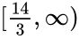

Chapter 10    

##[Chapter 8 solutions](part0010_split_011.md)

### Answers to exercises

**E8.1** **a)** . **b)** . **c)** . **E8.2** , . **E8.3** , , and . **E8.4**   and . **E8.5** **a)** ; **b)** ; **c)** . **E8.6** . **E8.7** **a)** ; **b)** ; **c)** ; **d)** ; **e)** ; **f)** ; **g)** ; **h)** . **E8.8** **a)** ; **b)** ![(-\infty,-5]](../images/02509.jpeg); **c)** ; **d)** ; **e)** ; **f)**   ![(-\infty,-4]](../images/02513.jpeg)  .

### Solutions to selected exercises

**E8.1** See[https://www.desmos.com/calculator/ocedywekcl](./ocedywekcl.md) for plots.

**E8.5** **a)** Since the compounding is performed monthly, we first calculate the monthly interest rate: . The sum Jack owes after 10 years is . **b)** The calculation that uses the effective annual interest rate is more direct: . **c)** When compounding infinitely often at a nominal annual interest rate of , the amount owed will grow by  each year. After 10 years Jack will owe .

**E8.6** Since there are two different interest rates in effect, we must perform two separate calculations. At the end of the first five years, Kate owes . For the remaining five years, the interest changes to , so the sum Kate owes after 10 years is .

**E8.8** **a)** Dividing both sides of the inequality by two gives . **b)** Divide both sides by negative four to obtain . Note the “” changed to “” since we divided by a negative number. **c)** If the absolute value of  is less than five, then  must lie in the interval . We can therefore rewrite the inequality as , then add three to both sides to obtain , and divide by two to obtain the final answer . **d)** Let’s collect all the \-terms on the right and all the constants on the left: , which leads to . **e)** To simplify, add two to both sides of the inequality to obtain . You remember how to add fractions right? We have , and therefore . Multiply both sides by two to obtain . **f)** The first step is to get rid of the square by taking the square root operation on both sides: . Recall that , so we have . There are two ways for the absolute value of  to be greater than three. Either  or . We subtract one in each of these inequalities to find  or . The solution to this inequality is the union of these two intervals.
